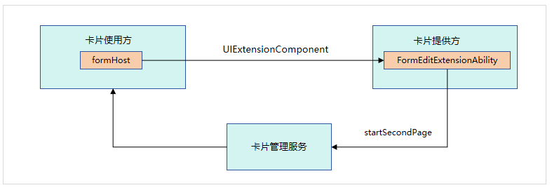

# ArkTS卡片页面编辑交互概述

桌面提供统一的卡片编辑页。卡片提供方通过[FormEditExtensionAbility](../reference/apis-form-kit/js-apis-app-form-formEditExtensionAbility.md)组件的上下文FormEditExtensionContext提供的[startSecondPage](../reference/apis-form-kit/js-apis-inner-application-formEditExtensionContext.md#startsecondpage)方法，将卡片提供方的二级编辑页信息传递给桌面，桌面将二级编辑页拉起后即可进行页面内容编辑。

卡片页面编辑的主要流程如下图所示。

**图1** 卡片编辑流程示意图

1. 用户点击卡片编辑，卡片提供方会继承[FormEditExtensionAbility](../reference/apis-form-kit/js-apis-app-form-formEditExtensionAbility.md)，从而实现卡片编辑功能。

2. 卡片使用方识别到卡片提供方继承[FormEditExtensionAbility](../reference/apis-form-kit/js-apis-app-form-formEditExtensionAbility.md)后，拉起卡片提供方一级编辑页。

3. 卡片提供方在[FormEditExtensionAbility](../reference/apis-form-kit/js-apis-app-form-formEditExtensionAbility.md)被拉起的回调方法[onSessionCreate](../reference/apis-ability-kit/js-apis-app-ability-uiExtensionAbility.md#uiextensionabilityonsessioncreate)中，调用[FormEditExtensionContext](../reference/apis-form-kit/js-apis-inner-application-formEditExtensionContext.md)的[startSecondPage](../reference/apis-form-kit/js-apis-inner-application-formEditExtensionContext.md#startsecondpage)方法，将需要拉起的卡片提供方二级页面信息传递给卡片管理服务。

4. 卡片管理服务将接收到的卡片提供方二级页面信息传递给卡片使用方。

5. 卡片使用方在接收到卡片提供方二级页面信息后，拉起二级页面，即可进行页面内容编辑。