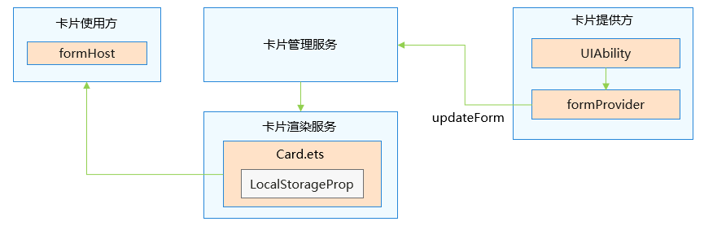
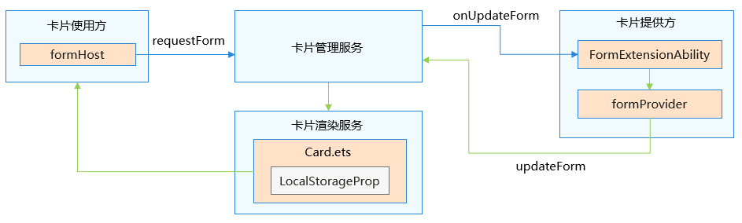
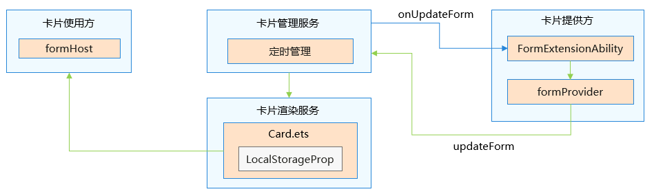

# 卡片内容更新

ArkTS卡片框架为提供方提供了[updateForm](../reference/apis-form-kit/js-apis-app-form-formProvider.md#updateform)接口、为使用方提供了requestForm接口来实现主动触发卡片的页面刷新能力；另外卡片框架还会通过开发者声明的定时信息按需通知提供方进行卡片刷新。

卡片UI代码内通过[LocalStorageProp](../quick-start/arkts-localstorage.md#localstorageprop)可以获得提供方推送的需要刷新的卡片数据。

| 接口 | 是否系统能力 | 约束 |
| -------- | -------- | -------- |
| updateForm | 否 | 1.&nbsp;提供方调用。 2.&nbsp;提供方仅允许刷新自己的卡片，其他提供方的卡片无法刷新。 |
| requestForm | 是 | 1.&nbsp;使用方调用。 2.&nbsp;仅允许刷新添加到当前使用方的卡片，添加到其他使用方的卡片无法刷新。 |

**1. 提供方主动刷新卡片流程示意：**

卡片提供方应用运行过程中，如果识别到有要更新卡片数据的诉求，可以主动通过formProvider提供的updateForm接口更新卡片。

**2. 使用方主动请求更新卡片流程示意：**

卡片使用方在运行过程中，如果检测到系统语言、深浅色有变化时，可以主动通过formHost提供的requestForm接口请求更新卡片，卡片管理服务会进而通知提供方完成卡片更新。

**3. 卡片框架通知提供方定时更新卡片流程示意：**

根据卡片提供方开发者提前配置声明的定时刷新信息，卡片管理服务会根据定时信息、卡片可见状态、刷新次数等因素综合判断是否需要通知提供方更新卡片。

下面介绍卡片页面刷新的典型场景。

- [卡片定时刷新](arkts-ui-widget-update-by-time.md)
- [卡片定点刷新](arkts-ui-widget-update-by-time-point.md)
- [刷新本地图片和网络图片](arkts-ui-widget-image-update.md)
- [根据卡片状态刷新不同内容](arkts-ui-widget-update-by-status.md)

