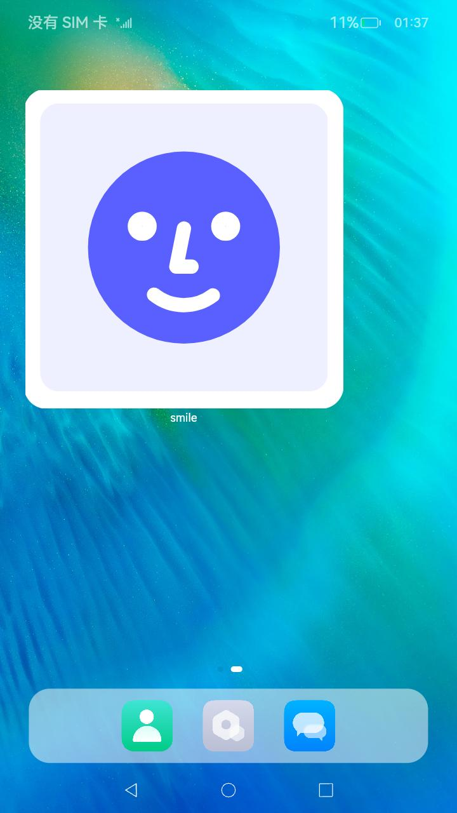

# ArkTS卡片使用画布组件绘制自定义图形


ArkTS卡片开放了自定义绘制的能力，在卡片上可以通过[Canvas](../reference/apis-arkui/arkui-ts/ts-components-canvas-canvas.md)组件创建一块画布，然后通过[CanvasRenderingContext2D](../reference/apis-arkui/arkui-ts/ts-canvasrenderingcontext2d.md)对象在画布上进行自定义图形的绘制，如下示例代码实现了在画布的中心绘制了一个笑脸。

```ts
@Entry
@Component
struct CustomCanvasDrawingCard {
  private canvasWidth: number = 0;
  private canvasHeight: number = 0;
  // 初始化CanvasRenderingContext2D和RenderingContextSettings
  private settings: RenderingContextSettings = new RenderingContextSettings(true);
  private context: CanvasRenderingContext2D = new CanvasRenderingContext2D(this.settings);

  build() {
    Column() {
      Row() {
        Canvas(this.context)
          .width('100%')
          .height('100%')
          .onReady(() => {
            // 在onReady回调中获取画布的实际宽和高
            this.canvasWidth = this.context.width;
            this.canvasHeight = this.context.height;
            // 绘制画布的背景
            this.context.fillStyle = '#EEF0FF';
            this.context.fillRect(0, 0, this.canvasWidth, this.canvasHeight);
            // 在画布的中心绘制一个圆
            this.context.beginPath();
            let radius = this.context.width / 3;
            let circleX = this.context.width / 2;
            let circleY = this.context.height / 2;
            this.context.moveTo(circleX - radius, circleY);
            this.context.arc(circleX, circleY, radius, 2 * Math.PI, 0, true);
            this.context.closePath();
            this.context.fillStyle = '#5A5FFF';
            this.context.fill();
            // 绘制笑脸的左眼
            let leftR = radius / 13;
            let leftX = circleX - (radius / 2.3);
            let leftY = circleY - (radius / 4.5);
            this.context.beginPath();
            this.context.arc(leftX, leftY, leftR, 0, 2 * Math.PI, true);
            this.context.closePath();
            this.context.strokeStyle = '#FFFFFF';
            this.context.lineWidth = 15;
            this.context.stroke();
            // 绘制笑脸的右眼
            let rightR = radius / 13;
            let rightX = circleX + (radius / 2.3);
            let rightY = circleY - (radius / 4.5);
            this.context.beginPath();
            this.context.arc(rightX, rightY, rightR, 0, 2 * Math.PI, true);
            this.context.closePath();
            this.context.strokeStyle = '#FFFFFF';
            this.context.lineWidth = 15;
            this.context.stroke();
            // 绘制笑脸的鼻子
            let startX = circleX;
            let startY = circleY - 20;
            this.context.beginPath();
            this.context.moveTo(startX, startY);
            this.context.lineTo(startX - 8, startY + 40);
            this.context.lineTo(startX + 8, startY + 40);
            this.context.strokeStyle = '#FFFFFF';
            this.context.lineWidth = 15;
            this.context.lineCap = 'round';
            this.context.lineJoin = 'round';
            this.context.stroke();
            // 绘制笑脸的嘴巴
            let mouthR = radius / 2;
            let mouthX = circleX;
            let mouthY = circleY + 10;
            this.context.beginPath();
            this.context.arc(mouthX, mouthY, mouthR, Math.PI / 1.4, Math.PI / 3.4, true);
            this.context.strokeStyle = '#FFFFFF';
            this.context.lineWidth = 15;
            this.context.stroke();
            this.context.closePath();
          })
      }
    }.height('100%').width('100%')
  }
}
```

运行效果如下图所示。  
