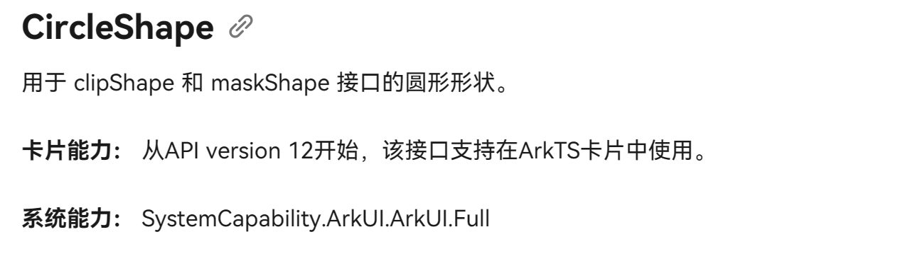

# 卡片页面能力说明

开发者可以使用声明式范式开发ArkTS卡片页面。如下卡片页面由DevEco Studio模板自动生成，开发者可以根据自身的业务场景进行调整。  

ArkTS卡片具备JS卡片的全量能力，并且新增了动效能力和自定义绘制的能力，支持[声明式范式](../ui/arkts-ui-development-overview.md)的部分组件、事件、动效、数据管理、状态管理能力，详见“[ArkTS卡片支持的页面能力](#arkts卡片支持的页面能力)”。

## ArkTS卡片支持的页面能力

ArkTS卡片支持的页面能力详见<!--RP1-->[学习ArkTS语言](../quick-start/arkts-get-started.md)<!--RP1End-->和[ArkTS声明式开发范式](../ui/arkts-ui-development-overview.md)。

只有标识“支持在ArkTS卡片中使用”的组件和接口可用于ArkTS卡片，同时请留意卡片场景下的能力差异说明。

例如：以下说明表示@Component装饰器可在ArkTS卡片中使用。  

