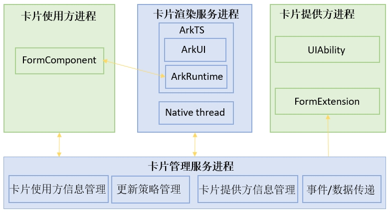

# ArkTS卡片进程模型
本文主要介绍，卡片从创建到显示整个过程中各个进程的含义。具体请参考卡片进程模型。

**图1** 卡片进程模型   

- 卡片使用方进程：显示卡片的宿主进程，例如桌面进程。
- 卡片渲染服务进程：系统内统一加载渲染卡片UI的进程，所有卡片渲染在同一个进程内，不同的应用卡片通过虚拟机隔离。
- 卡片管理服务进程：系统内统一卡片生命周期的系统[SA](../application-models/serviceability-overview.md)服务。
- 卡片提供方进程：提供卡片的应用进程，包括应用自身UIAbility运行的主进程，以及卡片单独的[FormExtensionAbility](../reference/apis-form-kit/js-apis-app-form-formExtensionAbility.md)进程。两个进程之间内存隔离，但是共享相同的文件沙箱。