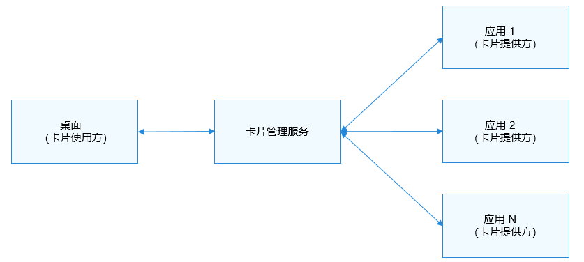

# Form Kit简介
<!--Kit: Form Kit-->
<!--Subsystem: Ability-->
<!--Owner: @cx983299475-->
<!--Designer: @xueyulong-->
<!--Tester: @chenmingze-->
<!--Adviser: @Brilliantry_Rui-->
Form Kit（卡片开发服务）提供了一种在桌面<!--RP3--><!--RP3End-->上嵌入显示应用信息的开发框架和API，可以将应用内用户关注的重要信息或常用操作抽取到服务卡片（简称“卡片”）上，通过将卡片添加到桌面<!--RP3--><!--RP3End-->上，以达到信息展示、服务直达的便捷体验效果。

## 卡片使用场景
- 支持设备类型：手机、平板、PC/2in1、智慧屏、智能手表。轻量级智能穿戴设备不支持使用本Kit。
- 支持开发卡片应用类型：应用和元服务内均支持开发卡片。
- 支持卡片使用位置：用户可以在桌面<!--RP3--><!--RP3End-->上添加使用，不支持在普通应用内嵌入显示卡片。
- 卡片常见使用步骤：

1. 长按“桌面的应用图标”，弹出操作菜单。
2. 点击“<!--Del-->服务<!--DelEnd-->卡片”选项，进入卡片管理页面，可以预览卡片。
3. 点击“添加到桌面”按钮，即可在桌面上看到<!--Del-->并操作<!--DelEnd-->新添加的卡片。

**图1** 卡片常见使用步骤  
<!--RP2-->

<!--RP2End-->

## 服务卡片架构
**图2** 服务卡片架构  

**卡片场景中涉及到的基本概念**
- 卡片使用方：如上图中的桌面，作为显示卡片内容的宿主应用，用于与用户直接进行交互，完成卡片添加、删除、显示功能，并能控制卡片在宿主中具体展示的位置。
- 卡片提供方：提供卡片的应用或元服务，是卡片功能的具体实现者，需要设计实现卡片UI、数据更新、以及点击交互处理功能。
- 卡片管理服务：操作系统内管理整机卡片信息的系统服务，作为卡片提供方和使用方的桥梁，向使用方提供卡片信息查询、添加、删除等能力，同时向提供方提供卡片被添加、被删除、刷新、点击事件等通知能力。

## 亮点/特征
- 信息呈现：将应用/元服务的重要信息以卡片形式展示在桌面，同时支持信息定时更新能力，用户可以随时查看关注的信息。

- 服务直达：通过点击卡片内按钮，就可以实现功能快捷操作，也支持点击后跳转到应用/元服务对应功能页，实现功能服务一步直达的效果。

## 开发模式

**模型选择**

当前系统中应用支持Stage和FA两种开发模型，所以Form Kit也同时支持开发者使用Stage模型和FA模型来开发卡片应用，但更推荐使用Stage模型。

**UI开发范式选择**
- Stage模型支持两种卡片UI开发方式，可以基于ArkTS声明式开发范式语言开发卡片（简称ArkTS卡片）、也可以基于兼容JS的类Web开发范式语言开发卡片（简称JS卡片）。
- FA模型仅支持基于类Web范式JS语言开发JS卡片。

ArkTS卡片与JS卡片具备不同的实现原理及特征，在场景能力上的差异如下表所示：

| 类别         | JS卡片    | ArkTS卡片  |
| ------------ | --------- | ---------- |
| 开发范式     | 类Web范式 | 声明式范式 |
| 组件能力     | 支持      | 支持       |
| 布局能力     | 支持      | 支持       |
| 事件能力     | 支持      | 支持       |
| 自定义动效   | 不支持    | 支持       |
| 自定义绘制   | 不支持    | 支持       |
| 逻辑代码执行 | 不支持    | 支持       |

## 与相关Kit的关系

- Ability Kit: Form Kit内部实现依赖Ability Kit提供的Extension基础能力，与Ability Kit存在生命周期调度交互。
- ArkUI: Form Kit卡片提供方在卡片页面中可以使用ArkUI提供的部分组件、事件、动效、状态管理等能力。

<!--RP1--><!--RP1End-->
