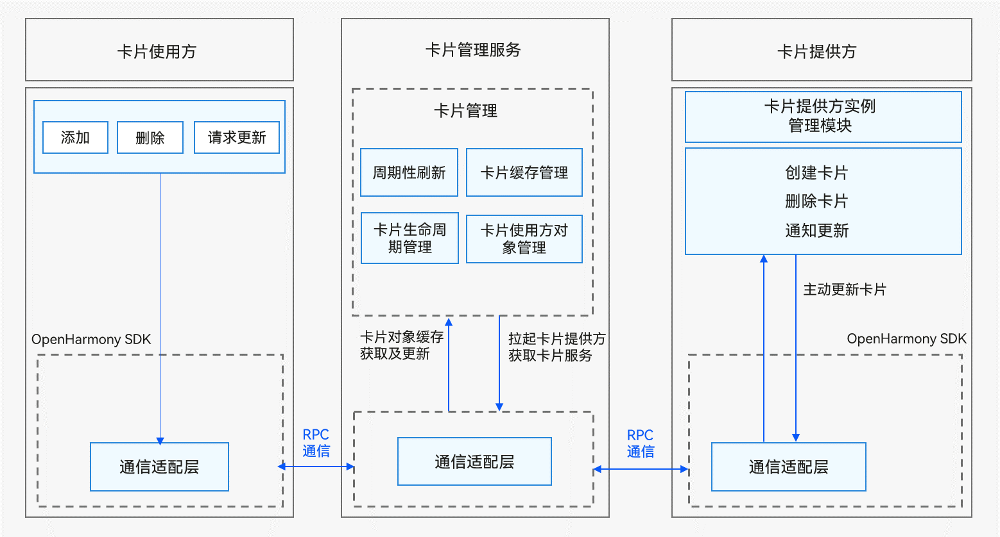

# JS卡片开发指导（FA模型）
API version 8及更早版本支持的应用模型，已经不再主推。建议使用新的Stage模型进行开发。

## 卡片概述

服务卡片（以下简称“卡片”）是一种界面展示形式，可以将应用的重要信息或操作前置到卡片，以达到服务直达、减少体验层级的目的。

卡片常用于嵌入到其他应用（当前只支持系统应用）中作为其界面的一部分显示，并支持拉起页面、发送消息等基础的交互功能。

卡片的基本概念：

- 卡片使用方：显示卡片内容的宿主应用，控制卡片在宿主中展示的位置。

- 卡片管理服务：用于管理系统中所添加卡片的常驻代理服务，包括卡片对象的管理与使用，以及卡片周期性刷新等。

- 卡片提供方：提供卡片显示内容原子化服务，控制卡片的显示内容、控件布局以及控件点击事件。


## 运作机制

卡片框架的运作机制如图1所示。

  **图1** 卡片框架运作机制（FA模型）  


卡片使用方包含以下模块：

- 卡片使用：包含卡片的创建、删除、请求更新等操作。

- 通信适配层：由OpenHarmony SDK提供，负责与卡片管理服务通信，用于将卡片的相关操作到卡片管理服务。

卡片管理服务包含以下模块：

- 周期性刷新：在卡片添加后，根据卡片的刷新策略启动定时任务周期性触发卡片的刷新。

- 卡片缓存管理：在卡片添加到卡片管理服务后，对卡片的视图信息进行缓存，以便下次获取卡片时可以直接返回缓存数据，降低时延。

- 卡片生命周期管理：对于卡片切换到后台或者被遮挡时，暂停卡片的刷新；以及卡片的升级/卸载场景下对卡片数据的更新和清理。

- 卡片使用方对象管理：对卡片使用方的RPC对象进行管理，用于使用方请求进行校验以及对卡片更新后的回调处理。

- 通信适配层：负责与卡片使用方和提供方进行RPC通信。

卡片提供方包含以下模块：

- 卡片服务：由卡片提供方开发者实现，开发者实现生命周期处理创建卡片、更新卡片以及删除卡片等请求，提供相应的卡片服务。

- 卡片提供方实例管理模块：由卡片提供方开发者实现，负责对卡片管理服务分配的卡片实例进行持久化管理。

- 通信适配层：由OpenHarmony SDK提供，负责与卡片管理服务通信，用于将卡片的更新数据主动推送到卡片管理服务。

> **说明：**
> 实际开发时只需要作为卡片提供方进行卡片内容的开发，卡片使用方和卡片管理服务由系统自动处理。


## 接口说明

FormAbility生命周期接口如下：

| 接口名 | 描述 |
| -------- | -------- |
| onCreate(want:&nbsp;Want):&nbsp;formBindingData.FormBindingData | 卡片提供方接收创建卡片的通知接口。 |
| onCastToNormal(formId:&nbsp;string):&nbsp;void | 卡片提供方接收临时卡片转常态卡片的通知接口。 |
| onUpdate(formId:&nbsp;string):&nbsp;void | 卡片提供方接收更新卡片的通知接口。 |
| onVisibilityChange(newStatus:&nbsp;Record&lt;string,&nbsp;number&gt;):&nbsp;void | 卡片提供方接收修改可见性的通知接口。 |
| onEvent(formId:&nbsp;string,&nbsp;message:&nbsp;string):&nbsp;void | 卡片提供方接收处理卡片事件的通知接口。 |
| onDestroy(formId:&nbsp;string):&nbsp;void | 卡片提供方接收销毁卡片的通知接口。 |
| onAcquireFormState?(want:&nbsp;Want):&nbsp;formInfo.FormState | 卡片提供方接收查询卡片状态的通知接口。 |
| onShare?(formId:&nbsp;string):&nbsp;{[key:&nbsp;string]:&nbsp;any} | 卡片提供方接收卡片分享的通知接口。 |
| onShareForm?(formId:&nbsp;string):&nbsp;Record&lt;string,&nbsp;Object&gt; | 卡片提供方接收卡片分享的通知接口。推荐使用该接口替代onShare接口。如果了实现该接口，onShare将不再被回调。 |

FormProvider类有如下API接口，具体的API介绍详见[接口文档](../reference/apis-form-kit/js-apis-app-form-formProvider.md)。


| 接口名 | 描述 |
| -------- | -------- |
| setFormNextRefreshTime(formId:&nbsp;string,&nbsp;minute:&nbsp;number,&nbsp;callback:&nbsp;AsyncCallback&lt;void&gt;):&nbsp;void; | 设置指定卡片的下一次更新时间。 |
| setFormNextRefreshTime(formId:&nbsp;string,&nbsp;minute:&nbsp;number):&nbsp;Promise&lt;void&gt;; | 设置指定卡片的下一次更新时间，以promise方式返回。 |
| updateForm(formId:&nbsp;string,&nbsp;formBindingData:&nbsp;FormBindingData,&nbsp;callback:&nbsp;AsyncCallback&lt;void&gt;):&nbsp;void; | 更新指定的卡片。 |
| updateForm(formId:&nbsp;string,&nbsp;formBindingData:&nbsp;FormBindingData):&nbsp;Promise&lt;void&gt;; | 更新指定的卡片，以promise方式返回。 |


FormBindingData类有如下API接口，具体的API介绍详见[接口文档](../reference/apis-form-kit/js-apis-app-form-formBindingData.md)。


| 接口名 | 描述 |
| -------- | -------- |
| createFormBindingData(obj?:&nbsp;Object&nbsp;\|&nbsp;string):&nbsp;FormBindingData | 创建一个FormBindingData对象。 |


## 开发步骤

FA卡片开发，即基于[FA模型](../application-models/fa-model-development-overview.md)的卡片提供方开发，主要涉及如下关键步骤：

- [实现卡片生命周期接口](#实现卡片生命周期接口)：开发FormAbility生命周期回调函数。

- [配置卡片配置文件](#配置卡片配置文件)：配置应用配置文件config.json。

- [卡片信息的持久化](#卡片信息的持久化)：对卡片信息进行持久化管理。

- [卡片数据交互](#卡片数据交互)：通过updateForm()更新卡片显示的信息。

- [开发卡片页面](#开发卡片页面)：使用HML+CSS+JSON开发JS卡片页面。

- [开发卡片事件](#开发卡片事件)：为卡片添加router事件和message事件。


### 实现卡片生命周期接口

创建FA模型的卡片，需实现卡片的生命周期接口。先参考<!--RP1-->[创建服务卡片](https://developer.huawei.com/consumer/cn/doc/harmonyos-guides-V5/ide-service-widget-V5)<!--RP1End-->生成服务卡片模板。

1. 在form.ts中，导入相关模块
   
    ```ts
    import type featureAbility from '@ohos.ability.featureAbility';
    import type Want from '@ohos.app.ability.Want';
    import formBindingData from '@ohos.app.form.formBindingData';
    import formInfo from '@ohos.app.form.formInfo';
    import formProvider from '@ohos.app.form.formProvider';
    import dataPreferences from '@ohos.data.preferences';
    import hilog from '@ohos.hilog';
    ```

2. 在form.ts中，实现卡片生命周期接口
   
    ```ts
    const TAG: string = '[Sample_FAModelAbilityDevelop]';
    const domain: number = 0xFF00;
    
    const DATA_STORAGE_PATH: string = 'form_store';
    let storeFormInfo = async (formId: string, formName: string, tempFlag: boolean, context: featureAbility.Context): Promise<void> => {
      // 此处仅对卡片ID：formId，卡片名：formName和是否为临时卡片：tempFlag进行了持久化
      let formInfo: Record<string, string | number | boolean> = {
        'formName': 'formName',
        'tempFlag': 'tempFlag',
        'updateCount': 0
      };
      try {
        const storage = await dataPreferences.getPreferences(context, DATA_STORAGE_PATH);
        // put form info
        await storage.put(formId, JSON.stringify(formInfo));
        hilog.info(domain, TAG, `storeFormInfo, put form info successfully, formId: ${formId}`);
        await storage.flush();
      } catch (err) {
        hilog.error(domain, TAG, `failed to storeFormInfo, err: ${JSON.stringify(err as Error)}`);
      }
    };
    
    let deleteFormInfo = async (formId: string, context: featureAbility.Context) => {
      try {
        const storage = await dataPreferences.getPreferences(context, DATA_STORAGE_PATH);
        // del form info
        await storage.delete(formId);
        hilog.info(domain, TAG, `deleteFormInfo, del form info successfully, formId: ${formId}`);
        await storage.flush();
      } catch (err) {
        hilog.error(domain, TAG, `failed to deleteFormInfo, err: ${JSON.stringify(err)}`);
      }
    }
    
    class LifeCycle {
      onCreate: (want: Want) => formBindingData.FormBindingData = (want) => ({ data: '' });
      onCastToNormal: (formId: string) => void = (formId) => {
      };
      onUpdate: (formId: string) => void = (formId) => {
      };
      onVisibilityChange: (newStatus: Record<string, number>) => void = (newStatus) => {
        let obj: Record<string, number> = {
          'test': 1
        };
        return obj;
      };
      onEvent: (formId: string, message: string) => void = (formId, message) => {
      };
      onDestroy: (formId: string) => void = (formId) => {
      };
      onAcquireFormState?: (want: Want) => formInfo.FormState = (want) => (0);
      onShareForm?: (formId: string) => Record<string, Object> = (formId) => {
        let obj: Record<string, number> = {
          'test': 1
        };
        return obj;
      };
    }
    
    let obj: LifeCycle = {
      onCreate(want: Want) {
        hilog.info(domain, TAG, 'FormAbility onCreate');
        if (want.parameters) {
          let formId = String(want.parameters['ohos.extra.param.key.form_identity']);
          let formName = String(want.parameters['ohos.extra.param.key.form_name']);
          let tempFlag = Boolean(want.parameters['ohos.extra.param.key.form_temporary']);
          // 将创建的卡片信息持久化，以便在下次获取/更新该卡片实例时进行使用
          // 此接口请根据实际情况实现，具体请参考：FormExtAbility Stage模型卡片实例
          hilog.info(domain, TAG, 'FormAbility onCreate' + formId);
          storeFormInfo(formId, formName, tempFlag, this.context);
        }
  
        // 使用方创建卡片时触发，提供方需要返回卡片数据绑定类
        let obj: Record<string, string> = {
          'title': 'titleOnCreate',
          'detail': 'detailOnCreate'
        };
        let formData: formBindingData.FormBindingData = formBindingData.createFormBindingData(obj);
        return formData;
      },
      onCastToNormal(formId: string) {
        // 使用方将临时卡片转换为常态卡片触发，提供方需要做相应的处理
        hilog.info(domain, TAG, 'FormAbility onCastToNormal');
      },
      onUpdate(formId: string) {
        // 若卡片支持定时更新/定点更新/卡片使用方主动请求更新功能，则提供方需要重写该方法以支持数据更新
        hilog.info(domain, TAG, 'FormAbility onUpdate');
        let obj: Record<string, string> = {
          'title': 'titleOnUpdate',
          'detail': 'detailOnUpdate'
        };
        let formData: formBindingData.FormBindingData = formBindingData.createFormBindingData(obj);
        // 调用updateForm接口去更新对应的卡片，仅更新入参中携带的数据信息，其他信息保持不变
        formProvider.updateForm(formId, formData).catch((error: Error) => {
          hilog.error(domain, TAG, 'FormAbility updateForm, error:' + JSON.stringify(error));
        });
      },
      onVisibilityChange(newStatus: Record<string, number>) {
        // 使用方发起可见或者不可见通知触发，提供方需要做相应的处理，仅系统应用生效
        hilog.info(domain, TAG, 'FormAbility onVisibilityChange');
      },
      onEvent(formId: string, message: string) {
        // 若卡片支持触发事件，则需要重写该方法并实现对事件的触发
        let obj: Record<string, string> = {
          'title': 'titleOnEvent',
          'detail': 'detailOnEvent'
        };
        let formData: formBindingData.FormBindingData = formBindingData.createFormBindingData(obj);
        // 调用updateForm接口去更新对应的卡片，仅更新入参中携带的数据信息，其他信息保持不变
        formProvider.updateForm(formId, formData).catch((error: Error) => {
          hilog.error(domain, TAG, 'FormAbility updateForm, error:' + JSON.stringify(error));
        });
        hilog.info(domain, TAG, 'FormAbility onEvent');
      },
      onDestroy(formId: string) {
        // 删除卡片实例数据
        hilog.info(domain, TAG, 'FormAbility onDestroy');
        // 删除之前持久化的卡片实例数据
        // 此接口请根据实际情况实现，具体请参考：FormExtAbility Stage模型卡片实例
        deleteFormInfo(formId, this.context);
      },
      onAcquireFormState(want: Want) {
        hilog.info(domain, TAG, 'FormAbility onAcquireFormState');
        return formInfo.FormState.READY;
      }
    };
  
    export default obj;
    ```

> **说明：**
> FormAbility不能常驻后台，即在卡片生命周期回调函数中无法处理长时间的任务。

### 配置卡片配置文件

卡片需要在应用配置文件config.json中进行配置。

- js模块，用于对应卡片的js相关资源，内部字段结构说明：
    | 属性名称 | 含义 | 数据类型 | 是否可缺省 |
  | -------- | -------- | -------- | -------- |
  | name | 表示JS&nbsp;Component的名字。该标签不可缺省，默认值为default。 | 字符串 | 否 |
  | pages | 表示JS&nbsp;Component的页面用于列举JS&nbsp;Component中每个页面的路由信息[页面路径+页面名称]。该标签不可缺省，取值为数组，数组第一个元素代表JS&nbsp;FA首页。 | 数组 | 否 |
  | window | 用于定义与显示窗口相关的配置。 | 对象 | 可缺省。 |
  | type | 表示JS应用的类型。取值范围如下：<br/>normal：标识该JS&nbsp;Component为应用实例。<br/>form：标识该JS&nbsp;Component为卡片实例。 | 字符串 | 可缺省，缺省值为“normal” 。|
  | mode | 定义JS组件的开发模式。 | 对象 | 可缺省，缺省值为空。 |

  配置示例如下：

  
  ```json
  "js": [
    // ...
    {
      "name": "widget",
      "pages": [
        "pages/index/index"
      ],
      "window": {
        "designWidth": 720,
        "autoDesignWidth": true
    	},
        "type": "form"
      }
    ]
  ```
  
- abilities模块，用于对应卡片的FormAbility，内部字段结构说明：
    | 属性名称 | 含义 | 数据类型 | 是否可缺省 |
  | -------- | -------- | -------- | -------- |
  | name | 表示卡片的类名。字符串最大长度为127字节。 | 字符串 | 否 |
  | description | 表示卡片的描述。取值可以是描述性内容，也可以是对描述性内容的资源索引，以支持多语言。字符串最大长度为255字节。 | 字符串 | 可缺省，缺省为空。 |
  | isDefault | 表示该卡片是否为默认卡片，每个Ability有且只有一个默认卡片。<br/>true：默认卡片。<br/>false：非默认卡片。 | 布尔值 | 否 |
  | type | 表示卡片的类型。取值范围如下：<br/>JS：JS卡片。 | 字符串 | 否 |
  | colorMode<sup>(deprecated)</sup> | 表示卡片的主题样式，取值范围如下：<br/>auto：自适应。<br/>dark：深色主题。<br/>light：浅色主题。<br/>**说明：**<br/>从API version 20开始，该接口废弃，卡片主题样式统一跟随系统的颜色模式。 | 字符串 | 可缺省，缺省值为“auto”。 |
  | supportDimensions | 表示卡片支持的外观规格，取值范围：<br/>1&nbsp;\*&nbsp;2：表示1行2列的二宫格。<br/>2&nbsp;\*&nbsp;2：表示2行2列的四宫格。<br/>2&nbsp;\*&nbsp;4：表示2行4列的八宫格。<br/>4&nbsp;\*&nbsp;4：表示4行4列的十六宫格。 | 字符串数组 | 否 |
  | defaultDimension | 表示卡片的默认外观规格，取值必须在该卡片supportDimensions配置的列表中。 | 字符串 | 否 |
  | updateEnabled | 表示卡片是否支持周期性刷新，取值范围：<br/>true：表示支持周期性刷新，可以在定时刷新（updateDuration）和定点刷新（scheduledUpdateTime）两种方式任选其一，优先选择定时刷新。<br/>false：表示不支持周期性刷新。 | 布尔类型 | 否 |
  | scheduledUpdateTime | 表示卡片的定点刷新的时刻，采用24小时制，精确到分钟。<br/>updateDuration参数优先级高于scheduledUpdateTime，两者同时配置时，以updateDuration配置的刷新时间为准。 | 字符串 | 可缺省，缺省值为“0:0”。 |
  | updateDuration | 表示卡片定时刷新的更新周期，单位为30分钟，取值为自然数。<br/>当取值为0时，表示该参数不生效。<br/>当取值为正整数N时，表示刷新周期为30\*N分钟。<br/>updateDuration参数优先级高于scheduledUpdateTime，两者同时配置时，以updateDuration配置的刷新时间为准。 | 数值 | 可缺省，缺省值为“0”。 |
  | formConfigAbility | 表示卡片的配置跳转链接，采用URI格式。 | 字符串 | 可缺省，缺省值为空。 |
  | formVisibleNotify | 标识是否允许卡片使用卡片可见性通知。 | 字符串 | 可缺省，缺省值为空。 |
  | jsComponentName | 表示JS卡片的Component名称。字符串最大长度为127字节。 | 字符串 | 否 |
  | metaData | 表示卡片的自定义信息，包含customizeData数组标签。 | 对象 | 可缺省，缺省值为空。 |
  | customizeData | 表示自定义的卡片信息。 | 对象数组 | 可缺省，缺省值为空。 |

  配置示例如下：

  
  ```json
  "abilities": [
    // ...
    {
      "name": ".FormAbility",
      "srcPath": "FormAbility",
      "description": "$string:FormAbility_desc",
      "icon": "$media:icon",
      "label": "$string:FormAbility_label",
      "type": "service",
      "formsEnabled": true,
      "srcLanguage": "ets",
      "forms": [
        {
          "jsComponentName": "widget",
          "isDefault": true,
          "scheduledUpdateTime": "10:30",
          "defaultDimension": "2*2",
          "name": "widget",
          "description": "This is a service widget.",
          "type": "JS",
          "formVisibleNotify": true,
          "supportDimensions": [
            "2*2"
          ],
          "updateEnabled": true,
          "updateDuration": 1
        }
      ]
    },
    // ...
  ]
  ```


### 卡片信息的持久化

因大部分卡片提供方都不是常驻服务，只有在需要使用时才会被拉起获取卡片信息，且卡片管理服务支持对卡片进行多实例管理，卡片ID对应实例ID，因此若卡片提供方支持对卡片数据进行配置，则需要对卡片的业务数据按照卡片ID进行持久化管理，以便在后续获取、更新以及拉起时能获取到正确的卡片业务数据。且需要适配onDestroy卡片删除通知接口，在其中实现卡片实例数据的删除。


```ts
const TAG: string = '[Sample_FAModelAbilityDevelop]';
const domain: number = 0xFF00;

const DATA_STORAGE_PATH: string = 'form_store';
let storeFormInfo = async (formId: string, formName: string, tempFlag: boolean, context: featureAbility.Context): Promise<void> => {
  // 此处仅对卡片ID：formId，卡片名：formName和是否为临时卡片：tempFlag进行了持久化
  let formInfo: Record<string, string | number | boolean> = {
    'formName': 'formName',
    'tempFlag': 'tempFlag',
    'updateCount': 0
  };
  try {
    const storage = await dataPreferences.getPreferences(context, DATA_STORAGE_PATH);
    // put form info
    await storage.put(formId, JSON.stringify(formInfo));
    hilog.info(domain, TAG, `storeFormInfo, put form info successfully, formId: ${formId}`);
    await storage.flush();
  } catch (err) {
    hilog.error(domain, TAG, `failed to storeFormInfo, err: ${JSON.stringify(err as Error)}`);
  }
};

let deleteFormInfo = async (formId: string, context: featureAbility.Context) => {
  try {
    const storage = await dataPreferences.getPreferences(context, DATA_STORAGE_PATH);
    // del form info
    await storage.delete(formId);
    hilog.info(domain, TAG, `deleteFormInfo, del form info successfully, formId: ${formId}`);
    await storage.flush();
  } catch (err) {
    hilog.error(domain, TAG, `failed to deleteFormInfo, err: ${JSON.stringify(err)}`);
  }
}

// ...
  onCreate(want: Want) {
    hilog.info(domain, TAG, 'FormAbility onCreate');
    if (want.parameters) {
      let formId = String(want.parameters['ohos.extra.param.key.form_identity']);
      let formName = String(want.parameters['ohos.extra.param.key.form_name']);
      let tempFlag = Boolean(want.parameters['ohos.extra.param.key.form_temporary']);
      // 将创建的卡片信息持久化，以便在下次获取/更新该卡片实例时进行使用
      // 此接口请根据实际情况实现，具体请参考：FormExtAbility Stage模型卡片实例
      hilog.info(domain, TAG, 'FormAbility onCreate' + formId);
      storeFormInfo(formId, formName, tempFlag, this.context);
    }

    // 使用方创建卡片时触发，提供方需要返回卡片数据绑定类
    let obj: Record<string, string> = {
      'title': 'titleOnCreate',
      'detail': 'detailOnCreate'
    };
    let formData: formBindingData.FormBindingData = formBindingData.createFormBindingData(obj);
    return formData;
  },
// ...

let deleteFormInfo = async (formId: string, context: featureAbility.Context): Promise<void> => {
  try {
    const storage = await dataPreferences.getPreferences(context, DATA_STORAGE_PATH);
    // del form info
    await storage.delete(formId);
    hilog.info(domain, TAG, `deleteFormInfo, del form info successfully, formId: ${formId}`);
    await storage.flush();
  } catch (err) {
    hilog.error(domain, TAG, `failed to deleteFormInfo, err: ${JSON.stringify(err)}`);
  }
};

// ...
    // 适配onDestroy卡片删除通知接口，在其中实现卡片实例数据的删除。
  onDestroy(formId: string) {
    // 删除卡片实例数据
    hilog.info(domain, TAG, 'FormAbility onDestroy');
    // 删除之前持久化的卡片实例数据
    // 此接口请根据实际情况实现，具体请参考：FormExtAbility Stage模型卡片实例
    deleteFormInfo(formId, this.context);
  }
// ...
```

具体的持久化方法可以参考[应用数据持久化概述](../database/app-data-persistence-overview.md)。

需要注意的是，卡片使用方在请求卡片时传递给提供方应用的Want数据中存在临时标记字段，表示此次请求的卡片是否为临时卡片：

- 常态卡片：卡片使用方会持久化的卡片。如添加到桌面的卡片。

- 临时卡片：卡片使用方不会持久化的卡片。如上划卡片应用时显示的卡片。

临时卡片转常态卡片：上划卡片应用后，此时会显示的卡片为临时卡片；点击卡片上的“图钉”按钮后添加到桌面，此时卡片转为常态卡片。

由于临时卡片的数据具有非持久化的特殊性，某些场景例如卡片服务框架死亡重启，此时临时卡片数据在卡片管理服务中已经删除，且对应的卡片ID不会通知到提供方，所以卡片提供方需要自己负责清理长时间未删除的临时卡片数据。同时对应的卡片使用方可能会将之前请求的临时卡片转换为常态卡片。如果转换成功，卡片提供方也需要对对应的临时卡片ID进行处理，把卡片提供方记录的临时卡片数据转换为常态卡片数据，防止提供方在清理长时间未删除的临时卡片时，把已经转换为常态卡片的临时卡片信息删除，导致卡片信息丢失。


### 卡片数据交互

当卡片应用需要更新数据时（如触发了定时更新或定点更新），卡片应用获取最新数据，并调用updateForm()接口更新主动触发卡片的更新。


```ts
const TAG: string = '[Sample_FAModelAbilityDevelop]';
const domain: number = 0xFF00;

onUpdate(formId: string) {
  // 若卡片支持定时更新/定点更新/卡片使用方主动请求更新功能，则提供方需要重写该方法以支持数据更新
  hilog.info(domain, TAG, 'FormAbility onUpdate');
  let obj: Record<string, string> = {
    'title': 'titleOnUpdate',
    'detail': 'detailOnUpdate'
  };
  let formData: formBindingData.FormBindingData = formBindingData.createFormBindingData(obj);
  // 调用updateForm接口去更新对应的卡片，仅更新入参中携带的数据信息，其他信息保持不变
  formProvider.updateForm(formId, formData).catch((error: Error) => {
    hilog.error(domain, TAG, 'FormAbility updateForm, error:' + JSON.stringify(error));
  });
}
```


### 开发卡片页面

开发者可以使用类Web范式（HML+CSS+JSON）开发JS卡片页面。生成如下卡片页面，可以这样配置卡片页面文件：


> **说明：**
> FA模型当前仅支持JS扩展的类Web开发范式来实现卡片的UI。

- HML：使用类Web范式的组件描述卡片的页面信息。
  
  ```html
  <div class="container">
      <stack>
          <div class="container-img">
              <image src="/common/widget.png" class="bg-img"></image>
              <image src="/common/rect.png" class="bottom-img"></image>
          </div>
          <div class="container-inner">
              <text class="title" onclick="routerEvent">{{title}}</text>
              <text class="detail_text" onclick="messageEvent">{{detail}}</text>
          </div>
      </stack>
  </div>
  ```
  
- CSS：HML中类Web范式组件的样式信息。
  
  ```css
  .container {
      flex-direction: column;
      justify-content: center;
      align-items: center;
  }
  
  .bg-img {
      flex-shrink: 0;
      height: 100%;
      z-index: 1;
  }
  
  .bottom-img {
      position: absolute;
      width: 150px;
      height: 56px;
      top: 63%;
      background-color: rgba(216, 216, 216, 0.15);
      filter: blur(20px);
      z-index: 2;
  }
  
  .container-inner {
      flex-direction: column;
      justify-content: flex-end;
      align-items: flex-start;
      height: 100%;
      width: 100%;
      padding: 12px;
  }
  
  .title {
      font-family: HarmonyHeiTi-Medium;
      font-size: 14px;
      color: rgba(255,255,255,0.90);
      letter-spacing: 0.6px;
  }

  .detail_text {
      font-family: HarmonyHeiTi;
      font-size: 12px;
      color: rgba(255,255,255,0.60);
      letter-spacing: 0.51px;
      text-overflow: ellipsis;
      max-lines: 1;
      margin-top: 6px;
  }
  ```
  
- JSON：卡片页面中的数据和事件交互。
  
  ```json
  {
    "data": {
      "title": "TitleDefault",
      "detail": "TextDefault"
    },
    "actions": {
      "routerEvent": {
        "action": "router",
        "abilityName": "com.samples.famodelabilitydevelop.MainAbility",
        "params": {
          "message": "add detail"
        }
      },
      "messageEvent": {
        "action": "message",
        "params": {
          "message": "add detail"
        }
      }
    }
  }
  ```


### 开发卡片事件

卡片支持为组件设置交互事件(action)，包括router事件和message事件，其中router事件用于Ability跳转，message事件用于卡片开发人员自定义点击事件。关键步骤说明如下：

1. 在hml中为组件设置onclick属性，其值对应到json文件的actions字段中。

2. 如何设置router事件：
   - action属性值为"router"；
   - abilityName为跳转目标的Ability名（支持跳转FA模型的PageAbility组件和Stage模型的UIAbility组件），如目前DevEco创建的FA模型的UIAbility默认名为com.example.entry.EntryAbility；
   - params为传递给跳转目标Ability的自定义参数，可以按需填写。其值可以在目标Ability启动时的want中的parameters里获取。如FA模型EntryAbility的onCreate生命周期里可以通过featureAbility.getWant()获取到want，然后在其parameters字段下获取到配置的参数；

3. 如何设置message事件：
   - action属性值为"message"；
   - params为message事件的用户自定义参数，可以按需填写。其值可以在卡片生命周期函数onEvent中的message里获取；

示例如下：

- hml文件
  
  ```html
  <div class="container">
      <stack>
          <div class="container-img">
              <image src="/common/widget.png" class="bg-img"></image>
              <image src="/common/rect.png" class="bottom-img"></image>
          </div>
          <div class="container-inner">
              <text class="title" onclick="routerEvent">{{title}}</text>
              <text class="detail_text" onclick="messageEvent">{{detail}}</text>
          </div>
      </stack>
  </div>
  ```
  
- css文件
  
  ```css
  .container {
      flex-direction: column;
      justify-content: center;
      align-items: center;
  }
  
  .bg-img {
      flex-shrink: 0;
      height: 100%;
      z-index: 1;
  }
  
  .bottom-img {
      position: absolute;
      width: 150px;
      height: 56px;
      top: 63%;
      background-color: rgba(216, 216, 216, 0.15);
      filter: blur(20px);
      z-index: 2;
  }
  
  .container-inner {
      flex-direction: column;
      justify-content: flex-end;
      align-items: flex-start;
      height: 100%;
      width: 100%;
      padding: 12px;
  }
  
  .title {
      font-family: HarmonyHeiTi-Medium;
      font-size: 14px;
      color: rgba(255,255,255,0.90);
      letter-spacing: 0.6px;
  }

  .detail_text {
      font-family: HarmonyHeiTi;
      font-size: 12px;
      color: rgba(255,255,255,0.60);
      letter-spacing: 0.51px;
      text-overflow: ellipsis;
      max-lines: 1;
      margin-top: 6px;
  }
  ```
  
- json文件
  
  ```json
  {
    "data": {
      "title": "TitleDefault",
      "detail": "TextDefault"
    },
    "actions": {
      "routerEvent": {
        "action": "router",
        "abilityName": "com.samples.famodelabilitydevelop.MainAbility",
        "params": {
          "message": "add detail"
        }
      },
      "messageEvent": {
        "action": "message",
        "params": {
          "message": "add detail"
        }
      }
    }
  }
  ```
