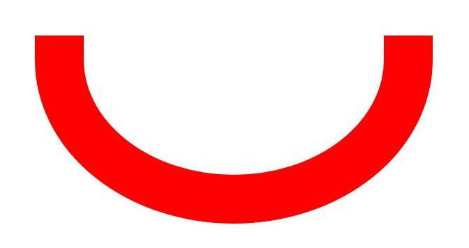
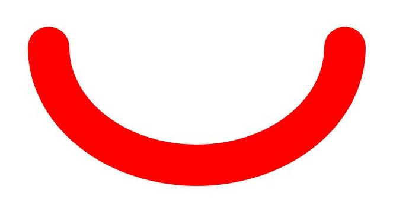

# 基础绘制效果（C/C++）


## 场景介绍

在进行绘制时，可以进行一些基础效果的设置，比如设置填充颜色、设置抗锯齿、设置图形描边、设置图形线条连接样式等。

主要通过画刷（Brush）设置填充基础效果，通过画笔（Pen）设置描边基础效果。


## 填充效果

可以通过画刷设置基础的填充颜色，还可以通过画刷使用混合模式、着色器效果、滤波器效果等实现更多复杂绘制效果，具体可见[复杂绘制效果](complex-drawing-effect-c.md)。


### 接口说明

使用画刷（Brush）设置绘制效果的常用接口如下表所示，详细的使用和参数请见[drawing_brush](../reference/apis-arkgraphics2d/drawing__brush_8h.md)。

| 接口 | 描述 |
| -------- | -------- |
| OH_Drawing_Brush\* OH_Drawing_BrushCreate (void) | 用于创建一个画刷对象。 |
| void OH_Drawing_CanvasAttachBrush (OH_Drawing_Canvas\*, const OH_Drawing_Brush\*) | 用于设置画刷给画布，画布将会使用设置的画刷样式和颜色去填充绘制的图形形状。 |
| void OH_Drawing_BrushSetColor (OH_Drawing_Brush\* , uint32_t color) | 用于设置画刷的颜色属性，颜色属性描述了画刷填充图形时使用的颜色，用一个32位（ARGB）的变量表示。 |
| void OH_Drawing_BrushSetAntiAlias (OH_Drawing_Brush\* , bool) | 用于设置画刷的抗锯齿属性，设置为true则画刷在绘制图形时会对图形的边缘像素进行半透明的模糊处理，以使图形边缘更加平滑。 |
| void OH_Drawing_CanvasDetachBrush (OH_Drawing_Canvas\*) | 用于去除画布中的画刷，执行后画布将不使用此前设置的画刷，恢复到默认的填充效果。 |
| void OH_Drawing_BrushDestroy (OH_Drawing_Brush\*) | 用于销毁画刷对象并回收该对象占有的内存。 |


### 开发步骤

1. 使用OH_Drawing_BrushCreate()接口创建画刷Brush对象。

   ```c++
   OH_Drawing_Brush* brush = OH_Drawing_BrushCreate(); 
   ```

2. 使用画刷设置基础绘制效果（可选以下的一个或者多个效果）。

   - 可使用OH_Drawing_BrushSetColor()接口设置填充颜色。

      ```c++
      uint32_t color = 0xffff0000;
      OH_Drawing_BrushSetColor(brush, color); 
      ```

      color是一个32位（ARGB）的变量，例如0xffff0000。

   - 可使用OH_Drawing_BrushSetAntiAlias()接口开启抗锯齿效果，以使图形边缘更加平滑。
      ```c++
      OH_Drawing_BrushSetAntiAlias(brush, true);
      ```

3. 使用OH_Drawing_CanvasAttachBrush()接口给Canvas画布设置画刷。接口接受两个参数，一个是画布对象Canvas，请确保已创建或获取得到画布Canvas，具体可见[画布的获取与绘制结果的显示（C/C++）](canvas-get-result-draw-c.md)；另一个是要画设置的画刷对象。画布将会使用设置的画刷样式和颜色等填充图形。

   ```c++
   OH_Drawing_CanvasAttachBrush(canvas, brush); 
   ```

4. 按需绘制图元，具体可见[图元绘制](primitive-drawing-overview.md)一节。

5. 当不需要填充效果时，可以使用OH_Drawing_CanvasDetachBrush()去除。入参为画布对象Canvas。

   ```c++
   OH_Drawing_CanvasDetachBrush(canvas); 
   ```

6. 当不再需要画刷进行效果填充时，请及时使用OH_Drawing_BrushDestroy()接口销毁Brush对象。

   ```c++
   OH_Drawing_BrushDestroy(brush);
   ```


## 描边效果

可以通过画笔设置基础的描边颜色，还可以通过画笔使用混合模式、路径效果、着色器效果、滤波器效果等实现更多复杂绘制效果，具体可见[复杂绘制效果](complex-drawing-effect-c.md)。


### 接口说明

使用画笔（Pen）设置绘制效果的常用接口如下表所示，详细的使用和参数请见[drawing_pen](../reference/apis-arkgraphics2d/drawing__pen_8h.md)。

| 接口 | 描述 |
| -------- | -------- |
| OH_Drawing_Pen\* OH_Drawing_PenCreate (void) | 用于创建一个画笔对象。 |
| void OH_Drawing_CanvasAttachPen (OH_Drawing_Canvas\* , const OH_Drawing_Pen\* ) | 用于设置画笔给画布，画布将会使用设置画笔的样式和颜色去绘制图形形状的轮廓。 |
| void OH_Drawing_PenSetColor (OH_Drawing_Pen\* , uint32_t color) | 用于设置画笔的颜色属性，颜色属性描述了画笔绘制图形轮廓时使用的颜色，用一个32位（ARGB）的变量表示。 |
| void OH_Drawing_PenSetWidth (OH_Drawing_Pen\* , float width) | 用于设置画笔的线宽。0线宽被视作特殊的极细线宽，在绘制时始终会被绘制为1像素，不随画布的缩放而改变；负数线宽在实际绘制时会被视作0线宽。 |
| void OH_Drawing_PenSetAntiAlias (OH_Drawing_Pen\* , bool ) | 用于设置画笔的抗锯齿属性，设置为true则画笔在绘制图形时会对图形的边缘像素进行半透明的模糊处理。 |
| void OH_Drawing_PenSetCap (OH_Drawing_Pen\* , OH_Drawing_PenLineCapStyle) | 用于设置画笔线帽样式。 |
| void OH_Drawing_PenSetJoin (OH_Drawing_Pen\* , OH_Drawing_PenLineJoinStyle) | 用于设置画笔绘制转角的样式。 |
| void OH_Drawing_CanvasDetachPen (OH_Drawing_Canvas\*) | 用于去除画布中的画笔，执行后后画布将不去绘制图形形状的轮廓，恢复到默认的填充效果。 |
| void OH_Drawing_PenDestroy (OH_Drawing_Pen\*) | 用于销毁画笔对象并回收该对象占有的内存。 |


### 开发步骤

1. 使用OH_Drawing_PenCreate()接口创建画笔Pen对象。

   ```c++
   OH_Drawing_Pen* pen = OH_Drawing_PenCreate(); 
   ```

2. 使用OH_Drawing_CanvasAttachPen()接口给Canvas画布设置画笔。接口接受两个参数，一个是画布对象Canvas，请确保已创建或获取得到画布Canvas，具体可见[画布的获取与绘制结果的显示（C/C++）](canvas-get-result-draw-c.md)；另一个是要画设置的画笔对象。画布将会使用设置的画笔样式和颜色等绘制图形轮廓。

   ```c++
   OH_Drawing_CanvasAttachPen(canvas, pen); 
   ```

3. 使用画笔设置具体的描边效果（可选以下的一个或者多个效果）。

   - 可使用OH_Drawing_PenSetColor()接口设置画笔颜色，对应为绘制图形轮廓时使用的颜色。
      ```c++
      uint32_t color = 0xffff0000;
      OH_Drawing_PenSetColor(pen, color); 
      ```

      color是一个32位（ARGB）的变量，例如0xffff0000。

   - 可使用OH_Drawing_PenSetWidth()接口设置画笔的线宽。

      ```c++
      OH_Drawing_PenSetWidth(pen, width);
      ```

      width指线宽的像素值。

   - 可使用OH_Drawing_PenSetAntiAlias()接口设置画笔抗锯齿，以使图形绘制边缘更平滑。

      ```c++
      OH_Drawing_PenSetAntiAlias(pen, true);
      ```

   - 可使用OH_Drawing_PenSetCap()接口设置画笔线帽样式。

      ```c++
      OH_Drawing_PenSetCap(pen, OH_Drawing_PenLineCapStyle);
      ```

      OH_Drawing_PenLineCapStyle线帽样式可选分类对应如下：

      | 线帽样式 | 说明 | 示意图 |
      | -------- | -------- | -------- |
      | FLAT_CAP | 没有线帽样式，线条头尾端点处横切。 |  |
      | SQUARE_CAP | 线帽的样式为方框，线条的头尾端点处多出一个方框，方框宽度和线段一样宽，高度是线段宽度的一半。 |  |
      | ROUND_CAP | 线帽的样式为圆弧，线条的头尾端点处多出一个半圆弧，半圆的直径与线段宽度一致。 |  |

   - 可使用OH_Drawing_PenSetJoin()接口设置画笔转角样式。

      ```c++
      OH_Drawing_PenSetJoin(pen, OH_Drawing_PenLineJoinStyle);
      ```

      OH_Drawing_PenLineJoinStyle转角样式可选分类对应如下：
      | 转角样式 | 说明 | 示意图 |
      | -------- | -------- | -------- |
      | MITER_JOIN | 转角类型为尖角 |  |
      | ROUND_JOIN | 转角类型为圆头 |  |
      | BEVEL_JOIN | 转角类型为平头 |  |

4. 按需绘制图元，具体可见[图元绘制](primitive-drawing-overview.md)一节。

5. 当不需要描边效果时，可以使用OH_Drawing_CanvasDetachPen()去除。入参为画布对象Canvas，请确保已创建或获取得到画布Canvas，具体可见[画布的获取与绘制结果的显示（C/C++）](canvas-get-result-draw-c.md)。

   ```c++
   OH_Drawing_CanvasDetachPen(canvas); 
   ```

6. 当不再需要画笔进行描边时，请及时使用OH_Drawing_PenDestroy()接口销毁Pen对象。

   ```c++
   OH_Drawing_PenDestroy(pen); 
   ```

<!--RP1-->
## 相关实例

针对Drawing(C/C++)的开发，有以下相关实例可供参考：

- [NDKGraphicsDraw (API14)](https://gitee.com/openharmony/applications_app_samples/tree/master/code/DocsSample/Drawing/NDKGraphicsDraw)
<!--RP1End-->