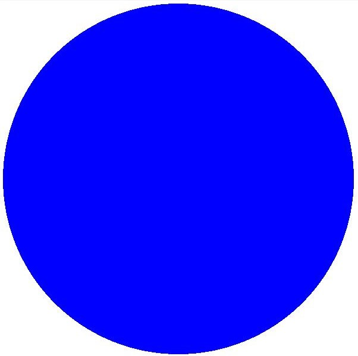
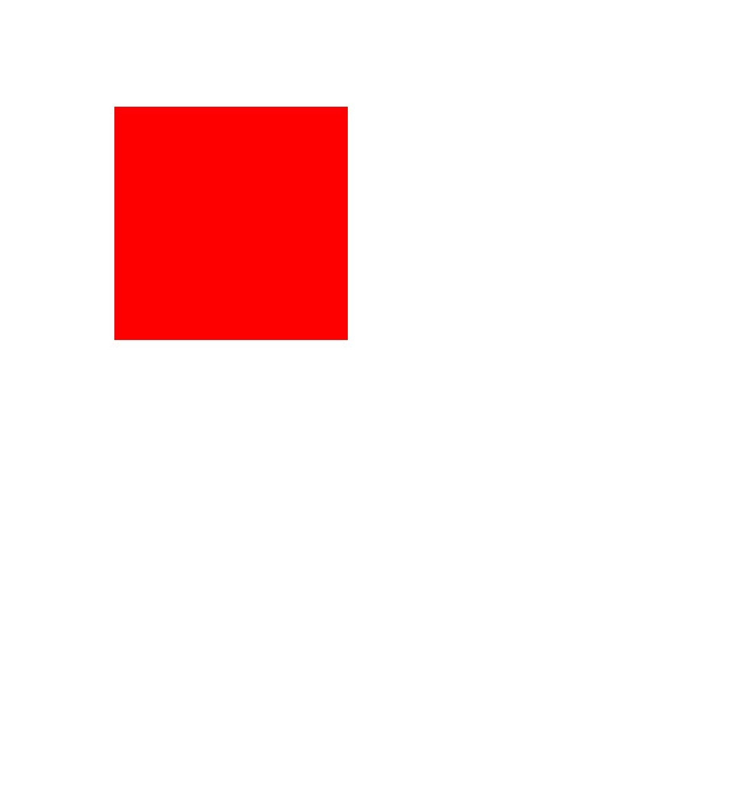
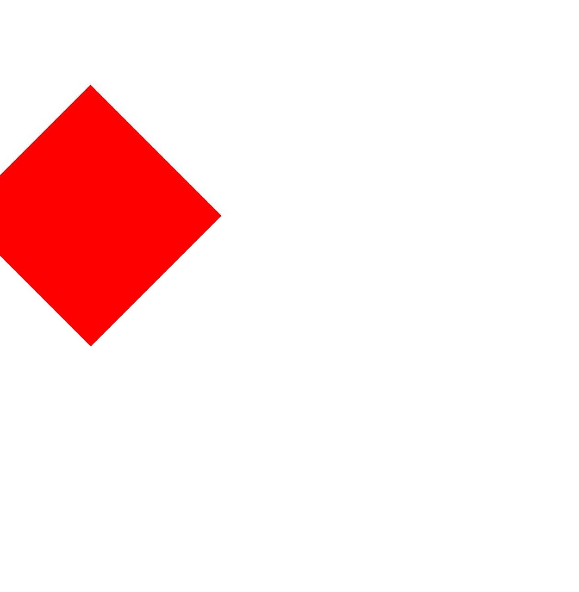
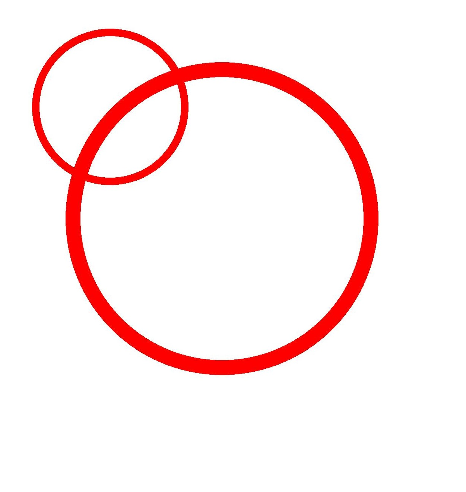

# 画布操作及状态处理（ArkTS）


## 场景介绍

创建或获取得到Canvas画布之后，可以基于画布进一步地进行图形操作和状态处理。画布操作属于可选操作，开发者可以根据场景需要进行。需要先进行画布操作，再进行后续绘制，只有这样画布操作才有效果。

常见的画布操作如下：

- 裁剪。

- 矩阵变换，如平移、缩放、旋转等。

- 状态保存与恢复。

更多画布操作和具体接口参数使用，请见[drawing.Canvas](../reference/apis-arkgraphics2d/js-apis-graphics-drawing.md#canvas)。


## 裁剪操作

裁剪是图形处理中的常见操作，裁剪针对的是画布本身，可以用于限制绘图区域，只在指定的区域内容进行绘制。需要先进行裁剪操作，再进行绘制，才会有对应效果。

当前支持的裁剪操作主要如下：

- 裁剪矩形。

- 裁剪圆角矩形。

- 裁剪自定义路径。

- 裁剪一个区域。


### 接口说明

裁剪操作常用接口如下表所示，详细的使用和参数说明请见[drawing.Canvas](../reference/apis-arkgraphics2d/js-apis-graphics-drawing.md#canvas)。


| 接口 | 描述 |
| -------- | -------- |
| clipRect(rect: common2D.Rect, clipOp?: ClipOp, doAntiAlias?: boolean): void | 用于裁剪一个矩形。 |
| clipRoundRect(roundRect: RoundRect, clipOp?: ClipOp, doAntiAlias?: boolean): void | 用于裁剪一个圆角矩形。 |
| clipPath(path: Path, clipOp?: ClipOp, doAntiAlias?: boolean): void | 用于裁剪一个自定义路径。 |
| clipRegion(region: Region, clipOp?: ClipOp): void | 用于裁剪一个区域。 |


### 开发示例

此处以在画布上裁剪矩形为例给出示例和效果图，其他裁剪操作的逻辑基本相同，注意调用对应的接口并确保要裁剪的数据类型对应准确即可，此处不再一一展开。具体详细的使用和参数说明请见[drawing.Canvas](../reference/apis-arkgraphics2d/js-apis-graphics-drawing.md#canvas)。

使用clipRect()接口裁剪矩形。有以下3个入参：


- rect是要裁剪的矩形区域。

- clipOp是裁剪方式，包括交集（INTERSECT）和差集（DIFFERENCE），具体可见[ClipOp](../reference/apis-arkgraphics2d/js-apis-graphics-drawing.md#clipop12)。

- doAntiAlias表示是否需要抗锯齿处理，如果为true则启用抗锯齿功能，在绘制图形时会对图形的边缘像素进行半透明的模糊处理，如果为false则不开启。


```ts
// 创建画刷
let brush = new drawing.Brush();
// 设置颜色为蓝色
brush.setColor(0xFF, 0x00,  0x00, 0xFF);
// 设置画刷填充效果
canvas.attachBrush(brush);
// 创建矩形对象
let rect: common2D.Rect = { left: 200, top: 200, right: 600, bottom: 600 };
// 裁剪矩形区域
canvas.clipRect(rect); 
// 绘制圆形
canvas.drawCircle(300, 300, 300);
// 去除填充效果
canvas.detachBrush();
```


| 原始图 | 裁剪后的图 |
| -------- | -------- |
|  |  |


## 矩阵变换操作

矩阵变换也是常见的画布操作，是一种坐标系的转换，用于进行图形的变化。

当前支持的矩阵变换主要如下：

- 平移

- 缩放

- 旋转


### 接口说明

矩阵变换操作常用接口如下表所示，详细的使用和参数说明请见[drawing.Canvas](../reference/apis-arkgraphics2d/js-apis-graphics-drawing.md#canvas)。

| 接口 | 描述 |
| -------- | -------- |
| translate(dx: number, dy: number): void | 用于平移画布一段距离。 |
| scale(sx: number, sy: number): void | 用于画布缩放。 |
| rotate(degrees: number, sx: number, sy: number): void | 用于画布旋转一定的角度，正数表示顺时针旋转，负数反之。 |
| skew(sx: number, sy: number) : void | 用于画布倾斜变换，包括水平轴和垂直轴上的偏移。 |


### 平移

使用translate()接口实现画布平移。接口接受2个参数，分别为水平方向和垂直方向的平移量，单位为px。

简单示例和示意图如下所示：


```ts
// 创建画刷
let brush = new drawing.Brush();
// 设置颜色为红色
brush.setColor(0xFF, 0xFF, 0x00, 0x00);
// 设置画刷填充效果
canvas.attachBrush(brush);
// 执行平移操作
canvas.translate(300, 300); 
// 绘制矩形
canvas.drawRect({ left: 200, top: 200, right: 600, bottom: 600 }); 
// 去除填充效果
canvas.detachBrush();
```


| 原始图 | 平移后的效果图 |
| -------- | -------- |
|  |  |


### 旋转

使用rotate()接口实现画布旋转，接口接受3个参数，分别为：旋转角度、旋转中心的x坐标和y坐标。


简单示例和示意图如下所示：


```ts
// 创建画刷
let brush = new drawing.Brush();
// 设置颜色为红色
brush.setColor(0xFF, 0xFF, 0x00, 0x00);
// 设置画刷填充效果
canvas.attachBrush(brush);
// 顺时针旋转45度
canvas.rotate(45, 200, 200);
// 绘制矩形
canvas.drawRect({ left: 200, top: 200, right: 600, bottom: 600 });
// 去除填充效果
canvas.detachBrush();
```


| 原始图 | 旋转后的效果图 |
| -------- | -------- |
|  |  |


### 缩放

使用scale()接口进行画布缩放，接口接受2个参数，分别为沿x轴和y轴的缩放因子。


简单示例和示意图如下所示：


```ts
// 创建画刷
let brush = new drawing.Brush();
// 设置颜色为红色
brush.setColor({ alpha: 0xFF, red: 0xFF, green: 0x00, blue: 0x00 });
// 设置画刷填充效果
canvas.attachBrush(brush);
// 执行放大操作
canvas.scale(2, 2);
// 绘制矩形
canvas.drawRect({ left: 200, top: 200, right: 600, bottom: 600 });
// 去除填充效果
canvas.detachBrush();
```


| 原始图 | 缩放后的效果图 |
| -------- | -------- |
|  |  |


## 画布状态保存与恢复


保存操作用于保存当前画布的状态到一个栈顶，恢复操作用于恢复保存在栈顶的画布状态，恢复操作一旦执行，保存和恢复操作中间一系列平移、缩放、剪裁等操作都会被清除。


### 接口说明

画布状态保存与恢复使用的接口如下表所示，详细的使用和参数说明请见[canvas](../reference/apis-arkgraphics2d/js-apis-graphics-drawing.md#canvas)。

| 接口 | 描述 |
| -------- | -------- |
| save(): void | 用于保存当前画布的状态（画布矩阵）到一个栈顶。 |
| restore(): void | 用于恢复保存在栈顶的画布状态（画布矩阵）。 |
| restoreToCount(count: number): void | 用于恢复到指定数量的画布状态（画布矩阵）。 |

简单示例和示意图如下所示：


```ts
// 创建画笔
let pen = new drawing.Pen();
// 设置颜色为红色
pen.setColor({ alpha: 0xFF, red: 0xFF, green: 0x00, blue: 0x00 });
// 设置描边宽度为20px
pen.setStrokeWidth(20);
// 设置画笔描边效果
canvas.attachPen(pen);
// 保存操作，当前是不存在放大等操作的，这个原始状态会被保存下来
canvas.save();
// x轴和y轴方向分别放大2倍
canvas.scale(2, 2);
// 绘制圆形，因为执行过放大操作，所以此时绘制的是大圆
canvas.drawCircle(300, 300, 200);
// 恢复操作，恢复到没有放大的原始状态
canvas.restore();
// 绘制圆形，因为已经恢复到没有放大的原始状态，所以此时绘制的是小圆
canvas.drawCircle(300, 300, 200);
// 去除描边效果
canvas.detachPen();
```




<!--RP1-->
## 相关实例

针对Drawing(ArkTS)的开发，有以下相关实例可供参考：

- [ArkTSGraphicsDraw (API14)](https://gitee.com/openharmony/applications_app_samples/tree/master/code/DocsSample/Drawing/ArkTSGraphicsDraw)
<!--RP1End-->