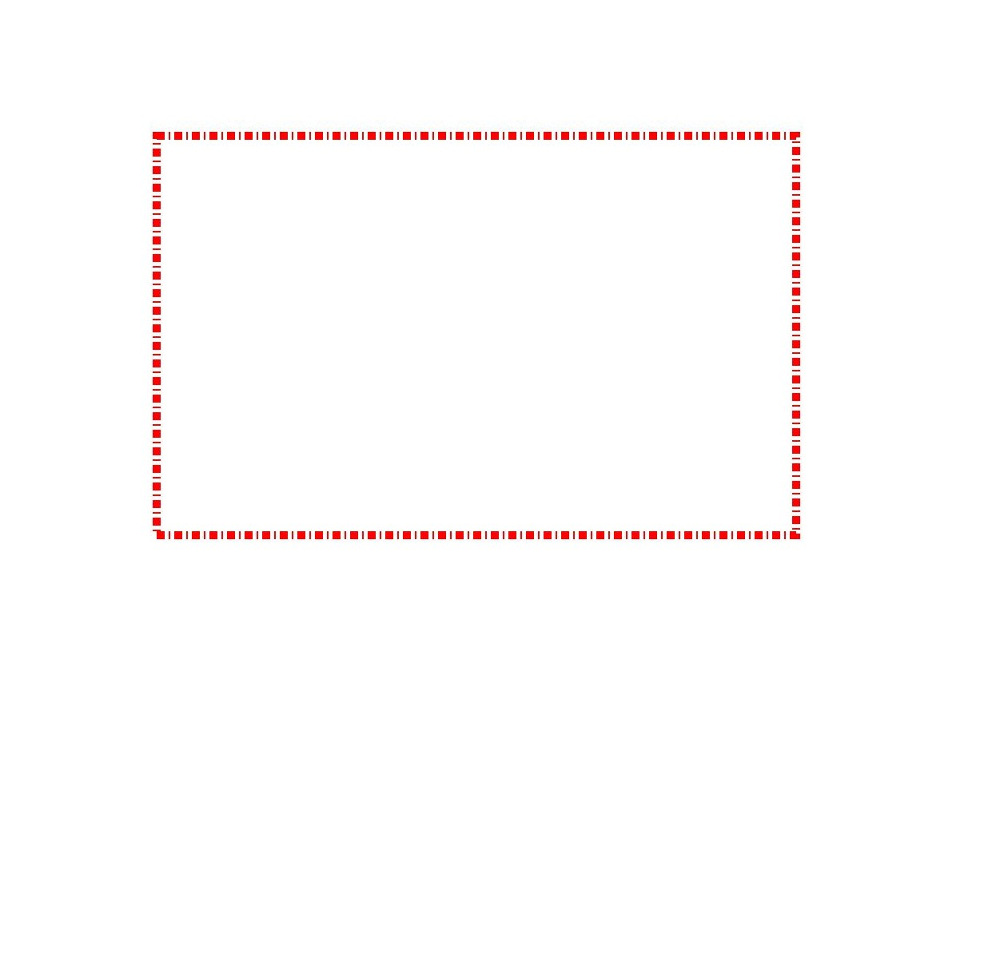
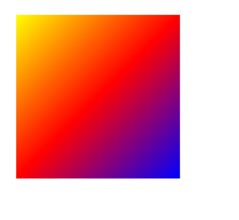
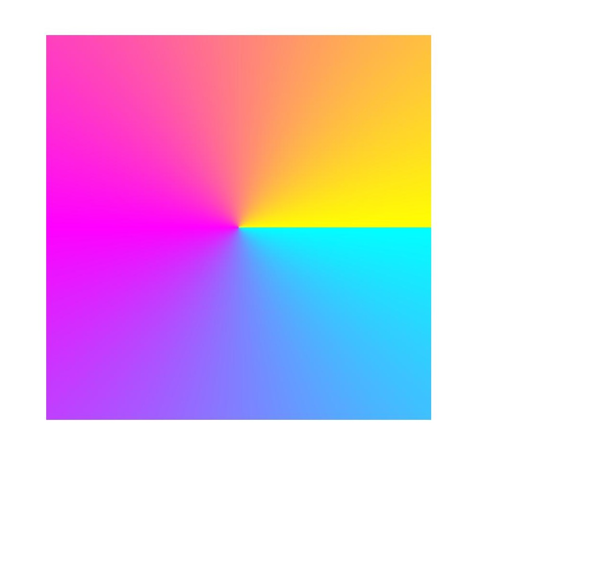
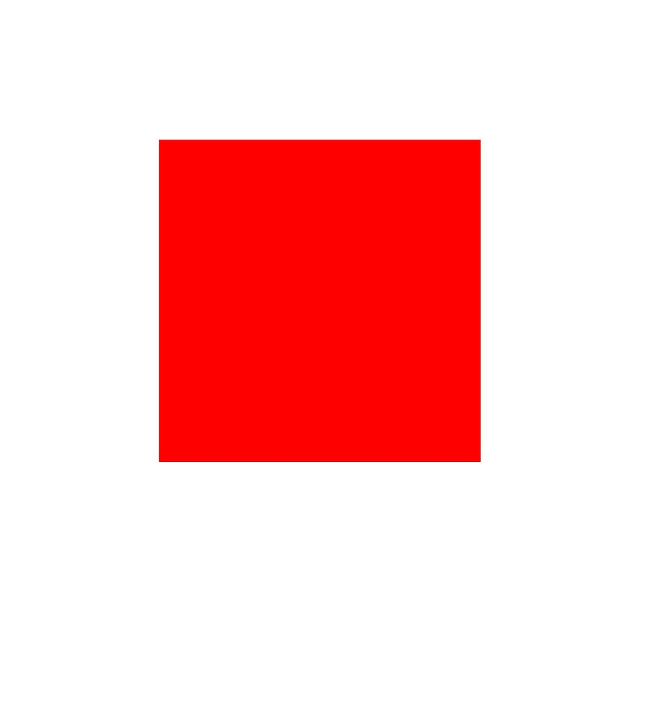

# 复杂绘制效果（ArkTS）


除了基础填充颜色、描边颜色和一些样式设置的绘制效果外，还支持通过画刷和画笔实现更多复杂的绘制效果。比如：


- 混合模式。

- 路径效果，如虚线效果。

- 着色器效果，如线性渐变、径向渐变等。

- 滤波效果，如模糊效果等。


## 混合模式

混合模式可以用于画笔或画刷，它定义了如何将源像素（要绘制的内容）与目标像素（已存在于画布上的内容）进行组合。

可以使用setBlendMode()接口将混合模式应用于画刷或画笔中，该接口需要接受一个参数BlendMode，即混合模式的类型，具体可参考[BlendMode](../reference/apis-arkgraphics2d/arkts-apis-graphics-drawing-e.md#blendmode)。

此处以使用画刷设置叠加混合模式为例（为了防止混合模式的效果被背景色干扰，示例中的canvas并未设置背景色，使用的是默认的黑色背景），关键示例和效果示意图如下所示：

```ts
// 创建画刷
let brush = new drawing.Brush();
// 设置目标像素颜色，即矩形的颜色
brush.setColor(0xFF, 0xFF,  0x00, 0x00);
// 将目标像素的画刷效果设置到Canvas中
canvas.attachBrush(brush);
// 创建矩形对象
let rect: common2D.Rect = { left: 100, top: 100, right: 600, bottom: 600 };
// 绘制矩形（目标像素）
canvas.drawRect(rect);
// 设置源像素颜色，即圆形的颜色
brush.setColor(0xFF, 0x00,  0x00, 0xFF);
// 设置混合模式为叠加模式
brush.setBlendMode(drawing.BlendMode.PLUS);
// 将源像素的画刷效果设置到Canvas中
canvas.attachBrush(brush);
// 绘制圆（源像素）
canvas.drawCircle(600, 600, 300);
// 去除填充效果
canvas.detachBrush();
```


## 路径效果

路径效果如虚线效果，只用于画笔。

可使用createDashPathEffect()接口设置路径效果。接口接受2个参数，分别为：

- 浮点数数组intervals：表示虚线或者点线的间隔。

- 浮点数phase：表示在intervals数组中的偏移量，即从数组的哪个位置开始应用虚线或点线效果。

此处以绘制矩形虚线路径效果为例，关键示例和效果示意图如下所示：

```ts
// 创建画笔
let pen = new drawing.Pen();
// 设置线宽
pen.setStrokeWidth(10.0);
// 设置颜色
pen.setColor(0xFF, 0xFF, 0x00, 0x00);
// 表示10px的实线，5px的间隔，2px的实线，5px的间隔，以此循环
let intervals = [10, 5, 2, 5];
// 设置虚线路径效果
let effect = drawing.PathEffect.createDashPathEffect(intervals, 0);
pen.setPathEffect(effect);
// 设置画笔描边效果
canvas.attachPen(pen);
// 创建矩形
let rect: common2D.Rect = { left: 200, top: 200, right: 1000, bottom: 700 };
// 绘制矩形
canvas.drawRect(rect);
// 去除描边效果
canvas.detachPen();
```

| 原始图 | 设置虚线效果后的效果图 |
| -------- | -------- |
|  |  |


## 着色器效果

着色器效果基于画刷或画笔实现，可使用setShaderEffect()接口设置画刷或画笔的着色器效果。当前支持不同的着色器效果，如线性渐变着色器效果、径向渐变着色器效果、扇形渐变着色器效果。


着色器相关接口和具体参数的说明请见[ShaderEffect](../reference/apis-arkgraphics2d/arkts-apis-graphics-drawing-ShaderEffect.md)。


### 线性渐变着色器效果

可使用createLinearGradient()接口创建想要设置的线性渐变着色器效果。接口接受6个参数，分别是开始点、结束点、颜色数组、平铺模式、相对位置数组以及矩阵对象。

- 开始点和结束点用来确定渐变方向。

- 颜色数组用于存储渐变使用到的颜色。

- 相对位置数组则用于确定每种颜色在渐变中的相对位置，如果相对位置为空，颜色将会被均匀地分布在开始点和结束点之间。

- 矩阵对象，用于对着色器做矩阵变换，默认为null，表示单位矩阵。

- 平铺模式用于确定如何在渐变区域之外继续渐变效果，平铺模式分为以下4类：
  - CLAMP：当图像超出其原始边界时，复制边缘颜色。
  - REPEAT：在水平和垂直方向上重复图像。
  - MIRROR：在水平和垂直方向上重复图像，并在相邻的图像之间交替使用镜像图像。
  - DECAL：只在原始域内绘制，在其他地方返回透明黑色。

此处以绘制矩形并使用画刷设置线性渐变着色器效果为例，关键示例和效果示意图如下所示：

```ts
let startPt: common2D.Point = { x: 100, y: 100 };
let endPt: common2D.Point = { x: 900, y: 900 };
let colors = [0xFFFFFF00, 0xFFFF0000, 0xFF0000FF];
// 创建线性渐变着色器
let shaderEffect = drawing.ShaderEffect.createLinearGradient(startPt, endPt, colors, drawing.TileMode.CLAMP);
// 创建画刷
let brush = new drawing.Brush();
// 设置线性着色器
brush.setShaderEffect(shaderEffect);
// 设置画刷填充效果
canvas.attachBrush(brush);
let rect: common2D.Rect = { left: 100, top: 100, right: 900, bottom: 900 };
// 绘制矩形
canvas.drawRect(rect);
// 去除填充效果
canvas.detachBrush();
```




### 径向渐变着色器效果

可使用createRadialGradient()接口创建想要设置的径向渐变着色器效果。接口接受6个参数，分别是圆心坐标（centerPt）、半径（radius）、颜色数组（colors）、平铺模式（TileMode）、相对位置数组（pos）以及矩阵对象（matrix）。

其实现方式与线性渐变着色器类似，不同的是，径向渐变是由圆心开始向外径向渐变的。

此处以绘制矩形并使用画刷设置径向渐变着色器效果为例，关键示例和效果示意图如下所示：

```ts
let centerPt: common2D.Point = { x: 500, y: 500 };
let colors = [0xFFFF0000, 0xFF00FF00, 0xFF0000FF];
// 创建径向渐变着色器
let shaderEffect = drawing.ShaderEffect.createRadialGradient(centerPt, 600, colors, drawing.TileMode.CLAMP);
// 创建画刷
let brush = new drawing.Brush();
// 设置径向渐变着色器
brush.setShaderEffect(shaderEffect);
// 设置画刷填充效果
canvas.attachBrush(brush);
let rect: common2D.Rect = { left: 100, top: 100, right: 900, bottom: 900 };
// 绘制矩形
canvas.drawRect(rect);
// 去除填充效果
canvas.detachBrush();
```


### 扇形渐变着色器效果

可使用createSweepGradient()接口创建想要设置的扇形渐变着色器效果。接口接受7个参数，分别是圆心坐标（centerPt）、颜色数组（colors）、平铺模式（TileMode）、扇形渐变的起始角度（startAngle）、扇形渐变的结束角度（endAngle）、相对位置数组（pos）以及矩阵对象（matrix）。

其实现方式也与线性渐变着色器类似，不同的是，扇形渐变是在围绕中心点旋转的过程中渐变。

此处以绘制矩形并使用画刷设置扇形渐变着色器效果为例，关键示例和效果示意图如下所示：

```ts
let centerPt: common2D.Point = { x: 500, y: 500 };
let colors = [0xFF00FFFF, 0xFFFF00FF, 0xFFFFFF00];
// 创建扇形渐变着色器
let shaderEffect = drawing.ShaderEffect.createSweepGradient(centerPt, colors, drawing.TileMode.CLAMP, 0, 360);
// 创建画刷
let brush = new drawing.Brush();
// 设置扇形渐变着色器
brush.setShaderEffect(shaderEffect);
// 设置画刷填充效果
canvas.attachBrush(brush);
let rect: common2D.Rect = { left: 100, top: 100, right: 900, bottom: 900 };
// 绘制矩形
canvas.drawRect(rect);
// 去除填充效果
canvas.detachBrush();
```




## 滤波器效果

滤波器效果可基于画刷或画笔实现。当前支持不同的滤波器效果，比如图像滤波器、颜色滤波器、蒙版滤波器。

滤波器相关接口和具体参数的说明请见[ImageFilter](../reference/apis-arkgraphics2d/arkts-apis-graphics-drawing-ImageFilter.md)。


### 颜色滤波器效果

颜色滤波器可基于画笔或画刷实现，颜色滤波器的相关接口和具体参数的说明请见[ColorFilter](../reference/apis-arkgraphics2d/arkts-apis-graphics-drawing-ColorFilter.md)。

目前可实现多种颜色滤波器，包括如下：

- 具有混合模式的颜色滤波器。

- 具有5x4颜色矩阵的颜色滤波器。

- 将SRGB的伽玛曲线应用到RGB颜色通道的颜色滤波器。

- 将RGB颜色通道应用于SRGB的伽玛曲线的颜色滤波器。

- 将其输入的亮度值乘以透明度通道， 并将红色、绿色和蓝色通道设置为零的颜色滤波器。

- 由两个颜色滤波器组合而成的颜色滤波器。

此处以具有5x4颜色矩阵的颜色滤波器为例。

可使用createMatrixColorFilter()接口创建具有5x4颜色矩阵的颜色滤波器。接口接受1个参数，表示为颜色矩阵，它是一个长度为20的浮点数数组。数组格式如下：

[ a0, a1, a2, a3, a4 ]

[ b0, b1, b2, b3, b4 ]

[ c0, c1, c2, c3, c4 ]

[ d0, d1, d2, d3, d4 ]

对于每个原始的像素颜色色值（R, G, B, A），变换后的色值（R', G', B', A'）计算公式为：

R' = a0\*R + a1\*G + a2\*B + a3\*A + a4

G' = b0\*R + b1\*G + b2\*B + b3\*A + b4

B' = c0\*R + c1\*G + c2\*B + c3\*A + c4

A' = d0\*R + d1\*G + d2\*B + d3\*A + d4

此处以绘制矩形并使用画刷设置具有5x4颜色矩阵的颜色滤波器效果为例，关键示例和效果示意图如下所示：

```ts
// 创建画刷
let brush = new drawing.Brush();
// 设置颜色
brush.setColor(0xFF, 0xFF, 0x00, 0x00);
// 设置颜色矩阵
let matrix: Array<number> = [
  1, 0, 0, 0, 0,
  0, 1, 0, 0, 0,
  0, 0, 0.5, 0.5, 0,
  0, 0, 0.5, 0.5, 0
];
// 创建5x4颜色矩阵的颜色滤波器
let filter = drawing.ColorFilter.createMatrixColorFilter(matrix);
// 设置颜色滤波器
brush.setColorFilter(filter);
// 设置画刷填充效果
canvas.attachBrush(brush);
let rect: common2D.Rect = { left: 300, top: 300, right: 900, bottom: 900 };
// 绘制矩形
canvas.drawRect(rect);
// 去除填充效果
canvas.detachBrush();
```

| 原始图 | 设置5x4颜色矩阵的颜色滤波器后的效果图 |
| -------- | -------- |
|  |  |


### 图像滤波器效果

图像滤波器可基于画笔或画刷来实现，图像滤波器的相关接口和具体参数的说明请见[ImageFilter](../reference/apis-arkgraphics2d/arkts-apis-graphics-drawing-ImageFilter.md)。

目前只支持两种图像滤波器：

- 基于颜色滤波器的图像滤波器。
  可通过createFromColorFilter()接口实现，接口接受2个参数，颜色滤波器colorFilter和图像滤波器imageFilter，即把颜色滤波器的效果叠加到图像滤波器imageFilter上，imageFilter可为空，imageFilter为空则只添加颜色滤波器效果。

- 具有模糊效果的图像滤波器。
  可通过createBlurImageFilter()接口实现，接口接受4个参数，sigmaX，sigmaY，cTileMode和imageFilter。sigmaX和sigmaY是模糊的标准差，cTileMode是平铺模式，imageFilter是输入的图像滤波器。

  最终效果即为在输入的图像滤波器imageFilter的基础上进行模糊化处理，即滤波器效果可叠加，imageFilter可为空，imageFilter为空则只添加模糊效果。

此处以绘制矩形并使用画笔添加模糊效果的图像滤波器效果为例，关键示例和效果示意图如下所示：

```ts
// 设置画笔
let pen = new drawing.Pen();
// 设置线宽
pen.setStrokeWidth(10.0);
// 设置颜色
pen.setColor(0xFF, 0xFF, 0x00, 0x00);
// 创建模糊效果图像滤波器
let filter = drawing.ImageFilter.createBlurImageFilter(20, 20, drawing.TileMode.CLAMP);
// 设置图像滤波器
pen.setImageFilter(filter);
// 设置画笔描边效果
canvas.attachPen(pen);
let rect: common2D.Rect = { left: 300, top: 300, right: 900, bottom: 900 };
// 绘制矩形
canvas.drawRect(rect);
// 去除描边效果
canvas.detachPen();
```

| 原始图 | 设置模糊效果后的效果图 |
| -------- | -------- |
|  |  |


### 蒙版滤波器效果

蒙版滤波器的模糊效果仅对透明度和形状边缘进行模糊处理，相对于图像滤波器的模糊效果来说计算成本更低。

蒙版滤波器可基于画笔或画刷实现，蒙版滤波器的相关接口和具体参数的说明请见[MaskFilter](../reference/apis-arkgraphics2d/arkts-apis-graphics-drawing-MaskFilter.md)。

可使用createBlurMaskFilter()接口创建想要设置具有模糊效果的蒙版滤波器。接口接受2个参数，分别为：

- blurType：用于指定要应用的模糊类型，详细分类请参考[BlurType](../reference/apis-arkgraphics2d/arkts-apis-graphics-drawing-e.md#blurtype12)。

- sigma：用于指定要应用的高斯模糊的标准差，标准差必须大于0。

此处以绘制矩形并使用画笔设置蒙版滤波器效果为例，关键示例和效果示意图如下所示：

```ts
// 创建画笔
let pen = new drawing.Pen();
// 设置线宽
pen.setStrokeWidth(10.0);
// 设置颜色
pen.setColor(0xFF, 0xFF, 0x00, 0x00);
// 创建模糊效果的蒙版滤波器
let filter = drawing.MaskFilter.createBlurMaskFilter(drawing.BlurType.NORMAL, 20);
// 设置模糊效果
pen.setMaskFilter(filter);
// 设置画笔描边效果
canvas.attachPen(pen);
let rect: common2D.Rect = { left: 300, top: 300, right: 900, bottom: 900 };
// 绘制矩形
canvas.drawRect(rect);
// 去除描边效果
canvas.detachPen();
```

| 原始图 | 设置模糊效果后的效果图 |
| -------- | -------- |
|  |  |

<!--RP1-->
## 相关实例

针对Drawing(ArkTS)的开发，有以下相关实例可供参考：

- [ArkTSGraphicsDraw (API14)](https://gitcode.com/openharmony/applications_app_samples/tree/master/code/DocsSample/Drawing/ArkTSGraphicsDraw)
<!--RP1End-->