# 复杂文本绘制与显示（C/C++）
<!--Kit: ArkGraphics 2D-->
<!--Subsystem: Graphics-->
<!--Owner: @oh_wangxk; @gmiao522; @Lem0nC-->
<!--Designer: @liumingxiang-->
<!--Tester: @yhl0101-->
<!--Adviser: @ge-yafang-->
在进行文本绘制时，可以通过选择合适的字体、大小和颜色完成简单文本的绘制与显示；此外，还支持通过设置其他丰富的样式、语言、段落等进行复杂文本的绘制。

复杂文本绘制主要包含以下几个场景：

- 多语言文本绘制与显示

- 多行文本绘制与显示

- 多样式文本绘制与显示

- 样式的拷贝、绘制与显示


## 多语言文本绘制与显示

多语言支持是全球化应用的基础。多语言文本绘制需要支持不同语言的字符集及其独特的显示需求，例如右到左语言（如阿拉伯语）或竖排文本（如中文）。开发者需要理解不同语言的渲染特性，确保文本的正确显示。

在多语言文本使用的场景下，主要通过指定TextStyle文本样式中的**locale**字段来实现，可直接通过locale字段的值优先匹配对应字体，跳过遍历列表匹配字体的过程，从而降低匹配时间和内存使用。

### 接口说明

| 接口定义 | 描述 | 
| -------- | -------- |
| void OH_Drawing_SetTypographyTextLocale(OH_Drawing_TypographyStyle\* style, const char\* locale) | 设置指定排版样式的语言环境。 | 


### 开发步骤

画布Canvas对象具体可见[画布的获取与绘制结果的显示](canvas-get-result-draw-c.md)。

```c++
// 创建一个 TypographyStyle，创建 TypographyCreate 时需要使用
OH_Drawing_TypographyStyle *typoStyle = OH_Drawing_CreateTypographyStyle();
// 设置文本对齐方式为居中
OH_Drawing_SetTypographyTextAlign(typoStyle, TEXT_ALIGN_CENTER);
// 设置 locale 为中文  
OH_Drawing_SetTypographyTextLocale(typoStyle, "zh-Hans");  

// 设置文字颜色、大小、字重，不设置 TextStyle 会使用 TypographyStyle 中的默认 TextStyle
OH_Drawing_TextStyle *txtStyle = OH_Drawing_CreateTextStyle();
OH_Drawing_SetTextStyleColor(txtStyle, OH_Drawing_ColorSetArgb(0xFF, 0x00, 0x00, 0x00));
OH_Drawing_SetTextStyleFontSize(txtStyle, 100);
OH_Drawing_SetTextStyleFontWeight(txtStyle, FONT_WEIGHT_400);

// 创建 FontCollection，FontCollection 用于管理字体匹配逻辑
OH_Drawing_FontCollection *fc = OH_Drawing_CreateSharedFontCollection();
// 使用 FontCollection 和 之前创建的 TypographyStyle 创建 TypographyCreate。TypographyCreate 用于创建 Typography
OH_Drawing_TypographyCreate *handler = OH_Drawing_CreateTypographyHandler(typoStyle, fc);

// 将之前创建的 TextStyle 加入 handler 中
OH_Drawing_TypographyHandlerPushTextStyle(handler, txtStyle);
// 设置文本内容，并将文本添加到 handler 中
const char *text = "你好，中文\n";
OH_Drawing_TypographyHandlerAddText(handler, text);  

// 通过 handler 创建一个 Typography
OH_Drawing_Typography *typography = OH_Drawing_CreateTypography(handler);
// 设置排版宽度
double layoutWidth = 1310;
OH_Drawing_TypographyLayout(typography, layoutWidth);
// 设置文本在画布上绘制的起始位置
double position[2] = {0, 1140};
// 将文本绘制到画布上
OH_Drawing_TypographyPaint(typography, canvas, position[0], position[1]);

// 释放内存
OH_Drawing_DestroyTypographyStyle(typoStyle);
OH_Drawing_DestroyTextStyle(txtStyle);
OH_Drawing_DestroyFontCollection(fc);
OH_Drawing_DestroyTypographyHandler(handler);
OH_Drawing_DestroyTypography(typography);
```


### 效果展示

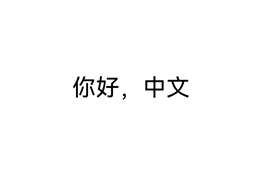


## 多行文本绘制与显示

多行文本相对于单行文本比较复杂，一般针对多行文本，需要进行文本排版、断词策略设置、文本对齐方式、最大行数限制等，主要通过设置段落样式实现。


### 接口说明

| 接口定义 | 描述 | 
| -------- | -------- |
| void OH_Drawing_SetTypographyTextAlign(OH_Drawing_TypographyStyle\* style, int align) | 设置文本对齐方式。 | 
| void OH_Drawing_SetTypographyTextWordBreakType(OH_Drawing_TypographyStyle\* style, int wordBreakType) | 设置单词的断词方式。 | 
| void OH_Drawing_SetTypographyTextMaxLines(OH_Drawing_TypographyStyle\* style, int lineNumber) | 设置文本最大行数。 | 


### 开发步骤

```c++
// 设置排版宽度
double layoutWidth = 800;
// 创建 FontCollection，FontCollection 用于管理字体匹配逻辑
OH_Drawing_FontCollection *fc = OH_Drawing_CreateSharedFontCollection();

// 设置文字颜色、大小、字重，不设置 TextStyle 会使用 TypographyStyle 中的默认 TextStyle
OH_Drawing_TextStyle *txtStyle = OH_Drawing_CreateTextStyle();
OH_Drawing_SetTextStyleColor(txtStyle, OH_Drawing_ColorSetArgb(0xFF, 0x00, 0x00, 0x00));
OH_Drawing_SetTextStyleFontSize(txtStyle, 50);
OH_Drawing_SetTextStyleFontWeight(txtStyle, FONT_WEIGHT_400);
// 当断词策略为WORD_BREAK_TYPE_BREAK_HYPHEN时，需要为段落设置语言偏好，段落会在不同语言偏好下呈现不同的文本断词效果
// OH_Drawing_SetTextStyleLocale(txtStyle, "en-gb");

// 设置文本内容
const char *text =
    "Nunc quis augue viverra, venenatis arcu eu, gravida odio. Integer posuere nisi quis ex pretium, a dapibus "
    "nisl gravida. Mauris lacinia accumsan enim, non tempus ligula. Mauris iaculis dui eu nisi tristique, in porta "
    "urna varius. Orci varius natoque penatibus et magnis dis parturient montes, nascetur ridiculus mus. Mauris "
    "congue nibh mi, vel ultrices ex volutpat et. Aliquam consectetur odio in libero tristique, a mattis ex "
    "mollis. Praesent et nisl iaculis, facilisis metus nec, faucibus lacus. Duis nec dolor at nibh eleifend "
    "tempus. Nunc et enim interdum, commodo eros ac, pretium sapien. Pellentesque laoreet orci a nunc pharetra "
    "pharetra.";


// 创建一个断词策略为 BREAK_ALL 的 TypographyStyle
OH_Drawing_TypographyStyle *typoStyle = OH_Drawing_CreateTypographyStyle();
// 设置文本对齐方式为居中
OH_Drawing_SetTypographyTextAlign(typoStyle, TEXT_ALIGN_CENTER);
// 设置断词策略为 WORD_BREAK_TYPE_BREAK_ALL
OH_Drawing_SetTypographyTextWordBreakType(typoStyle, WORD_BREAK_TYPE_BREAK_ALL);
// 设置最大行数为 10，行数大于 10 的部分不显示
OH_Drawing_SetTypographyTextMaxLines(typoStyle, 10);

// 使用之前创建的 FontCollection 和 TypographyStyle 创建 TypographyCreate。TypographyCreate 用于创建 Typography
OH_Drawing_TypographyCreate *handler = OH_Drawing_CreateTypographyHandler(typoStyle, fc);
// 将之前创建的 TextStyle 加入 handler
OH_Drawing_TypographyHandlerPushTextStyle(handler, txtStyle);
// 将文本添加到 handler 中
OH_Drawing_TypographyHandlerAddText(handler, text);

OH_Drawing_Typography *typography = OH_Drawing_CreateTypography(handler);
OH_Drawing_TypographyLayout(typography, layoutWidth);
// 设置文本在画布上绘制的起始位置
double positionBreakAll[2] = {0, 0};
// 将文本绘制到画布上
OH_Drawing_TypographyPaint(typography, canvas, positionBreakAll[0], positionBreakAll[1]);

// 创建一个断词策略为 BREAK_WORD 的 TypographyStyle
// OH_Drawing_TypographyStyle *typoStyle = OH_Drawing_CreateTypographyStyle();
// OH_Drawing_SetTypographyTextAlign(typoStyle, TEXT_ALIGN_CENTER);
// OH_Drawing_SetTypographyTextWordBreakType(typoStyle, WORD_BREAK_TYPE_BREAK_WORD);
// OH_Drawing_TypographyCreate *handler = OH_Drawing_CreateTypographyHandler(typoStyle, fc);
// OH_Drawing_TypographyHandlerPushTextStyle(handler, txtStyle);
// OH_Drawing_TypographyHandlerAddText(handler, text);
// OH_Drawing_Typography *typography = OH_Drawing_CreateTypography(handler);
// OH_Drawing_TypographyLayout(typography, layoutWidth);
// double positionBreakWord[2] = {0, 100};
// OH_Drawing_TypographyPaint(typography, canvas, positionBreakWord[0], positionBreakWord[1]);

// 创建一个断词策略为 BREAK_HYPHEN 的 TypographyStyle
// OH_Drawing_TypographyStyle *typoStyle = OH_Drawing_CreateTypographyStyle();
// OH_Drawing_SetTypographyTextStyle(typoStyle, txtStyle);
// OH_Drawing_SetTypographyTextAlign(typoStyle, TEXT_ALIGN_LEFT);
// OH_Drawing_SetTypographyTextWordBreakType(typoStyle, WORD_BREAK_TYPE_BREAK_HYPHEN);
// OH_Drawing_TypographyCreate *handler = OH_Drawing_CreateTypographyHandler(typoStyle, fc);
// OH_Drawing_TypographyHandlerPushTextStyle(handler, txtStyle);
// OH_Drawing_TypographyHandlerAddText(handler, text);
// OH_Drawing_Typography *typography = OH_Drawing_CreateTypography(handler);
// OH_Drawing_TypographyLayout(typography, layoutWidth);
// double positionBreakWord[2] = {0, 100};
// OH_Drawing_TypographyPaint(typography, canvas, positionBreakWord[0], positionBreakWord[1]);

// 释放内存
OH_Drawing_DestroyFontCollection(fc);
OH_Drawing_DestroyTextStyle(txtStyle);
OH_Drawing_DestroyTypographyStyle(typoStyle);
OH_Drawing_DestroyTypographyHandler(handler);
OH_Drawing_DestroyTypography(typography);
```


### 效果展示

| BREAK_ALL | BREAK_WORD | 
| -------- | -------- |
| 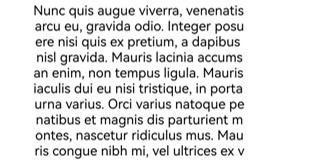 | 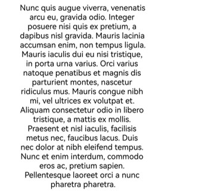 | 

| BREAK_HYPHEN（locale：未设置） | BREAK_HYPHEN（locale：en-gb） | BREAK_HYPHEN（locale：en-us） | 
| -------- | -------- |-------- |
|  | 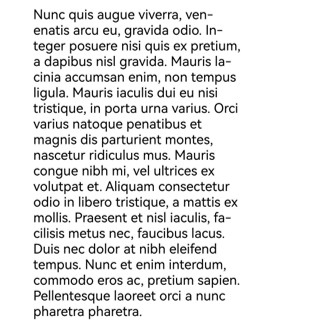 | 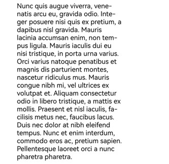 |

## 多样式文本绘制与显示

除基本文字、排版属性之外，针对应用中不同文本的设计，开发者可能需要设置使用不同的绘制样式或能力，以凸显对应文本的独特表现或风格，此时可以结合使用多种绘制样式进行文本的渲染。

当前支持的多样式绘制及各绘制样式侧重效果如下：

- **装饰线样式绘制：** 主要通过不同的线条样式对文本进行装饰，可以使文本更加突出，富有表现力。

- **字体特性绘制：** 主要通过字体的变化，包括粗细、斜体等特性来改变文本的外观，增强文本的可读性和美观性。

- **可变字体绘制：** 对应提供文本在不同的显示环境和设备上灵活调整的能力，可满足更为精细的视觉效果。

- **文本阴影绘制：** 主要通过在文本周围添加阴影效果，以提升文本的层次感和立体感，从而使文本更具吸引力。

- **占位符绘制：** 可以在不确定文本内容时保持文本布局的稳定性，使得文本显示更为流畅和自然。

- **自动间距绘制：** 可以在一些字符混排切换的地方自动添加额外间距，提升阅读体验。

- **渐变色绘制：** 可以为文字提供颜色渐变效果，增强文字表现力。

- **垂直对齐：** 调整文本在垂直方向排版位置，提升排版质量。

- **上下标：** 可以将任意字符处理成上标或下标，更精准表达文本含义。

- **高对比度文字绘制：** 主要通过将深色文字变黑、浅色文字变白，增强文本的对比效果。

### 装饰线

**装饰线**是指在文本上方、下方或中间添加的装饰性线条，当前支持上划线、下划线、删除线。

可以通过添加文本装饰线，提升文本的视觉效果和可读性。

使用装饰线需要初始化装饰线样式对象，并添加到文本样式中，从而在文本绘制时生效。


| 接口定义 | 描述 | 
| -------- | -------- |
| void OH_Drawing_SetTextStyleDecoration(OH_Drawing_TextStyle\* style, int decoration) | 设置指定文本样式中的装饰线类型，只能设置一个装饰线类型，添加多个需要使用OH_Drawing_AddTextStyleDecoration。 | 
| void OH_Drawing_SetTextStyleDecorationStyle(OH_Drawing_TextStyle\* style, int decorationStyle) | 设置指定文本样式中的装饰线样式。 | 
| void OH_Drawing_SetTextStyleDecorationColor(OH_Drawing_TextStyle\* style, uint32_t color) | 设置指定文本样式中的装饰线颜色。 | 


示例及示意效果如下所示：

```c++
// 创建一个TypographyStyle创建Typography时需要使用
OH_Drawing_TypographyStyle *typoStyle = OH_Drawing_CreateTypographyStyle();
// 设置文本对齐方式为居中
OH_Drawing_SetTypographyTextAlign(typoStyle, TEXT_ALIGN_CENTER);
// 设置文本内容
const char *text = "Hello World Drawing\n";

// 设置文字颜色、大小、字重，不设置 TextStyle 会使用 TypographyStyle 中的默认 TextStyle
OH_Drawing_TextStyle *txtStyleWithDeco = OH_Drawing_CreateTextStyle();
OH_Drawing_SetTextStyleColor(txtStyleWithDeco, OH_Drawing_ColorSetArgb(0xFF, 0x00, 0x00, 0x00));
OH_Drawing_SetTextStyleFontSize(txtStyleWithDeco, 100);
OH_Drawing_SetTextStyleFontWeight(txtStyleWithDeco, FONT_WEIGHT_400);
// 设置装饰线为 LINE_THROUGH
OH_Drawing_SetTextStyleDecoration(txtStyleWithDeco, TEXT_DECORATION_LINE_THROUGH);
// 设置装饰线样式为 WAVY
OH_Drawing_SetTextStyleDecorationStyle(txtStyleWithDeco, TEXT_DECORATION_STYLE_WAVY);
// 设置装饰线颜色
OH_Drawing_SetTextStyleDecorationColor(txtStyleWithDeco, OH_Drawing_ColorSetArgb(0xFF, 0x6F, 0xFF, 0xFF));

// 创建一个不带装饰线的 TextStyle 用于对比
OH_Drawing_TextStyle *txtStyleNoDeco = OH_Drawing_CreateTextStyle();
// 设置文字颜色、大小、字重，不设置 TextStyle 会使用 TypographyStyle 中的默认 TextStyle
OH_Drawing_SetTextStyleColor(txtStyleNoDeco, OH_Drawing_ColorSetArgb(0xFF, 0x00, 0x00, 0x00));
OH_Drawing_SetTextStyleFontSize(txtStyleNoDeco, 100);
OH_Drawing_SetTextStyleFontWeight(txtStyleNoDeco, FONT_WEIGHT_400);

// 创建 FontCollection，FontCollection 用于管理字体匹配逻辑
OH_Drawing_FontCollection *fc = OH_Drawing_CreateSharedFontCollection();
// 使用 FontCollection 和 之前创建的 TypographyStyle 创建 TypographyCreate。TypographyCreate 用于创建 Typography
OH_Drawing_TypographyCreate *handler = OH_Drawing_CreateTypographyHandler(typoStyle, fc);

// 加入带有装饰线的文本样式
OH_Drawing_TypographyHandlerPushTextStyle(handler, txtStyleWithDeco);
// 将文本添加到 handler 中
OH_Drawing_TypographyHandlerAddText(handler, text);

// 后续加入的不带装饰线的文本样式
OH_Drawing_TypographyHandlerPushTextStyle(handler, txtStyleNoDeco);
// 将文本添加到 handler 中
OH_Drawing_TypographyHandlerAddText(handler, text);

OH_Drawing_Typography *typography = OH_Drawing_CreateTypography(handler);
// 设置排版宽度
double layoutWidth = 1310;
OH_Drawing_TypographyLayout(typography, layoutWidth);
// 设置文本在画布上绘制的起始位置
double position[2] = {0, 1140};
// 将文本绘制到画布上
OH_Drawing_TypographyPaint(typography, canvas, position[0], position[1]);

// 释放内存
OH_Drawing_DestroyTypographyStyle(typoStyle);
OH_Drawing_DestroyTextStyle(txtStyleWithDeco);
OH_Drawing_DestroyTextStyle(txtStyleNoDeco);
OH_Drawing_DestroyFontCollection(fc);
OH_Drawing_DestroyTypographyHandler(handler);
OH_Drawing_DestroyTypography(typography);
```


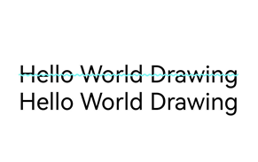


### 字体特征

**字体特征**绘制专注于在文本渲染过程中对字体特性（如粗体、斜体、字体变种等）的处理，允许字体在不同的排版场景下表现出不同的效果，可用于增强文本的表现力，使其更符合设计和阅读需求。

常见的**FontFeature**包含有liga、frac、case等，需要对应的ttf文件支持才能正常使能。


| 接口定义 | 描述 | 
| -------- | -------- |
| void OH_Drawing_TextStyleAddFontFeature(OH_Drawing_TextStyle\* style, const char\* tag, int value) | 设置文本样式中指定字体特征是否启用。 | 


示例及示意效果如下所示：


```c++
// 创建一个 TypographyStyle，创建 TypographyCreate 时需要使用
OH_Drawing_TypographyStyle *typoStyle = OH_Drawing_CreateTypographyStyle();
// 设置文本对齐方式为居中
OH_Drawing_SetTypographyTextAlign(typoStyle, TEXT_ALIGN_CENTER);
// 设置文本内容
const char *text = "1/2 1/3 1/4\n";

// 设置文字颜色、大小、字重，不设置TextStyle无法绘制出文本
OH_Drawing_TextStyle *txtStyleWithFeature = OH_Drawing_CreateTextStyle();
OH_Drawing_SetTextStyleColor(txtStyleWithFeature, OH_Drawing_ColorSetArgb(0xFF, 0x00, 0x00, 0x00));
OH_Drawing_SetTextStyleFontSize(txtStyleWithFeature, 100);
OH_Drawing_SetTextStyleFontWeight(txtStyleWithFeature, FONT_WEIGHT_900);
// 设置启用frac font feature，此功能将斜线分隔的数字替换为普通（对角线）分数。
OH_Drawing_TextStyleAddFontFeature(txtStyleWithFeature, "frac", 1);

// 创建一个不带字体特征的 TextStyle 用于对比
OH_Drawing_TextStyle *txtStyleNoFeature = OH_Drawing_CreateTextStyle();
// 设置文字颜色、大小、字重。不设置 TextStyle 无法绘制出文本
OH_Drawing_SetTextStyleColor(txtStyleNoFeature, OH_Drawing_ColorSetArgb(0xFF, 0x00, 0x00, 0x00));
OH_Drawing_SetTextStyleFontSize(txtStyleNoFeature, 100);
OH_Drawing_SetTextStyleFontWeight(txtStyleNoFeature, FONT_WEIGHT_900);

// 创建 FontCollection，FontCollection 用于管理字体匹配逻辑
OH_Drawing_FontCollection *fc = OH_Drawing_CreateSharedFontCollection();
// 使用 FontCollection 和 之前创建的 TypographyStyle 创建 TypographyCreate。TypographyCreate 用于创建 Typography
OH_Drawing_TypographyCreate *handler = OH_Drawing_CreateTypographyHandler(typoStyle, fc);

// 加入带有字体特征的文本样式
OH_Drawing_TypographyHandlerPushTextStyle(handler, txtStyleWithFeature);
// 将文本添加到 handler 中
OH_Drawing_TypographyHandlerAddText(handler, text);
// 弹出之前创建的 TextStyle
OH_Drawing_TypographyHandlerPopTextStyle(handler);

// 后续加入的不带字体特征的文本样式
OH_Drawing_TypographyHandlerPushTextStyle(handler, txtStyleNoFeature);
// 将文本添加到 handler 中
OH_Drawing_TypographyHandlerAddText(handler, text);
// 弹出之前创建的 TextStyle
OH_Drawing_TypographyHandlerPopTextStyle(handler);

OH_Drawing_Typography *typography = OH_Drawing_CreateTypography(handler);
// 设置排版宽度
double layoutWidth = 1310;
OH_Drawing_TypographyLayout(typography, layoutWidth);
// 设置文本在画布上绘制的起始位置
double position[2] = {0, 1140};
// 将文本绘制到画布上
OH_Drawing_TypographyPaint(typography, canvas, position[0], position[1]);

// 释放内存
OH_Drawing_DestroyTypographyStyle(typoStyle);
OH_Drawing_DestroyTextStyle(txtStyleWithFeature);
OH_Drawing_DestroyTextStyle(txtStyleNoFeature);
OH_Drawing_DestroyFontCollection(fc);
OH_Drawing_DestroyTypographyHandler(handler);
OH_Drawing_DestroyTypography(typography);
```


### 可变字体

**可变字体**是一种在一个字体文件中包含多个字形变体的字体格式，允许在一个字体文件内灵活地调整字体的各种属性（如字重、字宽、斜体等）。

与传统字体文件（每种变体需要一个独立的文件）不同，可变字体在一个字体文件中包含多个变体轴，可通过使用可变字体实现文本渲染绘制时的平滑过渡。


| 接口定义 | 描述 | 
| -------- | -------- |
| void OH_Drawing_TextStyleAddFontVariation(OH_Drawing_TextStyle\* style, const char\* axis, const float value) | 添加可变字体属性。对应的字体文件（.ttf文件）需要支持可变调节，此接口才能生效。当对应的字体不支持可变调节时，此接口调用不生效。 | 


示例及示意效果如下所示：


```c++
// 创建一个 TypographyStyle 创建 Typography 时需要使用
OH_Drawing_TypographyStyle *typoStyle = OH_Drawing_CreateTypographyStyle();
// 设置文本对齐方式为居中
OH_Drawing_SetTypographyTextAlign(typoStyle, TEXT_ALIGN_CENTER);
// 设置文字内容
const char *text = "Hello World Drawing\n";

OH_Drawing_TextStyle *txtStyleWithVar = OH_Drawing_CreateTextStyle();
// 设置可变字体的字重，在字体文件支持的情况下，还可以设置"slnt", "wdth"
OH_Drawing_TextStyleAddFontVariation(txtStyleWithVar, "wght", 800);
// 设置文字颜色、大小、字重，不设置 TextStyle 会使用 TypographyStyle 中的默认 TextStyle
OH_Drawing_SetTextStyleColor(txtStyleWithVar, OH_Drawing_ColorSetArgb(0xFF, 0x00, 0x00, 0x00));
OH_Drawing_SetTextStyleFontSize(txtStyleWithVar, 100);
// 此处设置字重不生效，将被可变字体的字重覆盖
OH_Drawing_SetTextStyleFontWeight(txtStyleWithVar, FONT_WEIGHT_400);

// 创建一个不带可变字体的 TextStyle 用于对比
OH_Drawing_TextStyle *txtStyleNoVar = OH_Drawing_CreateTextStyle();
// 设置文字颜色、大小、字重，不设置 TextStyle 会使用 TypographyStyle 中的默认 TextStyle
OH_Drawing_SetTextStyleColor(txtStyleNoVar, OH_Drawing_ColorSetArgb(0xFF, 0x00, 0x00, 0x00));
OH_Drawing_SetTextStyleFontSize(txtStyleNoVar, 100);
OH_Drawing_SetTextStyleFontWeight(txtStyleNoVar, FONT_WEIGHT_400);

// 创建 FontCollection，FontCollection 用于管理字体匹配逻辑
OH_Drawing_FontCollection *fc = OH_Drawing_CreateSharedFontCollection();
// 使用 FontCollection 和 之前创建的 TypographyStyle 创建 TypographyCreate。TypographyCreate 用于创建 Typography
OH_Drawing_TypographyCreate *handler = OH_Drawing_CreateTypographyHandler(typoStyle, fc);

// 加入带有可变字体的文本样式
OH_Drawing_TypographyHandlerPushTextStyle(handler, txtStyleWithVar);
// 将文本添加到 handler 中
OH_Drawing_TypographyHandlerAddText(handler, text);
// 弹出之前创建的 TextStyle
OH_Drawing_TypographyHandlerPopTextStyle(handler);

// 后续加入的不带可变字体的文本样式
OH_Drawing_TypographyHandlerPushTextStyle(handler, txtStyleNoVar);
// 将文本添加到 handler 中
OH_Drawing_TypographyHandlerAddText(handler, text);
// 弹出之前创建的 TextStyle
OH_Drawing_TypographyHandlerPopTextStyle(handler);

OH_Drawing_Typography *typography = OH_Drawing_CreateTypography(handler);
// 设置排版宽度
double layoutWidth = 1310;
OH_Drawing_TypographyLayout(typography, layoutWidth);
// 设置文本在画布上绘制的起始位置
double position[2] = {0, 1140};
// 将文本绘制到画布上
OH_Drawing_TypographyPaint(typography, canvas, position[0], position[1]);

// 释放内存
OH_Drawing_DestroyTypographyStyle(typoStyle);
OH_Drawing_DestroyTextStyle(txtStyleWithVar);
OH_Drawing_DestroyTextStyle(txtStyleNoVar);
OH_Drawing_DestroyFontCollection(fc);
OH_Drawing_DestroyTypographyHandler(handler);
OH_Drawing_DestroyTypography(typography);
```


### 文本阴影

**文本阴影**为文本提供了深度感，使得文本在背景上更具立体感。通常用于提升文本的视觉吸引力或增强可读性，尤其是在色彩对比度较低的场景下。

其中，TextShadow有三个属性，分别为阴影颜色color、阴影基于当前文本的偏移位置point、阴影半径blurRadius。

使用阴影效果需要在文本样式中设置对应的阴影效果数组，从而在文本绘制时生效。


| 接口定义 | 描述 | 
| -------- | -------- |
| OH_Drawing_Point\* OH_Drawing_PointCreate(float x, float y) | 用于创建一个坐标点对象。 | 
| OH_Drawing_TextShadow\* OH_Drawing_CreateTextShadow(void) | 创建指向字体阴影对象的指针。 | 
| void OH_Drawing_SetTextShadow(OH_Drawing_TextShadow\* shadow, uint32_t color, OH_Drawing_Point\* offset, double blurRadius) | 设置字体阴影对象的参数。 | 
| void OH_Drawing_TextStyleAddShadow(OH_Drawing_TextStyle\* style, const OH_Drawing_TextShadow\* shadow) | 字体阴影容器中添加字体阴影元素。 | 
| void OH_Drawing_DestroyTextShadow(OH_Drawing_TextShadow\* shadow) | 释放被字体阴影对象占据的内存。 | 


示例及示意效果如下所示：


```c++
// 创建一个 TypographyStyle 创建 Typography 时需要使用
OH_Drawing_TypographyStyle *typoStyle = OH_Drawing_CreateTypographyStyle();
// 设置文本对齐方式为居中
OH_Drawing_SetTypographyTextAlign(typoStyle, TEXT_ALIGN_CENTER);
// 设置文本内容
const char *text = "Hello World Drawing\n";

// 设置文字颜色、大小、字重，不设置 TextStyle 会使用 TypographyStyle 中的默认 TextStyle
OH_Drawing_TextStyle *txtStyleWithShadow = OH_Drawing_CreateTextStyle();
OH_Drawing_SetTextStyleColor(txtStyleWithShadow, OH_Drawing_ColorSetArgb(0xFF, 0x00, 0x00, 0x00));
OH_Drawing_SetTextStyleFontSize(txtStyleWithShadow, 100);
OH_Drawing_SetTextStyleFontWeight(txtStyleWithShadow, FONT_WEIGHT_400);
// 设置阴影偏移量
OH_Drawing_Point *offset = OH_Drawing_PointCreate(1, 1);
OH_Drawing_TextShadow *shadow = OH_Drawing_CreateTextShadow();
// 为 TextShadow 设置样式
OH_Drawing_SetTextShadow(shadow, OH_Drawing_ColorSetArgb(0xFF, 0x00, 0x00, 0x00), offset, 10);
// 将 TextShadow 加入 TextStyle
OH_Drawing_TextStyleAddShadow(txtStyleWithShadow, shadow);

// 创建一个不带阴影的 TextStyle 用于对比
OH_Drawing_TextStyle *txtStyleNoShadow = OH_Drawing_CreateTextStyle();
// 设置文字颜色、大小、字重，不设置 TextStyle 会使用 TypographyStyle 中的默认 TextStyle
OH_Drawing_SetTextStyleColor(txtStyleNoShadow, OH_Drawing_ColorSetArgb(0xFF, 0x00, 0x00, 0x00));
OH_Drawing_SetTextStyleFontSize(txtStyleNoShadow, 100);
OH_Drawing_SetTextStyleFontWeight(txtStyleNoShadow, FONT_WEIGHT_400);

// 创建 FontCollection，FontCollection 用于管理字体匹配逻辑
OH_Drawing_FontCollection *fc = OH_Drawing_CreateSharedFontCollection();
// 使用 FontCollection 和 之前创建的 TypographyStyle 创建 TypographyCreate。TypographyCreate 用于创建 Typography
OH_Drawing_TypographyCreate *handler = OH_Drawing_CreateTypographyHandler(typoStyle, fc);

// 加入带有阴影的文本样式
OH_Drawing_TypographyHandlerPushTextStyle(handler, txtStyleWithShadow);
// 将文本添加到 handler 中
OH_Drawing_TypographyHandlerAddText(handler, text);

// 后续加入的不带阴影的文本样式
OH_Drawing_TypographyHandlerPushTextStyle(handler, txtStyleNoShadow);
// 将文本添加到 handler 中
OH_Drawing_TypographyHandlerAddText(handler, text);

OH_Drawing_Typography *typography = OH_Drawing_CreateTypography(handler);
// 设置排版宽度
double layoutWidth = 1310;
OH_Drawing_TypographyLayout(typography, layoutWidth);
// 设置文本在画布上绘制的起始位置
double position[2] = {0, 1140};
// 将文本绘制到画布上
OH_Drawing_TypographyPaint(typography, canvas, position[0], position[1]);

// 释放内存
OH_Drawing_DestroyTypographyStyle(typoStyle);
OH_Drawing_DestroyTextStyle(txtStyleWithShadow);
OH_Drawing_DestroyPoint(offset);
OH_Drawing_DestroyTextShadow(shadow);
OH_Drawing_DestroyTextStyle(txtStyleNoShadow);
OH_Drawing_DestroyFontCollection(fc);
OH_Drawing_DestroyTypographyHandler(handler);
OH_Drawing_DestroyTypography(typography);
```


### 占位符

占位符绘制用于处理文本中占位符符号的渲染。

占位符也是用来实现图文混排的关键，是指在实际图像或内容注册之前，用来预先提供或替代某个位置的视觉元素。


| 接口定义 | 描述 | 
| -------- | -------- |
| void OH_Drawing_TypographyHandlerAddPlaceholder(OH_Drawing_TypographyCreate\* handler, OH_Drawing_PlaceholderSpan\* span) | 设置占位符。 | 


示例及示意效果如下所示：


```c++
// 设置排版宽度
double layoutWidth = 1310;
// 创建 FontCollection，FontCollection 用于管理字体匹配逻辑
OH_Drawing_FontCollection *fc = OH_Drawing_CreateSharedFontCollection();

// 设置文字颜色、大小、字重，不设置 TextStyle 会使用 TypographyStyle 中的默认 TextStyle
OH_Drawing_TextStyle *txtStyle = OH_Drawing_CreateTextStyle();
OH_Drawing_SetTextStyleColor(txtStyle, OH_Drawing_ColorSetArgb(0xFF, 0x00, 0x00, 0x00));
OH_Drawing_SetTextStyleFontSize(txtStyle, 100);
OH_Drawing_SetTextStyleFontWeight(txtStyle, FONT_WEIGHT_400);

// 设置文本内容
const char *text = "Hello World Drawing\n";

// 创建一个 TypographyStyle 创建 Typography 时需要使用
OH_Drawing_TypographyStyle *typoStyle = OH_Drawing_CreateTypographyStyle();
// 设置文本对齐方式为居中
OH_Drawing_SetTypographyTextAlign(typoStyle, TEXT_ALIGN_CENTER);

// 使用 FontCollection 和 之前创建的 TypographyStyle 创建 TypographyCreate。TypographyCreate 用于创建 Typography
OH_Drawing_TypographyCreate *handlerWithPlaceholder = OH_Drawing_CreateTypographyHandler(typoStyle, fc);
// 创建一个 placeholder，并且初始化其成员变量
OH_Drawing_PlaceholderSpan placeholder;
placeholder.width = 200.0;
placeholder.height = 200.0;
placeholder.alignment = ALIGNMENT_ABOVE_BASELINE; // 基线对齐策略
placeholder.baseline = TEXT_BASELINE_ALPHABETIC;                  // 使用的文本基线类型
placeholder.baselineOffset = 0.0; // 相比基线的偏移量。只有对齐策略是 OFFSET_AT_BASELINE 时生效

// 将 placeholder 放在开头
OH_Drawing_TypographyHandlerAddPlaceholder(handlerWithPlaceholder, &placeholder);

// 将之前创建的 TextStyle 加入 handler
OH_Drawing_TypographyHandlerPushTextStyle(handlerWithPlaceholder, txtStyle);
// 将文本添加到 handler 中
OH_Drawing_TypographyHandlerAddText(handlerWithPlaceholder, text);

OH_Drawing_Typography *typographyWithPlaceholder = OH_Drawing_CreateTypography(handlerWithPlaceholder);
OH_Drawing_TypographyLayout(typographyWithPlaceholder, layoutWidth);
// 设置文本在画布上绘制的起始位置
double positionBreakAll[2] = {0, 0};
// 将文本绘制到画布上
OH_Drawing_TypographyPaint(typographyWithPlaceholder, canvas, positionBreakAll[0], positionBreakAll[1]);

// 创建 OH_Drawing_TypographyCreate
OH_Drawing_TypographyCreate *handlerNoPlaceholder = OH_Drawing_CreateTypographyHandler(typoStyle, fc);
// 将之前创建的 TextStyle 加入 handler
OH_Drawing_TypographyHandlerPushTextStyle(handlerNoPlaceholder, txtStyle);
// 将文本添加到 handler 中
OH_Drawing_TypographyHandlerAddText(handlerNoPlaceholder, text);

OH_Drawing_Typography *typographyNoPlaceholder = OH_Drawing_CreateTypography(handlerNoPlaceholder);
OH_Drawing_TypographyLayout(typographyNoPlaceholder, layoutWidth);
// 设置文本在画布上绘制的起始位置
double positionBreakWord[2] = {0, 1140};
// 将文本绘制到画布上
OH_Drawing_TypographyPaint(typographyNoPlaceholder, canvas, positionBreakWord[0], positionBreakWord[1]);

// 释放内存
OH_Drawing_DestroyFontCollection(fc);
OH_Drawing_DestroyTextStyle(txtStyle);
OH_Drawing_DestroyTypographyStyle(typoStyle);
OH_Drawing_DestroyTypographyHandler(handlerWithPlaceholder);
OH_Drawing_DestroyTypographyHandler(handlerNoPlaceholder);
OH_Drawing_DestroyTypography(typographyWithPlaceholder);
OH_Drawing_DestroyTypography(typographyNoPlaceholder);
```


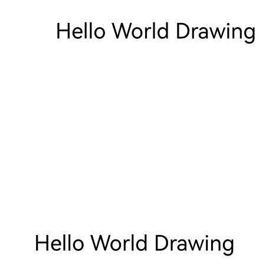


### 自动间距

使能自动间距，则会在文本排版时自动调整CJK（中文字符、日文字符、韩文字符）与西文（拉丁字母、西里尔字母、希腊字母）、CJK与数字、CJK与版权符号、版权符号与数字、版权符号与西文之间的间距。例如，在中英文混排场景中，使能自动间距即可在中英文切换的地方自动添加额外间距，提升阅读体验。


| 接口定义 | 描述 | 
| -------- | -------- |
| void OH_Drawing_SetTypographyTextAutoSpace(OH_Drawing_TypographyStyle \*style, bool enableAutoSpace) |设置文本排版时是否使能自动间距。默认不使能自动间距，一旦使能则会自动调整CJK（中文字符、日文字符、韩文字符）与西文（拉丁字母、西里尔字母、希腊字母）、CJK与数字、CJK与版权符号、版权符号与数字、版权符号与西文之间的间距。 | 


示例及示意效果如下所示：


```c++
// 创建一个TypographyStyle创建Typography时需要使用
OH_Drawing_TypographyStyle *typoStyle = OH_Drawing_CreateTypographyStyle();
// 设置使能自动间距，默认为false
OH_Drawing_SetTypographyTextAutoSpace(typoStyle, true);
// 设置文字内容
const char *text = "test测试©test©测试。";

OH_Drawing_TextStyle *txtStyle = OH_Drawing_CreateTextStyle();
// 设置文字颜色、大小、字重，不设置TextStyle会使用TypographyStyle中的默认TextStyle
OH_Drawing_SetTextStyleColor(txtStyle, OH_Drawing_ColorSetArgb(0xFF, 0x00, 0x00, 0x00));
OH_Drawing_SetTextStyleFontSize(txtStyle, 100);

// 创建FontCollection，FontCollection用于管理字体匹配逻辑
OH_Drawing_FontCollection *fc = OH_Drawing_CreateSharedFontCollection();
// 使用FontCollection和之前创建的TypographyStyle创建TypographyCreate。TypographyCreate用于创建Typography
OH_Drawing_TypographyCreate *handler = OH_Drawing_CreateTypographyHandler(typoStyle, fc);

// 将文本样式添加到handler中
OH_Drawing_TypographyHandlerPushTextStyle(handler, txtStyle);
// 将文本添加到handler中
OH_Drawing_TypographyHandlerAddText(handler, text);
// 创建段落
OH_Drawing_Typography *typography = OH_Drawing_CreateTypography(handler);
// 设置排版宽度
double layoutWidth = 1310;
// 将段落按照排版宽度进行排版
OH_Drawing_TypographyLayout(typography, layoutWidth);
// 设置文本在画布上绘制的起始位置
double position[2] = {0, 1140};
// 将文本绘制到画布上
OH_Drawing_TypographyPaint(typography, canvas, position[0], position[1]);

// 释放内存
OH_Drawing_DestroyTypographyStyle(typoStyle);
OH_Drawing_DestroyTextStyle(txtStyle);
OH_Drawing_DestroyFontCollection(fc);
OH_Drawing_DestroyTypographyHandler(handler);
OH_Drawing_DestroyTypography(typography);
```

| 段落样式设置（自动间距） | 示意效果 | 
| -------- | -------- |
| 不使能自动间距 | 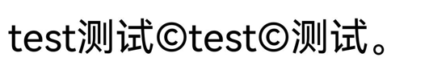 | 
| 使能自动间距 |  | 

### 渐变色

**渐变色**是一种在文字设计中广泛应用的视觉效果，通过在文字的不同部分应用不同的颜色，从而创造出从一种颜色平滑过渡到另一种颜色的效果。可以通过着色器实现文字渐变的效果，着色器的更多介绍请参考[着色器效果](complex-drawing-effect-c.md#着色器效果)。


| 接口定义 | 描述 | 
| -------- | -------- |
| void OH_Drawing_SetTextStyleForegroundBrush(OH_Drawing_TextStyle\* style, OH_Drawing_Brush* foregroundBrush) | 添加前景画刷，渐变着色器属性依附于前景画刷中。 | 


示例及效果如下所示：
```c++
OH_Drawing_TypographyStyle *typoStyle = OH_Drawing_CreateTypographyStyle();
OH_Drawing_TextStyle *txtStyle = OH_Drawing_CreateTextStyle();
// 设置文字大小
OH_Drawing_SetTextStyleFontSize(txtStyle, 100);
// 创建着色器对象，并设置颜色、变化起始点与结束点
OH_Drawing_Point *startPt = OH_Drawing_PointCreate(0, 0);
OH_Drawing_Point *endPt = OH_Drawing_PointCreate(900, 900);
uint32_t colors[] = {0xFFFFFF00, 0xFFFF0000, 0xFF0000FF};
float pos[] = {0.0f, 0.5f, 1.0f};
OH_Drawing_ShaderEffect *colorShaderEffect =
    OH_Drawing_ShaderEffectCreateLinearGradient(startPt, endPt, colors, pos, 3, OH_Drawing_TileMode::CLAMP);
// 创建画刷对象,并将着色器添加到画刷
OH_Drawing_Brush* brush = OH_Drawing_BrushCreate();
OH_Drawing_BrushSetShaderEffect(brush, colorShaderEffect);
// 将画刷添加到文本样式中
OH_Drawing_SetTextStyleForegroundBrush(txtStyle, brush);
// 创建排版对象，并绘制
OH_Drawing_FontCollection *fc = OH_Drawing_CreateSharedFontCollection();
OH_Drawing_TypographyCreate *handler = OH_Drawing_CreateTypographyHandler(typoStyle, fc);
OH_Drawing_TypographyHandlerPushTextStyle(handler, txtStyle);
const char *text = "Hello World";
OH_Drawing_TypographyHandlerAddText(handler, text);
OH_Drawing_Typography *typography = OH_Drawing_CreateTypography(handler);
OH_Drawing_TypographyLayout(typography, 1000);
OH_Drawing_TypographyPaint(typography, canvas, 0, 0);

// 释放对象
OH_Drawing_DestroyFontCollection(fc);
OH_Drawing_ShaderEffectDestroy(colorShaderEffect);
OH_Drawing_BrushDestroy(brush);
OH_Drawing_DestroyTextStyle(txtStyle);
OH_Drawing_DestroyTypographyStyle(typoStyle);
OH_Drawing_DestroyTypographyHandler(handler);
OH_Drawing_DestroyTypography(typography);
```


### 垂直对齐

**垂直对齐**用于调整文本在一行中垂直方向的排版位置。开启行高缩放或行内存在不同字号文本混排时使能垂直对齐，可以让文本实现顶部对齐、居中对齐、底部对齐或基线对齐（默认）。

| 接口定义 | 描述 | 
| -------- | -------- |
| void OH_Drawing_SetTypographyVerticalAlignment(OH_Drawing_TypographyStyle* style, OH_Drawing_TextVerticalAlignment align) | 设置文本垂直方向排版方式。| 

示例及效果如下所示：
```c++
OH_Drawing_TypographyStyle *typoStyle = OH_Drawing_CreateTypographyStyle();
OH_Drawing_TextStyle *txtStyle = OH_Drawing_CreateTextStyle();
// 设置垂直对齐方式
OH_Drawing_SetTypographyVerticalAlignment(typoStyle, OH_Drawing_TextVerticalAlignment::TEXT_VERTICAL_ALIGNMENT_CENTER);
// 设置文字大小
OH_Drawing_SetTextStyleFontSize(txtStyle, 30);
// 设置文字颜色
OH_Drawing_SetTextStyleColor(txtStyle, OH_Drawing_ColorSetArgb(0xFF, 0x00, 0x00, 0x00));
// 创建排版对象，并绘制
OH_Drawing_FontCollection *fc = OH_Drawing_CreateSharedFontCollection();
OH_Drawing_TypographyCreate *handler = OH_Drawing_CreateTypographyHandler(typoStyle, fc);
OH_Drawing_TypographyHandlerPushTextStyle(handler, txtStyle);
const char *text = "VerticalAlignment-center";
OH_Drawing_TypographyHandlerAddText(handler, text);
OH_Drawing_Typography *typography = OH_Drawing_CreateTypography(handler);
OH_Drawing_TypographyLayout(typography, 1000);
OH_Drawing_TypographyPaint(typography, canvas, 0, 0);

// 释放对象
OH_Drawing_DestroyFontCollection(fc);
OH_Drawing_DestroyTextStyle(txtStyle);
OH_Drawing_DestroyTypographyStyle(typoStyle);
OH_Drawing_DestroyTypographyHandler(handler);
OH_Drawing_DestroyTypography(typography);
```

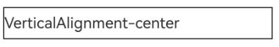

### 上下标

**上下标**能将文本作为上标或下标参与排版。一般用于数学公式、化学式等场景。

| 接口定义 | 描述 | 
| -------- | -------- |
| void OH_Drawing_SetTextStyleBadgeType(OH_Drawing_TextStyle* style, OH_Drawing_TextBadgeType textBadgeType) | 使能上下标样式。| 

示例及效果如下所示：
```c++
OH_Drawing_TypographyStyle *typoStyle = OH_Drawing_CreateTypographyStyle();
OH_Drawing_TextStyle *txtStyle = OH_Drawing_CreateTextStyle();
OH_Drawing_TextStyle *badgeTxtStyle = OH_Drawing_CreateTextStyle();
// 设置文字大小
OH_Drawing_SetTextStyleFontSize(txtStyle, 30);
OH_Drawing_SetTextStyleFontSize(badgeTxtStyle, 30);
// 设置文字颜色
OH_Drawing_SetTextStyleColor(txtStyle, OH_Drawing_ColorSetArgb(0xFF, 0x00, 0x00, 0x00));
OH_Drawing_SetTextStyleColor(badgeTxtStyle, OH_Drawing_ColorSetArgb(0xFF, 0x00, 0x00, 0x00));
// 使能文本上标
OH_Drawing_SetTextStyleBadgeType(badgeTxtStyle, OH_Drawing_TextBadgeType::TEXT_SUPERSCRIPT);
// 创建排版对象，并绘制
OH_Drawing_FontCollection *fc = OH_Drawing_CreateSharedFontCollection();
OH_Drawing_TypographyCreate *handler = OH_Drawing_CreateTypographyHandler(typoStyle, fc);
OH_Drawing_TypographyHandlerPushTextStyle(handler, txtStyle);
const char *text = "Mass-energy equivalence: E=mc";
OH_Drawing_TypographyHandlerAddText(handler, text);
OH_Drawing_TypographyHandlerPushTextStyle(handler, badgeTxtStyle);
const char *badgeText = "2";
OH_Drawing_TypographyHandlerAddText(handler, badgeText);
OH_Drawing_Typography *typography = OH_Drawing_CreateTypography(handler);
OH_Drawing_TypographyLayout(typography, 1000);
OH_Drawing_TypographyPaint(typography, canvas, 0, 0);

// 释放对象
OH_Drawing_DestroyFontCollection(fc);
OH_Drawing_DestroyTextStyle(txtStyle);
OH_Drawing_DestroyTextStyle(badgeTxtStyle);
OH_Drawing_DestroyTypographyStyle(typoStyle);
OH_Drawing_DestroyTypographyHandler(handler);
OH_Drawing_DestroyTypography(typography);
```

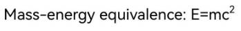

### 高对比度

高对比度可将深色文字变黑、浅色文字变白。开发者可选择开启或关闭应用的高对比度文字渲染，或遵循系统设置中的高对比度文字配置。


| 接口定义 | 描述 | 
| -------- | -------- |
| void OH_Drawing_SetTextHighContrast(OH_Drawing_TextHighContrast action) | 设置文字渲染高对比度模式。模式具体可参考[OH_Drawing_TextHighContrast](../reference/apis-arkgraphics2d/capi-drawing-text-global-h.md#oh_drawing_texthighcontrast)。 | 


示例及示意效果如下所示：


```c++
// 开启APP的文字渲染高对比模式，该模式的优先级要高于系统设置中的高对比度文字配置
OH_Drawing_SetTextHighContrast(TEXT_APP_ENABLE_HIGH_CONTRAST);
// 创建一个 TypographyStyle，创建 Typography 时需要使用
OH_Drawing_TypographyStyle *typoStyle = OH_Drawing_CreateTypographyStyle();

// 设置文字颜色、大小，不设置 TextStyle 会使用 TypographyStyle 中的默认 TextStyle
OH_Drawing_TextStyle *txtStyle = OH_Drawing_CreateTextStyle();
OH_Drawing_SetTextStyleColor(txtStyle, OH_Drawing_ColorSetArgb(0xFF, 0x6F, 0xFF, 0xFF));
OH_Drawing_SetTextStyleFontSize(txtStyle, 100);

// 创建 FontCollection，FontCollection 用于管理字体匹配逻辑
OH_Drawing_FontCollection *fc = OH_Drawing_CreateSharedFontCollection();
// 使用 FontCollection 和 之前创建的 TypographyStyle 创建 TypographyCreate
OH_Drawing_TypographyCreate *handler = OH_Drawing_CreateTypographyHandler(typoStyle, fc);

// 将之前创建的 TextStyle 加入 handler 中
OH_Drawing_TypographyHandlerPushTextStyle(handler, txtStyle);
// 设置文本内容，并将文本添加到 handler 中
const char *text = "Hello World Drawing\n";
OH_Drawing_TypographyHandlerAddText(handler, text);  

OH_Drawing_Typography *typography = OH_Drawing_CreateTypography(handler);
OH_Drawing_TypographyLayout(typography, 1250);
// 将文本绘制到画布上
OH_Drawing_TypographyPaint(typography, canvas, 10, 800);

// 释放内存
OH_Drawing_DestroyTypographyStyle(typoStyle);
OH_Drawing_DestroyTextStyle(txtStyle);
OH_Drawing_DestroyFontCollection(fc);
OH_Drawing_DestroyTypographyHandler(handler);
OH_Drawing_DestroyTypography(typography);
```

| 高对比度设置 | 示意效果 | 
| -------- | -------- |
| 不开启高对比度 |  | 
| 开启高对比度 |  | 

## 样式的拷贝、绘制与显示
支持拷贝文本样式、段落样式、阴影样式，以便快速复制相关样式作用到不同文字上。

| 接口定义 | 描述 | 
| -------- | -------- |
| OH_Drawing_TypographyStyle\* OH_Drawing_CopyTypographyStyle(OH_Drawing_TypographyStyle\* style) | 创建一个段落样式的对象副本，用于拷贝一个已有的段落样式对象。 | 
| OH_Drawing_TextStyle* OH_Drawing_CopyTextStyle(OH_Drawing_TextStyle* style) | 创建一个文本样式的对象副本，用于拷贝一个已有的文本样式对象。 | 
| OH_Drawing_TextShadow* OH_Drawing_CopyTextShadow(OH_Drawing_TextShadow* shadow) | 创建一个文本阴影的对象副本，用于拷贝一个已有的文本阴影对象。 | 

示例及示意效果如下所示：

```c++
// 创建一个TypographyStyle，其中创建Typography时需要使用
OH_Drawing_TypographyStyle *typoStyle = OH_Drawing_CreateTypographyStyle();
// 配置段落样式包括：使能自动间距、最大行数、省略号样式、省略号文本、对齐方式
// 使能自动间距
OH_Drawing_SetTypographyTextAutoSpace(typoStyle, true);
// 设置段落最大行数为3行
OH_Drawing_SetTypographyTextMaxLines(typoStyle, 3);
// 设置省略号模式为尾部省略号
OH_Drawing_SetTypographyTextEllipsisModal(typoStyle, ELLIPSIS_MODAL_TAIL);
// 设置省略号文本
OH_Drawing_SetTypographyTextEllipsis(typoStyle, "...");
// 设置对齐方式为居中对齐
OH_Drawing_SetTypographyTextAlign(typoStyle, TEXT_ALIGN_CENTER);

OH_Drawing_TextStyle *txtStyle = OH_Drawing_CreateTextStyle();
// 设置文字颜色、大小、字重，不设置TextStyle会使用TypographyStyle中的默认TextStyle
OH_Drawing_SetTextStyleColor(txtStyle, OH_Drawing_ColorSetArgb(0xFF, 0x00, 0x00, 0x00));
OH_Drawing_SetTextStyleFontSize(txtStyle, 100);
// 设置文本的装饰线
// 添加下划线
OH_Drawing_SetTextStyleDecoration(txtStyle, TEXT_DECORATION_UNDERLINE);
// 设置装饰线样式为波浪线样式
OH_Drawing_SetTextStyleDecorationStyle(txtStyle, ARKUI_TEXT_DECORATION_STYLE_WAVY);
// 设置下划线粗细
OH_Drawing_SetTextStyleDecorationThicknessScale(txtStyle, 1);
// 设置下划线颜色为蓝色
OH_Drawing_SetTextStyleDecorationColor(txtStyle, OH_Drawing_ColorSetArgb(0xFF, 0x00, 0x00, 0xFF)); 

// 设置阴影的颜色、偏移量、模糊半径
// 创建阴影对象
OH_Drawing_TextShadow *shadow = OH_Drawing_CreateTextShadow();
// 设置阴影偏移量
OH_Drawing_Point *offset = OH_Drawing_PointCreate(5, 5);
// 定义阴影模糊半径
double blurRadius = 4;
OH_Drawing_SetTextShadow(shadow, OH_Drawing_ColorSetArgb(0xFF, 0xFF, 0x00, 0xFF), offset, blurRadius);

// 拷贝阴影对象
OH_Drawing_TextShadow *shadowCopy = OH_Drawing_CopyTextShadow(shadow);
// 将拷贝出的阴影添加到文本样式中
OH_Drawing_TextStyleAddShadow(txtStyle, shadowCopy);

// 创建FontCollection，FontCollection用于管理字体匹配逻辑
OH_Drawing_FontCollection *fc = OH_Drawing_CreateSharedFontCollection();

// 使用FontCollection和之前创建的TypographyStyle创建TypographyCreate。TypographyCreate用于创建Typography
OH_Drawing_TypographyCreate *handler = OH_Drawing_CreateTypographyHandler(typoStyle, fc);
// 将段落一文本样式添加到handler中
OH_Drawing_TypographyHandlerPushTextStyle(handler, txtStyle);
// 将段落一文本添加到handler中
const char *text = "The text style, paragraph style, and text shadow of the copied text will be exactly the same as those of the original text.";
OH_Drawing_TypographyHandlerAddText(handler, text);
// 创建段落一，并将段落一按照排版宽度进行排版
OH_Drawing_Typography *typography = OH_Drawing_CreateTypography(handler);
double layoutWidth = 1200;
OH_Drawing_TypographyLayout(typography, layoutWidth);
// 将段落一文本绘制到画布上
double position[2] = {0, 500.0};
OH_Drawing_TypographyPaint(typography, canvas, position[0], position[1]);

// 生成第二段文本，其中，文本样式和段落样式均由第一段文本拷贝而来
// 复制文本样式
OH_Drawing_TextStyle *textStyleCopy = OH_Drawing_CopyTextStyle(txtStyle);
// 复制段落样式
OH_Drawing_TypographyStyle *typographyStyleCopy = OH_Drawing_CopyTypographyStyle(typoStyle);

// 使用复制的样式创建段落二，后续可以观察段落一和段落二是否绘制效果一致
OH_Drawing_TypographyCreate *handlerCopy = OH_Drawing_CreateTypographyHandler(typographyStyleCopy, fc);
OH_Drawing_TypographyHandlerPushTextStyle(handlerCopy, textStyleCopy);
OH_Drawing_TypographyHandlerAddText(handlerCopy, text);
OH_Drawing_Typography *typographyCopy = OH_Drawing_CreateTypography(handlerCopy);
OH_Drawing_TypographyLayout(typographyCopy, layoutWidth);
// 将段落二文本绘制到画布上
double positionCopy[2] = {0, 1200.0};
OH_Drawing_TypographyPaint(typographyCopy, canvas, positionCopy[0], positionCopy[1]);

// 释放内存
OH_Drawing_DestroyFontCollection(fc);
OH_Drawing_DestroyTypographyStyle(typoStyle);
OH_Drawing_DestroyTextStyle(txtStyle);
OH_Drawing_DestroyTypographyHandler(handler);
OH_Drawing_DestroyTypography(typography);
// 拷贝的段落样式也需要释放内存
OH_Drawing_DestroyTypographyStyle(typographyStyleCopy);
// 拷贝的文本样式也需要释放内存
OH_Drawing_DestroyTextStyle(textStyleCopy);
OH_Drawing_DestroyTypographyHandler(handlerCopy);
OH_Drawing_DestroyTypography(typographyCopy);
```
	
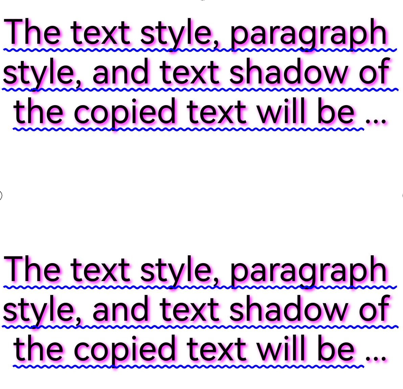