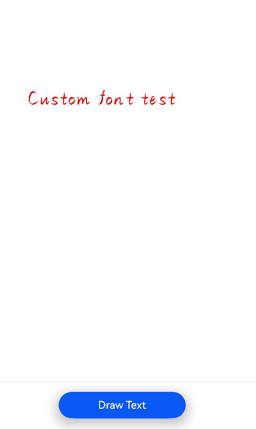

# 自定义字体的注册和使用（ArkTS）

## 场景介绍

自定义字体是指开发者根据应用需求创建或选择的字体，通常用于实现特定的文字风格或满足独特的设计要求。当应用需要使用特定的文本样式和字符集时，可以注册并使用自定义字体进行文本渲染。

## 实现流程

**自定义字体的注册**是指将字体文件（如ttf、otf文件等）从应用资源注册到系统中，使得应用能够使用这些字体进行文本渲染。注册过程通常指将字体文件通过字体管理接口注册到系统字体库中，以便在应用中进行调用。

**自定义字体的使用**是指在应用中显式指定使用已注册的自定义字体进行文本渲染。开发者可以根据需要选择特定的文本样式（如常规、粗体、斜体等），并将其应用到UI元素、文本控件或其他文本展示区域，以确保符合设计要求并提供一致的视觉效果。


## 接口说明

自定义字体注册和使用的常用接口如下表所示，详细接口说明请见[@ohos.graphics.text (文本模块)](../reference/apis-arkgraphics2d/js-apis-graphics-text.md)。

| 接口 | 描述 | 
| -------- | -------- |
| loadFontSync(name: string, path: string \| Resource): void | 同步接口，将路径对应的文件，以name作为使用的别名，注册自定义字体。<br/>**说明：**<br/>需保证使用自定义字体时，自定义字体已完成注册，非性能严格要求场景下，建议使用同步接口。 | 
| loadFont(name: string, path: string \| Resource): Promise&lt;void&gt; | 使用指定的别名和文件路径注册对应字体，使用Promise异步回调。此接口从API version 14开始支持。 | 

## 开发步骤

1. 导入依赖的相关模块。

   ```ts
   import { NodeController, FrameNode, RenderNode, DrawContext } from '@kit.ArkUI'
   import { UIContext } from '@kit.ArkUI'
   import { text } from '@kit.ArkGraphics2D'
   ```

2. 注册自定义字体。有以下两种方式：

   ```ts
   // 注册自定义字体
   let fontCollection = text.FontCollection.getGlobalInstance()
   // 方式一：/system/fonts/myFontFile.ttf文件仅为示例路径，应用根据自身实际填写文件路径
   fontCollection.loadFontSync('myFamilyName0', 'file:///system/fonts/myFontFile.ttf')
   
   // 方式二：确保已经将自定义字体myFontFile.ttf文件放在本应用工程的entry/src/main/resources/rawfile目录
   fontCollection.loadFontSync('myFamilyName1',$rawfile('myFontFile.ttf'))
   ```

3. 使用自定义字体。

   ```ts
   // 填写注册自定义字体时传入的字体家族名
   let myFontFamily: Array<string> = ["myFamilyName0"]
   // 设置文本样式
   let myTextStyle: text.TextStyle = {
     color: { alpha: 255, red: 255, green: 0, blue: 0 },
     fontSize: 100,
     // 在文本样式中加入可使用的自定义字体
     fontFamilies: myFontFamily
   };
   ```

4. 创建段落样式，并使用字体管理器实例构造段落生成器PargraphBuilder实例。

   ```ts
   // 创建一个段落样式对象，以设置排版风格
   let myParagraphStyle: text.ParagraphStyle = {textStyle: myTextStyle}
   // 创建一个段落生成器
   let paragraphBuilder: text.ParagraphBuilder = new text.ParagraphBuilder(myParagraphStyle, fontCollection);
   ```

5. 生成段落。

   ```ts
   // 在段落生成器中设置文本样式
   ParagraphGraphBuilder.pushStyle(myTextStyle);
   // 在段落生成器中设置文本内容
   ParagraphGraphBuilder.addText("测试自定义字体");
   // 通过段落生成器生成段落
   let paragraph = ParagraphGraphBuilder.build();
   ```

## 完整示例

这里以使用自定义注册字体方式一为例绘制“Custom font test”文本，并提供如下完整示例。

请保证自定义字体文件已放置到设备正确的路径下。

```ts
// Index.ets
import { NodeController, FrameNode, RenderNode, DrawContext } from '@kit.ArkUI'
import { UIContext } from '@kit.ArkUI'
import { text } from '@kit.ArkGraphics2D'
class MyRenderNode extends RenderNode {
  async draw(context: DrawContext) {
    // 创建画布canvas对象
    const canvas = context.canvas
    // 获取全局字体集实例
    let fontCollection = text.FontCollection.getGlobalInstance() //获取Arkui全局FC
    // 注册自定义字体
    fontCollection.loadFontSync('myFamilyName', 'file:///system/fonts/myFontFile .ttf')
    // 使用自定义字体
    let myFontFamily: Array<string> = ["myFamilyName"] // 如果已经注册自定义字体，填入自定义字体的字体家族名
    // 设置文本样式
    let myTextStyle: text.TextStyle = {
      color: { alpha: 255, red: 255, green: 0, blue: 0 },
      fontSize: 100,
      // 在文本样式中加入可使用的自定义字体
      fontFamilies: myFontFamily
    };
    // 创建一个段落样式对象，以设置排版风格
    let myParagraphStyle: text.ParagraphStyle = {
      textStyle: myTextStyle,
      align: 3,
      wordBreak:text.WordBreak.NORMAL
    };
    // 创建一个段落生成器
    let ParagraphGraphBuilder = new text.ParagraphBuilder(myParagraphStyle, fontCollection)
    // 在段落生成器中设置文本样式
    ParagraphGraphBuilder.pushStyle(myTextStyle);
    // 在段落生成器中设置文本内容
    ParagraphGraphBuilder.addText("Custom font test");
    // 通过段落生成器生成段落
    let paragraph = ParagraphGraphBuilder.build();
    // 布局
    paragraph.layoutSync(1000);
    paragraph.paint(canvas, 0, 800);
  }
}
// 创建一个MyRenderNode对象
function getNewRenderNode() {
  const textNodeTest = new MyRenderNode();
  textNodeTest.frame = { x: 0, y: 0, width: 500, height: 500 }
  textNodeTest.pivot = { x: 0.5, y: 0.5 }
  textNodeTest.scale = { x: 1, y: 1 }
  return textNodeTest;
}
const textNode = new MyRenderNode();
// 定义newNode的像素格式
textNode.frame = { x: 0, y: 0, width: 500, height: 500 }
textNode.pivot = { x: 0.5, y: 0.5 }
textNode.scale = { x: 1, y: 1 }
class MyNodeController extends NodeController {
  private rootNode: FrameNode | null = null;
  makeNode(uiContext: UIContext): FrameNode {
    this.rootNode = new FrameNode(uiContext)
    if (this.rootNode == null) {
      return this.rootNode
    }
    const renderNode = this.rootNode.getRenderNode()
    if (renderNode != null) {
      renderNode.frame = { x: 0, y: 0, width: 300, height: 50 }
      renderNode.pivot = { x: 0, y: 0 }
    }
    return this.rootNode
  }
  addNode(node: RenderNode): void {
    if (this.rootNode == null) {
      return
    }
    const renderNode = this.rootNode.getRenderNode()
    if (renderNode != null) {
      renderNode.appendChild(node)
    }
  }
  clearNodes(): void {
    if (this.rootNode == null) {
      return
    }
    const renderNode = this.rootNode.getRenderNode()
    if (renderNode != null) {
      renderNode.clearChildren()
    }
  }
}

@Entry
@Component
struct RenderTest {
  private myNodeController: MyNodeController = new MyNodeController()
  build() {
    Column() {
      Row() {
        NodeContainer(this.myNodeController)
          .height('100%')
      }
      .height('90%')
      .backgroundColor(Color.White)
      Row(){
        Button("Draw Text")
          .fontSize('16fp')
          .fontWeight(500)
          .margin({ bottom: 24, right: 12 })
          .onClick(() => {
            this.myNodeController.clearNodes()
            this.myNodeController.addNode(getNewRenderNode())
          })
          .width('50%')
          .height(40)
          .shadow(ShadowStyle.OUTER_DEFAULT_LG)
      }
      .width('100%')
      .justifyContent(FlexAlign.Center)
      .shadow(ShadowStyle.OUTER_DEFAULT_SM)
      .alignItems(VerticalAlign.Bottom)
      .layoutWeight(1)
    }
  }
}
```

## 效果展示


