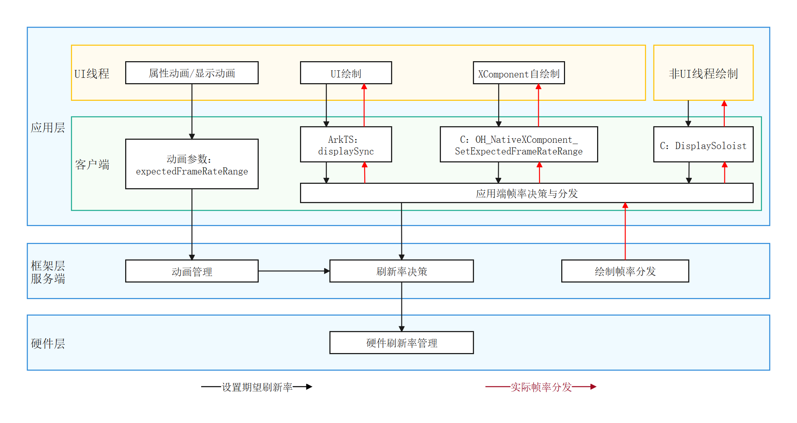

# 可变帧率简介

随着设备屏幕的不断演进，当前主流设备采用LTPO屏幕，此类屏幕支持在多个档位之间切换屏幕帧率。

对于快速变化的内容，如射击游戏，交互动画等，显示帧率越高，画面越流畅，但是相对的功耗也会越高。

而低速变化的内容，如游戏大厅，时钟更新动画等，画面更新频率较低，使用相对低的显示帧率，用户也不会觉得卡顿，但是相对的功耗就比较低。

基于显示内容的可变帧率能力，在具备LTPO屏幕的设备上，可以达到性能体验和功耗间的平衡。

OpenHarmony支持可变帧率能力，开发者通过使用可变帧率接口，进行相关业务开发，可以享受可变帧率特性带来的功耗收益。

## 使用场景
可变帧率能力支持开发者自定义应用业务的帧率，其常见的使用场景：
- 通过配置属性动画/显示动画的帧率属性参数，用于动画的绘制，具体可见[请求动画绘制帧率](displaysync-animation.md)。
- 通过申请一个独立的绘制帧率，用于UI的绘制，具体可见[请求UI绘制帧率](displaysync-ui.md)。
- 通过XComponent在Native侧申请独立的绘制帧率，用于游戏等自绘制内容的绘制，具体可见[请求自绘制内容绘制帧率](displaysync-xcomponent.md)。
- 通过NativeVsync在Native侧申请独立的绘制帧率，用于非UI线程的绘制，具体可见[NativeDisplaySoloist开发指导 (C/C++)](displaysoloist-native-guidelines.md)。

## 运作机制
可变帧率为应用开发中的动画组件、XComponent组件、UI绘制等提供一种基础帧率配置和能力。
开发者通过设置有效的期望绘制帧率后，系统会收集设置的请求帧率，进行决策和分发，在渲染管线上进行分频，尽量能够满足开发者的期望帧率。

如上图所示，应用层的多种UI（动画组件、UI绘制、XComponent自绘制及非UI线程绘制）可以通过相对应的可变帧率接口（expectedFrameRateRange、displaySync、OH_NativeXComponent_SetExpectedFrameRateRange及DisplaySoloist）接入到控帧系统。控帧系统收集UI设置的期望绘制帧率，参与到框架层的整机刷新率决策；服务端根据决策出的刷新率结果进行绘制帧率分发，逐级传递到应用层的各类UI。同时，硬件层也会根据整机刷新率的决策结果，完成硬件器件的刷新率切换。

## 约束与限制

开发者设置的期望帧率值不能代表最终实际效果，会受限于系统功耗性能约束和屏幕刷新率硬件能力限制。

## 相关实例

针对可变帧率的开发，有以下相关实例可供参考：

- [DisplaySync分级管控（ArkTS）（API12）](https://gitcode.com/openharmony/applications_app_samples/tree/master/code/BasicFeature/Graphics/DisplaySync)