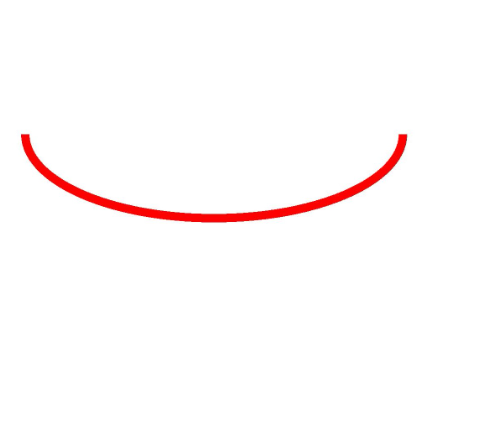
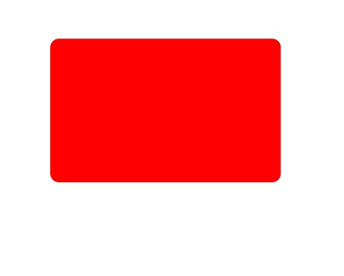

# 几何形状绘制（ArkTS）


## 场景介绍

当前支持绘制的几何形状，主要包括以下几种：

- 点

- 圆弧

- 圆

- 路径

- 区域

- 矩形

- 圆角矩形

大部分的几何形状均可以选择使用画笔或者使用画刷来实现绘制，其中点的绘制只能使用画笔。


## 接口说明

几何形状绘制的常用接口如下表所示，详细的使用和参数说明请见[drawing.Canvas](../reference/apis-arkgraphics2d/arkts-apis-graphics-drawing-Canvas.md)。

| 接口 | 描述 |
| -------- | -------- |
| drawPoint(x: number, y: number): void | 用于画一个点。 |
| drawArc(arc: common2D.Rect, startAngle: number, sweepAngle: number): void | 用于画一个弧。 |
| drawCircle(x: number, y: number, radius: number): void | 用于画一个圆形。 |
| drawPath(path: Path): void | 用于画一个自定义路径。 |
| drawRegion(region: Region): void | 用于画一块区域。 |
| drawRect(left: number, top: number, right: number, bottom: number): void | 用于画一个矩形。 |
| drawRoundRect(roundRect: RoundRect): void | 用于画一个圆角矩形。 |


## 绘制点

点只能基于画笔在画布上进行绘制，通过使用drawPoint()接口绘制点。绘制点需要接受两个参数，分别为需要绘制的点的x坐标和y坐标。

简单示例如下：

```ts
// 设置画笔
let pen = new drawing.Pen();
// 设置颜色
pen.setColor(0xFF, 0xFF, 0x00, 0x00);
// 设置线宽
pen.setStrokeWidth(40);
// 设置画笔描边效果
canvas.attachPen(pen);
// 绘制5个点
canvas.drawPoint(200, 200);
canvas.drawPoint(400, 400);
canvas.drawPoint(600, 600);
canvas.drawPoint(800, 800);
canvas.drawPoint(1000, 1000);
// 去除描边效果
canvas.detachPen();
```


## 绘制圆弧

可以使用画笔或画刷在画布上进行圆弧的绘制，通过使用drawArc()接口绘制圆弧。

绘制圆弧需要一个矩形（[common2D.Rect](../reference/apis-arkgraphics2d/js-apis-graphics-common2D.md#rect)），以矩形的边为轮廓进行绘制，还需要两个参数，分别表示弧形的起始角度（startAngle）和扫描角度（sweepAngle）。

此处以使用画笔绘制圆弧为例，简单示例如下：
```ts
// 创建画笔
let pen = new drawing.Pen();
// 设置颜色
pen.setColor({ alpha: 0xFF, red: 0xFF, green: 0x00, blue: 0x00 });
// 设置线宽
pen.setStrokeWidth(20);
// 设置画笔描边效果
canvas.attachPen(pen);
// 创建矩形对象
const rect: common2D.Rect = {left:100, top:200, right:1000, bottom:600};
// 绘制矩形
canvas.drawArc(rect, 0, 180);
// 去除描边效果
canvas.detachPen();
```




## 绘制圆

可以使用画笔或画刷在画布上进行圆的绘制，通过使用drawCircle()接口绘制圆。

绘制圆需要圆心点的x坐标和y坐标，以及圆半径（radius）。

此处以使用画笔绘制圆为例，简单示例如下：
```ts
// 创建画笔
let pen = new drawing.Pen();
// 设置颜色
pen.setColor({ alpha: 0xFF, red: 0xFF, green: 0x00, blue: 0x00 });
// 设置线宽
pen.setStrokeWidth(20);
// 设置画笔描边效果
canvas.attachPen(pen);
// 绘制圆
canvas.drawCircle(630, 630, 500);
// 去除描边效果
canvas.detachPen();
```


## 绘制路径

可以使用画笔或画刷在画布上进行路径的绘制，路径具体可以用于绘制直线、弧线、贝塞尔曲线等，也可以通过路径组合的方式组成其他复杂的形状。

绘制路径的相关接口和实现如下，详细的使用和参数说明请见[Path](../reference/apis-arkgraphics2d/arkts-apis-graphics-drawing-Path.md)。常用的接口如下：

1. 使用new drawing.Path()可以创建一个路径对象。

2. 使用moveTo()接口可以设置自定义路径的起始点位置。

3. 使用lineTo()接口可以添加一条从起始点或路径的最后点位置（若路径没有内容则默认为(0,0)）到目标点位置的线段。

此处以使用画笔和画刷绘制五角星为例，简单示例如下：

```ts
let height_ = 1800;
let width_ = 1800;
let len = height_ / 4;
let aX = width_ / 3;
let aY = height_ / 6;
let dX = aX - len * Math.sin(18.0);
let dY = aY + len * Math.cos(18.0);
let cX = aX + len * Math.sin(18.0);
let cY = dY;
let bX = aX + (len / 2.0);
let bY = aY + Math.sqrt((cX - dX) * (cX - dX) + (len / 2.0) * (len / 2.0));
let eX = aX - (len / 2.0);
let eY = bY;

// 创建一个path对象，然后使用接口连接成一个五角星形状
let path = new drawing.Path();
// 指定path的起始位置
path.moveTo(aX, aY);
// 用直线连接到目标点
path.lineTo(bX, bY);
path.lineTo(cX, cY);
path.lineTo(dX, dY);
path.lineTo(eX, eY);
// 闭合形状，path绘制完毕
path.close();

// 创建画笔对象
let pen = new drawing.Pen();
// 设置抗锯齿
pen.setAntiAlias(true);
// 设置描边颜色
pen.setColor(0xFF, 0xFF, 0x00, 0x00);
// 设置线宽
pen.setStrokeWidth(10.0);
// 设置画笔描边效果
canvas.attachPen(pen);
// 创建画刷
let brush = new drawing.Brush();
// 设置填充颜色
brush.setColor(0xFF, 0x00, 0xFF, 0x00);
// 设置画刷填充效果
canvas.attachBrush(brush);
// 绘制路径
canvas.drawPath(path);
// 去除填充效果
canvas.detachBrush();
// 去除描边效果
canvas.detachPen();
```


## 绘制区域

区域不是一个特定的形状，可以设置为指定的矩形或路径，也可以对两个区域进行组合操作。可以使用画笔或画刷对区域进行绘制。详细的API说明请参考[Region](../reference/apis-arkgraphics2d/arkts-apis-graphics-drawing-Region.md)。

目前支持设置矩形区域和路径区域，分别通过setRect()接口和setPath()接口来设置。

此处以使用画刷绘制矩形的组合区域为例，示例如下：

```ts
// 创建画刷
let brush = new drawing.Brush();
// 设置颜色
brush.setColor(0xFF, 0xFF,  0x00, 0x00);
// 设置画刷填充效果
canvas.attachBrush(brush);
// 创建左上角的region1
let region1 = new drawing.Region();
region1.setRect(100, 100, 600, 600);
// 创建右下角的region2
let region2 = new drawing.Region();
region2.setRect(300, 300, 900, 900);
// 将两个区域以XOR的方式组合
region1.op(region2, drawing.RegionOp.XOR);
// 绘制区域
canvas.drawRegion(region1);
// 去除填充效果
canvas.detachBrush();
```


## 绘制矩形

可以使用画笔或画刷在画布上进行矩形的绘制。使用drawRect()接口绘制矩形。接口需要传入四个浮点数，分别表示矩形的左、上、右、下四个位置的坐标，连接这4个坐标形成一个矩形。

此处以使用画刷绘制矩形为例，简单示例如下：

```ts
// 创建画刷
let brush = new drawing.Brush();
// 设置颜色
brush.setColor(0xFF, 0xFF,  0x00, 0x00);
// 设置画刷填充效果
canvas.attachBrush(brush);
// 绘制矩形
canvas.drawRect(200, 200, 1000, 700);
// 去除填充效果
canvas.detachBrush();
```


## 绘制圆角矩形

可以使用画笔或画刷在画布上进行圆角矩形的绘制。使用drawRoundRect()接口绘制圆角矩形。接口接受1个入参roundRect，对应为圆角矩形对象。

圆角矩形对象通过new drawing.RoundRect()接口构造，构造函数接受3个参数，分别为：

- common2D.Rect（矩形对象），圆角矩形是在该矩形的基础上切圆角形成。

- x轴上的圆角半径。

- y轴上的圆角半径。

此处以使用画刷绘制圆角矩形为例，简单示例代码如下：

```ts
// 创建画刷
let brush = new drawing.Brush();
// 设置颜色
brush.setColor(0xFF, 0xFF, 0x00, 0x00);
// 设置画刷填充效果
canvas.attachBrush(brush);
// 创建矩形对象
let rect: common2D.Rect = { left: 200, top: 200, right: 1000, bottom: 700 };
// 创建圆角矩形对象
let rrect = new drawing.RoundRect(rect, 30, 30);
// 绘制圆角矩形
canvas.drawRoundRect(rrect);
// 去除填充效果
canvas.detachBrush();
```



<!--RP1-->
## 相关实例

针对Drawing(ArkTS)的开发，有以下相关实例可供参考：

- [ArkTSGraphicsDraw (API14)](https://gitee.com/openharmony/applications_app_samples/tree/master/code/DocsSample/Drawing/ArkTSGraphicsDraw)
<!--RP1End-->