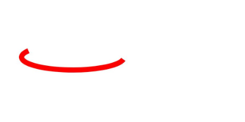
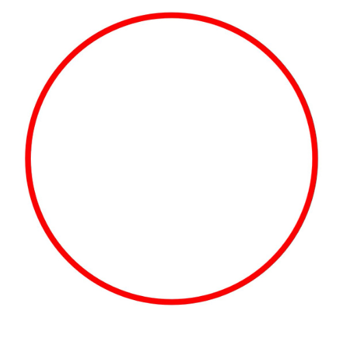

# 几何形状绘制（C/C++）


## 场景介绍

当前支持绘制的几何形状，主要包括以下几种：

- 点

- 圆弧

- 圆

- 路径

- 区域

- 矩形

- 圆角矩形

大部分的几何形状均可以选择使用画笔或者使用画刷来实现绘制，其中点的绘制只能使用画笔。


## 接口说明

几何形状绘制的常用接口如下表所示，详细的使用和参数说明请见[drawing_canvas.h](../reference/apis-arkgraphics2d/drawing__canvas_8h.md)。

| 接口 | 描述 |
| -------- | -------- |
| OH_Drawing_Point\* OH_Drawing_PointCreate (float x, float y) | 用于创建一个坐标点对象。 |
| OH_Drawing_ErrorCode OH_Drawing_CanvasDrawPoint (OH_Drawing_Canvas \*canvas, const OH_Drawing_Point2D \*point) | 用于画一个点。 |
| OH_Drawing_Rect\* OH_Drawing_RectCreate (float left, float top, float right, float bottom) | 用于创建一个矩形对象。 |
| void OH_Drawing_CanvasDrawArc (OH_Drawing_Canvas\*, const OH_Drawing_Rect\*, float startAngle, float sweepAngle) | 用于画一个弧。 |
| void OH_Drawing_CanvasDrawCircle (OH_Drawing_Canvas\*, const OH_Drawing_Point\*, float radius) | 用于画一个圆形。 |
| OH_Drawing_Path\* OH_Drawing_PathCreate (void) | 用于创建一个路径对象。 |
| void OH_Drawing_CanvasDrawPath (OH_Drawing_Canvas\*, const OH_Drawing_Path\*) | 用于画一个自定义路径。 |
| OH_Drawing_Region\* OH_Drawing_RegionCreate (void) | 用于创建一个区域对象。 |
| void OH_Drawing_CanvasDrawRegion (OH_Drawing_Canvas\*, const OH_Drawing_Region\*) | 用于画一块区域。 |
| void OH_Drawing_CanvasDrawRect (OH_Drawing_Canvas\*, const OH_Drawing_Rect\*) | 用于画一个矩形。 |
| OH_Drawing_RoundRect\* OH_Drawing_RoundRectCreate (const OH_Drawing_Rect\*, float xRad, float yRad) | 用于创建一个圆角矩形对象。 |
| void OH_Drawing_CanvasDrawRoundRect (OH_Drawing_Canvas\*, const OH_Drawing_RoundRect\*) | 用于画一个圆角矩形。 |


## 绘制点

点只能基于画笔在画布上进行绘制，通过使用OH_Drawing_CanvasDrawPoint()接口绘制点。接口接受两个参数，一个是画布对象Canvas，请确保已创建或获取得到画布Canvas，具体可见[画布的获取与绘制结果的显示（C/C++）](canvas-get-result-draw-c.md)；另一个是要绘制的点的指针。

简单示例如下：

```c++
// 创建画笔对象
OH_Drawing_Pen* pen = OH_Drawing_PenCreate();
// 设置画笔颜色
OH_Drawing_PenSetColor(pen, OH_Drawing_ColorSetArgb(0xFF, 0xFF, 0x00, 0x00));
// 设置画笔线宽
OH_Drawing_PenSetWidth(pen, 40);
// 设置画布的画笔
OH_Drawing_CanvasAttachPen(canvas, pen);
// 绘制5个点
OH_Drawing_Point2D point1 = {200.0f, 200.0f};
OH_Drawing_CanvasDrawPoint(canvas, &point1);
OH_Drawing_Point2D point2 = {400.0f, 400.0f};
OH_Drawing_CanvasDrawPoint(canvas, &point2);
OH_Drawing_Point2D point3 = {600.0f, 600.0f};
OH_Drawing_CanvasDrawPoint(canvas, &point3);
OH_Drawing_Point2D point4 = {800.0f, 800.0f};
OH_Drawing_CanvasDrawPoint(canvas, &point4);
OH_Drawing_Point2D point5 = {1000.0f, 1000.0f};
OH_Drawing_CanvasDrawPoint(canvas, &point5);
// 去除掉画布中的画笔
OH_Drawing_CanvasDetachPen(canvas);
// 销毁各类对象
OH_Drawing_PenDestroy(pen);
```


效果如下：


## 绘制圆弧

可以使用画笔或画刷在画布上进行圆弧的绘制，通过使用OH_Drawing_CanvasDrawArc()接口绘制圆弧。使用接口需要传入4个参数，分别如下：

- 需要画布对象Canvas，请确保已创建或获取得到画布Canvas，具体可见[画布的获取与绘制结果的显示（C/C++）](canvas-get-result-draw-c.md)。

- 绘制圆弧还需要一个矩形，会以矩形的边为轮廓进行绘制。

- 需要一个浮点参数，表示弧形的起始角度。

- 需要另一个浮点参数，表示弧形的扫描角度。

此处以使用画笔绘制圆弧为例，简单示例如下：

```c++
// 创建画笔对象
OH_Drawing_Pen* pen = OH_Drawing_PenCreate();
// 设置画笔描边颜色
OH_Drawing_PenSetColor(pen, OH_Drawing_ColorSetArgb(0xFF, 0xFF, 0x00, 0x00));
// 设置画笔线宽
OH_Drawing_PenSetWidth(pen, 20);
// 设置画布的画笔
OH_Drawing_CanvasAttachPen(canvas, pen);
// 创建矩形对象
OH_Drawing_Rect* rect = OH_Drawing_RectCreate(100, 200, 500, 300);
// 基于矩形对象绘制圆弧
OH_Drawing_CanvasDrawArc(canvas, rect, 10, 200);
// 去除掉画布中的画笔
OH_Drawing_CanvasDetachPen(canvas);
// 销毁各类对象
OH_Drawing_PenDestroy(pen);
OH_Drawing_RectDestroy(rect);
```

效果如下：




## 绘制圆

可以使用画笔或画刷在画布上进行圆的绘制，通过使用OH_Drawing_CanvasDrawCircle()接口绘制圆。使用接口需要传入3个参数，分别如下：

- 需要画布对象Canvas，请确保已创建或获取得到画布Canvas，具体可见[画布的获取与绘制结果的显示（C/C++）](canvas-get-result-draw-c.md)。

- 绘制圆还需要一个指向圆心点对象的指针，会以此点为圆心进行绘制。

- 最后需要一个浮点参数，表示圆的半径。

此处以使用画笔绘制圆为例，简单示例如下：

```c++
// 创建画笔对象
OH_Drawing_Pen* pen = OH_Drawing_PenCreate();
// 设置画笔描边颜色
OH_Drawing_PenSetColor(pen, OH_Drawing_ColorSetArgb(0xFF, 0xFF, 0x00, 0x00));
// 设置画笔线宽
OH_Drawing_PenSetWidth(pen, 20);
// 设置画布的画笔
OH_Drawing_CanvasAttachPen(canvas, pen);
// 创建圆心点
OH_Drawing_Point *point = OH_Drawing_PointCreate(700, 700);
// 基于圆心点和半径在画布上绘制圆
OH_Drawing_CanvasDrawCircle(canvas, point, 600);
// 去除掉画布中的画笔
OH_Drawing_CanvasDetachPen(canvas);
// 销毁各类对象
OH_Drawing_PenDestroy(pen);
OH_Drawing_PointDestroy(point);
```

效果如下：




## 绘制路径

可以使用画笔或画刷在画布上进行路径的绘制，路径具体可以用于绘制直线、弧线、贝塞尔曲线等，也可以通过路径组合的方式组成其他复杂的形状。

绘制路径的相关接口和实现如下，详细的使用和参数说明请见[drawing_path](../reference/apis-arkgraphics2d/drawing__path_8h.md)。常用的接口如下：

1. 使用OH_Drawing_PathCreate()接口可以创建一个路径对象。

2. 使用OH_Drawing_PathMoveTo()接口可以设置自定义路径的起始点位置。

3. 使用OH_Drawing_PathLineTo()接口可以添加一条从起始点或路径的最后点位置（若路径没有内容则默认为(0,0)）到目标点位置的线段。

此处以使用画笔和画刷绘制五角星为例，示例如下：

```c++
// 创建画笔对象
OH_Drawing_Pen* pen = OH_Drawing_PenCreate();
// 设置画笔描边颜色
OH_Drawing_PenSetColor(pen, OH_Drawing_ColorSetArgb(0xFF, 0xFF, 0x00, 0x00));
// 设置画笔线宽
OH_Drawing_PenSetWidth(pen, 10);
// 设置 画笔转角样式
OH_Drawing_PenSetJoin(pen, LINE_ROUND_JOIN);
// 设置画布中的画笔
OH_Drawing_CanvasAttachPen(canvas, pen); 
// 创建画刷，此例对闭合路径进行了颜色填充，所以需要使用画刷
OH_Drawing_Brush *brush = OH_Drawing_BrushCreate();
OH_Drawing_BrushSetColor(brush , OH_Drawing_ColorSetArgb(0xFF, 0x00, 0xFF, 0x00));
// 设置画布中的画刷
OH_Drawing_CanvasAttachBrush(canvas, brush ); 
int len = 551;
float aX = 630;
float aY = 551;
float dX = aX - len * std::sin(18.0f);
float dY = aY + len * std::cos(18.0f);
float cX = aX + len * std::sin(18.0f);
float cY = dY;
float bX = aX + (len / 2.0);
float bY = aY + std::sqrt((cX - dX) * (cX - dX) + (len / 2.0) * (len / 2.0));
float eX = aX - (len / 2.0);
float eY = bY;
// 创建路径
OH_Drawing_Path* path = OH_Drawing_PathCreate();
// 到起始点
OH_Drawing_PathMoveTo(path, aX, aY); 
// 绘制直线
OH_Drawing_PathLineTo(path, bX, bY); 
OH_Drawing_PathLineTo(path, cX, cY);
OH_Drawing_PathLineTo(path, dX, dY);
OH_Drawing_PathLineTo(path, eX, eY);
// 直线闭合，形成五角星
OH_Drawing_PathClose(path); 
// 绘制闭合路径
OH_Drawing_CanvasDrawPath(canvas, path);
// 去除掉画布中的画笔和画刷
OH_Drawing_CanvasDetachPen(canvas);
OH_Drawing_CanvasDetachBrush(canvas);
// 销毁各类对象
OH_Drawing_PenDestroy(pen);
OH_Drawing_BrushDestroy(brush);
OH_Drawing_PathDestroy(path);
```

效果如下：


## 绘制区域

区域不是一个特定的形状，可以设置为指定的矩形或路径，也可以对两个区域进行组合操作。可以使用画笔或画刷在画布上进行区域的绘制。详细的API说明请参考[drawing_region.h](../reference/apis-arkgraphics2d/drawing__region_8h.md)。

目前支持设置矩形区域和路径区域，分别通过OH_Drawing_RegionSetRect()接口和OH_Drawing_RegionSetPath()接口来设置。

此处以使用画刷绘制矩形的组合区域为例，示例如下：

```c++
// 创建画刷对象
OH_Drawing_Brush* brush = OH_Drawing_BrushCreate();
// 设置画刷填充颜色
OH_Drawing_BrushSetColor(brush, OH_Drawing_ColorSetArgb(0xFF, 0xFF, 0x00, 0x00));
// 设置画布的画刷
OH_Drawing_CanvasAttachBrush(canvas, brush); 
// 矩形区域1
OH_Drawing_Region *region1 = OH_Drawing_RegionCreate();
OH_Drawing_Rect *rect1 = OH_Drawing_RectCreate(100.0f, 100.0f, 600.f, 600.f);
OH_Drawing_RegionSetRect(region1, rect1); 
// 矩形区域2
OH_Drawing_Region *region2 = OH_Drawing_RegionCreate();
OH_Drawing_Rect *rect2 = OH_Drawing_RectCreate(300.0f, 300.0f, 900.f, 900.f);
OH_Drawing_RegionSetRect(region2, rect2);
// 两个矩形区域组合
OH_Drawing_RegionOp(region1, region2, OH_Drawing_RegionOpMode::REGION_OP_MODE_XOR); 
OH_Drawing_CanvasDrawRegion(canvas, region1);
// 去除掉画布中的画刷
OH_Drawing_CanvasDetachBrush(canvas);
// 销毁各类对象
OH_Drawing_BrushDestroy(brush);
OH_Drawing_RegionDestroy(region1);
OH_Drawing_RegionDestroy(region2);
OH_Drawing_RectDestroy(rect1);
OH_Drawing_RectDestroy(rect2);
```

效果如下：


## 绘制矩形

可以使用画笔或画刷在画布上进行矩形的绘制。使用OH_Drawing_RectCreate()接口创建矩形。接口需要传入四个浮点数，分别表示矩形的左、上、右、下四个位置的坐标，连接这4个坐标形成一个矩形。

简单示例如下：

```c++
// 创建画刷对象
OH_Drawing_Brush *brush = OH_Drawing_BrushCreate();
// 设置画刷的填充颜色
OH_Drawing_BrushSetColor(brush, 0xffff0000);
// 设置画布的画刷
OH_Drawing_CanvasAttachBrush(canvas, brush); 
OH_Drawing_Rect* rect = OH_Drawing_RectCreate(0, 0, 800, 800);
// 绘制矩形
OH_Drawing_CanvasDrawRect(canvas, rect); 
// 去除画布中的画刷
OH_Drawing_CanvasDetachBrush(canvas);
// 销毁各类对象
OH_Drawing_BrushDestroy(brush);
OH_Drawing_RectDestroy(rect);
```

效果如下：


## 绘制圆角矩形

可以使用画笔或画刷在画布上进行圆角矩形的绘制。使用OH_Drawing_RoundRectCreate()接口创建圆角矩形。接口需要传入3个参数，分别如下：

- 需要传入指向OH_Drawing_Rect矩形对象的指针，用于在此矩形的基础上切圆角进行绘制。

- 需要一个浮点参数，表示x轴上的圆角半径。

- 还需要一个浮点参数，表示y轴上的圆角半径。

简单示例如下：

```c++
// 创建画刷对象
OH_Drawing_Brush *brush = OH_Drawing_BrushCreate();
// 设置画刷的填充颜色
OH_Drawing_BrushSetColor(brush, 0xffff0000);
// 设置画布的画刷
OH_Drawing_CanvasAttachBrush(canvas, brush); 
// 创建矩形
OH_Drawing_Rect* rect = OH_Drawing_RectCreate(100, 100, 900, 600);
// 创建圆角矩形
OH_Drawing_RoundRect* roundRect = OH_Drawing_RoundRectCreate(rect, 30, 30);
// 绘制圆角矩形
OH_Drawing_CanvasDrawRoundRect(canvas, roundRect);
// 去除掉画布中的画刷
OH_Drawing_CanvasDetachBrush(canvas);
// 销毁各类对象
OH_Drawing_BrushDestroy(brush);
OH_Drawing_RectDestroy(rect);
OH_Drawing_RoundRectDestroy(roundRect);
```


效果如下：


<!--RP1-->
## 相关实例

针对Drawing(C/C++)的开发，有以下相关实例可供参考：

- [NDKGraphicsDraw (API14)](https://gitee.com/openharmony/applications_app_samples/tree/master/code/DocsSample/Drawing/NDKGraphicsDraw)
<!--RP1End-->