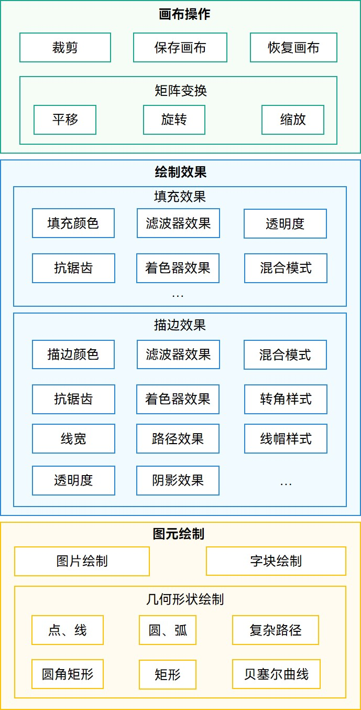
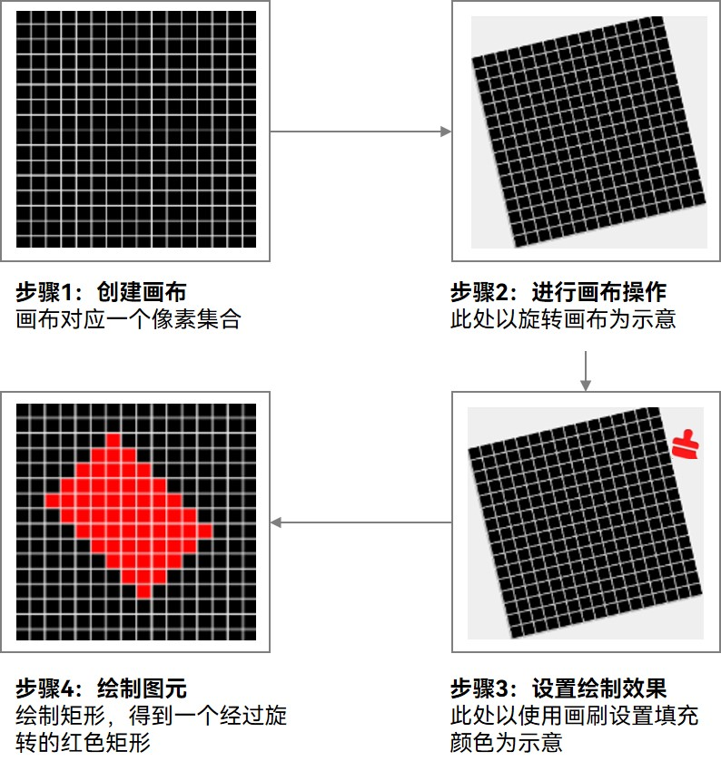

# 图形绘制与显示开发概述

## 场景介绍

应用在开发中，经常需要针对不同的元素内容进行绘制，开发者通常可以选择直接使用ArkUI组件来绘制想要的元素或效果，但有些自定义图形或效果无法满足，此时可以选择使用Drawing来实现灵活的自定义绘制效果。另外，ArkUI组件具备直接上屏显示的能力，而Drawing更加关注绘制，需要依靠其他模块来完成绘制结果的上屏显示。

## 绘制能力范围及实现流程

**图1** 图形绘制主要能力

ArkGraphics 2D基于2D图像渲染引擎为开发者提供了一系列灵活多样的图形绘制接口。主要分为画布操作、绘制效果、图元绘制几方面，各部分支持能力关键列举如上图所示，后续可能支持更多相关能力，此处不再一一呈现，具体可关注对应API参考文档。

画布操作、绘制效果、图元绘制也是实现图形绘制的关键步骤和流程，具体可见下图。

**图2** 图形绘制的实现流程 

2D图形绘制过程和实际作画的过程是相似的，上图即以绘制经过旋转的红色填充矩形为例，提供了图形绘制的流程。主要实现流程和步骤如下：

1. **创建画布（必选）**：画布作为图形绘制的承载，是最基本最关键的。在进行图形绘制时，需要先创建画布，确保图形可承载，才能进行后续的相关设置和操作。

2. **进行画布操作（可选）**：创建画布之后，可以基于画布进一步进行相关操作，比如裁剪、旋转、缩放等等。此步骤为可选步骤，开发者可以根据具体的场景需求选择进行对应的画布操作。

3. **设置绘制效果（可选）**：绘制效果主要通过画刷（Brush）和画笔（Pen）实现。画笔针对的是图形轮廓，画刷针对的是图形内部区域。通过画刷和画笔，可以实现丰富多样的填充效果和描边效果，开发者可根据具体UI效果和需要选择设置相关效果。如果不设置绘制效果，会使用默认的绘制效果。

4. **绘制图元（必选）**：图形绘制最后一步即为图元的绘制，不论多么复杂的图形，都是基础图元的不同组合，当前ArkGraphics 2D支持多种图元的绘制。创建Canvas画布并完成相关操作和设置后，开发者再选择对应的图元进行绘制即可完成图形绘制的全部流程。

## 如何显示绘制结果

以上内容主要呈现了ArkGraphics 2D基于2D图像渲染引擎的主要绘制能力和实现流程，基于画布完成绘制后，还需要将绘制结果上屏显示才能完整实现屏幕上可见的图形UI内容。

当前Drawing依赖的显示方式主要有以下两种：

1. 通过[RenderNode](../reference/apis-arkui/js-apis-arkui-renderNode.md)上屏显示（ArkTS）：通过RenderNode获取Canvas，进行绘制，由RenderNode将绘制结果上屏显示，具体可参考[画布的获取与绘制结果的显示（ArkTS）](canvas-get-result-draw-arkts.md#获取可直接显示的canvas画布)。

2. 通过XComponent上屏显示（C/C++）：创建Canvas，进行绘制，将绘制结果拷贝到buffer，由XComponent将绘制结果上屏显示，具体实现可参考[画布的获取与绘制结果的显示（C/C++）](canvas-get-result-draw-c.md#获取可直接显示的canvas画布)。

## 与Canvas画布组件的关系

[Canvas组件](../reference/apis-arkui/arkui-ts/ts-components-canvas-canvas.md)也具有自绘制的能力，目前有[CanvasRenderingContext2D](../reference/apis-arkui/arkui-ts/ts-canvasrenderingcontext2d.md)/[OffscreenCanvasRenderingContext2D](../reference/apis-arkui/arkui-ts/ts-offscreencanvasrenderingcontext2d.md)和[DrawingRenderingContext](../reference/apis-arkui/arkui-ts/ts-drawingrenderingcontext.md)两套API，应用使用两套绘制API绘制的内容都可以在绑定的Canvas组件上显示。

其中CanvasRenderingContext2D按照W3C标准封装了ArkGraphics 2D中Native Drawing的相关接口，可以方便快速复用Web应用的绘制逻辑，因此非常适用于Web应用和游戏、快速原型设计、数据可视化、在线绘图板、教学工具或创意应用等场景。

[Canvas组件](../reference/apis-arkui/arkui-ts/ts-components-canvas-canvas.md)的底层也使用了Native Drawing接口来实现绘制功能，在绘制能力上两者没有本质的区别。但因为多层封装的实现过程，使得Canvas组件不如Native Drawing API接近硬件，因此对于性能要求比较高、绘制比较复杂、硬件依赖性比较强的场景，如专业图形处理软件、桌面或移动应用等，使用Canvas组件绘制可能会存在一定的卡顿、掉帧等性能问题，此时可以使用Native Drawing接口的自绘制能力，确保应用的绘制性能。

## 约束限制

针对图形绘制过程中，使用的单位为像素单位px。

<!--RP1--><!--RP1End-->