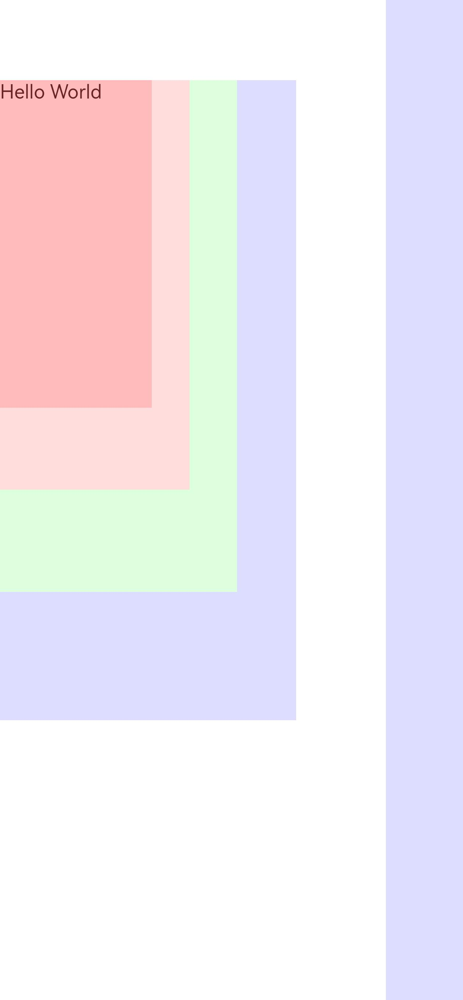

# 过度绘制调试使用指导

当应用页面布局的嵌套程度过深时，应用渲染阶段会存在一些组件的绘制指令被其他组件的绘制指令部分或完全覆盖遮挡的情况，造成冗余的CPU、GPU等计算资源的使用。这种一个屏幕上的像素点被重复绘制了多次的情况被称为过度绘制（Overdraw）。开发者可通过系统提供的过度绘制调试指令，查看引起过度绘制的组件位置及其层级，从而减轻应用渲染时的负载。

本文将分别介绍过度绘制调试功能的使用方式，以及如何进行过度绘制的分析和优化。

## 使用方式

系统提供的过度绘制调试功能，可通过shell进行开启或者关闭。

- 使用前提：需在系统设置中开启开发者模式。

- 开启过度绘制调试功能：

  ```
  param set debug.graphic.overdraw true
  ```

  

- 关闭过度绘制调试功能：

  ```
  param set debug.graphic.overdraw false
  ```

  

- 查看是否开启了过度绘制调试功能：

  true表示开启了过度绘制功能，false则表示未开启。

  ```
  param get debug.graphic.overdraw
  ```

  


## 过度绘制组件分析

开启了过度绘制调试功能后，打开应用界面，存在过度绘制情况的像素会被代表着不同级别的颜色方框高亮出来，其颜色越深代表过度绘制情况越严重，对应关系如下：

- 原色：无过度绘制情况。
- 蓝紫色：存在一次过度绘制。
- 绿色：存在两次过度绘制。
- 浅红色：存在三次过度绘制。
- 深红色：存在四次或更多次过度绘制。


以下是一个存在冗余的背景颜色嵌套问题的示例应用程序，及其对应的开启过度绘制调试功能的界面显示情况。

```ts
@Entry
@Component
struct Index {
  @State message: string = 'Hello World'

  build() {
    Row() {
      Column() {
        Column() {
          Column() {
            Column() {
              Column() {
                Text("Hello World")
              }
              .width('80%')
              .height('80%')
              .backgroundColor(Color.White)
            }
            .width('80%')
            .height('80%')
            .backgroundColor(Color.White)
          }
          .width('80%')
          .height('80%')
          .backgroundColor(Color.White)
        }
        .width('80%')
        .height('80%')
        .backgroundColor(Color.White)
      }
      .width('80%')
    }
    .height('80%')
  }
}
```



编译安装后打开过度绘制调试功能，应用界面如上图所示。

可以发现，从Hello World文字组件开始，由内到外的这几个Column组件在界面上分别显示为深红色-浅红色-绿色-蓝紫色-原色。这种现象说明，随着嵌套程度的加深，每一个Column组件的背景颜色绘制都会带来一次过度绘制。

另外，状态栏、侧边栏等系统界面也会在过度绘制调试功能中被统计到，此为正常现象。

## 如何减少过度绘制现象

通过上文所述的调试功能可以帮助我们发现应用界面里存在的过度绘制问题，通常我们建议采用如下方式减少过度绘制的现象：

- 通过显隐控制或者if-else条件，减少页面上冗余的组件。

- 减少被完全遮挡的组件上的绘制指令，如背景颜色、组件内容等。

- 采用扁平化布局，减少组件嵌套深度，比如将大小相近、功能类似的布局组件合并为一个组件等。