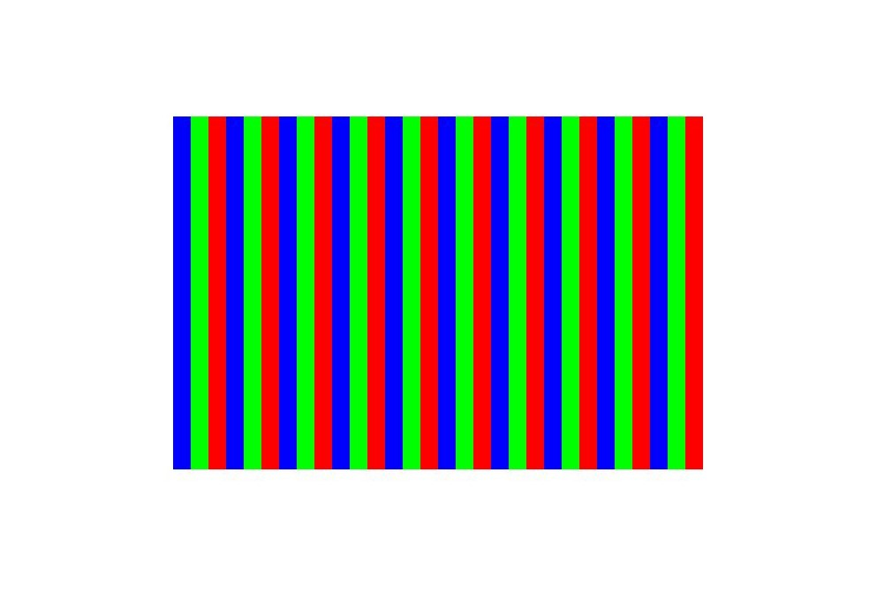

# 图片绘制（C/C++）


位图是一种用于在内存中存储和表示图像的数据结构，它是一个未经过压缩的像素集合，而JPEG或PNG等格式的图片是压缩格式的，两者并不相同。如果需要将JPEG或PNG绘制到屏幕上，需要先解码成位图格式，具体可参考[图片处理服务（Image Kit）](../media/image/image-overview.md)图片解码相关章节。


目前Drawing（C/C++）中位图绘制需要依赖PixelMap，它可以用于读取或写入图像数据以及获取图像信息。详细的API介绍请参考[drawing_pixel_map.h](../reference/apis-arkgraphics2d/capi-drawing-pixel-map-h.md)。


有多个API接口可以创建PixelMap，下文以使用OH_Drawing_PixelMapGetFromOhPixelMapNative()为例。


1. 添加链接库。

   在Native工程的src/main/cpp/CMakeLists.txt，添加如下链接库：

   ```c++
   target_link_libraries(entry PUBLIC libhilog_ndk.z.so libpixelmap.so)
   ```

2. 创建OH_PixelmapNative像素图对象。

   PixelMap需要从图像框架定义的像素图对象（OH_PixelmapNative）中获取，所以需要先通过OH_PixelmapNative_CreatePixelmap()创建OH_PixelmapNative。该函数接受4个参数，第一个参数为图像像素数据的缓冲区，用于初始化PixelMap的像素。第二个参数是缓冲区长度。第三个参数是位图格式（包括长、宽、颜色类型、透明度类型等）。第四个参数即OH_PixelmapNative对象，作为出参使用。
   
   ```c++
   // 图片宽高
   uint32_t width = 600;
   uint32_t height = 400;
   // 字节长度，RGBA_8888每个像素占4字节
   size_t bufferSize = width * height * 4;
   uint8_t *pixels = new uint8_t[bufferSize];
   for (uint32_t i = 0; i < width*height; ++i) {
       // 遍历并编辑每个像素，从而形成红绿蓝相间的条纹
       uint32_t n = i / 20 % 3;
       pixels[i*4] = 0x00;
       pixels[i*4+1] = 0x00;
       pixels[i*4+2] = 0x00;
       pixels[i*4+3] = 0xFF;
       if (n == 0) { 
           pixels[i*4] = 0xFF;
       } else if (n == 1) {
           pixels[i*4+1] = 0xFF;
       } else {
           pixels[i*4+2] = 0xFF;
       }
   }
   // 设置位图格式（长、宽、颜色类型、透明度类型）
   OH_Pixelmap_InitializationOptions *createOps = nullptr;
   OH_PixelmapInitializationOptions_Create(&createOps);
   OH_PixelmapInitializationOptions_SetWidth(createOps, width);
   OH_PixelmapInitializationOptions_SetHeight(createOps, height);
   OH_PixelmapInitializationOptions_SetPixelFormat(createOps, PIXEL_FORMAT_RGBA_8888);
   OH_PixelmapInitializationOptions_SetAlphaType(createOps, PIXELMAP_ALPHA_TYPE_UNKNOWN);
   // 创建OH_PixelmapNative对象
   OH_PixelmapNative *pixelMapNative = nullptr;
   OH_PixelmapNative_CreatePixelmap(pixels, bufferSize, createOps, &pixelMapNative);
   ```

3. 创建PixelMap。

   通过OH_Drawing_PixelMapGetFromOhPixelMapNative()函数从OH_PixelmapNative中获取PixelMap。

   ```c++
   OH_Drawing_PixelMap *pixelMap = OH_Drawing_PixelMapGetFromOhPixelMapNative(pixelMapNative);
   ```

4. 绘制PixelMap。

   需要通过OH_Drawing_CanvasDrawPixelMapRect()绘制位图PixelMap。函数接受5个参数，分别为画布Canvas、PixelMap对象、PixelMap中像素的截取区域、画布中显示的区域以及采样选项对象。

   其中采样选项对象（OH_Drawing_SamplingOptions）表示了从原始像素数据（即Bitmap）中采样以生成新的像素值的具体方式，具体可见[drawing_sampling_options.h](../reference/apis-arkgraphics2d/capi-drawing-sampling-options-h.md)。

   ```c++
   // PixelMap中像素的截取区域
   OH_Drawing_Rect *src = OH_Drawing_RectCreate(0, 0, 600, 400);
   // 画布中显示的区域
   OH_Drawing_Rect *dst = OH_Drawing_RectCreate(200, 200, 800, 600);
   // 采样选项对象
   OH_Drawing_SamplingOptions* samplingOptions = OH_Drawing_SamplingOptionsCreate(
       OH_Drawing_FilterMode::FILTER_MODE_LINEAR, OH_Drawing_MipmapMode::MIPMAP_MODE_LINEAR);
   // 绘制PixelMap
   OH_Drawing_CanvasDrawPixelMapRect(canvas, pixelMap, src, dst, samplingOptions);
   ```

5. 绘制完成后释放相关对象。

   ```c++
   OH_PixelmapNative_Release(pixelMapNative);
   delete[] pixels;
   ```

   绘制效果如下：

   

<!--RP1-->
## 相关实例

针对Drawing(C/C++)的开发，有以下相关实例可供参考：

- [NDKGraphicsDraw (API14)](https://gitee.com/openharmony/applications_app_samples/tree/master/code/DocsSample/Drawing/NDKGraphicsDraw)
<!--RP1End-->