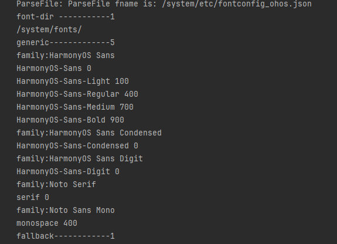

# 系统字体的信息获取和使用（ArkTS）
<!--Kit: ArkGraphics 2D-->
<!--Subsystem: Graphics-->
<!--Owner: @oh_wangxk;@gmiao522;@Lem0nC-->
<!--SE: @liumingxiang-->
<!--TSE: @yhl0101-->
## 场景介绍

系统字体是指操作系统预设的字体，用于在没有指定自定义字体时显示文本，确保文本的可读性和一致性。

**使用系统字体**的情况通常是在应用未注册自定义字体，或在没有显式指定文本样式时，系统会使用默认的系统字体。另外，系统字体有多种，开发者可以先获取系统字体的配置信息，并根据信息中的字体家族名来进行系统字体的切换和使用。

当前ArkTS侧暂不支持禁用系统字体，Native侧支持禁用系统字体。

## 接口说明

以下是系统字体相关的常用接口和结构体，ArkTS侧对外接口由ArkUI提供，详细接口说明请见[@ohos.font](../reference/apis-arkui/js-apis-font.md)。

| 接口名 | 描述 | 
| -------- | -------- |
| getUIFontConfig() : UIFontConfig | 获取系统字体配置。 | 

## 获取系统字体信息

1. 导入依赖的相关模块。

   ```ts
   import { font } from '@kit.ArkUI'
   ```

2. 获取系统字体信息。

   ```ts
   @Entry
   @Component
   struct FontExample {
     build() {
       Column() {
         Button("getUIFontConfig")
           .width('60%')
           .height('6%')
           .margin(50)
           .onClick(()=>{
             let fontConfig = font.getUIFontConfig();
           })
       }.width('100%')
     }
   }
   ```

3. 通过日志打印字体信息。

   ```ts
   @Entry
   @Component
   struct FontExample {
     build() {
       Column() {
         Button("getUIFontConfig")
           .width('60%')
           .height('6%')
           .margin(50)
           .onClick(()=>{
             let fontConfig = font.getUIFontConfig();
             console.info("font-dir -----------" + String(fontConfig.fontDir.length));
             for (let i = 0; i < fontConfig.fontDir.length; i ++) {
               console.info(fontConfig.fontDir[i]);
             }
             console.info("generic-------------" + String(fontConfig.generic.length));
             for (let i = 0; i < fontConfig.generic.length; i ++){
               console.info("family:" + fontConfig.generic[i].family);
               for (let j = 0; j < fontConfig.generic[i].alias.length; j ++){
                 console.info(fontConfig.generic[i].alias[j].name + " " + fontConfig.generic[i].alias[j].weight);
               }
             }
             console.info("fallback------------" + String(fontConfig.fallbackGroups.length));
             for (let i = 0; i < fontConfig.fallbackGroups.length; i ++){
               console.info("fontSetName:" + fontConfig.fallbackGroups[i].fontSetName);
               for (let j = 0; j < fontConfig.fallbackGroups[i].fallback.length; j ++){
                 console.info("language:" + fontConfig.fallbackGroups[i].fallback[j].language + " family:" + fontConfig.fallbackGroups[i].fallback[j].family);
               }
             }
           })
       }.width('100%')
     }
   }
   ```
  以下打印的示例为应用设备系统对应的部分系统字体配置信息情况，不同设备系统配置信息可能不同，此处仅示意。

  

## 使用或切换系统字体

系统字体可以有多种，可以先获取系统字体配置信息，再根据其中的字体家族名（即TextStyle中的fontFamilies）来进行系统字体的切换和使用。

如果不指定使用任何字体时，会使用系统默认字体“HarmonyOS Sans”显示文本。
1. 导入依赖的相关模块。

   ```ts
   import { text } from '@kit.ArkGraphics2D';
   ```

2. 创建textStyle1，指定fontFamilies为“HarmonyOS Sans SC”，默认中文字体为“HarmonyOS Sans SC”。

   ```ts
   let textStyle1: text.TextStyle = {
     color: { alpha: 255, red: 255, green: 0, blue: 0 },
     fontSize: 100,
     fontFamilies:['HarmonyOS Sans SC']
   };
   ```

3. 创建textStyle2，指定fontFamilies为“HarmonyOS Sans TC”（该两种字体易于观察同一文字字型差异）。

   ```ts
   let textStyle2: text.TextStyle = {
     color: { alpha: 255, red: 255, green: 0, blue: 0 },
     fontSize: 100,
     fontFamilies:['HarmonyOS Sans TC']
   };
   ```

4. 创建段落生成器。

   ```ts
   let myParagraphStyle: text.ParagraphStyle = {
     textStyle: textStyle1,
     align: 3,
     wordBreak:text.WordBreak.NORMAL
   };
   let fontCollection = text.FontCollection.getGlobalInstance() 
   let paragraphBuilder = new text.ParagraphBuilder(myParagraphStyle, fontCollection)
   ```

5. 将textStyle1添加到段落样式中，再添加文字。

   ```ts
   let str:string = "模块描述\n"
   paragraphBuilder.pushStyle(textStyle1);
   paragraphBuilder.addText(str);
   ```

6. 将textStyle2添加到段落样式中，再添加文字。

   ```ts
   paragraphBuilder.pushStyle(textStyle2);
   paragraphBuilder.addText(str);
   ```

7. 生成段落，用于后续绘制使用。

   ```ts
   let paragraph = paragraphBuilder.build()
   ```

效果展示如下：


