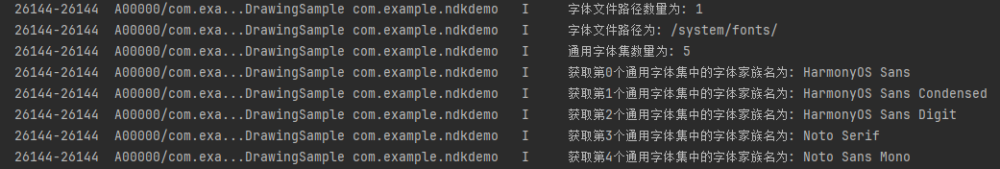

# 系统字体的信息获取和使用（C/C++）


## 场景介绍

系统字体是指操作系统预设的字体，用于在没有指定自定义字体时显示文本，确保文本的可读性和一致性。默认的系统字体为“HarmonyOS Sans”。

**使用系统字体**的情况通常是在应用未注册自定义字体，或在没有显式指定文本样式时，系统会使用默认的系统字体。另外，系统字体有多种，开发者可以先获取系统字体的配置信息，并根据信息中的字体家族名来进行系统字体的切换和使用。

**禁用系统字体**的情况通常发生在开发者希望确保应用中仅使用自定义字体，而不受操作系统默认字体影响的场景。当自定义字体不存在时，不禁用系统字体，系统则会自动回退到默认字体。通过禁用系统字体，开发者可以在任何场景避免字体回退为系统默认字体，确保文本渲染符合设计预期，从而统一应用的视觉风格。


## 接口说明

以下是系统字体相关的常用接口和结构体，详细接口说明请参考[Drawing](../reference/apis-arkgraphics2d/_drawing.md)。

| 接口名 | 描述 | 
| -------- | -------- |
| OH_Drawing_FontConfigInfo\* OH_Drawing_GetSystemFontConfigInfo(OH_Drawing_FontConfigInfoErrorCode\*) | 获取系统字体配置信息，返回系统字体配置信息结构体OH_Drawing_FontConfigInfo。 | 
| void OH_Drawing_DestroySystemFontConfigInfo(OH_Drawing_FontConfigInfo\*) | 释放系统字体配置信息占用的的内存。 | 
| OH_Drawing_FontCollection\* OH_Drawing_CreateSharedFontCollection(void) | 创建可共享的字体集对象OH_Drawing_FontCollection。 | 
| OH_Drawing_TextStyle\* OH_Drawing_CreateTextStyle(void) | 创建指向OH_Drawing_TextStyle对象的指针，用于设置文本样式。 | 
| OH_Drawing_SetTextStyleFontFamilies (OH_Drawing_TextStyle \*, int, const char \*fontFamilies[]) | 设置指定文本样式的字体家族类型。 | 
| void OH_Drawing_DisableFontCollectionSystemFont(OH_Drawing_FontCollection\* fontCollection) | 禁用系统字体。 | 

| 结构体名 | 描述 | 
| -------- | -------- |
| OH_Drawing_FontConfigInfo | 系统字体配置信息结构体。 | 
| OH_Drawing_FontGenericInfo | 系统所支持的通用字体集信息结构体。 | 
| OH_Drawing_FontFallbackGroup | 备用字体集信息结构体。 | 


## 获取系统字体信息

1. 导入依赖的相关头文件。

   ```c++
   #include <native_drawing/drawing_font_collection.h>
   #include <native_drawing/drawing_text_typography.h>
   #include <native_drawing/drawing_register_font.h>
   #include <hilog/log.h>
   ```

2. 获取系统字体的配置信息，可以通过返回的状态码确定获取信息是否成功，状态码的包含的具体情况和对应含义可见[OH_Drawing_FontConfigInfoErrorCode](../reference/apis-arkgraphics2d/_drawing.md#oh_drawing_fontconfiginfoerrorcode)。

   ```c++
   OH_Drawing_FontConfigInfoErrorCode fontConfigInfoErrorCode;  // 用于接收错误代码
   OH_Drawing_FontConfigInfo* fontConfigInfo = OH_Drawing_GetSystemFontConfigInfo(&fontConfigInfoErrorCode);
   if(fontConfigInfoErrorCode != SUCCESS_FONT_CONFIG_INFO) {
       OH_LOG_Print(LOG_APP, LOG_ERROR, LOG_DOMAIN, "DrawingSample", "获取系统信息失败，错误代码为： %{public}d", fontConfigInfoErrorCode);
   }
   ```

3. 系统字体的配置信息[OH_Drawing_FontConfigInfo](../reference/apis-arkgraphics2d/_o_h___drawing___font_config_info.md)包含以下几类信息：

   - 系统字体文件路径数量。

   - 通用字体集列表数量。

   - 备用字体集列表数量。

   - 系统字体文件路径列表。

   - 通用字体集列表，具体信息可见[OH_Drawing_FontGenericInfo](../reference/apis-arkgraphics2d/_o_h___drawing___font_generic_info.md)结构体。

   - 备用字体集列表，具体信息可见[OH_Drawing_FontFallbackGroup](../reference/apis-arkgraphics2d/_o_h___drawing___font_fallback_group.md)结构体。

   以下示例展示系统字体的一些具体配置信息的获取：

   ```c++
   // 获取系统字体配置信息示例
   if (fontConfigInfo != nullptr) {
       // 获取字体文件路径数量，打印日志
       size_t fontDirCount = fontConfigInfo->fontDirSize;
       OH_LOG_Print(LOG_APP, LOG_INFO, LOG_DOMAIN, "DrawingSample", "字体文件路径数量为: %{public}zu\n", fontDirCount);
       // 遍历字体文件路径列表，打印日志
       for (size_t i = 0; i < fontDirCount; ++i) {
           OH_LOG_Print(LOG_APP, LOG_INFO, LOG_DOMAIN, "DrawingSample", "字体文件路径为: %{public}s\n", fontConfigInfo->fontDirSet[i]);
       }
       // 获取通用字体集数量，打印日志
       size_t genericCount = fontConfigInfo->fontGenericInfoSize;
       OH_LOG_Print(LOG_APP, LOG_INFO, LOG_DOMAIN, "DrawingSample", "通用字体集数量为: %{public}zu\n", genericCount);
       // 遍历获取每个通用字体集中的字体家族名（例如 HarmonyOS Sans），打印日志
       for(size_t i = 0; i < genericCount; ++i) {
           OH_Drawing_FontGenericInfo& genericInfo = fontConfigInfo->fontGenericInfoSet[i];
           OH_LOG_Print(LOG_APP, LOG_INFO, LOG_DOMAIN, "DrawingSample", "获取第%{public}zu个通用字体集中的字体家族名为: %{public}s", i, genericInfo.familyName);
       }
   }
   ```

   以下打印的示例为应用设备系统对应的部分系统字体配置信息情况，不同设备系统配置信息可能不同，此处仅示意。

   

4. 如若后续不再需要系统字体的系统配置信息时，则释放其占用的的内存。

   ```c++
   OH_Drawing_DestroySystemFontConfigInfo(fontConfigInfo );
   ```


## 使用或切换系统字体

系统字体可以有多种，可以先获取系统字体配置信息，再根据其中的字体家族名来进行系统字体的切换和使用。

如果不指定使用任何字体时，会使用系统默认字体“HarmonyOS Sans”显示文本。

1. 导入依赖的相关头文件。

   ```c++
   #include <native_drawing/drawing_font_collection.h>
   #include <native_drawing/drawing_text_typography.h>
   #include <native_drawing/drawing_register_font.h>
   #include <hilog/log.h>
   ```

2. 创建字体管理器，建议优先使用OH_Drawing_CreateSharedFontCollection创建可共享的字体集对象。

   > **说明：**
   >
   > 使用OH_Drawing_CreateFontCollection和OH_Drawing_CreateSharedFontCollection均可创建字体管理器OH_Drawing_FontCollection对象，但前者创建的字体集指针对象只能被一个段落生成器OH_Drawing_TypographyCreate对象使用，无法被多个段落生成器OH_Drawing_TypographyCreate对象共享使用。如需在多个段落生成器OH_Drawing_TypographyCreate对象间共享使用，请使用后者创建可共享的字体集对象。

   ```c++
   OH_Drawing_FontCollection *fontCollection = OH_Drawing_CreateSharedFontCollection();  
   ```

3. 创建一个文本样式对象，即OH_Drawing_TextStyle对象，用于设置文本样式。

   ```c++
   OH_Drawing_TextStyle textStyle = OH_Drawing_CreateTextStyle();
   ```

4. [获取系统字体信息](#获取系统字体信息)，取用系统字体的字体家族名，并在文本样式中切换设置为该系统字体。

   ```c++
   // 情况一：设置系统字体为"HarmonyOS Sans Condensed"
   const char* myFontFamilies[] = {"HarmonyOS Sans Condensed"};
   OH_Drawing_SetTextStyleFontFamilies(textStyle, 1, myFontFamilies);
   
   // 情况二：不手动设置，此时使用的是系统默认字体"HarmonyOS Sans"
   // const char* myFontFamilies[] = {"HarmonyOS Sans Condensed"};
   // OH_Drawing_SetTextStyleFontFamilies(textStyle, 1, myFontFamilies);
   ```

5. 生成最终段落文本，以便实现最终的文本绘制和显示。

   ```c++
   // 设置其他文本样式
   OH_Drawing_SetTextStyleColor(textStyle , OH_Drawing_ColorSetArgb(0xFF, 0x00, 0x00, 0x00));
   OH_Drawing_SetTextStyleFontSize(textStyle , 70.0);
   // 创建一个段落样式对象，以设置排版风格
   OH_Drawing_TypographyStyle *typographyStyle = OH_Drawing_CreateTypographyStyle();
   OH_Drawing_SetTypographyTextAlign(typographyStyle, TEXT_ALIGN_LEFT); // 设置段落样式为左对齐
   // 创建一个段落生成器
   OH_Drawing_TypographyCreate* handler = OH_Drawing_CreateTypographyHandler(typographyStyle, fontCollection);
   // 在段落生成器中设置文本样式
   OH_Drawing_TypographyHandlerPushTextStyle(handler, textStyle);
   // 在段落生成器中设置文本内容
   const char* text = "Hello World. 你好世界。\n以上文字使用了系统字体";
   OH_Drawing_TypographyHandlerAddText(handler, text);
   // 通过段落生成器生成段落
   OH_Drawing_Typography* typography = OH_Drawing_CreateTypography(handler);
   ```


## 禁用系统字体

当自定义字体不存在时，不禁用系统字体，系统则会自动回退到默认字体。通过禁用系统字体，开发者可以在任何场景避免字体回退为系统默认字体，确保文本渲染符合设计预期，从而统一应用的视觉风格。

在一些应用场景中，开发者可能希望只使用自定义字体来确保字体一致性或提供更具个性化的用户体验。此时，开发者可以通过禁用系统字体，确保应用只使用注册的自定义字体，而不依赖于系统字体。

> **说明：**
>
> 禁用系统字体后，请确保注册使用自定义字体，否则文本将无法正常显示。

1. 确保已成功注册自定义字体，用于保证禁用系统字体后文本的正常显示，具体可见[自定义字体的的注册和使用](custom-font-c.md)。

2. 导入依赖的相关头文件。

   ```c++
   #include <native_drawing/drawing_font_collection.h>
   #include <native_drawing/drawing_text_typography.h>
   #include <native_drawing/drawing_register_font.h>
   #include <hilog/log.h>
   ```

3. 创建字体管理器，建议优先使用OH_Drawing_CreateSharedFontCollection创建可共享的字体集对象。

   ```c++
   OH_Drawing_FontCollection *fontCollection = OH_Drawing_CreateSharedFontCollection();  
   ```

4. 禁用系统字体。

   ```c++
   OH_Drawing_DisableFontCollectionSystemFont(fontCollection);
   ```

5. 创建文本样式对象，使用注册成功的自定义字体。

   > **注意：**
   >
   > 若不设置字体，文本会默认使用系统字体，而系统字体禁用后若不设置使用自定义字体，文本将无法正常显示。

   ```c++
   OH_Drawing_TextStyle textStyle = OH_Drawing_CreateTextStyle();
   // 禁用系统字体后的几种情况如下：
   // 情况一：如果此时设置使用了自定义字体，文本会正常显示
   const char* myFontFamilies[] = {"myFamilyName"}; //确保已成功注册自定义字体，填入自定义字体的字体家族名
   OH_Drawing_SetTextStyleFontFamilies(textStyle, 1, myFontFamilies);
   
   // 情况二：如果此时使用了系统字体，文本将无法显示
   const char* myFontFamilies[] = {"HarmonyOS_Sans"}; 
   OH_Drawing_SetTextStyleFontFamilies(textStyle, 1, myFontFamilies);
   
   // 情况三：如果此时不设置使用字体，文本会默认使用系统默认字体，而此时系统字体已被禁用，因此文本将无法显示
   const char* myFontFamilies[] = {"HarmonyOS_Sans"};
   // OH_Drawing_SetTextStyleFontFamilies(textStyle, 1, myFontFamilies);
   ```

6. 生成最终的段落文本，以便实现最终的文本绘制和显示。

   ```c++
   // 设置其他文本样式
   OH_Drawing_SetTextStyleColor(textStyle , OH_Drawing_ColorSetArgb(0xFF, 0x00, 0x00, 0x00));
   OH_Drawing_SetTextStyleFontSize(textStyle , 70.0);
   // 创建一个段落样式对象，以设置排版风格
   OH_Drawing_TypographyStyle *typographyStyle = OH_Drawing_CreateTypographyStyle();
   OH_Drawing_SetTypographyTextAlign(typographyStyle, TEXT_ALIGN_LEFT); // 设置段落样式为左对齐
   // 创建一个段落生成器
   OH_Drawing_TypographyCreate* handler = OH_Drawing_CreateTypographyHandler(typographyStyle, fontCollection);
   // 在段落生成器中设置文本样式
   OH_Drawing_TypographyHandlerPushTextStyle(handler, textStyle);
   // 在段落生成器中设置文本内容
   const char* text = "Hello World. 你好世界。\n以上文字使用了主题字体";
   OH_Drawing_TypographyHandlerAddText(handler, text);
   // 通过段落生成器生成段落
   OH_Drawing_Typography* typography = OH_Drawing_CreateTypography(handler);
   ```
