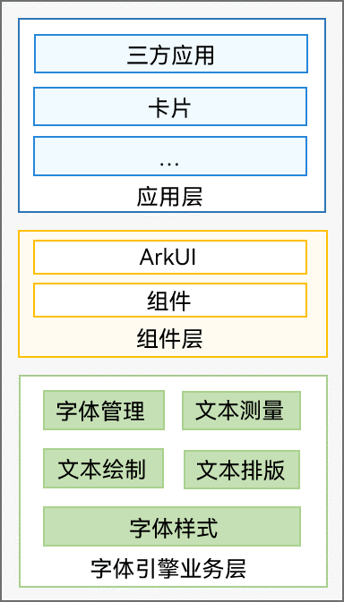
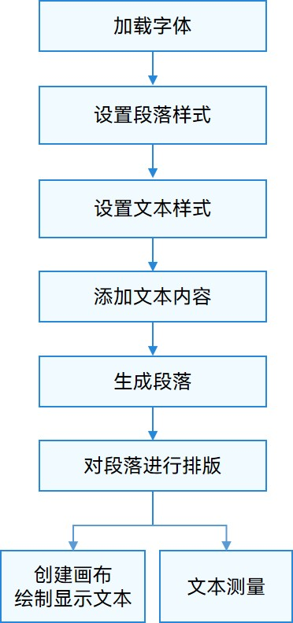

# 文本开发概述

应用在开发和布局时，经常需要针对文本元素和内容进行排版、测量、绘制和显示等。字体引擎开发框架提供了一系列接口能力用于支持应用布局文本和管理字体。

## 能力范围

**图1** 字体引擎能力结构图

当前字体引擎开发框架支持在应用中对文字、emoji表情、placeholder、等文本元素进行塑形、排版、测量和绘制显示。

开发者可以选择使用不同的ArkTS语言或者C/C++语言，来使用字体引擎的相关能力以实现对应场景。

文本相关的能力场景主要分为以下几个方面具体展开：

- **字体管理**：文本的绘制显示离不开字体的使用和管理，当前支持对各种字体资源的注册和使用。主要包括主题字体、自定义字体、系统字体。

- **字体样式**：在进行文本排版前，可以为文本设置各种样式，以增强文本显示的效果。主要包括段落样式、文本样式，例如段落样式可以指定换行策略、文字对齐策略、行高等，文本样式可以指定文本颜色、文字大小、文字粗细、装饰线等。

- **文本排版**：结合文本样式和文字内容，对文字进行塑形、排列、布局的过程。

- **文本测量**：文本的绘制显示，除了依赖字体，也需要对文本进行准确的测量，便于对内容进行恰当的布局。当前支持对各种复杂样式文本进行测量，开发者可以通过相关接口获取文本的各种度量信息，比如：文本段落的长度、高度、行数、是否截断，每行文本的高度、宽度、文字个数等。

- **文本绘制**：支持按照指定起始坐标或路径的方式进行文本绘制，同时也支持绘制不同装饰样式的上划线、下划线、删除线等。

## 实现流程

实现文本绘制显示或文本测量的主要流程如下图所示，ArkTS侧和Native侧请注意使用对应的能力接口。

**图2** 文本测量与文本绘制显示的实现流程 

