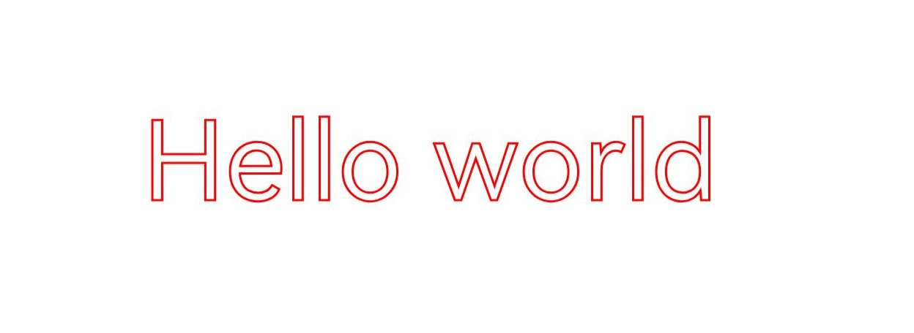
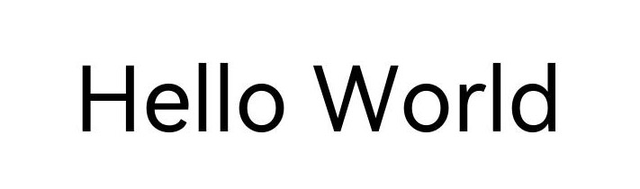
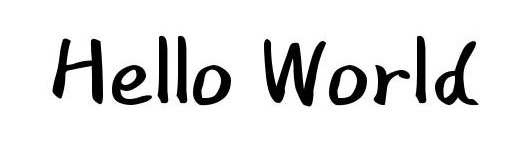
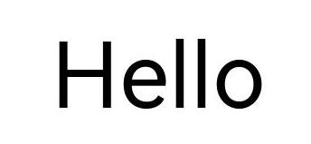
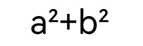

# 字块绘制（C/C++）

<!--Kit: ArkGraphics 2D-->
<!--Subsystem: Graphics-->
<!--Owner: @hangmengxin-->
<!--Designer: @wangyanglan-->
<!--Tester: @nobuggers-->
<!--Adviser: @ge-yafang-->

## 场景介绍

字块（TextBlob）是指文本的集合。无论是单个的文字还是大块的文本，都可以通过字块来绘制。

除了基本的字块绘制之外，还可以给文字添加各种绘制效果。常见的字块绘制场景包括[文字描边](#文字描边)、[文字渐变](#文字渐变)等，更多效果请见[绘制效果](drawing-effect-overview.md)。

本节不涉及文本测量和布局排版相关内容，如需在开发中处理此类文本绘制需求，可参考[文本开发概述](text-overview.md)，该文档系统讲解了排版策略与相关使用指导。

## 基本字块绘制

使用OH_Drawing_CanvasDrawTextBlob()接口绘制字块，接口接受4个参数，分别为：画布Canvas对象、字块对象、文字基线左端点的x坐标和y坐标。

画布Canvas对象具体可见[画布的获取与绘制结果的显示（C/C++）](canvas-get-result-draw-c.md)。

字块对象可以通过多种方式创建得到，详细的字块创建方式请参考[drawing_text_blob.h](../reference/apis-arkgraphics2d/capi-drawing-text-blob-h.md)。

此处以使用OH_Drawing_TextBlobCreateFromString()接口创建字块为例，接口接受3个参数，分别为：

- 需要显示的文本字符串内容。

- 指向OH_Drawing_Font字体对象的指针。OH_Drawing_Font用于设置和获取字体的各种属性，如字体大小、文本样式、字体对齐方式、字体渲染方式、字体描边方式等，详细的API介绍请参考[draw_font](../reference/apis-arkgraphics2d/capi-drawing-font-h.md)。

- 文本编码方式。

简单示例和示意图如下所示：

```c++
// 创建字体对象
OH_Drawing_Font *font = OH_Drawing_FontCreate();
// 设置字体大小
OH_Drawing_FontSetTextSize(font, 100);
// 需要绘制的文字
const char *str = "Hello world";
// 创建字块对象
OH_Drawing_TextBlob *textBlob =
    OH_Drawing_TextBlobCreateFromString(str, font, OH_Drawing_TextEncoding::TEXT_ENCODING_UTF8);
// 绘制字块
OH_Drawing_CanvasDrawTextBlob(canvas, textBlob, 200, 800); 
// 释放字块对象
OH_Drawing_TextBlobDestroy(textBlob);
// 释放字体对象
OH_Drawing_FontDestroy(font);
```


## 文字描边

基于基本的字块绘制，还可以通过画笔实现文字描边效果，描边效果的更多介绍请参考[描边效果](basic-drawing-effect-c.md#描边效果)。

文字描边的简要示例和示意图如下：

```c++
// 创建画笔
OH_Drawing_Pen *pen = OH_Drawing_PenCreate();
// 设置抗锯齿
OH_Drawing_PenSetAntiAlias(pen, true);
// 设置描边颜色
OH_Drawing_PenSetColor(pen, OH_Drawing_ColorSetArgb(0xFF, 0xFF, 0x00, 0x00));
// 设置描边线宽
OH_Drawing_PenSetWidth(pen, 3);
// 设置画笔描边效果
OH_Drawing_CanvasAttachPen(canvas, pen);
// 创建字型对象
OH_Drawing_Font *font = OH_Drawing_FontCreate();
// 设置字体大小
OH_Drawing_FontSetTextSize(font, 150);
const char *str = "Hello world";
// 创建字块对象
OH_Drawing_TextBlob *textBlob =
    OH_Drawing_TextBlobCreateFromString(str, font, OH_Drawing_TextEncoding::TEXT_ENCODING_UTF8);
// 绘制字块
OH_Drawing_CanvasDrawTextBlob(canvas, textBlob, 200, 800);
// 去除描边效果
OH_Drawing_CanvasDetachPen(canvas);
// 销毁各类对象
OH_Drawing_TextBlobDestroy(textBlob);
OH_Drawing_FontDestroy(font);
OH_Drawing_PenDestroy(pen);
```



## 文字渐变

基于基本字块绘制，还可以通过着色器实现文字渐变的效果，着色器的更多介绍请参考[着色器效果](complex-drawing-effect-c.md#着色器效果)。

以下为文字添加了线性渐变着色器效果的简要示例和示意图：

```c++
// 开始点
OH_Drawing_Point *startPt = OH_Drawing_PointCreate(100, 100);
// 结束点
OH_Drawing_Point *endPt = OH_Drawing_PointCreate(900, 900);
// 颜色数组
uint32_t colors[] = {0xFFFFFF00, 0xFFFF0000, 0xFF0000FF};
// 相对位置数组
float pos[] = {0.0f, 0.5f, 1.0f};
// 创建线性渐变着色器效果
OH_Drawing_ShaderEffect *colorShaderEffect =
    OH_Drawing_ShaderEffectCreateLinearGradient(startPt, endPt, colors, pos, 3, OH_Drawing_TileMode::CLAMP);
// 创建画刷对象
OH_Drawing_Brush *brush = OH_Drawing_BrushCreate();
// 基于画刷设置着色器效果
OH_Drawing_BrushSetShaderEffect(brush, colorShaderEffect);
// 设置画刷填充效果
OH_Drawing_CanvasAttachBrush(canvas, brush);
// 创建字型对象
OH_Drawing_Font *font = OH_Drawing_FontCreate();
// 设置字体大小
OH_Drawing_FontSetTextSize(font, 150);
const char *str = "Hello world";
// 创建字块对象
OH_Drawing_TextBlob *textBlob =
    OH_Drawing_TextBlobCreateFromString(str, font, OH_Drawing_TextEncoding::TEXT_ENCODING_UTF8);
// 绘制字块
OH_Drawing_CanvasDrawTextBlob(canvas, textBlob, 200, 800);
// 取消填充效果
OH_Drawing_CanvasDetachBrush(canvas);
// 销毁各类对象
OH_Drawing_TextBlobDestroy(textBlob);
OH_Drawing_FontDestroy(font);
OH_Drawing_BrushDestroy(brush);
```


## 主题字体

主题字体，特指系统**主题应用**中能使用的字体，属于一种特殊的自定义字体。如需涉及文本测量和布局排版相关内容，可参考[使用主题字体（C/C++）](theme-font-c.md)。

设置跟随主题字体的示例代码和效果图如下：

```c++
// 创建字型对象
OH_Drawing_Font *font = OH_Drawing_FontCreate();
// 设置文字大小
OH_Drawing_FontSetTextSize(font, 100);
// 设置跟随主题字体
OH_Drawing_FontSetThemeFontFollowed(font, true);
// 需要绘制的文字
const char *str = "Hello World";
// 创建字块对象
OH_Drawing_TextBlob *textBlob =
    OH_Drawing_TextBlobCreateFromString(str, font, OH_Drawing_TextEncoding::TEXT_ENCODING_UTF8);
// 绘制字块
OH_Drawing_CanvasDrawTextBlob(canvas, textBlob, 200, 800);
// 释放字块对象
OH_Drawing_TextBlobDestroy(textBlob);
// 释放字型对象
OH_Drawing_FontDestroy(font);
```

| 未跟随主题字体的效果图 | 跟随主题字体的效果图（不同主题字体显示效果不同，此处仅示意） |
| -------- | -------- |
|  |  |

> **说明**
>
> 需要在应用入口文件（默认工程中为EntryAbility.ets）中重写onConfigurationUpdate函数，以响应切换主题字体的操作，确保切换后页面能够及时刷新并生效。具体实现可参考[使用主题字体（C/C++）](theme-font-c.md)。

## 单字绘制

单字绘制是图形渲染中针对文本渲染的一种精细化控制技术。相比字块绘制，其核心优势在于能够利用字体退化机制，在当前字体无法显示某字符时，自动退化到使用系统字体绘制字符，提升对特殊字符的兼容性，避免字符缺失。同时，单字绘制支持逐字符配置字体特征（如连字、替代字形），满足复杂排版需求，增强用户体验。详细API说明请见[drawing_canvas.h](../reference/apis-arkgraphics2d/capi-drawing-canvas-h.md#oh_drawing_canvasdrawsinglecharacter)。

基础场景：绘制无字体特征的字符  
对于无需字体特征的常规文本渲染场景，可以使用OH_Drawing_CanvasDrawSingleCharacter绘制单个字符，使用OH_Drawing_FontMeasureSingleCharacter测量单个字符的宽度，示例代码和效果图如下：

```c++
// 创建字型对象
OH_Drawing_Font *font = OH_Drawing_FontCreate();
// 设置文字大小
OH_Drawing_FontSetTextSize(font, 100);
float startX = 100;
float startY = 100;
const char* str = "Hello";
for (int i = 0; i < 5; ++i) {
    // 单字绘制
    OH_Drawing_CanvasDrawSingleCharacter(canvas, &str[i], font, startX, startY);
    float textWidth = 0.f;
    // 测量单个字符的宽度
    OH_Drawing_FontMeasureSingleCharacter(font, &str[i], &textWidth);
    startX += textWidth;
}
// 释放字型对象
OH_Drawing_FontDestroy(font);
```



进阶场景：绘制带字体特征的字符  
对于需要字体特征的文本渲染场景，可以使用OH_Drawing_CanvasDrawSingleCharacterWithFeatures绘制单个字符，使用OH_Drawing_FontMeasureSingleCharacterWithFeatures测量单个字符的宽度，示例代码和效果图如下：

```c++
// 创建字型对象
OH_Drawing_Font *font = OH_Drawing_FontCreate();
// 设置文字大小
OH_Drawing_FontSetTextSize(font, 100);
// 创建字体特征对象
OH_Drawing_FontFeatures* features = OH_Drawing_FontFeaturesCreate();
OH_Drawing_FontFeaturesAddFeature(features, "frac", 1);
float startX = 100;
float startY = 100;
const char* str = "a2+b2";
for (int i = 0; i < 5; ++i) {
    // 单字绘制
    OH_Drawing_CanvasDrawSingleCharacterWithFeatures(canvas, &str[i], font, startX, startY, features);
    float textWidth = 0.f;
    // 测量单个字符的宽度
    OH_Drawing_FontMeasureSingleCharacterWithFeatures(font, &str[i], features, &textWidth);
    startX += textWidth;
}
// 释放字体特征对象
OH_Drawing_FontFeaturesDestroy(features);
// 释放字型对象
OH_Drawing_FontDestroy(font);
```



> **说明**
>
> 如果 `OH_Drawing_CanvasDrawSingleCharacterWithFeatures` 与 `OH_Drawing_FontMeasureSingleCharacter` 混合使用，或者 `OH_Drawing_CanvasDrawSingleCharacter` 与 `OH_Drawing_FontMeasureSingleCharacterWithFeatures` 混合使用，字体绘制可能会重叠。

<!--RP1-->
## 相关实例

针对Drawing(C/C++)的开发，有以下相关实例可供参考：

- [NDKGraphicsDraw (API14)](https://gitcode.com/openharmony/applications_app_samples/tree/master/code/DocsSample/Drawing/NDKGraphicsDraw)
<!--RP1End-->