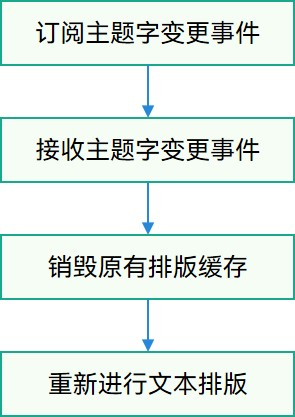
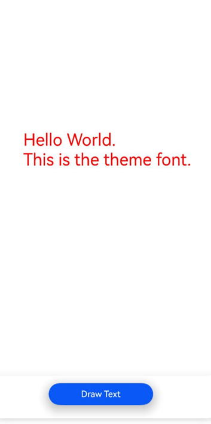

# 使用主题字体（ArkTS）

## 场景介绍

主题字体，特指系统**主题应用**中能使用的字体，属于一种特殊的自定义字体，可以通过相关接口调用使能主题应用中的主题字体。

## 实现机制

**图1** 主题字体的切换和使用



针对主题字的切换使用，应用方应确保订阅主题字变更事件，当接收字体变更事件后，由应用方主动调用页面刷新才能实现主题字的切换，否则主题字只能在重启应用后才生效。


## 接口说明

注册使用主题字体的常用接口如下表所示，详细接口说明请见[@ohos.graphics.text (文本模块)](../reference/apis-arkgraphics2d/js-apis-graphics-text.md)。

| 接口 | 描述 | 
| -------- | -------- |
| getGlobalInstance(): FontCollection | 获取应用全局字体集的实例。 | 


## 开发步骤

1. 请确保在设备系统**主题应用**中，能成功应用一项主题字体。

2. 导入依赖的相关模块。

   ```ts
   import { text } from '@kit.ArkGraphics2D';
   ```

3. 使用getGlobalInstance()接口获取全局字体集对象，系统框架在注册主题字体过程中仅会将主题字体信息传入全局字体集对象中。

   ```ts
   let fontCollection = text.FontCollection.getGlobalInstance();
   ```

4. 创建段落样式，并使用字体管理器实例构造段落生成器PargraphBuilder实例，用于生成段落。
   > **说明：**
   >
   > 在生成段落对象设置段落样式入参时，不能指定fontFamilies属性，否则会变为优先使用指定字体而非主题字体。
   > 
   > 若未在系统**主题应用**中设置一项主题字体，则将使用系统默认字体进行绘制。

   ```ts
   // 设置文本样式
   let myTextStyle: text.TextStyle = {
       color: { alpha: 255, red: 255, green: 0, blue: 0 },
       fontSize: 100,
       // fontFamilies:['Test Font'] // 不要指定fontFamilies，否则优先使用指定字体
   };
   // 创建一个段落样式对象，以设置排版风格
   let myParagraphStyle: text.ParagraphStyle = {textStyle: myTextStyle}
   // 创建一个段落生成器
   let paragraphBuilder: text.ParagraphBuilder = new text.ParagraphBuilder(myParagraphStyle, fontCollection);
   ```

5. 设置文本样式，添加文本内容，并生成段落文本用于后续文本的绘制显示。

   ```ts
   // 在段落生成器中设置文本样式
   paragraphGraphBuilder.pushStyle(myTextStyle);
   // 在段落生成器中设置文本内容
   paragraphGraphBuilder.addText("Custom font test");
   // 通过段落生成器生成段落
   let paragraph = paragraphGraphBuilder.build();
   ```

6. 创建渲染节点，并保存到数组。（此处示例代码为简化逻辑，采用数组作为容器，实际开发中应结合应用情况选择更恰当的容器来保证节点的添加与删除对应。）

   ```ts
   // 创建渲染节点数组
   const renderNodeMap: Array<RenderNode> = new Array();
   // 创建节点控制器
   class MyNodeController extends NodeController {
     private rootNode: FrameNode | null = null;
     makeNode(uiContext: UIContext): FrameNode {
       this.rootNode = new FrameNode(uiContext)
       if (this.rootNode == null) {
         return this.rootNode
       }
       const renderNode = this.rootNode.getRenderNode()
       if (renderNode != null) {
         renderNode.frame = { x: 0, y: 0, width: 300, height: 50 }
         renderNode.pivot = { x: 0, y: 0 }
       }
       return this.rootNode
     }
     addNode(node: RenderNode): void {
       if (this.rootNode == null) {
         return
       }
       const renderNode = this.rootNode.getRenderNode()
       if (renderNode != null) {
         renderNode.appendChild(node)
         // 将节点添加到渲染节点数组中
         renderNodeMap.push(node)
       }
     }
     clearNodes(): void {
       if (this.rootNode == null) {
         return
       }
       const renderNode = this.rootNode.getRenderNode()
       if (renderNode != null) {
         renderNode.clearChildren()
         // 将节点从渲染节点数组中移除
         renderNodeMap.pop()
       }
     }
   }
   let paragraph = paragraphGraphBuilder.build();
   ```

7. 创建渲染节点更新函数，并导出函数，供其他文件（如：EntryAbility.ets）使用；重绘制节点目的为更新排版中字体信息，若不更新字体信息，使用之前残留结果，可能造成文字乱码。

   ```ts
   // 导出渲染节点更新函数
   export function updateRenderNodeData() {
     renderNodeMap.forEach((node) => {
       // 主动触发节点重绘制
       node.invalidate()
     })
   }
   ```

8. 在EntryAbility.ets中接收主题字变更事件，并调用渲染节点更新函数。

   ```ts
   // entryability/EntryAbility.ets
   export default class EntryAbility extends UIAbility {
       // ...  
       preFontId ="";
       onConfigurationUpdate(newConfig: Configuration):void{
           let fontId = newConfig.fontId;
           if(fontId && fontId !=this.preFontId){
               this.preFontId = fontId;
               updateRenderNodeData();
           }
       }
       // ...
   }
   ```


## 完整示例

这里以使用主题字体绘制"Hello World. \nThis is the theme font."文本为例，提供完整的示例和效果示意图。

```ts
// /pages/Index.ets
import { NodeController, FrameNode, RenderNode, DrawContext } from '@kit.ArkUI'
import { UIContext } from '@kit.ArkUI'
import { text } from '@kit.ArkGraphics2D'

class MyRenderNode extends RenderNode {
  async draw(context: DrawContext) {
    // 获取画布canvas对象
    const canvas = context.canvas
    // 设置文本样式
    let myTextStyle: text.TextStyle = {
      color: { alpha: 255, red: 255, green: 0, blue: 0 },
      fontSize: 100
    };
    // 创建一个段落样式对象，以设置排版风格
    let myParagraphStyle: text.ParagraphStyle = {
      textStyle: myTextStyle,
      align: 3,
      wordBreak:text.WordBreak.NORMAL
    };
    // 获取字体管理器全局FontCollection实例
    let fontCollection = text.FontCollection.getGlobalInstance() //获取Arkui全局FC
    // 创建一个段落生成器
    let paragraphGraphBuilder = new text.ParagraphBuilder(myParagraphStyle, fontCollection)
    // 在段落生成器中设置文本样式
    paragraphGraphBuilder.pushStyle(myTextStyle);
    // 在段落生成器中设置文本内容
    paragraphGraphBuilder.addText("Hello World. \nThis is the theme font.");
    // 通过段落生成器生成段落
    let paragraph = paragraphGraphBuilder.build();
    // 布局
    paragraph.layoutSync(1500);
    paragraph.paint(canvas, 200, 800);
  }
}
// 创建渲染节点数组
const renderNodeMap: Array<RenderNode> = new Array();
// 导出渲染节点更新函数
export function updateRenderNodeData() {
  renderNodeMap.forEach((node) => {
    // 主动触发节点重绘制
    node.invalidate()
  })
}

// 创建一个MyRenderNode对象
function getNewRenderNode() {
  const textNodeTest = new MyRenderNode();
  // 定义newNode的像素格式
  textNodeTest.frame = { x: 0, y: 0, width: 500, height: 500 }
  textNodeTest.pivot = { x: 0.5, y: 0.5 }
  textNodeTest.scale = { x: 1, y: 1 }
  return textNodeTest;
}

class MyNodeController extends NodeController {
  private rootNode: FrameNode | null = null;
  makeNode(uiContext: UIContext): FrameNode {
    this.rootNode = new FrameNode(uiContext)
    if (this.rootNode == null) {
      return this.rootNode
    }
    const renderNode = this.rootNode.getRenderNode()
    if (renderNode != null) {
      renderNode.frame = { x: 0, y: 0, width: 300, height: 50 }
      renderNode.pivot = { x: 0, y: 0 }
    }
    return this.rootNode
  }
  addNode(node: RenderNode): void {
    if (this.rootNode == null) {
      return
    }
    const renderNode = this.rootNode.getRenderNode()
    if (renderNode != null) {
      renderNode.appendChild(node)
      // 将节点添加到渲染节点数组中
      renderNodeMap.push(node)
    }
  }
  clearNodes(): void {
    if (this.rootNode == null) {
      return
    }
    const renderNode = this.rootNode.getRenderNode()
    if (renderNode != null) {
      renderNode.clearChildren()
      // 将节点从渲染节点数组中移除
      renderNodeMap.pop()
    }
  }
}
@Entry
@Component
struct RenderTest {
  private myNodeController: MyNodeController = new MyNodeController()
  build() {
    Column() {
      Row() {
        NodeContainer(this.myNodeController)
          .height('100%')
      }
      .height('90%')
      .backgroundColor(Color.White)
      Row(){
        Button("Draw Text")
          .fontSize('16fp')
          .fontWeight(500)
          .margin({ bottom: 24, right: 12 })
          .onClick(() => {
            this.myNodeController.clearNodes()
            this.myNodeController.addNode(getNewRenderNode())
          })
          .width('50%')
          .height(40)
          .shadow(ShadowStyle.OUTER_DEFAULT_LG)
      }
      .width('100%')
      .justifyContent(FlexAlign.Center)
      .shadow(ShadowStyle.OUTER_DEFAULT_SM)
      .alignItems(VerticalAlign.Bottom)
      .layoutWeight(1)
    }
  }
}


```

```ts
// entryability/EntryAbility.ets
import { AbilityConstant, Configuration, UIAbility, Want } from '@kit.AbilityKit';
import { hilog } from '@kit.PerformanceAnalysisKit';
import { window } from '@kit.ArkUI';
import { updateRenderNodeData } from '../pages/Index';
export default class EntryAbility extends UIAbility {
    // ...  
    preFontId ="";
    onConfigurationUpdate(newConfig: Configuration):void{
        let fontId = newConfig.fontId;
        if(fontId && fontId !=this.preFontId){
            this.preFontId = fontId;
            updateRenderNodeData();
        }
    }
    // ...
}
```

## 效果展示

以下展示了在系统**主题应用**中切换使用不同主题字体后，对应的文字渲染效果。

不同主题字体显示效果不同，此处仅示意。

**图2** 主题字体1的效果 



**图3** 主题字体2的效果


