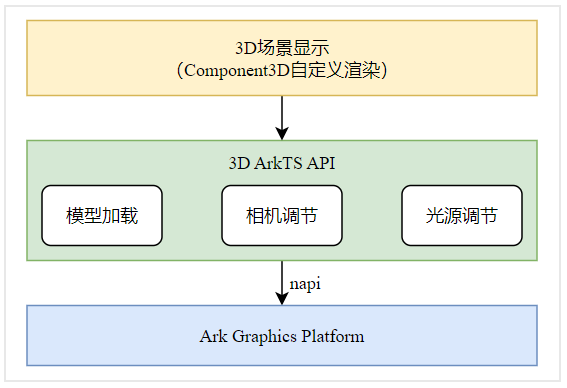

# ArkGraphics 3D场景搭建以及管理

一个3D场景通常由光源、相机、模型三个关键部分组成。
- 光源：为整个3D场景提供光照，使得3D场景中的模型变得可见。与真实物理场景一致，没有光源场景将变得一片漆黑，得到的渲染结果也就是全黑色。
- 相机：为3D场景提供一个观察者。3D渲染本质上是从一个角度观察3D场景并投影到一张2D图片上。没有相机就没有3D场景的观察者，也就不会得到渲染结果。
- 模型：3D场景中的模型用于描述对象的形状、结构和外观，一般具有网格、材质、纹理、动画等属性。一些常见的3D模型格式有OBJ、FBX、glTF等。

模型加载后，可以通过ArkUI的[Component3D](../reference/apis-arkui/arkui-ts/ts-basic-components-component3d.md)渲染组件呈现给用户，Component3D也可以对3D模型做自定义渲染。开发者也可以使用ArkTS API对相机和光源进行调节，获得合适的观察角度和光照效果。ArkTS API可通过napi调用AGP中由C++实现的相应能力。



## 模型的加载及呈现
模型的格式多种多样，目前ArkGraphics 3D仅支持glTF模型的加载，glTF是一种对于3D场景描述的格式，glTF作为一种开源3D场景格式在业界被广泛采用。关于glTF的介绍可以参照[glTF-2.0](https://registry.khronos.org/glTF/specs/2.0/glTF-2.0.html)。

一个glTF模型可以包含光源、相机、模型等3D场景关键要素，如果一个glTF模型中包含相机，使用ArkGraphics 3D提供的接口加载glTF就可以直接完成该相机视角下3D场景的渲染。如果不包含相机，也可以利用ArkGraphics 3D创建一个相机完成渲染。由于3D模型往往数据量很大，通常采用异步方式进行加载，加载成功后将返回一个scene对象，通过该对象可对整个3D场景进行编辑。

glTF模型可用Scene提供的[load](../reference/apis-arkgraphics3d/js-apis-inner-scene.md#load)接口加载，示例代码如下：
```ts
import { Image, Shader, MaterialType, Material, ShaderMaterial, Animation, Environment, Container, SceneNodeParameters,
  LightType, Light, Camera, SceneResourceParameters, SceneResourceFactory, Scene, Node } from '@kit.ArkGraphics3D';

function loadModel() : void {
  // 加载模型
  let scene: Promise<Scene> = Scene.load($rawfile("gltf/DamagedHelmet/glTF/DamagedHelmet.gltf"));
  scene.then(async (result: Scene) => {});
}
```

模型加载成功后，可通过SceneResourceFactory实例创建相机、光源等，再对相机和光源的参数做调节，调整观察角度和光照效果。最后，将Scene实例和ModelType作为SceneOptions传给Component3D组件显示到屏幕。

模型显示完整的示例代码如下，需确保gltf文件内容和路径准确。

```ts
import { Image, Shader, MaterialType, Material, ShaderMaterial, Animation, Environment, Container, SceneNodeParameters,
  LightType, Light, Camera, SceneResourceParameters, SceneResourceFactory, Scene, Node } from '@kit.ArkGraphics3D';

@Entry
@Component
struct Model {
  scene: Scene | null = null;
  @State sceneOpt: SceneOptions | null = null;
  cam: Camera | null = null;

  onPageShow(): void {
    this.Init();
  }

  Init(): void {
    if (this.scene == null) {
      // 加载模型，将gltf文件放置到相关路径，加载时以实际路径为准
      Scene.load($rawfile('gltf/DamagedHelmet/glTF/DamagedHelmet.gltf'))
      .then(async (result: Scene) => {
        this.scene = result;
        let rf:SceneResourceFactory = this.scene.getResourceFactory();
        // 创建相机
        this.cam = await rf.createCamera({ "name": "Camera" });
        // 设置合适的相机参数
        this.cam.enabled = true;
        this.cam.position.z = 5;
        this.sceneOpt = { scene: this.scene, modelType: ModelType.SURFACE } as SceneOptions;
      })
      .catch((reason: string) => {
        console.log(reason);
      });
    }
  }

  build() {
    Row() {
      Column() {
        if (this.sceneOpt) {
          // 通过Component3D呈现3D场景
          Component3D(this.sceneOpt)
        } else {
          Text("loading ...")
        }
      }.width('100%')
    }.height('60%')
  }
}
```

## 相机的创建及管理

相机作为3D场景中的重要部分，决定了整个3D场景向2D图片的投影过程，相机的近远平面、Fov角等关键参数也会对整个3D渲染产生重要的影响。开发者可以通过对于相机参数的设置。控制这个渲染过程，得到开发者想要的渲染效果。

相机相关控制的示例代码如下：
```ts
import { Image, Shader, MaterialType, Material, ShaderMaterial, Animation, Environment, Container, SceneNodeParameters,
  LightType, Light, Camera, SceneResourceParameters, SceneResourceFactory, Scene, Node } from '@kit.ArkGraphics3D';

function createCameraPromise() : Promise<Camera> {
  return new Promise(() => {
    let scene: Promise<Scene> = Scene.load($rawfile("gltf/CubeWithFloor/glTF/AnimatedCube.gltf"));
    scene.then(async (result: Scene) => {
      let sceneFactory: SceneResourceFactory = result.getResourceFactory();
      let sceneCameraParameter: SceneNodeParameters = { name: "camera1" };
      // 创建相机
      let camera: Promise<Camera> = sceneFactory.createCamera(sceneCameraParameter);
      camera.then(async (cameraEntity: Camera) => {
        // 使能相机节点
        cameraEntity.enabled = true;

        // 设置相机的位置
        cameraEntity.position.z = 5;

        // 设置相机Fov参数
        cameraEntity.fov = 60 * Math.PI / 180;

        // 可以参照此方式设置相机很多其他的参数
        // ...
      });
      return camera;
    });
  });
}
```


## 光源的创建及管理

3D场景的光源是对于物理世界中光源的一种数据建模，模拟物理世界的光源对于3D场景中的物体产生影响。

光源具有很多的类型，比如平行光、锥形光。平行光即是用来模拟生活中的太阳光照，发出的光线处处平行且强度均匀。锥形光则像是我们使用的手电筒，以一个点向一个扇形区域发射光线，且发出的光线会随着距离而衰减。光源的颜色也会对场景中的物体最终的着色产生影响，光源颜色与物体颜色相互作用的计算与真实物理世界保持一致。ArkGraphics 3D提供了创建光源，修改光源各种参数的能力，支撑开发者通过对于光源属性的设置对于3D场景进行调整，得到期望的渲染效果。

光源相关控制的示例代码如下：
```ts
import { Image, Shader, MaterialType, Material, ShaderMaterial, Animation, Environment, Container, SceneNodeParameters,
  LightType, Light, Camera, SceneResourceParameters, SceneResourceFactory, Scene, Node } from '@kit.ArkGraphics3D';

function createLightPromise() : Promise<Light> {
  return new Promise(() => {
    let scene: Promise<Scene> = Scene.load($rawfile("gltf/CubeWithFloor/glTF/AnimatedCube.gltf"));
    scene.then(async (result: Scene) => {
      let sceneFactory: SceneResourceFactory = result.getResourceFactory();
      let sceneLightParameter: SceneNodeParameters = { name: "light" };
      // 创建平行光
      let light: Promise<Light> = sceneFactory.createLight(sceneLightParameter, LightType.DIRECTIONAL);
      light.then(async (lightEntity: Light) => {
        // 设置平行光的颜色属性
        lightEntity.color = { r: 0.8, g: 0.1, b: 0.2, a: 1.0 };

        // 可以参照此方式设置光源很多其他的参数
        // ...
      });
      return light;
    });
  });
}
```

<!--RP1-->
## 相关实例

对于模型、相机和光源更加综合的使用可以参考以下实例：
- [3D引擎接口示例（ArkTS）（API12）](https://gitee.com/openharmony/applications_app_samples/tree/master/code/BasicFeature/Graphics/Graphics3d) 
<!--RP1End-->
