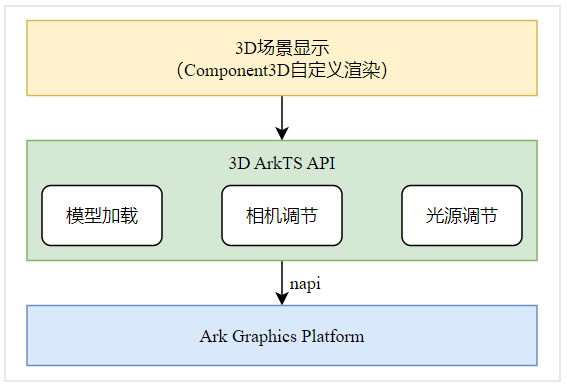

# ArkGraphics 3D场景搭建以及管理
<!--Kit: ArkGraphics 3D-->
<!--Subsystem: Graphics-->
<!--Owner: @zzhao0-->
<!--Designer: @zdustc-->
<!--Tester: @zhangyue283-->
<!--Adviser: @ge-yafang-->

一个3D场景通常由光源、相机、模型三个关键部分组成。
- 光源：为整个3D场景提供光照，使得3D场景中的模型变得可见。与真实物理场景一致，没有光源场景将变得一片漆黑，得到的渲染结果也就是全黑色。
- 相机：为3D场景提供一个观察者。3D渲染本质上是从一个角度观察3D场景并投影到2D图片上。没有相机就没有3D场景的观察者，也就不会得到渲染结果。
- 模型：3D场景中的模型用于描述对象的形状、结构和外观，一般具有网格、材质、纹理、动画等属性。一些常见的3D模型格式有OBJ、FBX、glTF等。

模型加载后，可以通过ArkUI的[Component3D](../reference/apis-arkui/arkui-ts/ts-basic-components-component3d.md)渲染组件呈现给用户，Component3D负责将ArkGraphics 3D场景渲染到界面中。在自定义场景模式下，开发者可以使用ArkTS API创建并管理相机和光源节点，从而设置合适的观察角度和光照效果；在自动场景模式下，框架会根据模型自动创建基础相机和光照。ArkTS API可通过napi调用AGP中由C++实现的相应能力。



## 模型的加载及呈现
模型的格式多种多样，目前ArkGraphics 3D仅支持glTF模型的加载，glTF是一种对于3D场景描述的格式，glTF作为一种开源3D场景格式在业界被广泛采用。关于glTF的介绍可以参照[glTF-2.0](https://registry.khronos.org/glTF/specs/2.0/glTF-2.0.html)。

一个glTF模型可以包含光源、相机、模型等3D场景关键要素，如果一个glTF模型中包含相机，使用ArkGraphics 3D提供的接口加载glTF就可以直接完成该相机视角下3D场景的渲染。如果不包含相机，也可以利用ArkGraphics 3D创建一个相机完成渲染。由于3D模型往往数据量很大，通常采用异步方式进行加载，加载成功后将返回一个scene对象，通过该对象可对整个3D场景进行编辑。

glTF模型中引用的纹理图片支持以下格式：

| 格式 | 支持情况 |
|------|----------|
| JPEG（.jpg/.jpeg） | 支持识别头部携带JFIF、Exif、ICC Profile标记的JPEG文件；<br>搭载OpenHarmony 7.0.0及以上版本的设备，新增支持识别头部包含DQT、XMP、MPF、Adobe标记的JPEG文件。 |
| PNG（.png） | 支持标准PNG文件。 |

1. 导入相关模块。

   在页面脚本中导入ArkGraphics 3D提供的核心类型，用于创建和管理3D场景与相机。

   <!-- @[model_header](https://gitcode.com/openharmony/applications_app_samples/blob/master/code/DocsSample/ArkGraphics3D/entry/src/main/ets/scene/init.ets) -->
   
   ``` TypeScript
   import { Camera, Scene, SceneResourceFactory } from '@kit.ArkGraphics3D';
   ```

2. 加载场景资源。

   ArkGraphics 3D提供Scene.load()接口用于加载glTF模型文件，模型加载成功后会返回一个Scene实例，可通过它继续创建相机或光照等组件。模型文件支持.gltf与.glb格式，其中.glb为二进制封装形式，与.gltf内容等价但更便于加载与使用。模型加载支持相对路径和绝对路径两种方式：相对路径加载使用$rawfile()，从应用的resources/rawfile/目录读取内置资源文件；绝对路径加载需从应用沙箱目录读取文件，Scene.load()仅支持访问应用自身创建或写入的沙箱文件，具体示例可参见[load()](../reference/apis-arkgraphics3d/js-apis-inner-scene.md#load)。

   以下示例展示通过相对路径加载.glb模型：

   <!-- @[model_load](https://gitcode.com/openharmony/applications_app_samples/blob/master/code/DocsSample/ArkGraphics3D/entry/src/main/ets/scene/init.ets) -->
   
   ``` TypeScript
   if (this.scene == null) {
     // Load the model and place the gltf file in the related path. Use the actual path during loading.
     // Switched from .gltf to .glb; same content, different format
     Scene.load($rawfile('gltf/DamagedHelmet/glTF/DamagedHelmet.glb'))
       .then(async (result: Scene) => {
         this.scene = result;
         let rf: SceneResourceFactory = this.scene.getResourceFactory();
         // ...
       })
       .catch((error: string) => {
       console.error('Scene load failed: ' + error);
     });
   }
   ```

3. 创建相机并设置场景渲染参数。

   使用SceneResourceFactory.createCamera()创建相机，并设置相机启用状态与观察位置。通过调整相机的z轴位置，可控制观察距离。随后将加载完成的Scene封装为SceneOptions，并指定渲染类型为ModelType.SURFACE，用于Component3D渲染显示。

   <!-- @[camera_scene_params](https://gitcode.com/openharmony/applications_app_samples/blob/master/code/DocsSample/ArkGraphics3D/entry/src/main/ets/scene/init.ets) -->
   
   ``` TypeScript
   // Create a Camera.
   this.cam = await rf.createCamera({ 'name': 'Camera' });
   // Set proper camera parameters.
   this.cam.enabled = true;
   this.cam.position.z = 5;
   
   this.sceneOpt = { scene: this.scene, modelType: ModelType.SURFACE } as SceneOptions;
   ```

4. 渲染3D模型。

   通过Component3D渲染加载完成的3D场景。若模型尚未加载完成，则显示提示文本。Component3D会根据传入的SceneOptions自动进行渲染。

   <!-- @[render_model](https://gitcode.com/openharmony/applications_app_samples/blob/master/code/DocsSample/ArkGraphics3D/entry/src/main/ets/scene/init.ets) -->
   
   ``` TypeScript
   if (this.sceneOpt) {
     // Use Component3D to display the 3D scenario.
     Component3D(this.sceneOpt);
   } else {
     Text('Loading···');
   }
   ```

## 相机的创建及管理

相机作为3D场景中的重要部分，决定了整个3D场景向2D图片的投影过程，相机的近远平面、FoV角等关键参数也会对整个3D渲染产生重要的影响。开发者可以通过设置相机参数，控制这个渲染过程，得到开发者想要的渲染效果。

ArkGraphics 3D提供了灵活的相机接口，开发者可根据需要动态创建、配置与控制相机。

1. 导入相关模块。

   在页面脚本中导入ArkGraphics 3D提供的核心类型，用于加载场景、创建相机及资源管理。

   <!-- @[cam_header](https://gitcode.com/openharmony/applications_app_samples/blob/master/code/DocsSample/ArkGraphics3D/entry/src/main/ets/scene/camera.ets) -->
   
   ``` TypeScript
   import { Camera, Scene, SceneNodeParameters, SceneResourceFactory } from '@kit.ArkGraphics3D';
   ```

2. 加载场景资源。

   使用Scene.load()从应用的resources/rawfile/目录加载.glb模型文件，.glb为glTF的二进制封装格式，与.gltf内容等价但更便于加载与使用。模型加载成功后返回Scene对象，可通过它获取SceneResourceFactory用于后续创建相机。

   <!-- @[cam_load_and_factory](https://gitcode.com/openharmony/applications_app_samples/blob/master/code/DocsSample/ArkGraphics3D/entry/src/main/ets/scene/camera.ets) -->
   
   ``` TypeScript
   let scene: Promise<Scene> = Scene.load($rawfile('gltf/CubeWithFloor/glTF/AnimatedCube.glb'));
   scene.then(async (result: Scene) => {
     // ...
     let sceneFactory: SceneResourceFactory = result.getResourceFactory();
     let sceneCameraParameter: SceneNodeParameters = { name: 'camera' };
     // ...
   }).catch((error: string) => {
     console.error('Scene load failed: ' + error);
     reject(error);
   });
   ```

3. 创建相机并配置相机参数。

   调用 SceneResourceFactory.createCamera()创建相机，并配置相机的启用状态、位置、视场角（FoV）等参数。相机位置影响场景的观察距离，FoV决定画面透视范围。

   <!-- @[cam_create_and_config](https://gitcode.com/openharmony/applications_app_samples/blob/master/code/DocsSample/ArkGraphics3D/entry/src/main/ets/scene/camera.ets) -->
   
   ``` TypeScript
   let camera: Promise<Camera> = sceneFactory.createCamera(sceneCameraParameter);
   camera.then(async (cameraEntity: Camera) => {
     // Enable the camera node.
     cameraEntity.enabled = true;
   
     // Set the camera position.
     cameraEntity.position.z = 5;
   
     // Set the FoV.
     cameraEntity.fov = 60 * Math.PI / 180;
   
     // Set other camera parameters.
     // ...
     // ...
   }).catch((error: string) => {
     console.error('Camera create failed: ' + error + '.');
     // ...
   });
   ```

4. 初始化与渲染绑定。

   完成相机初始化后，将加载好的场景与相机绑定，并设置场景渲染参数。通过构建SceneOptions对象，即可将场景交由Component3D渲染显示，具体渲染方式可参考模型加载示例。

   <!-- @[cam_init_bind](https://gitcode.com/openharmony/applications_app_samples/blob/master/code/DocsSample/ArkGraphics3D/entry/src/main/ets/scene/camera.ets) --> 
   
   ``` TypeScript
   this.camera = await createCameraPromise();
   if (globalScene && this.camera) {
     this.scene = globalScene;
     this.positionX = this.camera.position.x;
     this.positionY = this.camera.position.y;
     this.positionZ = this.camera.position.z;
     this.sceneOpt = { scene: this.scene, modelType: ModelType.SURFACE } as SceneOptions;
   }
   ```

5. 相机交互。

   开发者可通过设置相机的位置、旋转、缩放、FoV等参数，以实现交互式视角控制。以下示例以Z轴控制为例，X/Y轴逻辑与此类似。

   <!-- @[cam_ui_sliders](https://gitcode.com/openharmony/applications_app_samples/blob/master/code/DocsSample/ArkGraphics3D/entry/src/main/ets/scene/camera.ets) -->
   
   ``` TypeScript
   Slider({
     value: this.positionZ,
     min: 5,
     max: 10,
     step: 0.1,
     style: SliderStyle.OutSet
   })
     .showTips(false)
     .onChange((value: number, mode: SliderChangeMode) => {
       this.positionZ = value;
       if (mode === SliderChangeMode.End) {
         if (!this.scene || !this.camera) {
           return;
         }
         this.camera.position.z = value;
       }
     })
     .width('100%')
   ```

## 光源的创建及管理

3D场景的光源是对于物理世界中光源的一种数据建模，模拟物理世界的光源对于3D场景中的物体产生影响。

光源具有多种类型，例如平行光、锥形光。平行光用于模拟生活中的太阳光照，其光线平行且强度均匀。锥形光类似于手电筒，从一个点向扇形区域发射光线，光线强度随距离衰减。光源的颜色会影响场景中物体的最终着色，渲染时依据物理规律计算光源与物体表面颜色的交互，使光照效果更加真实。

ArkGraphics 3D提供创建光源及修改光源参数的功能，支持开发者通过设置光源属性调整3D场景，以实现预期的渲染效果。

1. 导入相关模块。

   在页面脚本中导入ArkGraphics 3D提供的核心类型，用于加载场景、创建相机与灯光。

   <!-- @[light_header](https://gitcode.com/openharmony/applications_app_samples/blob/master/code/DocsSample/ArkGraphics3D/entry/src/main/ets/scene/light.ets) -->
   
   ``` TypeScript
   import { Camera, Light, LightType, Scene, SceneNodeParameters, SceneResourceFactory } from '@kit.ArkGraphics3D';
   ```

2. 加载场景资源。

   使用Scene.load()从应用的resources/rawfile/目录加载.glb模型文件，.glb为glTF的二进制封装格式，与.gltf内容等价但更便于加载与使用。模型加载成功后返回Scene对象，可通过它获取SceneResourceFactory用于后续创建灯光。

   <!-- @[light_load_and_factory](https://gitcode.com/openharmony/applications_app_samples/blob/master/code/DocsSample/ArkGraphics3D/entry/src/main/ets/scene/light.ets) -->
   
   ``` TypeScript
   let scene: Promise<Scene> = Scene.load($rawfile('gltf/CubeWithFloor/glTF/AnimatedCube.glb'));
   scene.then(async (result: Scene) => {
     // ...
     let sceneFactory: SceneResourceFactory = result.getResourceFactory();
     let lightParameter: SceneNodeParameters = { name: 'light' };
     // ...
   }).catch((error: string) => {
     console.error('Scene load failed: ' + error);
     // ...
   });
   ```

3. 创建灯光并配置灯光参数。

   调用 SceneResourceFactory.createLight()创建灯光，并配置灯光的类型、位置、颜色等参数。灯光类型决定了光线的照射方式，位置决定了光源的位置，颜色决定了光源的颜色。

   <!-- @[light_create_and_config](https://gitcode.com/openharmony/applications_app_samples/blob/master/code/DocsSample/ArkGraphics3D/entry/src/main/ets/scene/light.ets) -->
   
   ``` TypeScript
   let light: Promise<Light> = sceneFactory.createLight(lightParameter, LightType.DIRECTIONAL);
   light.then(async (lightEntity: Light) => {
     // Set the color of the directional light.
     lightEntity.color = { r: 0.8, g: 0.1, b: 0.2, a: 1.0 };
   
     // Set other light parameters.
     // ...
     // ...
   }).catch((err: string) => {
     console.error('Light create failed: ' + err + '.');
     // ...
   });
   ```

4. 初始化与渲染绑定。

   完成灯光初始化后，将加载好的场景与灯光进行绑定，并设置场景渲染参数。通过构建SceneOptions对象，即可将场景交由Component3D渲染显示。同时创建相机并设置观察位置，用于控制场景显示效果。

   <!-- @[light_init_bind](https://gitcode.com/openharmony/applications_app_samples/blob/master/code/DocsSample/ArkGraphics3D/entry/src/main/ets/scene/light.ets) -->
   
   ``` TypeScript
   this.light = await createLightPromise();
   if (globalScene && this.light) {
     this.scene = globalScene;
     this.sceneOpt = { scene: this.scene, modelType: ModelType.SURFACE } as SceneOptions;
     this.rf = this.scene.getResourceFactory();
     this.cam = await this.rf.createCamera({ 'name': 'Camera1' });
     this.cam.enabled = true;
     this.cam.position.z = 5;
     // Initialize color value
     this.red = this.light.color.r;
     this.green = this.light.color.g;
     this.blue = this.light.color.b;
   }
   ```

5. 灯光交互。

   开发者可通过调整灯光的颜色、位置或方向等参数，实现交互式光照控制。以下示例展示了基于颜色分量（R/G/B）的交互逻辑，其余参数的控制方式与此类似。

   <!-- @[light_ui_sliders](https://gitcode.com/openharmony/applications_app_samples/blob/master/code/DocsSample/ArkGraphics3D/entry/src/main/ets/scene/light.ets) -->
   
   ``` TypeScript
   Slider({
     value: this.red,
     min: 0,
     max: 1,
     step: 0.01,
     style: SliderStyle.OutSet
   })
     .showTips(false)
     .onChange((value: number, mode: SliderChangeMode) => {
       this.red = value;
       if (mode === SliderChangeMode.End) {
         if (!this.scene || !this.light) {
           return;
         }
         this.light.color = {
           r: this.red,
           g: this.green,
           b: this.blue,
           a: 1.0
         }
       }
     })
     .width('100%')
   ```

<!--RP1-->
## 相关实例

对于模型、相机和光源更加综合的使用可以参考以下实例：
- [3D引擎接口示例（ArkTS）（API12）](https://gitcode.com/openharmony/applications_app_samples/tree/master/code/BasicFeature/Graphics/Graphics3d) 
<!--RP1End-->
