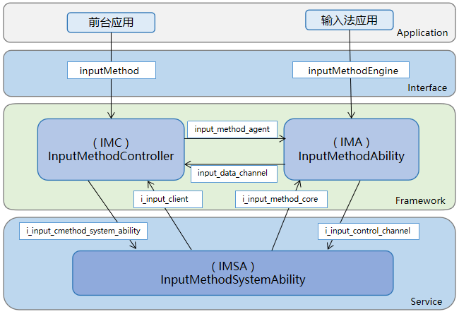

# IME Kit简介
<!--Kit: IME Kit-->
<!--Subsystem: MiscServices-->
<!--Owner: @illybyy-->
<!--Designer: @andeszhang-->
<!--Tester: @murphy1984-->
<!--Adviser: @zhang_yixin13-->

IME Kit 负责建立编辑框所在应用与输入法应用之间的通信通道，确保两者可以共同协作提供文本输入功能，也为系统应用提供管理输入法应用的能力。

## Kit使用场景

IME Kit提供输入法框架和输入法服务两类API。用于实现输入法应用，也可以用于实现自绘编辑框以及实现对输入法应用的控制。

## 框架原理

## 功能特点

- 输入法应用：

  支持创建固定态、悬浮态和状态栏三种类型的Panel，可支持开发一个输入法应用同时部署在手机、平板等多设备中。

- 自定义编辑框：

  支持开发者自定义编辑框，实现绑定输入法应用，并实现输入法应用的文字输入、删除、选中、光标移动等操作。

## 能力范围

- 提供输入法服务相关API，用于输入法应用，包括：创建软键盘窗口、插入/删除字符、选中文本、监听物理键盘按键事件等。

- 提供输入法框架相关API，可用于自绘编辑框，包括绑定输入法，实现输入、删除、选中、光标移动等。

- 提供系统应用管理输入法应用能力，实现对输入法应用的控制，包括显示/隐藏输入法软键盘、切换输入法、获取所有输入法列表。

## 与相关Kit的关系

ArkUI: IME Kit在输入法软键盘和自绘编辑框时使用ArkUI提供的部分组件、事件、动效、状态管理等能力，例如Text、Button组件，onClick点击事件。

## 约束限制

针对切换输入法应用的系统API，需要申请系统权限，部分API仅支持当前输入法应用调用。

## IME Kit API参考

- [inputMethodEngine](../reference/apis-ime-kit/js-apis-inputmethodengine.md)

- [inputMethod](../reference/apis-ime-kit/js-apis-inputmethod.md)

- [InputMethodExtensionAbility](../reference/apis-ime-kit/js-apis-inputmethod-extension-ability.md)

- [InputMethodExtensionContext](../reference/apis-ime-kit/js-apis-inputmethod-extension-context.md)

- [inputMethodList](../reference/apis-ime-kit/js-apis-inputmethodlist.md)

- [InputMethodSubtype](../reference/apis-ime-kit/js-apis-inputmethod-subtype.md)

- [inputMethod.Panel](../reference/apis-ime-kit/js-apis-inputmethod-panel.md)