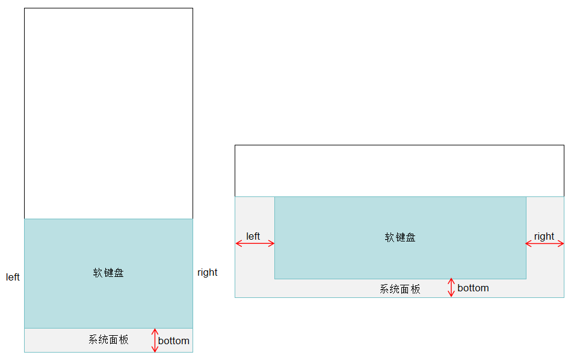
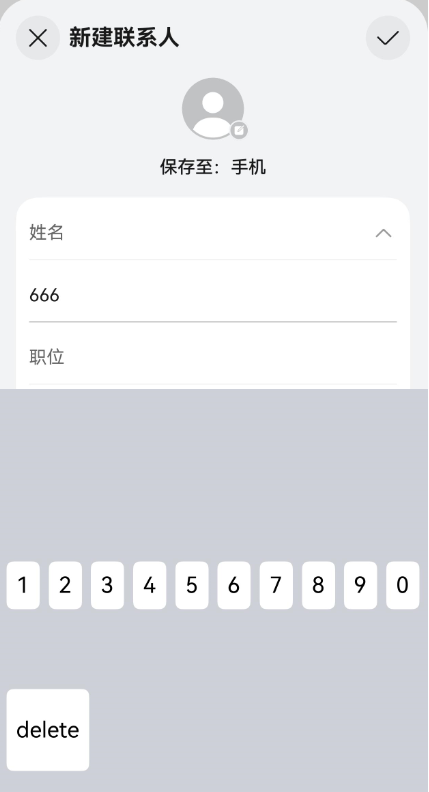

# 实现一个输入法应用
<!--Kit: IME Kit-->
<!--Subsystem: MiscServices-->
<!--Owner: @codexu62-->
<!--Designer: @andeszhang-->
<!--Tester: @murphy84-->
<!--Adviser: @zhang_yixin13-->

[InputMethodExtensionAbility](../reference/apis-ime-kit/js-apis-inputmethod-extension-ability.md)提供了onCreate()和onDestroy()生命周期回调，根据需要重写对应的回调方法。InputMethodExtensionAbility的生命周期如下：

- **onCreate()**

  服务被首次创建时触发该回调，开发者可以在此进行一些初始化的操作，例如注册公共事件监听等。

  > **说明：**
  >
  > 如果服务已创建，再次启动该InputMethodExtensionAbility不会触发onCreate()回调。

- **onDestroy()**

  当不再使用服务且准备将该实例销毁时，触发该回调。开发者可以在该回调中清理资源，如注销监听等。

## 开发步骤 

开发者在实现一个输入法应用时，需要在DevEco Studio工程中新建一个InputMethodExtensionAbility，具体步骤如下：

1. 在工程Module对应的ets目录下，右键选择“New > Directory”，新建一个目录，并命名为InputMethodExtensionAbility。

2. 在InputMethodExtensionAbility目录下，右键选择“New > File”，新建四个文件，分别为KeyboardController.ets、InputMethodService.ets、Index.ets以及KeyboardKeyData.ets。目录如下：

   ``` TypeScript
   /src/main/
   ├── ets/InputMethodExtensionAbility
   │       └──model/KeyboardController.ets      # 显示键盘
   │       └──InputMethodService.ets        # 自定义类继承InputMethodExtensionAbility并加上需要的生命周期回调
   │       └──pages
   │         └── Index.ets            # 绘制键盘，添加输入删除功能
   │         └── KeyboardKeyData.ets          # 键盘属性定义
   ├── resources/base/profile/main_pages.json  
   ```

## 文件介绍

1. InputMethodService.ets文件。

   在InputMethodService.ets文件中，增加导入InputMethodExtensionAbility的依赖包，自定义类继承InputMethodExtensionAbility并加上需要的生命周期回调。

   <!-- @[input_case_module_import_InputMethodExtensionAbility](https://gitcode.com/openharmony/applications_app_samples/blob/master/code/DocsSample/InputMethod/KikaInputMethod/entry/src/main/ets/InputMethodExtensionAbility/InputMethodService.ets) -->
   
   ``` TypeScript
   
   import { InputMethodExtensionAbility } from '@kit.IMEKit';
   import Log from '../model/Log';
   import { keyboardController } from '../InputMethodExtensionAbility/model/KeyboardController';
   import { Want } from '@kit.AbilityKit';
   
   const TAG: string = 'ServiceExtAbility->';
   
   export default class ServiceExtAbility extends InputMethodExtensionAbility {
     onCreate(want: Want): void {
       this.addLog(`onCreate want: ${want.abilityName}`);
       keyboardController.onCreate(this.context);
     }
   
     onDestroy(): void {
       this.addLog('onDestroy');
       keyboardController.onDestroy();
     }
   
     addLog(message: string): void {
       Log.showInfo(TAG, `kikaInput-new: ${message}`);
     }
   }
   ```


2. KeyboardController.ets文件。KeyboardController中除创建输入法窗口，设置输入法事件监听，实现文本插入、删除之外，还可以使用Panel对象的[getSystemPanelCurrentInsets](../reference/apis-ime-kit/js-apis-inputmethodengine.md#getsystempanelcurrentinsets21)获取输入法键盘与系统面板的偏移区域，输入法系统面板在不同设备上存在差异，当设备有系统面板时，输入法软键盘相对系统面板的偏移区域如图所示：

   

   <!-- @[input_case_input_KeyboardController358](https://gitcode.com/openharmony/applications_app_samples/blob/master/code/DocsSample/InputMethod/KikaInputMethod/entry/src/main/ets/InputMethodExtensionAbility/model/KeyboardController.ets) -->
   
   ``` TypeScript
   class KeyboardController {
     private barPosition: number = 0;
     private keyCodes: Array<number> = [];
     private mContext: InputMethodExtensionContext | undefined;
     private panel: inputMethodEngine.Panel | undefined;
     private isSpecialKeyPress: boolean = false;
     private isKeyboardShow: boolean = false;
     private inputHandle: InputHandler = InputHandler.getInstance();
     private mKeyboardDelegate: inputMethodEngine.KeyboardDelegate | undefined;
   
     constructor() {
       this.mContext = undefined;
       this.panel = undefined;
       this.mKeyboardDelegate = undefined;
     }
   
     public onCreate(context: InputMethodExtensionContext): void {
       this.mContext = context;
       this.inputHandle.addLog('onCreate');
       this.initWindow();
       this.registerListener();
     }
   
     public onDestroy(): void {
       this.inputHandle.addLog('onDestroy');
       this.unRegisterListener();
       this.destroyPanel();
     }
   
     private initWindow(): void {
       if (this.mContext === undefined) {
         return;
       }
       this.inputHandle.addLog('initWindow');
       let dis: display.Display | undefined = undefined;
       try {
         dis = display.getDefaultDisplaySync();
       } catch (err) {
         let error = err as BusinessError;
         Log.showError(TAG, `getDefaultDisplaySync catch error: ${error.code} ${error.message}`);
         return;
       }
       if (dis == undefined) {
         return;
       }
       this.inputHandle.addLog("initWindow-oncall display");
       let dWidth = dis.width;
       let dHeight = dis.height;
       let navigationBar_height = NAVIGATIONBAR_HEIGHT_DEFAULT;
       let keyHeightRate = KEYBOARD_HEIGHT_RATE_DEFAULT;
       AppStorage.setOrCreate('windowWidth', dis.width);
       AppStorage.setOrCreate('windowHeight', dis.height);
       let isLandscape = false;
       let isRkDevice = false;
       if (dis.width > dis.height) {
         isLandscape = true;
         AppStorage.setOrCreate('isLandscape', true);
       } else {
         AppStorage.setOrCreate('isLandscape', false);
       }
       if (dWidth === DEVICE_PHONE.width && dHeight === DEVICE_PHONE.height) {
         navigationBar_height = 0;
         keyHeightRate = KEYBOARD_HEIGHT_RATE_PHONE;
       } else if (dWidth === DEVICE_PHONE.height && dHeight === DEVICE_PHONE.width) {
         navigationBar_height = 0;
         keyHeightRate = KEYBOARD_HEIGHT_RATE_PHONE_LAND;
       } else if (dWidth === DEVICE_RK.width && dHeight === DEVICE_RK.height) {
         navigationBar_height = KEYBOARD_HEIGHT_RATE_DEFAULT;
         AppStorage.setOrCreate('isRkDevice', true);
         isRkDevice = true;
       } else if (dWidth === DEVICE_BIG.width && dHeight === DEVICE_BIG.height) {
         navigationBar_height = 0;
         keyHeightRate = KEYBOARD_HEIGHT_RATE_BIG_LAND;
       } else if (dWidth === DEVICE_BIG.height && dHeight === DEVICE_BIG.width) {
         navigationBar_height = 0;
         keyHeightRate = KEYBOARD_HEIGHT_RATE_BIG;
       }
       let keyHeight = dHeight * keyHeightRate;
       this.barPosition = dHeight - keyHeight - navigationBar_height;
       this.inputHandle.addLog(`initWindow-dWidth = ${dWidth};dHeight = ${dHeight};keyboard height = ${keyHeight};;navibar height = navigationBar_height`);
       this.inputHandle.addLog(`initWindow-deviceType = ${deviceInfo.deviceType}`);
       let panelInfo: inputMethodEngine.PanelInfo = {
         type: inputMethodEngine.PanelType.SOFT_KEYBOARD,
         flag: inputMethodEngine.PanelFlag.FLG_FIXED
       }
       let inputStyle = StyleConfiguration.getInputStyle(isLandscape, isRkDevice, deviceInfo.deviceType);
       AppStorage.setOrCreate('inputStyle', inputStyle);
       inputMethodAbility.createPanel(this.mContext, panelInfo).then((panel: inputMethodEngine.Panel) => {
         this.panel = panel;
         panel.resize(dWidth, keyHeight).then(() => {
           panel.setUiContent('InputMethodExtensionAbility/pages/Index').then(() => {
             this.inputHandle.addLog('loadContent finished');
           })
         }).catch((err: BusinessError) => {
           Log.showError(TAG, `Failed to setUiContent: ${err.code} ${err.message}`);
         });
       }).catch((err: BusinessError) => {
         Log.showError(TAG, `Failed to resize: ${err.code} ${err.message}`);
       });
     }
   
     private destroyPanel(): void {
       this.inputHandle.addLog('destroyPanel');
       if (this.panel) {
         inputMethodAbility.destroyPanel(this.panel).then(() => {
           this.inputHandle.addLog('Succeeded in destroyPanel.');
         }).catch((err: BusinessError) => {
           Log.showError(TAG, `Failed to destroyPanel: ${err.code} ${err.message}`);
         });
       }
     }
   
     private resizePanel(): void {
       this.inputHandle.addLog('resizeWindow');
       let dis: display.Display | undefined = undefined;
       try {
         dis = display.getDefaultDisplaySync();
       } catch (err) {
         let error = err as BusinessError;
         Log.showError(TAG, `getDefaultDisplaySync catch error: ${error.code} ${error.message}`);
         return;
       }
       if (dis == undefined) {
         return;
       }
       this.inputHandle.addLog('resizeWindow-oncall display');
       let dWidth = dis.width;
       let dHeight = dis.height;
       let keyHeightRate = KEYBOARD_HEIGHT_RATE_DEFAULT;
       AppStorage.setOrCreate<number>('windowWidth', dis.width);
       AppStorage.setOrCreate<number>('windowHeight', dis.height);
       let isLandscape = false;
       let isRkDevice = false;
       if (dis.width > dis.height) {
         isLandscape = true;
         AppStorage.setOrCreate('isLandscape', true);
       } else {
         AppStorage.setOrCreate('isLandscape', false);
       }
       if (dWidth === DEVICE_PHONE.width && dHeight === DEVICE_PHONE.height) {
         keyHeightRate = KEYBOARD_HEIGHT_RATE_PHONE;
       } else if (dWidth === DEVICE_PHONE.height && dHeight === DEVICE_PHONE.width) {
         keyHeightRate = KEYBOARD_HEIGHT_RATE_PHONE_LAND;
       } else if (dWidth === DEVICE_RK.width && dHeight === DEVICE_RK.height) {
         AppStorage.setOrCreate('isRkDevice', true);
         isRkDevice = true;
       } else if (dWidth === DEVICE_BIG.width && dHeight === DEVICE_BIG.height) {
         keyHeightRate = KEYBOARD_HEIGHT_RATE_BIG_LAND;
       } else if (dWidth === DEVICE_BIG.height && dHeight === DEVICE_BIG.width) {
         keyHeightRate = KEYBOARD_HEIGHT_RATE_BIG;
       }
       let keyHeight = dHeight * keyHeightRate;
       let inputStyle = StyleConfiguration.getInputStyle(isLandscape, isRkDevice, deviceInfo.deviceType);
       AppStorage.setOrCreate('inputStyle', inputStyle);
       if (this.panel) {
         this.panel.resize(dWidth, keyHeight).then(() => {
         }).catch((err: BusinessError) => {
           this.inputHandle.addLog(`resizePanel err = ${err.code} ${err.message}`);
         })
       }
     }
   ```
   
 
   <!-- @[input_case_input_KeyboardController507](https://gitcode.com/openharmony/applications_app_samples/blob/master/code/DocsSample/InputMethod/KikaInputMethod/entry/src/main/ets/InputMethodExtensionAbility/model/KeyboardController.ets) -->
   
   ``` TypeScript
   private registerListener(): void {
     this.inputHandle.addLog('registerListener');
     try {
       display.on('change', () => {
         this.inputHandle.addLog('screenChangeEvent');
         this.resizePanel();
       });
     } catch (err) {
       let error = err as BusinessError;
       Log.showError(TAG, `display on change catch error: ${error.code} ${error.message}`);
     }
     inputMethodAbility.on('inputStart',
       (kbController: inputMethodEngine.KeyboardController, textInputClient: inputMethodEngine.InputClient) => {
         this.inputHandle.addLog('keyboard inputStart');
         this.inputHandle.onInputStart(kbController, textInputClient);
       })
   
     // 设置监听子类型事件，改变输入法应用界面
     inputMethodAbility.on('setSubtype', (inputMethodSubtype: InputMethodSubtype) => {
       if (inputMethodSubtype.id === 'InputMethodExtAbility') {
         AppStorage.setOrCreate('subtypeChange', 0);
       }
       if (inputMethodSubtype.id === 'InputMethodExtAbility1') {
         AppStorage.setOrCreate('subtypeChange', 1);
       }
     });
   
     inputMethodAbility.on('inputStop', () => {
       this.inputHandle.addLog('keyboard inputStop');
       this.onDestroy();
       if (this.mContext) {
         this.mContext.destroy();
       }
     });
   
     this.inputHandle.addLog('pre on privateCommand');
     try {
       inputMethodAbility.on('privateCommand', (record: Record<string, inputMethodEngine.CommandDataType>) => {
         this.inputHandle.addLog(`keyboard privateCommand : ${record}`);
         Object.keys(record).forEach((key: string) => {
           this.inputHandle.addLog(`onPageShow private command key: ${key}, value: ${record[key]}`);
         })
       });
     } catch (err) {
       let error = err as BusinessError;
       this.inputHandle.addLog(`on privateCommand sendPrivateCommand catch error: ${error.code} ${error.message}`);
     }
   
     this.mKeyboardDelegate = inputMethodEngine.getKeyboardDelegate();
   
     this.mKeyboardDelegate.on('keyDown', (keyEvent: inputMethodEngine.KeyEvent) => {
       if (this.isKeyboardShow) {
         this.inputHandle.hideKeyboardSelf();
       }
       this.inputHandle.addLog(`keyDown: code = ${keyEvent.keyCode}`);
       let result = this.onKeyDown(keyEvent);
       this.inputHandle.addLog(`keyDown: result = ${result}`);
       return result;
     });
   
     this.mKeyboardDelegate.on('keyUp', (keyEvent: inputMethodEngine.KeyEvent) => {
       this.inputHandle.addLog(`keyUp: code = ${keyEvent.keyCode}`);
       let result = this.onKeyUp(keyEvent);
       this.inputHandle.addLog(`keyUp: result = ${result}`);
       return result;
     });
     this.mKeyboardDelegate.on('cursorContextChange', (x: number, y: number, height: number) => {
       let cursorInfo: CursorInfo = { x: x, y: y, height: height };
       this.inputHandle.setCursorInfo(cursorInfo);
     });
     if (isDebug) {
       this.mKeyboardDelegate.on('selectionChange',
         (oldBegin: number, oldEnd: number, newBegin: number, newEnd: number) => {
           this.inputHandle.setSelectInfo('selectInfo: from(' + oldBegin + ',' + oldEnd + ') to (' + newBegin + ',' +
             newEnd + ')');
         });
       this.mKeyboardDelegate.on('textChange', (text: string) => {
         this.inputHandle.setTextInfo('textInfo: ' + text);
       });
     }
   }
   ```
 

   <!-- @[input_case_input_KeyboardController587](https://gitcode.com/openharmony/applications_app_samples/blob/master/code/DocsSample/InputMethod/KikaInputMethod/entry/src/main/ets/InputMethodExtensionAbility/model/KeyboardController.ets) -->
   
   ``` TypeScript
     public isShiftKeyHold(): boolean {
       if (this.keyCodes.length === 0) {
         return false;
       }
       let preDownKey = this.keyCodes[0];
       return preDownKey === KeyCode.KEYCODE_SHIFT_LEFT || preDownKey === KeyCode.KEYCODE_SHIFT_RIGHT;
     }
   
     public onKeyDown(keyEvent: inputMethodEngine.KeyEvent): boolean {
       this.inputHandle.addLog('onKeyDown: code = ' + keyEvent.keyCode);
       let keyCode = keyEvent.keyCode;
       let idx = this.keyCodes.indexOf(keyCode);
       if (idx === -1) {
         this.keyCodes.push(keyCode);
       } else {
         this.inputHandle.addLog(`keyCode down is intercepted: ${keyCode}}`);
       }
       if (this.isShiftKeyHold() && this.keyCodes.length === 2 && !this.isKeyCodeAZ(keyCode)) {
         this.isSpecialKeyPress = true;
         return false;
       }
       if (this.isSpecialKeyPress || keyCode === KeyCode.KEYCODE_ALT_LEFT || keyCode === KeyCode.KEYCODE_ALT_RIGHT) {
         return false;
       }
       let keyValue: string = getHardKeyValue(keyCode, this.isShiftKeyHold());
       if (keyValue === '') {
         this.inputHandle.addLog('onKeyDown: unknown keyCode');
         this.isSpecialKeyPress = true;
         return false;
       }
       return this.inputHardKeyCode(keyValue, keyCode);
     }
   
     public onKeyUp(keyEvent: inputMethodEngine.KeyEvent): boolean {
       this.inputHandle.addLog('OnKeyUp: code = ' + keyEvent.keyCode);
       let keyCode = keyEvent.keyCode;
       let idx = this.keyCodes.indexOf(keyCode);
       if (idx !== -1) {
         this.keyCodes.splice(idx, 1);
       } else {
         this.inputHandle.addLog(`keyCode KeyUp is intercepted: ${keyCode}`);
       }
   
       // For KEYCODE_DEL/KEYCODE_FORWARD_DEL, processed in OnKeyDown, so just intercept it
       if (keyCode === 2055 || keyCode === 2071 || (keyCode >= 2012 && keyCode <= 2016)) {
         this.inputHandle.addLog(`special code: ${keyCode}`);
         return true;
       }
   
       if (this.isSpecialKeyPress) {
         let keyValue = getHardKeyValue(keyCode, this.isShiftKeyHold());
         if (!keyValue) {
           this.isSpecialKeyPress = true;
         }
         if (this.keyCodes.length === 0) {
           this.isSpecialKeyPress = false;
         }
         this.inputHandle.addLog(`OnKeyUp: this.isSpecialKeyPress: ${this.isSpecialKeyPress}`);
         return false;
       }
       return true;
     }
   
     public isKeyCodeAZ(keyCode: number): boolean {
       return keyCode >= KeyCode.KEYCODE_A && keyCode <= KeyCode.KEYCODE_Z;
     }
   
     public isKeyCodeNumber(keyCode: number): boolean {
       return (keyCode >= KeyCode.KEYCODE_0 && keyCode <= KeyCode.KEYCODE_9) ||
         (keyCode >= KeyCode.KEYCODE_NUMPAD_0 && keyCode <= KeyCode.KEYCODE_NUMPAD_9);
     }
   
     public inputHardKeyCode(keyValue: string, keyCode: number): boolean {
       this.inputHandle.addLog(`inputHardKeyCode keyValue is: ${keyValue}`);
       if (this.processFunctionKeys(keyValue)) {
         return true;
       }
       if (this.shiftKeys(keyValue)) {
         return false;
       }
       this.inputHandle.insertText(keyValue);
       return true;
     }
   
     public shiftKeys(keyValue: string): boolean {
       this.inputHandle.addLog(`shiftKeys keyValue is: ${keyValue}`);
       switch (keyValue) {
         case 'KEYCODE_SHIFT_LEFT':
         case 'KEYCODE_SHIFT_RIGHT':
           return true;
         default:
           return false;
       }
     }
   
     public processFunctionKeys(keyValue: string): boolean {
       this.inputHandle.addLog(`processFunctionKeys keyValue is: ${keyValue}`);
       switch (keyValue) {
         case "KEYCODE_DEL":
           this.inputHandle.deleteForward(1);
           return true;
         case "KEYCODE_FORWARD_DEL":
           this.inputHandle.deleteBackward(1);
           return true;
         case "KEYCODE_DPAD_UP":
           this.inputHandle.moveCursor(inputMethodEngine.Direction.CURSOR_UP);
           return true;
         case "KEYCODE_DPAD_DOWN":
           this.inputHandle.moveCursor(inputMethodEngine.Direction.CURSOR_DOWN);
           return true;
         case "KEYCODE_DPAD_LEFT":
           this.inputHandle.moveCursor(inputMethodEngine.Direction.CURSOR_LEFT);
           return true;
         case "KEYCODE_DPAD_RIGHT":
           this.inputHandle.moveCursor(inputMethodEngine.Direction.CURSOR_RIGHT);
           return true;
         default:
           return false;
       }
     }
   
     private unRegisterListener(): void {
       this.inputHandle.addLog('unRegisterListener');
   
       inputMethodAbility.off('inputStop', () => {
         this.inputHandle.addLog('inputStop off');
       });
       if (this.mKeyboardDelegate) {
         this.mKeyboardDelegate.off('keyDown');
         this.mKeyboardDelegate.off('keyUp');
         if (isDebug) {
           this.mKeyboardDelegate.off('cursorContextChange');
           this.mKeyboardDelegate.off('selectionChange');
           this.mKeyboardDelegate.off('textChange');
         }
       }
     }
   }
   
   export const keyboardController: KeyboardController = new KeyboardController();
   ```


 
3. KeyboardKeyData.ets文件。

   定义软键盘的按键显示内容。


   <!-- @[input_case_input_KeyboardKeyData016](https://gitcode.com/openharmony/applications_app_samples/blob/master/code/DocsSample/InputMethod/KikaInputMethod/entry/src/main/ets/model/KeyboardKeyData.ets) -->
   
   ``` TypeScript
   export interface keySourceListType {
     title: string,
     content: string,
     upperContent: string
   }
   
   export interface sourceListType {
     content: string
   }
   
   export enum MenuKey {
     NUMBER_KEY = '?123',
     NORMAL_KEY = 'ABC',
     SPECIAL_KEY = '=/\<'
   }
   
   export enum SubMenuType {
     NORMAL = 0,
     MENU = 1,
     EDIT = 2
   }
   
   export enum MenuType {
     NORMAL = 0,
     NUMBER = 1,
     SPECIAL = 2
   }
   
   export enum KeyState {
     LOWER_CASE = 0,
     ONCE_UPPER_CASE = 1,
     UPPER_CASE = 2
   }
   
   export let keySourceListData: keySourceListType[] = [
     {
       title: '1',
       content: 'q',
       upperContent: 'Q'
     },
     {
       title: '2',
       content: 'w',
       upperContent: 'W'
     },
     {
       title: '3',
       content: 'e',
       upperContent: 'E'
     },
     {
       title: '4',
       content: 'r',
       upperContent: 'R'
     },
     {
       title: '5',
       content: 't',
       upperContent: 'T'
     },
     {
       title: '6',
       content: 'y',
       upperContent: 'Y'
     },
     {
       title: '7',
       content: 'u',
       upperContent: 'U'
     },
     {
       title: '8',
       content: 'i',
       upperContent: 'I'
     },
     {
       title: '9',
       content: 'o',
       upperContent: 'O'
     },
     {
       title: '0',
       content: 'p',
       upperContent: 'P'
     },
     {
       title: String.fromCharCode(126),
       content: 'a',
       upperContent: 'A'
     },
     {
       title: String.fromCharCode(33),
       content: 's',
       upperContent: 'S'
     },
     {
       title: '@',
       content: 'd',
       upperContent: 'D'
     },
     {
       title: String.fromCharCode(35),
       content: 'f',
       upperContent: 'F'
     },
     {
       title: '%',
       content: 'g',
       upperContent: 'G'
     },
     {
       title: String.fromCharCode(39),
       content: 'h',
       upperContent: 'H'
     },
     {
       title: '&',
       content: 'j',
       upperContent: 'J'
     },
     {
       title: '*',
       content: 'k',
       upperContent: 'K'
     },
     {
       title: '?',
       content: 'l',
       upperContent: 'L'
     },
     {
       title: String.fromCharCode(72),
       content: 'z',
       upperContent: 'Z'
     },
     {
       title: String.fromCharCode(73),
       content: 'x',
       upperContent: 'X'
     },
     {
       title: String.fromCharCode(175),
       content: 'c',
       upperContent: 'C'
     },
     {
       title: String.fromCharCode(95),
       content: 'v',
       upperContent: 'V'
     },
     {
       title: String.fromCharCode(58),
       content: 'b',
       upperContent: 'B'
     },
     {
       title: String.fromCharCode(59),
       content: 'n',
       upperContent: 'N'
     },
     {
       title: String.fromCharCode(47),
       content: 'm',
       upperContent: 'M'
     }
   ]
   ```


   <!-- @[input_case_input_KeyboardKeyData186](https://gitcode.com/openharmony/applications_app_samples/blob/master/code/DocsSample/InputMethod/KikaInputMethod/entry/src/main/ets/model/KeyboardKeyData.ets) -->
   
   ``` TypeScript
   export let numberSourceListData: sourceListType[] = [
     {
       content: '1'
     },
     {
       content: '2'
     },
     {
       content: '3'
     },
     {
       content: '4'
     },
     {
       content: '5'
     },
     {
       content: '6'
     },
     {
       content: '7'
     },
     {
       content: '8'
     },
     {
       content: '9'
     },
     {
       content: '0'
     },
     {
       content: '@'
     },
     {
       content: '#'
     },
     {
       content: '$'
     },
     {
       content: '%'
     },
     {
       content: '&'
     },
     {
       content: '-'
     },
     {
       content: '+'
     },
     {
       content: '('
     },
     {
       content: ')'
     },
     {
       content: '/'
     },
     {
       content: '*'
     },
     {
       content: '"'
     },
     {
       content: "'"
     },
     {
       content: ':'
     },
     {
       content: ';'
     },
     {
       content: '!'
     },
     {
       content: '?'
     },
   
   ]
   
   export let symbolSourceListData: sourceListType[] = [
     {
       content: '~'
     },
     {
       content: '`'
     },
     {
       content: '|'
     },
     {
       content: '\u2022'
     },
     {
       content: '\u221A'
     },
     {
       content: '\u03A0'
     },
     {
       content: '\u00F7'
     },
     {
       content: '\u00D7'
     },
     {
       content: String.fromCharCode(182)
     },
     {
       content: '\u2206'
     },
     {
       content: String.fromCharCode(163)
     },
     {
       content: '\u20ac'
     },
     {
       content: String.fromCharCode(165)
     },
     {
       content: String.fromCharCode(162)
     },
     {
       content: String.fromCharCode(94)
     },
     {
       content: '\u00B0'
     },
     {
       content: '='
     },
     {
       content: String.fromCharCode(123)
     },
     {
       content: String.fromCharCode(125)
     },
     {
       content: String.fromCharCode(44)
     },
     {
       content: String.fromCharCode(92)
     },
     {
       content: String.fromCharCode(169)
     },
     {
       content: String.fromCharCode(174)
     },
     {
       content: '\u2122'
     },
     {
       content: '\u2105'
     },
     {
       content: '['
     },
     {
       content: ']'
     }
   ]
   ```
 
4. Index.ets文件。

   主要描绘了具体按键功能。如按下数字键，就会将数字内容在输入框中打印出来，按下删除键，就会将内容删除。

   <!--Del-->同时在resources/base/profile/main_pages.json文件的src字段中添加此文件路径。<!--DelEnd-->

   <!-- @[input_case_input_index](https://gitcode.com/openharmony/applications_app_samples/blob/master/code/DocsSample/InputMethod/KikaInputMethod/entry/src/main/ets/InputMethodExtensionAbility/pages/Index.ets) -->
   
   ``` TypeScript
   import { deviceInfo } from '@kit.BasicServicesKit';
   import Log from '../../model/Log';
   import { EditView } from '../../components/EditView';
   import { InputHandler } from '../model/KeyboardController';
   import {
     MenuType,
     SubMenuType,
   } from '../../model/KeyboardKeyData';
   import { KeyMenu } from '../../components/KeyMenu';
   import { NumberMenu } from '../../components/NumberMenu';
   import { StyleConfiguration, KeyStyle } from '../../common/StyleConfiguration';
   import { SymbolMenu } from '../../components/SymbolMenu';
   import { Submenu } from '../../components/Submenu';
   import { TopMenu } from '../../components/TopMenu';
   import { inputMethodEngine } from '@kit.IMEKit';
   
   
   const DEVICE_TYPE: string = deviceInfo.deviceType;
   const TAG: string = 'index->';
   
   @Entry
   @Component
   struct Index {
     @Provide menuType: number = MenuType.NORMAL;
     @StorageLink('inputPattern') @Watch('inputPatternChange') inputPattern: InputType = InputType.Normal
     @StorageLink('submenuType') submenuType: number = SubMenuType.NORMAL;
     @StorageLink('isLandscape') @Watch('change') isLandscape: boolean = false;
     @StorageLink('isRkDevice') isRkDevice: boolean = true;
     @StorageLink('inputStyle') inputStyle: KeyStyle = StyleConfiguration.getInputStyle(this.isLandscape, this.isRkDevice, DEVICE_TYPE);
     private panel: inputMethodEngine.Panel | undefined;
     @StorageLink('subtypeChange') subtypeChange: number = 0;
   
   
     aboutToAppear(): void {
       // 感知是否设置沉浸模式，如果是沉浸模式选择沉浸模式类型
       inputMethodEngine.getKeyboardDelegate().on("editorAttributeChanged", (attr : inputMethodEngine.EditorAttribute) => {
         console.info('recv editorAttributeChanged, immersiveMode: ', attr.immersiveMode);
         if (attr.immersiveMode == inputMethodEngine.ImmersiveMode.DARK_IMMERSIVE) {
           this.panel?.setImmersiveMode(inputMethodEngine.ImmersiveMode.DARK_IMMERSIVE);
           console.info('recv editorAttributeChanged, panel:', this.panel?.getImmersiveMode());
         }
       })
     }
   
     onBackPress(): boolean {
       Log.showInfo(TAG, 'kikaInput onBackPress');
       this.submenuType = SubMenuType.NORMAL;
       InputHandler.getInstance().hideKeyboardSelf();
       return true;
     }
   
     inputPatternChange(): void {
       if (this.inputPattern === InputType.Number || this.inputPattern === InputType.PhoneNumber) {
         this.menuType = MenuType.NUMBER;
       } else {
         this.menuType = MenuType.NORMAL;
       }
     }
   
     change(): void {
       AppStorage.set('inputStyle', StyleConfiguration.getInputStyle(this.isLandscape, this.isRkDevice, DEVICE_TYPE));
     }
   
   
   
     build() {
       Stack() {
         Column() {
           TopMenu()
           Column() {
             if (this.submenuType > SubMenuType.NORMAL) {
               if (this.submenuType === SubMenuType.MENU) {
                 Submenu()
               } else {
                 EditView();
               }
             } else {
               if (this.menuType === MenuType.NORMAL) {
                 if (this.subtypeChange == 0) {
                   KeyMenu()
                 } else {
                   NumberMenu()
                 }
               } else if (this.menuType === MenuType.NUMBER) {
                 NumberMenu()
               } else {
                 SymbolMenu()
               }
             }
           }
           .width('100%')
           .layoutWeight(1)
           .justifyContent(FlexAlign.Center)
           .backgroundColor('#D5D8DD')
         }
         .height('100%')
       }
       .height('100%')
       .backgroundColor(Color.White)
     }
   }
   ```

5. main_pages.json文件。对应ets/InputMethodExtensionAbility/pages/路径下键盘的绘制页面。

   ``` JSON
   {
     "src": [
       "InputMethodExtensionAbility/pages/Index"
     ]
   }
   ```

6. 在工程Module对应的[module.json5配置文件](../quick-start/module-configuration-file.md)中注册InputMethodExtensionAbility，type标签需要设置为“inputMethod”，srcEntry标签表示当前InputMethodExtensionAbility组件所对应的代码路径。


   <!-- @[input_case_entry_module_extensionAbilities](https://gitcode.com/openharmony/applications_app_samples/blob/master/code/DocsSample/InputMethod/KikaInputMethod/entry/src/main/module.json5) -->
   
   ``` JSON5
   "extensionAbilities": [
     {
       "srcEntry": "./ets/InputMethodExtensionAbility/InputMethodService.ets",
       "name": "InputMethodService",
       "label": "$string:MainAbility_label",
       "description": "$string:extension_ability_descriptor",
       "type": "inputMethod",
       "exported": true,
       "metadata": [
         {
           "name": "ohos.extension.input_method",
           "resource": "$profile:input_method_config"
         }
       ]
     }
   ],
   ```


## 约束与限制

为了降低InputMethodExtensionAbility能力被三方应用滥用的风险，现通过基础访问模式的功能约束对输入法应用进行安全管控。

> **说明：**
>
> 严格遵从基础访问模式的功能约束。在此模式下，开发者应仅提供基础打字功能，不应提供任何形式与网络交互相关的功能。系统会逐步增加基础访问模式的安全管控能力，包括但不限于：以独立进程和沙箱的方式运行Extension进程；禁止Extension进程创建子进程；进程间通信与网络访问等。因此未遵从此约定可能会导致功能异常。

## 相关实例

针对InputMethodExtensionAbility开发，有以下相关实例可供参考：

- [轻量级输入法](https://gitcode.com/openharmony/applications_app_samples/tree/master/code/Solutions/InputMethod/KikaInput)

## 示例效果图
