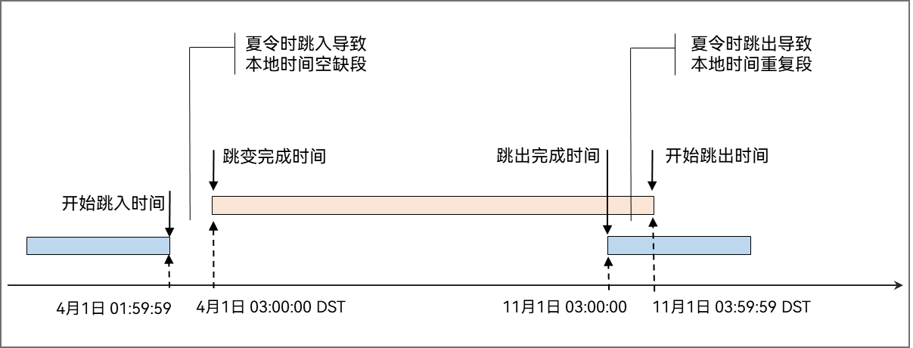

# 夏令时跳变


## 功能介绍

夏令时是一种为节约能源而规定的地方时间制度，即在天亮早的夏季人为将时间调快一段时间，使人们早起早睡，减少照明时间，从而节约照明用电。


## 实现原理

系统会配置夏令时跳变规则，当系统时间到达跳变点时，会自动实现跳变。如果应用通过标准的TS接口（例如 `Date()`）获取和显示时间，则到夏令时跳变时间点时，应用会同步显示夏令时时间。

**夏令时跳变规则如下：**

1. 计算一天的小时数。
   一整天的小时数在夏令时跳变的当天会发生变化，并非24小时。例如，在大多数国家，夏令时开始的当天，一整天时间为23小时；夏令时结束的当天，一整天时间为25小时。

   计算夏令时跳变前后挂钟时间之间相差的小时数，示例代码如下：
   ```ts
   import { i18n } from '@kit.LocalizationKit';

   let calendar: i18n.Calendar = i18n.getCalendar('zh-Hans');
   calendar.setTimeZone('Europe/London');
   calendar.set(2021, 2, 27, 16, 0, 0); // 夏令时开始前的时间
   let startTime: number = calendar.getTimeInMillis();
   calendar.set(2021, 2, 28, 16, 0, 0); // 处于夏令时期间的时间
   let finishTime: number = calendar.getTimeInMillis();
   let hours: number = (finishTime - startTime) / (3600 * 1000); // hours = 23
   ```

2. 存储和显示数据。
   按当地夏令时计时规则，存储和显示数据，需要处理夏令时跳变带来的时间空缺和重复。

   夏令时跳入将导致一段时间空缺，例如1:59:59跳转到3:00:00；夏令时跳出将导致一段时间重复，例如3:59:59回退到3:00:00。

   在夏令时内，本地时间显示建议添加夏令时标识。

   

3. 存储和传输时间数据。
   建议使用0时区标准时间（UTC或者GMT）存储和传输时间数据，避免夏令时跳变导致的信息丢失或异常。
