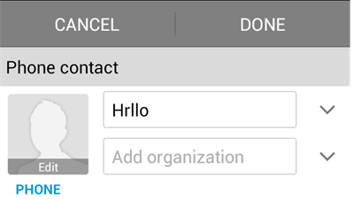

# 国际化界面设计

一套有效的国际化界面布局设计规则，既可以树立产品在国际化设计中产品调性，还可以保证操作的一致性，遵循以下设计规则可有效提升应用全球化质量。

## 界面空间预留与灵活布局

不同语言的译文长度存在较大差异，翻译可能造成界面文本长度增加。为了确保界面字符串翻译成其他语言后不被截断，最佳做法是使用灵活的动态布局，即UI控件根据文本内容长度动态调整，重新排版。若无法保证灵活布局，则应预留足够的文本空间。以英文为基础，相对于原始英语字符串，翻译需要预留的空间参考如表1。

**表1** 界面预留空间参考表

| 英文字符数量（个） | 预留的空间比率 | 
| -------- | -------- |
| 小于等于10 | 100%～200% | 
| 大于等于11，小于等于20 | 80%~100% | 
| 大于等于21，小于等于30 | 60%~80% | 
| 大于等于31，小于等于50 | 40%~60% | 
| 大于等于51，小于等于70 | 30%~40% | 
| 大于等于71 | 30% | 

## 界面镜像

不同国家对文本对齐方式和读取顺序有所不同，例如英语采用从左到右的顺序，阿拉伯语和希腊语则采用从右到左（RTL）的顺序。为了使界面显示的内容符合当地用户语言习惯，需确保UI元素布局支持界面镜像，如图1和图2。UI元素界面镜像的设计要点如下：

- 用户界面 (UI)布局镜像。用户界面排列允许从右到左的内容按其原始布局显示，满足双向市场体验。如"ABC"，按照从左到右的顺序应显示"ABC"，按照从右向左的顺序应显示为“CBA”。

- UI元素镜像。带有方向性的UI元素控件和图标，遵循镜像规则。如图3、图4、图5。某些图标没有方向性或者与现实中的物体相关，不需要镜像，例如时钟表盘。

- 触控与操作。界面各元素触控或操作符合从右至左的阅读顺序。例如，对于多页签，一般情况下往左划表示往后，而在RTL语言下，往右划表示往后。

- 支持混合文本。文本方向支持可实现出色的混合文本呈现（双向版本中有英语文本，反之亦然）。

**图1** 一般布局示例（英文）

**图2** 镜像布局示例（阿拉伯文）

**图3** 一般图标资源

**图4** RTL语言系统下提供的图标资源

**图5** RTL语言下提供的镜像控件

