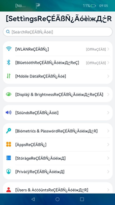

# 翻译伪本地化测试


## 使用场景

翻译伪本地化测试主要是模拟在翻译应用时可导致出现界面、布局或者文字显示异常等问题。

出现文字截断或界面显示问题的主要原因是：对于软件的菜单、文字区域、按键、复选框等，设计者在做界面设计时通常先调整出适于源语言文字长度的大小（通常为英文），并进一步调整界面的对齐、位置、行距等。然而，一些源语言被翻译后，长度往往会增加，使得UI布局出现异常或导致文本在不合适的位置截断。例如俄文或是挪威文通常比英文长，如果原始UI界面预留的空间过小，会导致超出界面的文字被裁剪，最终无法正常显示完整的翻译后的文字。

文字或符号无法正常显示的可能原因是：系统缺少相应字体或排版整形能力；开发过程中未考虑用户会输入特殊字符或特定语言的文字。例如中文界面的应用，可能输入维吾尔语的相关信息后无法显示。


## 测试流程

1. 切换到伪本地化测试区域，如“en-XA”。
   通过代码切换的方法（需要系统应用权限）：
   ```ts
   import { i18n } from '@kit.LocalizationKit';
   i18n.System.setSystemLanguage('en-XA')
   ```

2. 遍历需要测试的APP。


## 测试事项



1. 检查界面截断、变形或布局异常等问题。其中，界面截断可通过观察界面字符串是否以“]”正确结尾，看不到“]”说明界面字符串未完整显示。

2. 检查硬编码问题。如果界面需要翻译的文字未处理为伪翻译格式，说明代码中存在对界面文字的硬编码。

3. 检查字符串拼接问题。如果存在连续的伪翻译格式字符串出现在同一个控件里，例如“[字符串1][字符串2]”，说明存在字符串拼接。

4. 检查多语言文字显示问题。如果伪翻译文字未能正常显示，出现类似方块、空缺或文字显示不完整等现象，说明多语言显示存在异常。
