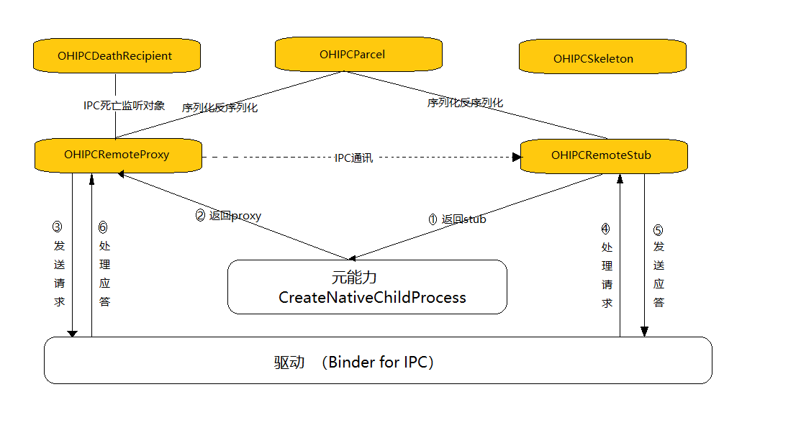

# IPC通信开发指导（C/C++）


## 场景介绍

IPC的主要工作是让运行在不同进程的Proxy和Stub互相通信，而IPC CAPI是提供的C接口。
IPC CAPI接口不直接提供跨进程通信能力，两个进程之间的IPC通道建立，依赖于[Ability Kit](../application-models/abilitykit-overview.md)。



进程间IPC通道建立，详情参考[Native子进程开发指导（C/C++)](../application-models/capi_nativechildprocess_development_guideline.md)，本文重点阐述IPC CAPI部分使用说明。

## 接口说明

**表1** CAPI侧IPC接口

| 接口名                               | 描述                                                             |
| ------------------------------------ | ---------------------------------------------------------------- |
|typedef int (\*OH_OnRemoteRequestCallback)<br>(uint32_t code, const OHIPCParcel \*data, OHIPCParcel \*reply,<br> void \*userData);|Stub端用于处理远端数据请求的回调函数。|
| OHIPCRemoteStub\* OH_IPCRemoteStub_Create<br>(const char \*descriptor, OH_OnRemoteRequestCallback requestCallback,<br>OH_OnRemoteDestroyCallback destroyCallback, void \*userData); | 创建OHIPCRemoteStub对象。 |
|int OH_IPCRemoteProxy_SendRequest(const OHIPCRemoteProxy \*proxy,<br> uint32_t code, const OHIPCParcel \*data, OHIPCParcel \*reply,<br> const OH_IPC_MessageOption \*option);|IPC消息发送函数。|
|struct OHIPCRemoteProxy;|OHIPCRemoteProxy对象，用于向远端发送请求。<br>需要依赖**元能力**接口返回。|
|OHIPCDeathRecipient\* OH_IPCDeathRecipient_Create<br>(OH_OnDeathRecipientCallback deathRecipientCallback,<br> OH_OnDeathRecipientDestroyCallback destroyCallback,<br>void \*userData);|创建远端OHIPCRemoteStub对象死亡通知对象OHIPCDeathRecipient。|
|int OH_IPCRemoteProxy_AddDeathRecipient(OHIPCRemoteProxy \*proxy,<br>OHIPCDeathRecipient \*recipient);|向OHIPCRemoteProxy对象添加死亡监听，<br>用于接收远端OHIPCRemoteStub对象死亡的回调通知。|

详细的接口说明请参考[IPCKit](../reference/apis-ipc-kit/_i_p_c_kit.md)。


## 开发步骤

以下步骤描述了如何使用[IPCKit](../reference/apis-ipc-kit/_i_p_c_kit.md)提供的CAPI接口，创建远端Stub和使用客户端代理Proxy进行通信，同时兼备远端死亡通知接收能力。

### 1. 添加动态链接库

CMakeLists.txt中添加以下lib。

```txt
# ipc capi
libipc_capi.so
# 元能力，ability capi
libchild_process.so
```

### 2. 头文件

```c++
// ipc capi
#include <IPCKit/ipc_kit.h>
// 元能力，ability capi
#include <AbilityKit/native_child_process.h>
```

### 3. 异步调用场景
#### 3.1 公共数据及函数定义

```c++
#include <string>
#include <thread>
#include <mutex>
#include <chrono>
#include <condition_variable>
#include <IPCKit/ipc_kit.h>
#include <AbilityKit/native_child_process.h>
#include <hilog/log.h>
#undef LOG_DOMAIN
#undef LOG_TAG
#define LOG_DOMAIN 0x0201
#define LOG_TAG "IPCCApiSample"

enum RequestCode {
    ASYNC_ADD_CODE = 1,
    REQUEST_EXIT_CODE = 2,
    OTHER_CODE
};
static constexpr int MAX_MEMORY_SIZE = 204800;
static const std::string INTERFACE_DESCRIPTOR = "INTERFACE_DESCRIPTOR";
static const std::string NATIVE_REMOTE_STUB_TEST_TOKEN = "native.remote.stub";
static const std::string NATIVE_REMOTE_STUB_ASYNC_CALL_TEST_TOKEN = "native.remote.stub.async.call";

// 定义内存分配函数
static void* LocalMemoryAllocator(int32_t len) {
    if (len < 0 || len > MAX_MEMORY_SIZE ) {
        return nullptr;
    }
    void *buffer = malloc(len);
    if (buffer == nullptr) {
        return nullptr;
    }
    memset(buffer, 0, len);
    return buffer;
}
```
#### 3.2 服务端对象: IpcCApiStubTest

```c++
class IpcCApiStubTest {
public:
    explicit IpcCApiStubTest();
    ~IpcCApiStubTest();
    void MainProc();
    OHIPCRemoteStub* GetRemoteStub();
    static int OnRemoteRequest(uint32_t code, const OHIPCParcel *data, OHIPCParcel *reply, void *userData);
private:
    int AsyncAdd(const OHIPCParcel *data);
    int RequestExitChildProcess();
private:
    OHIPCRemoteStub *stub_{ nullptr };
    std::mutex childMutex_;
    std::condition_variable childCondVar_;
};

IpcCApiStubTest::IpcCApiStubTest() {
    stub_ = OH_IPCRemoteStub_Create(INTERFACE_DESCRIPTOR.c_str(), &IpcCApiStubTest::OnRemoteRequest,
        nullptr, this);
}

IpcCApiStubTest::~IpcCApiStubTest() {
    if (stub_ != nullptr) {
        OH_IPCRemoteStub_Destroy(stub_);
    }
}

void IpcCApiStubTest::MainProc() {
    std::unique_lock<std::mutex> autoLock(childMutex_);
    childCondVar_.wait(autoLock);
}

OHIPCRemoteStub* IpcCApiStubTest::GetRemoteStub() {
    return stub_;
}

int IpcCApiStubTest::OnRemoteRequest(uint32_t code, const OHIPCParcel *data, OHIPCParcel *reply, void *userData) {
    int readLen = 0;
    char *token = nullptr;
    // 接口校验
    if (OH_IPCParcel_ReadInterfaceToken(data, &token, &readLen, LocalMemoryAllocator) != OH_IPC_SUCCESS
        || NATIVE_REMOTE_STUB_TEST_TOKEN != token) {
        if (token != nullptr) {
            OH_LOG_ERROR(LOG_APP, "check InterfaceToken failed");
            free(token);
        }
        return OH_IPC_PARCEL_WRITE_ERROR;
    }
    free(token);
    auto *stubTest = reinterpret_cast<IpcCApiStubTest *>(userData);
    if (stubTest == nullptr) {
        return OH_IPC_CHECK_PARAM_ERROR;
    }
    auto rqCode = RequestCode(code);
    switch (rqCode) {
        case ASYNC_ADD_CODE: {
            return stubTest->AsyncAdd(data);
        }
        case REQUEST_EXIT_CODE: {
            return stubTest->RequestExitChildProcess();
        }
        default:
            break;
    }
    return OH_IPC_SUCCESS;
}

int IpcCApiStubTest::AsyncAdd(const OHIPCParcel *data) {
    int a = 0;
    int b = 0;
    OH_LOG_INFO(LOG_APP, "start async add a=%d,b=%d", a, b);
    if ((OH_IPCParcel_ReadInt32(data, &a) != OH_IPC_SUCCESS)
        || (OH_IPCParcel_ReadInt32(data, &b) != OH_IPC_SUCCESS)) {
        return OH_IPC_PARCEL_READ_ERROR;
    }
    auto proxyCallBack = OH_IPCParcel_ReadRemoteProxy(data);
    if (proxyCallBack == nullptr) {
        return OH_IPC_PARCEL_READ_ERROR;
    }
    OH_LOG_INFO(LOG_APP, "start create sendCallBack thread!");
    // 此处开启线程异步完成功能实现并利用proxyCallBack完成结果响应，如果同步调用，则直接通过replyData写入响应结果即可
    std::thread th([proxyCallBack, a, b] {
        auto data = OH_IPCParcel_Create();
        if (data == nullptr) {
            OH_IPCRemoteProxy_Destroy(proxyCallBack);
            return;
        }
        auto reply = OH_IPCParcel_Create();
        if (reply == nullptr) {
            OH_IPCParcel_Destroy(data);
            OH_IPCRemoteProxy_Destroy(proxyCallBack);
            return;
        }
        if (OH_IPCParcel_WriteInt32(data, a + b) != OH_IPC_SUCCESS) {
            OH_IPCParcel_Destroy(data);
            OH_IPCParcel_Destroy(reply);
            OH_IPCRemoteProxy_Destroy(proxyCallBack);
            return;
        }
        // 异步线程处理结果通过IPC同步调用方式返回给业务请求方
        OH_IPC_MessageOption option = { OH_IPC_REQUEST_MODE_SYNC, 0 };
        OH_LOG_INFO(LOG_APP, "thread start sendCallBack!");
        int ret = OH_IPCRemoteProxy_SendRequest(proxyCallBack, ASYNC_ADD_CODE, data, reply, &option);
        OH_LOG_INFO(LOG_APP, "thread sendCallBack ret = %d", ret);
        if (ret != OH_IPC_SUCCESS) {
            OH_IPCParcel_Destroy(data);
            OH_IPCParcel_Destroy(reply);
            OH_IPCRemoteProxy_Destroy(proxyCallBack);
            return;
        }
        OH_IPCRemoteProxy_Destroy(proxyCallBack);
        OH_IPCParcel_Destroy(data);
        OH_IPCParcel_Destroy(reply);
    });
    th.detach();
    return OH_IPC_SUCCESS;
}

int IpcCApiStubTest::RequestExitChildProcess() {
    std::unique_lock<std::mutex> autoLock(childMutex_);
    childCondVar_.notify_all();
    return OH_IPC_SUCCESS;
}
```

#### 3.3 客户端代理对象: IpcCApiProxyTest

```cpp
// 用戶自定义错误码
static constexpr int OH_IPC_CREATE_OBJECT_ERROR = OH_IPC_USER_ERROR_CODE_MIN + 1;

class IpcCApiProxyTest {
public:
    explicit IpcCApiProxyTest(OHIPCRemoteProxy *proxy);
    ~IpcCApiProxyTest();
public:
    int AsyncAdd(int a, int b, int &result);
    int RequestExitChildProcess();
    void ClearResource();
private:
    void SendAsyncReply(int &replyValue);
    int WaitForAsyncReply(int timeOut);
    static int OnRemoteRequest(uint32_t code, const OHIPCParcel *data,
        OHIPCParcel *reply, void *userData);
    static void OnDeathRecipientCB(void *userData);
private:
    int asyncReply_{};
    std::mutex mutex_;
    std::condition_variable cv_;
    OHIPCRemoteProxy *proxy_{ nullptr };
    OHIPCRemoteStub *replyStub_{ nullptr };
    OHIPCDeathRecipient *deathRecipient_{ nullptr };
};

IpcCApiProxyTest::IpcCApiProxyTest(OHIPCRemoteProxy *proxy) {
    if (proxy == nullptr) {
        OH_LOG_ERROR(LOG_APP, "proxy is nullptr");
        return;
    }
    proxy_ = proxy;
    replyStub_ = OH_IPCRemoteStub_Create(NATIVE_REMOTE_STUB_ASYNC_CALL_TEST_TOKEN.c_str(), OnRemoteRequest,
        nullptr, this);
    if (replyStub_ == nullptr) {
        OH_LOG_ERROR(LOG_APP, "crete reply stub failed!");
        return;
    }
    deathRecipient_ = OH_IPCDeathRecipient_Create(OnDeathRecipientCB, nullptr, this);
    if (deathRecipient_ == nullptr) {
        OH_LOG_ERROR(LOG_APP, "OH_IPCDeathRecipient_Create failed!");
        return;
    }
    OH_IPCRemoteProxy_AddDeathRecipient(proxy_, deathRecipient_);
}

IpcCApiProxyTest::~IpcCApiProxyTest() {
    if (proxy_ != nullptr) {
        OH_IPCRemoteProxy_Destroy(proxy_);
    }
    if (deathRecipient_ != nullptr) {
        OH_IPCDeathRecipient_Destroy(deathRecipient_);
    }
    if (replyStub_ != nullptr) {
        OH_IPCRemoteStub_Destroy(replyStub_);
    }
}

int IpcCApiProxyTest::AsyncAdd(int a, int b, int &result) {
    OH_LOG_INFO(LOG_APP, "start %d + %d", a, b);
    auto data = OH_IPCParcel_Create();
    if (data == nullptr) {
        return OH_IPC_CREATE_OBJECT_ERROR;
    }
    // 写入接口校验token
    if (OH_IPCParcel_WriteInterfaceToken(data, NATIVE_REMOTE_STUB_TEST_TOKEN.c_str()) != OH_IPC_SUCCESS) {
        OH_LOG_ERROR(LOG_APP, "OH_IPCParcel_WriteInterfaceToken failed!");
        OH_IPCParcel_Destroy(data);
        return OH_IPC_PARCEL_WRITE_ERROR;
    }
    if (OH_IPCParcel_WriteInt32(data, a) != OH_IPC_SUCCESS
        || OH_IPCParcel_WriteInt32(data, b) != OH_IPC_SUCCESS
        || OH_IPCParcel_WriteRemoteStub(data, replyStub_) != OH_IPC_SUCCESS) {
        OH_IPCParcel_Destroy(data);
        return OH_IPC_PARCEL_WRITE_ERROR;
    }
    // 异步发送使用replyStub_进行响应结果接收，异步处理需要写入用于接收结果的OHIPCRemoteStub对象
    OH_IPC_MessageOption option = { OH_IPC_REQUEST_MODE_ASYNC, 0 };
    int ret = OH_IPCRemoteProxy_SendRequest(proxy_, RequestCode::ASYNC_ADD_CODE, data, nullptr, &option);
    if (ret != OH_IPC_SUCCESS) {
        OH_IPCParcel_Destroy(data);
        OH_LOG_ERROR(LOG_APP, "OH_IPCRemoteProxy_SendRequest failed!");
        return ret;
    }
    static constexpr int TIMEOUT = 3;
    WaitForAsyncReply(TIMEOUT);
    OH_LOG_INFO(LOG_APP, "asyncReply_:%d", asyncReply_);
    result = asyncReply_;
    OH_IPCParcel_Destroy(data);
    OH_IPCParcel_Destroy(reply);
    return OH_IPC_SUCCESS;
}

int IpcCApiProxyTest::RequestExitChildProcess() {
    auto data = OH_IPCParcel_Create();
    if (data == nullptr) {
        return OH_IPC_CREATE_OBJECT_ERROR;
    }
    auto reply = OH_IPCParcel_Create();
    if (reply == nullptr) {
        OH_IPCParcel_Destroy(data);
        return OH_IPC_CREATE_OBJECT_ERROR;
    }
    if (OH_IPCParcel_WriteInterfaceToken(data, NATIVE_REMOTE_STUB_TEST_TOKEN.c_str()) != OH_IPC_SUCCESS) {
        OH_LOG_ERROR(LOG_APP, "OH_IPCParcel_WriteInterfaceToken failed!");
        OH_IPCParcel_Destroy(data);
        OH_IPCParcel_Destroy(reply);
        return OH_IPC_PARCEL_WRITE_ERROR;
    }
    OH_IPC_MessageOption option = { OH_IPC_REQUEST_MODE_SYNC, 0 };
    int ret = OH_IPCRemoteProxy_SendRequest(proxy_, RequestCode::REQUEST_EXIT_CODE, data, reply, &option);
    if (ret != OH_IPC_SUCCESS) {
        OH_IPCParcel_Destroy(data);
        OH_IPCParcel_Destroy(reply);
        OH_LOG_ERROR(LOG_APP, "OH_IPCRemoteProxy_SendRequest failed!");
        return ret;
    }
    OH_IPCParcel_Destroy(data);
    OH_IPCParcel_Destroy(reply);
    return OH_IPC_SUCCESS;
}

void IpcCApiProxyTest::SendAsyncReply(int &replyValue) {
    std::unique_lock<std::mutex> lck(mutex_);
    asyncReply_ = replyValue;
    cv_.notify_all();
}

int IpcCApiProxyTest::WaitForAsyncReply(int timeOut) {
    asyncReply_ = 0;
    std::unique_lock<std::mutex> lck(mutex_);
    cv_.wait_for(lck, std::chrono::seconds(timeOut), [&] {
        return asyncReply_ != 0;
    });
    return asyncReply_;
}

int IpcCApiProxyTest::OnRemoteRequest(uint32_t code, const OHIPCParcel *data,
        OHIPCParcel *reply, void *userData) {
    OH_LOG_INFO(LOG_APP, "start %u", code);
    auto *proxyTest = reinterpret_cast<IpcCApiProxyTest *>(userData);
    if (proxyTest == nullptr || code != static_cast<uint32_t>(RequestCode::ASYNC_ADD_CODE)) {
        OH_LOG_ERROR(LOG_APP, "check param failed!");
        return OH_IPC_CHECK_PARAM_ERROR;
    }
    int32_t val = -1;
    if (OH_IPCParcel_ReadInt32(data, &val) != OH_IPC_SUCCESS) {
        OH_LOG_ERROR(LOG_APP, "OH_IPCParcel_ReadInt32 failed!");
        return OH_IPC_PARCEL_READ_ERROR;
    }
    proxyTest->SendAsyncReply(val);
    return OH_IPC_SUCCESS;
}

void IpcCApiProxyTest::ClearResource() {
    // clear resource;
}

void IpcCApiProxyTest::OnDeathRecipientCB(void *userData) {
    auto *proxyTest = reinterpret_cast<IpcCApiProxyTest *>(userData);
    if (proxyTest != nullptr) {
        proxyTest->ClearResource();
    }
    OH_LOG_INFO(LOG_APP, "the stub is dead!");
}
```
#### 3.4 服务端调用入口，服务端文件"libipcCapiDemo.so"

```C++
IpcCApiStubTest g_ipcStubObj;

#ifdef __cplusplus
extern "C" {

// 服务需要实现如下函数，具体可参考元能力接口说明
OHIPCRemoteStub* NativeChildProcess_OnConnect() {
    OH_LOG_INFO(LOG_APP, "NativeChildProcess_OnConnect");
    return g_ipcStubObj.GetRemoteStub();
}

void NativeChildProcess_MainProc() {
    OH_LOG_INFO(LOG_APP, "NativeChildProcess_MainProc");
    g_ipcStubObj.MainProc();
    OH_LOG_INFO(LOG_APP, "NativeChildProcess_MainProc End");
}

}
#endif
```

#### 3.5 客户端调用入口

```c++
IpcCApiProxyTest *g_ipcProxy = nullptr;

// 元能力打通IPC通道回调接口
void OnNativeChildProcessStarted(int errCode, OHIPCRemoteProxy *remoteProxy) {
    OH_LOG_INFO(LOG_APP, "OnNativeChildProcessStarted proxy=%{public}p err=%{public}d", remoteProxy, errCode);
    if (remoteProxy == nullptr) {
        return;
    }
    g_ipcProxy = new (std::nothrow) IpcCApiProxyTest(remoteProxy);
    if (g_ipcProxy == nullptr) {
        OH_IPCRemoteProxy_Destroy(remoteProxy);
        OH_LOG_ERROR(LOG_APP, "Alloc IpcCApiProxyTest object failed");
        return;
    }
}

int main(int argc, char *argv[]) {
    int32_t ret = OH_Ability_CreateNativeChildProcess("libipcCapiDemo.so", OnNativeChildProcessStarted);
    if (ret != 0) {
        return -1;        
    }
    if (g_ipcProxy == nullptr) {
        return -1;        
    }
    int a = 2;
    int b = 3;
    int result = 0;    
    ret = g_ipcProxy->AsyncAdd(a, b, result);
    OH_LOG_INFO(LOG_APP, "AsyncAdd: %d + %d = %d, ret=%d", a, b, result, ret);

    //kill stub端
    ret = g_ipcProxy->RequestExitChildProcess();
    //控制台输出： the stub is dead!
    if (g_ipcProxy != nullptr) {
        delete g_ipcProxy;
        g_ipcProxy = nullptr;
    }
    return 0;
}
```

