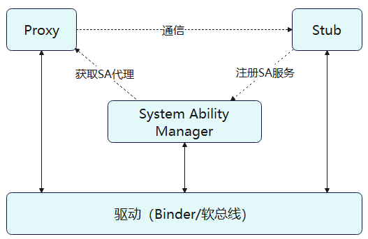

# IPC Kit简介

## 基本概念

IPC：设备内的进程间通信（Inter-Process Communication） 
RPC：设备间的进程间通信（Remote Procedure Call） 
IPC/RPC用于实现跨进程通信，不同的是前者使用Binder驱动，用于设备内的跨进程通信，后者使用软总线驱动，用于跨设备跨进程通信。需要跨进程通信的原因是因为每个进程都有自己独立的资源和内存空间，其他进程不能随意访问不同进程的内存和资源，IPC/RPC便是为了突破这一点。

> **说明：**
>
>- 使用IPC&RPC跨进程通信时，需要先调用元能力的连接服务接口获取到proxy对象。以下为IPC与RPC的典型使用场景：
>
>- IPC典型使用场景在后台服务，应用的后台服务通过IPC机制提供跨进程的服务调用能力。
>
>- RPC典型使用场景在<!--Del-->[<!--DelEnd-->多端协同<!--Del-->](../application-models/hop-multi-device-collaboration.md)<!--DelEnd-->，多端协同通过RPC机制提供远端接口调用与数据传递能力。

## 实现原理

> **说明：**
>
>- Client：请求服务的一端，被称为客户端
>
>- Server：提供服务的一端，被称为服务端
>
>- 在IPC Kit中也经常用Proxy表示服务请求方（客户端-Client），Stub表示服务提供方（服务端-Server），后续文档中对Proxy和Stub不再做过多描述。

IPC和RPC通常采用客户端-服务端（Client-Server）模型，在使用时，请求Client端进程可获取Server端所在进程的代理（Proxy），并通过此代理读写数据来实现进程间的数据通信，更具体的讲，首先客户端会建立一个服务端的代理对象，这个代理对象具备和服务端一样的功能，若想访问服务端中的某一个方法，只需访问代理对象中对应的方法即可，代理对象会将请求发送给服务端；然后服务端处理接受到的请求，处理完之后通过驱动返回处理结果给代理对象；最后代理对象将请求结果进一步返回给客户端。

如下图所示：
    通常，Stub会先注册系统能力（System Ability）到系统能力管理者（System Ability Manager，缩写SAMgr）中，SAMgr负责管理这些SA并向Client提供相关的接口。Client要和某个具体的SA通信，必须先从SAMgr中获取该SA的代理Proxy对象，然后使用代理Proxy对象和SA通信。在整个通信过程中，如果使用的是IPC通信，则依赖的是Binder驱动，使用的是RPC通信，则依赖的是软总线驱动。

## 约束与限制

- 单个设备上跨进程通信时，传输的数据量最大约为1MB，过大的数据量请使用[匿名共享内存](../reference/apis-ipc-kit/js-apis-rpc.md#ashmem8)。

- 不支持在RPC中订阅匿名Stub对象（没有向SAMgr注册Stub对象）的[死亡通知](subscribe-remote-state.md)。

- 不支持把跨设备的Proxy对象传递回该Proxy对象所指向的Stub对象所在的设备，即指向远端设备Stub的Proxy对象不能在本设备内进行二次跨进程传递。