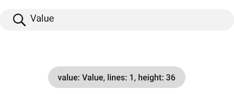

# textarea<a name="ZH-CN_TOPIC_0000001163932208"></a>

多行文本输入的文本框。

## 权限列表<a name="zh-cn_topic_0000001173324595_section11257113618419"></a>

无

## 子组件<a name="zh-cn_topic_0000001173324595_section9288143101012"></a>

不支持。

## 属性<a name="zh-cn_topic_0000001173324595_section2907183951110"></a>

除支持[通用属性](js-components-common-attributes.md)外，还支持如下属性：

<a name="zh-cn_topic_0000001173324595_table20633101642315"></a>
<table><thead align="left"><tr id="zh-cn_topic_0000001173324595_row663331618238"><th class="cellrowborder" valign="top" width="23.119999999999997%" id="mcps1.1.6.1.1"><p id="zh-cn_topic_0000001173324595_aa872998ac2d84843a3c5161889afffef"><a name="zh-cn_topic_0000001173324595_aa872998ac2d84843a3c5161889afffef"></a><a name="zh-cn_topic_0000001173324595_aa872998ac2d84843a3c5161889afffef"></a>名称</p>
</th>
<th class="cellrowborder" valign="top" width="23.119999999999997%" id="mcps1.1.6.1.2"><p id="zh-cn_topic_0000001173324595_ab2111648ee0e4f6d881be8954e7acaab"><a name="zh-cn_topic_0000001173324595_ab2111648ee0e4f6d881be8954e7acaab"></a><a name="zh-cn_topic_0000001173324595_ab2111648ee0e4f6d881be8954e7acaab"></a>类型</p>
</th>
<th class="cellrowborder" valign="top" width="10.48%" id="mcps1.1.6.1.3"><p id="zh-cn_topic_0000001173324595_ab377d1c90900478ea4ecab51e9a058af"><a name="zh-cn_topic_0000001173324595_ab377d1c90900478ea4ecab51e9a058af"></a><a name="zh-cn_topic_0000001173324595_ab377d1c90900478ea4ecab51e9a058af"></a>默认值</p>
</th>
<th class="cellrowborder" valign="top" width="7.5200000000000005%" id="mcps1.1.6.1.4"><p id="zh-cn_topic_0000001173324595_p824610360217"><a name="zh-cn_topic_0000001173324595_p824610360217"></a><a name="zh-cn_topic_0000001173324595_p824610360217"></a>必填</p>
</th>
<th class="cellrowborder" valign="top" width="35.76%" id="mcps1.1.6.1.5"><p id="zh-cn_topic_0000001173324595_a1d574a0044ed42ec8a2603bc82734232"><a name="zh-cn_topic_0000001173324595_a1d574a0044ed42ec8a2603bc82734232"></a><a name="zh-cn_topic_0000001173324595_a1d574a0044ed42ec8a2603bc82734232"></a>描述</p>
</th>
</tr>
</thead>
<tbody><tr id="zh-cn_topic_0000001173324595_row207976211241"><td class="cellrowborder" valign="top" width="23.119999999999997%" headers="mcps1.1.6.1.1 "><p id="zh-cn_topic_0000001173324595_p1172110226415"><a name="zh-cn_topic_0000001173324595_p1172110226415"></a><a name="zh-cn_topic_0000001173324595_p1172110226415"></a>placeholder</p>
</td>
<td class="cellrowborder" valign="top" width="23.119999999999997%" headers="mcps1.1.6.1.2 "><p id="zh-cn_topic_0000001173324595_p1572111221649"><a name="zh-cn_topic_0000001173324595_p1572111221649"></a><a name="zh-cn_topic_0000001173324595_p1572111221649"></a>string</p>
</td>
<td class="cellrowborder" valign="top" width="10.48%" headers="mcps1.1.6.1.3 "><p id="zh-cn_topic_0000001173324595_p1072112229411"><a name="zh-cn_topic_0000001173324595_p1072112229411"></a><a name="zh-cn_topic_0000001173324595_p1072112229411"></a>-</p>
</td>
<td class="cellrowborder" valign="top" width="7.5200000000000005%" headers="mcps1.1.6.1.4 "><p id="zh-cn_topic_0000001173324595_p197218228415"><a name="zh-cn_topic_0000001173324595_p197218228415"></a><a name="zh-cn_topic_0000001173324595_p197218228415"></a>否</p>
</td>
<td class="cellrowborder" valign="top" width="35.76%" headers="mcps1.1.6.1.5 "><p id="zh-cn_topic_0000001173324595_p1372114227414"><a name="zh-cn_topic_0000001173324595_p1372114227414"></a><a name="zh-cn_topic_0000001173324595_p1372114227414"></a>多行文本框的提示文本内容。</p>
</td>
</tr>
<tr id="zh-cn_topic_0000001173324595_row57972211740"><td class="cellrowborder" valign="top" width="23.119999999999997%" headers="mcps1.1.6.1.1 "><p id="zh-cn_topic_0000001173324595_p18721522047"><a name="zh-cn_topic_0000001173324595_p18721522047"></a><a name="zh-cn_topic_0000001173324595_p18721522047"></a>maxlength</p>
</td>
<td class="cellrowborder" valign="top" width="23.119999999999997%" headers="mcps1.1.6.1.2 "><p id="zh-cn_topic_0000001173324595_p127225224413"><a name="zh-cn_topic_0000001173324595_p127225224413"></a><a name="zh-cn_topic_0000001173324595_p127225224413"></a>number</p>
</td>
<td class="cellrowborder" valign="top" width="10.48%" headers="mcps1.1.6.1.3 "><p id="zh-cn_topic_0000001173324595_p19722172217410"><a name="zh-cn_topic_0000001173324595_p19722172217410"></a><a name="zh-cn_topic_0000001173324595_p19722172217410"></a>-</p>
</td>
<td class="cellrowborder" valign="top" width="7.5200000000000005%" headers="mcps1.1.6.1.4 "><p id="zh-cn_topic_0000001173324595_p27223221745"><a name="zh-cn_topic_0000001173324595_p27223221745"></a><a name="zh-cn_topic_0000001173324595_p27223221745"></a>否</p>
</td>
<td class="cellrowborder" valign="top" width="35.76%" headers="mcps1.1.6.1.5 "><p id="zh-cn_topic_0000001173324595_p1872218223415"><a name="zh-cn_topic_0000001173324595_p1872218223415"></a><a name="zh-cn_topic_0000001173324595_p1872218223415"></a>多行文本框可输入的最多字符数量。</p>
</td>
</tr>
<tr id="zh-cn_topic_0000001173324595_row41157171546"><td class="cellrowborder" valign="top" width="23.119999999999997%" headers="mcps1.1.6.1.1 "><p id="zh-cn_topic_0000001173324595_p1972216221247"><a name="zh-cn_topic_0000001173324595_p1972216221247"></a><a name="zh-cn_topic_0000001173324595_p1972216221247"></a>headericon</p>
</td>
<td class="cellrowborder" valign="top" width="23.119999999999997%" headers="mcps1.1.6.1.2 "><p id="zh-cn_topic_0000001173324595_p177229221041"><a name="zh-cn_topic_0000001173324595_p177229221041"></a><a name="zh-cn_topic_0000001173324595_p177229221041"></a>string</p>
</td>
<td class="cellrowborder" valign="top" width="10.48%" headers="mcps1.1.6.1.3 "><p id="zh-cn_topic_0000001173324595_p15722132218415"><a name="zh-cn_topic_0000001173324595_p15722132218415"></a><a name="zh-cn_topic_0000001173324595_p15722132218415"></a>-</p>
</td>
<td class="cellrowborder" valign="top" width="7.5200000000000005%" headers="mcps1.1.6.1.4 "><p id="zh-cn_topic_0000001173324595_p27221122445"><a name="zh-cn_topic_0000001173324595_p27221122445"></a><a name="zh-cn_topic_0000001173324595_p27221122445"></a>否</p>
</td>
<td class="cellrowborder" valign="top" width="35.76%" headers="mcps1.1.6.1.5 "><p id="zh-cn_topic_0000001173324595_p172213223414"><a name="zh-cn_topic_0000001173324595_p172213223414"></a><a name="zh-cn_topic_0000001173324595_p172213223414"></a>在文本输入前的图标展示，该图标不支持点击事件，图标格式为jpg，png和svg。</p>
</td>
</tr>
<tr id="zh-cn_topic_0000001173324595_row1416414649"><td class="cellrowborder" valign="top" width="23.119999999999997%" headers="mcps1.1.6.1.1 "><p id="zh-cn_topic_0000001173324595_p5722162213413"><a name="zh-cn_topic_0000001173324595_p5722162213413"></a><a name="zh-cn_topic_0000001173324595_p5722162213413"></a>extend</p>
</td>
<td class="cellrowborder" valign="top" width="23.119999999999997%" headers="mcps1.1.6.1.2 "><p id="zh-cn_topic_0000001173324595_p47221221447"><a name="zh-cn_topic_0000001173324595_p47221221447"></a><a name="zh-cn_topic_0000001173324595_p47221221447"></a>boolean</p>
</td>
<td class="cellrowborder" valign="top" width="10.48%" headers="mcps1.1.6.1.3 "><p id="zh-cn_topic_0000001173324595_p15722172212412"><a name="zh-cn_topic_0000001173324595_p15722172212412"></a><a name="zh-cn_topic_0000001173324595_p15722172212412"></a>false</p>
</td>
<td class="cellrowborder" valign="top" width="7.5200000000000005%" headers="mcps1.1.6.1.4 "><p id="zh-cn_topic_0000001173324595_p1172212221745"><a name="zh-cn_topic_0000001173324595_p1172212221745"></a><a name="zh-cn_topic_0000001173324595_p1172212221745"></a>否</p>
</td>
<td class="cellrowborder" valign="top" width="35.76%" headers="mcps1.1.6.1.5 "><p id="zh-cn_topic_0000001173324595_p1872232213411"><a name="zh-cn_topic_0000001173324595_p1872232213411"></a><a name="zh-cn_topic_0000001173324595_p1872232213411"></a>文本框是否支持可扩展，设置可扩展属性后文本框高度可以跟随文字自适应。</p>
</td>
</tr>
<tr id="zh-cn_topic_0000001173324595_row1273032304111"><td class="cellrowborder" valign="top" width="23.119999999999997%" headers="mcps1.1.6.1.1 "><p id="zh-cn_topic_0000001173324595_p1073002304114"><a name="zh-cn_topic_0000001173324595_p1073002304114"></a><a name="zh-cn_topic_0000001173324595_p1073002304114"></a>value<sup id="zh-cn_topic_0000001173324595_sup5397930164210"><a name="zh-cn_topic_0000001173324595_sup5397930164210"></a><a name="zh-cn_topic_0000001173324595_sup5397930164210"></a><span>5+</span></sup></p>
</td>
<td class="cellrowborder" valign="top" width="23.119999999999997%" headers="mcps1.1.6.1.2 "><p id="zh-cn_topic_0000001173324595_p37316238419"><a name="zh-cn_topic_0000001173324595_p37316238419"></a><a name="zh-cn_topic_0000001173324595_p37316238419"></a>string</p>
</td>
<td class="cellrowborder" valign="top" width="10.48%" headers="mcps1.1.6.1.3 "><p id="zh-cn_topic_0000001173324595_p773116239412"><a name="zh-cn_topic_0000001173324595_p773116239412"></a><a name="zh-cn_topic_0000001173324595_p773116239412"></a>-</p>
</td>
<td class="cellrowborder" valign="top" width="7.5200000000000005%" headers="mcps1.1.6.1.4 "><p id="zh-cn_topic_0000001173324595_p1473162314411"><a name="zh-cn_topic_0000001173324595_p1473162314411"></a><a name="zh-cn_topic_0000001173324595_p1473162314411"></a>否</p>
</td>
<td class="cellrowborder" valign="top" width="35.76%" headers="mcps1.1.6.1.5 "><p id="zh-cn_topic_0000001173324595_p20731162310415"><a name="zh-cn_topic_0000001173324595_p20731162310415"></a><a name="zh-cn_topic_0000001173324595_p20731162310415"></a>多行文本框的内容。</p>
</td>
</tr>
<tr id="zh-cn_topic_0000001173324595_row8191717132813"><td class="cellrowborder" valign="top" width="23.119999999999997%" headers="mcps1.1.6.1.1 "><p id="zh-cn_topic_0000001173324595_p7201317102812"><a name="zh-cn_topic_0000001173324595_p7201317102812"></a><a name="zh-cn_topic_0000001173324595_p7201317102812"></a>showcounter<sup id="zh-cn_topic_0000001173324595_sup10332204922918"><a name="zh-cn_topic_0000001173324595_sup10332204922918"></a><a name="zh-cn_topic_0000001173324595_sup10332204922918"></a><span>5+</span></sup></p>
</td>
<td class="cellrowborder" valign="top" width="23.119999999999997%" headers="mcps1.1.6.1.2 "><p id="zh-cn_topic_0000001173324595_p920141732817"><a name="zh-cn_topic_0000001173324595_p920141732817"></a><a name="zh-cn_topic_0000001173324595_p920141732817"></a>boolean</p>
</td>
<td class="cellrowborder" valign="top" width="10.48%" headers="mcps1.1.6.1.3 "><p id="zh-cn_topic_0000001173324595_p15201317132812"><a name="zh-cn_topic_0000001173324595_p15201317132812"></a><a name="zh-cn_topic_0000001173324595_p15201317132812"></a>false</p>
</td>
<td class="cellrowborder" valign="top" width="7.5200000000000005%" headers="mcps1.1.6.1.4 "><p id="zh-cn_topic_0000001173324595_p11201317192811"><a name="zh-cn_topic_0000001173324595_p11201317192811"></a><a name="zh-cn_topic_0000001173324595_p11201317192811"></a>否</p>
</td>
<td class="cellrowborder" valign="top" width="35.76%" headers="mcps1.1.6.1.5 "><p id="zh-cn_topic_0000001173324595_p72081718281"><a name="zh-cn_topic_0000001173324595_p72081718281"></a><a name="zh-cn_topic_0000001173324595_p72081718281"></a>文本框是否需要开启计数下标功能，需要配合maxlength一起使用。</p>
</td>
</tr>
<tr id="zh-cn_topic_0000001173324595_row1765514319572"><td class="cellrowborder" valign="top" width="23.119999999999997%" headers="mcps1.1.6.1.1 "><p id="zh-cn_topic_0000001173324595_p177221571244"><a name="zh-cn_topic_0000001173324595_p177221571244"></a><a name="zh-cn_topic_0000001173324595_p177221571244"></a>menuoptions<sup id="zh-cn_topic_0000001173324595_sup154944401542"><a name="zh-cn_topic_0000001173324595_sup154944401542"></a><a name="zh-cn_topic_0000001173324595_sup154944401542"></a>5+</sup></p>
</td>
<td class="cellrowborder" valign="top" width="23.119999999999997%" headers="mcps1.1.6.1.2 "><p id="zh-cn_topic_0000001173324595_p8722157248"><a name="zh-cn_topic_0000001173324595_p8722157248"></a><a name="zh-cn_topic_0000001173324595_p8722157248"></a>Array&lt;<a href="#zh-cn_topic_0000001173324595_table83621954963">MenuOption</a>&gt;</p>
</td>
<td class="cellrowborder" valign="top" width="10.48%" headers="mcps1.1.6.1.3 "><p id="zh-cn_topic_0000001173324595_p167221878414"><a name="zh-cn_topic_0000001173324595_p167221878414"></a><a name="zh-cn_topic_0000001173324595_p167221878414"></a>-</p>
</td>
<td class="cellrowborder" valign="top" width="7.5200000000000005%" headers="mcps1.1.6.1.4 "><p id="zh-cn_topic_0000001173324595_p197227713411"><a name="zh-cn_topic_0000001173324595_p197227713411"></a><a name="zh-cn_topic_0000001173324595_p197227713411"></a>否</p>
</td>
<td class="cellrowborder" valign="top" width="35.76%" headers="mcps1.1.6.1.5 "><p id="zh-cn_topic_0000001173324595_p207221573417"><a name="zh-cn_topic_0000001173324595_p207221573417"></a><a name="zh-cn_topic_0000001173324595_p207221573417"></a>设置文本选择弹框点击更多按钮之后显示的菜单项。</p>
</td>
</tr>
<tr id="zh-cn_topic_0000001173324595_row198351301534"><td class="cellrowborder" valign="top" width="23.119999999999997%" headers="mcps1.1.6.1.1 "><p id="zh-cn_topic_0000001173324595_p95550281483"><a name="zh-cn_topic_0000001173324595_p95550281483"></a><a name="zh-cn_topic_0000001173324595_p95550281483"></a>autofocus<sup id="zh-cn_topic_0000001173324595_sup1775142235010"><a name="zh-cn_topic_0000001173324595_sup1775142235010"></a><a name="zh-cn_topic_0000001173324595_sup1775142235010"></a><span>6+</span></sup></p>
</td>
<td class="cellrowborder" valign="top" width="23.119999999999997%" headers="mcps1.1.6.1.2 "><p id="zh-cn_topic_0000001173324595_p1955511286485"><a name="zh-cn_topic_0000001173324595_p1955511286485"></a><a name="zh-cn_topic_0000001173324595_p1955511286485"></a>boolean</p>
</td>
<td class="cellrowborder" valign="top" width="10.48%" headers="mcps1.1.6.1.3 "><p id="zh-cn_topic_0000001173324595_p6555192874812"><a name="zh-cn_topic_0000001173324595_p6555192874812"></a><a name="zh-cn_topic_0000001173324595_p6555192874812"></a>false</p>
</td>
<td class="cellrowborder" valign="top" width="7.5200000000000005%" headers="mcps1.1.6.1.4 "><p id="zh-cn_topic_0000001173324595_p3555142844817"><a name="zh-cn_topic_0000001173324595_p3555142844817"></a><a name="zh-cn_topic_0000001173324595_p3555142844817"></a>否</p>
</td>
<td class="cellrowborder" valign="top" width="35.76%" headers="mcps1.1.6.1.5 "><p id="zh-cn_topic_0000001173324595_p135551628184820"><a name="zh-cn_topic_0000001173324595_p135551628184820"></a><a name="zh-cn_topic_0000001173324595_p135551628184820"></a>是否自动获焦。</p>
</td>
</tr>
<tr id="zh-cn_topic_0000001173324595_row1066516375317"><td class="cellrowborder" valign="top" width="23.119999999999997%" headers="mcps1.1.6.1.1 "><p id="zh-cn_topic_0000001173324595_p16196311485"><a name="zh-cn_topic_0000001173324595_p16196311485"></a><a name="zh-cn_topic_0000001173324595_p16196311485"></a>selectedstart<sup id="zh-cn_topic_0000001173324595_sup151911922125019"><a name="zh-cn_topic_0000001173324595_sup151911922125019"></a><a name="zh-cn_topic_0000001173324595_sup151911922125019"></a><span>6+</span></sup></p>
</td>
<td class="cellrowborder" valign="top" width="23.119999999999997%" headers="mcps1.1.6.1.2 "><p id="zh-cn_topic_0000001173324595_p126191631104819"><a name="zh-cn_topic_0000001173324595_p126191631104819"></a><a name="zh-cn_topic_0000001173324595_p126191631104819"></a>number</p>
</td>
<td class="cellrowborder" valign="top" width="10.48%" headers="mcps1.1.6.1.3 "><p id="zh-cn_topic_0000001173324595_p7619163110489"><a name="zh-cn_topic_0000001173324595_p7619163110489"></a><a name="zh-cn_topic_0000001173324595_p7619163110489"></a>-1</p>
</td>
<td class="cellrowborder" valign="top" width="7.5200000000000005%" headers="mcps1.1.6.1.4 "><p id="zh-cn_topic_0000001173324595_p1619123120488"><a name="zh-cn_topic_0000001173324595_p1619123120488"></a><a name="zh-cn_topic_0000001173324595_p1619123120488"></a>否</p>
</td>
<td class="cellrowborder" valign="top" width="35.76%" headers="mcps1.1.6.1.5 "><p id="zh-cn_topic_0000001173324595_p9619113118488"><a name="zh-cn_topic_0000001173324595_p9619113118488"></a><a name="zh-cn_topic_0000001173324595_p9619113118488"></a>开始选择文本时初始选择位置。</p>
</td>
</tr>
<tr id="zh-cn_topic_0000001173324595_row81412785317"><td class="cellrowborder" valign="top" width="23.119999999999997%" headers="mcps1.1.6.1.1 "><p id="zh-cn_topic_0000001173324595_p42301334184813"><a name="zh-cn_topic_0000001173324595_p42301334184813"></a><a name="zh-cn_topic_0000001173324595_p42301334184813"></a>selectedend<sup id="zh-cn_topic_0000001173324595_sup759182155017"><a name="zh-cn_topic_0000001173324595_sup759182155017"></a><a name="zh-cn_topic_0000001173324595_sup759182155017"></a><span>6+</span></sup></p>
</td>
<td class="cellrowborder" valign="top" width="23.119999999999997%" headers="mcps1.1.6.1.2 "><p id="zh-cn_topic_0000001173324595_p1523013444810"><a name="zh-cn_topic_0000001173324595_p1523013444810"></a><a name="zh-cn_topic_0000001173324595_p1523013444810"></a>number</p>
</td>
<td class="cellrowborder" valign="top" width="10.48%" headers="mcps1.1.6.1.3 "><p id="zh-cn_topic_0000001173324595_p1823053404815"><a name="zh-cn_topic_0000001173324595_p1823053404815"></a><a name="zh-cn_topic_0000001173324595_p1823053404815"></a>-1</p>
</td>
<td class="cellrowborder" valign="top" width="7.5200000000000005%" headers="mcps1.1.6.1.4 "><p id="zh-cn_topic_0000001173324595_p162301434104819"><a name="zh-cn_topic_0000001173324595_p162301434104819"></a><a name="zh-cn_topic_0000001173324595_p162301434104819"></a>否</p>
</td>
<td class="cellrowborder" valign="top" width="35.76%" headers="mcps1.1.6.1.5 "><p id="zh-cn_topic_0000001173324595_p2023014344489"><a name="zh-cn_topic_0000001173324595_p2023014344489"></a><a name="zh-cn_topic_0000001173324595_p2023014344489"></a>开始选择文本时结尾选择位置。</p>
</td>
</tr>
<tr id="zh-cn_topic_0000001173324595_row15650913537"><td class="cellrowborder" valign="top" width="23.119999999999997%" headers="mcps1.1.6.1.1 "><p id="zh-cn_topic_0000001173324595_p11428837134811"><a name="zh-cn_topic_0000001173324595_p11428837134811"></a><a name="zh-cn_topic_0000001173324595_p11428837134811"></a>softkeyboardenabled<sup id="zh-cn_topic_0000001173324595_sup135541120205017"><a name="zh-cn_topic_0000001173324595_sup135541120205017"></a><a name="zh-cn_topic_0000001173324595_sup135541120205017"></a><span>6+</span></sup></p>
</td>
<td class="cellrowborder" valign="top" width="23.119999999999997%" headers="mcps1.1.6.1.2 "><p id="zh-cn_topic_0000001173324595_p18428837114816"><a name="zh-cn_topic_0000001173324595_p18428837114816"></a><a name="zh-cn_topic_0000001173324595_p18428837114816"></a>boolean</p>
</td>
<td class="cellrowborder" valign="top" width="10.48%" headers="mcps1.1.6.1.3 "><p id="zh-cn_topic_0000001173324595_p124281037144812"><a name="zh-cn_topic_0000001173324595_p124281037144812"></a><a name="zh-cn_topic_0000001173324595_p124281037144812"></a>true</p>
</td>
<td class="cellrowborder" valign="top" width="7.5200000000000005%" headers="mcps1.1.6.1.4 "><p id="zh-cn_topic_0000001173324595_p842823714486"><a name="zh-cn_topic_0000001173324595_p842823714486"></a><a name="zh-cn_topic_0000001173324595_p842823714486"></a>否</p>
</td>
<td class="cellrowborder" valign="top" width="35.76%" headers="mcps1.1.6.1.5 "><p id="zh-cn_topic_0000001173324595_p1642873734813"><a name="zh-cn_topic_0000001173324595_p1642873734813"></a><a name="zh-cn_topic_0000001173324595_p1642873734813"></a>编辑时是否弹出系统软键盘。</p>
</td>
</tr>
</tbody>
</table>

**表 1**  MenuOption<sup>5+</sup>

<a name="zh-cn_topic_0000001173324595_table83621954963"></a>
<table><thead align="left"><tr id="zh-cn_topic_0000001173324595_row536212545619"><th class="cellrowborder" valign="top" width="33.33333333333333%" id="mcps1.2.4.1.1"><p id="zh-cn_topic_0000001173324595_p143621541967"><a name="zh-cn_topic_0000001173324595_p143621541967"></a><a name="zh-cn_topic_0000001173324595_p143621541967"></a>名称</p>
</th>
<th class="cellrowborder" valign="top" width="33.33333333333333%" id="mcps1.2.4.1.2"><p id="zh-cn_topic_0000001173324595_p936215541620"><a name="zh-cn_topic_0000001173324595_p936215541620"></a><a name="zh-cn_topic_0000001173324595_p936215541620"></a>类型</p>
</th>
<th class="cellrowborder" valign="top" width="33.33333333333333%" id="mcps1.2.4.1.3"><p id="zh-cn_topic_0000001173324595_p23626541665"><a name="zh-cn_topic_0000001173324595_p23626541665"></a><a name="zh-cn_topic_0000001173324595_p23626541665"></a>描述</p>
</th>
</tr>
</thead>
<tbody><tr id="zh-cn_topic_0000001173324595_row5362254461"><td class="cellrowborder" valign="top" width="33.33333333333333%" headers="mcps1.2.4.1.1 "><p id="zh-cn_topic_0000001173324595_p33631541265"><a name="zh-cn_topic_0000001173324595_p33631541265"></a><a name="zh-cn_topic_0000001173324595_p33631541265"></a>icon</p>
</td>
<td class="cellrowborder" valign="top" width="33.33333333333333%" headers="mcps1.2.4.1.2 "><p id="zh-cn_topic_0000001173324595_p536311543619"><a name="zh-cn_topic_0000001173324595_p536311543619"></a><a name="zh-cn_topic_0000001173324595_p536311543619"></a>string</p>
</td>
<td class="cellrowborder" valign="top" width="33.33333333333333%" headers="mcps1.2.4.1.3 "><p id="zh-cn_topic_0000001173324595_p73631954762"><a name="zh-cn_topic_0000001173324595_p73631954762"></a><a name="zh-cn_topic_0000001173324595_p73631954762"></a>菜单选项中的图标路径。</p>
</td>
</tr>
<tr id="zh-cn_topic_0000001173324595_row136319547613"><td class="cellrowborder" valign="top" width="33.33333333333333%" headers="mcps1.2.4.1.1 "><p id="zh-cn_topic_0000001173324595_p12363654367"><a name="zh-cn_topic_0000001173324595_p12363654367"></a><a name="zh-cn_topic_0000001173324595_p12363654367"></a>content</p>
</td>
<td class="cellrowborder" valign="top" width="33.33333333333333%" headers="mcps1.2.4.1.2 "><p id="zh-cn_topic_0000001173324595_p1936312549617"><a name="zh-cn_topic_0000001173324595_p1936312549617"></a><a name="zh-cn_topic_0000001173324595_p1936312549617"></a>string</p>
</td>
<td class="cellrowborder" valign="top" width="33.33333333333333%" headers="mcps1.2.4.1.3 "><p id="zh-cn_topic_0000001173324595_p1036311548616"><a name="zh-cn_topic_0000001173324595_p1036311548616"></a><a name="zh-cn_topic_0000001173324595_p1036311548616"></a>菜单选项中的文本内容。</p>
</td>
</tr>
</tbody>
</table>

## 样式<a name="zh-cn_topic_0000001173324595_section182794053"></a>

除支持[通用样式](js-components-common-styles.md)外，还支持如下样式：

<a name="zh-cn_topic_0000001173324595_table14588121079"></a>
<table><thead align="left"><tr id="zh-cn_topic_0000001173324595_row3588182975"><th class="cellrowborder" valign="top" width="23.11768823117688%" id="mcps1.1.6.1.1"><p id="zh-cn_topic_0000001173324595_p2588112873"><a name="zh-cn_topic_0000001173324595_p2588112873"></a><a name="zh-cn_topic_0000001173324595_p2588112873"></a>名称</p>
</th>
<th class="cellrowborder" valign="top" width="14.1985801419858%" id="mcps1.1.6.1.2"><p id="zh-cn_topic_0000001173324595_p18588321876"><a name="zh-cn_topic_0000001173324595_p18588321876"></a><a name="zh-cn_topic_0000001173324595_p18588321876"></a>类型</p>
</th>
<th class="cellrowborder" valign="top" width="20.247975202479754%" id="mcps1.1.6.1.3"><p id="zh-cn_topic_0000001173324595_p1588132673"><a name="zh-cn_topic_0000001173324595_p1588132673"></a><a name="zh-cn_topic_0000001173324595_p1588132673"></a>默认值</p>
</th>
<th class="cellrowborder" valign="top" width="5.23947605239476%" id="mcps1.1.6.1.4"><p id="zh-cn_topic_0000001173324595_p3588192276"><a name="zh-cn_topic_0000001173324595_p3588192276"></a><a name="zh-cn_topic_0000001173324595_p3588192276"></a>必填</p>
</th>
<th class="cellrowborder" valign="top" width="37.1962803719628%" id="mcps1.1.6.1.5"><p id="zh-cn_topic_0000001173324595_p55881121575"><a name="zh-cn_topic_0000001173324595_p55881121575"></a><a name="zh-cn_topic_0000001173324595_p55881121575"></a>描述</p>
</th>
</tr>
</thead>
<tbody><tr id="zh-cn_topic_0000001173324595_row45881726713"><td class="cellrowborder" valign="top" width="23.11768823117688%" headers="mcps1.1.6.1.1 "><p id="zh-cn_topic_0000001173324595_p1588182874"><a name="zh-cn_topic_0000001173324595_p1588182874"></a><a name="zh-cn_topic_0000001173324595_p1588182874"></a>color</p>
</td>
<td class="cellrowborder" valign="top" width="14.1985801419858%" headers="mcps1.1.6.1.2 "><p id="zh-cn_topic_0000001173324595_p8588725714"><a name="zh-cn_topic_0000001173324595_p8588725714"></a><a name="zh-cn_topic_0000001173324595_p8588725714"></a>&lt;color&gt;</p>
</td>
<td class="cellrowborder" valign="top" width="20.247975202479754%" headers="mcps1.1.6.1.3 "><p id="zh-cn_topic_0000001173324595_p13588521677"><a name="zh-cn_topic_0000001173324595_p13588521677"></a><a name="zh-cn_topic_0000001173324595_p13588521677"></a>#e6000000</p>
</td>
<td class="cellrowborder" valign="top" width="5.23947605239476%" headers="mcps1.1.6.1.4 "><p id="zh-cn_topic_0000001173324595_p11588112272"><a name="zh-cn_topic_0000001173324595_p11588112272"></a><a name="zh-cn_topic_0000001173324595_p11588112272"></a>否</p>
</td>
<td class="cellrowborder" valign="top" width="37.1962803719628%" headers="mcps1.1.6.1.5 "><p id="zh-cn_topic_0000001173324595_p17588923718"><a name="zh-cn_topic_0000001173324595_p17588923718"></a><a name="zh-cn_topic_0000001173324595_p17588923718"></a>多行文本框的文本颜色。</p>
</td>
</tr>
<tr id="zh-cn_topic_0000001173324595_row858822573"><td class="cellrowborder" valign="top" width="23.11768823117688%" headers="mcps1.1.6.1.1 "><p id="zh-cn_topic_0000001173324595_p25881521973"><a name="zh-cn_topic_0000001173324595_p25881521973"></a><a name="zh-cn_topic_0000001173324595_p25881521973"></a>font-size</p>
</td>
<td class="cellrowborder" valign="top" width="14.1985801419858%" headers="mcps1.1.6.1.2 "><p id="zh-cn_topic_0000001173324595_p13588629717"><a name="zh-cn_topic_0000001173324595_p13588629717"></a><a name="zh-cn_topic_0000001173324595_p13588629717"></a>&lt;length&gt;</p>
</td>
<td class="cellrowborder" valign="top" width="20.247975202479754%" headers="mcps1.1.6.1.3 "><p id="zh-cn_topic_0000001173324595_p15588321719"><a name="zh-cn_topic_0000001173324595_p15588321719"></a><a name="zh-cn_topic_0000001173324595_p15588321719"></a>16px</p>
</td>
<td class="cellrowborder" valign="top" width="5.23947605239476%" headers="mcps1.1.6.1.4 "><p id="zh-cn_topic_0000001173324595_p05899216712"><a name="zh-cn_topic_0000001173324595_p05899216712"></a><a name="zh-cn_topic_0000001173324595_p05899216712"></a>否</p>
</td>
<td class="cellrowborder" valign="top" width="37.1962803719628%" headers="mcps1.1.6.1.5 "><p id="zh-cn_topic_0000001173324595_p175891621973"><a name="zh-cn_topic_0000001173324595_p175891621973"></a><a name="zh-cn_topic_0000001173324595_p175891621973"></a>多行文本框的文本尺寸。</p>
</td>
</tr>
<tr id="zh-cn_topic_0000001173324595_row14589724712"><td class="cellrowborder" valign="top" width="23.11768823117688%" headers="mcps1.1.6.1.1 "><p id="zh-cn_topic_0000001173324595_p155891921078"><a name="zh-cn_topic_0000001173324595_p155891921078"></a><a name="zh-cn_topic_0000001173324595_p155891921078"></a>allow-scale</p>
</td>
<td class="cellrowborder" valign="top" width="14.1985801419858%" headers="mcps1.1.6.1.2 "><p id="zh-cn_topic_0000001173324595_p658922277"><a name="zh-cn_topic_0000001173324595_p658922277"></a><a name="zh-cn_topic_0000001173324595_p658922277"></a>boolean</p>
</td>
<td class="cellrowborder" valign="top" width="20.247975202479754%" headers="mcps1.1.6.1.3 "><p id="zh-cn_topic_0000001173324595_p12589521713"><a name="zh-cn_topic_0000001173324595_p12589521713"></a><a name="zh-cn_topic_0000001173324595_p12589521713"></a>true</p>
</td>
<td class="cellrowborder" valign="top" width="5.23947605239476%" headers="mcps1.1.6.1.4 "><p id="zh-cn_topic_0000001173324595_p155891121872"><a name="zh-cn_topic_0000001173324595_p155891121872"></a><a name="zh-cn_topic_0000001173324595_p155891121872"></a>否</p>
</td>
<td class="cellrowborder" valign="top" width="37.1962803719628%" headers="mcps1.1.6.1.5 "><p id="zh-cn_topic_0000001173324595_p55894219719"><a name="zh-cn_topic_0000001173324595_p55894219719"></a><a name="zh-cn_topic_0000001173324595_p55894219719"></a>多行文本框的文本尺寸是否跟随系统设置字体缩放尺寸进行放大缩小。</p>
<div class="note" id="zh-cn_topic_0000001173324595_note13589162372"><a name="zh-cn_topic_0000001173324595_note13589162372"></a><a name="zh-cn_topic_0000001173324595_note13589162372"></a><span class="notetitle"> 说明： </span><div class="notebody"><p id="zh-cn_topic_0000001173324595_p12589021175"><a name="zh-cn_topic_0000001173324595_p12589021175"></a><a name="zh-cn_topic_0000001173324595_p12589021175"></a>如果在config描述文件中针对ability配置了fontSize的config-changes标签，则应用不会重启而直接生效。</p>
</div></div>
</td>
</tr>
<tr id="zh-cn_topic_0000001173324595_row3589121375"><td class="cellrowborder" valign="top" width="23.11768823117688%" headers="mcps1.1.6.1.1 "><p id="zh-cn_topic_0000001173324595_p95891321170"><a name="zh-cn_topic_0000001173324595_p95891321170"></a><a name="zh-cn_topic_0000001173324595_p95891321170"></a>placeholder-color</p>
</td>
<td class="cellrowborder" valign="top" width="14.1985801419858%" headers="mcps1.1.6.1.2 "><p id="zh-cn_topic_0000001173324595_p1058982376"><a name="zh-cn_topic_0000001173324595_p1058982376"></a><a name="zh-cn_topic_0000001173324595_p1058982376"></a>&lt;color&gt;</p>
</td>
<td class="cellrowborder" valign="top" width="20.247975202479754%" headers="mcps1.1.6.1.3 "><p id="zh-cn_topic_0000001173324595_p9589726718"><a name="zh-cn_topic_0000001173324595_p9589726718"></a><a name="zh-cn_topic_0000001173324595_p9589726718"></a>#99000000</p>
</td>
<td class="cellrowborder" valign="top" width="5.23947605239476%" headers="mcps1.1.6.1.4 "><p id="zh-cn_topic_0000001173324595_p558914219710"><a name="zh-cn_topic_0000001173324595_p558914219710"></a><a name="zh-cn_topic_0000001173324595_p558914219710"></a>否</p>
</td>
<td class="cellrowborder" valign="top" width="37.1962803719628%" headers="mcps1.1.6.1.5 "><p id="zh-cn_topic_0000001173324595_p25896215710"><a name="zh-cn_topic_0000001173324595_p25896215710"></a><a name="zh-cn_topic_0000001173324595_p25896215710"></a>多行文本框的提示文本颜色，type为text|email|date|time|number|password时生效。</p>
</td>
</tr>
<tr id="zh-cn_topic_0000001173324595_row1658911216712"><td class="cellrowborder" valign="top" width="23.11768823117688%" headers="mcps1.1.6.1.1 "><p id="zh-cn_topic_0000001173324595_p4589182976"><a name="zh-cn_topic_0000001173324595_p4589182976"></a><a name="zh-cn_topic_0000001173324595_p4589182976"></a>font-weight</p>
</td>
<td class="cellrowborder" valign="top" width="14.1985801419858%" headers="mcps1.1.6.1.2 "><p id="zh-cn_topic_0000001173324595_p18589122578"><a name="zh-cn_topic_0000001173324595_p18589122578"></a><a name="zh-cn_topic_0000001173324595_p18589122578"></a>number | string</p>
</td>
<td class="cellrowborder" valign="top" width="20.247975202479754%" headers="mcps1.1.6.1.3 "><p id="zh-cn_topic_0000001173324595_p1058982179"><a name="zh-cn_topic_0000001173324595_p1058982179"></a><a name="zh-cn_topic_0000001173324595_p1058982179"></a>normal</p>
</td>
<td class="cellrowborder" valign="top" width="5.23947605239476%" headers="mcps1.1.6.1.4 "><p id="zh-cn_topic_0000001173324595_p1058917212710"><a name="zh-cn_topic_0000001173324595_p1058917212710"></a><a name="zh-cn_topic_0000001173324595_p1058917212710"></a>否</p>
</td>
<td class="cellrowborder" valign="top" width="37.1962803719628%" headers="mcps1.1.6.1.5 "><p id="zh-cn_topic_0000001173324595_p2058912778"><a name="zh-cn_topic_0000001173324595_p2058912778"></a><a name="zh-cn_topic_0000001173324595_p2058912778"></a>多行文本框的字体粗细，见<a href="js-components-basic-text.md#zh-cn_topic_0000001127125018_section5775351116">text组件font-weight的样式属性</a>。</p>
</td>
</tr>
<tr id="zh-cn_topic_0000001173324595_row45906217712"><td class="cellrowborder" valign="top" width="23.11768823117688%" headers="mcps1.1.6.1.1 "><p id="zh-cn_topic_0000001173324595_p115907212715"><a name="zh-cn_topic_0000001173324595_p115907212715"></a><a name="zh-cn_topic_0000001173324595_p115907212715"></a>font-family</p>
</td>
<td class="cellrowborder" valign="top" width="14.1985801419858%" headers="mcps1.1.6.1.2 "><p id="zh-cn_topic_0000001173324595_p459015215711"><a name="zh-cn_topic_0000001173324595_p459015215711"></a><a name="zh-cn_topic_0000001173324595_p459015215711"></a>string</p>
</td>
<td class="cellrowborder" valign="top" width="20.247975202479754%" headers="mcps1.1.6.1.3 "><p id="zh-cn_topic_0000001173324595_p4590172674"><a name="zh-cn_topic_0000001173324595_p4590172674"></a><a name="zh-cn_topic_0000001173324595_p4590172674"></a>sans-serif</p>
</td>
<td class="cellrowborder" valign="top" width="5.23947605239476%" headers="mcps1.1.6.1.4 "><p id="zh-cn_topic_0000001173324595_p12590828720"><a name="zh-cn_topic_0000001173324595_p12590828720"></a><a name="zh-cn_topic_0000001173324595_p12590828720"></a>否</p>
</td>
<td class="cellrowborder" valign="top" width="37.1962803719628%" headers="mcps1.1.6.1.5 "><p id="zh-cn_topic_0000001173324595_p17590721579"><a name="zh-cn_topic_0000001173324595_p17590721579"></a><a name="zh-cn_topic_0000001173324595_p17590721579"></a>多行文本框的字体列表，用逗号分隔，每个字体用字体名或者字体族名设置。列表中第一个系统中存在的或者通过<a href="js-components-common-customizing-font.md">自定义字体</a>指定的字体，会被选中作为文本的字体。</p>
</td>
</tr>
<tr id="zh-cn_topic_0000001173324595_row583415126314"><td class="cellrowborder" valign="top" width="23.11768823117688%" headers="mcps1.1.6.1.1 "><p id="zh-cn_topic_0000001173324595_p18674104193019"><a name="zh-cn_topic_0000001173324595_p18674104193019"></a><a name="zh-cn_topic_0000001173324595_p18674104193019"></a>caret-color<sup id="zh-cn_topic_0000001173324595_sup628114393018"><a name="zh-cn_topic_0000001173324595_sup628114393018"></a><a name="zh-cn_topic_0000001173324595_sup628114393018"></a>6+</sup></p>
</td>
<td class="cellrowborder" valign="top" width="14.1985801419858%" headers="mcps1.1.6.1.2 "><p id="zh-cn_topic_0000001173324595_p13674194173010"><a name="zh-cn_topic_0000001173324595_p13674194173010"></a><a name="zh-cn_topic_0000001173324595_p13674194173010"></a>&lt;color&gt;</p>
</td>
<td class="cellrowborder" valign="top" width="20.247975202479754%" headers="mcps1.1.6.1.3 "><p id="zh-cn_topic_0000001173324595_p12674164113010"><a name="zh-cn_topic_0000001173324595_p12674164113010"></a><a name="zh-cn_topic_0000001173324595_p12674164113010"></a>-</p>
</td>
<td class="cellrowborder" valign="top" width="5.23947605239476%" headers="mcps1.1.6.1.4 "><p id="zh-cn_topic_0000001173324595_p5674114183020"><a name="zh-cn_topic_0000001173324595_p5674114183020"></a><a name="zh-cn_topic_0000001173324595_p5674114183020"></a>否</p>
</td>
<td class="cellrowborder" valign="top" width="37.1962803719628%" headers="mcps1.1.6.1.5 "><p id="zh-cn_topic_0000001173324595_p18674134153015"><a name="zh-cn_topic_0000001173324595_p18674134153015"></a><a name="zh-cn_topic_0000001173324595_p18674134153015"></a>设置输入光标的颜色。</p>
</td>
</tr>
</tbody>
</table>

## 事件<a name="zh-cn_topic_0000001173324595_section3892191911214"></a>

除支持[通用事件](js-components-common-events.md)外，还支持如下事件：

<a name="zh-cn_topic_0000001173324595_table836435619510"></a>
<table><thead align="left"><tr id="zh-cn_topic_0000001173324595_row153658563517"><th class="cellrowborder" valign="top" width="24.852485248524854%" id="mcps1.1.4.1.1"><p id="zh-cn_topic_0000001173324595_a426b8903842d48fa8012a24ff3c997eb"><a name="zh-cn_topic_0000001173324595_a426b8903842d48fa8012a24ff3c997eb"></a><a name="zh-cn_topic_0000001173324595_a426b8903842d48fa8012a24ff3c997eb"></a>名称</p>
</th>
<th class="cellrowborder" valign="top" width="29.552955295529554%" id="mcps1.1.4.1.2"><p id="zh-cn_topic_0000001173324595_a53448ba47e5e4ae9bf7774c90820e970"><a name="zh-cn_topic_0000001173324595_a53448ba47e5e4ae9bf7774c90820e970"></a><a name="zh-cn_topic_0000001173324595_a53448ba47e5e4ae9bf7774c90820e970"></a>参数</p>
</th>
<th class="cellrowborder" valign="top" width="45.5945594559456%" id="mcps1.1.4.1.3"><p id="zh-cn_topic_0000001173324595_add489ff50c444f24b759162c7f4bad9a"><a name="zh-cn_topic_0000001173324595_add489ff50c444f24b759162c7f4bad9a"></a><a name="zh-cn_topic_0000001173324595_add489ff50c444f24b759162c7f4bad9a"></a>描述</p>
</th>
</tr>
</thead>
<tbody><tr id="zh-cn_topic_0000001173324595_row18605132815610"><td class="cellrowborder" valign="top" width="24.852485248524854%" headers="mcps1.1.4.1.1 "><p id="zh-cn_topic_0000001173324595_p768720297617"><a name="zh-cn_topic_0000001173324595_p768720297617"></a><a name="zh-cn_topic_0000001173324595_p768720297617"></a>change</p>
</td>
<td class="cellrowborder" valign="top" width="29.552955295529554%" headers="mcps1.1.4.1.2 "><p id="zh-cn_topic_0000001173324595_p126881629369"><a name="zh-cn_topic_0000001173324595_p126881629369"></a><a name="zh-cn_topic_0000001173324595_p126881629369"></a>{ text: newText, lines: textLines, height: textHeight }</p>
</td>
<td class="cellrowborder" valign="top" width="45.5945594559456%" headers="mcps1.1.4.1.3 "><p id="zh-cn_topic_0000001173324595_p56883296617"><a name="zh-cn_topic_0000001173324595_p56883296617"></a><a name="zh-cn_topic_0000001173324595_p56883296617"></a>输入内容发生变化时触发该事件，通过参数获取输入内容、行数和行高。</p>
<div class="note" id="zh-cn_topic_0000001173324595_note42491433440"><a name="zh-cn_topic_0000001173324595_note42491433440"></a><a name="zh-cn_topic_0000001173324595_note42491433440"></a><span class="notetitle"> 说明： </span><div class="notebody"><p id="zh-cn_topic_0000001173324595_p1524933204418"><a name="zh-cn_topic_0000001173324595_p1524933204418"></a><a name="zh-cn_topic_0000001173324595_p1524933204418"></a>改变value属性值不会触发该回调。<sup id="zh-cn_topic_0000001173324595_sup1674874183511"><a name="zh-cn_topic_0000001173324595_sup1674874183511"></a><a name="zh-cn_topic_0000001173324595_sup1674874183511"></a><span>5+</span></sup></p>
</div></div>
</td>
</tr>
<tr id="zh-cn_topic_0000001173324595_row122281128165410"><td class="cellrowborder" valign="top" width="24.852485248524854%" headers="mcps1.1.4.1.1 "><p id="zh-cn_topic_0000001173324595_p3284165512920"><a name="zh-cn_topic_0000001173324595_p3284165512920"></a><a name="zh-cn_topic_0000001173324595_p3284165512920"></a>translate<sup id="zh-cn_topic_0000001173324595_sup1220715214307"><a name="zh-cn_topic_0000001173324595_sup1220715214307"></a><a name="zh-cn_topic_0000001173324595_sup1220715214307"></a>5+</sup></p>
</td>
<td class="cellrowborder" valign="top" width="29.552955295529554%" headers="mcps1.1.4.1.2 "><p id="zh-cn_topic_0000001173324595_p112841555916"><a name="zh-cn_topic_0000001173324595_p112841555916"></a><a name="zh-cn_topic_0000001173324595_p112841555916"></a>{ value: selectedText }</p>
</td>
<td class="cellrowborder" valign="top" width="45.5945594559456%" headers="mcps1.1.4.1.3 "><p id="zh-cn_topic_0000001173324595_p132842551198"><a name="zh-cn_topic_0000001173324595_p132842551198"></a><a name="zh-cn_topic_0000001173324595_p132842551198"></a>设置此事件后，进行文本选择操作后文本选择弹窗会出现翻译按钮，点击翻译按钮之后，触发该回调，返回选中的文本内容。</p>
</td>
</tr>
<tr id="zh-cn_topic_0000001173324595_row286017313541"><td class="cellrowborder" valign="top" width="24.852485248524854%" headers="mcps1.1.4.1.1 "><p id="zh-cn_topic_0000001173324595_p9677163420503"><a name="zh-cn_topic_0000001173324595_p9677163420503"></a><a name="zh-cn_topic_0000001173324595_p9677163420503"></a>share<sup id="zh-cn_topic_0000001173324595_sup107382026312"><a name="zh-cn_topic_0000001173324595_sup107382026312"></a><a name="zh-cn_topic_0000001173324595_sup107382026312"></a>5+</sup></p>
</td>
<td class="cellrowborder" valign="top" width="29.552955295529554%" headers="mcps1.1.4.1.2 "><p id="zh-cn_topic_0000001173324595_p86771934155012"><a name="zh-cn_topic_0000001173324595_p86771934155012"></a><a name="zh-cn_topic_0000001173324595_p86771934155012"></a>{ value: selectedText }</p>
</td>
<td class="cellrowborder" valign="top" width="45.5945594559456%" headers="mcps1.1.4.1.3 "><p id="zh-cn_topic_0000001173324595_p1967743413507"><a name="zh-cn_topic_0000001173324595_p1967743413507"></a><a name="zh-cn_topic_0000001173324595_p1967743413507"></a>设置此事件后，进行文本选择操作后文本选择弹窗会出现分享按钮，点击分享按钮之后，触发该回调，返回选中的文本内容。</p>
</td>
</tr>
<tr id="zh-cn_topic_0000001173324595_row1143814381541"><td class="cellrowborder" valign="top" width="24.852485248524854%" headers="mcps1.1.4.1.1 "><p id="zh-cn_topic_0000001173324595_p12601236205015"><a name="zh-cn_topic_0000001173324595_p12601236205015"></a><a name="zh-cn_topic_0000001173324595_p12601236205015"></a>search<sup id="zh-cn_topic_0000001173324595_sup7157178113113"><a name="zh-cn_topic_0000001173324595_sup7157178113113"></a><a name="zh-cn_topic_0000001173324595_sup7157178113113"></a>5+</sup></p>
</td>
<td class="cellrowborder" valign="top" width="29.552955295529554%" headers="mcps1.1.4.1.2 "><p id="zh-cn_topic_0000001173324595_p1626016369501"><a name="zh-cn_topic_0000001173324595_p1626016369501"></a><a name="zh-cn_topic_0000001173324595_p1626016369501"></a>{ value: selectedText }</p>
</td>
<td class="cellrowborder" valign="top" width="45.5945594559456%" headers="mcps1.1.4.1.3 "><p id="zh-cn_topic_0000001173324595_p1026053614504"><a name="zh-cn_topic_0000001173324595_p1026053614504"></a><a name="zh-cn_topic_0000001173324595_p1026053614504"></a>设置此事件后，进行文本选择操作后文本选择弹窗会出现搜索按钮，点击搜索按钮之后，触发该回调，返回选中的文本内容。</p>
</td>
</tr>
<tr id="zh-cn_topic_0000001173324595_row144191735105415"><td class="cellrowborder" valign="top" width="24.852485248524854%" headers="mcps1.1.4.1.1 "><p id="zh-cn_topic_0000001173324595_p1712579511"><a name="zh-cn_topic_0000001173324595_p1712579511"></a><a name="zh-cn_topic_0000001173324595_p1712579511"></a>optionselect<sup id="zh-cn_topic_0000001173324595_sup053512117315"><a name="zh-cn_topic_0000001173324595_sup053512117315"></a><a name="zh-cn_topic_0000001173324595_sup053512117315"></a>5+</sup></p>
</td>
<td class="cellrowborder" valign="top" width="29.552955295529554%" headers="mcps1.1.4.1.2 "><p id="zh-cn_topic_0000001173324595_p07155775115"><a name="zh-cn_topic_0000001173324595_p07155775115"></a><a name="zh-cn_topic_0000001173324595_p07155775115"></a>{ index:optionIndex, value: selectedText }</p>
</td>
<td class="cellrowborder" valign="top" width="45.5945594559456%" headers="mcps1.1.4.1.3 "><p id="zh-cn_topic_0000001173324595_p1671157105114"><a name="zh-cn_topic_0000001173324595_p1671157105114"></a><a name="zh-cn_topic_0000001173324595_p1671157105114"></a>文本选择弹窗中设置menuoptions属性后，用户在文本选择操作后，点击菜单项后触发该回调，返回点击的菜单项序号和选中的文本内容。</p>
</td>
</tr>
<tr id="zh-cn_topic_0000001173324595_row11141826125316"><td class="cellrowborder" valign="top" width="24.852485248524854%" headers="mcps1.1.4.1.1 "><p id="zh-cn_topic_0000001173324595_p17803157175014"><a name="zh-cn_topic_0000001173324595_p17803157175014"></a><a name="zh-cn_topic_0000001173324595_p17803157175014"></a>selectchange<sup id="zh-cn_topic_0000001173324595_sup774434715119"><a name="zh-cn_topic_0000001173324595_sup774434715119"></a><a name="zh-cn_topic_0000001173324595_sup774434715119"></a>6+</sup></p>
</td>
<td class="cellrowborder" valign="top" width="29.552955295529554%" headers="mcps1.1.4.1.2 "><p id="zh-cn_topic_0000001173324595_p13803157185013"><a name="zh-cn_topic_0000001173324595_p13803157185013"></a><a name="zh-cn_topic_0000001173324595_p13803157185013"></a>{ start: number，end: number }</p>
</td>
<td class="cellrowborder" valign="top" width="45.5945594559456%" headers="mcps1.1.4.1.3 "><p id="zh-cn_topic_0000001173324595_p4803155719505"><a name="zh-cn_topic_0000001173324595_p4803155719505"></a><a name="zh-cn_topic_0000001173324595_p4803155719505"></a>文本选择变化时触发事件。</p>
</td>
</tr>
</tbody>
</table>

## 方法<a name="zh-cn_topic_0000001173324595_section47669296127"></a>

支持[通用方法](js-components-common-methods.md)。

## 示例<a name="zh-cn_topic_0000001173324595_section1224516501541"></a>

```
<!-- xxx.hml -->
<textarea id="textarea" class="textarea" extend="true" maxlength="20"
  headericon="/common/navigation_menu1_icon.svg" placeholder="Please input text"
  onchange="change">
</textarea>
```

```
/* xxx.css */
.textarea {
  placeholder-color: gray;
}
```

```
// xxx.js
change(e){
  prompt.showToast({
    message: 'value: ' + e.text + ', lines: ' + e.lines + ', height: ' + e.height,
    duration: 3000,
  });
}
```



