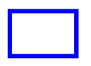
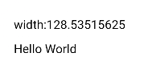
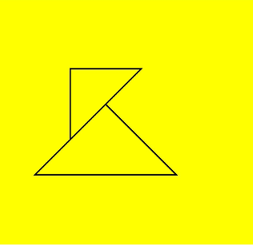

# CanvasRenderingContext2D对象<a name="ZH-CN_TOPIC_0000001173164707"></a>

使用CanvasRenderingContext2D在canvas画布组件上进行绘制，绘制对象可以是矩形、文本、图片等。

-   示例

    ```
    <!-- xxx.hml -->
    <div>
      <canvas ref="canvas1" style="width: 200px; height: 150px; background-color: #ffff00;"></canvas>
      <input type="button" style="width: 180px; height: 60px;" value="fillStyle" onclick="handleClick" />
      <input type="button" style="width: 180px; height: 60px;" value="fillStyle" onclick="antialias" />
    </div>
    ```

    ```
    // xxx.js
    export default {
      handleClick() {
        const el = this.$refs.canvas1;
        const ctx = el.getContext('2d');
        ctx.beginPath();
        ctx.arc(100, 75, 50, 0, 6.28);
        ctx.stroke();
      },
      antialias() {
        const el = this.$refs.canvas1;
        const ctx = el.getContext('2d', { antialias: true });
        ctx.beginPath();
        ctx.arc(100, 75, 50, 0, 6.28);
        ctx.stroke();
      }
    }
    ```


-   示意图（关闭抗锯齿）

    

-   示意图（开启抗锯齿）

    


## 属性<a name="section122871125229"></a>

<a name="table5448mcpsimp"></a>
<table><thead align="left"><tr id="row5456mcpsimp"><th class="cellrowborder" valign="top" width="13.97139713971397%" id="mcps1.1.5.1.1"><p id="p5458mcpsimp"><a name="p5458mcpsimp"></a><a name="p5458mcpsimp"></a>名称</p>
</th>
<th class="cellrowborder" valign="top" width="26.742674267426747%" id="mcps1.1.5.1.2"><p id="p5460mcpsimp"><a name="p5460mcpsimp"></a><a name="p5460mcpsimp"></a>类型</p>
</th>
<th class="cellrowborder" valign="top" width="9.650965096509651%" id="mcps1.1.5.1.3"><p id="p138236401285"><a name="p138236401285"></a><a name="p138236401285"></a>默认值</p>
</th>
<th class="cellrowborder" valign="top" width="49.63496349634964%" id="mcps1.1.5.1.4"><p id="p5466mcpsimp"><a name="p5466mcpsimp"></a><a name="p5466mcpsimp"></a>描述</p>
</th>
</tr>
</thead>
<tbody><tr id="row5467mcpsimp"><td class="cellrowborder" valign="top" width="13.97139713971397%" headers="mcps1.1.5.1.1 "><p id="p194373617255"><a name="p194373617255"></a><a name="p194373617255"></a><a href="#section948213716202">fillStyle</a></p>
</td>
<td class="cellrowborder" valign="top" width="26.742674267426747%" headers="mcps1.1.5.1.2 "><p id="p5471mcpsimp"><a name="p5471mcpsimp"></a><a name="p5471mcpsimp"></a>&lt;color&gt; | <a href="js-components-canvas-canvasgradient.md">CanvasGradient</a> | CanvasPattern</p>
</td>
<td class="cellrowborder" valign="top" width="9.650965096509651%" headers="mcps1.1.5.1.3 "><p id="p128231040182817"><a name="p128231040182817"></a><a name="p128231040182817"></a>-</p>
</td>
<td class="cellrowborder" valign="top" width="49.63496349634964%" headers="mcps1.1.5.1.4 "><p id="p5477mcpsimp"><a name="p5477mcpsimp"></a><a name="p5477mcpsimp"></a>指定绘制的填充色。</p>
<a name="ul139315155296"></a><a name="ul139315155296"></a><ul id="ul139315155296"><li>类型为&lt;color&gt;时，表示设置填充区域的颜色。</li><li>类型为CanvasGradient时，表示渐变对象，使用 createLinearGradient()方法创建。</li><li>类型为CanvasPattern时，使用 createPattern()方法创建。</li></ul>
</td>
</tr>
<tr id="row5478mcpsimp"><td class="cellrowborder" valign="top" width="13.97139713971397%" headers="mcps1.1.5.1.1 "><p id="p5480mcpsimp"><a name="p5480mcpsimp"></a><a name="p5480mcpsimp"></a><a href="#section1334911993014">lineWidth</a></p>
</td>
<td class="cellrowborder" valign="top" width="26.742674267426747%" headers="mcps1.1.5.1.2 "><p id="p19243401305"><a name="p19243401305"></a><a name="p19243401305"></a>number</p>
</td>
<td class="cellrowborder" valign="top" width="9.650965096509651%" headers="mcps1.1.5.1.3 "><p id="p88231840142814"><a name="p88231840142814"></a><a name="p88231840142814"></a>-</p>
</td>
<td class="cellrowborder" valign="top" width="49.63496349634964%" headers="mcps1.1.5.1.4 "><p id="p5488mcpsimp"><a name="p5488mcpsimp"></a><a name="p5488mcpsimp"></a>设置绘制线条的宽度。</p>
</td>
</tr>
<tr id="row1930464616243"><td class="cellrowborder" valign="top" width="13.97139713971397%" headers="mcps1.1.5.1.1 "><p id="p9305154611244"><a name="p9305154611244"></a><a name="p9305154611244"></a><a href="#section64021403250">strokeStyle</a></p>
</td>
<td class="cellrowborder" valign="top" width="26.742674267426747%" headers="mcps1.1.5.1.2 "><p id="p143052463243"><a name="p143052463243"></a><a name="p143052463243"></a>&lt;color&gt; | <a href="js-components-canvas-canvasgradient.md">CanvasGradient</a> | CanvasPattern</p>
</td>
<td class="cellrowborder" valign="top" width="9.650965096509651%" headers="mcps1.1.5.1.3 "><p id="p103051746202413"><a name="p103051746202413"></a><a name="p103051746202413"></a>-</p>
</td>
<td class="cellrowborder" valign="top" width="49.63496349634964%" headers="mcps1.1.5.1.4 "><p id="p1431612011267"><a name="p1431612011267"></a><a name="p1431612011267"></a>设置描边的颜色。</p>
<a name="ul53168018260"></a><a name="ul53168018260"></a><ul id="ul53168018260"><li>类型为&lt;color&gt;时，表示设置描边使用的颜色。</li><li>类型为CanvasGradient时，表示渐变对象，使用 createLinearGradient()方法创建。</li><li>类型为CanvasPattern时，使用 createPattern()方法创建。</li></ul>
</td>
</tr>
<tr id="row1491315492523"><td class="cellrowborder" valign="top" width="13.97139713971397%" headers="mcps1.1.5.1.1 "><p id="p6914104918527"><a name="p6914104918527"></a><a name="p6914104918527"></a><a href="#section6297132917520">lineCap</a></p>
</td>
<td class="cellrowborder" valign="top" width="26.742674267426747%" headers="mcps1.1.5.1.2 "><p id="p12914449165217"><a name="p12914449165217"></a><a name="p12914449165217"></a>string</p>
</td>
<td class="cellrowborder" valign="top" width="9.650965096509651%" headers="mcps1.1.5.1.3 "><p id="p4914194995218"><a name="p4914194995218"></a><a name="p4914194995218"></a>butt</p>
</td>
<td class="cellrowborder" valign="top" width="49.63496349634964%" headers="mcps1.1.5.1.4 "><p id="p388031620530"><a name="p388031620530"></a><a name="p388031620530"></a>指定线端点的样式，可选值为：</p>
<a name="ul4880171605310"></a><a name="ul4880171605310"></a><ul id="ul4880171605310"><li>butt：线端点以方形结束。</li><li>round：线端点以圆形结束。</li><li>square：线端点以方形结束，该样式下会增加一个长度和线段厚度相同，宽度是线段厚度一半的矩形。</li></ul>
</td>
</tr>
<tr id="row3349241115414"><td class="cellrowborder" valign="top" width="13.97139713971397%" headers="mcps1.1.5.1.1 "><p id="p034954105410"><a name="p034954105410"></a><a name="p034954105410"></a><a href="#section1538165645420">lineJoin</a></p>
</td>
<td class="cellrowborder" valign="top" width="26.742674267426747%" headers="mcps1.1.5.1.2 "><p id="p1835013416547"><a name="p1835013416547"></a><a name="p1835013416547"></a>string</p>
</td>
<td class="cellrowborder" valign="top" width="9.650965096509651%" headers="mcps1.1.5.1.3 "><p id="p03501741145413"><a name="p03501741145413"></a><a name="p03501741145413"></a>miter</p>
</td>
<td class="cellrowborder" valign="top" width="49.63496349634964%" headers="mcps1.1.5.1.4 "><p id="p1529212156559"><a name="p1529212156559"></a><a name="p1529212156559"></a>指定线段间相交的交点样式，可选值为：</p>
<a name="ul929219154551"></a><a name="ul929219154551"></a><ul id="ul929219154551"><li>round：在线段相连处绘制一个扇形，扇形的圆角半径是线段的宽度。</li><li>bevel：在线段相连处使用三角形为底填充， 每个部分矩形拐角独立。</li><li>miter：在相连部分的外边缘处进行延伸，使其相交于一点，形成一个菱形区域，该属性可以通过设置miterLimit属性展现效果。</li></ul>
</td>
</tr>
<tr id="row169726172599"><td class="cellrowborder" valign="top" width="13.97139713971397%" headers="mcps1.1.5.1.1 "><p id="p10972217205918"><a name="p10972217205918"></a><a name="p10972217205918"></a><a href="#section1584174515577">miterLimit</a></p>
</td>
<td class="cellrowborder" valign="top" width="26.742674267426747%" headers="mcps1.1.5.1.2 "><p id="p1997281785917"><a name="p1997281785917"></a><a name="p1997281785917"></a>number</p>
</td>
<td class="cellrowborder" valign="top" width="9.650965096509651%" headers="mcps1.1.5.1.3 "><p id="p997311725915"><a name="p997311725915"></a><a name="p997311725915"></a>10</p>
</td>
<td class="cellrowborder" valign="top" width="49.63496349634964%" headers="mcps1.1.5.1.4 "><p id="p1797319176594"><a name="p1797319176594"></a><a name="p1797319176594"></a>设置斜接面限制值，该值指定了线条相交处内角和外角的距离。</p>
</td>
</tr>
<tr id="row17431738523"><td class="cellrowborder" valign="top" width="13.97139713971397%" headers="mcps1.1.5.1.1 "><p id="p9437315210"><a name="p9437315210"></a><a name="p9437315210"></a><a href="#section17299329495">font</a></p>
</td>
<td class="cellrowborder" valign="top" width="26.742674267426747%" headers="mcps1.1.5.1.2 "><p id="p54315316521"><a name="p54315316521"></a><a name="p54315316521"></a>string</p>
</td>
<td class="cellrowborder" valign="top" width="9.650965096509651%" headers="mcps1.1.5.1.3 "><p id="p5122135214815"><a name="p5122135214815"></a><a name="p5122135214815"></a>"normal normal 14px sans-serif"</p>
</td>
<td class="cellrowborder" valign="top" width="49.63496349634964%" headers="mcps1.1.5.1.4 "><p id="p112514494494"><a name="p112514494494"></a><a name="p112514494494"></a>设置文本绘制中的字体样式。</p>
<p id="p14804172734717"><a name="p14804172734717"></a><a name="p14804172734717"></a>语法：ctx.font="font-style font-weight font-size font-family"<sup id="sup28041227184710"><a name="sup28041227184710"></a><a name="sup28041227184710"></a><span>5+</span></sup></p>
<a name="ul128041227164715"></a><a name="ul128041227164715"></a><ul id="ul128041227164715"><li>font-style(可选)，用于指定字体样式，支持如下几种样式：normal, italic。</li><li>font-weight(可选)，用于指定字体的粗细，支持如下几种类型：normal, bold, bolder, lighter, 100, 200, 300, 400, 500, 600, 700, 800, 900。</li><li>font-size(可选)，指定字号和行高，单位只支持px。</li><li>font-family(可选)，指定字体系列，支持如下几种类型：sans-serif, serif, monospace。</li></ul>
</td>
</tr>
<tr id="row568518327518"><td class="cellrowborder" valign="top" width="13.97139713971397%" headers="mcps1.1.5.1.1 "><p id="p10685203255117"><a name="p10685203255117"></a><a name="p10685203255117"></a><a href="#section323614315118">textAlign</a></p>
</td>
<td class="cellrowborder" valign="top" width="26.742674267426747%" headers="mcps1.1.5.1.2 "><p id="p206851132195115"><a name="p206851132195115"></a><a name="p206851132195115"></a>string</p>
</td>
<td class="cellrowborder" valign="top" width="9.650965096509651%" headers="mcps1.1.5.1.3 "><p id="p768516327516"><a name="p768516327516"></a><a name="p768516327516"></a>left</p>
</td>
<td class="cellrowborder" valign="top" width="49.63496349634964%" headers="mcps1.1.5.1.4 "><p id="p1268512328512"><a name="p1268512328512"></a><a name="p1268512328512"></a>设置文本绘制中的文本对齐方式，可选值为：</p>
<a name="ul47713282523"></a><a name="ul47713282523"></a><ul id="ul47713282523"><li>left：文本左对齐。</li><li>right：文本右对齐。</li><li>center：文本居中对齐。</li><li>start：文本对齐界线开始的地方。</li><li>end：文本对齐界线结束的地方。</li></ul>
<div class="note" id="note18771928165213"><a name="note18771928165213"></a><a name="note18771928165213"></a><span class="notetitle"> 说明： </span><div class="notebody"><p id="p977142811526"><a name="p977142811526"></a><a name="p977142811526"></a>ltr布局模式下start和left一致，rtl布局模式下start和right一致&middot;。</p>
</div></div>
</td>
</tr>
<tr id="row162312415315"><td class="cellrowborder" valign="top" width="13.97139713971397%" headers="mcps1.1.5.1.1 "><p id="p1729812301537"><a name="p1729812301537"></a><a name="p1729812301537"></a><a href="#section53111286533">textBaseline</a></p>
</td>
<td class="cellrowborder" valign="top" width="26.742674267426747%" headers="mcps1.1.5.1.2 "><p id="p56231324155312"><a name="p56231324155312"></a><a name="p56231324155312"></a>string</p>
</td>
<td class="cellrowborder" valign="top" width="9.650965096509651%" headers="mcps1.1.5.1.3 "><p id="p1862372445314"><a name="p1862372445314"></a><a name="p1862372445314"></a>alphabetic</p>
</td>
<td class="cellrowborder" valign="top" width="49.63496349634964%" headers="mcps1.1.5.1.4 "><p id="p1662319249536"><a name="p1662319249536"></a><a name="p1662319249536"></a>设置文本绘制中的水平对齐方式，可选值为：</p>
<a name="ul1944781165420"></a><a name="ul1944781165420"></a><ul id="ul1944781165420"><li>alphabetic：文本基线是标准的字母基线。</li><li>top：文本基线在文本块的顶部。</li><li>hanging：文本基线是悬挂基线。</li><li>middle：文本基线在文本块的中间。</li><li>ideographic：文字基线是表意字基线；如果字符本身超出了alphabetic 基线，那么ideograhpic基线位置在字符本身的底部。</li><li>bottom：文本基线在文本块的底部。 与 ideographic 基线的区别在于 ideographic 基线不需要考虑下行字母。</li></ul>
</td>
</tr>
<tr id="row1861912319472"><td class="cellrowborder" valign="top" width="13.97139713971397%" headers="mcps1.1.5.1.1 "><p id="p6620153194714"><a name="p6620153194714"></a><a name="p6620153194714"></a><a href="#section12301614194711">globalAlpha</a></p>
</td>
<td class="cellrowborder" valign="top" width="26.742674267426747%" headers="mcps1.1.5.1.2 "><p id="p0620143114710"><a name="p0620143114710"></a><a name="p0620143114710"></a>number</p>
</td>
<td class="cellrowborder" valign="top" width="9.650965096509651%" headers="mcps1.1.5.1.3 "><p id="p16620536473"><a name="p16620536473"></a><a name="p16620536473"></a>-</p>
</td>
<td class="cellrowborder" valign="top" width="49.63496349634964%" headers="mcps1.1.5.1.4 "><p id="p1062063174719"><a name="p1062063174719"></a><a name="p1062063174719"></a>设置透明度，0.0为完全透明，1.0为完全不透明。</p>
</td>
</tr>
<tr id="row674934291912"><td class="cellrowborder" valign="top" width="13.97139713971397%" headers="mcps1.1.5.1.1 "><p id="p15749144231914"><a name="p15749144231914"></a><a name="p15749144231914"></a><a href="#section1864372311920">lineDashOffset</a></p>
</td>
<td class="cellrowborder" valign="top" width="26.742674267426747%" headers="mcps1.1.5.1.2 "><p id="p1749842121919"><a name="p1749842121919"></a><a name="p1749842121919"></a>number</p>
</td>
<td class="cellrowborder" valign="top" width="9.650965096509651%" headers="mcps1.1.5.1.3 "><p id="p11749144201914"><a name="p11749144201914"></a><a name="p11749144201914"></a>0.0</p>
</td>
<td class="cellrowborder" valign="top" width="49.63496349634964%" headers="mcps1.1.5.1.4 "><p id="p674954211197"><a name="p674954211197"></a><a name="p674954211197"></a>设置画布的虚线偏移量，精度为float。</p>
</td>
</tr>
<tr id="row95411935182216"><td class="cellrowborder" valign="top" width="13.97139713971397%" headers="mcps1.1.5.1.1 "><p id="p115417357226"><a name="p115417357226"></a><a name="p115417357226"></a><a href="#section864572415229">globalCompositeOperation</a></p>
</td>
<td class="cellrowborder" valign="top" width="26.742674267426747%" headers="mcps1.1.5.1.2 "><p id="p25411035182217"><a name="p25411035182217"></a><a name="p25411035182217"></a>string</p>
</td>
<td class="cellrowborder" valign="top" width="9.650965096509651%" headers="mcps1.1.5.1.3 "><p id="p19541735112215"><a name="p19541735112215"></a><a name="p19541735112215"></a>source-over</p>
</td>
<td class="cellrowborder" valign="top" width="49.63496349634964%" headers="mcps1.1.5.1.4 "><p id="p254163517229"><a name="p254163517229"></a><a name="p254163517229"></a>设置合成操作的方式。类型字段可选值有source-over，source-atop，source-in，source-out，destination-over，destination-atop，destination-in，destination-out，lighter，copy，xor。具体请参考<a href="#li15554182282920">类型字段说明</a>。</p>
</td>
</tr>
<tr id="row9663153633113"><td class="cellrowborder" valign="top" width="13.97139713971397%" headers="mcps1.1.5.1.1 "><p id="p106641736183111"><a name="p106641736183111"></a><a name="p106641736183111"></a><a href="#section168015179313">shadowBlur</a></p>
</td>
<td class="cellrowborder" valign="top" width="26.742674267426747%" headers="mcps1.1.5.1.2 "><p id="p15664836133114"><a name="p15664836133114"></a><a name="p15664836133114"></a>number</p>
</td>
<td class="cellrowborder" valign="top" width="9.650965096509651%" headers="mcps1.1.5.1.3 "><p id="p46641736183114"><a name="p46641736183114"></a><a name="p46641736183114"></a>0.0</p>
</td>
<td class="cellrowborder" valign="top" width="49.63496349634964%" headers="mcps1.1.5.1.4 "><p id="p7664103673118"><a name="p7664103673118"></a><a name="p7664103673118"></a>设置绘制阴影时的模糊级别，值越大越模糊，精度为float。</p>
</td>
</tr>
<tr id="row056212488333"><td class="cellrowborder" valign="top" width="13.97139713971397%" headers="mcps1.1.5.1.1 "><p id="p1056264873311"><a name="p1056264873311"></a><a name="p1056264873311"></a><a href="#section18310428123315">shadowColor</a></p>
</td>
<td class="cellrowborder" valign="top" width="26.742674267426747%" headers="mcps1.1.5.1.2 "><p id="p1856213484334"><a name="p1856213484334"></a><a name="p1856213484334"></a>&lt;color&gt;</p>
</td>
<td class="cellrowborder" valign="top" width="9.650965096509651%" headers="mcps1.1.5.1.3 "><p id="p25621848163318"><a name="p25621848163318"></a><a name="p25621848163318"></a>-</p>
</td>
<td class="cellrowborder" valign="top" width="49.63496349634964%" headers="mcps1.1.5.1.4 "><p id="p1562748123320"><a name="p1562748123320"></a><a name="p1562748123320"></a>设置绘制阴影时的阴影颜色。</p>
</td>
</tr>
<tr id="row1288144353519"><td class="cellrowborder" valign="top" width="13.97139713971397%" headers="mcps1.1.5.1.1 "><p id="p6881143153511"><a name="p6881143153511"></a><a name="p6881143153511"></a><a href="#section642861510359">shadowOffsetX</a></p>
</td>
<td class="cellrowborder" valign="top" width="26.742674267426747%" headers="mcps1.1.5.1.2 "><p id="p68814363510"><a name="p68814363510"></a><a name="p68814363510"></a>number</p>
</td>
<td class="cellrowborder" valign="top" width="9.650965096509651%" headers="mcps1.1.5.1.3 "><p id="p1488104393514"><a name="p1488104393514"></a><a name="p1488104393514"></a>-</p>
</td>
<td class="cellrowborder" valign="top" width="49.63496349634964%" headers="mcps1.1.5.1.4 "><p id="p588164310356"><a name="p588164310356"></a><a name="p588164310356"></a>设置绘制阴影时和原有对象的水平偏移值。</p>
</td>
</tr>
<tr id="row83031316183814"><td class="cellrowborder" valign="top" width="13.97139713971397%" headers="mcps1.1.5.1.1 "><p id="p1641410177382"><a name="p1641410177382"></a><a name="p1641410177382"></a><a href="#section1554144712379">shadowOffsetY</a></p>
</td>
<td class="cellrowborder" valign="top" width="26.742674267426747%" headers="mcps1.1.5.1.2 "><p id="p83031616153813"><a name="p83031616153813"></a><a name="p83031616153813"></a>number</p>
</td>
<td class="cellrowborder" valign="top" width="9.650965096509651%" headers="mcps1.1.5.1.3 "><p id="p1330318161388"><a name="p1330318161388"></a><a name="p1330318161388"></a>-</p>
</td>
<td class="cellrowborder" valign="top" width="49.63496349634964%" headers="mcps1.1.5.1.4 "><p id="p1830451623810"><a name="p1830451623810"></a><a name="p1830451623810"></a>设置绘制阴影时和原有对象的垂直偏移值。</p>
</td>
</tr>
<tr id="row18343553194012"><td class="cellrowborder" valign="top" width="13.97139713971397%" headers="mcps1.1.5.1.1 "><p id="p14343353164014"><a name="p14343353164014"></a><a name="p14343353164014"></a><a href="#section3704184543915">imageSmoothingEnabled</a><sup id="sup9325194254811"><a name="sup9325194254811"></a><a name="sup9325194254811"></a>6+</sup></p>
</td>
<td class="cellrowborder" valign="top" width="26.742674267426747%" headers="mcps1.1.5.1.2 "><p id="p1734319533401"><a name="p1734319533401"></a><a name="p1734319533401"></a>boolean</p>
</td>
<td class="cellrowborder" valign="top" width="9.650965096509651%" headers="mcps1.1.5.1.3 "><p id="p134315324012"><a name="p134315324012"></a><a name="p134315324012"></a>true</p>
</td>
<td class="cellrowborder" valign="top" width="49.63496349634964%" headers="mcps1.1.5.1.4 "><p id="p83431253164015"><a name="p83431253164015"></a><a name="p83431253164015"></a>用于设置绘制图片时是否进行图像平滑度调整，true为启用，false为不启用。</p>
</td>
</tr>
</tbody>
</table>

### fillStyle<a name="section948213716202"></a>

```
ctx.fillStyle = '#0000ff';
ctx.fillRect(20, 20, 150, 100);
```


### lineWidth<a name="section1334911993014"></a>

```
ctx.lineWidth = 5;
ctx.strokeRect(25, 25, 85, 105);
```


### strokeStyle<a name="section64021403250"></a>

```
ctx.lineWidth = 10;
ctx.strokeStyle = '#0000ff';
ctx.strokeRect(25, 25, 155, 105);
```



### lineCap<a name="section6297132917520"></a>

```
ctx.lineWidth = 8;
ctx.beginPath();
ctx.lineCap = 'round';
ctx.moveTo(30, 50);
ctx.lineTo(220, 50);
ctx.stroke();
```


### lineJoin<a name="section1538165645420"></a>

```
ctx.beginPath();
ctx.lineWidth = 8;
ctx.lineJoin = 'miter';
ctx.moveTo(30, 30);
ctx.lineTo(120, 60);
ctx.lineTo(30, 110);
ctx.stroke();
```


### miterLimit<a name="section1584174515577"></a>

```
ctx.lineWidth = 8;
ctx.lineJoin = 'miter';
ctx.miterLimit = 3;
ctx.moveTo(30, 30);
ctx.lineTo(60, 35);
ctx.lineTo(30, 37);
ctx.stroke();
```


### font<a name="section17299329495"></a>

```
ctx.font = '30px sans-serif';
ctx.fillText("Hello World", 20, 60);
```


### textAlign<a name="section323614315118"></a>

```
ctx.strokeStyle = '#0000ff';
ctx.moveTo(140, 10);
ctx.lineTo(140, 160);
ctx.stroke();

ctx.font = '18px sans-serif';    

// Show the different textAlign values
ctx.textAlign = 'start';      
ctx.fillText('textAlign=start', 140, 60);        
ctx.textAlign = 'end';      
ctx.fillText('textAlign=end', 140, 80);  
ctx.textAlign = 'left';      
ctx.fillText('textAlign=left', 140, 100);
ctx.textAlign = 'center';     
ctx.fillText('textAlign=center',140, 120);              
ctx.textAlign = 'right';      
ctx.fillText('textAlign=right',140, 140);
```


### textBaseline<a name="section53111286533"></a>

```
ctx.strokeStyle = '#0000ff';
ctx.moveTo(0, 120);
ctx.lineTo(400, 120);
ctx.stroke();

ctx.font = '20px sans-serif';

ctx.textBaseline = 'top'; 
ctx.fillText('Top', 10, 120); 
ctx.textBaseline = 'bottom'; 
ctx.fillText('Bottom', 55, 120); 
ctx.textBaseline = 'middle'; 
ctx.fillText('Middle', 125, 120); 
ctx.textBaseline = 'alphabetic'; 
ctx.fillText('Alphabetic', 195, 120); 
ctx.textBaseline = 'hanging'; 
ctx.fillText('Hanging', 295, 120);
```


### globalAlpha<a name="section12301614194711"></a>

```
ctx.fillStyle = 'rgb(255,0,0)';
ctx.fillRect(0, 0, 50, 50);
ctx.globalAlpha = 0.4;
ctx.fillStyle = 'rgb(0,0,255)'; 
ctx.fillRect(50, 50, 50, 50); 
```


### lineDashOffset<a name="section1864372311920"></a>

```
ctx.arc(100, 75, 50, 0, 6.28);
ctx.setLineDash([10,20]);
ctx.lineDashOffset = 10.0;
ctx.stroke();
```


### globalCompositeOperation<a name="section864572415229"></a>

-   <a name="li15554182282920"></a>类型字段说明

    <a name="table18531056194"></a>
    <table><thead align="left"><tr id="row11531165161910"><th class="cellrowborder" valign="top" width="12.78%" id="mcps1.1.3.1.1"><p id="p165310561912"><a name="p165310561912"></a><a name="p165310561912"></a>值</p>
    </th>
    <th class="cellrowborder" valign="top" width="87.22%" id="mcps1.1.3.1.2"><p id="p185311255194"><a name="p185311255194"></a><a name="p185311255194"></a>描述</p>
    </th>
    </tr>
    </thead>
    <tbody><tr id="row85328521910"><td class="cellrowborder" valign="top" width="12.78%" headers="mcps1.1.3.1.1 "><p id="p553213501910"><a name="p553213501910"></a><a name="p553213501910"></a>source-over</p>
    </td>
    <td class="cellrowborder" valign="top" width="87.22%" headers="mcps1.1.3.1.2 "><p id="p8532457197"><a name="p8532457197"></a><a name="p8532457197"></a>在现有绘制内容上显示新绘制内容，属于默认值。</p>
    </td>
    </tr>
    <tr id="row35321558192"><td class="cellrowborder" valign="top" width="12.78%" headers="mcps1.1.3.1.1 "><p id="p95329519193"><a name="p95329519193"></a><a name="p95329519193"></a>source-atop</p>
    </td>
    <td class="cellrowborder" valign="top" width="87.22%" headers="mcps1.1.3.1.2 "><p id="p18532195161910"><a name="p18532195161910"></a><a name="p18532195161910"></a>在现有绘制内容顶部显示新绘制内容。</p>
    </td>
    </tr>
    <tr id="row165325510190"><td class="cellrowborder" valign="top" width="12.78%" headers="mcps1.1.3.1.1 "><p id="p95326516198"><a name="p95326516198"></a><a name="p95326516198"></a>source-in</p>
    </td>
    <td class="cellrowborder" valign="top" width="87.22%" headers="mcps1.1.3.1.2 "><p id="p1253220591913"><a name="p1253220591913"></a><a name="p1253220591913"></a>在现有绘制内容中显示新绘制内容。</p>
    </td>
    </tr>
    <tr id="row15331153194"><td class="cellrowborder" valign="top" width="12.78%" headers="mcps1.1.3.1.1 "><p id="p105330581914"><a name="p105330581914"></a><a name="p105330581914"></a>source-out</p>
    </td>
    <td class="cellrowborder" valign="top" width="87.22%" headers="mcps1.1.3.1.2 "><p id="p4533155181911"><a name="p4533155181911"></a><a name="p4533155181911"></a>在现有绘制内容之外显示新绘制内容。</p>
    </td>
    </tr>
    <tr id="row1053316571915"><td class="cellrowborder" valign="top" width="12.78%" headers="mcps1.1.3.1.1 "><p id="p45331751199"><a name="p45331751199"></a><a name="p45331751199"></a>destination-over</p>
    </td>
    <td class="cellrowborder" valign="top" width="87.22%" headers="mcps1.1.3.1.2 "><p id="p1753315171912"><a name="p1753315171912"></a><a name="p1753315171912"></a>在新绘制内容上方显示现有绘制内容。</p>
    </td>
    </tr>
    <tr id="row1453315581918"><td class="cellrowborder" valign="top" width="12.78%" headers="mcps1.1.3.1.1 "><p id="p053310513195"><a name="p053310513195"></a><a name="p053310513195"></a>destination-atop</p>
    </td>
    <td class="cellrowborder" valign="top" width="87.22%" headers="mcps1.1.3.1.2 "><p id="p1553316512195"><a name="p1553316512195"></a><a name="p1553316512195"></a>在新绘制内容顶部显示现有绘制内容。</p>
    </td>
    </tr>
    <tr id="row19533185111911"><td class="cellrowborder" valign="top" width="12.78%" headers="mcps1.1.3.1.1 "><p id="p1753416516199"><a name="p1753416516199"></a><a name="p1753416516199"></a>destination-in</p>
    </td>
    <td class="cellrowborder" valign="top" width="87.22%" headers="mcps1.1.3.1.2 "><p id="p1853416518192"><a name="p1853416518192"></a><a name="p1853416518192"></a>在新绘制内容中显示现有绘制内容。</p>
    </td>
    </tr>
    <tr id="row85341957198"><td class="cellrowborder" valign="top" width="12.78%" headers="mcps1.1.3.1.1 "><p id="p95348510192"><a name="p95348510192"></a><a name="p95348510192"></a>destination-out</p>
    </td>
    <td class="cellrowborder" valign="top" width="87.22%" headers="mcps1.1.3.1.2 "><p id="p18534758191"><a name="p18534758191"></a><a name="p18534758191"></a>在新绘制内容外显示现有绘制内容。</p>
    </td>
    </tr>
    <tr id="row75345510197"><td class="cellrowborder" valign="top" width="12.78%" headers="mcps1.1.3.1.1 "><p id="p75343518195"><a name="p75343518195"></a><a name="p75343518195"></a>lighter</p>
    </td>
    <td class="cellrowborder" valign="top" width="87.22%" headers="mcps1.1.3.1.2 "><p id="p1853465101910"><a name="p1853465101910"></a><a name="p1853465101910"></a>显示新绘制内容和现有绘制内容。</p>
    </td>
    </tr>
    <tr id="row55347519197"><td class="cellrowborder" valign="top" width="12.78%" headers="mcps1.1.3.1.1 "><p id="p1053514511190"><a name="p1053514511190"></a><a name="p1053514511190"></a>copy</p>
    </td>
    <td class="cellrowborder" valign="top" width="87.22%" headers="mcps1.1.3.1.2 "><p id="p45351851199"><a name="p45351851199"></a><a name="p45351851199"></a>显示新绘制内容而忽略现有绘制内容。</p>
    </td>
    </tr>
    <tr id="row1153513515195"><td class="cellrowborder" valign="top" width="12.78%" headers="mcps1.1.3.1.1 "><p id="p453520561911"><a name="p453520561911"></a><a name="p453520561911"></a>xor</p>
    </td>
    <td class="cellrowborder" valign="top" width="87.22%" headers="mcps1.1.3.1.2 "><p id="p9535145111912"><a name="p9535145111912"></a><a name="p9535145111912"></a>使用异或操作对新绘制内容与现有绘制内容进行融合。</p>
    </td>
    </tr>
    </tbody>
    </table>


-   示例

    ```
    ctx.fillStyle = 'rgb(255,0,0)';
    ctx.fillRect(20, 20, 50, 50);
    ctx.globalCompositeOperation = 'source-over';
    ctx.fillStyle = 'rgb(0,0,255)';
    ctx.fillRect(50, 50, 50, 50);
    // Start drawing second example
    ctx.fillStyle = 'rgb(255,0,0)';
    ctx.fillRect(120, 20, 50, 50);
    ctx.globalCompositeOperation = 'destination-over';
    ctx.fillStyle = 'rgb(0,0,255)';
    ctx.fillRect(150, 50, 50, 50);
    ```

    

    示例中，新绘制内容是蓝色矩形，现有绘制内容是红色矩形。


### shadowBlur<a name="section168015179313"></a>

```
ctx.shadowBlur = 30;
ctx.shadowColor = 'rgb(0,0,0)';
ctx.fillStyle = 'rgb(255,0,0)';
ctx.fillRect(20, 20, 100, 80);
```


### shadowColor<a name="section18310428123315"></a>

```
ctx.shadowBlur = 30;
ctx.shadowColor = 'rgb(0,0,255)';
ctx.fillStyle = 'rgb(255,0,0)';
ctx.fillRect(30, 30, 100, 100);
```


### shadowOffsetX<a name="section642861510359"></a>

```
ctx.shadowBlur = 10;
ctx.shadowOffsetX = 20;
ctx.shadowColor = 'rgb(0,0,0)';
ctx.fillStyle = 'rgb(255,0,0)';
ctx.fillRect(20, 20, 100, 80);
```


### shadowOffsetY<a name="section1554144712379"></a>

```
ctx.shadowBlur = 10;
ctx.shadowOffsetY = 20;
ctx.shadowColor = 'rgb(0,0,0)';
ctx.fillStyle = 'rgb(255,0,0)';
ctx.fillRect(30, 30, 100, 100);
```


### imageSmoothingEnabled<sup>6+</sup><a name="section3704184543915"></a>

```
var img = new Image();
img.src = 'common/image/huawei.jpg';
img.onload = function() {
  ctx.imageSmoothingEnabled = false;
  ctx.drawImage(img, 0, 0, 400, 200);
};
```


## 方法<a name="section1683015406227"></a>

### fillRect<a name="section14858104972214"></a>

fillRect\(x: number, y: number, width:number, height: number\): void

填充一个矩形。

-   参数

    <a name="table1373232324719"></a>
    <table><thead align="left"><tr id="row157320236475"><th class="cellrowborder" valign="top" width="33.333333333333336%" id="mcps1.1.4.1.1"><p id="p12732423164717"><a name="p12732423164717"></a><a name="p12732423164717"></a>参数</p>
    </th>
    <th class="cellrowborder" valign="top" width="33.333333333333336%" id="mcps1.1.4.1.2"><p id="p17321223184715"><a name="p17321223184715"></a><a name="p17321223184715"></a>类型</p>
    </th>
    <th class="cellrowborder" valign="top" width="33.333333333333336%" id="mcps1.1.4.1.3"><p id="p973222324714"><a name="p973222324714"></a><a name="p973222324714"></a>描述</p>
    </th>
    </tr>
    </thead>
    <tbody><tr id="row1273332310476"><td class="cellrowborder" valign="top" width="33.333333333333336%" headers="mcps1.1.4.1.1 "><p id="p273315238472"><a name="p273315238472"></a><a name="p273315238472"></a>x</p>
    </td>
    <td class="cellrowborder" valign="top" width="33.333333333333336%" headers="mcps1.1.4.1.2 "><p id="p5733122316479"><a name="p5733122316479"></a><a name="p5733122316479"></a>number</p>
    </td>
    <td class="cellrowborder" valign="top" width="33.333333333333336%" headers="mcps1.1.4.1.3 "><p id="p57339233473"><a name="p57339233473"></a><a name="p57339233473"></a>指定矩形左上角点的x坐标。</p>
    </td>
    </tr>
    <tr id="row1173342310479"><td class="cellrowborder" valign="top" width="33.333333333333336%" headers="mcps1.1.4.1.1 "><p id="p107331323154715"><a name="p107331323154715"></a><a name="p107331323154715"></a>y</p>
    </td>
    <td class="cellrowborder" valign="top" width="33.333333333333336%" headers="mcps1.1.4.1.2 "><p id="p1733132364719"><a name="p1733132364719"></a><a name="p1733132364719"></a>number</p>
    </td>
    <td class="cellrowborder" valign="top" width="33.333333333333336%" headers="mcps1.1.4.1.3 "><p id="p17733823194718"><a name="p17733823194718"></a><a name="p17733823194718"></a>指定矩形左上角点的y坐标。</p>
    </td>
    </tr>
    <tr id="row1173315232471"><td class="cellrowborder" valign="top" width="33.333333333333336%" headers="mcps1.1.4.1.1 "><p id="p12733102318475"><a name="p12733102318475"></a><a name="p12733102318475"></a>width</p>
    </td>
    <td class="cellrowborder" valign="top" width="33.333333333333336%" headers="mcps1.1.4.1.2 "><p id="p3733102394714"><a name="p3733102394714"></a><a name="p3733102394714"></a>number</p>
    </td>
    <td class="cellrowborder" valign="top" width="33.333333333333336%" headers="mcps1.1.4.1.3 "><p id="p47331023144712"><a name="p47331023144712"></a><a name="p47331023144712"></a>指定矩形的宽度。</p>
    </td>
    </tr>
    <tr id="row6733182354714"><td class="cellrowborder" valign="top" width="33.333333333333336%" headers="mcps1.1.4.1.1 "><p id="p1673322384718"><a name="p1673322384718"></a><a name="p1673322384718"></a>height</p>
    </td>
    <td class="cellrowborder" valign="top" width="33.333333333333336%" headers="mcps1.1.4.1.2 "><p id="p8733132314713"><a name="p8733132314713"></a><a name="p8733132314713"></a>number</p>
    </td>
    <td class="cellrowborder" valign="top" width="33.333333333333336%" headers="mcps1.1.4.1.3 "><p id="p12733132317478"><a name="p12733132317478"></a><a name="p12733132317478"></a>指定矩形的高度。</p>
    </td>
    </tr>
    </tbody>
    </table>

-   示例

    ```
    ctx.fillRect(20, 20, 200, 150);
    ```

    


### clearRect<a name="section7139416112410"></a>

clearRect\(x: number, y: number, width:number, height: number\): void

删除指定区域内的绘制内容。

-   参数

    <a name="table8705824156"></a>
    <table><thead align="left"><tr id="row13705024154"><th class="cellrowborder" valign="top" width="33.333333333333336%" id="mcps1.1.4.1.1"><p id="p107055216158"><a name="p107055216158"></a><a name="p107055216158"></a>参数</p>
    </th>
    <th class="cellrowborder" valign="top" width="33.333333333333336%" id="mcps1.1.4.1.2"><p id="p1070519218153"><a name="p1070519218153"></a><a name="p1070519218153"></a>类型</p>
    </th>
    <th class="cellrowborder" valign="top" width="33.333333333333336%" id="mcps1.1.4.1.3"><p id="p670512191515"><a name="p670512191515"></a><a name="p670512191515"></a>描述</p>
    </th>
    </tr>
    </thead>
    <tbody><tr id="row671018213152"><td class="cellrowborder" valign="top" width="33.333333333333336%" headers="mcps1.1.4.1.1 "><p id="p27103251515"><a name="p27103251515"></a><a name="p27103251515"></a>x</p>
    </td>
    <td class="cellrowborder" valign="top" width="33.333333333333336%" headers="mcps1.1.4.1.2 "><p id="p471020291519"><a name="p471020291519"></a><a name="p471020291519"></a>number</p>
    </td>
    <td class="cellrowborder" valign="top" width="33.333333333333336%" headers="mcps1.1.4.1.3 "><p id="p177102214157"><a name="p177102214157"></a><a name="p177102214157"></a>指定矩形上的左上角x坐标。</p>
    </td>
    </tr>
    <tr id="row197101923153"><td class="cellrowborder" valign="top" width="33.333333333333336%" headers="mcps1.1.4.1.1 "><p id="p371014216151"><a name="p371014216151"></a><a name="p371014216151"></a>y</p>
    </td>
    <td class="cellrowborder" valign="top" width="33.333333333333336%" headers="mcps1.1.4.1.2 "><p id="p57107211516"><a name="p57107211516"></a><a name="p57107211516"></a>number</p>
    </td>
    <td class="cellrowborder" valign="top" width="33.333333333333336%" headers="mcps1.1.4.1.3 "><p id="p371020211512"><a name="p371020211512"></a><a name="p371020211512"></a>指定矩形上的左上角y坐标。</p>
    </td>
    </tr>
    <tr id="row157100217157"><td class="cellrowborder" valign="top" width="33.333333333333336%" headers="mcps1.1.4.1.1 "><p id="p1171011217153"><a name="p1171011217153"></a><a name="p1171011217153"></a>width</p>
    </td>
    <td class="cellrowborder" valign="top" width="33.333333333333336%" headers="mcps1.1.4.1.2 "><p id="p67109212153"><a name="p67109212153"></a><a name="p67109212153"></a>number</p>
    </td>
    <td class="cellrowborder" valign="top" width="33.333333333333336%" headers="mcps1.1.4.1.3 "><p id="p5710122101512"><a name="p5710122101512"></a><a name="p5710122101512"></a>指定矩形的宽度。</p>
    </td>
    </tr>
    <tr id="row2071014213157"><td class="cellrowborder" valign="top" width="33.333333333333336%" headers="mcps1.1.4.1.1 "><p id="p10710162191517"><a name="p10710162191517"></a><a name="p10710162191517"></a>height</p>
    </td>
    <td class="cellrowborder" valign="top" width="33.333333333333336%" headers="mcps1.1.4.1.2 "><p id="p37101291518"><a name="p37101291518"></a><a name="p37101291518"></a>number</p>
    </td>
    <td class="cellrowborder" valign="top" width="33.333333333333336%" headers="mcps1.1.4.1.3 "><p id="p171015212158"><a name="p171015212158"></a><a name="p171015212158"></a>指定矩形的高度。</p>
    </td>
    </tr>
    </tbody>
    </table>

-   示例

    ```
    ctx.fillStyle = 'rgb(0,0,255)';
    ctx.fillRect(0, 0, 400, 200);
    ctx.clearRect(20, 20, 150, 100);
    ```

    


### strokeRect<a name="section17464195017258"></a>

strokeRect\(x: number, y: number, width:number, height: number\): void

绘制具有边框的矩形，矩形内部不填充。

-   参数

    <a name="table5198152151717"></a>
    <table><thead align="left"><tr id="row4198102117177"><th class="cellrowborder" valign="top" width="33.333333333333336%" id="mcps1.1.4.1.1"><p id="p1319842114173"><a name="p1319842114173"></a><a name="p1319842114173"></a>参数</p>
    </th>
    <th class="cellrowborder" valign="top" width="33.333333333333336%" id="mcps1.1.4.1.2"><p id="p16198221101717"><a name="p16198221101717"></a><a name="p16198221101717"></a>类型</p>
    </th>
    <th class="cellrowborder" valign="top" width="33.333333333333336%" id="mcps1.1.4.1.3"><p id="p419862120178"><a name="p419862120178"></a><a name="p419862120178"></a>描述</p>
    </th>
    </tr>
    </thead>
    <tbody><tr id="row141984216172"><td class="cellrowborder" valign="top" width="33.333333333333336%" headers="mcps1.1.4.1.1 "><p id="p11997218171"><a name="p11997218171"></a><a name="p11997218171"></a>x</p>
    </td>
    <td class="cellrowborder" valign="top" width="33.333333333333336%" headers="mcps1.1.4.1.2 "><p id="p18199132141710"><a name="p18199132141710"></a><a name="p18199132141710"></a>number</p>
    </td>
    <td class="cellrowborder" valign="top" width="33.333333333333336%" headers="mcps1.1.4.1.3 "><p id="p919916216177"><a name="p919916216177"></a><a name="p919916216177"></a>指定矩形的左上角x坐标。</p>
    </td>
    </tr>
    <tr id="row819915218178"><td class="cellrowborder" valign="top" width="33.333333333333336%" headers="mcps1.1.4.1.1 "><p id="p5199152111718"><a name="p5199152111718"></a><a name="p5199152111718"></a>y</p>
    </td>
    <td class="cellrowborder" valign="top" width="33.333333333333336%" headers="mcps1.1.4.1.2 "><p id="p10199142110176"><a name="p10199142110176"></a><a name="p10199142110176"></a>number</p>
    </td>
    <td class="cellrowborder" valign="top" width="33.333333333333336%" headers="mcps1.1.4.1.3 "><p id="p1319922191713"><a name="p1319922191713"></a><a name="p1319922191713"></a>指定矩形的左上角y坐标。</p>
    </td>
    </tr>
    <tr id="row191996218178"><td class="cellrowborder" valign="top" width="33.333333333333336%" headers="mcps1.1.4.1.1 "><p id="p61991321121719"><a name="p61991321121719"></a><a name="p61991321121719"></a>width</p>
    </td>
    <td class="cellrowborder" valign="top" width="33.333333333333336%" headers="mcps1.1.4.1.2 "><p id="p7199152181719"><a name="p7199152181719"></a><a name="p7199152181719"></a>number</p>
    </td>
    <td class="cellrowborder" valign="top" width="33.333333333333336%" headers="mcps1.1.4.1.3 "><p id="p1519918213174"><a name="p1519918213174"></a><a name="p1519918213174"></a>指定矩形的宽度。</p>
    </td>
    </tr>
    <tr id="row519962131710"><td class="cellrowborder" valign="top" width="33.333333333333336%" headers="mcps1.1.4.1.1 "><p id="p219972181712"><a name="p219972181712"></a><a name="p219972181712"></a>height</p>
    </td>
    <td class="cellrowborder" valign="top" width="33.333333333333336%" headers="mcps1.1.4.1.2 "><p id="p17199621131716"><a name="p17199621131716"></a><a name="p17199621131716"></a>number</p>
    </td>
    <td class="cellrowborder" valign="top" width="33.333333333333336%" headers="mcps1.1.4.1.3 "><p id="p71991021111715"><a name="p71991021111715"></a><a name="p71991021111715"></a>指定矩形的高度。</p>
    </td>
    </tr>
    </tbody>
    </table>

-   示例

    ```
    ctx.strokeRect(30, 30, 200, 150);
    ```

    


### fillText<a name="section11872142516265"></a>

fillText\(text: string, x: number, y: number\): void

绘制填充类文本。

-   参数

    <a name="table530775318111"></a>
    <table><thead align="left"><tr id="row73073531818"><th class="cellrowborder" valign="top" width="33.333333333333336%" id="mcps1.1.4.1.1"><p id="p73081653910"><a name="p73081653910"></a><a name="p73081653910"></a>参数</p>
    </th>
    <th class="cellrowborder" valign="top" width="33.333333333333336%" id="mcps1.1.4.1.2"><p id="p1130835317110"><a name="p1130835317110"></a><a name="p1130835317110"></a>类型</p>
    </th>
    <th class="cellrowborder" valign="top" width="33.333333333333336%" id="mcps1.1.4.1.3"><p id="p5308125313115"><a name="p5308125313115"></a><a name="p5308125313115"></a>描述</p>
    </th>
    </tr>
    </thead>
    <tbody><tr id="row2308253514"><td class="cellrowborder" valign="top" width="33.333333333333336%" headers="mcps1.1.4.1.1 "><p id="p173086531614"><a name="p173086531614"></a><a name="p173086531614"></a>text</p>
    </td>
    <td class="cellrowborder" valign="top" width="33.333333333333336%" headers="mcps1.1.4.1.2 "><p id="p13083531112"><a name="p13083531112"></a><a name="p13083531112"></a>string</p>
    </td>
    <td class="cellrowborder" valign="top" width="33.333333333333336%" headers="mcps1.1.4.1.3 "><p id="p230845314115"><a name="p230845314115"></a><a name="p230845314115"></a>需要绘制的文本内容。</p>
    </td>
    </tr>
    <tr id="row73081053813"><td class="cellrowborder" valign="top" width="33.333333333333336%" headers="mcps1.1.4.1.1 "><p id="p8308453317"><a name="p8308453317"></a><a name="p8308453317"></a>x</p>
    </td>
    <td class="cellrowborder" valign="top" width="33.333333333333336%" headers="mcps1.1.4.1.2 "><p id="p430825314115"><a name="p430825314115"></a><a name="p430825314115"></a>number</p>
    </td>
    <td class="cellrowborder" valign="top" width="33.333333333333336%" headers="mcps1.1.4.1.3 "><p id="p1930835314119"><a name="p1930835314119"></a><a name="p1930835314119"></a>需要绘制的文本的左下角x坐标。</p>
    </td>
    </tr>
    <tr id="row1330811531619"><td class="cellrowborder" valign="top" width="33.333333333333336%" headers="mcps1.1.4.1.1 "><p id="p330818531119"><a name="p330818531119"></a><a name="p330818531119"></a>y</p>
    </td>
    <td class="cellrowborder" valign="top" width="33.333333333333336%" headers="mcps1.1.4.1.2 "><p id="p03089534114"><a name="p03089534114"></a><a name="p03089534114"></a>number</p>
    </td>
    <td class="cellrowborder" valign="top" width="33.333333333333336%" headers="mcps1.1.4.1.3 "><p id="p133087531817"><a name="p133087531817"></a><a name="p133087531817"></a>需要绘制的文本的左下角y坐标。</p>
    </td>
    </tr>
    </tbody>
    </table>

-   示例

    ```
    ctx.font = '35px sans-serif';
    ctx.fillText("Hello World!", 20, 60);
    ```

    


### strokeText<a name="section45101242710"></a>

strokeText\(text: string, x: number, y: number\): void

绘制描边类文本。

-   参数

    <a name="table26917485393"></a>
    <table><thead align="left"><tr id="row7719748133917"><th class="cellrowborder" valign="top" width="33.333333333333336%" id="mcps1.1.4.1.1"><p id="p19719548153913"><a name="p19719548153913"></a><a name="p19719548153913"></a>参数</p>
    </th>
    <th class="cellrowborder" valign="top" width="33.333333333333336%" id="mcps1.1.4.1.2"><p id="p8719114812395"><a name="p8719114812395"></a><a name="p8719114812395"></a>类型</p>
    </th>
    <th class="cellrowborder" valign="top" width="33.333333333333336%" id="mcps1.1.4.1.3"><p id="p9719648163917"><a name="p9719648163917"></a><a name="p9719648163917"></a>描述</p>
    </th>
    </tr>
    </thead>
    <tbody><tr id="row1571915482398"><td class="cellrowborder" valign="top" width="33.333333333333336%" headers="mcps1.1.4.1.1 "><p id="p9719204813392"><a name="p9719204813392"></a><a name="p9719204813392"></a>text</p>
    </td>
    <td class="cellrowborder" valign="top" width="33.333333333333336%" headers="mcps1.1.4.1.2 "><p id="p371924883918"><a name="p371924883918"></a><a name="p371924883918"></a>string</p>
    </td>
    <td class="cellrowborder" valign="top" width="33.333333333333336%" headers="mcps1.1.4.1.3 "><p id="p1345116461512"><a name="p1345116461512"></a><a name="p1345116461512"></a>需要绘制的文本内容。</p>
    </td>
    </tr>
    <tr id="row187191548183919"><td class="cellrowborder" valign="top" width="33.333333333333336%" headers="mcps1.1.4.1.1 "><p id="p13719204810398"><a name="p13719204810398"></a><a name="p13719204810398"></a>x</p>
    </td>
    <td class="cellrowborder" valign="top" width="33.333333333333336%" headers="mcps1.1.4.1.2 "><p id="p1371912484399"><a name="p1371912484399"></a><a name="p1371912484399"></a>number</p>
    </td>
    <td class="cellrowborder" valign="top" width="33.333333333333336%" headers="mcps1.1.4.1.3 "><p id="p245110469119"><a name="p245110469119"></a><a name="p245110469119"></a>需要绘制的文本的左下角x坐标。</p>
    </td>
    </tr>
    <tr id="row5719114803911"><td class="cellrowborder" valign="top" width="33.333333333333336%" headers="mcps1.1.4.1.1 "><p id="p671984814397"><a name="p671984814397"></a><a name="p671984814397"></a>y</p>
    </td>
    <td class="cellrowborder" valign="top" width="33.333333333333336%" headers="mcps1.1.4.1.2 "><p id="p37192048113917"><a name="p37192048113917"></a><a name="p37192048113917"></a>number</p>
    </td>
    <td class="cellrowborder" valign="top" width="33.333333333333336%" headers="mcps1.1.4.1.3 "><p id="p245114610113"><a name="p245114610113"></a><a name="p245114610113"></a>需要绘制的文本的左下角y坐标。</p>
    </td>
    </tr>
    </tbody>
    </table>

-   示例

    ```
    ctx.font = '25px sans-serif';
    ctx.strokeText("Hello World!", 20, 60);
    ```

    


### measureText<a name="section7847115813278"></a>

measureText\(text: string\): TextMetrics

该方法返回一个文本测算的对象，通过该对象可以获取指定文本的宽度值。

-   参数

    <a name="table15114131710195"></a>
    <table><thead align="left"><tr id="row11115171771919"><th class="cellrowborder" valign="top" width="33.333333333333336%" id="mcps1.1.4.1.1"><p id="p18115111741913"><a name="p18115111741913"></a><a name="p18115111741913"></a>参数</p>
    </th>
    <th class="cellrowborder" valign="top" width="33.333333333333336%" id="mcps1.1.4.1.2"><p id="p201151617121919"><a name="p201151617121919"></a><a name="p201151617121919"></a>类型</p>
    </th>
    <th class="cellrowborder" valign="top" width="33.333333333333336%" id="mcps1.1.4.1.3"><p id="p111510177193"><a name="p111510177193"></a><a name="p111510177193"></a>描述</p>
    </th>
    </tr>
    </thead>
    <tbody><tr id="row1211581791911"><td class="cellrowborder" valign="top" width="33.333333333333336%" headers="mcps1.1.4.1.1 "><p id="p4115181719193"><a name="p4115181719193"></a><a name="p4115181719193"></a>text</p>
    </td>
    <td class="cellrowborder" valign="top" width="33.333333333333336%" headers="mcps1.1.4.1.2 "><p id="p41151617191918"><a name="p41151617191918"></a><a name="p41151617191918"></a>string</p>
    </td>
    <td class="cellrowborder" valign="top" width="33.333333333333336%" headers="mcps1.1.4.1.3 "><p id="p16115161712195"><a name="p16115161712195"></a><a name="p16115161712195"></a>需要进行测量的文本。</p>
    </td>
    </tr>
    </tbody>
    </table>

-   返回值

    <a name="table1311551731912"></a>
    <table><thead align="left"><tr id="row111571711193"><th class="cellrowborder" valign="top" width="19.75%" id="mcps1.1.3.1.1"><p id="p1911514175193"><a name="p1911514175193"></a><a name="p1911514175193"></a>类型</p>
    </th>
    <th class="cellrowborder" valign="top" width="80.25%" id="mcps1.1.3.1.2"><p id="p19115151761914"><a name="p19115151761914"></a><a name="p19115151761914"></a>说明</p>
    </th>
    </tr>
    </thead>
    <tbody><tr id="row2115121711190"><td class="cellrowborder" valign="top" width="19.75%" headers="mcps1.1.3.1.1 "><p id="p711612174199"><a name="p711612174199"></a><a name="p711612174199"></a>TextMetrics</p>
    </td>
    <td class="cellrowborder" valign="top" width="80.25%" headers="mcps1.1.3.1.2 "><p id="p1811613179191"><a name="p1811613179191"></a><a name="p1811613179191"></a>包含指定字体的宽度，该宽度可以通过TextMetrics.width来获取。</p>
    </td>
    </tr>
    </tbody>
    </table>

-   示例

    ```
    ctx.font = '25px sans-serif';
    var txt = 'Hello World';
    ctx.fillText("width:" + ctx.measureText(txt).width, 20, 60);
    ctx.fillText(txt, 20, 110);
    ```

    


### stroke<a name="section1168214129288"></a>

stroke\(\): void

进行边框绘制操作。

-   示例

    ```
    ctx.moveTo(25, 25);
    ctx.lineTo(25, 105);
    ctx.strokeStyle = 'rgb(0,0,255)';
    ctx.stroke();
    ```

    


### beginPath<a name="section6111135582910"></a>

beginPath\(\): void

创建一个新的绘制路径。

-   示例

    ```
    ctx.beginPath();              
    ctx.lineWidth = '6';
    ctx.strokeStyle = '#0000ff';
    ctx.moveTo(15, 80); 
    ctx.lineTo(280, 160);
    ctx.stroke();
    ```

    


### moveTo<a name="section13824131654417"></a>

moveTo\(x: number, y: number\): void

路径从当前点移动到指定点。

-   参数

    <a name="table312917301124"></a>
    <table><thead align="left"><tr id="row91295301224"><th class="cellrowborder" valign="top" width="33.333333333333336%" id="mcps1.1.4.1.1"><p id="p31291730926"><a name="p31291730926"></a><a name="p31291730926"></a>参数</p>
    </th>
    <th class="cellrowborder" valign="top" width="33.333333333333336%" id="mcps1.1.4.1.2"><p id="p121300306210"><a name="p121300306210"></a><a name="p121300306210"></a>类型</p>
    </th>
    <th class="cellrowborder" valign="top" width="33.333333333333336%" id="mcps1.1.4.1.3"><p id="p1113018301020"><a name="p1113018301020"></a><a name="p1113018301020"></a>描述</p>
    </th>
    </tr>
    </thead>
    <tbody><tr id="row151301530926"><td class="cellrowborder" valign="top" width="33.333333333333336%" headers="mcps1.1.4.1.1 "><p id="p15130173016211"><a name="p15130173016211"></a><a name="p15130173016211"></a>x</p>
    </td>
    <td class="cellrowborder" valign="top" width="33.333333333333336%" headers="mcps1.1.4.1.2 "><p id="p1413083015216"><a name="p1413083015216"></a><a name="p1413083015216"></a>number</p>
    </td>
    <td class="cellrowborder" valign="top" width="33.333333333333336%" headers="mcps1.1.4.1.3 "><p id="p013011301022"><a name="p013011301022"></a><a name="p013011301022"></a>指定位置的x坐标。</p>
    </td>
    </tr>
    <tr id="row0130123019219"><td class="cellrowborder" valign="top" width="33.333333333333336%" headers="mcps1.1.4.1.1 "><p id="p81301930124"><a name="p81301930124"></a><a name="p81301930124"></a>y</p>
    </td>
    <td class="cellrowborder" valign="top" width="33.333333333333336%" headers="mcps1.1.4.1.2 "><p id="p21307301523"><a name="p21307301523"></a><a name="p21307301523"></a>number</p>
    </td>
    <td class="cellrowborder" valign="top" width="33.333333333333336%" headers="mcps1.1.4.1.3 "><p id="p12130230221"><a name="p12130230221"></a><a name="p12130230221"></a>指定位置的y坐标。</p>
    </td>
    </tr>
    </tbody>
    </table>

-   示例

    ```
    ctx.beginPath();
    ctx.moveTo(10, 10);
    ctx.lineTo(280, 160);
    ctx.stroke();
    ```

    


### lineTo<a name="section1479981412451"></a>

lineTo\(x: number, y: number\): void

从当前点到指定点进行路径连接。

-   参数

    <a name="table1445416436219"></a>
    <table><thead align="left"><tr id="row7455164312219"><th class="cellrowborder" valign="top" width="33.333333333333336%" id="mcps1.1.4.1.1"><p id="p134551143322"><a name="p134551143322"></a><a name="p134551143322"></a>参数</p>
    </th>
    <th class="cellrowborder" valign="top" width="33.333333333333336%" id="mcps1.1.4.1.2"><p id="p134551643623"><a name="p134551643623"></a><a name="p134551643623"></a>类型</p>
    </th>
    <th class="cellrowborder" valign="top" width="33.333333333333336%" id="mcps1.1.4.1.3"><p id="p64553436211"><a name="p64553436211"></a><a name="p64553436211"></a>描述</p>
    </th>
    </tr>
    </thead>
    <tbody><tr id="row1545512437219"><td class="cellrowborder" valign="top" width="33.333333333333336%" headers="mcps1.1.4.1.1 "><p id="p15455154311216"><a name="p15455154311216"></a><a name="p15455154311216"></a>x</p>
    </td>
    <td class="cellrowborder" valign="top" width="33.333333333333336%" headers="mcps1.1.4.1.2 "><p id="p145514431329"><a name="p145514431329"></a><a name="p145514431329"></a>number</p>
    </td>
    <td class="cellrowborder" valign="top" width="33.333333333333336%" headers="mcps1.1.4.1.3 "><p id="p114556431822"><a name="p114556431822"></a><a name="p114556431822"></a>指定位置的x坐标。</p>
    </td>
    </tr>
    <tr id="row245574316210"><td class="cellrowborder" valign="top" width="33.333333333333336%" headers="mcps1.1.4.1.1 "><p id="p1145516431622"><a name="p1145516431622"></a><a name="p1145516431622"></a>y</p>
    </td>
    <td class="cellrowborder" valign="top" width="33.333333333333336%" headers="mcps1.1.4.1.2 "><p id="p54551431128"><a name="p54551431128"></a><a name="p54551431128"></a>number</p>
    </td>
    <td class="cellrowborder" valign="top" width="33.333333333333336%" headers="mcps1.1.4.1.3 "><p id="p445511431524"><a name="p445511431524"></a><a name="p445511431524"></a>指定位置的y坐标。</p>
    </td>
    </tr>
    </tbody>
    </table>

-   示例

    ```
    ctx.beginPath();
    ctx.moveTo(10, 10);
    ctx.lineTo(280, 160);
    ctx.stroke();
    ```

    


### closePath<a name="section1496181911463"></a>

closePath\(\): void

结束当前路径形成一个封闭路径。

-   示例

    ```
    ctx.beginPath();
    ctx.moveTo(30, 30);
    ctx.lineTo(110, 30);
    ctx.lineTo(70, 90);
    ctx.closePath();
    ctx.stroke();
    ```

    


### createPattern<a name="section161914011555"></a>

createPattern\(image: Image, repetition: string\): Object

通过指定图像和重复方式创建图片填充的模板。

-   参数

    <a name="table10856104714495"></a>
    <table><thead align="left"><tr id="row6877547164915"><th class="cellrowborder" valign="top" width="33.333333333333336%" id="mcps1.1.4.1.1"><p id="p087713474499"><a name="p087713474499"></a><a name="p087713474499"></a>参数</p>
    </th>
    <th class="cellrowborder" valign="top" width="33.333333333333336%" id="mcps1.1.4.1.2"><p id="p1877147104920"><a name="p1877147104920"></a><a name="p1877147104920"></a>类型</p>
    </th>
    <th class="cellrowborder" valign="top" width="33.333333333333336%" id="mcps1.1.4.1.3"><p id="p17877144714910"><a name="p17877144714910"></a><a name="p17877144714910"></a>描述</p>
    </th>
    </tr>
    </thead>
    <tbody><tr id="row1387716471496"><td class="cellrowborder" valign="top" width="33.333333333333336%" headers="mcps1.1.4.1.1 "><p id="p16877134713496"><a name="p16877134713496"></a><a name="p16877134713496"></a>image</p>
    </td>
    <td class="cellrowborder" valign="top" width="33.333333333333336%" headers="mcps1.1.4.1.2 "><p id="p12877174784912"><a name="p12877174784912"></a><a name="p12877174784912"></a>Image</p>
    </td>
    <td class="cellrowborder" valign="top" width="33.333333333333336%" headers="mcps1.1.4.1.3 "><p id="p12877164716490"><a name="p12877164716490"></a><a name="p12877164716490"></a>图源对象，具体参考<a href="js-components-canvas-image.md">Image对象</a>。</p>
    </td>
    </tr>
    <tr id="row1887711479493"><td class="cellrowborder" valign="top" width="33.333333333333336%" headers="mcps1.1.4.1.1 "><p id="p787764720494"><a name="p787764720494"></a><a name="p787764720494"></a>repetition</p>
    </td>
    <td class="cellrowborder" valign="top" width="33.333333333333336%" headers="mcps1.1.4.1.2 "><p id="p387724714916"><a name="p387724714916"></a><a name="p387724714916"></a>string</p>
    </td>
    <td class="cellrowborder" valign="top" width="33.333333333333336%" headers="mcps1.1.4.1.3 "><p id="p1787724716495"><a name="p1787724716495"></a><a name="p1787724716495"></a>设置图像重复的方式，取值为：'repeat'、'repeat-x'、 'repeat-y'、'no-repeat'。</p>
    </td>
    </tr>
    </tbody>
    </table>

-   返回值

    <a name="table1693355133112"></a>
    <table><thead align="left"><tr id="row49339514317"><th class="cellrowborder" valign="top" width="19.77%" id="mcps1.1.3.1.1"><p id="p17933145116314"><a name="p17933145116314"></a><a name="p17933145116314"></a>类型</p>
    </th>
    <th class="cellrowborder" valign="top" width="80.23%" id="mcps1.1.3.1.2"><p id="p15933155113310"><a name="p15933155113310"></a><a name="p15933155113310"></a>说明</p>
    </th>
    </tr>
    </thead>
    <tbody><tr id="row10934951103110"><td class="cellrowborder" valign="top" width="19.77%" headers="mcps1.1.3.1.1 "><p id="p11934145123116"><a name="p11934145123116"></a><a name="p11934145123116"></a>Object</p>
    </td>
    <td class="cellrowborder" valign="top" width="80.23%" headers="mcps1.1.3.1.2 "><p id="p16934351123117"><a name="p16934351123117"></a><a name="p16934351123117"></a>指定图像填充的Pattern对象。</p>
    </td>
    </tr>
    </tbody>
    </table>

-   示例

    ```
    var pat = ctx.createPattern(img, 'repeat');
    ctx.fillStyle = pat;
    ctx.fillRect(0, 0, 20, 20);
    ```

    


### bezierCurveTo<a name="section17954105520563"></a>

bezierCurveTo\(cp1x: number, cp1y: number, cp2x: number, cp2y: number, x: number, y: number\): void

创建三次贝赛尔曲线的路径。

-   参数

    <a name="table20386105825314"></a>
    <table><thead align="left"><tr id="row15411458165315"><th class="cellrowborder" valign="top" width="33.333333333333336%" id="mcps1.1.4.1.1"><p id="p1411155895315"><a name="p1411155895315"></a><a name="p1411155895315"></a>参数</p>
    </th>
    <th class="cellrowborder" valign="top" width="33.333333333333336%" id="mcps1.1.4.1.2"><p id="p1541119580533"><a name="p1541119580533"></a><a name="p1541119580533"></a>类型</p>
    </th>
    <th class="cellrowborder" valign="top" width="33.333333333333336%" id="mcps1.1.4.1.3"><p id="p84112058145319"><a name="p84112058145319"></a><a name="p84112058145319"></a>描述</p>
    </th>
    </tr>
    </thead>
    <tbody><tr id="row194112586539"><td class="cellrowborder" valign="top" width="33.333333333333336%" headers="mcps1.1.4.1.1 "><p id="p23609395194"><a name="p23609395194"></a><a name="p23609395194"></a>cp1x</p>
    </td>
    <td class="cellrowborder" valign="top" width="33.333333333333336%" headers="mcps1.1.4.1.2 "><p id="p173603394190"><a name="p173603394190"></a><a name="p173603394190"></a>number</p>
    </td>
    <td class="cellrowborder" valign="top" width="33.333333333333336%" headers="mcps1.1.4.1.3 "><p id="p18360203981915"><a name="p18360203981915"></a><a name="p18360203981915"></a>第一个贝塞尔参数的x坐标值。</p>
    </td>
    </tr>
    <tr id="row141135810535"><td class="cellrowborder" valign="top" width="33.333333333333336%" headers="mcps1.1.4.1.1 "><p id="p336023910194"><a name="p336023910194"></a><a name="p336023910194"></a>cp1y</p>
    </td>
    <td class="cellrowborder" valign="top" width="33.333333333333336%" headers="mcps1.1.4.1.2 "><p id="p20360173918194"><a name="p20360173918194"></a><a name="p20360173918194"></a>number</p>
    </td>
    <td class="cellrowborder" valign="top" width="33.333333333333336%" headers="mcps1.1.4.1.3 "><p id="p13605397190"><a name="p13605397190"></a><a name="p13605397190"></a>第一个贝塞尔参数的y坐标值。</p>
    </td>
    </tr>
    <tr id="row164111358105315"><td class="cellrowborder" valign="top" width="33.333333333333336%" headers="mcps1.1.4.1.1 "><p id="p17361123981919"><a name="p17361123981919"></a><a name="p17361123981919"></a>cp2x</p>
    </td>
    <td class="cellrowborder" valign="top" width="33.333333333333336%" headers="mcps1.1.4.1.2 "><p id="p5361173901917"><a name="p5361173901917"></a><a name="p5361173901917"></a>number</p>
    </td>
    <td class="cellrowborder" valign="top" width="33.333333333333336%" headers="mcps1.1.4.1.3 "><p id="p736183918197"><a name="p736183918197"></a><a name="p736183918197"></a>第二个贝塞尔参数的x坐标值。</p>
    </td>
    </tr>
    <tr id="row185982415541"><td class="cellrowborder" valign="top" width="33.333333333333336%" headers="mcps1.1.4.1.1 "><p id="p5361113911199"><a name="p5361113911199"></a><a name="p5361113911199"></a>cp2y</p>
    </td>
    <td class="cellrowborder" valign="top" width="33.333333333333336%" headers="mcps1.1.4.1.2 "><p id="p15361139171916"><a name="p15361139171916"></a><a name="p15361139171916"></a>number</p>
    </td>
    <td class="cellrowborder" valign="top" width="33.333333333333336%" headers="mcps1.1.4.1.3 "><p id="p23611039151912"><a name="p23611039151912"></a><a name="p23611039151912"></a>第二个贝塞尔参数的y坐标值。</p>
    </td>
    </tr>
    <tr id="row826242931913"><td class="cellrowborder" valign="top" width="33.333333333333336%" headers="mcps1.1.4.1.1 "><p id="p17361143918198"><a name="p17361143918198"></a><a name="p17361143918198"></a>x</p>
    </td>
    <td class="cellrowborder" valign="top" width="33.333333333333336%" headers="mcps1.1.4.1.2 "><p id="p173611539131920"><a name="p173611539131920"></a><a name="p173611539131920"></a>number</p>
    </td>
    <td class="cellrowborder" valign="top" width="33.333333333333336%" headers="mcps1.1.4.1.3 "><p id="p10361339111918"><a name="p10361339111918"></a><a name="p10361339111918"></a>路径结束时的x坐标值。</p>
    </td>
    </tr>
    <tr id="row1045602931913"><td class="cellrowborder" valign="top" width="33.333333333333336%" headers="mcps1.1.4.1.1 "><p id="p14361193916194"><a name="p14361193916194"></a><a name="p14361193916194"></a>y</p>
    </td>
    <td class="cellrowborder" valign="top" width="33.333333333333336%" headers="mcps1.1.4.1.2 "><p id="p23612039131914"><a name="p23612039131914"></a><a name="p23612039131914"></a>number</p>
    </td>
    <td class="cellrowborder" valign="top" width="33.333333333333336%" headers="mcps1.1.4.1.3 "><p id="p183611739201916"><a name="p183611739201916"></a><a name="p183611739201916"></a>路径结束时的y坐标值。</p>
    </td>
    </tr>
    </tbody>
    </table>

-   示例

    ```
    ctx.beginPath();
    ctx.moveTo(10, 10);
    ctx.bezierCurveTo(20, 100, 200, 100, 200, 20);
    ctx.stroke();
    ```

    


### quadraticCurveTo<a name="section125091836165819"></a>

quadraticCurveTo\(cpx: number, cpy: number, x: number, y: number\): void

创建二次贝赛尔曲线的路径。

-   参数

    <a name="table109941430581"></a>
    <table><thead align="left"><tr id="row1499443014812"><th class="cellrowborder" valign="top" width="33.333333333333336%" id="mcps1.1.4.1.1"><p id="p179941301485"><a name="p179941301485"></a><a name="p179941301485"></a>参数</p>
    </th>
    <th class="cellrowborder" valign="top" width="33.333333333333336%" id="mcps1.1.4.1.2"><p id="p09941330382"><a name="p09941330382"></a><a name="p09941330382"></a>类型</p>
    </th>
    <th class="cellrowborder" valign="top" width="33.333333333333336%" id="mcps1.1.4.1.3"><p id="p499411309812"><a name="p499411309812"></a><a name="p499411309812"></a>描述</p>
    </th>
    </tr>
    </thead>
    <tbody><tr id="row189942307819"><td class="cellrowborder" valign="top" width="33.333333333333336%" headers="mcps1.1.4.1.1 "><p id="p1541115588531"><a name="p1541115588531"></a><a name="p1541115588531"></a>cpx</p>
    </td>
    <td class="cellrowborder" valign="top" width="33.333333333333336%" headers="mcps1.1.4.1.2 "><p id="p5411158115317"><a name="p5411158115317"></a><a name="p5411158115317"></a>number</p>
    </td>
    <td class="cellrowborder" valign="top" width="33.333333333333336%" headers="mcps1.1.4.1.3 "><p id="p14111558175312"><a name="p14111558175312"></a><a name="p14111558175312"></a>贝塞尔参数的x坐标值。</p>
    </td>
    </tr>
    <tr id="row179951630484"><td class="cellrowborder" valign="top" width="33.333333333333336%" headers="mcps1.1.4.1.1 "><p id="p641135820539"><a name="p641135820539"></a><a name="p641135820539"></a>cpy</p>
    </td>
    <td class="cellrowborder" valign="top" width="33.333333333333336%" headers="mcps1.1.4.1.2 "><p id="p1441111584532"><a name="p1441111584532"></a><a name="p1441111584532"></a>number</p>
    </td>
    <td class="cellrowborder" valign="top" width="33.333333333333336%" headers="mcps1.1.4.1.3 "><p id="p44114580539"><a name="p44114580539"></a><a name="p44114580539"></a>贝塞尔参数的y坐标值。</p>
    </td>
    </tr>
    <tr id="row13995183015811"><td class="cellrowborder" valign="top" width="33.333333333333336%" headers="mcps1.1.4.1.1 "><p id="p44111958135320"><a name="p44111958135320"></a><a name="p44111958135320"></a>x</p>
    </td>
    <td class="cellrowborder" valign="top" width="33.333333333333336%" headers="mcps1.1.4.1.2 "><p id="p14111358115313"><a name="p14111358115313"></a><a name="p14111358115313"></a>number</p>
    </td>
    <td class="cellrowborder" valign="top" width="33.333333333333336%" headers="mcps1.1.4.1.3 "><p id="p2411115835318"><a name="p2411115835318"></a><a name="p2411115835318"></a>路径结束时的x坐标值。</p>
    </td>
    </tr>
    <tr id="row149953301482"><td class="cellrowborder" valign="top" width="33.333333333333336%" headers="mcps1.1.4.1.1 "><p id="p173571755546"><a name="p173571755546"></a><a name="p173571755546"></a>y</p>
    </td>
    <td class="cellrowborder" valign="top" width="33.333333333333336%" headers="mcps1.1.4.1.2 "><p id="p43588511540"><a name="p43588511540"></a><a name="p43588511540"></a>number</p>
    </td>
    <td class="cellrowborder" valign="top" width="33.333333333333336%" headers="mcps1.1.4.1.3 "><p id="p1635875105417"><a name="p1635875105417"></a><a name="p1635875105417"></a>路径结束时的y坐标值。</p>
    </td>
    </tr>
    </tbody>
    </table>

-   示例

    ```
    ctx.beginPath();
    ctx.moveTo(20, 20);
    ctx.quadraticCurveTo(100, 100, 200, 20);
    ctx.stroke();
    ```

    


### arc<a name="section197881327591"></a>

arc\(x: number, y: number, radius: number, startAngle: number, endAngle: number, anticlockwise: boolean\): void

绘制弧线路径。

-   参数

    <a name="table54911191131"></a>
    <table><thead align="left"><tr id="row185014191332"><th class="cellrowborder" valign="top" width="33.333333333333336%" id="mcps1.1.4.1.1"><p id="p1950151914316"><a name="p1950151914316"></a><a name="p1950151914316"></a>参数</p>
    </th>
    <th class="cellrowborder" valign="top" width="33.333333333333336%" id="mcps1.1.4.1.2"><p id="p9501191835"><a name="p9501191835"></a><a name="p9501191835"></a>类型</p>
    </th>
    <th class="cellrowborder" valign="top" width="33.333333333333336%" id="mcps1.1.4.1.3"><p id="p19501519534"><a name="p19501519534"></a><a name="p19501519534"></a>描述</p>
    </th>
    </tr>
    </thead>
    <tbody><tr id="row155016191438"><td class="cellrowborder" valign="top" width="33.333333333333336%" headers="mcps1.1.4.1.1 "><p id="p15091915310"><a name="p15091915310"></a><a name="p15091915310"></a>x</p>
    </td>
    <td class="cellrowborder" valign="top" width="33.333333333333336%" headers="mcps1.1.4.1.2 "><p id="p3501119931"><a name="p3501119931"></a><a name="p3501119931"></a>number</p>
    </td>
    <td class="cellrowborder" valign="top" width="33.333333333333336%" headers="mcps1.1.4.1.3 "><p id="p17501119939"><a name="p17501119939"></a><a name="p17501119939"></a>弧线圆心的x坐标值。</p>
    </td>
    </tr>
    <tr id="row150131918310"><td class="cellrowborder" valign="top" width="33.333333333333336%" headers="mcps1.1.4.1.1 "><p id="p85171912315"><a name="p85171912315"></a><a name="p85171912315"></a>y</p>
    </td>
    <td class="cellrowborder" valign="top" width="33.333333333333336%" headers="mcps1.1.4.1.2 "><p id="p165113192316"><a name="p165113192316"></a><a name="p165113192316"></a>number</p>
    </td>
    <td class="cellrowborder" valign="top" width="33.333333333333336%" headers="mcps1.1.4.1.3 "><p id="p155119191135"><a name="p155119191135"></a><a name="p155119191135"></a>弧线圆心的y坐标值。</p>
    </td>
    </tr>
    <tr id="row9518191337"><td class="cellrowborder" valign="top" width="33.333333333333336%" headers="mcps1.1.4.1.1 "><p id="p951181914318"><a name="p951181914318"></a><a name="p951181914318"></a>radius</p>
    </td>
    <td class="cellrowborder" valign="top" width="33.333333333333336%" headers="mcps1.1.4.1.2 "><p id="p251111912313"><a name="p251111912313"></a><a name="p251111912313"></a>number</p>
    </td>
    <td class="cellrowborder" valign="top" width="33.333333333333336%" headers="mcps1.1.4.1.3 "><p id="p25121910310"><a name="p25121910310"></a><a name="p25121910310"></a>弧线的圆半径。</p>
    </td>
    </tr>
    <tr id="row1751181912319"><td class="cellrowborder" valign="top" width="33.333333333333336%" headers="mcps1.1.4.1.1 "><p id="p1551919535"><a name="p1551919535"></a><a name="p1551919535"></a>startAngle</p>
    </td>
    <td class="cellrowborder" valign="top" width="33.333333333333336%" headers="mcps1.1.4.1.2 "><p id="p11511219432"><a name="p11511219432"></a><a name="p11511219432"></a>number</p>
    </td>
    <td class="cellrowborder" valign="top" width="33.333333333333336%" headers="mcps1.1.4.1.3 "><p id="p1951119035"><a name="p1951119035"></a><a name="p1951119035"></a>弧线的起始弧度。</p>
    </td>
    </tr>
    <tr id="row7511719132"><td class="cellrowborder" valign="top" width="33.333333333333336%" headers="mcps1.1.4.1.1 "><p id="p2525196316"><a name="p2525196316"></a><a name="p2525196316"></a>endAngle</p>
    </td>
    <td class="cellrowborder" valign="top" width="33.333333333333336%" headers="mcps1.1.4.1.2 "><p id="p1852171913317"><a name="p1852171913317"></a><a name="p1852171913317"></a>number</p>
    </td>
    <td class="cellrowborder" valign="top" width="33.333333333333336%" headers="mcps1.1.4.1.3 "><p id="p2521192316"><a name="p2521192316"></a><a name="p2521192316"></a>弧线的终止弧度。</p>
    </td>
    </tr>
    <tr id="row115211917320"><td class="cellrowborder" valign="top" width="33.333333333333336%" headers="mcps1.1.4.1.1 "><p id="p85214192310"><a name="p85214192310"></a><a name="p85214192310"></a>anticlockwise</p>
    </td>
    <td class="cellrowborder" valign="top" width="33.333333333333336%" headers="mcps1.1.4.1.2 "><p id="p18521219537"><a name="p18521219537"></a><a name="p18521219537"></a>boolean</p>
    </td>
    <td class="cellrowborder" valign="top" width="33.333333333333336%" headers="mcps1.1.4.1.3 "><p id="p952121919313"><a name="p952121919313"></a><a name="p952121919313"></a>是否逆时针绘制圆弧。</p>
    </td>
    </tr>
    </tbody>
    </table>

-   示例

    ```
    ctx.beginPath();
    ctx.arc(100, 75, 50, 0, 6.28);
    ctx.stroke();
    ```

    


### arcTo<a name="section189120915114"></a>

arcTo\(x1: number, y1: number, x2: number, y2: number, radius: number\): void

依据圆弧经过的点和圆弧半径创建圆弧路径。

-   参数

    <a name="table12152133112229"></a>
    <table><thead align="left"><tr id="row1715273113226"><th class="cellrowborder" valign="top" width="33.333333333333336%" id="mcps1.1.4.1.1"><p id="p1215215310226"><a name="p1215215310226"></a><a name="p1215215310226"></a>参数</p>
    </th>
    <th class="cellrowborder" valign="top" width="33.333333333333336%" id="mcps1.1.4.1.2"><p id="p1715223112225"><a name="p1715223112225"></a><a name="p1715223112225"></a>类型</p>
    </th>
    <th class="cellrowborder" valign="top" width="33.333333333333336%" id="mcps1.1.4.1.3"><p id="p171525319228"><a name="p171525319228"></a><a name="p171525319228"></a>描述</p>
    </th>
    </tr>
    </thead>
    <tbody><tr id="row215263111221"><td class="cellrowborder" valign="top" width="33.333333333333336%" headers="mcps1.1.4.1.1 "><p id="p17152031142210"><a name="p17152031142210"></a><a name="p17152031142210"></a>x1</p>
    </td>
    <td class="cellrowborder" valign="top" width="33.333333333333336%" headers="mcps1.1.4.1.2 "><p id="p4153431112213"><a name="p4153431112213"></a><a name="p4153431112213"></a>number</p>
    </td>
    <td class="cellrowborder" valign="top" width="33.333333333333336%" headers="mcps1.1.4.1.3 "><p id="p9153193132218"><a name="p9153193132218"></a><a name="p9153193132218"></a>圆弧经过的第一个点的x坐标值。</p>
    </td>
    </tr>
    <tr id="row5153193114225"><td class="cellrowborder" valign="top" width="33.333333333333336%" headers="mcps1.1.4.1.1 "><p id="p11531317222"><a name="p11531317222"></a><a name="p11531317222"></a>y1</p>
    </td>
    <td class="cellrowborder" valign="top" width="33.333333333333336%" headers="mcps1.1.4.1.2 "><p id="p0153131182218"><a name="p0153131182218"></a><a name="p0153131182218"></a>number</p>
    </td>
    <td class="cellrowborder" valign="top" width="33.333333333333336%" headers="mcps1.1.4.1.3 "><p id="p415323111221"><a name="p415323111221"></a><a name="p415323111221"></a>圆弧经过的第一个点的y坐标值。</p>
    </td>
    </tr>
    <tr id="row41531319221"><td class="cellrowborder" valign="top" width="33.333333333333336%" headers="mcps1.1.4.1.1 "><p id="p1915373113229"><a name="p1915373113229"></a><a name="p1915373113229"></a>x2</p>
    </td>
    <td class="cellrowborder" valign="top" width="33.333333333333336%" headers="mcps1.1.4.1.2 "><p id="p181531131182216"><a name="p181531131182216"></a><a name="p181531131182216"></a>number</p>
    </td>
    <td class="cellrowborder" valign="top" width="33.333333333333336%" headers="mcps1.1.4.1.3 "><p id="p8153103162219"><a name="p8153103162219"></a><a name="p8153103162219"></a>圆弧经过的第二个点的x坐标值。</p>
    </td>
    </tr>
    <tr id="row111531931122219"><td class="cellrowborder" valign="top" width="33.333333333333336%" headers="mcps1.1.4.1.1 "><p id="p4154531192218"><a name="p4154531192218"></a><a name="p4154531192218"></a>y2</p>
    </td>
    <td class="cellrowborder" valign="top" width="33.333333333333336%" headers="mcps1.1.4.1.2 "><p id="p11154103182220"><a name="p11154103182220"></a><a name="p11154103182220"></a>number</p>
    </td>
    <td class="cellrowborder" valign="top" width="33.333333333333336%" headers="mcps1.1.4.1.3 "><p id="p21541315229"><a name="p21541315229"></a><a name="p21541315229"></a>圆弧经过的第二个点的y坐标值。</p>
    </td>
    </tr>
    <tr id="row17154831142219"><td class="cellrowborder" valign="top" width="33.333333333333336%" headers="mcps1.1.4.1.1 "><p id="p14154331142212"><a name="p14154331142212"></a><a name="p14154331142212"></a>radius</p>
    </td>
    <td class="cellrowborder" valign="top" width="33.333333333333336%" headers="mcps1.1.4.1.2 "><p id="p215403112225"><a name="p215403112225"></a><a name="p215403112225"></a>number</p>
    </td>
    <td class="cellrowborder" valign="top" width="33.333333333333336%" headers="mcps1.1.4.1.3 "><p id="p1915433115221"><a name="p1915433115221"></a><a name="p1915433115221"></a>圆弧的圆半径值。</p>
    </td>
    </tr>
    </tbody>
    </table>

-   示例

    ```
    ctx.moveTo(100, 20);
    ctx.arcTo(150, 20, 150, 70, 50); // Create an arc
    ctx.stroke();
    ```

    


### ellipse<sup>6+</sup><a name="section20479101016212"></a>

ellipse\(x: number, y: number, radiusX: number, radiusY: number, rotation: number, startAngle: number, endAngle: number, anticlockwise: number\): void

在规定的矩形区域绘制一个椭圆。

-   参数

    <a name="table12823135618229"></a>
    <table><thead align="left"><tr id="row182305611226"><th class="cellrowborder" valign="top" width="33.33333333333333%" id="mcps1.1.4.1.1"><p id="p138231956142218"><a name="p138231956142218"></a><a name="p138231956142218"></a>参数</p>
    </th>
    <th class="cellrowborder" valign="top" width="31.34343434343434%" id="mcps1.1.4.1.2"><p id="p1382345612212"><a name="p1382345612212"></a><a name="p1382345612212"></a>类型</p>
    </th>
    <th class="cellrowborder" valign="top" width="35.323232323232325%" id="mcps1.1.4.1.3"><p id="p682375610229"><a name="p682375610229"></a><a name="p682375610229"></a>描述</p>
    </th>
    </tr>
    </thead>
    <tbody><tr id="row10823756102220"><td class="cellrowborder" valign="top" width="33.33333333333333%" headers="mcps1.1.4.1.1 "><p id="p108243567226"><a name="p108243567226"></a><a name="p108243567226"></a>x</p>
    </td>
    <td class="cellrowborder" valign="top" width="31.34343434343434%" headers="mcps1.1.4.1.2 "><p id="p1482465682213"><a name="p1482465682213"></a><a name="p1482465682213"></a>number</p>
    </td>
    <td class="cellrowborder" valign="top" width="35.323232323232325%" headers="mcps1.1.4.1.3 "><p id="p1382411562226"><a name="p1382411562226"></a><a name="p1382411562226"></a>椭圆圆心的x轴坐标。</p>
    </td>
    </tr>
    <tr id="row208241356122211"><td class="cellrowborder" valign="top" width="33.33333333333333%" headers="mcps1.1.4.1.1 "><p id="p68240561227"><a name="p68240561227"></a><a name="p68240561227"></a>y</p>
    </td>
    <td class="cellrowborder" valign="top" width="31.34343434343434%" headers="mcps1.1.4.1.2 "><p id="p12824756112214"><a name="p12824756112214"></a><a name="p12824756112214"></a>number</p>
    </td>
    <td class="cellrowborder" valign="top" width="35.323232323232325%" headers="mcps1.1.4.1.3 "><p id="p148241656172214"><a name="p148241656172214"></a><a name="p148241656172214"></a>椭圆圆心的y轴坐标。</p>
    </td>
    </tr>
    <tr id="row1082445642218"><td class="cellrowborder" valign="top" width="33.33333333333333%" headers="mcps1.1.4.1.1 "><p id="p9824656182219"><a name="p9824656182219"></a><a name="p9824656182219"></a>radiusX</p>
    </td>
    <td class="cellrowborder" valign="top" width="31.34343434343434%" headers="mcps1.1.4.1.2 "><p id="p15824155622217"><a name="p15824155622217"></a><a name="p15824155622217"></a>number</p>
    </td>
    <td class="cellrowborder" valign="top" width="35.323232323232325%" headers="mcps1.1.4.1.3 "><p id="p682413561228"><a name="p682413561228"></a><a name="p682413561228"></a>椭圆x轴的半径长度。</p>
    </td>
    </tr>
    <tr id="row17825175682218"><td class="cellrowborder" valign="top" width="33.33333333333333%" headers="mcps1.1.4.1.1 "><p id="p13825135617221"><a name="p13825135617221"></a><a name="p13825135617221"></a>radiusY</p>
    </td>
    <td class="cellrowborder" valign="top" width="31.34343434343434%" headers="mcps1.1.4.1.2 "><p id="p6825956112217"><a name="p6825956112217"></a><a name="p6825956112217"></a>number</p>
    </td>
    <td class="cellrowborder" valign="top" width="35.323232323232325%" headers="mcps1.1.4.1.3 "><p id="p282585612210"><a name="p282585612210"></a><a name="p282585612210"></a>椭圆y轴的半径长度。</p>
    </td>
    </tr>
    <tr id="row10825195614222"><td class="cellrowborder" valign="top" width="33.33333333333333%" headers="mcps1.1.4.1.1 "><p id="p9825145612211"><a name="p9825145612211"></a><a name="p9825145612211"></a>rotation</p>
    </td>
    <td class="cellrowborder" valign="top" width="31.34343434343434%" headers="mcps1.1.4.1.2 "><p id="p4825135642220"><a name="p4825135642220"></a><a name="p4825135642220"></a>number</p>
    </td>
    <td class="cellrowborder" valign="top" width="35.323232323232325%" headers="mcps1.1.4.1.3 "><p id="p68251856152212"><a name="p68251856152212"></a><a name="p68251856152212"></a>椭圆的旋转角度，单位为弧度。</p>
    </td>
    </tr>
    <tr id="row4825256172212"><td class="cellrowborder" valign="top" width="33.33333333333333%" headers="mcps1.1.4.1.1 "><p id="p188258563225"><a name="p188258563225"></a><a name="p188258563225"></a>startAngle</p>
    </td>
    <td class="cellrowborder" valign="top" width="31.34343434343434%" headers="mcps1.1.4.1.2 "><p id="p1982515565222"><a name="p1982515565222"></a><a name="p1982515565222"></a>number</p>
    </td>
    <td class="cellrowborder" valign="top" width="35.323232323232325%" headers="mcps1.1.4.1.3 "><p id="p128261156112214"><a name="p128261156112214"></a><a name="p128261156112214"></a>椭圆绘制的起始点角度，以弧度表示。</p>
    </td>
    </tr>
    <tr id="row108261856182217"><td class="cellrowborder" valign="top" width="33.33333333333333%" headers="mcps1.1.4.1.1 "><p id="p8826195611222"><a name="p8826195611222"></a><a name="p8826195611222"></a>endAngle</p>
    </td>
    <td class="cellrowborder" valign="top" width="31.34343434343434%" headers="mcps1.1.4.1.2 "><p id="p1882615565224"><a name="p1882615565224"></a><a name="p1882615565224"></a>number</p>
    </td>
    <td class="cellrowborder" valign="top" width="35.323232323232325%" headers="mcps1.1.4.1.3 "><p id="p0826185652215"><a name="p0826185652215"></a><a name="p0826185652215"></a>椭圆绘制的结束点角度，以弧度表示。</p>
    </td>
    </tr>
    <tr id="row148261856132212"><td class="cellrowborder" valign="top" width="33.33333333333333%" headers="mcps1.1.4.1.1 "><p id="p1182619569226"><a name="p1182619569226"></a><a name="p1182619569226"></a>anticlockwise</p>
    </td>
    <td class="cellrowborder" valign="top" width="31.34343434343434%" headers="mcps1.1.4.1.2 "><p id="p48261056122214"><a name="p48261056122214"></a><a name="p48261056122214"></a>number</p>
    </td>
    <td class="cellrowborder" valign="top" width="35.323232323232325%" headers="mcps1.1.4.1.3 "><p id="p6826115692210"><a name="p6826115692210"></a><a name="p6826115692210"></a>是否以逆时针方向绘制椭圆，0为顺时针，1为逆时针。(可选参数，默认为0)</p>
    </td>
    </tr>
    </tbody>
    </table>

-   示例

    ```
    ctx.beginPath();
    ctx.ellipse(200, 200, 50, 100, Math.PI * 0.25, Math.PI * 0.5, Math.PI, 1);
    ctx.stroke();
    ```

    


### rect<a name="section172451854152"></a>

rect\(x: number, y: number, width: number, height: number\): void

创建矩形路径。

-   参数

    <a name="table1084813371231"></a>
    <table><thead align="left"><tr id="row884816379311"><th class="cellrowborder" valign="top" width="33.333333333333336%" id="mcps1.1.4.1.1"><p id="p1584812371430"><a name="p1584812371430"></a><a name="p1584812371430"></a>参数</p>
    </th>
    <th class="cellrowborder" valign="top" width="33.333333333333336%" id="mcps1.1.4.1.2"><p id="p784817372311"><a name="p784817372311"></a><a name="p784817372311"></a>类型</p>
    </th>
    <th class="cellrowborder" valign="top" width="33.333333333333336%" id="mcps1.1.4.1.3"><p id="p1484814370313"><a name="p1484814370313"></a><a name="p1484814370313"></a>描述</p>
    </th>
    </tr>
    </thead>
    <tbody><tr id="row5848937835"><td class="cellrowborder" valign="top" width="33.333333333333336%" headers="mcps1.1.4.1.1 "><p id="p28496371035"><a name="p28496371035"></a><a name="p28496371035"></a>x</p>
    </td>
    <td class="cellrowborder" valign="top" width="33.333333333333336%" headers="mcps1.1.4.1.2 "><p id="p184919371330"><a name="p184919371330"></a><a name="p184919371330"></a>number</p>
    </td>
    <td class="cellrowborder" valign="top" width="33.333333333333336%" headers="mcps1.1.4.1.3 "><p id="p18490371834"><a name="p18490371834"></a><a name="p18490371834"></a>指定矩形的左上角x坐标值。</p>
    </td>
    </tr>
    <tr id="row20849837235"><td class="cellrowborder" valign="top" width="33.333333333333336%" headers="mcps1.1.4.1.1 "><p id="p1184916377316"><a name="p1184916377316"></a><a name="p1184916377316"></a>y</p>
    </td>
    <td class="cellrowborder" valign="top" width="33.333333333333336%" headers="mcps1.1.4.1.2 "><p id="p15849337431"><a name="p15849337431"></a><a name="p15849337431"></a>number</p>
    </td>
    <td class="cellrowborder" valign="top" width="33.333333333333336%" headers="mcps1.1.4.1.3 "><p id="p784933710317"><a name="p784933710317"></a><a name="p784933710317"></a>指定矩形的左上角y坐标值。</p>
    </td>
    </tr>
    <tr id="row1784914370315"><td class="cellrowborder" valign="top" width="33.333333333333336%" headers="mcps1.1.4.1.1 "><p id="p68496373315"><a name="p68496373315"></a><a name="p68496373315"></a>width</p>
    </td>
    <td class="cellrowborder" valign="top" width="33.333333333333336%" headers="mcps1.1.4.1.2 "><p id="p1984933711316"><a name="p1984933711316"></a><a name="p1984933711316"></a>number</p>
    </td>
    <td class="cellrowborder" valign="top" width="33.333333333333336%" headers="mcps1.1.4.1.3 "><p id="p785053719314"><a name="p785053719314"></a><a name="p785053719314"></a>指定矩形的宽度。</p>
    </td>
    </tr>
    <tr id="row685017371316"><td class="cellrowborder" valign="top" width="33.333333333333336%" headers="mcps1.1.4.1.1 "><p id="p485016379318"><a name="p485016379318"></a><a name="p485016379318"></a>height</p>
    </td>
    <td class="cellrowborder" valign="top" width="33.333333333333336%" headers="mcps1.1.4.1.2 "><p id="p1885053710314"><a name="p1885053710314"></a><a name="p1885053710314"></a>number</p>
    </td>
    <td class="cellrowborder" valign="top" width="33.333333333333336%" headers="mcps1.1.4.1.3 "><p id="p2850133717319"><a name="p2850133717319"></a><a name="p2850133717319"></a>指定矩形的高度。</p>
    </td>
    </tr>
    </tbody>
    </table>

-   示例

    ```
    ctx.rect(20, 20, 100, 100); // Create a 100*100 rectangle at (20, 20)
    ctx.stroke(); // Draw it
    ```

    


### fill<a name="section1562816220163"></a>

fill\(\): void

对封闭路径进行填充。

-   示例

    ```
    ctx.rect(20, 20, 100, 100); // Create a 100*100 rectangle at (20, 20)
    ctx.fill(); // Draw it in default setting
    ```

    


### clip<a name="section1050010514166"></a>

clip\(\): void

设置当前路径为剪切路径。

-   示例

    ```
    ctx.rect(0, 0, 200, 200);
    ctx.stroke();
    ctx.clip();
    // Draw red rectangle after clip
    ctx.fillStyle = "rgb(255,0,0)";
    ctx.fillRect(0, 0, 150, 150);
    ```

    


### rotate<a name="section75681225191716"></a>

rotate\(rotate: number\): void

针对当前坐标轴进行顺时针旋转。

-   参数

    <a name="table177595432310"></a>
    <table><thead align="left"><tr id="row1575155414230"><th class="cellrowborder" valign="top" width="17.22172217221722%" id="mcps1.1.4.1.1"><p id="p177565416234"><a name="p177565416234"></a><a name="p177565416234"></a>参数</p>
    </th>
    <th class="cellrowborder" valign="top" width="15.5015501550155%" id="mcps1.1.4.1.2"><p id="p1175155402310"><a name="p1175155402310"></a><a name="p1175155402310"></a>类型</p>
    </th>
    <th class="cellrowborder" valign="top" width="67.27672767276727%" id="mcps1.1.4.1.3"><p id="p107545419237"><a name="p107545419237"></a><a name="p107545419237"></a>描述</p>
    </th>
    </tr>
    </thead>
    <tbody><tr id="row2076165417237"><td class="cellrowborder" valign="top" width="17.22172217221722%" headers="mcps1.1.4.1.1 "><p id="p676185442312"><a name="p676185442312"></a><a name="p676185442312"></a>rotate</p>
    </td>
    <td class="cellrowborder" valign="top" width="15.5015501550155%" headers="mcps1.1.4.1.2 "><p id="p9763544230"><a name="p9763544230"></a><a name="p9763544230"></a>number</p>
    </td>
    <td class="cellrowborder" valign="top" width="67.27672767276727%" headers="mcps1.1.4.1.3 "><p id="p37620540238"><a name="p37620540238"></a><a name="p37620540238"></a>设置顺时针旋转的弧度值，可以通过Math.PI / 180将角度转换为弧度值。</p>
    </td>
    </tr>
    </tbody>
    </table>

-   示例

    ```
    ctx.rotate(45 * Math.PI / 180); // Rotate the rectangle 45 degrees
    ctx.fillRect(70, 20, 50, 50);
    ```

    


### scale<a name="section2054201018182"></a>

scale\(x: number, y: number\): void

设置canvas画布的缩放变换属性，后续的绘制操作将按照缩放比例进行缩放。

-   参数

    <a name="table462911619244"></a>
    <table><thead align="left"><tr id="row7630146182414"><th class="cellrowborder" valign="top" width="33.333333333333336%" id="mcps1.1.4.1.1"><p id="p136303613242"><a name="p136303613242"></a><a name="p136303613242"></a>参数</p>
    </th>
    <th class="cellrowborder" valign="top" width="33.333333333333336%" id="mcps1.1.4.1.2"><p id="p17630156122412"><a name="p17630156122412"></a><a name="p17630156122412"></a>类型</p>
    </th>
    <th class="cellrowborder" valign="top" width="33.333333333333336%" id="mcps1.1.4.1.3"><p id="p1863056172420"><a name="p1863056172420"></a><a name="p1863056172420"></a>描述</p>
    </th>
    </tr>
    </thead>
    <tbody><tr id="row1263010611242"><td class="cellrowborder" valign="top" width="33.333333333333336%" headers="mcps1.1.4.1.1 "><p id="p46300602412"><a name="p46300602412"></a><a name="p46300602412"></a>x</p>
    </td>
    <td class="cellrowborder" valign="top" width="33.333333333333336%" headers="mcps1.1.4.1.2 "><p id="p106309662415"><a name="p106309662415"></a><a name="p106309662415"></a>number</p>
    </td>
    <td class="cellrowborder" valign="top" width="33.333333333333336%" headers="mcps1.1.4.1.3 "><p id="p156301612414"><a name="p156301612414"></a><a name="p156301612414"></a>设置水平方向的缩放值。</p>
    </td>
    </tr>
    <tr id="row163096132410"><td class="cellrowborder" valign="top" width="33.333333333333336%" headers="mcps1.1.4.1.1 "><p id="p963136122410"><a name="p963136122410"></a><a name="p963136122410"></a>y</p>
    </td>
    <td class="cellrowborder" valign="top" width="33.333333333333336%" headers="mcps1.1.4.1.2 "><p id="p96319619247"><a name="p96319619247"></a><a name="p96319619247"></a>number</p>
    </td>
    <td class="cellrowborder" valign="top" width="33.333333333333336%" headers="mcps1.1.4.1.3 "><p id="p863186192412"><a name="p863186192412"></a><a name="p863186192412"></a>设置垂直方向的缩放值。</p>
    </td>
    </tr>
    </tbody>
    </table>

-   示例

    ```
    ctx.strokeRect(10, 10, 25, 25);
    ctx.scale(2, 2);// Scale to 200%
    ctx.strokeRect(10, 10, 25, 25);
    ```

    


### transform<a name="section19787114465617"></a>

transform\(scaleX: number, skewX: number, skewY: number, scale: number, translateX: number, translateY: number\): void

transform方法对应一个变换矩阵，想对一个图形进行变化的时候，只要设置此变换矩阵相应的参数，对图形的各个定点的坐标分别乘以这个矩阵，就能得到新的定点的坐标。矩阵变换效果可叠加。

> **说明：** 
>变换后的坐标计算方式（x和y为变换前坐标，x'和y'为变换后坐标）：
>-   x' = scaleX \* x + skewY \* y + translateX
>-   y' = skewX \* x + scaleY \* y + translateY

-   参数

    <a name="table167761820132416"></a>
    <table><thead align="left"><tr id="row1377692013246"><th class="cellrowborder" valign="top" width="33.333333333333336%" id="mcps1.1.4.1.1"><p id="p577712010246"><a name="p577712010246"></a><a name="p577712010246"></a>参数</p>
    </th>
    <th class="cellrowborder" valign="top" width="33.333333333333336%" id="mcps1.1.4.1.2"><p id="p20777920122414"><a name="p20777920122414"></a><a name="p20777920122414"></a>类型</p>
    </th>
    <th class="cellrowborder" valign="top" width="33.333333333333336%" id="mcps1.1.4.1.3"><p id="p10777720172418"><a name="p10777720172418"></a><a name="p10777720172418"></a>描述</p>
    </th>
    </tr>
    </thead>
    <tbody><tr id="row107779208240"><td class="cellrowborder" valign="top" width="33.333333333333336%" headers="mcps1.1.4.1.1 "><p id="p16777820192416"><a name="p16777820192416"></a><a name="p16777820192416"></a>scaleX</p>
    </td>
    <td class="cellrowborder" valign="top" width="33.333333333333336%" headers="mcps1.1.4.1.2 "><p id="p1077752017244"><a name="p1077752017244"></a><a name="p1077752017244"></a>number</p>
    </td>
    <td class="cellrowborder" valign="top" width="33.333333333333336%" headers="mcps1.1.4.1.3 "><p id="p167778201249"><a name="p167778201249"></a><a name="p167778201249"></a>指定水平缩放值。</p>
    </td>
    </tr>
    <tr id="row1777792012413"><td class="cellrowborder" valign="top" width="33.333333333333336%" headers="mcps1.1.4.1.1 "><p id="p16777820192411"><a name="p16777820192411"></a><a name="p16777820192411"></a>skewX</p>
    </td>
    <td class="cellrowborder" valign="top" width="33.333333333333336%" headers="mcps1.1.4.1.2 "><p id="p87782202247"><a name="p87782202247"></a><a name="p87782202247"></a>number</p>
    </td>
    <td class="cellrowborder" valign="top" width="33.333333333333336%" headers="mcps1.1.4.1.3 "><p id="p1778122011241"><a name="p1778122011241"></a><a name="p1778122011241"></a>指定水平倾斜值。</p>
    </td>
    </tr>
    <tr id="row13778220142420"><td class="cellrowborder" valign="top" width="33.333333333333336%" headers="mcps1.1.4.1.1 "><p id="p9778920102413"><a name="p9778920102413"></a><a name="p9778920102413"></a>skewY</p>
    </td>
    <td class="cellrowborder" valign="top" width="33.333333333333336%" headers="mcps1.1.4.1.2 "><p id="p1877818205243"><a name="p1877818205243"></a><a name="p1877818205243"></a>number</p>
    </td>
    <td class="cellrowborder" valign="top" width="33.333333333333336%" headers="mcps1.1.4.1.3 "><p id="p577822062413"><a name="p577822062413"></a><a name="p577822062413"></a>指定垂直倾斜值。</p>
    </td>
    </tr>
    <tr id="row20778182011243"><td class="cellrowborder" valign="top" width="33.333333333333336%" headers="mcps1.1.4.1.1 "><p id="p1778142016247"><a name="p1778142016247"></a><a name="p1778142016247"></a>scaleY</p>
    </td>
    <td class="cellrowborder" valign="top" width="33.333333333333336%" headers="mcps1.1.4.1.2 "><p id="p9778120112416"><a name="p9778120112416"></a><a name="p9778120112416"></a>number</p>
    </td>
    <td class="cellrowborder" valign="top" width="33.333333333333336%" headers="mcps1.1.4.1.3 "><p id="p177782020152412"><a name="p177782020152412"></a><a name="p177782020152412"></a>指定垂直缩放值。</p>
    </td>
    </tr>
    <tr id="row677922072420"><td class="cellrowborder" valign="top" width="33.333333333333336%" headers="mcps1.1.4.1.1 "><p id="p1077911203244"><a name="p1077911203244"></a><a name="p1077911203244"></a>translateX</p>
    </td>
    <td class="cellrowborder" valign="top" width="33.333333333333336%" headers="mcps1.1.4.1.2 "><p id="p4779220162416"><a name="p4779220162416"></a><a name="p4779220162416"></a>number</p>
    </td>
    <td class="cellrowborder" valign="top" width="33.333333333333336%" headers="mcps1.1.4.1.3 "><p id="p17779420162413"><a name="p17779420162413"></a><a name="p17779420162413"></a>指定水平移动值。</p>
    </td>
    </tr>
    <tr id="row877952052411"><td class="cellrowborder" valign="top" width="33.333333333333336%" headers="mcps1.1.4.1.1 "><p id="p1077920201245"><a name="p1077920201245"></a><a name="p1077920201245"></a>translateY</p>
    </td>
    <td class="cellrowborder" valign="top" width="33.333333333333336%" headers="mcps1.1.4.1.2 "><p id="p1977972017247"><a name="p1977972017247"></a><a name="p1977972017247"></a>number</p>
    </td>
    <td class="cellrowborder" valign="top" width="33.333333333333336%" headers="mcps1.1.4.1.3 "><p id="p11779132015244"><a name="p11779132015244"></a><a name="p11779132015244"></a>指定垂直移动值。</p>
    </td>
    </tr>
    </tbody>
    </table>

-   示例

    ```
    ctx.fillStyle = 'rgb(0,0,0)';
    ctx.fillRect(0, 0, 100, 100)
    ctx.transform(1, 0.5, -0.5, 1, 10, 10);
    ctx.fillStyle = 'rgb(255,0,0)';
    ctx.fillRect(0, 0, 100, 100);
    ctx.transform(1, 0.5, -0.5, 1, 10, 10);
    ctx.fillStyle = 'rgb(0,0,255)';
    ctx.fillRect(0, 0, 100, 100);
    ```

    


### setTransform<a name="section06166217121"></a>

setTransform\(scaleX: number, skewX: number, skewY: number, scale: number, translateX: number, translateY: number\): void

setTransfrom方法使用的参数和transform\(\)方法相同，但setTransform\(\)方法会重置现有的变换矩阵并创建新的变换矩阵。

-   参数

    <a name="table8549173542411"></a>
    <table><thead align="left"><tr id="row55491235112414"><th class="cellrowborder" valign="top" width="33.333333333333336%" id="mcps1.1.4.1.1"><p id="p45494357241"><a name="p45494357241"></a><a name="p45494357241"></a>参数</p>
    </th>
    <th class="cellrowborder" valign="top" width="33.333333333333336%" id="mcps1.1.4.1.2"><p id="p17549335122413"><a name="p17549335122413"></a><a name="p17549335122413"></a>类型</p>
    </th>
    <th class="cellrowborder" valign="top" width="33.333333333333336%" id="mcps1.1.4.1.3"><p id="p2054913522413"><a name="p2054913522413"></a><a name="p2054913522413"></a>描述</p>
    </th>
    </tr>
    </thead>
    <tbody><tr id="row1254953532413"><td class="cellrowborder" valign="top" width="33.333333333333336%" headers="mcps1.1.4.1.1 "><p id="p15550193562417"><a name="p15550193562417"></a><a name="p15550193562417"></a>scaleX</p>
    </td>
    <td class="cellrowborder" valign="top" width="33.333333333333336%" headers="mcps1.1.4.1.2 "><p id="p1655003511243"><a name="p1655003511243"></a><a name="p1655003511243"></a>number</p>
    </td>
    <td class="cellrowborder" valign="top" width="33.333333333333336%" headers="mcps1.1.4.1.3 "><p id="p115501535122418"><a name="p115501535122418"></a><a name="p115501535122418"></a>指定水平缩放值。</p>
    </td>
    </tr>
    <tr id="row145501335122414"><td class="cellrowborder" valign="top" width="33.333333333333336%" headers="mcps1.1.4.1.1 "><p id="p7550535172418"><a name="p7550535172418"></a><a name="p7550535172418"></a>skewX</p>
    </td>
    <td class="cellrowborder" valign="top" width="33.333333333333336%" headers="mcps1.1.4.1.2 "><p id="p165501935132412"><a name="p165501935132412"></a><a name="p165501935132412"></a>number</p>
    </td>
    <td class="cellrowborder" valign="top" width="33.333333333333336%" headers="mcps1.1.4.1.3 "><p id="p6550135202416"><a name="p6550135202416"></a><a name="p6550135202416"></a>指定水平倾斜值。</p>
    </td>
    </tr>
    <tr id="row1755016353246"><td class="cellrowborder" valign="top" width="33.333333333333336%" headers="mcps1.1.4.1.1 "><p id="p7550153515249"><a name="p7550153515249"></a><a name="p7550153515249"></a>skewY</p>
    </td>
    <td class="cellrowborder" valign="top" width="33.333333333333336%" headers="mcps1.1.4.1.2 "><p id="p755033516240"><a name="p755033516240"></a><a name="p755033516240"></a>number</p>
    </td>
    <td class="cellrowborder" valign="top" width="33.333333333333336%" headers="mcps1.1.4.1.3 "><p id="p165512035162418"><a name="p165512035162418"></a><a name="p165512035162418"></a>指定垂直倾斜值。</p>
    </td>
    </tr>
    <tr id="row4551123552417"><td class="cellrowborder" valign="top" width="33.333333333333336%" headers="mcps1.1.4.1.1 "><p id="p15551143520249"><a name="p15551143520249"></a><a name="p15551143520249"></a>scaleY</p>
    </td>
    <td class="cellrowborder" valign="top" width="33.333333333333336%" headers="mcps1.1.4.1.2 "><p id="p4551133542410"><a name="p4551133542410"></a><a name="p4551133542410"></a>number</p>
    </td>
    <td class="cellrowborder" valign="top" width="33.333333333333336%" headers="mcps1.1.4.1.3 "><p id="p9551183512245"><a name="p9551183512245"></a><a name="p9551183512245"></a>指定垂直缩放值。</p>
    </td>
    </tr>
    <tr id="row7551835192417"><td class="cellrowborder" valign="top" width="33.333333333333336%" headers="mcps1.1.4.1.1 "><p id="p1155173532415"><a name="p1155173532415"></a><a name="p1155173532415"></a>translateX</p>
    </td>
    <td class="cellrowborder" valign="top" width="33.333333333333336%" headers="mcps1.1.4.1.2 "><p id="p9551135182416"><a name="p9551135182416"></a><a name="p9551135182416"></a>number</p>
    </td>
    <td class="cellrowborder" valign="top" width="33.333333333333336%" headers="mcps1.1.4.1.3 "><p id="p955143582414"><a name="p955143582414"></a><a name="p955143582414"></a>指定水平移动值。</p>
    </td>
    </tr>
    <tr id="row8551183517246"><td class="cellrowborder" valign="top" width="33.333333333333336%" headers="mcps1.1.4.1.1 "><p id="p255253513245"><a name="p255253513245"></a><a name="p255253513245"></a>translateY</p>
    </td>
    <td class="cellrowborder" valign="top" width="33.333333333333336%" headers="mcps1.1.4.1.2 "><p id="p17552173516243"><a name="p17552173516243"></a><a name="p17552173516243"></a>number</p>
    </td>
    <td class="cellrowborder" valign="top" width="33.333333333333336%" headers="mcps1.1.4.1.3 "><p id="p155263542414"><a name="p155263542414"></a><a name="p155263542414"></a>指定垂直移动值。</p>
    </td>
    </tr>
    </tbody>
    </table>

-   示例

    ```
    ctx.fillStyle = 'rgb(255,0,0)';
    ctx.fillRect(0, 0, 100, 100)
    ctx.setTransform(1,0.5, -0.5, 1, 10, 10);
    ctx.fillStyle = 'rgb(0,0,255)';
    ctx.fillRect(0, 0, 100, 100);
    ```

    


### translate<a name="section1135674111137"></a>

translate\(x: number, y: number\): void

移动当前坐标系的原点。

-   参数

    <a name="table1465912422516"></a>
    <table><thead align="left"><tr id="row2659152411256"><th class="cellrowborder" valign="top" width="33.333333333333336%" id="mcps1.1.4.1.1"><p id="p7659122462512"><a name="p7659122462512"></a><a name="p7659122462512"></a>参数</p>
    </th>
    <th class="cellrowborder" valign="top" width="33.333333333333336%" id="mcps1.1.4.1.2"><p id="p7659192402518"><a name="p7659192402518"></a><a name="p7659192402518"></a>类型</p>
    </th>
    <th class="cellrowborder" valign="top" width="33.333333333333336%" id="mcps1.1.4.1.3"><p id="p8659102432512"><a name="p8659102432512"></a><a name="p8659102432512"></a>描述</p>
    </th>
    </tr>
    </thead>
    <tbody><tr id="row1866022452517"><td class="cellrowborder" valign="top" width="33.333333333333336%" headers="mcps1.1.4.1.1 "><p id="p1266032492517"><a name="p1266032492517"></a><a name="p1266032492517"></a>x</p>
    </td>
    <td class="cellrowborder" valign="top" width="33.333333333333336%" headers="mcps1.1.4.1.2 "><p id="p766032415258"><a name="p766032415258"></a><a name="p766032415258"></a>number</p>
    </td>
    <td class="cellrowborder" valign="top" width="33.333333333333336%" headers="mcps1.1.4.1.3 "><p id="p96603241251"><a name="p96603241251"></a><a name="p96603241251"></a>设置水平平移量。</p>
    </td>
    </tr>
    <tr id="row2660182418256"><td class="cellrowborder" valign="top" width="33.333333333333336%" headers="mcps1.1.4.1.1 "><p id="p1566011249252"><a name="p1566011249252"></a><a name="p1566011249252"></a>y</p>
    </td>
    <td class="cellrowborder" valign="top" width="33.333333333333336%" headers="mcps1.1.4.1.2 "><p id="p966092472520"><a name="p966092472520"></a><a name="p966092472520"></a>number</p>
    </td>
    <td class="cellrowborder" valign="top" width="33.333333333333336%" headers="mcps1.1.4.1.3 "><p id="p116601524162519"><a name="p116601524162519"></a><a name="p116601524162519"></a>设置竖直平移量。</p>
    </td>
    </tr>
    </tbody>
    </table>

-   示例

    ```
    ctx.fillRect(10, 10, 50, 50);
    ctx.translate(70, 70);
    ctx.fillRect(10, 10, 50, 50);
    ```

    


### createPath2D<sup>6+</sup><a name="section045432219147"></a>

createPath2D\(path: Path2D, cmds: string\): Path2D

创建一个Path2D对象。

-   参数

    <a name="table184353715259"></a>
    <table><thead align="left"><tr id="row1431337122512"><th class="cellrowborder" valign="top" width="33.333333333333336%" id="mcps1.1.4.1.1"><p id="p1943133715251"><a name="p1943133715251"></a><a name="p1943133715251"></a>参数</p>
    </th>
    <th class="cellrowborder" valign="top" width="33.333333333333336%" id="mcps1.1.4.1.2"><p id="p174323718258"><a name="p174323718258"></a><a name="p174323718258"></a>类型</p>
    </th>
    <th class="cellrowborder" valign="top" width="33.333333333333336%" id="mcps1.1.4.1.3"><p id="p94323717255"><a name="p94323717255"></a><a name="p94323717255"></a>描述</p>
    </th>
    </tr>
    </thead>
    <tbody><tr id="row1443437122511"><td class="cellrowborder" valign="top" width="33.333333333333336%" headers="mcps1.1.4.1.1 "><p id="p194403714251"><a name="p194403714251"></a><a name="p194403714251"></a>path</p>
    </td>
    <td class="cellrowborder" valign="top" width="33.333333333333336%" headers="mcps1.1.4.1.2 "><p id="p6441637152518"><a name="p6441637152518"></a><a name="p6441637152518"></a>Path2D</p>
    </td>
    <td class="cellrowborder" valign="top" width="33.333333333333336%" headers="mcps1.1.4.1.3 "><p id="p9441937172512"><a name="p9441937172512"></a><a name="p9441937172512"></a>Path2D对象。</p>
    </td>
    </tr>
    <tr id="row544537152514"><td class="cellrowborder" valign="top" width="33.333333333333336%" headers="mcps1.1.4.1.1 "><p id="p64413720252"><a name="p64413720252"></a><a name="p64413720252"></a>cmds</p>
    </td>
    <td class="cellrowborder" valign="top" width="33.333333333333336%" headers="mcps1.1.4.1.2 "><p id="p244837182511"><a name="p244837182511"></a><a name="p244837182511"></a>string</p>
    </td>
    <td class="cellrowborder" valign="top" width="33.333333333333336%" headers="mcps1.1.4.1.3 "><p id="p12441737182515"><a name="p12441737182515"></a><a name="p12441737182515"></a>SVG的Path描述字符串。</p>
    </td>
    </tr>
    </tbody>
    </table>

-   返回值

    [Path2D对象](js-components-canvas-path2d.md)

-   示例

    ```
    var path1 = ctx.createPath2D();
    path1.moveTo(100, 100);
    path1.lineTo(200, 100);
    path1.lineTo(100, 200);
    path1.closePath();
    ctx.stroke(path1);
    var path2 = ctx.createPath2D("M150 150 L50 250 L250 250 Z");
    ctx.stroke(path2);
    var path3 = ctx.createPath2D(path2);
    ctx.stroke(path3);
    ```

    


### drawImage<a name="section3207155351510"></a>

drawImage\(image: Image, sx: number, sy: number, sWidth: number, sHeight: number, dx: number, dy: number, dWidth: number, dHeight: number\):void

进行图像绘制。

-   参数

    <a name="table15343954192511"></a>
    <table><thead align="left"><tr id="row934385462514"><th class="cellrowborder" valign="top" width="33.333333333333336%" id="mcps1.1.4.1.1"><p id="p234425402516"><a name="p234425402516"></a><a name="p234425402516"></a>参数</p>
    </th>
    <th class="cellrowborder" valign="top" width="18.858585858585858%" id="mcps1.1.4.1.2"><p id="p53445549253"><a name="p53445549253"></a><a name="p53445549253"></a>类型</p>
    </th>
    <th class="cellrowborder" valign="top" width="47.80808080808081%" id="mcps1.1.4.1.3"><p id="p534495416251"><a name="p534495416251"></a><a name="p534495416251"></a>描述</p>
    </th>
    </tr>
    </thead>
    <tbody><tr id="row634445492510"><td class="cellrowborder" valign="top" width="33.333333333333336%" headers="mcps1.1.4.1.1 "><p id="p23441554152512"><a name="p23441554152512"></a><a name="p23441554152512"></a>image</p>
    </td>
    <td class="cellrowborder" valign="top" width="18.858585858585858%" headers="mcps1.1.4.1.2 "><p id="p4344154142514"><a name="p4344154142514"></a><a name="p4344154142514"></a>Image</p>
    </td>
    <td class="cellrowborder" valign="top" width="47.80808080808081%" headers="mcps1.1.4.1.3 "><p id="p6344054132518"><a name="p6344054132518"></a><a name="p6344054132518"></a>图片资源，请参考<a href="js-components-canvas-image.md">Image对象</a>。</p>
    </td>
    </tr>
    <tr id="row19345155462513"><td class="cellrowborder" valign="top" width="33.333333333333336%" headers="mcps1.1.4.1.1 "><p id="p133452542257"><a name="p133452542257"></a><a name="p133452542257"></a>sx</p>
    </td>
    <td class="cellrowborder" valign="top" width="18.858585858585858%" headers="mcps1.1.4.1.2 "><p id="p034565452513"><a name="p034565452513"></a><a name="p034565452513"></a>number</p>
    </td>
    <td class="cellrowborder" valign="top" width="47.80808080808081%" headers="mcps1.1.4.1.3 "><p id="p6345155419252"><a name="p6345155419252"></a><a name="p6345155419252"></a>裁切源图像时距离源图像左上角的x坐标值。</p>
    </td>
    </tr>
    <tr id="row193451354202520"><td class="cellrowborder" valign="top" width="33.333333333333336%" headers="mcps1.1.4.1.1 "><p id="p234575418256"><a name="p234575418256"></a><a name="p234575418256"></a>sy</p>
    </td>
    <td class="cellrowborder" valign="top" width="18.858585858585858%" headers="mcps1.1.4.1.2 "><p id="p1334512542258"><a name="p1334512542258"></a><a name="p1334512542258"></a>number</p>
    </td>
    <td class="cellrowborder" valign="top" width="47.80808080808081%" headers="mcps1.1.4.1.3 "><p id="p1734505402511"><a name="p1734505402511"></a><a name="p1734505402511"></a>裁切源图像时距离源图像左上角的y坐标值。</p>
    </td>
    </tr>
    <tr id="row16345154102510"><td class="cellrowborder" valign="top" width="33.333333333333336%" headers="mcps1.1.4.1.1 "><p id="p934616545258"><a name="p934616545258"></a><a name="p934616545258"></a>sWidth</p>
    </td>
    <td class="cellrowborder" valign="top" width="18.858585858585858%" headers="mcps1.1.4.1.2 "><p id="p173466548258"><a name="p173466548258"></a><a name="p173466548258"></a>number</p>
    </td>
    <td class="cellrowborder" valign="top" width="47.80808080808081%" headers="mcps1.1.4.1.3 "><p id="p173461354182517"><a name="p173461354182517"></a><a name="p173461354182517"></a>裁切源图像时需要裁切的宽度。</p>
    </td>
    </tr>
    <tr id="row1934645492512"><td class="cellrowborder" valign="top" width="33.333333333333336%" headers="mcps1.1.4.1.1 "><p id="p13346254192512"><a name="p13346254192512"></a><a name="p13346254192512"></a>sHeight</p>
    </td>
    <td class="cellrowborder" valign="top" width="18.858585858585858%" headers="mcps1.1.4.1.2 "><p id="p173460547259"><a name="p173460547259"></a><a name="p173460547259"></a>number</p>
    </td>
    <td class="cellrowborder" valign="top" width="47.80808080808081%" headers="mcps1.1.4.1.3 "><p id="p1734635411256"><a name="p1734635411256"></a><a name="p1734635411256"></a>裁切源图像时需要裁切的高度。</p>
    </td>
    </tr>
    <tr id="row7346175472516"><td class="cellrowborder" valign="top" width="33.333333333333336%" headers="mcps1.1.4.1.1 "><p id="p234615544258"><a name="p234615544258"></a><a name="p234615544258"></a>dx</p>
    </td>
    <td class="cellrowborder" valign="top" width="18.858585858585858%" headers="mcps1.1.4.1.2 "><p id="p9347054132516"><a name="p9347054132516"></a><a name="p9347054132516"></a>number</p>
    </td>
    <td class="cellrowborder" valign="top" width="47.80808080808081%" headers="mcps1.1.4.1.3 "><p id="p5347195482515"><a name="p5347195482515"></a><a name="p5347195482515"></a>绘制区域左上角在x轴的位置。</p>
    </td>
    </tr>
    <tr id="row2347135492512"><td class="cellrowborder" valign="top" width="33.333333333333336%" headers="mcps1.1.4.1.1 "><p id="p63471354162516"><a name="p63471354162516"></a><a name="p63471354162516"></a>dy</p>
    </td>
    <td class="cellrowborder" valign="top" width="18.858585858585858%" headers="mcps1.1.4.1.2 "><p id="p23471554182517"><a name="p23471554182517"></a><a name="p23471554182517"></a>number</p>
    </td>
    <td class="cellrowborder" valign="top" width="47.80808080808081%" headers="mcps1.1.4.1.3 "><p id="p5347155415258"><a name="p5347155415258"></a><a name="p5347155415258"></a>绘制区域左上角在y 轴的位置。</p>
    </td>
    </tr>
    <tr id="row193471054132518"><td class="cellrowborder" valign="top" width="33.333333333333336%" headers="mcps1.1.4.1.1 "><p id="p1134745418257"><a name="p1134745418257"></a><a name="p1134745418257"></a>dWidth</p>
    </td>
    <td class="cellrowborder" valign="top" width="18.858585858585858%" headers="mcps1.1.4.1.2 "><p id="p2034795415255"><a name="p2034795415255"></a><a name="p2034795415255"></a>number</p>
    </td>
    <td class="cellrowborder" valign="top" width="47.80808080808081%" headers="mcps1.1.4.1.3 "><p id="p17348105417258"><a name="p17348105417258"></a><a name="p17348105417258"></a>绘制区域的宽度。</p>
    </td>
    </tr>
    <tr id="row63481454182515"><td class="cellrowborder" valign="top" width="33.333333333333336%" headers="mcps1.1.4.1.1 "><p id="p1834810544253"><a name="p1834810544253"></a><a name="p1834810544253"></a>dHeight</p>
    </td>
    <td class="cellrowborder" valign="top" width="18.858585858585858%" headers="mcps1.1.4.1.2 "><p id="p1348165442510"><a name="p1348165442510"></a><a name="p1348165442510"></a>number</p>
    </td>
    <td class="cellrowborder" valign="top" width="47.80808080808081%" headers="mcps1.1.4.1.3 "><p id="p1134812542257"><a name="p1134812542257"></a><a name="p1134812542257"></a>绘制区域的高度。</p>
    </td>
    </tr>
    </tbody>
    </table>

-   示例

    ```
    var test = this.$element('drawImage');
    var ctx = test.getContext('2d');
    var img = new Image();
    img.src = 'common/image/test.jpg';
    ctx.drawImage(img, 50, 80, 80, 80);
    ```

    


### restore<a name="section12412161854917"></a>

restore\(\): void

对保存的绘图上下文进行恢复。

-   示例

    ```
    ctx.restore();
    ```


### save<a name="section892105994913"></a>

save\(\): void

对当前的绘图上下文进行保存。

-   示例

    ```
    ctx.save();
    ```


### createLinearGradient<sup>6+</sup><a name="section123181628135017"></a>

createLinearGradient\(x0: number, y0: number, x1: number, y1: number\): Object

创建一个线性渐变色，返回CanvasGradient对象，请参考[CanvasGradient对象](js-components-canvas-canvasgradient.md)。

-   参数

    <a name="table19361832162616"></a>
    <table><thead align="left"><tr id="row1637032122611"><th class="cellrowborder" valign="top" width="33.333333333333336%" id="mcps1.1.4.1.1"><p id="p537193219260"><a name="p537193219260"></a><a name="p537193219260"></a>参数</p>
    </th>
    <th class="cellrowborder" valign="top" width="32.39393939393939%" id="mcps1.1.4.1.2"><p id="p15375329267"><a name="p15375329267"></a><a name="p15375329267"></a>类型</p>
    </th>
    <th class="cellrowborder" valign="top" width="34.27272727272727%" id="mcps1.1.4.1.3"><p id="p153753219267"><a name="p153753219267"></a><a name="p153753219267"></a>描述</p>
    </th>
    </tr>
    </thead>
    <tbody><tr id="row13716329263"><td class="cellrowborder" valign="top" width="33.333333333333336%" headers="mcps1.1.4.1.1 "><p id="p1137113218269"><a name="p1137113218269"></a><a name="p1137113218269"></a>x0</p>
    </td>
    <td class="cellrowborder" valign="top" width="32.39393939393939%" headers="mcps1.1.4.1.2 "><p id="p10375329268"><a name="p10375329268"></a><a name="p10375329268"></a>number</p>
    </td>
    <td class="cellrowborder" valign="top" width="34.27272727272727%" headers="mcps1.1.4.1.3 "><p id="p113818328263"><a name="p113818328263"></a><a name="p113818328263"></a>起点的x轴坐标。</p>
    </td>
    </tr>
    <tr id="row15388324266"><td class="cellrowborder" valign="top" width="33.333333333333336%" headers="mcps1.1.4.1.1 "><p id="p938173212619"><a name="p938173212619"></a><a name="p938173212619"></a>y0</p>
    </td>
    <td class="cellrowborder" valign="top" width="32.39393939393939%" headers="mcps1.1.4.1.2 "><p id="p16381832152614"><a name="p16381832152614"></a><a name="p16381832152614"></a>number</p>
    </td>
    <td class="cellrowborder" valign="top" width="34.27272727272727%" headers="mcps1.1.4.1.3 "><p id="p338183214266"><a name="p338183214266"></a><a name="p338183214266"></a>起点的y轴坐标。</p>
    </td>
    </tr>
    <tr id="row83817327269"><td class="cellrowborder" valign="top" width="33.333333333333336%" headers="mcps1.1.4.1.1 "><p id="p18381132112618"><a name="p18381132112618"></a><a name="p18381132112618"></a>x1</p>
    </td>
    <td class="cellrowborder" valign="top" width="32.39393939393939%" headers="mcps1.1.4.1.2 "><p id="p133843211264"><a name="p133843211264"></a><a name="p133843211264"></a>number</p>
    </td>
    <td class="cellrowborder" valign="top" width="34.27272727272727%" headers="mcps1.1.4.1.3 "><p id="p163983282614"><a name="p163983282614"></a><a name="p163983282614"></a>终点的x轴坐标。</p>
    </td>
    </tr>
    <tr id="row1439132132612"><td class="cellrowborder" valign="top" width="33.333333333333336%" headers="mcps1.1.4.1.1 "><p id="p1439133232611"><a name="p1439133232611"></a><a name="p1439133232611"></a>y1</p>
    </td>
    <td class="cellrowborder" valign="top" width="32.39393939393939%" headers="mcps1.1.4.1.2 "><p id="p1639332122610"><a name="p1639332122610"></a><a name="p1639332122610"></a>number</p>
    </td>
    <td class="cellrowborder" valign="top" width="34.27272727272727%" headers="mcps1.1.4.1.3 "><p id="p939173219269"><a name="p939173219269"></a><a name="p939173219269"></a>终点的y轴坐标。</p>
    </td>
    </tr>
    </tbody>
    </table>

-   返回值

    <a name="table439193252611"></a>
    <table><thead align="left"><tr id="row114063282615"><th class="cellrowborder" valign="top" width="19.77%" id="mcps1.1.3.1.1"><p id="p204033211261"><a name="p204033211261"></a><a name="p204033211261"></a>类型</p>
    </th>
    <th class="cellrowborder" valign="top" width="80.23%" id="mcps1.1.3.1.2"><p id="p5401932182617"><a name="p5401932182617"></a><a name="p5401932182617"></a>说明</p>
    </th>
    </tr>
    </thead>
    <tbody><tr id="row34093216265"><td class="cellrowborder" valign="top" width="19.77%" headers="mcps1.1.3.1.1 "><p id="p1940153217269"><a name="p1940153217269"></a><a name="p1940153217269"></a>Object</p>
    </td>
    <td class="cellrowborder" valign="top" width="80.23%" headers="mcps1.1.3.1.2 "><p id="p1440232112619"><a name="p1440232112619"></a><a name="p1440232112619"></a>返回创建的CanvasGradient对象。</p>
    </td>
    </tr>
    </tbody>
    </table>

-   示例

    ```
    <!-- xxx.hml -->
    <canvas ref="canvas" style="width: 500px; height: 500px; background-color: #ffff00;"></canvas>
    <input type="button" style="width: 180px; height: 60px;" value="fillStyle" onclick="handleClick" />
    ```

    ```
    // xxx.js
    export default {
      handleClick() {
        const el = this.$refs.canvas;
        const ctx = el.getContext('2d');
        // Linear gradient: start(50,0) end(300,100)
        var gradient = ctx.createLinearGradient(50,0, 300,100);
        // Add three color stops
        gradient.addColorStop(0.0, 'red');
        gradient.addColorStop(0.5, 'white');
        gradient.addColorStop(1.0, 'green');
        // Set the fill style and draw a rectangle
        ctx.fillStyle = gradient;
        ctx.fillRect(0, 0, 500, 500);
      }
    }
    ```

    


### createRadialGradient<sup>6+</sup><a name="section88751419135114"></a>

createRadialGradient\(x0: number, y0: number, r0: number, x1: number, y1: number, r1: number\): Object

创建一个径向渐变色，返回CanvasGradient对象，请参考CanvasGradient

-   参数

    <a name="table9496553172619"></a>
    <table><thead align="left"><tr id="row174967534267"><th class="cellrowborder" valign="top" width="33.333333333333336%" id="mcps1.1.4.1.1"><p id="p5496553122613"><a name="p5496553122613"></a><a name="p5496553122613"></a>参数</p>
    </th>
    <th class="cellrowborder" valign="top" width="32.39393939393939%" id="mcps1.1.4.1.2"><p id="p1449605313268"><a name="p1449605313268"></a><a name="p1449605313268"></a>类型</p>
    </th>
    <th class="cellrowborder" valign="top" width="34.27272727272727%" id="mcps1.1.4.1.3"><p id="p14971535264"><a name="p14971535264"></a><a name="p14971535264"></a>描述</p>
    </th>
    </tr>
    </thead>
    <tbody><tr id="row649775312264"><td class="cellrowborder" valign="top" width="33.333333333333336%" headers="mcps1.1.4.1.1 "><p id="p1149745312613"><a name="p1149745312613"></a><a name="p1149745312613"></a>x0</p>
    </td>
    <td class="cellrowborder" valign="top" width="32.39393939393939%" headers="mcps1.1.4.1.2 "><p id="p154971053112612"><a name="p154971053112612"></a><a name="p154971053112612"></a>number</p>
    </td>
    <td class="cellrowborder" valign="top" width="34.27272727272727%" headers="mcps1.1.4.1.3 "><p id="p449795313266"><a name="p449795313266"></a><a name="p449795313266"></a>起始圆的x轴坐标。</p>
    </td>
    </tr>
    <tr id="row049765372611"><td class="cellrowborder" valign="top" width="33.333333333333336%" headers="mcps1.1.4.1.1 "><p id="p11497205392611"><a name="p11497205392611"></a><a name="p11497205392611"></a>y0</p>
    </td>
    <td class="cellrowborder" valign="top" width="32.39393939393939%" headers="mcps1.1.4.1.2 "><p id="p14497155311269"><a name="p14497155311269"></a><a name="p14497155311269"></a>number</p>
    </td>
    <td class="cellrowborder" valign="top" width="34.27272727272727%" headers="mcps1.1.4.1.3 "><p id="p64981353152618"><a name="p64981353152618"></a><a name="p64981353152618"></a>起始圆的y轴坐标。</p>
    </td>
    </tr>
    <tr id="row849895313262"><td class="cellrowborder" valign="top" width="33.333333333333336%" headers="mcps1.1.4.1.1 "><p id="p549855362610"><a name="p549855362610"></a><a name="p549855362610"></a>r0</p>
    </td>
    <td class="cellrowborder" valign="top" width="32.39393939393939%" headers="mcps1.1.4.1.2 "><p id="p11498175315264"><a name="p11498175315264"></a><a name="p11498175315264"></a>number</p>
    </td>
    <td class="cellrowborder" valign="top" width="34.27272727272727%" headers="mcps1.1.4.1.3 "><p id="p124981253122616"><a name="p124981253122616"></a><a name="p124981253122616"></a>起始圆的半径。必须是非负且有限的。</p>
    </td>
    </tr>
    <tr id="row19498953142612"><td class="cellrowborder" valign="top" width="33.333333333333336%" headers="mcps1.1.4.1.1 "><p id="p13498353182611"><a name="p13498353182611"></a><a name="p13498353182611"></a>x1</p>
    </td>
    <td class="cellrowborder" valign="top" width="32.39393939393939%" headers="mcps1.1.4.1.2 "><p id="p5498145342616"><a name="p5498145342616"></a><a name="p5498145342616"></a>number</p>
    </td>
    <td class="cellrowborder" valign="top" width="34.27272727272727%" headers="mcps1.1.4.1.3 "><p id="p44991538268"><a name="p44991538268"></a><a name="p44991538268"></a>终点圆的x轴坐标。</p>
    </td>
    </tr>
    <tr id="row1499753172618"><td class="cellrowborder" valign="top" width="33.333333333333336%" headers="mcps1.1.4.1.1 "><p id="p549955382610"><a name="p549955382610"></a><a name="p549955382610"></a>y1</p>
    </td>
    <td class="cellrowborder" valign="top" width="32.39393939393939%" headers="mcps1.1.4.1.2 "><p id="p3499115316263"><a name="p3499115316263"></a><a name="p3499115316263"></a>number</p>
    </td>
    <td class="cellrowborder" valign="top" width="34.27272727272727%" headers="mcps1.1.4.1.3 "><p id="p15499195318265"><a name="p15499195318265"></a><a name="p15499195318265"></a>终点圆的y轴坐标。</p>
    </td>
    </tr>
    <tr id="row1349914536267"><td class="cellrowborder" valign="top" width="33.333333333333336%" headers="mcps1.1.4.1.1 "><p id="p204997535268"><a name="p204997535268"></a><a name="p204997535268"></a>r1</p>
    </td>
    <td class="cellrowborder" valign="top" width="32.39393939393939%" headers="mcps1.1.4.1.2 "><p id="p1950095392612"><a name="p1950095392612"></a><a name="p1950095392612"></a>number</p>
    </td>
    <td class="cellrowborder" valign="top" width="34.27272727272727%" headers="mcps1.1.4.1.3 "><p id="p13500135317263"><a name="p13500135317263"></a><a name="p13500135317263"></a>终点圆的半径。必须为非负且有限的。</p>
    </td>
    </tr>
    </tbody>
    </table>

-   返回值

    <a name="table135001953112614"></a>
    <table><thead align="left"><tr id="row350055352616"><th class="cellrowborder" valign="top" width="19.77%" id="mcps1.1.3.1.1"><p id="p155005536269"><a name="p155005536269"></a><a name="p155005536269"></a>类型</p>
    </th>
    <th class="cellrowborder" valign="top" width="80.23%" id="mcps1.1.3.1.2"><p id="p1750015535262"><a name="p1750015535262"></a><a name="p1750015535262"></a>说明</p>
    </th>
    </tr>
    </thead>
    <tbody><tr id="row195011053162617"><td class="cellrowborder" valign="top" width="19.77%" headers="mcps1.1.3.1.1 "><p id="p850120532265"><a name="p850120532265"></a><a name="p850120532265"></a>Object</p>
    </td>
    <td class="cellrowborder" valign="top" width="80.23%" headers="mcps1.1.3.1.2 "><p id="p15011053132619"><a name="p15011053132619"></a><a name="p15011053132619"></a>返回创建的CanvasGradient对象。</p>
    </td>
    </tr>
    </tbody>
    </table>

-   示例

    ```
    <!-- xxx.hml -->
    <canvas ref="canvas" style="width: 500px; height: 500px; background-color: #ffff00;"></canvas>
    <input type="button" style="width: 180px; height: 60px;" value="fillStyle" onclick="handleClick" />
    ```

    ```
    // xxx.js
    export default {
      handleClick() {
        const el = this.$refs.canvas;
        const ctx = el.getContext('2d');
        // Radial gradient: inner circle(200,200,r:50) outer circle(200,200,r:200)
        var gradient = ctx.createRadialGradient(200,200,50, 200,200,200);
        // Add three color stops
        gradient.addColorStop(0.0, 'red');
        gradient.addColorStop(0.5, 'white');
        gradient.addColorStop(1.0, 'green');
        // Set the fill style and draw a rectangle
        ctx.fillStyle = gradient;
        ctx.fillRect(0, 0, 500, 500);
      }
    }
    ```

    


### createImageData<a name="section179491851115211"></a>

createImageData\(width: number, height: number, imageData: Object\): Object

创建新的ImageData 对象，请参考[ImageData对象](js-components-canvas-imagedata.md)。

-   参数

    <a name="table2368127102714"></a>
    <table><thead align="left"><tr id="row43688742711"><th class="cellrowborder" valign="top" width="33.333333333333336%" id="mcps1.1.4.1.1"><p id="p123682719277"><a name="p123682719277"></a><a name="p123682719277"></a>参数</p>
    </th>
    <th class="cellrowborder" valign="top" width="32.39393939393939%" id="mcps1.1.4.1.2"><p id="p836820782719"><a name="p836820782719"></a><a name="p836820782719"></a>类型</p>
    </th>
    <th class="cellrowborder" valign="top" width="34.27272727272727%" id="mcps1.1.4.1.3"><p id="p11368137152720"><a name="p11368137152720"></a><a name="p11368137152720"></a>描述</p>
    </th>
    </tr>
    </thead>
    <tbody><tr id="row63691752718"><td class="cellrowborder" valign="top" width="33.333333333333336%" headers="mcps1.1.4.1.1 "><p id="p163691677275"><a name="p163691677275"></a><a name="p163691677275"></a>width</p>
    </td>
    <td class="cellrowborder" valign="top" width="32.39393939393939%" headers="mcps1.1.4.1.2 "><p id="p636913713274"><a name="p636913713274"></a><a name="p636913713274"></a>number</p>
    </td>
    <td class="cellrowborder" valign="top" width="34.27272727272727%" headers="mcps1.1.4.1.3 "><p id="p736977192716"><a name="p736977192716"></a><a name="p736977192716"></a>ImageData的宽度。</p>
    </td>
    </tr>
    <tr id="row63701718279"><td class="cellrowborder" valign="top" width="33.333333333333336%" headers="mcps1.1.4.1.1 "><p id="p1737011772710"><a name="p1737011772710"></a><a name="p1737011772710"></a>height</p>
    </td>
    <td class="cellrowborder" valign="top" width="32.39393939393939%" headers="mcps1.1.4.1.2 "><p id="p8370576271"><a name="p8370576271"></a><a name="p8370576271"></a>number</p>
    </td>
    <td class="cellrowborder" valign="top" width="34.27272727272727%" headers="mcps1.1.4.1.3 "><p id="p11370197192714"><a name="p11370197192714"></a><a name="p11370197192714"></a>ImageData的高度。</p>
    </td>
    </tr>
    <tr id="row1370197192717"><td class="cellrowborder" valign="top" width="33.333333333333336%" headers="mcps1.1.4.1.1 "><p id="p63703711270"><a name="p63703711270"></a><a name="p63703711270"></a>imagedata</p>
    </td>
    <td class="cellrowborder" valign="top" width="32.39393939393939%" headers="mcps1.1.4.1.2 "><p id="p1037013715274"><a name="p1037013715274"></a><a name="p1037013715274"></a>Object</p>
    </td>
    <td class="cellrowborder" valign="top" width="34.27272727272727%" headers="mcps1.1.4.1.3 "><p id="p2370776271"><a name="p2370776271"></a><a name="p2370776271"></a>复制现有的ImageData对象。</p>
    </td>
    </tr>
    </tbody>
    </table>

-   返回值

    <a name="table3371107192710"></a>
    <table><thead align="left"><tr id="row737111718278"><th class="cellrowborder" valign="top" width="19.77%" id="mcps1.1.3.1.1"><p id="p113713752714"><a name="p113713752714"></a><a name="p113713752714"></a>类型</p>
    </th>
    <th class="cellrowborder" valign="top" width="80.23%" id="mcps1.1.3.1.2"><p id="p137118719274"><a name="p137118719274"></a><a name="p137118719274"></a>说明</p>
    </th>
    </tr>
    </thead>
    <tbody><tr id="row737113715272"><td class="cellrowborder" valign="top" width="19.77%" headers="mcps1.1.3.1.1 "><p id="p1037277162713"><a name="p1037277162713"></a><a name="p1037277162713"></a>Object</p>
    </td>
    <td class="cellrowborder" valign="top" width="80.23%" headers="mcps1.1.3.1.2 "><p id="p437237192719"><a name="p437237192719"></a><a name="p437237192719"></a>返回创建的ImageData对象。</p>
    </td>
    </tr>
    </tbody>
    </table>

-   示例

    ```
    imageData = ctx.createImageData(50, 100);  // Create ImageData with 50px width and 100px height
    newImageData = ctx.createImageData(imageData);  // Create ImageData using the input imageData
    ```


### getImageData<a name="section189321845195315"></a>

getImageData\(sx: number, sy: number, sw: number, sh: number\): Object

以当前canvas指定区域内的像素创建ImageData对象。

-   参数

    <a name="table03551423182717"></a>
    <table><thead align="left"><tr id="row23561523152710"><th class="cellrowborder" valign="top" width="33.333333333333336%" id="mcps1.1.4.1.1"><p id="p1335652312713"><a name="p1335652312713"></a><a name="p1335652312713"></a>参数</p>
    </th>
    <th class="cellrowborder" valign="top" width="33.333333333333336%" id="mcps1.1.4.1.2"><p id="p0356182332717"><a name="p0356182332717"></a><a name="p0356182332717"></a>类型</p>
    </th>
    <th class="cellrowborder" valign="top" width="33.333333333333336%" id="mcps1.1.4.1.3"><p id="p12356723122713"><a name="p12356723122713"></a><a name="p12356723122713"></a>描述</p>
    </th>
    </tr>
    </thead>
    <tbody><tr id="row1435692342711"><td class="cellrowborder" valign="top" width="33.333333333333336%" headers="mcps1.1.4.1.1 "><p id="p8356223102718"><a name="p8356223102718"></a><a name="p8356223102718"></a>sx</p>
    </td>
    <td class="cellrowborder" valign="top" width="33.333333333333336%" headers="mcps1.1.4.1.2 "><p id="p14357142313278"><a name="p14357142313278"></a><a name="p14357142313278"></a>number</p>
    </td>
    <td class="cellrowborder" valign="top" width="33.333333333333336%" headers="mcps1.1.4.1.3 "><p id="p1357923192710"><a name="p1357923192710"></a><a name="p1357923192710"></a>需要输出的区域的左上角x坐标。</p>
    </td>
    </tr>
    <tr id="row7357142352712"><td class="cellrowborder" valign="top" width="33.333333333333336%" headers="mcps1.1.4.1.1 "><p id="p4357172313279"><a name="p4357172313279"></a><a name="p4357172313279"></a>sy</p>
    </td>
    <td class="cellrowborder" valign="top" width="33.333333333333336%" headers="mcps1.1.4.1.2 "><p id="p133571523152710"><a name="p133571523152710"></a><a name="p133571523152710"></a>number</p>
    </td>
    <td class="cellrowborder" valign="top" width="33.333333333333336%" headers="mcps1.1.4.1.3 "><p id="p18357152311271"><a name="p18357152311271"></a><a name="p18357152311271"></a>需要输出的区域的左上角y坐标。</p>
    </td>
    </tr>
    <tr id="row83571223112712"><td class="cellrowborder" valign="top" width="33.333333333333336%" headers="mcps1.1.4.1.1 "><p id="p12358132313275"><a name="p12358132313275"></a><a name="p12358132313275"></a>sw</p>
    </td>
    <td class="cellrowborder" valign="top" width="33.333333333333336%" headers="mcps1.1.4.1.2 "><p id="p18358123162711"><a name="p18358123162711"></a><a name="p18358123162711"></a>number</p>
    </td>
    <td class="cellrowborder" valign="top" width="33.333333333333336%" headers="mcps1.1.4.1.3 "><p id="p1035842332715"><a name="p1035842332715"></a><a name="p1035842332715"></a>需要输出的区域的宽度。</p>
    </td>
    </tr>
    <tr id="row113588236273"><td class="cellrowborder" valign="top" width="33.333333333333336%" headers="mcps1.1.4.1.1 "><p id="p8358142392715"><a name="p8358142392715"></a><a name="p8358142392715"></a>sh</p>
    </td>
    <td class="cellrowborder" valign="top" width="33.333333333333336%" headers="mcps1.1.4.1.2 "><p id="p435882352717"><a name="p435882352717"></a><a name="p435882352717"></a>number</p>
    </td>
    <td class="cellrowborder" valign="top" width="33.333333333333336%" headers="mcps1.1.4.1.3 "><p id="p1335832316271"><a name="p1335832316271"></a><a name="p1335832316271"></a>需要输出的区域的高度。</p>
    </td>
    </tr>
    </tbody>
    </table>

-   返回值

    <a name="table18359202318275"></a>
    <table><thead align="left"><tr id="row53591923142717"><th class="cellrowborder" valign="top" width="19.77%" id="mcps1.1.3.1.1"><p id="p14359132352710"><a name="p14359132352710"></a><a name="p14359132352710"></a>类型</p>
    </th>
    <th class="cellrowborder" valign="top" width="80.23%" id="mcps1.1.3.1.2"><p id="p173591523112714"><a name="p173591523112714"></a><a name="p173591523112714"></a>说明</p>
    </th>
    </tr>
    </thead>
    <tbody><tr id="row133599233279"><td class="cellrowborder" valign="top" width="19.77%" headers="mcps1.1.3.1.1 "><p id="p10360152315274"><a name="p10360152315274"></a><a name="p10360152315274"></a>Object</p>
    </td>
    <td class="cellrowborder" valign="top" width="80.23%" headers="mcps1.1.3.1.2 "><p id="p7360122332718"><a name="p7360122332718"></a><a name="p7360122332718"></a>返回包含指定区域像素的ImageData对象。</p>
    </td>
    </tr>
    </tbody>
    </table>

-   示例

    ```
    var test = this.$element('getImageData');
    var ctx = test.getContext('2d');
    var imageData = ctx.getImageData(0, 0, 280, 300);
    ```


### putImageData<a name="section91877497558"></a>

putImageData\(imageData: Object, dx: number, dy: number, dirtyX: number, dirtyY: number, dirtyWidth: number, dirtyHeight: number\): void

使用ImageData数据填充新的矩形区域。

-   参数

    <a name="table1140093817271"></a>
    <table><thead align="left"><tr id="row1400738152714"><th class="cellrowborder" valign="top" width="33.333333333333336%" id="mcps1.1.4.1.1"><p id="p1340073812276"><a name="p1340073812276"></a><a name="p1340073812276"></a>参数</p>
    </th>
    <th class="cellrowborder" valign="top" width="33.333333333333336%" id="mcps1.1.4.1.2"><p id="p1740033816275"><a name="p1740033816275"></a><a name="p1740033816275"></a>类型</p>
    </th>
    <th class="cellrowborder" valign="top" width="33.333333333333336%" id="mcps1.1.4.1.3"><p id="p740143832713"><a name="p740143832713"></a><a name="p740143832713"></a>描述</p>
    </th>
    </tr>
    </thead>
    <tbody><tr id="row940163812710"><td class="cellrowborder" valign="top" width="33.333333333333336%" headers="mcps1.1.4.1.1 "><p id="p64019386271"><a name="p64019386271"></a><a name="p64019386271"></a>imagedata</p>
    </td>
    <td class="cellrowborder" valign="top" width="33.333333333333336%" headers="mcps1.1.4.1.2 "><p id="p114011138132714"><a name="p114011138132714"></a><a name="p114011138132714"></a>Object</p>
    </td>
    <td class="cellrowborder" valign="top" width="33.333333333333336%" headers="mcps1.1.4.1.3 "><p id="p8401173882716"><a name="p8401173882716"></a><a name="p8401173882716"></a>包含像素值的ImageData对象。</p>
    </td>
    </tr>
    <tr id="row54014381278"><td class="cellrowborder" valign="top" width="33.333333333333336%" headers="mcps1.1.4.1.1 "><p id="p184021338132711"><a name="p184021338132711"></a><a name="p184021338132711"></a>dx</p>
    </td>
    <td class="cellrowborder" valign="top" width="33.333333333333336%" headers="mcps1.1.4.1.2 "><p id="p540223872716"><a name="p540223872716"></a><a name="p540223872716"></a>number</p>
    </td>
    <td class="cellrowborder" valign="top" width="33.333333333333336%" headers="mcps1.1.4.1.3 "><p id="p174021238172710"><a name="p174021238172710"></a><a name="p174021238172710"></a>填充区域在x轴方向的偏移量。</p>
    </td>
    </tr>
    <tr id="row184027380274"><td class="cellrowborder" valign="top" width="33.333333333333336%" headers="mcps1.1.4.1.1 "><p id="p174021738192710"><a name="p174021738192710"></a><a name="p174021738192710"></a>dy</p>
    </td>
    <td class="cellrowborder" valign="top" width="33.333333333333336%" headers="mcps1.1.4.1.2 "><p id="p204022386272"><a name="p204022386272"></a><a name="p204022386272"></a>number</p>
    </td>
    <td class="cellrowborder" valign="top" width="33.333333333333336%" headers="mcps1.1.4.1.3 "><p id="p184021438162711"><a name="p184021438162711"></a><a name="p184021438162711"></a>填充区域在y轴方向的偏移量。</p>
    </td>
    </tr>
    <tr id="row940213892715"><td class="cellrowborder" valign="top" width="33.333333333333336%" headers="mcps1.1.4.1.1 "><p id="p194031938102716"><a name="p194031938102716"></a><a name="p194031938102716"></a>dirtyX</p>
    </td>
    <td class="cellrowborder" valign="top" width="33.333333333333336%" headers="mcps1.1.4.1.2 "><p id="p24034381275"><a name="p24034381275"></a><a name="p24034381275"></a>number</p>
    </td>
    <td class="cellrowborder" valign="top" width="33.333333333333336%" headers="mcps1.1.4.1.3 "><p id="p140363822713"><a name="p140363822713"></a><a name="p140363822713"></a>源图像数据矩形裁切范围左上角距离源图像左上角的x轴偏移量。</p>
    </td>
    </tr>
    <tr id="row114031538202712"><td class="cellrowborder" valign="top" width="33.333333333333336%" headers="mcps1.1.4.1.1 "><p id="p1740393862716"><a name="p1740393862716"></a><a name="p1740393862716"></a>dirtyY</p>
    </td>
    <td class="cellrowborder" valign="top" width="33.333333333333336%" headers="mcps1.1.4.1.2 "><p id="p3403143862714"><a name="p3403143862714"></a><a name="p3403143862714"></a>number</p>
    </td>
    <td class="cellrowborder" valign="top" width="33.333333333333336%" headers="mcps1.1.4.1.3 "><p id="p74045383271"><a name="p74045383271"></a><a name="p74045383271"></a>源图像数据矩形裁切范围左上角距离源图像左上角的y轴偏移量。</p>
    </td>
    </tr>
    <tr id="row340443882716"><td class="cellrowborder" valign="top" width="33.333333333333336%" headers="mcps1.1.4.1.1 "><p id="p124041738162713"><a name="p124041738162713"></a><a name="p124041738162713"></a>dirtyWidth</p>
    </td>
    <td class="cellrowborder" valign="top" width="33.333333333333336%" headers="mcps1.1.4.1.2 "><p id="p0404238182716"><a name="p0404238182716"></a><a name="p0404238182716"></a>number</p>
    </td>
    <td class="cellrowborder" valign="top" width="33.333333333333336%" headers="mcps1.1.4.1.3 "><p id="p1840403813271"><a name="p1840403813271"></a><a name="p1840403813271"></a>源图像数据矩形裁切范围的宽度。</p>
    </td>
    </tr>
    <tr id="row1640417387275"><td class="cellrowborder" valign="top" width="33.333333333333336%" headers="mcps1.1.4.1.1 "><p id="p94041238122716"><a name="p94041238122716"></a><a name="p94041238122716"></a>dirtyHeight</p>
    </td>
    <td class="cellrowborder" valign="top" width="33.333333333333336%" headers="mcps1.1.4.1.2 "><p id="p14040385271"><a name="p14040385271"></a><a name="p14040385271"></a>number</p>
    </td>
    <td class="cellrowborder" valign="top" width="33.333333333333336%" headers="mcps1.1.4.1.3 "><p id="p84051382278"><a name="p84051382278"></a><a name="p84051382278"></a>源图像数据矩形裁切范围的高度。</p>
    </td>
    </tr>
    </tbody>
    </table>

-   示例

    ```
    var test = this.$element('putImageData');
    var ctx = test.getContext('2d');
    var imgData = ctx.createImageData(100, 100);
    for (var i = 0; i < imgData.data.length; i += 4) {
      imgData.data[i + 0] = 255;
      imgData.data[i + 1] = 0;
      imgData.data[i + 2] = 0;
      imgData.data[i + 3] = 255;
    }
    ctx.putImageData(imgData, 10, 10);
    ```

    


### setLineDash<a name="section25950495511"></a>

setLineDash\(segments: Array\): void

设置画布的虚线样式。

-   参数

    <a name="table759511504274"></a>
    <table><thead align="left"><tr id="row9595115015273"><th class="cellrowborder" valign="top" width="33.333333333333336%" id="mcps1.1.4.1.1"><p id="p1459505082718"><a name="p1459505082718"></a><a name="p1459505082718"></a>参数</p>
    </th>
    <th class="cellrowborder" valign="top" width="33.333333333333336%" id="mcps1.1.4.1.2"><p id="p2595135022712"><a name="p2595135022712"></a><a name="p2595135022712"></a>类型</p>
    </th>
    <th class="cellrowborder" valign="top" width="33.333333333333336%" id="mcps1.1.4.1.3"><p id="p0595175002715"><a name="p0595175002715"></a><a name="p0595175002715"></a>描述</p>
    </th>
    </tr>
    </thead>
    <tbody><tr id="row95965502276"><td class="cellrowborder" valign="top" width="33.333333333333336%" headers="mcps1.1.4.1.1 "><p id="p3596135019273"><a name="p3596135019273"></a><a name="p3596135019273"></a>segments</p>
    </td>
    <td class="cellrowborder" valign="top" width="33.333333333333336%" headers="mcps1.1.4.1.2 "><p id="p1859655012718"><a name="p1859655012718"></a><a name="p1859655012718"></a>Array</p>
    </td>
    <td class="cellrowborder" valign="top" width="33.333333333333336%" headers="mcps1.1.4.1.3 "><p id="p1859615017276"><a name="p1859615017276"></a><a name="p1859615017276"></a>作为数组用来描述线段如何交替和间距长度。</p>
    </td>
    </tr>
    </tbody>
    </table>

-   示例

    ```
    ctx.arc(100, 75, 50, 0, 6.28);
    ctx.setLineDash([10,20]);
    ctx.stroke();
    ```

    


### getLineDash<a name="section16110328542"></a>

getLineDash\(\): Array

获得当前画布的虚线样式。

-   返回值

    <a name="table0782932202818"></a>
    <table><thead align="left"><tr id="row3782832172814"><th class="cellrowborder" valign="top" width="19.77%" id="mcps1.1.3.1.1"><p id="p1278314323284"><a name="p1278314323284"></a><a name="p1278314323284"></a>类型</p>
    </th>
    <th class="cellrowborder" valign="top" width="80.23%" id="mcps1.1.3.1.2"><p id="p17783153216281"><a name="p17783153216281"></a><a name="p17783153216281"></a>说明</p>
    </th>
    </tr>
    </thead>
    <tbody><tr id="row278317321285"><td class="cellrowborder" valign="top" width="19.77%" headers="mcps1.1.3.1.1 "><p id="p137831632182813"><a name="p137831632182813"></a><a name="p137831632182813"></a>Array</p>
    </td>
    <td class="cellrowborder" valign="top" width="80.23%" headers="mcps1.1.3.1.2 "><p id="p1783123216281"><a name="p1783123216281"></a><a name="p1783123216281"></a>返回数组，该数组用来描述线段如何交替和间距长度。。</p>
    </td>
    </tr>
    </tbody>
    </table>

-   示例

    ```
    var info = ctx.getLineDash();
    ```


### transferFromImageBitmap<sup>7+</sup><a name="section2303182813214"></a>

transferFromImageBitmap\(bitmap: ImageBitmap\): void

显示给定的ImageBitmap对象。

-   参数

    <a name="table52958562288"></a>
    <table><thead align="left"><tr id="row72951856192819"><th class="cellrowborder" valign="top" width="33.333333333333336%" id="mcps1.1.4.1.1"><p id="p229575610288"><a name="p229575610288"></a><a name="p229575610288"></a>参数</p>
    </th>
    <th class="cellrowborder" valign="top" width="33.333333333333336%" id="mcps1.1.4.1.2"><p id="p929585682819"><a name="p929585682819"></a><a name="p929585682819"></a>类型</p>
    </th>
    <th class="cellrowborder" valign="top" width="33.333333333333336%" id="mcps1.1.4.1.3"><p id="p1929645618282"><a name="p1929645618282"></a><a name="p1929645618282"></a>描述</p>
    </th>
    </tr>
    </thead>
    <tbody><tr id="row182961656162820"><td class="cellrowborder" valign="top" width="33.333333333333336%" headers="mcps1.1.4.1.1 "><p id="p629616562280"><a name="p629616562280"></a><a name="p629616562280"></a>bitmap</p>
    </td>
    <td class="cellrowborder" valign="top" width="33.333333333333336%" headers="mcps1.1.4.1.2 "><p id="p7296056142810"><a name="p7296056142810"></a><a name="p7296056142810"></a>ImageBitmap</p>
    </td>
    <td class="cellrowborder" valign="top" width="33.333333333333336%" headers="mcps1.1.4.1.3 "><p id="p1829645619282"><a name="p1829645619282"></a><a name="p1829645619282"></a>待显示的ImageBitmap对象。</p>
    </td>
    </tr>
    </tbody>
    </table>

-   示例

    ```
    var canvas = this.$refs.canvasId.getContext('2d');
    var offscreen = new OffscreenCanvas(500,500);
    var offscreenCanvasCtx = offscreen.getContext("2d");
    offscreenCanvasCtx.fillRect(0, 0, 200, 200);
    
    var bitmap = offscreen.transferToImageBitmap();
    canvas.transferFromImageBitmap(bitmap);
    ```

    


