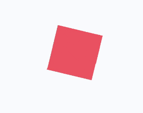

# 动画样式<a name="ZH-CN_TOPIC_0000001173164765"></a>

组件支持动态的旋转、平移、缩放效果，可在style或css中设置。

<a name="table1863253974"></a>
<table><thead align="left"><tr id="row786315538710"><th class="cellrowborder" valign="top" width="26.02%" id="mcps1.1.5.1.1"><p id="p108631953175"><a name="p108631953175"></a><a name="p108631953175"></a>名称</p>
</th>
<th class="cellrowborder" valign="top" width="18.529999999999998%" id="mcps1.1.5.1.2"><p id="p1486365316710"><a name="p1486365316710"></a><a name="p1486365316710"></a>类型</p>
</th>
<th class="cellrowborder" valign="top" width="13.900000000000002%" id="mcps1.1.5.1.3"><p id="p138637531275"><a name="p138637531275"></a><a name="p138637531275"></a>默认值</p>
</th>
<th class="cellrowborder" valign="top" width="41.55%" id="mcps1.1.5.1.4"><p id="p17863053878"><a name="p17863053878"></a><a name="p17863053878"></a>描述</p>
</th>
</tr>
</thead>
<tbody><tr id="row178631153474"><td class="cellrowborder" valign="top" width="26.02%" headers="mcps1.1.5.1.1 "><p id="p4863105311717"><a name="p4863105311717"></a><a name="p4863105311717"></a>transform-origin</p>
</td>
<td class="cellrowborder" valign="top" width="18.529999999999998%" headers="mcps1.1.5.1.2 "><p id="p19520834194416"><a name="p19520834194416"></a><a name="p19520834194416"></a>string<sup id="sup18345114116209"><a name="sup18345114116209"></a><a name="sup18345114116209"></a>6+</sup> | &lt;percentage&gt; | &lt;length&gt; string<sup id="sup126042215219"><a name="sup126042215219"></a><a name="sup126042215219"></a>6+</sup> | &lt;percentage&gt; | &lt;length&gt;</p>
</td>
<td class="cellrowborder" valign="top" width="13.900000000000002%" headers="mcps1.1.5.1.3 "><p id="p1986319537716"><a name="p1986319537716"></a><a name="p1986319537716"></a>center center</p>
</td>
<td class="cellrowborder" valign="top" width="41.55%" headers="mcps1.1.5.1.4 "><p id="p6867140201912"><a name="p6867140201912"></a><a name="p6867140201912"></a>变换对象的原点位置，支持px和百分比(相对于动画目标组件)，如果仅设置一个值，另一个值为50%，第一个string的可选值为：left | center | right ，第二个string的可选值为：top | center | bottom。</p>
<p id="p11863165316720"><a name="p11863165316720"></a><a name="p11863165316720"></a>示例：</p>
<p id="p146961332184513"><a name="p146961332184513"></a><a name="p146961332184513"></a>transform-origin: 200px 30%。</p>
<p id="p12696232144513"><a name="p12696232144513"></a><a name="p12696232144513"></a>transform-origin: 100px top。</p>
<p id="p14231729142211"><a name="p14231729142211"></a><a name="p14231729142211"></a>transform-origin: center center。</p>
</td>
</tr>
<tr id="row486314531779"><td class="cellrowborder" valign="top" width="26.02%" headers="mcps1.1.5.1.1 "><p id="p28641953175"><a name="p28641953175"></a><a name="p28641953175"></a>transform</p>
</td>
<td class="cellrowborder" valign="top" width="18.529999999999998%" headers="mcps1.1.5.1.2 "><p id="p1286475313710"><a name="p1286475313710"></a><a name="p1286475313710"></a>string</p>
</td>
<td class="cellrowborder" valign="top" width="13.900000000000002%" headers="mcps1.1.5.1.3 "><p id="p8864155311715"><a name="p8864155311715"></a><a name="p8864155311715"></a>-</p>
</td>
<td class="cellrowborder" valign="top" width="41.55%" headers="mcps1.1.5.1.4 "><p id="p52158111929"><a name="p52158111929"></a><a name="p52158111929"></a>支持同时设置平移/旋转/缩放的属性。</p>
<p id="p1286415319715"><a name="p1286415319715"></a><a name="p1286415319715"></a>详见<a href="#table28802443315">表1</a>。</p>
</td>
</tr>
<tr id="row185145292179"><td class="cellrowborder" valign="top" width="26.02%" headers="mcps1.1.5.1.1 "><p id="p2515142916172"><a name="p2515142916172"></a><a name="p2515142916172"></a>animation<sup id="sup17981125732213"><a name="sup17981125732213"></a><a name="sup17981125732213"></a>6+</sup></p>
</td>
<td class="cellrowborder" valign="top" width="18.529999999999998%" headers="mcps1.1.5.1.2 "><p id="p105152029111712"><a name="p105152029111712"></a><a name="p105152029111712"></a>string</p>
</td>
<td class="cellrowborder" valign="top" width="13.900000000000002%" headers="mcps1.1.5.1.3 "><p id="p125157290172"><a name="p125157290172"></a><a name="p125157290172"></a>0s ease 0s 1 normal none running none</p>
</td>
<td class="cellrowborder" valign="top" width="41.55%" headers="mcps1.1.5.1.4 "><p id="p1515152915179"><a name="p1515152915179"></a><a name="p1515152915179"></a>格式：duration | timing-function | delay | iteration-count | direction | fill-mode | play-state | name，每个字段不区分先后，但是 duration / delay 按照出现的先后顺序解析。</p>
</td>
</tr>
<tr id="row14864453877"><td class="cellrowborder" valign="top" width="26.02%" headers="mcps1.1.5.1.1 "><p id="p88641753677"><a name="p88641753677"></a><a name="p88641753677"></a>animation-name</p>
</td>
<td class="cellrowborder" valign="top" width="18.529999999999998%" headers="mcps1.1.5.1.2 "><p id="p20864853870"><a name="p20864853870"></a><a name="p20864853870"></a>string</p>
</td>
<td class="cellrowborder" valign="top" width="13.900000000000002%" headers="mcps1.1.5.1.3 "><p id="p158644534715"><a name="p158644534715"></a><a name="p158644534715"></a>-</p>
</td>
<td class="cellrowborder" valign="top" width="41.55%" headers="mcps1.1.5.1.4 "><p id="p58645531719"><a name="p58645531719"></a><a name="p58645531719"></a>指定@keyframes，详见<a href="#t48a722bba37a44c883ed4e046a4cf82e">表2</a>。</p>
</td>
</tr>
<tr id="row8864125319718"><td class="cellrowborder" valign="top" width="26.02%" headers="mcps1.1.5.1.1 "><p id="p128646539711"><a name="p128646539711"></a><a name="p128646539711"></a>animation-delay</p>
</td>
<td class="cellrowborder" valign="top" width="18.529999999999998%" headers="mcps1.1.5.1.2 "><p id="p1486418539720"><a name="p1486418539720"></a><a name="p1486418539720"></a>&lt;time&gt;</p>
</td>
<td class="cellrowborder" valign="top" width="13.900000000000002%" headers="mcps1.1.5.1.3 "><p id="p086445317716"><a name="p086445317716"></a><a name="p086445317716"></a>0</p>
</td>
<td class="cellrowborder" valign="top" width="41.55%" headers="mcps1.1.5.1.4 "><p id="p1864135310710"><a name="p1864135310710"></a><a name="p1864135310710"></a>定义动画播放的延迟时间。支持的单位为[s(秒)|ms(毫秒) ]，默认单位为ms，格式为：1000ms或1s。</p>
</td>
</tr>
<tr id="row11864135314712"><td class="cellrowborder" valign="top" width="26.02%" headers="mcps1.1.5.1.1 "><p id="p1586435311713"><a name="p1586435311713"></a><a name="p1586435311713"></a>animation-duration</p>
</td>
<td class="cellrowborder" valign="top" width="18.529999999999998%" headers="mcps1.1.5.1.2 "><p id="p16864135316714"><a name="p16864135316714"></a><a name="p16864135316714"></a>&lt;time&gt;</p>
</td>
<td class="cellrowborder" valign="top" width="13.900000000000002%" headers="mcps1.1.5.1.3 "><p id="p148641753971"><a name="p148641753971"></a><a name="p148641753971"></a>0</p>
</td>
<td class="cellrowborder" valign="top" width="41.55%" headers="mcps1.1.5.1.4 "><p id="p342192073412"><a name="p342192073412"></a><a name="p342192073412"></a>定义一个动画周期。支持的单位为[s(秒)|ms(毫秒) ]，默认单位为ms，格式为：1000ms或1s。</p>
<div class="note" id="note11257121119511"><a name="note11257121119511"></a><a name="note11257121119511"></a><span class="notetitle"> 说明： </span><div class="notebody"><p id="p126422011184410"><a name="p126422011184410"></a><a name="p126422011184410"></a>animation-duration 样式必须设置，否则时长为 0，则不会播放动画。</p>
</div></div>
</td>
</tr>
<tr id="row12864253377"><td class="cellrowborder" valign="top" width="26.02%" headers="mcps1.1.5.1.1 "><p id="p138641353779"><a name="p138641353779"></a><a name="p138641353779"></a>animation-iteration-count</p>
</td>
<td class="cellrowborder" valign="top" width="18.529999999999998%" headers="mcps1.1.5.1.2 "><p id="p68642532717"><a name="p68642532717"></a><a name="p68642532717"></a>number  | infinite</p>
</td>
<td class="cellrowborder" valign="top" width="13.900000000000002%" headers="mcps1.1.5.1.3 "><p id="p9864195312710"><a name="p9864195312710"></a><a name="p9864195312710"></a>1</p>
</td>
<td class="cellrowborder" valign="top" width="41.55%" headers="mcps1.1.5.1.4 "><p id="p138641653475"><a name="p138641653475"></a><a name="p138641653475"></a>定义动画播放的次数，默认播放一次，可通过设置为infinite无限次播放。</p>
</td>
</tr>
<tr id="row17864453976"><td class="cellrowborder" valign="top" width="26.02%" headers="mcps1.1.5.1.1 "><p id="p158650537712"><a name="p158650537712"></a><a name="p158650537712"></a>animation-timing-function</p>
</td>
<td class="cellrowborder" valign="top" width="18.529999999999998%" headers="mcps1.1.5.1.2 "><p id="p19865185313717"><a name="p19865185313717"></a><a name="p19865185313717"></a>string</p>
</td>
<td class="cellrowborder" valign="top" width="13.900000000000002%" headers="mcps1.1.5.1.3 "><p id="p686514531178"><a name="p686514531178"></a><a name="p686514531178"></a>ease</p>
</td>
<td class="cellrowborder" valign="top" width="41.55%" headers="mcps1.1.5.1.4 "><p id="p38652531974"><a name="p38652531974"></a><a name="p38652531974"></a>描述动画执行的速度曲线，用于使动画更为平滑。</p>
<p id="p586513531377"><a name="p586513531377"></a><a name="p586513531377"></a>可选项有：</p>
<a name="ul104958313219"></a><a name="ul104958313219"></a><ul id="ul104958313219"><li>linear：表示动画从头到尾的速度都是相同的。</li><li>ease：表示动画以低速开始，然后加快，在结束前变慢，cubic-bezier(0.25, 0.1, 0.25, 1.0)。</li><li>ease-in：表示动画以低速开始，cubic-bezier(0.42, 0.0, 1.0, 1.0)。</li><li>ease-out：表示动画以低速结束，cubic-bezier(0.0, 0.0, 0.58, 1.0)。</li><li>ease-in-out：表示动画以低速开始和结束，cubic-bezier(0.42, 0.0, 0.58, 1.0)。</li><li>friction：阻尼曲线，cubic-bezier(0.2, 0.0, 0.2, 1.0)。</li><li>extreme-deceleration：急缓曲线，cubic-bezier(0.0, 0.0, 0.0, 1.0)。</li><li>sharp：锐利曲线，cubic-bezier(0.33, 0.0, 0.67, 1.0)。</li><li>rhythm：节奏曲线，cubic-bezier(0.7, 0.0, 0.2, 1.0)。</li><li>smooth：平滑曲线，cubic-bezier(0.4, 0.0, 0.4, 1.0)。</li><li>cubic-bezier：在三次贝塞尔函数中定义动画变化过程，入参的x和y值必须处于0-1之间。</li><li>steps: 阶梯曲线<sup id="sup757555611248"><a name="sup757555611248"></a><a name="sup757555611248"></a><span>6+</span></sup>。语法：steps(number[, end|start])；number必须设置，支持的类型为正整数。第二个参数可选，表示在每个间隔的起点或是终点发生阶跃变化，支持设置end或start，默认值为end。</li></ul>
</td>
</tr>
<tr id="row14611141219587"><td class="cellrowborder" valign="top" width="26.02%" headers="mcps1.1.5.1.1 "><p id="p2611151295818"><a name="p2611151295818"></a><a name="p2611151295818"></a>animation-direction<sup id="sup3648049121713"><a name="sup3648049121713"></a><a name="sup3648049121713"></a>6+</sup></p>
</td>
<td class="cellrowborder" valign="top" width="18.529999999999998%" headers="mcps1.1.5.1.2 "><p id="p8611111210580"><a name="p8611111210580"></a><a name="p8611111210580"></a>string</p>
</td>
<td class="cellrowborder" valign="top" width="13.900000000000002%" headers="mcps1.1.5.1.3 "><p id="p2611412105816"><a name="p2611412105816"></a><a name="p2611412105816"></a>normal</p>
</td>
<td class="cellrowborder" valign="top" width="41.55%" headers="mcps1.1.5.1.4 "><p id="p5611151219588"><a name="p5611151219588"></a><a name="p5611151219588"></a>指定动画的播放模式：</p>
<a name="ul7721141717012"></a><a name="ul7721141717012"></a><ul id="ul7721141717012"><li>normal： 动画正向循环播放。</li><li>reverse： 动画反向循环播放。</li><li>alternate：动画交替循环播放，奇数次正向播放，偶数次反向播放。</li><li>alternate-reverse：动画反向交替循环播放，奇数次反向播放，偶数次正向播放。</li></ul>
</td>
</tr>
<tr id="row1686675319718"><td class="cellrowborder" valign="top" width="26.02%" headers="mcps1.1.5.1.1 "><p id="p886655314713"><a name="p886655314713"></a><a name="p886655314713"></a>animation-fill-mode</p>
</td>
<td class="cellrowborder" valign="top" width="18.529999999999998%" headers="mcps1.1.5.1.2 "><p id="p386625318718"><a name="p386625318718"></a><a name="p386625318718"></a>string</p>
</td>
<td class="cellrowborder" valign="top" width="13.900000000000002%" headers="mcps1.1.5.1.3 "><p id="p158661153171"><a name="p158661153171"></a><a name="p158661153171"></a>none</p>
</td>
<td class="cellrowborder" valign="top" width="41.55%" headers="mcps1.1.5.1.4 "><p id="p48661353174"><a name="p48661353174"></a><a name="p48661353174"></a>指定动画开始和结束的状态：</p>
<a name="ul6388194816"></a><a name="ul6388194816"></a><ul id="ul6388194816"><li>none：在动画执行之前和之后都不会应用任何样式到目标上。</li><li>forwards：在动画结束后，目标将保留动画结束时的状态（在最后一个关键帧中定义）。</li><li>backwards<sup id="sup8968322122016"><a name="sup8968322122016"></a><a name="sup8968322122016"></a><span>6+</span></sup>：动画将在animation-delay期间应用第一个关键帧中定义的值。当animation-direction为"normal"或"alternate"时应用from关键帧中的值，当animation-direction为"reverse"或"alternate-reverse"时应用to关键帧中的值。</li><li>both<sup id="sup7223121852016"><a name="sup7223121852016"></a><a name="sup7223121852016"></a><span>6+</span></sup>：动画将遵循forwards和backwards的规则，从而在两个方向上扩展动画属性。</li></ul>
</td>
</tr>
<tr id="row5395759219"><td class="cellrowborder" valign="top" width="26.02%" headers="mcps1.1.5.1.1 "><p id="p93951251929"><a name="p93951251929"></a><a name="p93951251929"></a>animation-play-state<sup id="sup492164917239"><a name="sup492164917239"></a><a name="sup492164917239"></a>6+</sup></p>
</td>
<td class="cellrowborder" valign="top" width="18.529999999999998%" headers="mcps1.1.5.1.2 "><p id="p3395351723"><a name="p3395351723"></a><a name="p3395351723"></a>string</p>
</td>
<td class="cellrowborder" valign="top" width="13.900000000000002%" headers="mcps1.1.5.1.3 "><p id="p1939545727"><a name="p1939545727"></a><a name="p1939545727"></a>running</p>
</td>
<td class="cellrowborder" valign="top" width="41.55%" headers="mcps1.1.5.1.4 "><p id="p173951158217"><a name="p173951158217"></a><a name="p173951158217"></a>指定动画的当前状态：</p>
<a name="ul1857213301839"></a><a name="ul1857213301839"></a><ul id="ul1857213301839"><li>paused：动画状态为暂停。</li><li>running：动画状态为播放。</li></ul>
</td>
</tr>
<tr id="row37171701451"><td class="cellrowborder" valign="top" width="26.02%" headers="mcps1.1.5.1.1 "><p id="p177174010450"><a name="p177174010450"></a><a name="p177174010450"></a>transition<sup id="sup5232112211383"><a name="sup5232112211383"></a><a name="sup5232112211383"></a>6+</sup></p>
</td>
<td class="cellrowborder" valign="top" width="18.529999999999998%" headers="mcps1.1.5.1.2 "><p id="p197175014510"><a name="p197175014510"></a><a name="p197175014510"></a>string</p>
</td>
<td class="cellrowborder" valign="top" width="13.900000000000002%" headers="mcps1.1.5.1.3 "><p id="p187171018459"><a name="p187171018459"></a><a name="p187171018459"></a>all 0 ease 0</p>
</td>
<td class="cellrowborder" valign="top" width="41.55%" headers="mcps1.1.5.1.4 "><p id="p11717160134515"><a name="p11717160134515"></a><a name="p11717160134515"></a>指定组件状态切换时的过渡效果，可以通过transition属性设置如下四个属性：</p>
<a name="ul17509159164618"></a><a name="ul17509159164618"></a><ul id="ul17509159164618"><li>transition-property：规定设置过渡效果的 CSS 属性的名称，目前支持宽、高、背景色。</li><li>transition-duration：规定完成过渡效果需要的时间，单位秒。</li><li>transition-timing-function：规定过渡效果的时间曲线，支持样式动画提供的曲线。</li><li>transition-delay：规定过渡效果延时启动时间，单位秒。</li></ul>
</td>
</tr>
</tbody>
</table>

**表 1**  transform操作说明

<a name="table28802443315"></a>
<table><thead align="left"><tr id="row88808448314"><th class="cellrowborder" valign="top" width="18.04%" id="mcps1.2.4.1.1"><p id="p88808441132"><a name="p88808441132"></a><a name="p88808441132"></a>名称</p>
</th>
<th class="cellrowborder" valign="top" width="27.71%" id="mcps1.2.4.1.2"><p id="p16880244334"><a name="p16880244334"></a><a name="p16880244334"></a>类型</p>
</th>
<th class="cellrowborder" valign="top" width="54.25%" id="mcps1.2.4.1.3"><p id="p198802443316"><a name="p198802443316"></a><a name="p198802443316"></a>描述</p>
</th>
</tr>
</thead>
<tbody><tr id="row118991421721"><td class="cellrowborder" valign="top" width="18.04%" headers="mcps1.2.4.1.1 "><p id="p1489911424212"><a name="p1489911424212"></a><a name="p1489911424212"></a>none<sup id="sup1967602632417"><a name="sup1967602632417"></a><a name="sup1967602632417"></a>6+</sup></p>
</td>
<td class="cellrowborder" valign="top" width="27.71%" headers="mcps1.2.4.1.2 "><p id="p2089924219219"><a name="p2089924219219"></a><a name="p2089924219219"></a>-</p>
</td>
<td class="cellrowborder" valign="top" width="54.25%" headers="mcps1.2.4.1.3 "><p id="p1389911421925"><a name="p1389911421925"></a><a name="p1389911421925"></a>不进行任何转换。</p>
</td>
</tr>
<tr id="row7676184815318"><td class="cellrowborder" valign="top" width="18.04%" headers="mcps1.2.4.1.1 "><p id="p136778482035"><a name="p136778482035"></a><a name="p136778482035"></a>matrix<sup id="sup4601727102410"><a name="sup4601727102410"></a><a name="sup4601727102410"></a>6+</sup></p>
</td>
<td class="cellrowborder" valign="top" width="27.71%" headers="mcps1.2.4.1.2 "><p id="p46778481138"><a name="p46778481138"></a><a name="p46778481138"></a>&lt;number&gt;</p>
</td>
<td class="cellrowborder" valign="top" width="54.25%" headers="mcps1.2.4.1.3 "><p id="p1067774812320"><a name="p1067774812320"></a><a name="p1067774812320"></a>入参为六个值的矩阵，6个值分别代表：scaleX, skewY, skewX, scaleY, translateX, translateY。</p>
</td>
</tr>
<tr id="row148261231616"><td class="cellrowborder" valign="top" width="18.04%" headers="mcps1.2.4.1.1 "><p id="p6826939618"><a name="p6826939618"></a><a name="p6826939618"></a>matrix3d<sup id="sup934382819242"><a name="sup934382819242"></a><a name="sup934382819242"></a>6+</sup></p>
</td>
<td class="cellrowborder" valign="top" width="27.71%" headers="mcps1.2.4.1.2 "><p id="p108261231861"><a name="p108261231861"></a><a name="p108261231861"></a>&lt;number&gt;</p>
</td>
<td class="cellrowborder" valign="top" width="54.25%" headers="mcps1.2.4.1.3 "><p id="p4826233618"><a name="p4826233618"></a><a name="p4826233618"></a>入参为十六个值的4X4矩阵。</p>
</td>
</tr>
<tr id="row1588011441433"><td class="cellrowborder" valign="top" width="18.04%" headers="mcps1.2.4.1.1 "><p id="p1188018441039"><a name="p1188018441039"></a><a name="p1188018441039"></a>translate</p>
</td>
<td class="cellrowborder" valign="top" width="27.71%" headers="mcps1.2.4.1.2 "><p id="p288015447310"><a name="p288015447310"></a><a name="p288015447310"></a>&lt;length&gt;<span id="ph168318101405"><a name="ph168318101405"></a><a name="ph168318101405"></a>| &lt;percent&gt;</span></p>
</td>
<td class="cellrowborder" valign="top" width="54.25%" headers="mcps1.2.4.1.3 "><p id="p98811441934"><a name="p98811441934"></a><a name="p98811441934"></a>平移动画属性，支持设置x轴和y轴两个维度的平移参数。</p>
</td>
</tr>
<tr id="row1587109072"><td class="cellrowborder" valign="top" width="18.04%" headers="mcps1.2.4.1.1 "><p id="p658717916714"><a name="p658717916714"></a><a name="p658717916714"></a>translate3d<sup id="sup1636232912416"><a name="sup1636232912416"></a><a name="sup1636232912416"></a>6+</sup></p>
</td>
<td class="cellrowborder" valign="top" width="27.71%" headers="mcps1.2.4.1.2 "><p id="p1858749477"><a name="p1858749477"></a><a name="p1858749477"></a>&lt;length&gt;| &lt;percent&gt;</p>
</td>
<td class="cellrowborder" valign="top" width="54.25%" headers="mcps1.2.4.1.3 "><p id="p75871991872"><a name="p75871991872"></a><a name="p75871991872"></a>三个入参，分别代表X轴、Y轴、Z轴的平移距离。</p>
</td>
</tr>
<tr id="row088154420311"><td class="cellrowborder" valign="top" width="18.04%" headers="mcps1.2.4.1.1 "><p id="p1688124420315"><a name="p1688124420315"></a><a name="p1688124420315"></a>translateX</p>
</td>
<td class="cellrowborder" valign="top" width="27.71%" headers="mcps1.2.4.1.2 "><p id="p208813441237"><a name="p208813441237"></a><a name="p208813441237"></a>&lt;length&gt;<span id="ph108741224400"><a name="ph108741224400"></a><a name="ph108741224400"></a>| &lt;percent&gt;</span></p>
</td>
<td class="cellrowborder" valign="top" width="54.25%" headers="mcps1.2.4.1.3 "><p id="p688112441132"><a name="p688112441132"></a><a name="p688112441132"></a>X轴方向平移动画属性。</p>
</td>
</tr>
<tr id="row08816441839"><td class="cellrowborder" valign="top" width="18.04%" headers="mcps1.2.4.1.1 "><p id="p1588110447311"><a name="p1588110447311"></a><a name="p1588110447311"></a>translateY</p>
</td>
<td class="cellrowborder" valign="top" width="27.71%" headers="mcps1.2.4.1.2 "><p id="p288118441533"><a name="p288118441533"></a><a name="p288118441533"></a>&lt;length&gt;<span id="ph2207350401"><a name="ph2207350401"></a><a name="ph2207350401"></a>| &lt;percent&gt;</span></p>
</td>
<td class="cellrowborder" valign="top" width="54.25%" headers="mcps1.2.4.1.3 "><p id="p38818447314"><a name="p38818447314"></a><a name="p38818447314"></a>Y轴方向平移动画属性。</p>
</td>
</tr>
<tr id="row88403013913"><td class="cellrowborder" valign="top" width="18.04%" headers="mcps1.2.4.1.1 "><p id="p10840170391"><a name="p10840170391"></a><a name="p10840170391"></a>translateZ<sup id="sup1710163082419"><a name="sup1710163082419"></a><a name="sup1710163082419"></a>6+</sup></p>
</td>
<td class="cellrowborder" valign="top" width="27.71%" headers="mcps1.2.4.1.2 "><p id="p88408010916"><a name="p88408010916"></a><a name="p88408010916"></a>&lt;length&gt;| &lt;percent&gt;</p>
</td>
<td class="cellrowborder" valign="top" width="54.25%" headers="mcps1.2.4.1.3 "><p id="p1984090492"><a name="p1984090492"></a><a name="p1984090492"></a>Z轴的平移距离。</p>
</td>
</tr>
<tr id="row288111441037"><td class="cellrowborder" valign="top" width="18.04%" headers="mcps1.2.4.1.1 "><p id="p988164419317"><a name="p988164419317"></a><a name="p988164419317"></a>scale</p>
</td>
<td class="cellrowborder" valign="top" width="27.71%" headers="mcps1.2.4.1.2 "><p id="p0881744132"><a name="p0881744132"></a><a name="p0881744132"></a>&lt;number&gt;</p>
</td>
<td class="cellrowborder" valign="top" width="54.25%" headers="mcps1.2.4.1.3 "><p id="p5881114412312"><a name="p5881114412312"></a><a name="p5881114412312"></a>缩放动画属性，支持设置x轴和y轴两个维度的缩放参数。</p>
</td>
</tr>
<tr id="row5893240595"><td class="cellrowborder" valign="top" width="18.04%" headers="mcps1.2.4.1.1 "><p id="p88936401595"><a name="p88936401595"></a><a name="p88936401595"></a>scale3d<sup id="sup177701631152416"><a name="sup177701631152416"></a><a name="sup177701631152416"></a>6+</sup></p>
</td>
<td class="cellrowborder" valign="top" width="27.71%" headers="mcps1.2.4.1.2 "><p id="p18937401991"><a name="p18937401991"></a><a name="p18937401991"></a>&lt;number&gt;</p>
</td>
<td class="cellrowborder" valign="top" width="54.25%" headers="mcps1.2.4.1.3 "><p id="p1089317401198"><a name="p1089317401198"></a><a name="p1089317401198"></a>三个入参，分别代表X轴、Y轴、Z轴的缩放参数。</p>
</td>
</tr>
<tr id="row088117445315"><td class="cellrowborder" valign="top" width="18.04%" headers="mcps1.2.4.1.1 "><p id="p7881164417311"><a name="p7881164417311"></a><a name="p7881164417311"></a>scaleX</p>
</td>
<td class="cellrowborder" valign="top" width="27.71%" headers="mcps1.2.4.1.2 "><p id="p128816446311"><a name="p128816446311"></a><a name="p128816446311"></a>&lt;number&gt;</p>
</td>
<td class="cellrowborder" valign="top" width="54.25%" headers="mcps1.2.4.1.3 "><p id="p388112446310"><a name="p388112446310"></a><a name="p388112446310"></a>X轴方向缩放动画属性。</p>
</td>
</tr>
<tr id="row78813444315"><td class="cellrowborder" valign="top" width="18.04%" headers="mcps1.2.4.1.1 "><p id="p1988144419319"><a name="p1988144419319"></a><a name="p1988144419319"></a>scaleY</p>
</td>
<td class="cellrowborder" valign="top" width="27.71%" headers="mcps1.2.4.1.2 "><p id="p2881124416314"><a name="p2881124416314"></a><a name="p2881124416314"></a>&lt;number&gt;</p>
</td>
<td class="cellrowborder" valign="top" width="54.25%" headers="mcps1.2.4.1.3 "><p id="p128815441936"><a name="p128815441936"></a><a name="p128815441936"></a>Y轴方向缩放动画属性。</p>
</td>
</tr>
<tr id="row19226926101018"><td class="cellrowborder" valign="top" width="18.04%" headers="mcps1.2.4.1.1 "><p id="p1022752614102"><a name="p1022752614102"></a><a name="p1022752614102"></a>scaleZ<sup id="sup25801633192410"><a name="sup25801633192410"></a><a name="sup25801633192410"></a>6+</sup></p>
</td>
<td class="cellrowborder" valign="top" width="27.71%" headers="mcps1.2.4.1.2 "><p id="p1822742616107"><a name="p1822742616107"></a><a name="p1822742616107"></a>&lt;number&gt;</p>
</td>
<td class="cellrowborder" valign="top" width="54.25%" headers="mcps1.2.4.1.3 "><p id="p3227142611100"><a name="p3227142611100"></a><a name="p3227142611100"></a>Z轴的缩放参数。</p>
</td>
</tr>
<tr id="row1488114441539"><td class="cellrowborder" valign="top" width="18.04%" headers="mcps1.2.4.1.1 "><p id="p1888104411314"><a name="p1888104411314"></a><a name="p1888104411314"></a>rotate</p>
</td>
<td class="cellrowborder" valign="top" width="27.71%" headers="mcps1.2.4.1.2 "><p id="p168825447318"><a name="p168825447318"></a><a name="p168825447318"></a>&lt;deg&gt; | &lt;rad&gt; | &lt;grad&gt;<sup id="sup579512297266"><a name="sup579512297266"></a><a name="sup579512297266"></a>6+</sup> | &lt;turn&gt;<sup id="sup819119310267"><a name="sup819119310267"></a><a name="sup819119310267"></a>6+</sup></p>
</td>
<td class="cellrowborder" valign="top" width="54.25%" headers="mcps1.2.4.1.3 "><p id="p8882194415317"><a name="p8882194415317"></a><a name="p8882194415317"></a>旋转动画属性<span id="ph146515256413"><a name="ph146515256413"></a><a name="ph146515256413"></a>，支持设置x轴和y轴两个维度的选中参数。</span></p>
</td>
</tr>
<tr id="row227313741118"><td class="cellrowborder" valign="top" width="18.04%" headers="mcps1.2.4.1.1 "><p id="p162731074115"><a name="p162731074115"></a><a name="p162731074115"></a>rotate3d<sup id="sup75616348243"><a name="sup75616348243"></a><a name="sup75616348243"></a>6+</sup></p>
</td>
<td class="cellrowborder" valign="top" width="27.71%" headers="mcps1.2.4.1.2 "><p id="p2273177114"><a name="p2273177114"></a><a name="p2273177114"></a>&lt;deg&gt; | &lt;rad&gt; | &lt;grad&gt; | &lt;turn&gt;</p>
</td>
<td class="cellrowborder" valign="top" width="54.25%" headers="mcps1.2.4.1.3 "><p id="p927318720114"><a name="p927318720114"></a><a name="p927318720114"></a>四个入参，前三个分别为X轴、Y轴、Z轴的旋转向量，第四个是旋转角度。</p>
</td>
</tr>
<tr id="row188821744736"><td class="cellrowborder" valign="top" width="18.04%" headers="mcps1.2.4.1.1 "><p id="p7882744632"><a name="p7882744632"></a><a name="p7882744632"></a>rotateX</p>
</td>
<td class="cellrowborder" valign="top" width="27.71%" headers="mcps1.2.4.1.2 "><p id="p78821744632"><a name="p78821744632"></a><a name="p78821744632"></a>&lt;deg&gt; | &lt;rad&gt; | &lt;grad&gt;<sup id="sup1349763518269"><a name="sup1349763518269"></a><a name="sup1349763518269"></a>6+</sup> | &lt;turn&gt;<sup id="sup315743792618"><a name="sup315743792618"></a><a name="sup315743792618"></a>6+</sup></p>
</td>
<td class="cellrowborder" valign="top" width="54.25%" headers="mcps1.2.4.1.3 "><p id="p588217441134"><a name="p588217441134"></a><a name="p588217441134"></a>X轴方向旋转动画属性。</p>
</td>
</tr>
<tr id="row1488294410320"><td class="cellrowborder" valign="top" width="18.04%" headers="mcps1.2.4.1.1 "><p id="p108826442034"><a name="p108826442034"></a><a name="p108826442034"></a>rotateY</p>
</td>
<td class="cellrowborder" valign="top" width="27.71%" headers="mcps1.2.4.1.2 "><p id="p388213445311"><a name="p388213445311"></a><a name="p388213445311"></a>&lt;deg&gt; | &lt;rad&gt; | &lt;grad&gt;<sup id="sup136713509264"><a name="sup136713509264"></a><a name="sup136713509264"></a>6+</sup> | &lt;turn&gt;<sup id="sup16487751122612"><a name="sup16487751122612"></a><a name="sup16487751122612"></a>6+</sup></p>
</td>
<td class="cellrowborder" valign="top" width="54.25%" headers="mcps1.2.4.1.3 "><p id="p8882544638"><a name="p8882544638"></a><a name="p8882544638"></a>Y轴方向旋转动画属性。</p>
</td>
</tr>
<tr id="row25591113181511"><td class="cellrowborder" valign="top" width="18.04%" headers="mcps1.2.4.1.1 "><p id="p195609136152"><a name="p195609136152"></a><a name="p195609136152"></a>rotateZ<sup id="sup93037363243"><a name="sup93037363243"></a><a name="sup93037363243"></a>6+</sup></p>
</td>
<td class="cellrowborder" valign="top" width="27.71%" headers="mcps1.2.4.1.2 "><p id="p25601136154"><a name="p25601136154"></a><a name="p25601136154"></a>&lt;deg&gt; | &lt;rad&gt; | &lt;grad&gt; | &lt;turn&gt;</p>
</td>
<td class="cellrowborder" valign="top" width="54.25%" headers="mcps1.2.4.1.3 "><p id="p956014135155"><a name="p956014135155"></a><a name="p956014135155"></a>Z轴方向的旋转角度。</p>
</td>
</tr>
<tr id="row113601458141519"><td class="cellrowborder" valign="top" width="18.04%" headers="mcps1.2.4.1.1 "><p id="p2036055818158"><a name="p2036055818158"></a><a name="p2036055818158"></a>skew<sup id="sup156881037172418"><a name="sup156881037172418"></a><a name="sup156881037172418"></a>6+</sup></p>
</td>
<td class="cellrowborder" valign="top" width="27.71%" headers="mcps1.2.4.1.2 "><p id="p1936055816154"><a name="p1936055816154"></a><a name="p1936055816154"></a>&lt;deg&gt; | &lt;rad&gt; | &lt;grad&gt; | &lt;turn&gt;</p>
</td>
<td class="cellrowborder" valign="top" width="54.25%" headers="mcps1.2.4.1.3 "><p id="p2360558151514"><a name="p2360558151514"></a><a name="p2360558151514"></a>两个入参，分别为X轴和Y轴的2D倾斜角度。</p>
</td>
</tr>
<tr id="row1419525191617"><td class="cellrowborder" valign="top" width="18.04%" headers="mcps1.2.4.1.1 "><p id="p11195185151618"><a name="p11195185151618"></a><a name="p11195185151618"></a>skewX<sup id="sup95893383244"><a name="sup95893383244"></a><a name="sup95893383244"></a>6+</sup></p>
</td>
<td class="cellrowborder" valign="top" width="27.71%" headers="mcps1.2.4.1.2 "><p id="p101951954163"><a name="p101951954163"></a><a name="p101951954163"></a>&lt;deg&gt; | &lt;rad&gt; | &lt;grad&gt; | &lt;turn&gt;</p>
</td>
<td class="cellrowborder" valign="top" width="54.25%" headers="mcps1.2.4.1.3 "><p id="p019510511168"><a name="p019510511168"></a><a name="p019510511168"></a>X轴的2D倾斜角度。</p>
</td>
</tr>
<tr id="row1339081010166"><td class="cellrowborder" valign="top" width="18.04%" headers="mcps1.2.4.1.1 "><p id="p239018103166"><a name="p239018103166"></a><a name="p239018103166"></a>skewY<sup id="sup16994402243"><a name="sup16994402243"></a><a name="sup16994402243"></a>6+</sup></p>
</td>
<td class="cellrowborder" valign="top" width="27.71%" headers="mcps1.2.4.1.2 "><p id="p83901110191616"><a name="p83901110191616"></a><a name="p83901110191616"></a>&lt;deg&gt; | &lt;rad&gt; | &lt;grad&gt; | &lt;turn&gt;</p>
</td>
<td class="cellrowborder" valign="top" width="54.25%" headers="mcps1.2.4.1.3 "><p id="p1139013100165"><a name="p1139013100165"></a><a name="p1139013100165"></a>Y轴的2D倾斜角度。</p>
</td>
</tr>
<tr id="row15186755191516"><td class="cellrowborder" valign="top" width="18.04%" headers="mcps1.2.4.1.1 "><p id="p8186125512157"><a name="p8186125512157"></a><a name="p8186125512157"></a>perspective<sup id="sup12201741102411"><a name="sup12201741102411"></a><a name="sup12201741102411"></a>6+</sup></p>
</td>
<td class="cellrowborder" valign="top" width="27.71%" headers="mcps1.2.4.1.2 "><p id="p618610552153"><a name="p618610552153"></a><a name="p618610552153"></a>&lt;number&gt;</p>
</td>
<td class="cellrowborder" valign="top" width="54.25%" headers="mcps1.2.4.1.3 "><p id="p818755519156"><a name="p818755519156"></a><a name="p818755519156"></a>3D透视场景下镜头距离元素表面的距离。</p>
</td>
</tr>
</tbody>
</table>

**表 2**  @keyframes属性说明

<a name="t48a722bba37a44c883ed4e046a4cf82e"></a>
<table><thead align="left"><tr id="r856a9393ccf4423ba47ec1b9ed96bb8e"><th class="cellrowborder" valign="top" width="24.242424242424242%" id="mcps1.2.5.1.1"><p id="ae7a02418e61f4e1db82e64f0e2f1c09e"><a name="ae7a02418e61f4e1db82e64f0e2f1c09e"></a><a name="ae7a02418e61f4e1db82e64f0e2f1c09e"></a>名称</p>
</th>
<th class="cellrowborder" valign="top" width="17.581758175817583%" id="mcps1.2.5.1.2"><p id="a4cee3e18cb724963be38ac53355b7b4d"><a name="a4cee3e18cb724963be38ac53355b7b4d"></a><a name="a4cee3e18cb724963be38ac53355b7b4d"></a>类型</p>
</th>
<th class="cellrowborder" valign="top" width="11.71117111711171%" id="mcps1.2.5.1.3"><p id="a3e0026aad554469d964bbc102a8eaadb"><a name="a3e0026aad554469d964bbc102a8eaadb"></a><a name="a3e0026aad554469d964bbc102a8eaadb"></a>默认值</p>
</th>
<th class="cellrowborder" valign="top" width="46.464646464646464%" id="mcps1.2.5.1.4"><p id="a2b58cc16430e4420b7e9ab323cab292d"><a name="a2b58cc16430e4420b7e9ab323cab292d"></a><a name="a2b58cc16430e4420b7e9ab323cab292d"></a>描述</p>
</th>
</tr>
</thead>
<tbody><tr id="r452ea683f0af4624a69c836abfcdc440"><td class="cellrowborder" valign="top" width="24.242424242424242%" headers="mcps1.2.5.1.1 "><p id="a5eb36c26384742ba9e99adc2493de600"><a name="a5eb36c26384742ba9e99adc2493de600"></a><a name="a5eb36c26384742ba9e99adc2493de600"></a>background-color</p>
</td>
<td class="cellrowborder" valign="top" width="17.581758175817583%" headers="mcps1.2.5.1.2 "><p id="abc67b94bfbcb4d64a00cfe2e1e372b6d"><a name="abc67b94bfbcb4d64a00cfe2e1e372b6d"></a><a name="abc67b94bfbcb4d64a00cfe2e1e372b6d"></a>&lt;color&gt;</p>
</td>
<td class="cellrowborder" valign="top" width="11.71117111711171%" headers="mcps1.2.5.1.3 "><p id="ab027f70b389742bbb69fa1665a1aaaf6"><a name="ab027f70b389742bbb69fa1665a1aaaf6"></a><a name="ab027f70b389742bbb69fa1665a1aaaf6"></a>-</p>
</td>
<td class="cellrowborder" valign="top" width="46.464646464646464%" headers="mcps1.2.5.1.4 "><p id="a2a9535e7a520474eaa5ca78ca61ca148"><a name="a2a9535e7a520474eaa5ca78ca61ca148"></a><a name="a2a9535e7a520474eaa5ca78ca61ca148"></a>动画执行后应用到组件上的背景颜色。</p>
</td>
</tr>
<tr id="rb2e92403cacf4ce283fd5e3c625635c5"><td class="cellrowborder" valign="top" width="24.242424242424242%" headers="mcps1.2.5.1.1 "><p id="afd219ea8c1384a3c84d4e7ca09be073c"><a name="afd219ea8c1384a3c84d4e7ca09be073c"></a><a name="afd219ea8c1384a3c84d4e7ca09be073c"></a>opacity</p>
</td>
<td class="cellrowborder" valign="top" width="17.581758175817583%" headers="mcps1.2.5.1.2 "><p id="a89cf6dcf06954b37a77fb21ff2140188"><a name="a89cf6dcf06954b37a77fb21ff2140188"></a><a name="a89cf6dcf06954b37a77fb21ff2140188"></a>number</p>
</td>
<td class="cellrowborder" valign="top" width="11.71117111711171%" headers="mcps1.2.5.1.3 "><p id="a2718c52ec5574f49a263ccd45d448656"><a name="a2718c52ec5574f49a263ccd45d448656"></a><a name="a2718c52ec5574f49a263ccd45d448656"></a>1</p>
</td>
<td class="cellrowborder" valign="top" width="46.464646464646464%" headers="mcps1.2.5.1.4 "><p id="a6bcdedbaaa87470cae3e3beea1b67aad"><a name="a6bcdedbaaa87470cae3e3beea1b67aad"></a><a name="a6bcdedbaaa87470cae3e3beea1b67aad"></a>动画执行后应用到组件上的不透明度值，为介于0到1间的数值，默认为1。</p>
</td>
</tr>
<tr id="row13625142317305"><td class="cellrowborder" valign="top" width="24.242424242424242%" headers="mcps1.2.5.1.1 "><p id="p116261023163017"><a name="p116261023163017"></a><a name="p116261023163017"></a>width</p>
</td>
<td class="cellrowborder" valign="top" width="17.581758175817583%" headers="mcps1.2.5.1.2 "><p id="p5647133543013"><a name="p5647133543013"></a><a name="p5647133543013"></a>&lt;length&gt;</p>
</td>
<td class="cellrowborder" valign="top" width="11.71117111711171%" headers="mcps1.2.5.1.3 "><p id="p13626202319305"><a name="p13626202319305"></a><a name="p13626202319305"></a>-</p>
</td>
<td class="cellrowborder" valign="top" width="46.464646464646464%" headers="mcps1.2.5.1.4 "><p id="p562617236301"><a name="p562617236301"></a><a name="p562617236301"></a>动画执行后应用到组件上的宽度值。</p>
</td>
</tr>
<tr id="rf77cedb94a3c4c9a8556a2a2a3876997"><td class="cellrowborder" valign="top" width="24.242424242424242%" headers="mcps1.2.5.1.1 "><p id="a2f05af1c56e34ed4aa900b467dcf3bb7"><a name="a2f05af1c56e34ed4aa900b467dcf3bb7"></a><a name="a2f05af1c56e34ed4aa900b467dcf3bb7"></a>height</p>
</td>
<td class="cellrowborder" valign="top" width="17.581758175817583%" headers="mcps1.2.5.1.2 "><p id="af3cdb37ab1cc46ac823bee3784909613"><a name="af3cdb37ab1cc46ac823bee3784909613"></a><a name="af3cdb37ab1cc46ac823bee3784909613"></a>&lt;length&gt;</p>
</td>
<td class="cellrowborder" valign="top" width="11.71117111711171%" headers="mcps1.2.5.1.3 "><p id="a35aa8df3690b4b169f67360826114e7f"><a name="a35aa8df3690b4b169f67360826114e7f"></a><a name="a35aa8df3690b4b169f67360826114e7f"></a>-</p>
</td>
<td class="cellrowborder" valign="top" width="46.464646464646464%" headers="mcps1.2.5.1.4 "><p id="a0ecbff2f02ac42ffb797b9bcae919003"><a name="a0ecbff2f02ac42ffb797b9bcae919003"></a><a name="a0ecbff2f02ac42ffb797b9bcae919003"></a>动画执行后应用到组件上的高度值。</p>
</td>
</tr>
<tr id="r43ece702a1c945f08cd7eb195b5faac3"><td class="cellrowborder" valign="top" width="24.242424242424242%" headers="mcps1.2.5.1.1 "><p id="aa51ca83ead4c4c00b078f3d2c1e7e66b"><a name="aa51ca83ead4c4c00b078f3d2c1e7e66b"></a><a name="aa51ca83ead4c4c00b078f3d2c1e7e66b"></a>transform</p>
</td>
<td class="cellrowborder" valign="top" width="17.581758175817583%" headers="mcps1.2.5.1.2 "><p id="a44aec140ddba46b19c96be3ef58468c6"><a name="a44aec140ddba46b19c96be3ef58468c6"></a><a name="a44aec140ddba46b19c96be3ef58468c6"></a>string</p>
</td>
<td class="cellrowborder" valign="top" width="11.71117111711171%" headers="mcps1.2.5.1.3 "><p id="af2ea25b4333d490d9723dec6c6d1709f"><a name="af2ea25b4333d490d9723dec6c6d1709f"></a><a name="af2ea25b4333d490d9723dec6c6d1709f"></a>-</p>
</td>
<td class="cellrowborder" valign="top" width="46.464646464646464%" headers="mcps1.2.5.1.4 "><p id="adff3debf36764e5c868ca9823663cd5b"><a name="adff3debf36764e5c868ca9823663cd5b"></a><a name="adff3debf36764e5c868ca9823663cd5b"></a>定义应用在组件上的变换类型，见<a href="#table28802443315">表1</a>。</p>
</td>
</tr>
<tr id="row1745310341966"><td class="cellrowborder" valign="top" width="24.242424242424242%" headers="mcps1.2.5.1.1 "><p id="p6453634366"><a name="p6453634366"></a><a name="p6453634366"></a>background-position<sup id="sup736717438275"><a name="sup736717438275"></a><a name="sup736717438275"></a>6+</sup></p>
</td>
<td class="cellrowborder" valign="top" width="17.581758175817583%" headers="mcps1.2.5.1.2 "><p id="p1552710366310"><a name="p1552710366310"></a><a name="p1552710366310"></a>string | &lt;percentage&gt; | &lt;length&gt; string | &lt;percentage&gt; | &lt;length&gt;</p>
</td>
<td class="cellrowborder" valign="top" width="11.71117111711171%" headers="mcps1.2.5.1.3 "><p id="p34533341167"><a name="p34533341167"></a><a name="p34533341167"></a>50% 50%</p>
</td>
<td class="cellrowborder" valign="top" width="46.464646464646464%" headers="mcps1.2.5.1.4 "><p id="p14867144143014"><a name="p14867144143014"></a><a name="p14867144143014"></a>背景图位置。单位支持百分比和px，第一个值是水平位置，第二个值是垂直位置。如果仅设置一个值，另一个值为50%。第一个string的可选值为：left | center | right ，第二个string的可选值为：top | center | bottom。</p>
<p id="p1345315341569"><a name="p1345315341569"></a><a name="p1345315341569"></a>示例：</p>
<a name="ul19908143113422"></a><a name="ul19908143113422"></a><ul id="ul19908143113422"><li>background-position: 200px 30%</li><li>background-position: 100px top</li><li>background-position: center center</li></ul>
</td>
</tr>
</tbody>
</table>

对于不支持起始值或终止值缺省的情况，可以通过from和to显示指定起始和结束。可以通过百分比指定动画运行的中间状态<sup>6+</sup>。示例：

```
<div class="container">
  <div class="rect">
  </div>
</div>
```

```
.container {
  display: flex;
  justify-content: center;
  align-items: center;
}
.rect{
  width: 200px;
  height: 200px;
  background-color: #f76160;
  animation: Go 3s infinite;
}
@keyframes Go
{
  from {
    background-color: #f76160;
    transform:translate(100px) rotate(0deg) scale(1.0);
  }
  /* 可以通过百分比指定动画运行的中间状态6+ */
  50% {
    background-color: #f76160;
    transform:translate(100px) rotate(60deg) scale(1.3);
  }
  to {
    background-color: #09ba07;
    transform:translate(100px) rotate(180deg) scale(2.0);
  }
}
```



```
<!-- xxx.hml -->
<div class="container">
  <div class="simpleAnimation simpleSize" style="animation-play-state: {{playState}}"></div>
  <text onclick="toggleState">animation-play-state: {{playState}}</text>
</div>
```

```
/* xxx.css */
.container {
  flex-direction: column;
  justify-content: center;
  align-items: center;
}
.simpleSize {
  background-color: blue;
  width: 100px;
  height: 100px;
}
.simpleAnimation {
  animation: simpleFrames 9s;
}
@keyframes simpleFrames {
  from { transform: translateX(0px); }
  to { transform: translateX(100px); }
}
```

```
// xxx.js
export default {
  data: {
    title: "",
    playState: "running"
  },
  toggleState() {
    if (this.playState ===  "running") {
      this.playState = "paused";
    } else {
      this.playState = "running";
    }
  }
}
```


```
<!-- xxx.hml -->
<div id='img' class="img"></div>
```

```
/* xxx.css */
.img {
  width: 294px;
  height: 233px;
  background-image: url('common/heartBeat.jpg');
  background-repeat: no-repeat;
  background-position: 0% 0%;
  background-size: 900%;
  animation-name: heartBeating;
  animation-duration: 1s;
  animation-delay: 0s;
  animation-fill-mode: forwards;
  animation-iteration-count: -1;
  animation-timing-function: steps(8, end);
}

@keyframes heartBeating {
  from { background-position: 0% 0%;}
  to { background-position: 100% 0%;}
}
```

```
<!-- xxx.hml -->
<div class="container">
  <div class="content"></div>
</div>
```

```
/* xxx.css */
.container {
    flex-direction: column;
    justify-content: center;
    align-items: center;
}
.content { /* 组件状态1 */
    height: 200px;
    width: 200px;
    background-color: red;
    transition: all 5s ease 0s;
}
.content:active { /* 组件状态2 */
    height: 400px;
    width: 400px;
    background-color: blue;
    transition: all 5s linear 0s;
}
```


> **说明：** 
>@keyframes的from/to不支持动态绑定。
>steps函数的end和start含义如下图所示。
>

