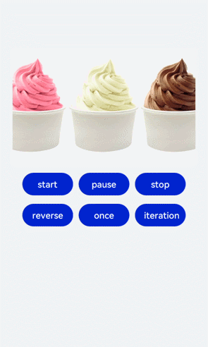

# ImageAnimator<a name="ZH-CN_TOPIC_0000001119928156"></a>

提供帧动画组件来实现逐帧播放图片的能力，可以配置需要播放的图片列表，每张图片可以配置时长。

## 子组件<a name="section1848323814535"></a>

无

## 接口<a name="section195458521537"></a>

ImageAnimator\(\)

## 属性<a name="section792713805418"></a>

<a name="table5252022152119"></a>
<table><thead align="left"><tr id="row11104142212214"><th class="cellrowborder" valign="top" width="16.939999999999998%" id="mcps1.1.6.1.1"><p id="p910452215216"><a name="p910452215216"></a><a name="p910452215216"></a>参数名称</p>
</th>
<th class="cellrowborder" valign="top" width="23.06%" id="mcps1.1.6.1.2"><p id="p101048225219"><a name="p101048225219"></a><a name="p101048225219"></a>参数类型</p>
</th>
<th class="cellrowborder" valign="top" width="13.87%" id="mcps1.1.6.1.3"><p id="p12104182213214"><a name="p12104182213214"></a><a name="p12104182213214"></a>默认值</p>
</th>
<th class="cellrowborder" valign="top" width="8.34%" id="mcps1.1.6.1.4"><p id="p1110412227213"><a name="p1110412227213"></a><a name="p1110412227213"></a>必填</p>
</th>
<th class="cellrowborder" valign="top" width="37.79%" id="mcps1.1.6.1.5"><p id="p111041222216"><a name="p111041222216"></a><a name="p111041222216"></a>参数描述</p>
</th>
</tr>
</thead>
<tbody><tr id="row151041822122115"><td class="cellrowborder" valign="top" width="16.939999999999998%" headers="mcps1.1.6.1.1 "><p id="p18104202212211"><a name="p18104202212211"></a><a name="p18104202212211"></a>images</p>
</td>
<td class="cellrowborder" valign="top" width="23.06%" headers="mcps1.1.6.1.2 "><p id="p1559165935118"><a name="p1559165935118"></a><a name="p1559165935118"></a>Array&lt;{</p>
<p id="p2028416211528"><a name="p2028416211528"></a><a name="p2028416211528"></a>src:string,</p>
<p id="p19739134125218"><a name="p19739134125218"></a><a name="p19739134125218"></a>width?:Length,</p>
<p id="p124821213115210"><a name="p124821213115210"></a><a name="p124821213115210"></a>height?:Length,</p>
<p id="p18227201965218"><a name="p18227201965218"></a><a name="p18227201965218"></a>top?:Length,</p>
<p id="p4119183012527"><a name="p4119183012527"></a><a name="p4119183012527"></a>left?:Length,</p>
<p id="p6946343195211"><a name="p6946343195211"></a><a name="p6946343195211"></a>duration?:number</p>
<p id="p2010416225213"><a name="p2010416225213"></a><a name="p2010416225213"></a>}&gt;</p>
</td>
<td class="cellrowborder" valign="top" width="13.87%" headers="mcps1.1.6.1.3 "><p id="p1010417225219"><a name="p1010417225219"></a><a name="p1010417225219"></a>[]</p>
</td>
<td class="cellrowborder" valign="top" width="8.34%" headers="mcps1.1.6.1.4 "><p id="p13104182232113"><a name="p13104182232113"></a><a name="p13104182232113"></a>是</p>
</td>
<td class="cellrowborder" valign="top" width="37.79%" headers="mcps1.1.6.1.5 "><p id="p043414238598"><a name="p043414238598"></a><a name="p043414238598"></a>设置图片帧信息集合。每一帧的帧信息包含图片路径、图片大小、图片位置和图片播放时长信息。详细说明如下：</p>
<p id="p10262184312594"><a name="p10262184312594"></a><a name="p10262184312594"></a>src：图片路径，图片格式为svg，png和jpg。</p>
<p id="p1858275019595"><a name="p1858275019595"></a><a name="p1858275019595"></a>width：图片宽度。</p>
<p id="p159991882004"><a name="p159991882004"></a><a name="p159991882004"></a>height：图片高度。</p>
<p id="p123627151909"><a name="p123627151909"></a><a name="p123627151909"></a>top：图片相对于组件左上角的纵向坐标。</p>
<p id="p1921915211809"><a name="p1921915211809"></a><a name="p1921915211809"></a>left：图片相对于组件左上角的横向坐标。</p>
<p id="p5104182210213"><a name="p5104182210213"></a><a name="p5104182210213"></a>duration：每一帧图片的播放时长，单位毫秒。</p>
</td>
</tr>
<tr id="row17104222172116"><td class="cellrowborder" valign="top" width="16.939999999999998%" headers="mcps1.1.6.1.1 "><p id="p310472210213"><a name="p310472210213"></a><a name="p310472210213"></a>state</p>
</td>
<td class="cellrowborder" valign="top" width="23.06%" headers="mcps1.1.6.1.2 "><p id="p1410411222211"><a name="p1410411222211"></a><a name="p1410411222211"></a>AnimationStatus</p>
</td>
<td class="cellrowborder" valign="top" width="13.87%" headers="mcps1.1.6.1.3 "><p id="p121041522132116"><a name="p121041522132116"></a><a name="p121041522132116"></a>Initial</p>
</td>
<td class="cellrowborder" valign="top" width="8.34%" headers="mcps1.1.6.1.4 "><p id="p3104022142114"><a name="p3104022142114"></a><a name="p3104022142114"></a>否</p>
</td>
<td class="cellrowborder" valign="top" width="37.79%" headers="mcps1.1.6.1.5 "><p id="p8104202272119"><a name="p8104202272119"></a><a name="p8104202272119"></a>默认为初始状态，用于控制播放状态。</p>
</td>
</tr>
<tr id="row131041222162111"><td class="cellrowborder" valign="top" width="16.939999999999998%" headers="mcps1.1.6.1.1 "><p id="p4104182262112"><a name="p4104182262112"></a><a name="p4104182262112"></a>duration</p>
</td>
<td class="cellrowborder" valign="top" width="23.06%" headers="mcps1.1.6.1.2 "><p id="p101041222112114"><a name="p101041222112114"></a><a name="p101041222112114"></a>number</p>
</td>
<td class="cellrowborder" valign="top" width="13.87%" headers="mcps1.1.6.1.3 "><p id="p81046226216"><a name="p81046226216"></a><a name="p81046226216"></a>1000</p>
</td>
<td class="cellrowborder" valign="top" width="8.34%" headers="mcps1.1.6.1.4 "><p id="p2104112211215"><a name="p2104112211215"></a><a name="p2104112211215"></a>否</p>
</td>
<td class="cellrowborder" valign="top" width="37.79%" headers="mcps1.1.6.1.5 "><p id="p8104622102117"><a name="p8104622102117"></a><a name="p8104622102117"></a>单位为毫秒，默认时长为1000ms；duration为0时，不播放图片；值的改变只会在下一次循环开始时生效；当images中设置了单独的duration后，该属性设置无效。</p>
</td>
</tr>
<tr id="row1310442232120"><td class="cellrowborder" valign="top" width="16.939999999999998%" headers="mcps1.1.6.1.1 "><p id="p1010422232111"><a name="p1010422232111"></a><a name="p1010422232111"></a>reverse</p>
</td>
<td class="cellrowborder" valign="top" width="23.06%" headers="mcps1.1.6.1.2 "><p id="p1210420226213"><a name="p1210420226213"></a><a name="p1210420226213"></a>boolean</p>
</td>
<td class="cellrowborder" valign="top" width="13.87%" headers="mcps1.1.6.1.3 "><p id="p410442272119"><a name="p410442272119"></a><a name="p410442272119"></a>false</p>
</td>
<td class="cellrowborder" valign="top" width="8.34%" headers="mcps1.1.6.1.4 "><p id="p12104182292114"><a name="p12104182292114"></a><a name="p12104182292114"></a>否</p>
</td>
<td class="cellrowborder" valign="top" width="37.79%" headers="mcps1.1.6.1.5 "><p id="p91041922102111"><a name="p91041922102111"></a><a name="p91041922102111"></a>设置播放顺序。false表示从第1张图片播放到最后1张图片； true表示从最后1张图片播放到第1张图片。</p>
</td>
</tr>
<tr id="row11104822162112"><td class="cellrowborder" valign="top" width="16.939999999999998%" headers="mcps1.1.6.1.1 "><p id="p11105102202118"><a name="p11105102202118"></a><a name="p11105102202118"></a>fixedSize</p>
</td>
<td class="cellrowborder" valign="top" width="23.06%" headers="mcps1.1.6.1.2 "><p id="p1410512222113"><a name="p1410512222113"></a><a name="p1410512222113"></a>boolean</p>
</td>
<td class="cellrowborder" valign="top" width="13.87%" headers="mcps1.1.6.1.3 "><p id="p141057229210"><a name="p141057229210"></a><a name="p141057229210"></a>true</p>
</td>
<td class="cellrowborder" valign="top" width="8.34%" headers="mcps1.1.6.1.4 "><p id="p91054228213"><a name="p91054228213"></a><a name="p91054228213"></a>否</p>
</td>
<td class="cellrowborder" valign="top" width="37.79%" headers="mcps1.1.6.1.5 "><p id="p19105132212212"><a name="p19105132212212"></a><a name="p19105132212212"></a>设置图片大小是否固定为组件大小。 true表示图片大小与组件大小一致，此时设置图片的width 、height 、top 和left属性是无效的。false表示每一张图片的 width 、height 、top和left属性都要单独设置。</p>
</td>
</tr>
<tr id="row1910519227213"><td class="cellrowborder" valign="top" width="16.939999999999998%" headers="mcps1.1.6.1.1 "><p id="p10105112211216"><a name="p10105112211216"></a><a name="p10105112211216"></a>preDecode</p>
</td>
<td class="cellrowborder" valign="top" width="23.06%" headers="mcps1.1.6.1.2 "><p id="p18105122292114"><a name="p18105122292114"></a><a name="p18105122292114"></a>number</p>
</td>
<td class="cellrowborder" valign="top" width="13.87%" headers="mcps1.1.6.1.3 "><p id="p131058220216"><a name="p131058220216"></a><a name="p131058220216"></a>0</p>
</td>
<td class="cellrowborder" valign="top" width="8.34%" headers="mcps1.1.6.1.4 "><p id="p1510542272119"><a name="p1510542272119"></a><a name="p1510542272119"></a>否</p>
</td>
<td class="cellrowborder" valign="top" width="37.79%" headers="mcps1.1.6.1.5 "><p id="p410552211216"><a name="p410552211216"></a><a name="p410552211216"></a>是否启用预解码，默认值为0，即不启用预解码，如该值设为2，则播放当前页时会提前加载后面两张图片至缓存以提升性能。</p>
</td>
</tr>
<tr id="row710572202119"><td class="cellrowborder" valign="top" width="16.939999999999998%" headers="mcps1.1.6.1.1 "><p id="p11051622142116"><a name="p11051622142116"></a><a name="p11051622142116"></a>fillMode</p>
</td>
<td class="cellrowborder" valign="top" width="23.06%" headers="mcps1.1.6.1.2 "><p id="p91051022152115"><a name="p91051022152115"></a><a name="p91051022152115"></a>FillMode</p>
</td>
<td class="cellrowborder" valign="top" width="13.87%" headers="mcps1.1.6.1.3 "><p id="p16105112212116"><a name="p16105112212116"></a><a name="p16105112212116"></a>Forwards</p>
</td>
<td class="cellrowborder" valign="top" width="8.34%" headers="mcps1.1.6.1.4 "><p id="p15105122282118"><a name="p15105122282118"></a><a name="p15105122282118"></a>否</p>
</td>
<td class="cellrowborder" valign="top" width="37.79%" headers="mcps1.1.6.1.5 "><p id="p51051622152114"><a name="p51051622152114"></a><a name="p51051622152114"></a>设置动画开始前和结束后的状态，可选值参见FillMode说明。</p>
</td>
</tr>
<tr id="row17105022202118"><td class="cellrowborder" valign="top" width="16.939999999999998%" headers="mcps1.1.6.1.1 "><p id="p6105112252111"><a name="p6105112252111"></a><a name="p6105112252111"></a>iterations</p>
</td>
<td class="cellrowborder" valign="top" width="23.06%" headers="mcps1.1.6.1.2 "><p id="p1810512214213"><a name="p1810512214213"></a><a name="p1810512214213"></a>number</p>
</td>
<td class="cellrowborder" valign="top" width="13.87%" headers="mcps1.1.6.1.3 "><p id="p1010515222214"><a name="p1010515222214"></a><a name="p1010515222214"></a>1</p>
</td>
<td class="cellrowborder" valign="top" width="8.34%" headers="mcps1.1.6.1.4 "><p id="p010518228214"><a name="p010518228214"></a><a name="p010518228214"></a>否</p>
</td>
<td class="cellrowborder" valign="top" width="37.79%" headers="mcps1.1.6.1.5 "><p id="p8105122202117"><a name="p8105122202117"></a><a name="p8105122202117"></a>默认播放一次，设置为-1时表示无限次播放。</p>
</td>
</tr>
</tbody>
</table>

-   AnimationStatus枚举说明

    <a name="table3452114216394"></a>
    <table><thead align="left"><tr id="row245219426397"><th class="cellrowborder" valign="top" width="25.2%" id="mcps1.1.3.1.1"><p id="p545244283914"><a name="p545244283914"></a><a name="p545244283914"></a><strong id="b111902105216"><a name="b111902105216"></a><a name="b111902105216"></a>名称</strong></p>
    </th>
    <th class="cellrowborder" valign="top" width="74.8%" id="mcps1.1.3.1.2"><p id="p2452114203917"><a name="p2452114203917"></a><a name="p2452114203917"></a><strong id="b20201131020211"><a name="b20201131020211"></a><a name="b20201131020211"></a>描述</strong></p>
    </th>
    </tr>
    </thead>
    <tbody><tr id="row6452144218390"><td class="cellrowborder" valign="top" width="25.2%" headers="mcps1.1.3.1.1 "><p id="p34529427398"><a name="p34529427398"></a><a name="p34529427398"></a>Initial</p>
    </td>
    <td class="cellrowborder" valign="top" width="74.8%" headers="mcps1.1.3.1.2 "><p id="p1245211421393"><a name="p1245211421393"></a><a name="p1245211421393"></a>动画初始状态<strong id="b131162733615"><a name="b131162733615"></a><a name="b131162733615"></a>。</strong></p>
    </td>
    </tr>
    <tr id="row12452184217398"><td class="cellrowborder" valign="top" width="25.2%" headers="mcps1.1.3.1.1 "><p id="p54523425398"><a name="p54523425398"></a><a name="p54523425398"></a>Running</p>
    </td>
    <td class="cellrowborder" valign="top" width="74.8%" headers="mcps1.1.3.1.2 "><p id="p745215426391"><a name="p745215426391"></a><a name="p745215426391"></a>动画处于播放状态。</p>
    </td>
    </tr>
    <tr id="row9452134213392"><td class="cellrowborder" valign="top" width="25.2%" headers="mcps1.1.3.1.1 "><p id="p510719111403"><a name="p510719111403"></a><a name="p510719111403"></a>Paused</p>
    </td>
    <td class="cellrowborder" valign="top" width="74.8%" headers="mcps1.1.3.1.2 "><p id="p154533425394"><a name="p154533425394"></a><a name="p154533425394"></a>动画处于暂停状态。</p>
    </td>
    </tr>
    <tr id="row1345313424399"><td class="cellrowborder" valign="top" width="25.2%" headers="mcps1.1.3.1.1 "><p id="p1766215124010"><a name="p1766215124010"></a><a name="p1766215124010"></a>Stopped</p>
    </td>
    <td class="cellrowborder" valign="top" width="74.8%" headers="mcps1.1.3.1.2 "><p id="p1245319426394"><a name="p1245319426394"></a><a name="p1245319426394"></a>动画处于停止状态。</p>
    </td>
    </tr>
    </tbody>
    </table>


-   FillMode枚举值说明

    <a name="table7527153712012"></a>
    <table><thead align="left"><tr id="row45277371008"><th class="cellrowborder" valign="top" width="25.2%" id="mcps1.1.3.1.1"><p id="p616316585179"><a name="p616316585179"></a><a name="p616316585179"></a>名称</p>
    </th>
    <th class="cellrowborder" valign="top" width="74.8%" id="mcps1.1.3.1.2"><p id="p185278372020"><a name="p185278372020"></a><a name="p185278372020"></a>描述</p>
    </th>
    </tr>
    </thead>
    <tbody><tr id="row185271437105"><td class="cellrowborder" valign="top" width="25.2%" headers="mcps1.1.3.1.1 "><p id="p2527137309"><a name="p2527137309"></a><a name="p2527137309"></a>None</p>
    </td>
    <td class="cellrowborder" valign="top" width="74.8%" headers="mcps1.1.3.1.2 "><p id="p1252716372017"><a name="p1252716372017"></a><a name="p1252716372017"></a>播放完成后恢复初始状态。</p>
    </td>
    </tr>
    <tr id="row10527193716013"><td class="cellrowborder" valign="top" width="25.2%" headers="mcps1.1.3.1.1 "><p id="p15275371703"><a name="p15275371703"></a><a name="p15275371703"></a>Forwards</p>
    </td>
    <td class="cellrowborder" valign="top" width="74.8%" headers="mcps1.1.3.1.2 "><p id="p17527203717017"><a name="p17527203717017"></a><a name="p17527203717017"></a>播放完成后保持动画结束时的状态。</p>
    </td>
    </tr>
    <tr id="row15271837301"><td class="cellrowborder" valign="top" width="25.2%" headers="mcps1.1.3.1.1 "><p id="p14527203712015"><a name="p14527203712015"></a><a name="p14527203712015"></a>Backwards</p>
    </td>
    <td class="cellrowborder" valign="top" width="74.8%" headers="mcps1.1.3.1.2 "><p id="p20527143716011"><a name="p20527143716011"></a><a name="p20527143716011"></a>在animation-delay所指定的一段时间内，在动画显示之前，应用开始属性值。</p>
    </td>
    </tr>
    <tr id="row7527183711010"><td class="cellrowborder" valign="top" width="25.2%" headers="mcps1.1.3.1.1 "><p id="p75271737601"><a name="p75271737601"></a><a name="p75271737601"></a>Both</p>
    </td>
    <td class="cellrowborder" valign="top" width="74.8%" headers="mcps1.1.3.1.2 "><p id="p1952714379015"><a name="p1952714379015"></a><a name="p1952714379015"></a>向前和向后填充模式都被应用。</p>
    </td>
    </tr>
    </tbody>
    </table>


## 事件<a name="section8249161475516"></a>

<a name="table439122102118"></a>
<table><thead align="left"><tr id="row3105722182112"><th class="cellrowborder" colspan="2" valign="top" id="mcps1.1.4.1.1"><p id="p210552218212"><a name="p210552218212"></a><a name="p210552218212"></a>名称</p>
</th>
<th class="cellrowborder" valign="top" id="mcps1.1.4.1.2"><p id="p19105182282113"><a name="p19105182282113"></a><a name="p19105182282113"></a>功能描述</p>
</th>
</tr>
</thead>
<tbody><tr id="row6105132212112"><td class="cellrowborder" colspan="2" valign="top" headers="mcps1.1.4.1.1 "><p id="p010512211212"><a name="p010512211212"></a><a name="p010512211212"></a>onStart() =&gt; void</p>
</td>
<td class="cellrowborder" valign="top" headers="mcps1.1.4.1.2 "><p id="p1810582222115"><a name="p1810582222115"></a><a name="p1810582222115"></a>状态回调，动画开始播放时触发。</p>
</td>
</tr>
<tr id="row8105522142117"><td class="cellrowborder" colspan="2" valign="top" headers="mcps1.1.4.1.1 "><p id="p4105022182111"><a name="p4105022182111"></a><a name="p4105022182111"></a>onPause() =&gt; void</p>
</td>
<td class="cellrowborder" valign="top" headers="mcps1.1.4.1.2 "><p id="p5105112232111"><a name="p5105112232111"></a><a name="p5105112232111"></a>状态回调，动画暂停播放时触发。</p>
</td>
</tr>
<tr id="row310552220210"><td class="cellrowborder" colspan="2" valign="top" headers="mcps1.1.4.1.1 "><p id="p810662212210"><a name="p810662212210"></a><a name="p810662212210"></a>onRepeat() =&gt; void</p>
</td>
<td class="cellrowborder" valign="top" headers="mcps1.1.4.1.2 "><p id="p0106202216214"><a name="p0106202216214"></a><a name="p0106202216214"></a>状态回调，动画重新播放时触发。</p>
</td>
</tr>
<tr id="row1210611228211"><td class="cellrowborder" colspan="2" valign="top" headers="mcps1.1.4.1.1 "><p id="p18106322162117"><a name="p18106322162117"></a><a name="p18106322162117"></a>onCancel() =&gt; void</p>
</td>
<td class="cellrowborder" valign="top" headers="mcps1.1.4.1.2 "><p id="p5106132214211"><a name="p5106132214211"></a><a name="p5106132214211"></a>状态回调，动画取消播放时触发。</p>
</td>
</tr>
<tr id="row201061222112114"><td class="cellrowborder" colspan="2" valign="top" headers="mcps1.1.4.1.1 "><p id="p410602214217"><a name="p410602214217"></a><a name="p410602214217"></a>onFinish() =&gt; void</p>
</td>
<td class="cellrowborder" valign="top" headers="mcps1.1.4.1.2 "><p id="p510642218218"><a name="p510642218218"></a><a name="p510642218218"></a>状态回调，动画播放完成时触发。</p>
</td>
</tr>
</tbody>
</table>

## 示例<a name="section4459736105512"></a>

```
@Entry
@Component
struct ImageAnimatorExample {
  @State state: AnimationStatus = AnimationStatus.Initial
  @State reverse: boolean = false
  @State iterations: number = 1

  build() {
    Column({ space:5 }) {
      ImageAnimator()
        .images([
          {
            src: '/comment/bg1.jpg',
            duration: 500,
            width: 325,
            height: 200,
            top: 0,
            left: 0
          },
          {
            src: '/comment/bg2.jpg',
            duration: 500,
            width: 325,
            height: 200,
            top: 0,
            left: 0
          },
          {
            src: '/comment/bg3.jpg',
            duration: 500,
            width: 325,
            height: 200,
            top: 0,
            left: 0
          },
          {
            src: '/comment/bg4.jpg',
            duration: 500,
            width: 325,
            height: 200,
            top: 0,
            left: 0
          }
        ])
        .state(this.state).reverse(this.reverse).fixedSize(false).preDecode(2)
        .fillMode(FillMode.None).iterations(this.iterations).width(325).height(210)
        .margin({top:100})
        .onStart(() => { // 当帧动画开始播放后触发
          console.info('Start')
        })
        .onPause(() => {
          console.info('Pause')
        })
        .onRepeat(() => {
          console.info('Repeat')
        })
        .onCancel(() => {
          console.info('Cancel')
        })
        .onFinish(() => { // 当帧动画播放完成后触发
          console.info('Finish')
        })
      Row() {
        Button('start').width(100).padding(5).onClick(() => {
          this.state = AnimationStatus.Running
        })
        Button('pause').width(100).padding(5).onClick(() => {
          this.state = AnimationStatus.Paused
        })
        Button('stop').width(100).padding(5).onClick(() => {
          this.state = AnimationStatus.Stopped
        })
      }
      Row() {
        Button('reverse').width(100).padding(5).onClick(() => {
          this.reverse = !this.reverse
        })
        Button('once').width(100).padding(5).onClick(() => {
          this.iterations = 1
        })
        Button('iteration').width(100).padding(5).onClick(() => {
          this.iterations = -1
        })
      }
    }.width('100%').height('100%').backgroundColor(0xF1F3F5)
  }
}
```



