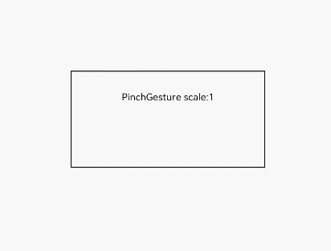

# PinchGesture<a name="ZH-CN_TOPIC_0000001112978964"></a>

## 接口<a name="section46581530142116"></a>

PinchGesture\(options?: \{ fingers?: number, distance?: number \}\)

-   参数

    <a name="table6433854121111"></a>
    <table><thead align="left"><tr id="row1333463916149"><th class="cellrowborder" valign="top" width="16.11%" id="mcps1.1.6.1.1"><p id="p543535461112"><a name="p543535461112"></a><a name="p543535461112"></a>参数名称</p>
    </th>
    <th class="cellrowborder" valign="top" width="15.959999999999999%" id="mcps1.1.6.1.2"><p id="p24351054201110"><a name="p24351054201110"></a><a name="p24351054201110"></a>参数类型</p>
    </th>
    <th class="cellrowborder" valign="top" width="11.04%" id="mcps1.1.6.1.3"><p id="p1043518544112"><a name="p1043518544112"></a><a name="p1043518544112"></a>必填</p>
    </th>
    <th class="cellrowborder" valign="top" width="11.709999999999999%" id="mcps1.1.6.1.4"><p id="p17436954101117"><a name="p17436954101117"></a><a name="p17436954101117"></a>默认值</p>
    </th>
    <th class="cellrowborder" valign="top" width="45.18%" id="mcps1.1.6.1.5"><p id="p174361554111115"><a name="p174361554111115"></a><a name="p174361554111115"></a>参数描述</p>
    </th>
    </tr>
    </thead>
    <tbody><tr id="row1433516398146"><td class="cellrowborder" valign="top" width="16.11%" headers="mcps1.1.6.1.1 "><p id="p3436454151117"><a name="p3436454151117"></a><a name="p3436454151117"></a>fingers</p>
    </td>
    <td class="cellrowborder" valign="top" width="15.959999999999999%" headers="mcps1.1.6.1.2 "><p id="p17437185411115"><a name="p17437185411115"></a><a name="p17437185411115"></a>number</p>
    </td>
    <td class="cellrowborder" valign="top" width="11.04%" headers="mcps1.1.6.1.3 "><p id="p2437054181119"><a name="p2437054181119"></a><a name="p2437054181119"></a>否</p>
    </td>
    <td class="cellrowborder" valign="top" width="11.709999999999999%" headers="mcps1.1.6.1.4 "><p id="p44377543115"><a name="p44377543115"></a><a name="p44377543115"></a>2</p>
    </td>
    <td class="cellrowborder" valign="top" width="45.18%" headers="mcps1.1.6.1.5 "><p id="p1843825411110"><a name="p1843825411110"></a><a name="p1843825411110"></a>触发捏合的最少手指数, 最小为2指，最大为5指。</p>
    </td>
    </tr>
    <tr id="row8335239171414"><td class="cellrowborder" valign="top" width="16.11%" headers="mcps1.1.6.1.1 "><p id="p843855441111"><a name="p843855441111"></a><a name="p843855441111"></a>distance</p>
    </td>
    <td class="cellrowborder" valign="top" width="15.959999999999999%" headers="mcps1.1.6.1.2 "><p id="p243965411110"><a name="p243965411110"></a><a name="p243965411110"></a>number</p>
    </td>
    <td class="cellrowborder" valign="top" width="11.04%" headers="mcps1.1.6.1.3 "><p id="p6439754141115"><a name="p6439754141115"></a><a name="p6439754141115"></a>否</p>
    </td>
    <td class="cellrowborder" valign="top" width="11.709999999999999%" headers="mcps1.1.6.1.4 "><p id="p174391754151110"><a name="p174391754151110"></a><a name="p174391754151110"></a>3.0</p>
    </td>
    <td class="cellrowborder" valign="top" width="45.18%" headers="mcps1.1.6.1.5 "><p id="p44401854141112"><a name="p44401854141112"></a><a name="p44401854141112"></a>最小识别距离，单位为vp。</p>
    </td>
    </tr>
    </tbody>
    </table>


## 事件<a name="section1121514205616"></a>

<a name="table135406579437"></a>
<table><thead align="left"><tr id="row1154015719436"><th class="cellrowborder" colspan="2" valign="top" id="mcps1.1.4.1.1"><p id="p85411457184316"><a name="p85411457184316"></a><a name="p85411457184316"></a>名称</p>
</th>
<th class="cellrowborder" valign="top" id="mcps1.1.4.1.2"><p id="p5541457194319"><a name="p5541457194319"></a><a name="p5541457194319"></a>功能描述</p>
</th>
</tr>
</thead>
<tbody><tr id="row4541257114319"><td class="cellrowborder" colspan="2" valign="top" headers="mcps1.1.4.1.1 "><p id="p5541357194313"><a name="p5541357194313"></a><a name="p5541357194313"></a>onActionStart((event?: <a href="ts-gesture-settings.md#table290mcpsimp">GestureEvent</a>) =&gt; void)</p>
</td>
<td class="cellrowborder" valign="top" headers="mcps1.1.4.1.2 "><p id="p11541155710434"><a name="p11541155710434"></a><a name="p11541155710434"></a>Pinch手势识别成功回调。</p>
</td>
</tr>
<tr id="row54544191113"><td class="cellrowborder" colspan="2" valign="top" headers="mcps1.1.4.1.1 "><p id="p145591931117"><a name="p145591931117"></a><a name="p145591931117"></a>onActionUpdate((event?: <a href="ts-gesture-settings.md#table290mcpsimp">GestureEvent</a>) =&gt; void)</p>
</td>
<td class="cellrowborder" valign="top" headers="mcps1.1.4.1.2 "><p id="p1455111961111"><a name="p1455111961111"></a><a name="p1455111961111"></a>Pinch手势移动过程中回调。</p>
</td>
</tr>
<tr id="row2899841162916"><td class="cellrowborder" colspan="2" valign="top" headers="mcps1.1.4.1.1 "><p id="p15900174162916"><a name="p15900174162916"></a><a name="p15900174162916"></a>onActionEnd((event?: <a href="ts-gesture-settings.md#table290mcpsimp">GestureEvent</a>) =&gt; void)</p>
</td>
<td class="cellrowborder" valign="top" headers="mcps1.1.4.1.2 "><p id="p69001041172920"><a name="p69001041172920"></a><a name="p69001041172920"></a>Pinch手势识别成功，手指抬起后触发回调。</p>
</td>
</tr>
<tr id="row13598134672914"><td class="cellrowborder" colspan="2" valign="top" headers="mcps1.1.4.1.1 "><p id="p85999460299"><a name="p85999460299"></a><a name="p85999460299"></a>onActionCancel(event: () =&gt; void)</p>
</td>
<td class="cellrowborder" valign="top" headers="mcps1.1.4.1.2 "><p id="p1459954652916"><a name="p1459954652916"></a><a name="p1459954652916"></a>Pinch手势识别成功，接收到触摸取消事件触发回调。</p>
</td>
</tr>
</tbody>
</table>

## 示例<a name="section16900453182718"></a>

```
@Entry
@Component
struct PinchGestureExample {
  @State scale: number = 1

  build() {
    Flex({ direction: FlexDirection.Column, alignItems: ItemAlign.Center, justifyContent: FlexAlign.SpaceBetween }) {
      Text('PinchGesture scale:' + this.scale)
    }
    .height(100).width(200).padding(20).border({ width: 1 }).margin(80)
    .scale({ x: this.scale, y: this.scale, z: this.scale })
    .gesture(
      PinchGesture()
        .onActionStart((event: GestureEvent) => {
          console.info('Pinch start')
        })
        .onActionUpdate((event: GestureEvent) => {
          this.scale = event.scale
        })
        .onActionEnd(() => {
          console.info('Pinch end')
        })
    )
  }
}
```



