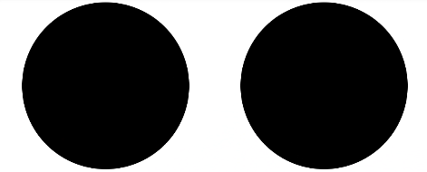

# Circle<a name="ZH-CN_TOPIC_0000001166727517"></a>

圆形绘制组件。

## 子组件<a name="section5327181920402"></a>

无

## 接口<a name="section43062331406"></a>

Circle\(options?: \{width: Length, height: Length\}\)

-   参数

    <a name="table193606194544"></a>
    <table><thead align="left"><tr id="row536071910541"><th class="cellrowborder" valign="top" width="15.47%" id="mcps1.1.6.1.1"><p id="p436112199544"><a name="p436112199544"></a><a name="p436112199544"></a>参数名</p>
    </th>
    <th class="cellrowborder" valign="top" width="17.22%" id="mcps1.1.6.1.2"><p id="p19361319115410"><a name="p19361319115410"></a><a name="p19361319115410"></a>参数类型</p>
    </th>
    <th class="cellrowborder" valign="top" width="12.479999999999999%" id="mcps1.1.6.1.3"><p id="p9361201975417"><a name="p9361201975417"></a><a name="p9361201975417"></a>必填</p>
    </th>
    <th class="cellrowborder" valign="top" width="18.61%" id="mcps1.1.6.1.4"><p id="p43611199542"><a name="p43611199542"></a><a name="p43611199542"></a>默认值</p>
    </th>
    <th class="cellrowborder" valign="top" width="36.22%" id="mcps1.1.6.1.5"><p id="p1136141975419"><a name="p1136141975419"></a><a name="p1136141975419"></a>参数描述</p>
    </th>
    </tr>
    </thead>
    <tbody><tr id="row10361101915545"><td class="cellrowborder" valign="top" width="15.47%" headers="mcps1.1.6.1.1 "><p id="p1361119155417"><a name="p1361119155417"></a><a name="p1361119155417"></a>options</p>
    </td>
    <td class="cellrowborder" valign="top" width="17.22%" headers="mcps1.1.6.1.2 "><p id="p8361181913548"><a name="p8361181913548"></a><a name="p8361181913548"></a>Object</p>
    </td>
    <td class="cellrowborder" valign="top" width="12.479999999999999%" headers="mcps1.1.6.1.3 "><p id="p153611119195411"><a name="p153611119195411"></a><a name="p153611119195411"></a>否</p>
    </td>
    <td class="cellrowborder" valign="top" width="18.61%" headers="mcps1.1.6.1.4 "><p id="p1436114193546"><a name="p1436114193546"></a><a name="p1436114193546"></a>-</p>
    </td>
    <td class="cellrowborder" valign="top" width="36.22%" headers="mcps1.1.6.1.5 "><p id="p328155017218"><a name="p328155017218"></a><a name="p328155017218"></a>见<a href="#li9482134124512">options参数说明</a>。</p>
    </td>
    </tr>
    </tbody>
    </table>

-   <a name="li9482134124512"></a>options参数说明

    <a name="table204985415456"></a>
    <table><thead align="left"><tr id="row134981041154516"><th class="cellrowborder" valign="top" width="16.11%" id="mcps1.1.6.1.1"><p id="p94971541104510"><a name="p94971541104510"></a><a name="p94971541104510"></a>参数名</p>
    </th>
    <th class="cellrowborder" valign="top" width="14.01%" id="mcps1.1.6.1.2"><p id="p15498154184513"><a name="p15498154184513"></a><a name="p15498154184513"></a>参数类型</p>
    </th>
    <th class="cellrowborder" valign="top" width="14.499999999999998%" id="mcps1.1.6.1.3"><p id="p2498184124516"><a name="p2498184124516"></a><a name="p2498184124516"></a>必填</p>
    </th>
    <th class="cellrowborder" valign="top" width="13.170000000000002%" id="mcps1.1.6.1.4"><p id="p94981741194517"><a name="p94981741194517"></a><a name="p94981741194517"></a>默认值</p>
    </th>
    <th class="cellrowborder" valign="top" width="42.21%" id="mcps1.1.6.1.5"><p id="p1849834115451"><a name="p1849834115451"></a><a name="p1849834115451"></a>参数描述</p>
    </th>
    </tr>
    </thead>
    <tbody><tr id="row44980419459"><td class="cellrowborder" valign="top" width="16.11%" headers="mcps1.1.6.1.1 "><p id="p164981441164512"><a name="p164981441164512"></a><a name="p164981441164512"></a>width</p>
    </td>
    <td class="cellrowborder" valign="top" width="14.01%" headers="mcps1.1.6.1.2 "><p id="p44987411458"><a name="p44987411458"></a><a name="p44987411458"></a>Length</p>
    </td>
    <td class="cellrowborder" valign="top" width="14.499999999999998%" headers="mcps1.1.6.1.3 "><p id="p4498104124511"><a name="p4498104124511"></a><a name="p4498104124511"></a>是</p>
    </td>
    <td class="cellrowborder" valign="top" width="13.170000000000002%" headers="mcps1.1.6.1.4 "><p id="p16498841204515"><a name="p16498841204515"></a><a name="p16498841204515"></a>-</p>
    </td>
    <td class="cellrowborder" valign="top" width="42.21%" headers="mcps1.1.6.1.5 "><p id="p104980410453"><a name="p104980410453"></a><a name="p104980410453"></a>宽度。</p>
    </td>
    </tr>
    <tr id="row1049813410458"><td class="cellrowborder" valign="top" width="16.11%" headers="mcps1.1.6.1.1 "><p id="p7498541204517"><a name="p7498541204517"></a><a name="p7498541204517"></a>height</p>
    </td>
    <td class="cellrowborder" valign="top" width="14.01%" headers="mcps1.1.6.1.2 "><p id="p54981441184518"><a name="p54981441184518"></a><a name="p54981441184518"></a>Length</p>
    </td>
    <td class="cellrowborder" valign="top" width="14.499999999999998%" headers="mcps1.1.6.1.3 "><p id="p149844116454"><a name="p149844116454"></a><a name="p149844116454"></a>是</p>
    </td>
    <td class="cellrowborder" valign="top" width="13.170000000000002%" headers="mcps1.1.6.1.4 "><p id="p194981041134510"><a name="p194981041134510"></a><a name="p194981041134510"></a>-</p>
    </td>
    <td class="cellrowborder" valign="top" width="42.21%" headers="mcps1.1.6.1.5 "><p id="p3498104174515"><a name="p3498104174515"></a><a name="p3498104174515"></a>高度。</p>
    </td>
    </tr>
    </tbody>
    </table>


## 属性<a name="section10878194810416"></a>

<a name="table1050144353310"></a>
<table><thead align="left"><tr id="row10886430331"><th class="cellrowborder" valign="top" width="20%" id="mcps1.1.6.1.1"><p id="p988164373314"><a name="p988164373314"></a><a name="p988164373314"></a>参数名称</p>
</th>
<th class="cellrowborder" valign="top" width="20%" id="mcps1.1.6.1.2"><p id="p19882437336"><a name="p19882437336"></a><a name="p19882437336"></a>参数类型</p>
</th>
<th class="cellrowborder" valign="top" width="20%" id="mcps1.1.6.1.3"><p id="p158894320331"><a name="p158894320331"></a><a name="p158894320331"></a>默认值</p>
</th>
<th class="cellrowborder" valign="top" width="15.98%" id="mcps1.1.6.1.4"><p id="p1887436331"><a name="p1887436331"></a><a name="p1887436331"></a>必填</p>
</th>
<th class="cellrowborder" valign="top" width="24.02%" id="mcps1.1.6.1.5"><p id="p08834313311"><a name="p08834313311"></a><a name="p08834313311"></a>参数描述</p>
</th>
</tr>
</thead>
<tbody><tr id="row178884318332"><td class="cellrowborder" valign="top" width="20%" headers="mcps1.1.6.1.1 "><p id="p14885432338"><a name="p14885432338"></a><a name="p14885432338"></a>width</p>
</td>
<td class="cellrowborder" valign="top" width="20%" headers="mcps1.1.6.1.2 "><p id="p28874363314"><a name="p28874363314"></a><a name="p28874363314"></a>Length</p>
</td>
<td class="cellrowborder" valign="top" width="20%" headers="mcps1.1.6.1.3 "><p id="p288104315332"><a name="p288104315332"></a><a name="p288104315332"></a>0</p>
</td>
<td class="cellrowborder" valign="top" width="15.98%" headers="mcps1.1.6.1.4 "><p id="p68874317332"><a name="p68874317332"></a><a name="p68874317332"></a>否</p>
</td>
<td class="cellrowborder" valign="top" width="24.02%" headers="mcps1.1.6.1.5 "><p id="p38834313313"><a name="p38834313313"></a><a name="p38834313313"></a>圆所在矩形的宽度。</p>
</td>
</tr>
<tr id="row78814314333"><td class="cellrowborder" valign="top" width="20%" headers="mcps1.1.6.1.1 "><p id="p118884319333"><a name="p118884319333"></a><a name="p118884319333"></a>height</p>
</td>
<td class="cellrowborder" valign="top" width="20%" headers="mcps1.1.6.1.2 "><p id="p13881943113312"><a name="p13881943113312"></a><a name="p13881943113312"></a>Length</p>
</td>
<td class="cellrowborder" valign="top" width="20%" headers="mcps1.1.6.1.3 "><p id="p1388143143312"><a name="p1388143143312"></a><a name="p1388143143312"></a>0</p>
</td>
<td class="cellrowborder" valign="top" width="15.98%" headers="mcps1.1.6.1.4 "><p id="p68819432337"><a name="p68819432337"></a><a name="p68819432337"></a>否</p>
</td>
<td class="cellrowborder" valign="top" width="24.02%" headers="mcps1.1.6.1.5 "><p id="p888343193312"><a name="p888343193312"></a><a name="p888343193312"></a>圆所在矩形的高度。</p>
</td>
</tr>
</tbody>
</table>

## 示例<a name="section4459736105512"></a>

```
@Entry
@Component
struct CircleExample {
  build() {
    Flex({ justifyContent: FlexAlign.SpaceAround }) {
      // 绘制一个直径为150的圆
      Circle({ width: 150, height: 150 })
      // 绘制一个直径为150的圆
      Circle().width(150).height(150)
    }.width('100%').margin({ top: 5 })
  }
}
```



