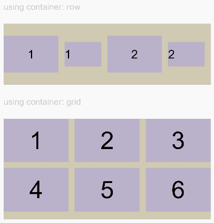
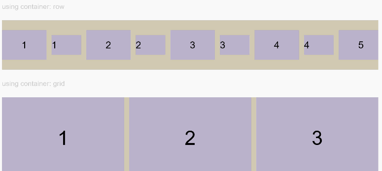

# 布局约束<a name="ZH-CN_TOPIC_0000001119929018"></a>

<a name="table2938mcpsimp"></a>
<table><thead align="left"><tr id="row2946mcpsimp"><th class="cellrowborder" valign="top" width="19.781978197819782%" id="mcps1.1.5.1.1"><p id="p2948mcpsimp"><a name="p2948mcpsimp"></a><a name="p2948mcpsimp"></a>名称</p>
</th>
<th class="cellrowborder" valign="top" width="15.38153815381538%" id="mcps1.1.5.1.2"><p id="p2950mcpsimp"><a name="p2950mcpsimp"></a><a name="p2950mcpsimp"></a>参数说明</p>
</th>
<th class="cellrowborder" valign="top" width="8.720872087208722%" id="mcps1.1.5.1.3"><p id="p2952mcpsimp"><a name="p2952mcpsimp"></a><a name="p2952mcpsimp"></a>默认值</p>
</th>
<th class="cellrowborder" valign="top" width="56.11561156115612%" id="mcps1.1.5.1.4"><p id="p2956mcpsimp"><a name="p2956mcpsimp"></a><a name="p2956mcpsimp"></a>描述</p>
</th>
</tr>
</thead>
<tbody><tr id="row2968mcpsimp"><td class="cellrowborder" valign="top" width="19.781978197819782%" headers="mcps1.1.5.1.1 "><p id="p2970mcpsimp"><a name="p2970mcpsimp"></a><a name="p2970mcpsimp"></a>aspectRatio</p>
</td>
<td class="cellrowborder" valign="top" width="15.38153815381538%" headers="mcps1.1.5.1.2 "><p id="p2972mcpsimp"><a name="p2972mcpsimp"></a><a name="p2972mcpsimp"></a>number</p>
</td>
<td class="cellrowborder" valign="top" width="8.720872087208722%" headers="mcps1.1.5.1.3 "><p id="p2974mcpsimp"><a name="p2974mcpsimp"></a><a name="p2974mcpsimp"></a>-</p>
</td>
<td class="cellrowborder" valign="top" width="56.11561156115612%" headers="mcps1.1.5.1.4 "><p id="p2978mcpsimp"><a name="p2978mcpsimp"></a><a name="p2978mcpsimp"></a>指定当前组件的宽高比。</p>
</td>
</tr>
<tr id="row2979mcpsimp"><td class="cellrowborder" valign="top" width="19.781978197819782%" headers="mcps1.1.5.1.1 "><p id="p2981mcpsimp"><a name="p2981mcpsimp"></a><a name="p2981mcpsimp"></a>displayPriority</p>
</td>
<td class="cellrowborder" valign="top" width="15.38153815381538%" headers="mcps1.1.5.1.2 "><p id="p2983mcpsimp"><a name="p2983mcpsimp"></a><a name="p2983mcpsimp"></a>number</p>
</td>
<td class="cellrowborder" valign="top" width="8.720872087208722%" headers="mcps1.1.5.1.3 "><p id="p2985mcpsimp"><a name="p2985mcpsimp"></a><a name="p2985mcpsimp"></a>-</p>
</td>
<td class="cellrowborder" valign="top" width="56.11561156115612%" headers="mcps1.1.5.1.4 "><p id="p76035219317"><a name="p76035219317"></a><a name="p76035219317"></a>设置当前组件在布局容器中显示的优先级，当父容器空间不足时，低优先级的组件会被隐藏。</p>
<div class="note" id="note5552927146"><a name="note5552927146"></a><a name="note5552927146"></a><span class="notetitle"> 说明： </span><div class="notebody"><a name="ul1858934546"></a><a name="ul1858934546"></a><ul id="ul1858934546"><li>仅在Row/Column/Flex(单行)容器组件中生效。</li></ul>
</div></div>
</td>
</tr>
</tbody>
</table>

## 示例<a name="section12073184715"></a>

```
@Entry
@Component
struct AspectRatioExample {
  private children : string[] = ['1', '2', '3', '4', '5', '6']

  build() {
    Column({space: 20}) {
      Text('using container: row').fontSize(14).fontColor(0xCCCCCC).width('100%')
      Row({space: 10}) {
        ForEach(this.children, (item) => {
          Text(item)
            .backgroundColor(0xbbb2cb)
            .fontSize(20)
            .aspectRatio(1.5)
            .height(60)
          Text(item)
            .backgroundColor(0xbbb2cb)
            .fontSize(20)
            .aspectRatio(1.5)
            .width(60)
        }, item=>item)
      }
      .size({width: "100%", height: 100})
      .backgroundColor(0xd2cab3)
      .clip(true)

      Text('using container: grid').fontSize(14).fontColor(0xCCCCCC).width('100%')
      Grid() {
        ForEach(this.children, (item) => {
          GridItem() {
            Text(item)
              .backgroundColor(0xbbb2cb)
              .fontSize(40)
              .aspectRatio(1.5)
          }
        }, item=>item)
      }
      .columnsTemplate('1fr 1fr 1fr')
      .columnsGap(10)
      .rowsGap(10)
      .size({width: "100%", height: 165})
      .backgroundColor(0xd2cab3)
    }.padding(10)
  }
}
```

**图 1**  竖屏显示<a name="fig113193013010"></a>  


**图 2**  横屏显示<a name="fig1245012267316"></a>  


```
class ContainerInfo {
  label : string = ''
  size : string = ''
}

class ChildInfo {
  text : string = ''
  priority : number = 0
}

@Entry
@Component
struct DisplayPriorityExample {
  private container : ContainerInfo[] = [
    {label: 'Big container', size: '90%'},
    {label: 'Middle container', size: '50%'},
    {label: 'Small container', size: '30%'}]
  private children : ChildInfo[] = [
    {text: '1\n(priority:2)', priority: 2},
    {text: '2\n(priority:1)', priority: 1},
    {text: '3\n(priority:3)', priority: 3},
    {text: '4\n(priority:1)', priority: 1},
    {text: '5\n(priority:2)', priority: 2}]
  @State currentIndex : number = 0

  build() {
    Column({space: 10}) {
      Button(this.container[this.currentIndex].label).backgroundColor(0x317aff)
        .onClick((event: ClickEvent) => {
          this.currentIndex = (this.currentIndex + 1) % this.container.length
        })
      Flex({justifyContent: FlexAlign.SpaceBetween}) {
        ForEach(this.children, (item)=>{
          Text(item.text)
            .width(120)
            .height(60)
            .fontSize(24)
            .textAlign(TextAlign.Center)
            .backgroundColor(0xbbb2cb)
            .displayPriority(item.priority)
        }, item=>item.text)
      }
      .width(this.container[this.currentIndex].size)
      .backgroundColor(0xd2cab3)
    }.width("100%").margin({top:50})
  }
}

```


