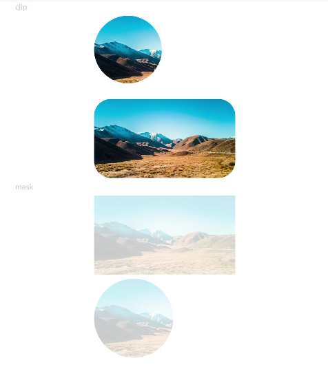

# 形状裁剪<a name="ZH-CN_TOPIC_0000001128996148"></a>

<a name="table146051414275"></a>
<table><thead align="left"><tr id="row668017152712"><th class="cellrowborder" valign="top" width="14.19%" id="mcps1.1.5.1.1"><p id="p668014113277"><a name="p668014113277"></a><a name="p668014113277"></a>名称</p>
</th>
<th class="cellrowborder" valign="top" width="19.52%" id="mcps1.1.5.1.2"><p id="p1568031172711"><a name="p1568031172711"></a><a name="p1568031172711"></a>参数类型</p>
</th>
<th class="cellrowborder" valign="top" width="15.07%" id="mcps1.1.5.1.3"><p id="p1068081122712"><a name="p1068081122712"></a><a name="p1068081122712"></a>默认值</p>
</th>
<th class="cellrowborder" valign="top" width="51.22%" id="mcps1.1.5.1.4"><p id="p186806116274"><a name="p186806116274"></a><a name="p186806116274"></a>描述</p>
</th>
</tr>
</thead>
<tbody><tr id="row1068015110273"><td class="cellrowborder" valign="top" width="14.19%" headers="mcps1.1.5.1.1 "><p id="p156804114277"><a name="p156804114277"></a><a name="p156804114277"></a>clip</p>
</td>
<td class="cellrowborder" valign="top" width="19.52%" headers="mcps1.1.5.1.2 "><p id="p1668071182718"><a name="p1668071182718"></a><a name="p1668071182718"></a>Shape | boolean</p>
</td>
<td class="cellrowborder" valign="top" width="15.07%" headers="mcps1.1.5.1.3 "><p id="p368017172715"><a name="p368017172715"></a><a name="p368017172715"></a>false</p>
</td>
<td class="cellrowborder" valign="top" width="51.22%" headers="mcps1.1.5.1.4 "><p id="p10680151172719"><a name="p10680151172719"></a><a name="p10680151172719"></a>参数为Shape类型时，按指定的形状对当前组件进行裁剪；参数为boolean类型时，设置是否按照边缘轮廓进行裁剪。</p>
</td>
</tr>
<tr id="row2068091122714"><td class="cellrowborder" valign="top" width="14.19%" headers="mcps1.1.5.1.1 "><p id="p12680817272"><a name="p12680817272"></a><a name="p12680817272"></a>mask</p>
</td>
<td class="cellrowborder" valign="top" width="19.52%" headers="mcps1.1.5.1.2 "><p id="p668010119272"><a name="p668010119272"></a><a name="p668010119272"></a>Shape</p>
</td>
<td class="cellrowborder" valign="top" width="15.07%" headers="mcps1.1.5.1.3 "><p id="p196818116273"><a name="p196818116273"></a><a name="p196818116273"></a>-</p>
</td>
<td class="cellrowborder" valign="top" width="51.22%" headers="mcps1.1.5.1.4 "><p id="p168115111272"><a name="p168115111272"></a><a name="p168115111272"></a>在当前组件上加上指定形状的遮罩。</p>
</td>
</tr>
</tbody>
</table>

## 示例<a name="section1794417203411"></a>

```
@Entry
@Component
struct ClipAndMaskExample {
  build() {
    Column({ space: 5 }) {
      Text('clip').fontSize(9).width('90%').fontColor(0xCCCCCC)
      // 用一个280px直径的圆对图像进行裁剪
      Image('/comment/bg.jpg')
        .clip(new Circle({ width: 80, height: 80 }))
        .width('500px').height('280px')

      Row() {
        Image('/comment/bg.jpg').width('500px').height('280px')
      }
      .clip(true)
      .borderRadius(20)

      Text('mask').fontSize(9).width('90%').fontColor(0xCCCCCC)
      // 给图像添加了一个500px*280px的遮罩
      Image('/comment/bg.jpg')
        .mask(new Rect({ width: '500px', height: '280px' }).fill(Color.Gray))
        .width('500px').height('280px')

      // 给图像添加了一个280px*280px的圆遮罩
      Image('/comment/bg.jpg')
        .mask(new Circle({ width: '280px', height: '280px' }).fill(Color.Gray))
        .width('500px').height('281px')
    }
    .width('100%')
    .margin({ top: 5 })
  }
}
```



