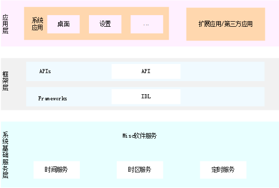

# 时间组件<a name="ZH-CN_TOPIC_0000001115554184"></a>

-   [简介](#section11660541593)
-   [目录](#section161941989596)
-   [说明](#section38521239153117)
    -   [js接口说明](#section11908203714422)
    -   [js接口使用说明](#section9938411124317)

-   [相关仓](#section1371113476307)

## 简介<a name="section11660541593"></a>

时间组件提供管理系统时间时区和定时的能力。

**图 1**  子系统架构图<a name="fig143011012341"></a>  


## 目录<a name="section161941989596"></a>

```
/base/miscservices/time
├── etc                      # 组件包含的进程的配置文件
├── figures                  # 构架图
├── interfaces               # 组件对外提供的接口代码
│   └── innerkits            # 服务间接口
│   └── kits                 # 对应用提供的接口
├── profile                  # 组件包含的系统服务的配置文件
└── services                 # 时间服务实现
```

## 说明<a name="section38521239153117"></a>

### js接口说明<a name="section11908203714422"></a>

**表 1**  js组件systemTime开放的主要方法

<a name="table033515471012"></a>
<table><thead align="left"><tr id="row143351854201012"><th class="cellrowborder" valign="top" width="50%" id="mcps1.2.3.1.1"><p id="p103351154121010"><a name="p103351154121010"></a><a name="p103351154121010"></a>接口名</p>
</th>
<th class="cellrowborder" valign="top" width="50%" id="mcps1.2.3.1.2"><p id="p1033585416105"><a name="p1033585416105"></a><a name="p1033585416105"></a>描述</p>
</th>
</tr>
</thead>
<tbody><tr id="row204321219393"><td class="cellrowborder" valign="top" width="50%" headers="mcps1.2.3.1.1 "><p id="p1893413268144"><a name="p1893413268144"></a><a name="p1893413268144"></a>function setTime(time : number) : Promise&lt;boolean&gt;</p>
</td>
<td class="cellrowborder" valign="top" width="50%" headers="mcps1.2.3.1.2 "><p id="p18761104812149"><a name="p18761104812149"></a><a name="p18761104812149"></a>设置系统时间（1970-01-01至今毫秒数），Promise方式</p>
</td>
</tr>
<tr id="row13335054111018"><td class="cellrowborder" valign="top" width="50%" headers="mcps1.2.3.1.1 "><p id="p12832214151418"><a name="p12832214151418"></a><a name="p12832214151418"></a>function setTime(time : number, callback : AsyncCallback&lt;boolean&gt;) : void</p>
</td>
<td class="cellrowborder" valign="top" width="50%" headers="mcps1.2.3.1.2 "><p id="p3335145451011"><a name="p3335145451011"></a><a name="p3335145451011"></a>设置系统时间（1970-01-01至今毫秒数），callback方式</p>
</td>
</tr>
<tr id="row204321219393"><td class="cellrowborder" valign="top" width="50%" headers="mcps1.2.3.1.1 "><p id="p1893413268144"><a name="p1893413268144"></a><a name="p1893413268144"></a>function setDate(date: Date, callback: AsyncCallback&lt;boolean&gt;): void;</p>
</td>
<td class="cellrowborder" valign="top" width="50%" headers="mcps1.2.3.1.2 "><p id="p18761104812149"><a name="p18761104812149"></a><a name="p18761104812149"></a>设置系统时间（Date格式），Promise方式</p>
</td>
</tr>
<tr id="row204321219393"><td class="cellrowborder" valign="top" width="50%" headers="mcps1.2.3.1.1 "><p id="p1893413268144"><a name="p1893413268144"></a><a name="p1893413268144"></a>function setDate(date: Date): Promise&lt;boolean&gt;</p>
</td>
<td class="cellrowborder" valign="top" width="50%" headers="mcps1.2.3.1.2 "><p id="p18761104812149"><a name="p18761104812149"></a><a name="p18761104812149"></a>设置系统时间（Date格式），callback方式</p>
</td>
</tr>
<tr id="row204321219393"><td class="cellrowborder" valign="top" width="50%" headers="mcps1.2.3.1.1 "><p id="p1893413268144"><a name="p1893413268144"></a><a name="p1893413268144"></a>function setTimezone(timezone: string, callback: AsyncCallback&lt;boolean&gt;): void</p>
</td>
<td class="cellrowborder" valign="top" width="50%" headers="mcps1.2.3.1.2 "><p id="p18761104812149"><a name="p18761104812149"></a><a name="p18761104812149"></a>设置系统时区，callback方式</p>
</td>
</tr>
<tr id="row204321219393"><td class="cellrowborder" valign="top" width="50%" headers="mcps1.2.3.1.1 "><p id="p1893413268144"><a name="p1893413268144"></a><a name="p1893413268144"></a>function setTimezone(timezone: string): Promise&lt;boolean&gt;</p>
</td>
<td class="cellrowborder" valign="top" width="50%" headers="mcps1.2.3.1.2 "><p id="p18761104812149"><a name="p18761104812149"></a><a name="p18761104812149"></a>设置系统时区，Promise方式</p>
</td>
</tr>
</tbody>
</table>


**表 2**  js组件systemTimer开放的主要方法

<a name="table033515471012"></a>
<table><thead align="left"><tr id="row143351854201012"><th class="cellrowborder" valign="top" width="50%" id="mcps1.2.3.1.1"><p id="p103351154121010"><a name="p103351154121010"></a><a name="p103351154121010"></a>接口名</p>
</th>
<th class="cellrowborder" valign="top" width="50%" id="mcps1.2.3.1.2"><p id="p1033585416105"><a name="p1033585416105"></a><a name="p1033585416105"></a>描述</p>
</th>
</tr>
</thead>
<tbody><tr id="row204321219393"><td class="cellrowborder" valign="top" width="50%" headers="mcps1.2.3.1.1 "><p id="p1893413268144"><a name="p1893413268144"></a><a name="p1893413268144"></a>function createTimer(options: TimerOptions, callback: AsyncCallback&lt;number&gt;): void</p>
</td>
<td class="cellrowborder" valign="top" width="50%" headers="mcps1.2.3.1.2 "><p id="p18761104812149"><a name="p18761104812149"></a><a name="p18761104812149"></a>创建定时器，callback方式</p>
</td>
</tr>
<tr id="row13335054111018"><td class="cellrowborder" valign="top" width="50%" headers="mcps1.2.3.1.1 "><p id="p12832214151418"><a name="p12832214151418"></a><a name="p12832214151418"></a>function createTimer(options: TimerOptions): Promise&lt;number&gt;</p>
</td>
<td class="cellrowborder" valign="top" width="50%" headers="mcps1.2.3.1.2 "><p id="p3335145451011"><a name="p3335145451011"></a><a name="p3335145451011"></a>创建定时器，promise方式</p>
</td>
</tr>
<tr id="row204321219393"><td class="cellrowborder" valign="top" width="50%" headers="mcps1.2.3.1.1 "><p id="p1893413268144"><a name="p1893413268144"></a><a name="p1893413268144"></a>function startTimer(timer: number, triggerTime: number, callback: AsyncCallback&lt;boolean&gt;): void</p>
</td>
<td class="cellrowborder" valign="top" width="50%" headers="mcps1.2.3.1.2 "><p id="p18761104812149"><a name="p18761104812149"></a><a name="p18761104812149"></a>开启定时器，callback方式</p>
</td>
</tr>
<tr id="row204321219393"><td class="cellrowborder" valign="top" width="50%" headers="mcps1.2.3.1.1 "><p id="p1893413268144"><a name="p1893413268144"></a><a name="p1893413268144"></a>function startTimer(timer: number, triggerTime: number): Promise&lt;boolean&gt;</p>
</td>
<td class="cellrowborder" valign="top" width="50%" headers="mcps1.2.3.1.2 "><p id="p18761104812149"><a name="p18761104812149"></a><a name="p18761104812149"></a>开启定时器，promise方式</p>
</td>
</tr>
<tr id="row204321219393"><td class="cellrowborder" valign="top" width="50%" headers="mcps1.2.3.1.1 "><p id="p1893413268144"><a name="p1893413268144"></a><a name="p1893413268144"></a>function stopTimer(timer: number, callback: AsyncCallback&lt;boolean&gt;):  void</p>
</td>
<td class="cellrowborder" valign="top" width="50%" headers="mcps1.2.3.1.2 "><p id="p18761104812149"><a name="p18761104812149"></a><a name="p18761104812149"></a>停止定时器，callback方式</p>
</td>
</tr>
<tr id="row204321219393"><td class="cellrowborder" valign="top" width="50%" headers="mcps1.2.3.1.1 "><p id="p1893413268144"><a name="p1893413268144"></a><a name="p1893413268144"></a>function stopTimer(timer: number): Promise&lt;boolean&gt;</p>
</td>
<td class="cellrowborder" valign="top" width="50%" headers="mcps1.2.3.1.2 "><p id="p18761104812149"><a name="p18761104812149"></a><a name="p18761104812149"></a>停止定时器，promise方式</p>
</td>
</tr>
<tr id="row204321219393"><td class="cellrowborder" valign="top" width="50%" headers="mcps1.2.3.1.1 "><p id="p1893413268144"><a name="p1893413268144"></a><a name="p1893413268144"></a>function destroyTimer(timer: number, callback: AsyncCallback&lt;boolean&gt;): void</p>
</td>
<td class="cellrowborder" valign="top" width="50%" headers="mcps1.2.3.1.2 "><p id="p18761104812149"><a name="p18761104812149"></a><a name="p18761104812149"></a>销毁定时器，callback方式</p>
</td>
</tr>
<tr id="row204321219393"><td class="cellrowborder" valign="top" width="50%" headers="mcps1.2.3.1.1 "><p id="p1893413268144"><a name="p1893413268144"></a><a name="p1893413268144"></a>function destroyTimer(timer: number): Promise&lt;boolean&gt;</p>
</td>
<td class="cellrowborder" valign="top" width="50%" headers="mcps1.2.3.1.2 "><p id="p18761104812149"><a name="p18761104812149"></a><a name="p18761104812149"></a>摧毁定时器，promise方式</p>
</td>
</tr>
</tbody>
</table>

**表 3**  systemTimer组件参数TimerOptions说明

<a name="table033515471012"></a>
<table><thead align="left"><tr id="row143351854201012"><th class="cellrowborder" valign="top" width="20%" id="mcps1.2.3.1.1"><p id="p103351154121010"><a name="p103351154121010"></a><a name="p103351154121010"></a>名称</p>
</th>
<th class="cellrowborder" valign="top" width="10%" id="mcps1.2.3.1.2"><p id="p1033585416105"><a name="p1033585416105"></a><a name="p1033585416105"></a>类型</p>
</th>
<th class="cellrowborder" valign="top" width="70%" id="mcps1.2.3.1.3"><p id="p1033585416105"><a name="p1033585416105"></a><a name="p1033585416105"></a>说明</p>
</th>
</tr>
</thead>
<tbody><tr id="row204321219393"><td class="cellrowborder" valign="top" width="20%" headers="mcps1.2.3.1.1 "><p id="p1893413268144"><a name="p1893413268144"></a><a name="p1893413268144"></a>type</p>
</td>
<td class="cellrowborder" valign="top" width="10%" headers="mcps1.2.3.1.2 "><p id="p18761104812149"><a name="p18761104812149"></a><a name="p18761104812149"></a>number</p>
</td>
<td class="cellrowborder" valign="top" width="70%" headers="mcps1.2.3.1.3 "><p id="p18761104812149"><a name="p18761104812149"></a><a name="p18761104812149"></a>TIMER_TYPE_REALTIME:  设置为系统启动时间定时器，否则为walltime定时器;
  TIMER_TYPE_WAKEUP: 设置为唤醒定时器，否则为非唤醒;
  const TIMER_TYPE_EXACT: 设置为精准定时器，否则为非精准定时器;
  const TIMER_TYPE_IDLE: 设置为IDLE模式定时器，否则为非IDLE模式定时器（暂不支持）
</p>
</td>
</tr>
<tr id="row204321219393"><td class="cellrowborder" valign="top" width="20%" headers="mcps1.2.3.1.1 "><p id="p1893413268144"><a name="p1893413268144"></a><a name="p1893413268144"></a>repeat</p>
</td>
<td class="cellrowborder" valign="top" width="10%" headers="mcps1.2.3.1.2 "><p id="p18761104812149"><a name="p18761104812149"></a><a name="p18761104812149"></a>boolean</p>
</td>
<td class="cellrowborder" valign="top" width="70%" headers="mcps1.2.3.1.3 "><p id="p18761104812149"><a name="p18761104812149"></a><a name="p18761104812149"></a>true 为循环定时器，false为单次定时器</p>
</td>
</tr>
<tr id="row204321219393"><td class="cellrowborder" valign="top" width="20%" headers="mcps1.2.3.1.1 "><p id="p1893413268144"><a name="p1893413268144"></a><a name="p1893413268144"></a>interval</p>
</td>
<td class="cellrowborder" valign="top" width="10%" headers="mcps1.2.3.1.2 "><p id="p18761104812149"><a name="p18761104812149"></a><a name="p18761104812149"></a>number</p>
</td>
<td class="cellrowborder" valign="top" width="70%" headers="mcps1.2.3.1.3 "><p id="p18761104812149"><a name="p18761104812149"></a><a name="p18761104812149"></a>如果是循环定时器，repeat值应大于5000毫秒，非重复定时器置为0</p>
</td>
</tr>
<tr id="row204321219393"><td class="cellrowborder" valign="top" width="20%" headers="mcps1.2.3.1.1 "><p id="p1893413268144"><a name="p1893413268144"></a><a name="p1893413268144"></a>wantAgent</p>
</td>
<td class="cellrowborder" valign="top" width="10%" headers="mcps1.2.3.1.2 "><p id="p18761104812149"><a name="p18761104812149"></a><a name="p18761104812149"></a>wantAgent</p>
</td>
<td class="cellrowborder" valign="top" width="70%" headers="mcps1.2.3.1.3 "><p id="p18761104812149"><a name="p18761104812149"></a><a name="p18761104812149"></a>设置通知的wantagent，定时器到期后通知</p>
</td>
</tr>
<tr id="row204321219393"><td class="cellrowborder" valign="top" width="20%" headers="mcps1.2.3.1.1 "><p id="p1893413268144"><a name="p1893413268144"></a><a name="p1893413268144"></a>callback</p>
</td>
<td class="cellrowborder" valign="top" width="10%" headers="mcps1.2.3.1.2 "><p id="p18761104812149"><a name="p18761104812149"></a><a name="p18761104812149"></a> => void</p>
</td>
<td class="cellrowborder" valign="top" width="70%" headers="mcps1.2.3.1.3 "><p id="p18761104812149"><a name="p18761104812149"></a><a name="p18761104812149"></a>设置回调函数，定时器到期后触发</p>
</td>
</tr>
</tbody>
</table>
### js接口使用说明<a name="section9938411124317"></a>

systemTime模块使用示例：

```
// 导入模块
import systemTime from '@ohos.systemTime';

// Promise方式的异步方法设置时间   
var time = 1611081385000;   
systemTime.setTime(time)    
      .then((value) => {        
          console.log(`success to systemTime.setTime: ${value}`);   
       }).catch((err) => {        
          console.error(`failed to systemTime.setTime because ${err.message}`)  
    });


// callback方式的异步方法设置时间

var time = 1611081385000;   
systemTime.setTime(time, (err, value) => {   
     if (err) {        
          console.error(`failed to systemTime.setTime because ${err.message}`);   
           return;   
         }    
       console.log(`success to systemTime.setTime: ${value}`);   
    });

```

systemTimer模块使用示例：

```
// 导入模块
import systemTimer from '@ohos.systemTimer';

console.log("start")   
var options:TimerOptions{   
   type:TIMER_TYPE_REALTIME,   
   repeat:false,   
   interval:Number.MAX_VALUE/2,   
   persistent:false   
}

console.log("create timer")   
let timerId = systemTimer.Timer(options)     
console.log("start timer")   
let startTimerRes = systemTimer.startTimer(timerId, 100000)   
console.log("stop timer")   
let stopTimerRes = systemTimer.stopTimer(timerId)   
console.log("destroy timer")   
let destroyTimerRes = systemTimer.destroyTimer(timerId)   
console.log('end');   


```

## 相关仓<a name="section1371113476307"></a>

**Misc软件服务子系统**

miscservices\_time

