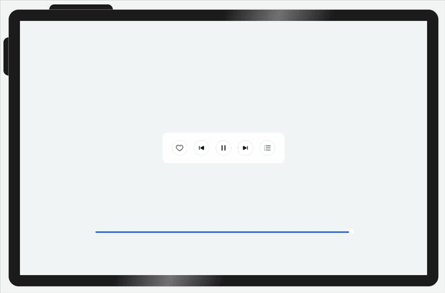

# 隐藏能力


隐藏能力是指容器组件内的子组件，按照其预设的显示优先级，随容器组件尺寸变化显示或隐藏，其中相同显示优先级的子组件同时显示或隐藏。它是一种比较高级的布局方式，常用于分辨率变化较大，且不同分辨率下显示内容有所差异的场景。主要思想是通过增加或减少显示内容，来保持最佳的显示效果。


隐藏能力通过设置**布局优先级**（displayPriority属性）来控制显隐，当布局主轴方向剩余尺寸不足以满足全部元素时，按照布局优先级大小，从小到大依次隐藏，直到容器能够完整显示剩余元素。具有相同布局优先级的元素将同时显示或者隐藏。


可以访问[布局约束](../../reference/arkui-ts/ts-universal-attributes-layout-constraints.md)，了解displayPriority属性的详细信息。


## 示例：

父容器尺寸发生变化时，其子元素按照预设的优先级显示或隐藏。




```ts
@Entry
@Component
struct HiddenCapabilitySample {
  @State rate: number = 0.45;

  // 底部滑块，可以通过拖拽滑块改变容器尺寸
  @Builder slider() {
    Slider({ value: this.rate * 100, min: 10, max: 45, style: SliderStyle.OutSet })
      .blockColor(Color.White)
      .width('60%')
      .height(50)
      .onChange((value: number) => {
        this.rate = value / 100;
      })
      .position({ x: '20%', y: '80%' })
  }

  build() {
      Flex({ direction: FlexDirection.Column,
        justifyContent: FlexAlign.Center,
        alignItems: ItemAlign.Center }) {
        Flex({ justifyContent: FlexAlign.Center, alignItems: ItemAlign.Center }) {
          Image($r("app.media.favorite"))
            .width(48)
            .height(48)
            .objectFit(ImageFit.Contain)
            .margin({ left: 12, right: 12 })
            .displayPriority(1)  // 布局优先级

          Image($r("app.media.down"))
            .width(48)
            .height(48)
            .objectFit(ImageFit.Contain)
            .margin({ left: 12, right: 12 })
            .displayPriority(2)  // 布局优先级

          Image($r("app.media.pause"))
            .width(48)
            .height(48)
            .objectFit(ImageFit.Contain)
            .margin({ left: 12, right: 12 })
            .displayPriority(3)  // 布局优先级

          Image($r("app.media.next"))
            .width(48)
            .height(48)
            .objectFit(ImageFit.Contain)
            .margin({ left: 12, right: 12 })
            .displayPriority(2)  // 布局优先级

          Image($r("app.media.list"))
            .width(48)
            .height(48)
            .objectFit(ImageFit.Contain)
            .margin({ left: 12, right: 12 })
            .displayPriority(1)  // 布局优先级
        }
        .width(this.rate * 100 + '%')
        .height(96)
        .borderRadius(16)
        .backgroundColor('#FFFFFF')

        this.slider()
      }
      .width('100%')
      .height('100%')
      .backgroundColor('#F1F3F5')
  }
}
```
