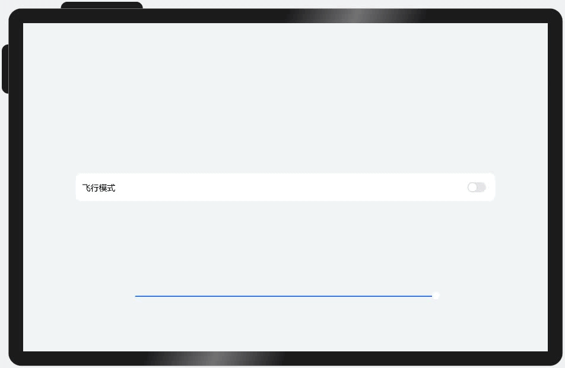
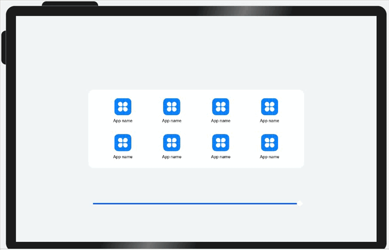
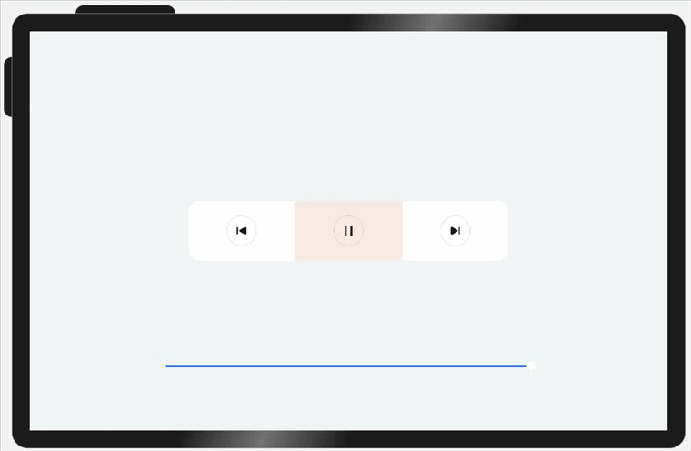
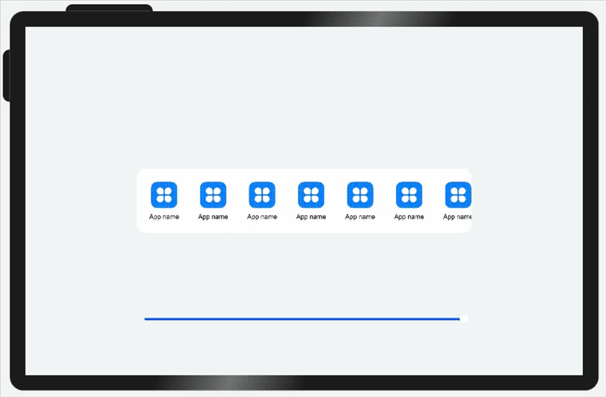
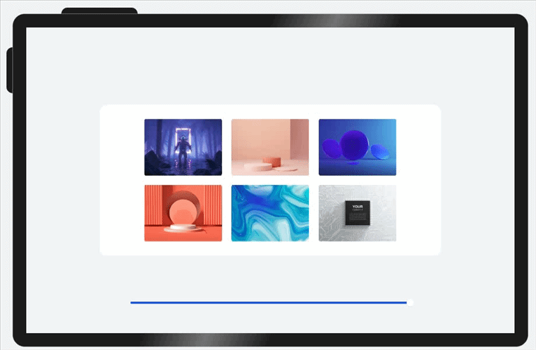

# 自适应布局


针对常见的开发场景，方舟开发框架提炼了七种自适应布局能力，这些布局可以独立使用，也可多种布局叠加使用。


  | 自适应布局类别 | 自适应布局能力 | 使用场景 | 实现方式 | 
| -------- | -------- | -------- | -------- |
| 自适应拉伸 | [拉伸能力](#拉伸能力) | 容器组件尺寸发生变化时，增加或减小的空间**全部分配**给容器组件内**指定区域**。 | [Flex布局](../../reference/apis-arkui/arkui-ts/ts-universal-attributes-flex-layout.md)的flexGrow和flexShrink属性 | 
|  | [均分能力](#均分能力) | 容器组件尺寸发生变化时，增加或减小的空间**均匀分配**给容器组件内**所有空白区域**。 | [Row组件](../../reference/apis-arkui/arkui-ts/ts-container-row.md)、[Column组件](../../reference/apis-arkui/arkui-ts/ts-container-column.md)或[Flex组件](../../reference/apis-arkui/arkui-ts/ts-container-flex.md)的justifyContent属性设置为FlexAlign.SpaceEvenly | 
| 自适应缩放 | [占比能力](#占比能力) | 子组件的宽或高**按照预设的比例**，随容器组件发生变化。 | 基于通用属性的两种实现方式：<br/>-&nbsp;将子组件的宽高设置为父组件宽高的百分比<br/>-&nbsp;layoutWeight属性 | 
|  | [缩放能力](#缩放能力) | 子组件的宽高**按照预设的比例**，随容器组件发生变化，且变化过程中子组件的**宽高比不变**。 | [布局约束](../../reference/apis-arkui/arkui-ts/ts-universal-attributes-layout-constraints.md)的aspectRatio属性 | 
| 自适应延伸 | [延伸能力](#延伸能力) | 容器组件内的子组件，按照其**在列表中的先后顺序**，随容器组件尺寸变化显示或隐藏。 | 基于容器组件的两种实现方式：<br/>-&nbsp;通过[List组件](../../reference/apis-arkui/arkui-ts/ts-container-list.md)实现<br/>-&nbsp;通过[Scroll组件](../../reference/apis-arkui/arkui-ts/ts-container-scroll.md)配合[Row组件](../../reference/apis-arkui/arkui-ts/ts-container-row.md)或[Column组件](../../reference/apis-arkui/arkui-ts/ts-container-column.md)实现 | 
|  | [隐藏能力](#隐藏能力) | 容器组件内的子组件，按照其**预设的显示优先级**，随容器组件尺寸变化显示或隐藏。**相同显示优先级的子组件同时显示或隐藏**。 | [布局约束](../../reference/apis-arkui/arkui-ts/ts-universal-attributes-layout-constraints.md)的displayPriority属性 | 
| 自适应折行 | [折行能力](#折行能力) | 容器组件尺寸发生变化时，如果布局方向尺寸不足以显示完整内容，**自动换行**。 | [Flex组件](../../reference/apis-arkui/arkui-ts/ts-container-flex.md)的wrap属性设置为FlexWrap.Wrap | 


下面我们依次介绍这几种自适应布局能力。


## 拉伸能力


拉伸能力是指容器组件尺寸发生变化时，增加或减小的空间全部分配给容器组件内指定区域。


拉伸能力通常通过[Flex布局](../../reference/apis-arkui/arkui-ts/ts-universal-attributes-flex-layout.md)中的flexGrow和flexShrink属性实现，flexGrow和flexShrink属性常与flexBasis属性搭配使用，故将这三个属性放在一起介绍。


  | 属性 | 类型 | 默认值 | 描述 | 
| -------- | -------- | -------- | -------- |
| flexGrow | number | 0 | 仅当父容器宽度大于所有子组件宽度的总和时，该属性生效。配置了此属性的子组件，按照比例拉伸，分配父容器的多余空间。 | 
| flexShrink | number | 1 | 仅当父容器宽度小于所有子组件宽度的总和时，该属性生效。配置了此属性的子组件，按照比例收缩，分配父容器的不足空间。 | 
| flexBasis | 'auto'&nbsp;\|&nbsp;[Length](../../reference/apis-arkui/arkui-ts/ts-types.md#length) | 'auto' | 设置组件在Flex容器中主轴方向上基准尺寸。'auto'意味着使用组件原始的尺寸，不做修改。<br/>flexBasis属性不是必须的，通过width或height也可以达到同样的效果。当flexBasis属性与width或height发生冲突时，以flexBasis属性为准。 | 


> **说明：**
> - 开发者期望将父容器的剩余空间全部分配给某空白区域时，也可以通过[Blank组件](../../reference/apis-arkui/arkui-ts/ts-basic-components-blank.md)实现。注意仅当父组件为Row\Column\Flex组件时，Blank组件才会生效。
> 
> - 类Web开发范式也是通过flex-grow和flex-shrink实现拉伸能力，同时也支持配置flex-basis，详见[通用样式](../../reference/apis-arkui/arkui-js/js-components-common-styles.md)。
> 
> - 类Web开发范式没有提供blank组件，但可以通过div组件模拟blank组件的行为，如“&lt;div style='flex-grow: 1; flex-shrink: 0; flex-basis: 0'&gt;&lt;/div&gt;”。

**示例1**


本示例中的页面由中间的内容区（包含一张图片）以及两侧的留白区组成，各区域的属性配置如下。

* 中间内容区的宽度设置为400vp，同时将flexGrow属性设置为1，flexShrink属性设置为0。

* 两侧留白区的宽度设置为150vp，同时将flexGrow属性设置为0，flexShrink属性设置为1。

由上可知，父容器的基准尺寸是700vp（150vp+400vp+150vp）。

可以通过拖动底部的滑动条改变父容器的尺寸，查看布局变化。

* 当父容器的尺寸大于700vp时，父容器中多余的空间全部分配给中间内容区。

* 当父容器的尺寸小于700vp时，左右两侧的留白区按照“1:1”的比例收缩（即平均分配父容器的不足空间）。


```ts
@Entry
@Component
struct FlexibleCapabilitySample1 {
  @State containerWidth: number = 402

  // 底部滑块，可以通过拖拽滑块改变容器尺寸。
  @Builder slider() {
    Slider({ value: this.containerWidth, min: 402, max: 1000, style: SliderStyle.OutSet })
      .blockColor(Color.White)
      .width('60%')
      .onChange((value: number) => {
        this.containerWidth = value;
      })
      .position({ x: '20%', y: '80%' })
  }

  build() {
    Column() {
      Column() {
        Row() {
          // 通过flexGrow和flexShrink属性，将多余的空间全部分配给图片，将不足的控件全部分配给两侧空白区域。
          Row().width(150).height(400).backgroundColor('#FFFFFF')
            .flexGrow(0).flexShrink(1)
          Image($r("app.media.illustrator")).width(400).height(400)
            .objectFit(ImageFit.Contain)
            .backgroundColor("#66F1CCB8")
            .flexGrow(1).flexShrink(0)
          Row().width(150).height(400).backgroundColor('#FFFFFF')
            .flexGrow(0).flexShrink(1)
        }
        .width(this.containerWidth)
        .justifyContent(FlexAlign.Center)
        .alignItems(VerticalAlign.Center)
      }

      this.slider()
    }
    .width('100%')
    .height('100%')
    .backgroundColor('#F1F3F5')
    .justifyContent(FlexAlign.Center)
    .alignItems(HorizontalAlign.Center)
  }
}
```

**示例2**


文字和开关的尺寸固定，仅有中间空白区域（Blank组件）随父容器尺寸变化而伸缩。





```ts
@Entry
@Component
struct FlexibleCapabilitySample2 {
  @State rate: number = 0.8

  // 底部滑块，可以通过拖拽滑块改变容器尺寸
  @Builder slider() {
    Slider({ value: this.rate * 100, min: 30, max: 80, style: SliderStyle.OutSet })
      .blockColor(Color.White)
      .width('60%')
      .onChange((value: number) => {
        this.rate = value / 100;
      })
      .position({ x: '20%', y: '80%' })
  }

  build() {
    Column() {
      Column() {
        Row() {
          Text('飞行模式')
            .fontSize(16)
            .width(135)
            .height(22)
            .fontWeight(FontWeight.Medium)
            .lineHeight(22)
          Blank()      // 通过Blank组件实现拉伸能力
          Toggle({ type: ToggleType.Switch })
            .width(36)
            .height(20)
        }
        .height(55)
        .borderRadius(12)
        .padding({ left: 13, right: 13 })
        .backgroundColor('#FFFFFF')
        .width(this.rate * 100 + '%')
      }

      this.slider()
    }
    .width('100%')
    .height('100%')
    .backgroundColor('#F1F3F5')
    .justifyContent(FlexAlign.Center)
    .alignItems(HorizontalAlign.Center)
  }
}
```


## 均分能力


均分能力是指容器组件尺寸发生变化时，增加或减小的空间均匀分配给容器组件内所有空白区域。它常用于内容数量固定、均分显示的场景，比如工具栏、底部菜单栏等。


均分能力可以通过将[Row组件](../../reference/apis-arkui/arkui-ts/ts-container-row.md)、[Column组件](../../reference/apis-arkui/arkui-ts/ts-container-column.md)或[Flex组件](../../reference/apis-arkui/arkui-ts/ts-container-flex.md)的justifyContent属性设置为FlexAlign.SpaceEvenly实现，即子元素在父容器主轴方向等间距布局，相邻元素之间的间距、第一个元素与行首的间距、最后一个元素到行尾的间距都完全一样。


> **说明：**
> - 均分能力还可以通过其它方式实现，如使用[Grid网格组件](../../reference/apis-arkui/arkui-ts/ts-container-grid.md)或在每个组件间添加Blank组件等。
> 
> - 类Web开发范式中，通过将[div组件](../../reference/apis-arkui/arkui-js/js-components-container-div.md)的justify-content属性设置为space-evenly来实现均分布局。


**示例：**


父容器尺寸变化过程中，图标及文字的尺寸不变，图标间的间距及图标离左右边缘的距离同时均等改变。





```ts
@Entry
@Component
struct EquipartitionCapabilitySample {
  readonly list: number [] = [0, 1, 2, 3]
  @State rate: number = 0.6

  // 底部滑块，可以通过拖拽滑块改变容器尺寸
  @Builder slider() {
    Slider({ value: this.rate * 100, min: 30, max: 60, style: SliderStyle.OutSet })
      .blockColor(Color.White)
      .width('60%')
      .onChange((value: number) => {
        this.rate = value / 100
      })
      .position({ x: '20%', y: '80%' })
  }

  build() {
    Column() {
      Column() {
        // 均匀分配父容器主轴方向的剩余空间
        Row() {
          ForEach(this.list, (item:number) => {
            Column() {
              Image($r("app.media.startIcon")).width(48).height(48).margin({ top: 8 })
              Text('App name')
                .width(64)
                .height(30)
                .lineHeight(15)
                .fontSize(12)
                .textAlign(TextAlign.Center)
                .margin({ top: 8 })
                .padding({ bottom: 15 })
            }
            .width(80)
            .height(102)
            .flexShrink(1)
          })
        }
        .width('100%')
        .justifyContent(FlexAlign.SpaceEvenly)
        // 均匀分配父容器主轴方向的剩余空间
        Row() {
          ForEach(this.list, (item:number) => {
            Column() {
              Image($r("app.media.startIcon")).width(48).height(48).margin({ top: 8 })
              Text('App name')
                .width(64)
                .height(30)
                .lineHeight(15)
                .fontSize(12)
                .textAlign(TextAlign.Center)
                .margin({ top: 8 })
                .padding({ bottom: 15 })
            }
            .width(80)
            .height(102)
            .flexShrink(1)
          })
        }
        .width('100%')
        .justifyContent(FlexAlign.SpaceEvenly)
      }
      .width(this.rate * 100 + '%')
      .height(222)
      .padding({ top: 16 })
      .backgroundColor('#FFFFFF')
      .borderRadius(16)

      this.slider()
    }
    .width('100%')
    .height('100%')
    .backgroundColor('#F1F3F5')
    .justifyContent(FlexAlign.Center)
    .alignItems(HorizontalAlign.Center)
  }
}
```


## 占比能力


占比能力是指子组件的宽高按照预设的比例，随父容器组件发生变化。


占比能力通常有两种实现方式：


- 将子组件的宽高设置为父组件宽高的百分比，详见[尺寸设置](../../reference/apis-arkui/arkui-ts/ts-universal-attributes-size.md)及[长度类型](../../reference/apis-arkui/arkui-ts/ts-types.md#length)。

- 通过layoutWeight属性配置互为兄弟关系的组件在父容器主轴方向的布局权重，详见[尺寸设置](../../reference/apis-arkui/arkui-ts/ts-universal-attributes-size.md)。
  - 当父容器尺寸确定时，其子组件按照开发者配置的权重比例分配父容器中主轴方向的空间。
  - 仅当父容器是Row、Column或者Flex时，layoutWeight属性才会生效。
  - 设置layoutWeight属性后，组件本身的尺寸会失效。比如同时设置了.width('40%')和.layoutWeight(1)，那么只有.layoutWeight(1)会生效。


layoutWeight存在使用限制，所以实际使用过程中大多通过将子组件宽高设置为父组件的百分比来实现占比能力。


> **说明：**
> - 占比能力在实际开发中使用的非常广泛，可以通过很多不同的方式实现占比能力，如还可以通过[Grid组件](../../reference/apis-arkui/arkui-ts/ts-container-grid.md)的columnsTemplate属性设置网格容器中列的数量及其宽度比例，或通过配置子组件在栅格（本章后文将详细介绍栅格系统）中占据不同的列数来实现占比能力。本小节仅介绍最基础和常用的实现方式，局限性较大或比非常小众的实现方式，本文不做展开介绍。
> 
> - 类Web开发范式同样支持以百分比的形式设置组件的宽高，详见[通用样式](../../reference/apis-arkui/arkui-js/js-components-common-styles.md)中关于width和height的介绍以及[长度类型介绍](../../reference/apis-arkui/arkui-js/js-appendix-types.md#长度类型)。
> 
> - 与声明式开发范式中的layoutWeight属性类似，类Web开发范式提供了[flex-weight样式](../../reference/apis-arkui/arkui-js/js-components-common-atomic-layout.md#占比能力)用于配置互为兄弟关系的组件在父容器主轴方向的布局权重。


**示例：**


简单的播放控制栏，其中“上一首”、“播放/暂停”、“下一首”的layoutWeight属性都设置为1，因此它们按照“1:1:1”的比例均分父容器主轴方向的空间。


将三个按钮的.layoutWeight(1)分别替换为.width('33%')、.width('34%')、.width('33%')，也可以实现与当前同样的显示效果。





```ts
@Entry
@Component
struct ProportionCapabilitySample {
  @State rate: number = 0.5

  // 底部滑块，可以通过拖拽滑块改变容器尺寸
  @Builder slider() {
    Slider({ value: 100, min: 25, max: 50, style: SliderStyle.OutSet })
      .blockColor(Color.White)
      .width('60%')
      .height(50)
      .onChange((value: number) => {
        this.rate = value / 100
      })
      .position({ x: '20%', y: '80%' })
  }

  build() {
    Column() {
      Column() {
        Row() {
          Column() {
            Image($r("app.media.down"))
              .width(48)
              .height(48)
          }
          .height(96)
          .layoutWeight(1)  // 设置子组件在父容器主轴方向的布局权重
          .justifyContent(FlexAlign.Center)
          .alignItems(HorizontalAlign.Center)

          Column() {
            Image($r("app.media.pause"))
              .width(48)
              .height(48)
          }
          .height(96)
          .layoutWeight(1)  // 设置子组件在父容器主轴方向的布局权重
          .backgroundColor('#66F1CCB8')
          .justifyContent(FlexAlign.Center)
          .alignItems(HorizontalAlign.Center)

          Column() {
            Image($r("app.media.next"))
              .width(48)
              .height(48)
          }
          .height(96)
          .layoutWeight(1)  // 设置子组件在父容器主轴方向的布局权重
          .justifyContent(FlexAlign.Center)
          .alignItems(HorizontalAlign.Center)
        }
        .width(this.rate * 100 + '%')
        .height(96)
        .borderRadius(16)
        .backgroundColor('#FFFFFF')
      }

      this.slider()
    }
    .width('100%')
    .height('100%')
    .backgroundColor('#F1F3F5')
    .justifyContent(FlexAlign.Center)
    .alignItems(HorizontalAlign.Center)
  }
}
```


## 缩放能力


缩放能力是指子组件的宽高按照预设的比例，随容器组件发生变化，且变化过程中子组件的宽高比不变。


缩放能力通过使用百分比布局配合**固定宽高比**（aspectRatio属性）实现当容器尺寸发生变化时，内容自适应调整。


可以访问[布局约束](../../reference/apis-arkui/arkui-ts/ts-universal-attributes-layout-constraints.md)，了解aspectRatio属性的详细信息。


> **说明：**
> 类Web开发范式同样提供了[aspect-ratio样式](../../reference/apis-arkui/arkui-js/js-components-common-atomic-layout.md#固定比例)，用于固定组件的宽高比。


**示例：**


为方便查看效果，示例中特意给Column组件加了边框。可以看到Column组件随着其Flex父组件尺寸变化而缩放的过程中，始终保持预设的宽高比，其中的图片也始终正常显示。


```ts
@Entry
@Component
struct ScaleCapabilitySample {
  @State sliderWidth: number = 400
  @State sliderHeight: number = 400

  // 底部滑块，可以通过拖拽滑块改变容器尺寸
  @Builder slider() {
    
    Slider({ value: this.sliderHeight, min: 100, max: 400, style: SliderStyle.OutSet })
      .blockColor(Color.White)
      .width('60%')
      .height(50)
      .onChange((value: number) => {
        this.sliderHeight = value
      })
      .position({ x: '20%', y: '80%' })
      Slider({ value: this.sliderWidth, min: 100, max: 400, style: SliderStyle.OutSet })
      .blockColor(Color.White)
      .width('60%')
      .height(50)
      .onChange((value: number) => {
        this.sliderWidth = value;
      })
      .position({ x: '20%', y: '87%' })
  }

  build() {
    Column() {
      Column() {
        Column() {
          Image($r("app.media.illustrator")).width('100%').height('100%')
        }
        .aspectRatio(1)                           // 固定宽高比
        .border({ width: 2, color: "#66F1CCB8"})  // 边框，仅用于展示效果
      }
      .backgroundColor("#FFFFFF")
      .height(this.sliderHeight)
      .width(this.sliderWidth)
      .justifyContent(FlexAlign.Center)
      .alignItems(HorizontalAlign.Center)

      this.slider()
    }
    .width('100%')
    .height('100%')
    .backgroundColor("#F1F3F5")
    .justifyContent(FlexAlign.Center)
    .alignItems(HorizontalAlign.Center)
  }
}
```


## 延伸能力


延伸能力是指容器组件内的子组件，按照其在列表中的先后顺序，随容器组件尺寸变化显示或隐藏。它可以根据显示区域的尺寸，显示不同数量的元素。


延伸能力通常有两种实现方式：


- 通过[List组件](../../reference/apis-arkui/arkui-ts/ts-container-list.md)实现。

- 通过[Scroll组件](../../reference/apis-arkui/arkui-ts/ts-container-scroll.md)配合[Row组件](../../reference/apis-arkui/arkui-ts/ts-container-row.md)或[Column组件](../../reference/apis-arkui/arkui-ts/ts-container-column.md)实现。


> **说明：**
> - List、Row或Column组件中子节点的在页面显示时就已经全部完成了布局计算及渲染，只不过受限于父容器尺寸，用户只能看到一部分。随着父容器尺寸增大，用户可以看到的子节点数目也相应的增加。用户还可以通过手指滑动触发列表滑动，查看被隐藏的子节点。
> 
> - 类Web开发范式同样可以使用[list组件](../../reference/apis-arkui/arkui-js/js-components-container-list.md)实现延伸能力。
> 
> - 类Web开发范式没有提供scroll组件，但可以将[div组件](../../reference/apis-arkui/arkui-js/js-components-container-div.md)的overflow样式设置为scroll（即div组件主轴方向上子元素的尺寸超过div组件本身的尺寸时进行滚动显示）来模拟scroll组件的行为。


**示例：**


当父容器的尺寸发生改变时，页面中显示的图标数量随之发生改变。


分别通过List组件实现及通过Scroll组件配合Row组件实现。





（1）通过List组件实现。


```ts
@Entry
@Component
struct ExtensionCapabilitySample1 {
  @State rate: number = 0.60
  readonly appList: number [] = [0, 1, 2, 3, 4, 5, 6, 7]

  // 底部滑块，可以通过拖拽滑块改变容器尺寸
  @Builder slider() {
    Slider({ value: this.rate * 100, min: 8, max: 60, style: SliderStyle.OutSet })
      .blockColor(Color.White)
      .width('60%')
      .height(50)
      .onChange((value: number) => {
        this.rate = value / 100
      })
      .position({ x: '20%', y: '80%' })
  }

  build() {
    Column() {
      Row({ space: 10 }) {
        // 通过List组件实现隐藏能力
        List({ space: 10 }) {
          ForEach(this.appList, (item:number) => {
            ListItem() {
              Column() {
                Image($r("app.media.startIcon")).width(48).height(48).margin({ top: 8 })
                Text('App name')
                  .width(64)
                  .height(30)
                  .lineHeight(15)
                  .fontSize(12)
                  .textAlign(TextAlign.Center)
                  .margin({ top: 8 })
                  .padding({ bottom: 15 })
              }.width(80).height(102)
            }.width(80).height(102)
          })
        }
        .padding({ top: 16, left: 10 })
        .listDirection(Axis.Horizontal)
        .width('100%')
        .height(118)
        .borderRadius(16)
        .backgroundColor(Color.White)
      }
      .width(this.rate * 100 + '%')

      this.slider()
    }
    .width('100%')
    .height('100%')
    .backgroundColor('#F1F3F5')
    .justifyContent(FlexAlign.Center)
    .alignItems(HorizontalAlign.Center)
  }
}
```


  （2）通过Scroll组件配合Row组件实现。

```ts
@Entry
@Component
struct ExtensionCapabilitySample2 {
  private scroller: Scroller = new Scroller()
  @State rate: number = 0.60
  @State appList: number [] = [0, 1, 2, 3, 4, 5, 6, 7]

  // 底部滑块，可以通过拖拽滑块改变容器尺寸
  @Builder slider() {
    Slider({ value: this.rate * 100, min: 8, max: 60, style: SliderStyle.OutSet })
      .blockColor(Color.White)
      .width('60%')
      .height(50)
      .onChange((value: number) => {
        this.rate = value / 100;
      })
      .position({ x: '20%', y: '80%' })
  }

  build() {
    Column() {
      // 通过Scroll和Row组件实现隐藏能力
      Scroll(this.scroller) {
        Row({ space: 10 }) {
          ForEach(this.appList, () => {
            Column() {
              Image($r("app.media.startIcon")).width(48).height(48).margin({ top: 8 })
              Text('App name')
                .width(64)
                .height(30)
                .lineHeight(15)
                .fontSize(12)
                .textAlign(TextAlign.Center)
                .margin({ top: 8 })
                .padding({ bottom: 15 })


            }.width(80).height(102)
          })
        }
        .padding({ top: 16, left: 10 })
        .height(118)
        .backgroundColor(Color.White)
      }
      .scrollable(ScrollDirection.Horizontal)
      .borderRadius(16)
      .width(this.rate * 100 + '%')

      this.slider()
    }
    .width('100%')
    .height('100%')
    .backgroundColor('#F1F3F5')
    .justifyContent(FlexAlign.Center)
    .alignItems(HorizontalAlign.Center)
  }
}
```


## 隐藏能力

隐藏能力是指容器组件内的子组件，按照其预设的显示优先级，随容器组件尺寸变化显示或隐藏，其中相同显示优先级的子组件同时显示或隐藏。它是一种比较高级的布局方式，常用于分辨率变化较大，且不同分辨率下显示内容有所差异的场景。主要思想是通过增加或减少显示内容，来保持最佳的显示效果。

隐藏能力通过设置**布局优先级**（displayPriority属性）来控制显隐，当布局主轴方向剩余尺寸不足以满足全部元素时，按照布局优先级大小，从小到大依次隐藏，直到容器能够完整显示剩余元素。具有相同布局优先级的元素将同时显示或者隐藏。

可以访问[布局约束](../../reference/apis-arkui/arkui-ts/ts-universal-attributes-layout-constraints.md)，了解displayPriority属性的详细信息。

> **说明：**
> 类Web开发范式同样支持[display-index样式](../../reference/apis-arkui/arkui-js/js-components-common-atomic-layout.md#隐藏能力)，用于设置布局优先级。

**示例：**

父容器尺寸发生变化时，其子元素按照预设的优先级显示或隐藏。


```ts
@Entry
@Component
struct HiddenCapabilitySample {
  @State rate: number = 0.45

  // 底部滑块，可以通过拖拽滑块改变容器尺寸
  @Builder slider() {
    Slider({ value: this.rate * 100, min: 10, max: 45, style: SliderStyle.OutSet })
      .blockColor(Color.White)
      .width('60%')
      .height(50)
      .onChange((value: number) => {
        this.rate = value / 100
      })
      .position({ x: '20%', y: '80%' })
  }

  build() {
    Column() {
      Row({ space:24 }) {
        Image($r("app.media.favorite"))
          .width(48)
          .height(48)
          .objectFit(ImageFit.Contain)
          .displayPriority(1)  // 布局优先级

        Image($r("app.media.down"))
          .width(48)
          .height(48)
          .objectFit(ImageFit.Contain)
          .displayPriority(2)  // 布局优先级

        Image($r("app.media.pause"))
          .width(48)
          .height(48)
          .objectFit(ImageFit.Contain)
          .displayPriority(3)  // 布局优先级

        Image($r("app.media.next"))
          .width(48)
          .height(48)
          .objectFit(ImageFit.Contain)
          .displayPriority(2)  // 布局优先级

        Image($r("app.media.list"))
          .width(48)
          .height(48)
          .objectFit(ImageFit.Contain)
          .displayPriority(1)  // 布局优先级
      }
      .width(this.rate * 100 + '%')
      .height(96)
      .borderRadius(16)
      .backgroundColor('#FFFFFF')
      .justifyContent(FlexAlign.Center)
      .alignItems(VerticalAlign.Center)

      this.slider()
    }
    .width('100%')
    .height('100%')
    .backgroundColor('#F1F3F5')
    .justifyContent(FlexAlign.Center)
    .alignItems(HorizontalAlign.Center)
  }
}
```


## 折行能力

折行能力是指容器组件尺寸发生变化，当布局方向尺寸不足以显示完整内容时自动换行。它常用于横竖屏适配或默认设备向平板切换的场景。

折行能力通过使用 **Flex折行布局** （将wrap属性设置为FlexWrap.Wrap）实现，当横向布局尺寸不足以完整显示内容元素时，通过折行的方式，将元素显示在下方。

可以访问[Flex组件](../../reference/apis-arkui/arkui-ts/ts-container-flex.md)，了解Flex组件的详细用法。

> **说明：**
> 类Web开发范式通过将[div组件](../../reference/apis-arkui/arkui-js/js-components-container-div.md)的flex-warp样式设置为wrap来使用折行能力。

**示例：**

父容器中的图片尺寸固定，当父容器尺寸发生变化，其中的内容做自适应换行。




```ts
@Entry
@Component
struct WrapCapabilitySample {
  @State rate: number = 0.7
  readonly imageList: Resource [] = [
    $r('app.media.flexWrap1'),
    $r('app.media.flexWrap2'),
    $r('app.media.flexWrap3'),
    $r('app.media.flexWrap4'),
    $r('app.media.flexWrap5'),
    $r('app.media.flexWrap6')
  ]

  // 底部滑块，可以通过拖拽滑块改变容器尺寸
  @Builder slider() {
    Slider({ value: this.rate * 100, min: 50, max: 70, style: SliderStyle.OutSet })
      .blockColor(Color.White)
      .width('60%')
      .onChange((value: number) => {
        this.rate = value / 100
      })
      .position({ x: '20%', y: '87%' })
  }

  build() {
    Flex({ justifyContent: FlexAlign.Center, direction: FlexDirection.Column }) {
      Column() {
        // 通过Flex组件warp参数实现自适应折行
        Flex({
          direction: FlexDirection.Row,
          alignItems: ItemAlign.Center,
          justifyContent: FlexAlign.Center,
          wrap: FlexWrap.Wrap
        }) {
          ForEach(this.imageList, (item:Resource) => {
            Image(item).width(183).height(138).padding(10)
          })
        }
        .backgroundColor('#FFFFFF')
        .padding(20)
        .width(this.rate * 100 + '%')
        .borderRadius(16)
      }
      .width('100%')

      this.slider()
    }.width('100%')
    .height('100%')
    .backgroundColor('#F1F3F5')
  }
}
```
