# 应用市场首页


本小节将以应用市场首页为例，介绍如何使用自适应布局能力和响应式布局能力适配不同尺寸窗口。


## 页面设计

一个典型的应用市场首页的UX设计如下所示。

  | sm | md | lg | 
| -------- | -------- | -------- |
| 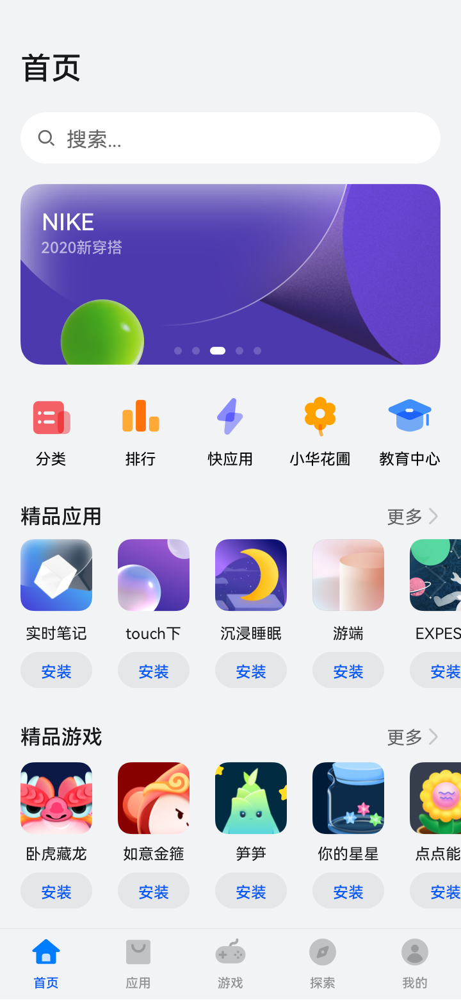 | 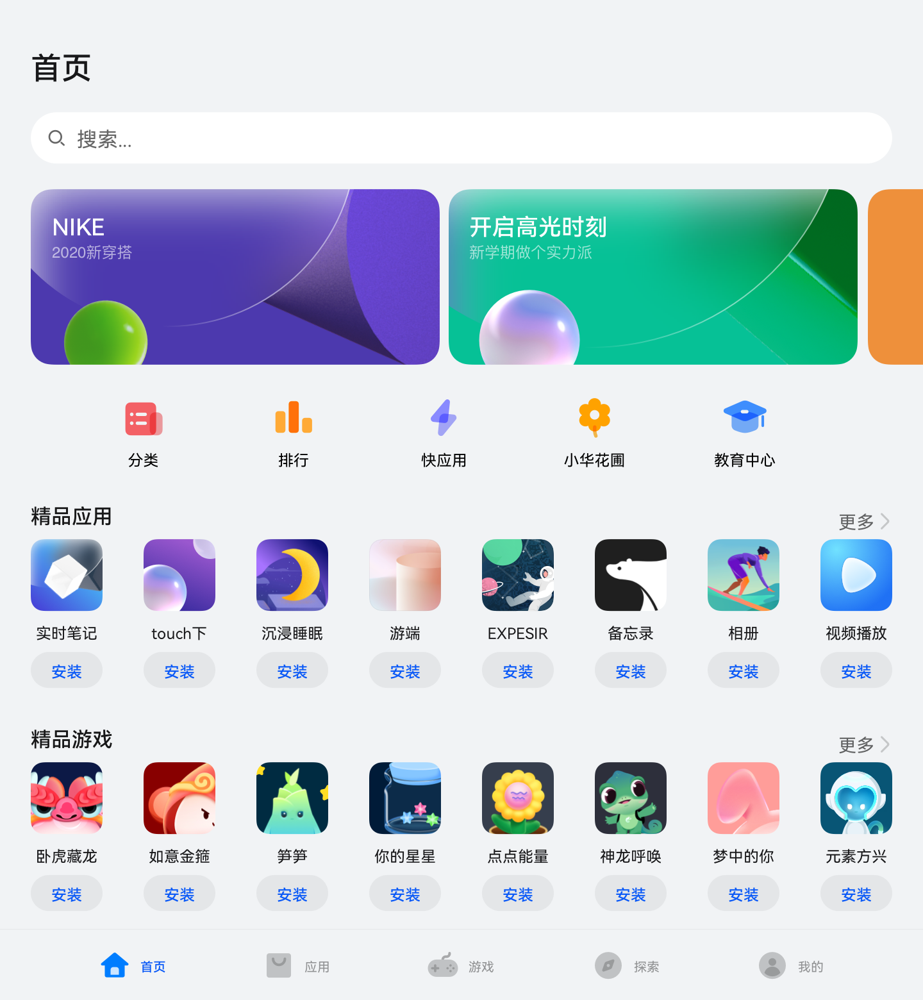 | 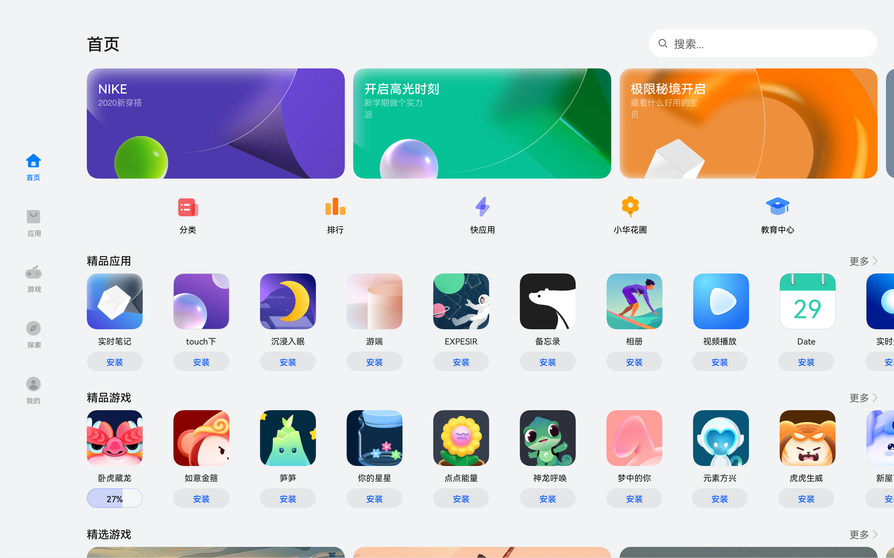 | 

观察应用市场首页的页面设计，不同断点下的页面设计有较多相似的地方。

据此，我们可以将页面分拆为多个组成部分。

1. 底部/侧边导航栏

2. 标题栏与搜索栏

3. 运营横幅

4. 快捷入口

5. 精品应用

  | sm | md | lg | 
| -------- | -------- | -------- |
| 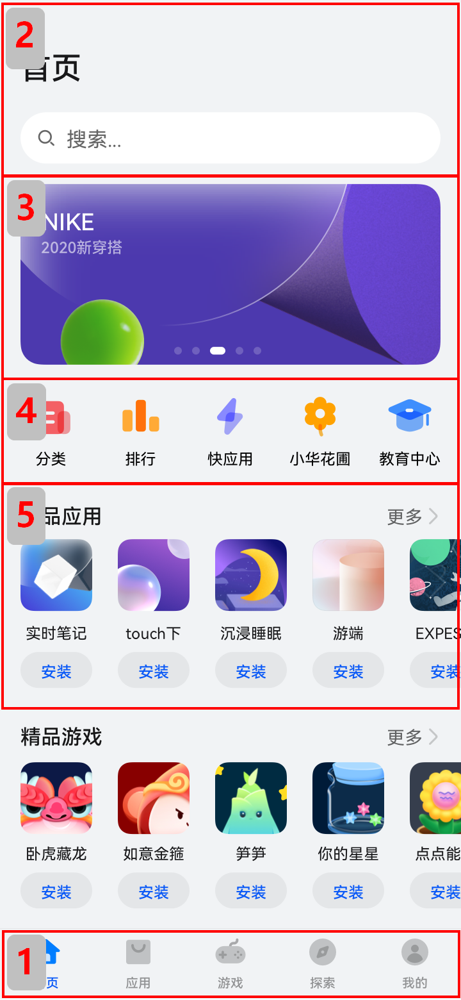 | 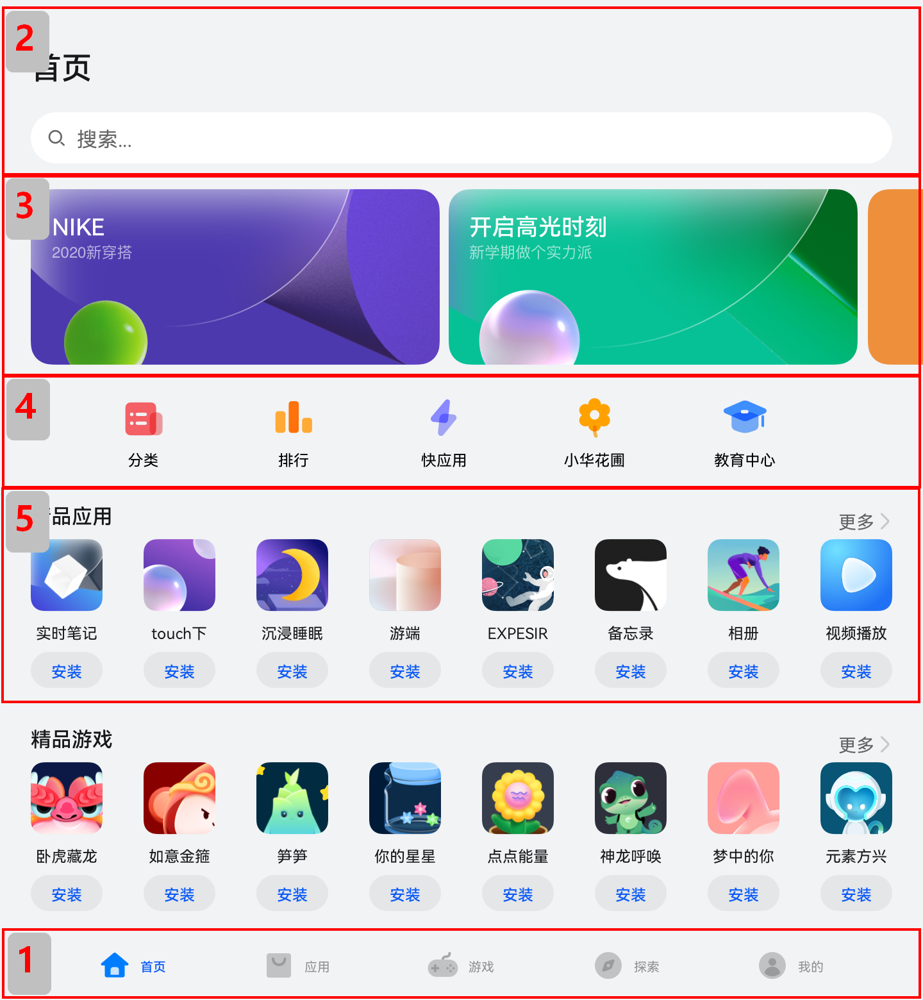 | 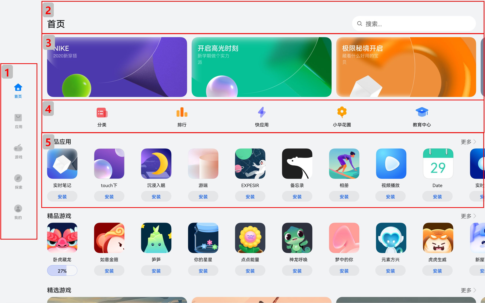 | 

接下来我们逐一分析各部分的实现。


## 底部/侧边导航栏

在sm和md断点下，导航栏在底部；在lg断点下，导航栏在左侧。可以通过[Tab组件](../../reference/apis-arkui/arkui-ts/ts-container-tabs.md)的barPosition和vertical属性控制TabBar的位置，同时还可以通过barWidth和barHeight属性控制TabBar的尺寸。
```ts
//BreakpointSystem.ets
import mediaQuery from '@ohos.mediaquery'

export default class BreakpointSystem {
  private currentBreakpoint: string = 'md'
  private smListener?: mediaQuery.MediaQueryListener
  private mdListener?:mediaQuery.MediaQueryListener
  private lgListener?: mediaQuery.MediaQueryListener

  private updateCurrentBreakpoint(breakpoint: string) {
    if (this.currentBreakpoint !== breakpoint) {
      this.currentBreakpoint = breakpoint
      AppStorage.Set<string>('currentBreakpoint', this.currentBreakpoint)
    }
  }

  private isBreakpointSM = (mediaQueryResult:mediaQuery.MediaQueryResult) => {
    if (mediaQueryResult.matches) {
      this.updateCurrentBreakpoint('sm')
    }
  }

  private isBreakpointMD = (mediaQueryResult:mediaQuery.MediaQueryResult) => {
    if (mediaQueryResult.matches) {
      this.updateCurrentBreakpoint('md')
    }
  }

  private isBreakpointLG = (mediaQueryResult:mediaQuery.MediaQueryResult) => {
    if (mediaQueryResult.matches) {
      this.updateCurrentBreakpoint('lg')
    }
  }

  public register() {
    this.smListener = mediaQuery.matchMediaSync('(320vp<=width<600vp)')
    this.smListener.on('change', this.isBreakpointSM)
    this.mdListener = mediaQuery.matchMediaSync('(600vp<=width<840vp)')
    this.mdListener.on('change', this.isBreakpointMD)
    this.lgListener = mediaQuery.matchMediaSync('(840vp<=width)')
    this.lgListener.on('change', this.isBreakpointLG)
  }

  public unregister() {
    this.smListener?.off('change', this.isBreakpointSM)
    this.mdListener?.off('change', this.isBreakpointMD)
    this.lgListener?.off('change', this.isBreakpointLG)
  }
}
```

```ts
import Home from '../common/Home'; //组件请参考相关实例
import TabBarItem from '../common/TabBarItem';
import BreakpointSystem from '../common/BreakpointSystem'

@Entry
@Component
struct Index {
  @State currentIndex: number = 0
  @StorageProp('currentBreakpoint') currentBreakpoint: string = 'md'
  private breakpointSystem: BreakpointSystem = new BreakpointSystem()
  private onTabChange = (index: number) => {
    this.currentIndex = index
  }

  aboutToAppear() {
    this.breakpointSystem.register()
  }

  aboutToDisappear() {
    this.breakpointSystem.unregister()
  }

  @Builder
  tabItem(index: number, title: Resource, icon: Resource, iconSelected: Resource) {
    TabBarItem({
      index: index,
      currentIndex: this.currentIndex,
      title: title,
      icon: icon,
      iconSelected: iconSelected
    })
  }

  build() {
    // 设置TabBar在主轴方向起始或结尾位置
    Tabs({ barPosition: this.currentBreakpoint === "lg" ? BarPosition.Start : BarPosition.End }) {
      // 首页
      TabContent() {
        Home()
      }
      .tabBar(this.tabItem(0, $r('app.string.tabBar1'), $r('app.media.ic_home_normal'),
        $r('app.media.ic_home_actived')))

      TabContent() {
      }.tabBar(this.tabItem(1, $r('app.string.tabBar2'), $r('app.media.ic_app_normal'), $r('app.media.ic_app_actived')))

      TabContent() {
      }
      .tabBar(this.tabItem(2, $r('app.string.tabBar3'), $r('app.media.ic_game_normal'),
        $r('app.media.ic_mine_actived')))

      TabContent() {
      }
      .tabBar(this.tabItem(3, $r('app.string.tabBar4'), $r('app.media.ic_search_normal'),
        $r('app.media.ic_search_actived')))

      TabContent() {
      }
      .tabBar(this.tabItem(4, $r('app.string.tabBar4'), $r('app.media.ic_mine_normal'),
        $r('app.media.ic_mine_actived')))
    }
    .backgroundColor('#F1F3F5')
    .barMode(BarMode.Fixed)
    .barWidth(this.currentBreakpoint === "lg" ? 96 : '100%')
    .barHeight(this.currentBreakpoint === "lg" ? '60%' : 56)
    // 设置TabBar放置在水平或垂直方向
    .vertical(this.currentBreakpoint === "lg")
  }
}
```

另外在sm及lg断点下，TabBar中各个Item的图标和文字是按照垂直方向排布的，在md断点下，TabBar中各个Item的图标和文字是按照水平方向排布的。

  
```ts
interface GeneratedObjectLiteralInterface_1 {
  NORMAL: string;
  SELECTED: string;
}

const TitleColor: GeneratedObjectLiteralInterface_1 = {
  NORMAL: '#999',
  SELECTED: '#0A59F7'
}

@Component
export default struct TabBarItem {
  @StorageProp('currentBreakpoint') currentBreakpoint: string = 'md'
  @Prop currentIndex: number
  private index?:number
  private icon?:Resource
  private iconSelected?:Resource
  private title?:Resource

  private getIcon() {
    return this.currentIndex === this.index ? this.iconSelected : this.icon
  }

  private getFontColor() {
    return this.currentIndex === this.index ? TitleColor.SELECTED : TitleColor.NORMAL
  }

  build() {
    if (this.currentBreakpoint !== 'md' ) {
      Column() {
        Image(this.getIcon())
          .width(24)
          .height(24)
          .margin(5)
          .objectFit(ImageFit.Contain)
        Text(this.title)
          .fontColor(this.getFontColor())
          .fontSize(12)
          .fontWeight(500)
      }.justifyContent(FlexAlign.Center).height('100%').width('100%')
    } else {
      Row() {
        Image(this.getIcon())
          .width(24)
          .height(24)
          .margin(5)
          .objectFit(ImageFit.Contain)
        Text(this.title)
          .fontColor(this.getFontColor())
          .fontSize(12)
          .fontWeight(500)
      }.justifyContent(FlexAlign.Center).height('100%').width('100%')
    }
  }
}
```


## 标题栏与搜索栏

标题栏和搜索栏，在sm和md断点下分两行显示，在lg断点下单行显示，可以通过栅格实现。在sm和md断点下，标题栏和搜索栏占满12列，此时会自动换行显示。在lg断点下，标题栏占8列而搜索栏占4列，此时标题栏和搜索栏在同一行中显示。

  |  | sm/md | lg | 
| -------- | -------- | -------- |
| 效果图 |  | 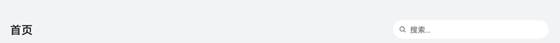 | 
| 栅格布局图 | 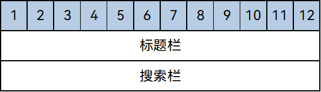 | 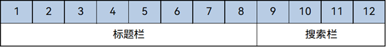 | 

  
```ts
@Component
export default struct IndexHeader {

  @Builder searchBar() {
    Stack({alignContent: Alignment.End}) {
      TextInput({ placeholder: $r('app.string.search') })
        .placeholderColor('#FF000000')
        .placeholderFont({ size: 16, weight: 400 })
        .textAlign(TextAlign.Start)
        .caretColor('#FF000000')
        .width('100%')
        .height(40)
        .fontWeight(400)
        .padding({ top: 9, bottom: 9 })
        .fontSize(16)
        .backgroundColor(Color.White)

      Image($r('app.media.ic_public_search'))
        .width(16)
        .height(16)
        .margin({ right: 20 })
    }.height(56).width('100%')
  }

  @Builder titleBar() {
    Text($r('app.string.tabBar1'))
      .fontSize(24)
      .fontWeight(500)
      .fontColor('#18181A')
      .textAlign(TextAlign.Start)
      .height(56)
      .width('100%')
  }

  build() {
    // 借助栅格实现标题栏和搜索栏在不同断点下的不同布局效果。
    GridRow() {
      GridCol({ span: { xs: 12, lg: 8 } }) {
        this.titleBar()
      }
      GridCol({ span: { xs: 12, lg: 4 } }) {
        this.searchBar()
      }
    }
    .width('100%')
  }
}
```


## 运营横幅

不同断点下的运营横幅，sm断点下显示一张图片，md断点下显示两张图片，lg断点下显示三张图片。可以通过[Swiper组件的displayCount属性](../../reference/apis-arkui/arkui-ts/ts-container-swiper.md)实现目标效果。

  
```ts
@Component
export default struct IndexSwiper {
  @StorageProp('currentBreakpoint') currentBreakpoint: string = 'md';
  @Builder swiperItem(imageSrc:Resource) {
    Image(imageSrc)
      .width('100%')
      .aspectRatio(2.5)
      .objectFit(ImageFit.Fill)
  }

  build() {
    Swiper() {
      this.swiperItem($r('app.media.ic_public_swiper1'))
      this.swiperItem($r('app.media.ic_public_swiper2'))
      this.swiperItem($r('app.media.ic_public_swiper3'))
      // ...
    }
    .autoPlay(true)
    .indicator(false)
    .itemSpace(10)
    // 配置不同断点下运行横幅中展示的图片数量
    .displayCount(this.currentBreakpoint === 'sm' ? 1 : (this.currentBreakpoint === 'md' ? 2 : 3))
    .width('100%')
    .padding({ left: 12, right: 12, bottom: 16, top: 16 })
  }
}
```


## 快捷入口

在不同的断点下，快捷入口的5个图标始终均匀排布，这是典型的均分能力使用场景。图标资源文件[获取](https://gitee.com/openharmony/applications_app_samples/tree/master/code/SuperFeature/MultiDeviceAppDev/AppMarket/entry/src/main/resources)。
```ts
// /model/HomeData   在resourse文件中放置以下资源文件，
interface AppItem{
  id:string;
  title:Resource;
  image:Resource;
}

const appList:AppItem[] = [
  { id: '0', title: $r('app.string.public_app1'), image: $r('app.media.ic_public_app1') },
  { id: '1', title: $r('app.string.public_app2'), image: $r('app.media.ic_public_app2') },
  { id: '2', title: $r('app.string.public_app3'), image: $r('app.media.ic_public_app3') },
  { id: '3', title: $r('app.string.public_app4'), image: $r('app.media.ic_public_app4') },
  { id: '4', title: $r('app.string.public_app5'), image: $r('app.media.ic_public_app5') },
  { id: '5', title: $r('app.string.public_app6'), image: $r('app.media.ic_public_app6') },
  { id: '6', title: $r('app.string.public_app7'), image: $r('app.media.ic_public_app7') },
  { id: '7', title: $r('app.string.public_app8'), image: $r('app.media.ic_public_app8') },
  { id: '8', title: $r('app.string.public_app9'), image: $r('app.media.ic_public_app9') },
  { id: '9', title: $r('app.string.public_app10'), image: $r('app.media.ic_public_app10') },
  { id: '10', title: $r('app.string.public_app1'), image: $r('app.media.ic_public_app1') },
  { id: '11', title: $r('app.string.public_app1'), image: $r('app.media.ic_public_app1') },
  { id: '12', title: $r('app.string.public_app2'), image: $r('app.media.ic_public_app2') },
  { id: '13', title: $r('app.string.public_app3'), image: $r('app.media.ic_public_app3') },
  { id: '14', title: $r('app.string.public_app4'), image: $r('app.media.ic_public_app4') },
  { id: '15', title: $r('app.string.public_app5'), image: $r('app.media.ic_public_app5') },
  { id: '16', title: $r('app.string.public_app6'), image: $r('app.media.ic_public_app6') },
  { id: '17', title: $r('app.string.public_app7'), image: $r('app.media.ic_public_app7') },
  { id: '18', title: $r('app.string.public_app8'), image: $r('app.media.ic_public_app8') },
  { id: '19', title: $r('app.string.public_app9'), image: $r('app.media.ic_public_app9') },
  { id: '20', title: $r('app.string.public_app10'), image: $r('app.media.ic_public_app10') }
]

const gameList:AppItem[] = [
  { id: '21', title: $r('app.string.public_game1'), image: $r('app.media.ic_public_game1') },
  { id: '22', title: $r('app.string.public_game2'), image: $r('app.media.ic_public_game2') },
  { id: '23', title: $r('app.string.public_game3'), image: $r('app.media.ic_public_game3') },
  { id: '24', title: $r('app.string.public_game4'), image: $r('app.media.ic_public_game4') },
  { id: '25', title: $r('app.string.public_game5'), image: $r('app.media.ic_public_game5') },
  { id: '26', title: $r('app.string.public_game6'), image: $r('app.media.ic_public_game6') },
  { id: '27', title: $r('app.string.public_game7'), image: $r('app.media.ic_public_game7') },
  { id: '28', title: $r('app.string.public_game8'), image: $r('app.media.ic_public_game8') },
  { id: '29', title: $r('app.string.public_game9'), image: $r('app.media.ic_public_game9') },
  { id: '30', title: $r('app.string.public_game10'), image: $r('app.media.ic_public_game10') },
  { id: '31', title: $r('app.string.public_game1'), image: $r('app.media.ic_public_game1') },
  { id: '32', title: $r('app.string.public_game2'), image: $r('app.media.ic_public_game2') },
  { id: '33', title: $r('app.string.public_game3'), image: $r('app.media.ic_public_game3') },
  { id: '34', title: $r('app.string.public_game4'), image: $r('app.media.ic_public_game4') },
  { id: '35', title: $r('app.string.public_game5'), image: $r('app.media.ic_public_game5') },
  { id: '36', title: $r('app.string.public_game6'), image: $r('app.media.ic_public_game6') },
  { id: '37', title: $r('app.string.public_game7'), image: $r('app.media.ic_public_game7') },
  { id: '38', title: $r('app.string.public_game8'), image: $r('app.media.ic_public_game8') },
  { id: '39', title: $r('app.string.public_game9'), image: $r('app.media.ic_public_game9') },
  { id: '40', title: $r('app.string.public_game10'), image: $r('app.media.ic_public_game10') }
]

const entranceIcons:AppItem[]= [
  { id: '41',title: $r('app.string.home_categories'), image: $r('app.media.ic_home_categories') },
  { id: '42',title: $r('app.string.home_top'), image: $r('app.media.ic_home_top') },
  { id: '43',title: $r('app.string.home_fast'), image: $r('app.media.ic_home_fast') },
  { id: '44',title: $r('app.string.home_flower'), image: $r('app.media.ic_home_flower') },
  { id: '45',title: $r('app.string.home_education'), image: $r('app.media.ic_home_education') },
]

export { entranceIcons, appList, gameList }
```


```ts
//model/HomeDataType
interface AllIcons {
  image: Resource,
  title: Resource,
}

interface AppItem  {
  id: string,
  title: Resource,
  image: Resource
}

class MyAppSource implements IDataSource {
  private dataArray: AppItem[] = []
  private listeners: DataChangeListener[] = []

  constructor(element: AppItem[]) {
    for (let index = 0; index < element.length; index++) {
      this.dataArray.push(element[index])
    }
  }

  public totalCount(): number {
    return this.dataArray.length
  }

  public getData(index: number): AppItem {
    return this.dataArray[index]
  }

  public addData(index: number, data: AppItem): void {
    this.dataArray.splice(index, 0, data)
    this.notifyDataAdd(index)
  }

  public pushData(data: AppItem): void {
    this.dataArray.push(data)
    this.notifyDataAdd(this.dataArray.length - 1)
  }

  registerDataChangeListener(listener: DataChangeListener): void {
    if (this.listeners.indexOf(listener) < 0) {
      this.listeners.push(listener)
    }
  }

  unregisterDataChangeListener(listener: DataChangeListener): void {
    const pos = this.listeners.indexOf(listener);
    if (pos >= 0) {
      this.listeners.splice(pos, 1)
    }
  }

  notifyDataReload(): void {
    this.listeners.forEach(listener => {
      listener.onDataReloaded()
    })
  }

  notifyDataAdd(index: number): void {
    this.listeners.forEach(listener => {
      listener.onDataAdd(index)
    })
  }

  notifyDataChange(index: number): void {
    this.listeners.forEach(listener => {
      listener.onDataChange(index)
    })
  }

  notifyDataDelete(index: number): void {
    this.listeners.forEach(listener => {
      listener.onDataDelete(index)
    })
  }

  notifyDataMove(from: number, to: number): void {
    this.listeners.forEach(listener => {
      listener.onDataMove(from, to)
    })
  }
}

export { AllIcons, MyAppSource, AppItem }

```

```ts
import { entranceIcons } from '../model/HomeData';
import { AllIcons } from '../model/HomeDataType';

@Component
export default struct IndexEntrance {
  build() {
    // 将justifyContent参数配置为FlexAlign.SpaceEvenly实现均分布局
    Row() {
      ForEach(entranceIcons, (icon: AllIcons) => {
        // 各快捷入口的图标及名称
        Column() { 
          // ... 
          }
      })
    }
    .width('100%')
    .height(64)
    .justifyContent(FlexAlign.SpaceEvenly)
    .padding({ left: 12, right: 12 })
  }
}
```


## 精品应用

随着可用显示区域的增加，精品应用中显示的图标数量也不断增加，这是典型的延伸能力使用场景。精品游戏的实现与精品应用类似，不再展开分析。

  
```ts
import { AppItem, MyAppSource } from '../model/HomeDataType';

@Component
export default struct IndexApps {
  private title?: Resource;
  @StorageProp('currentBreakpoint') currentBreakpoint: string = 'md';
  private apps: AppItem[] = [];
  @Builder
  appListHeader() {
    Row() {
      Text(this.title)
        .width(100)
        .fontSize(16)
        .textAlign(TextAlign.Start)
        .fontWeight(500)
      Blank()
      Text($r('app.string.more'))
        .fontSize(14)
        .textAlign(TextAlign.End)
        .fontWeight(400)
        .margin({ right: 2 })
      Image($r('app.media.ic_public_arrow_right'))
        .width(12)
        .height(18)
        .opacity(0.9)
        .objectFit(ImageFit.Fill)
    }
    .margin({ bottom: 9, top: 9 })
    .width('100%')
    .alignItems(VerticalAlign.Bottom)
  }

  @Builder
  appListItem(app:AppItem) {
    Column() {
      Image(app.image)
        .width(this.currentBreakpoint === 'lg' ? 80 : 56)
        .height(this.currentBreakpoint === 'lg' ? 80 : 56)
        .margin({ bottom: 8 })
      Text(app.title)
        .width(this.currentBreakpoint === 'lg' ? 80 : 56)
        .height(16)
        .fontSize(12)
        .textAlign(TextAlign.Center)
        .fontColor('#18181A')
        .margin({ bottom: 8 })
      Text($r('app.string.install'))
        .width(this.currentBreakpoint === 'lg' ? 80 : 56)
        .height(28)
        .fontColor('#0A59F7')
        .textAlign(TextAlign.Center)
        .borderRadius(this.currentBreakpoint === 'lg' ? 26 : 20)
        .fontWeight(500)
        .fontSize(12)
        .padding({ top: 6, bottom: 6, left: 8, right: 8 })
        .backgroundColor('rgba(0,0,0,0.05)')
    }
  }
  build() {
    Column() {
      this.appListHeader()
      // 借助List组件能力，实现延伸能力场景
      List({ space: this.currentBreakpoint === 'lg' ? 44 : 20}) {
        LazyForEach(new MyAppSource(this.apps), (app: AppItem)=> {
          ListItem() {
            // 每个应用的图标、名称及安装按钮
            this.appListItem(app)
          }
        })
      }
      .width('100%')
      .height(this.currentBreakpoint === 'lg' ? 140 : 120)
      .listDirection(Axis.Horizontal)
    }
    .width('100%')
    .height(this.currentBreakpoint === 'lg' ? 188 : 164)
    .padding({ bottom: 8, left: 12, right: 12 })
  }
}
```


## 运行效果

将上述各页面主要部分组合在一起后，即可完成整体页面开发。

  
```ts
entry/src/main/ets                         // 代码区
|---model
|   |---HomeData.ets                       // 主页用到的图片资源
|   |---HomeDataType.ets                   // 事件监听函数
|---pages                                  
|   |---index.ets                          // 首页
|---common                                    
|   |---BreakpointSystem.ets               // 媒体查询
|   |---Home.ets                           // 主容器
|   |---IndexApps.ets                      // app模块(包含安装，展示图片，更多功能)
|   |---IndexContent.ets                   // 内容模块
|   |---IndexEntrance.ets                  // 下一步模块(箭头跳转组件)
|   |---IndexHeader.ets                    // 头部组件
|   |---IndexSwiper.ets                    // 轮播图   
|   |---TabBarItem.ets                     // 导航栏     
entry/src/main/resources                   // 资源文件
```

```ts
import IndexSwiper from './IndexSwiper';
import IndexEntrance from './IndexEntrance';
import IndexApps from './IndexApps';
import { appList, gameList } from '../model/HomeData';
import IndexHeader from './IndexHeader';

@Component
struct IndexContent {
  // ...
  build() {
    List() {
      // 运营横幅
      ListItem() {
        IndexSwiper()
      }
      // 快捷入口
      ListItem() {
        IndexEntrance()
      }
      // 精品应用
      ListItem() {
        IndexApps({ title: $r('app.string.boutique_application'), apps: appList })
      }
      // 精品游戏
      ListItem() {
        IndexApps({ title: $r('app.string.boutique_game'), apps: gameList })
      }
    }
    .width("100%")
  }
}

@Entry
@Component
export default struct Home {
  // ...
  build() {
    Flex({ direction: FlexDirection.Column, justifyContent: FlexAlign.Start, alignItems: ItemAlign.Start }) {
      // 标题栏和搜索栏
      IndexHeader()
      // 运营横幅、快捷入口、精品应用、精品游戏等
      IndexContent()
    }
    .height('100%')
    .backgroundColor("#F1F3F5")
  }
}
```

本页面的实际运行效果如下图所示。

  | sm | md | lg | 
| -------- | -------- | -------- |
|  | 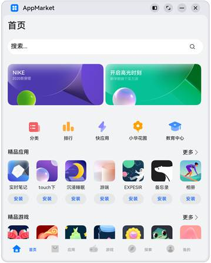 | 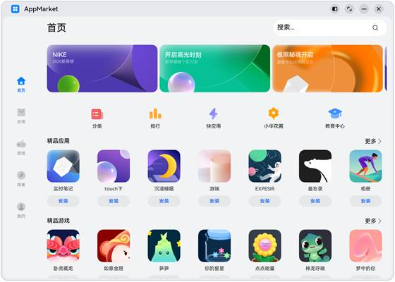 | 

## 相关实例

针对应用市场应用开发，有以下相关实例可以参考：

- 应用市场开发：[典型页面场景：应用市场首页（ArkTS）(API9)](https://gitee.com/openharmony/applications_app_samples/tree/master/code/SuperFeature/MultiDeviceAppDev/AppMarket)


<!--no_check-->