# 一多开发实例（短信）


本章从系统预置的应用中，选择短信应用作为典型的案例，从页面开发和工程结构的角度，介绍"一多"的具体实践。系统的产品形态在不断丰富中，当前主要有默认设备和平板两种产品形态，本章的具体实践也将围绕这两种产品形态展开。


## 概览

短信是系统中预置的应用，主要包含信息查看、发送短信、接收短信、短信送达报告、删除短信等功能。在不同类型设备上，短信应用的功能完全相同，故短信应用适合使用[部署模型A](introduction.md#部署模型)（即：不同类型的设备上安装运行相同的HAP或HAP组合）。

本案例中，在会话详情页面利用[方舟开发框架](introduction.md#方舟开发框架)提供的“一多”能力，用一套代码同时适配默认设备和平板。


### 工程结构

短信应用的工程结构如下图所示，当前该应用的功能较少，所以直接使用了DevEco Studio创建出的默认工程结构。具体采用何种形式的工程结构，并不影响应用的开发。但是使用推荐的工程结构，目录结构更清晰，拓展性也更好。

短信应用UI相关的逻辑集中在views和pages两个目录，分别存放公共组件及页面。当前短信应用主要包含如下页面：

- 信息列表页面：首页，展示信息列表。

- 通知信息列表页面：将通知类信息集中在一起展示，与信息列表页面类似。

- 会话详情页面：展示与某联系人的所有信息往来。

- 报告详情页面：信息发送报告的详情页面。

- 设置页面：消息设置页面，如是否展示送达报告等。


```
/Mms/
 ├── doc                                        # 资料
 ├── entry
 │   └── src
 │       └── main
 │           ├── resources                      # 资源配置文件存放目录
 │           ├── config.json                    # 全局配置文件
 │           └── ets                            # ets代码目录
 │               ├── ServiceAbility             # 后台常驻服务
 │               └── default                    # 业务代码目录
 │                   ├── data                   # 自定义数据类型
 │                   ├── model                  # 对接数据库
 │                   ├── pages                  # 所有页面
 │                   │   ├── conversation       # 会话详情页面
 │                   │   ├── conversationlist   # 信息列表页面
 │                   │   ├── index              # 初始页面
 │                   │   ├── info_msg           # 通知信息列表页面
 │                   │   ├── query_report       # 报告详情页面
 │                   │   └── settings           # 设置页面
 │                   ├── service                # 业务逻辑
 │                   ├── utils                  # 工具类
 │                   ├── views                  # 自定义组件
 │                   └── app.ets                # 应用生命周期
 ├── signs                                      # 签名
 └── LICENSE
```

短信应用在开发阶段，采用了一层工程结构。由于功能较为简单，所以并没有规划共用的feature和common目录，仅采用了一层product目录。

- 业务形态层（product）
  该目录采用IDE工程默认创建的entry目录，开发者可根据需要在创建Module时自行更改该目录名。不同产品形态，编译出相同的短信HAP。


## 会话详情页面


### 页面结构

| 默认设备                                     | 平板                                       |
| ---------------------------------------- | ---------------------------------------- |
| 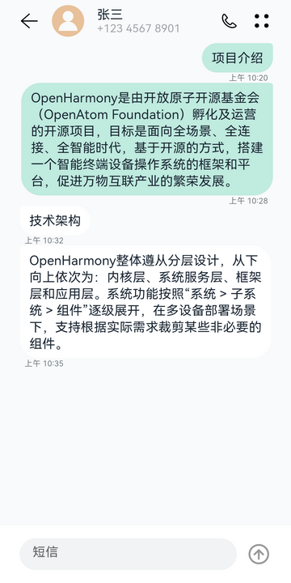 | 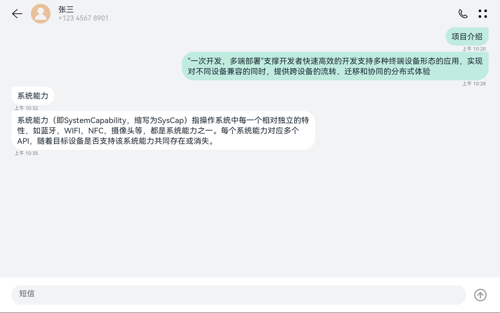 |

会话详情页面在默认设备和平板上的样式如上图所示，会话详情页面可以划分为三个部分：

| 页面组成  | 介绍                                       |
| ----- | ---------------------------------------- |
| 顶部标题栏 | 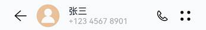 |
| 信息列表  | 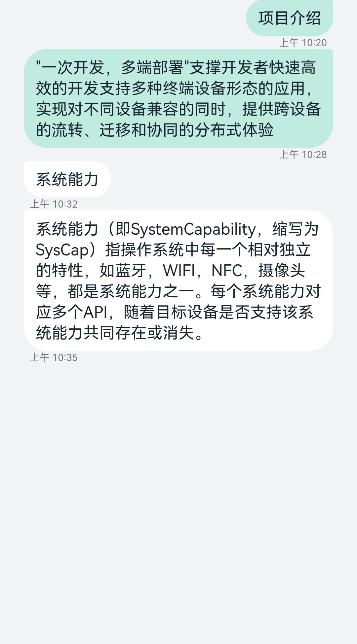 |
| 底部输入栏 |  |

接下来我们详细介绍各部分的实现。

> **说明：**
> 为了方便理解，我们对会话详情页面做了一定的精简，本小节仅介绍会话详情页面最基础的实现。


### 顶部标题栏

| 默认设备                                     | 平板                                       |
| ---------------------------------------- | ---------------------------------------- |
|  | 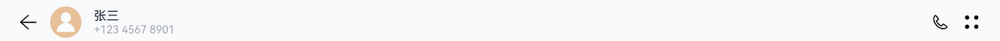 |

顶部标题栏是一个简单的行布局，包含返回图标、联系人头像、联系人姓名和号码、拨号图标、设置图标共5个元素。其中，联系人姓名和号码以列布局的形式放在一起。

在默认设备和平板上，顶部标题栏的组件结构是相同的，仅联系人姓名和号码与拨号图标的间距不同。回顾方舟开发框架一多能力介绍，这个场景可以借助Blank组件使用拉伸能力。

  我们先实现联系人姓名和号码，用Flex组件作为父容器，其包含两个Text子组件，分别用于存放联系人姓名和号码。Flex组件的属性设置如下：
- direction: FlexDirection.Column：子组件在Flex容器上以列的方式排布，即主轴是垂直方向。

- justifyContent: FlexAlign.Center：子组件在Flex容器主轴（垂直方向）上居中对齐。

- alignItems: ItemAlign.Start：子组件在Flex容器交叉轴（水平方向）上首部对齐。

可以查看[Flex组件](../../reference/apis-arkui/arkui-ts/ts-container-flex.md)及[Text组件](../../reference/apis-arkui/arkui-ts/ts-basic-components-text.md)了解这两个组件各个属性的含义及详细用法。

| 默认设备                                     | 平板                                       |
| ---------------------------------------- | ---------------------------------------- |
|  |  |


```ts
@Entry
@Component
 struct TopArea {
   build() {
     Flex({ direction: FlexDirection.Column, justifyContent: FlexAlign.Center,
       alignItems: ItemAlign.Start}) {
       Text('张三').fontSize(16).fontColor("#182431")
       Text('+123 4567 8901').fontSize(14).fontColor("#66182431")
     }
   }
 }
```

接下来我们通过width属性和height属性设置四个图标的宽高（详见[尺寸设置](../../reference/apis-arkui/arkui-ts/ts-universal-attributes-size.md)），并将它们与联系人姓名和电话以及Blank组件一起放到Flex父容器中。为了便于查看效果，对顶部标题栏设置了淡蓝色的背景色。

| 默认设备                                     | 平板                                       |
| ---------------------------------------- | ---------------------------------------- |
|  |  |


```ts
@Entry
@Component
 struct TopArea {
   build() {
     Flex({ alignItems: ItemAlign.Center }) {
       Image($r('app.media.back'))//在应用的resources/base/media目录放置名为back的资源文件
         .width(24)
         .height(24)
       Image($r('app.media.contact'))//在应用的resources/base/media目录放置名为contact的资源文件
         .width(40)
         .height(40)
       Flex({ direction: FlexDirection.Column, justifyContent: FlexAlign.Center,
         alignItems: ItemAlign.Start}) {
         Text('张三').fontSize(16).fontColor("#182431")
         Text('+123 4567 8901').fontSize(14).fontColor("#66182431")
       }
       Blank()                  // 拉伸能力
       Image($r("app.media.phone"))//在应用的resources/base/media目录放置名为phone的资源文件
         .width(24)
         .height(24)
       Image($r('app.media.dots'))//在应用的resources/base/media目录放置名为dots的资源文件
         .width(24)
         .height(24)
     }
     .width('100%')
     .height(56)
     .backgroundColor('#87CEFA')  // 顶部标题栏背景色，仅用于开发测试
   }
 }
```

当前标题栏中子组件的布局同预期还有些差异，接下来通过margin属性，设置各个元素的左右间距（详见[尺寸设置](../../reference/apis-arkui/arkui-ts/ts-universal-attributes-size.md)）。如下图所示，最终顶部工具栏在默认设备和平板上都可以达到预期显示效果。

| 默认设备                                     | 平板                                       |
| ---------------------------------------- | ---------------------------------------- |
| 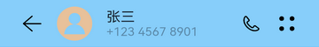 | 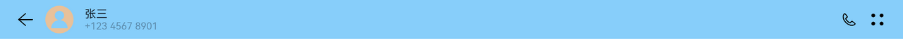 |


```ts
@Entry
@Component
 struct TopArea {
   build() {
     Flex({ alignItems: ItemAlign.Center }) {
       Image($r('app.media.back'))//在应用的resources/base/media目录放置名为back的资源文件
         .width(24)
         .height(24)
         .margin({ left:24 })             // 设置间距
       Image($r('app.media.contact'))//在应用的resources/base/media目录放置名为contact的资源文件
         .width(40)
         .height(40)
         .margin({ left:16, right:16 })  // 设置间距
       Flex({ direction: FlexDirection.Column, justifyContent: FlexAlign.Center,
         alignItems: ItemAlign.Start}) {
         Text('张三').fontSize(16).fontColor("#182431")
         Text('+123 4567 8901').fontSize(14).fontColor("#66182431")
       }
       Blank()
       Image($r("app.media.phone"))//在应用的resources/base/media目录放置名为phone的资源文件
         .width(24)
         .height(24)
       Image($r('app.media.dots'))//在应用的resources/base/media目录放置名为dots的资源文件
         .width(24)
         .height(24)
         .margin({ left:16, right:24 })  // 设置间距
     }
     .width('100%')
     .height(56)
     .backgroundColor('#87CEFA')           // 顶部标题栏背景色，仅用于开发测试
   }
 }
```


### 底部输入栏

有了顶部工具栏的开发经验，可以发现底部输入栏的结构更为简单，它同样以Flex组件作为父容器，同时包含文本输入框（请访问[文本输入组件](../../reference/apis-arkui/arkui-ts/ts-basic-components-textarea.md)查看详细介绍）和消息发送图标两个子节点。


为了便于查看的效果，我们同样给底部输入栏设置了淡蓝色到背景色。注意这里有一个特殊的地方，我们给TextArea设置了flexGrow(1)属性。flexGrow属性仅在父组件是Flex组件时生效，表示Flex容器的剩余空间分配给此属性所在的组件的比例，flexGrow(1)表示父容器的剩余空间全部分配给此组件，详见[Flex布局](../../reference/apis-arkui/arkui-ts/ts-universal-attributes-flex-layout.md)。

| 默认设备                                     | 平板                                       |
| ---------------------------------------- | ---------------------------------------- |
| 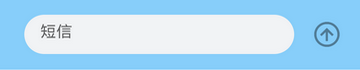 | 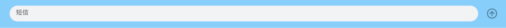 |


```ts
@Entry
@Component
 struct BottomArea {
   build() {
     Flex({ direction: FlexDirection.Row, alignItems: ItemAlign.Center, justifyContent: FlexAlign.Center }) {
       TextArea({ placeholder:'短信' })
         .placeholderColor("#99000000")
         .caretColor("#007DFF")
         .backgroundColor("#F1F3F5")
         .borderRadius(20)
         .height(40)
         .flexGrow(1)           // 将父容器的剩余空间全部分配给此组件

       Image($r("app.media.send")) //在应用的resources/base/media目录放置名为send的资源文件
         .height(36)
         .width(36)
         .opacity(0.4)
         .margin({ left:12 })
     }
     .height(72)
     .width('100%')
     .padding({ left:24, right:24, bottom:8, top:8 })
     .backgroundColor('#87CEFA')  // 底部输入栏背景色，仅用于开发测试
   }
 }
```


### 信息列表

观察信息列表区域，可以发现它是由一个个消息气泡组成的，另外消息气泡在默认设备和平板上的布局有差异。本小节将围绕如下两个主题介绍如何实现消息列表。

- 如何实现自定义消息气泡组件。

- 如何在默认设备和平板上自适应布局。

  | 默认设备                                     | 平板                                       |
  | ---------------------------------------- | ---------------------------------------- |
  |  | 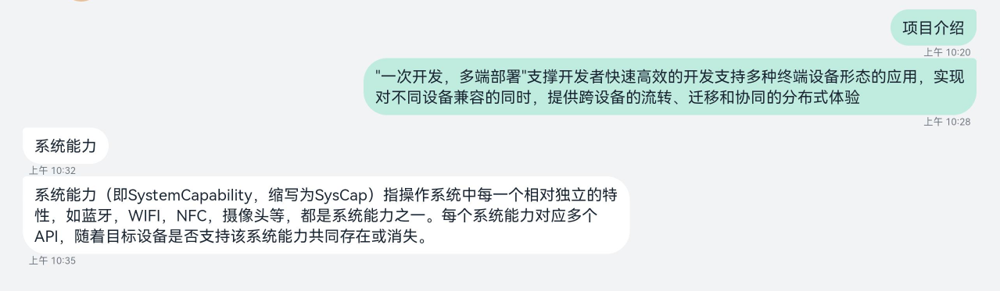 |

**消息气泡**

先做一个最简单的消息气泡，通过borderRadius属性可以设置边框的圆角半径（详见[边框设置](../../reference/apis-arkui/arkui-ts/ts-universal-attributes-border.md)）。

| 默认设备                                     | 平板                                       |
| ---------------------------------------- | ---------------------------------------- |
| 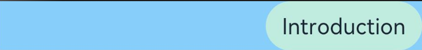 | 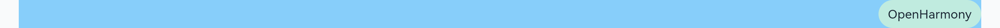 |


```ts
@Entry
@Component
struct MessageBubble {
  private content: string = "Introduction"

  build() {
    Column() {
      Flex({ alignItems: ItemAlign.Center, justifyContent: FlexAlign.End }) {
        Text(this.content)
            .fontSize(16)
            .lineHeight(21)
            .padding({ left: 12, right: 12, top: 8, bottom: 8 })
            .backgroundColor("#C0EBDF")
            .borderRadius(24)
            .fontColor("#182431")
      }.width('100%')
    }
    .margin({left: 24, right: 24 })
    .backgroundColor('#87CEFA')  // 消息背景色，仅用于开发和测试 
  }
}
```

注意这个简单的消息气泡，左上角（或右上角）的样式，与实际期望不符。我们先修改发送消息右上角的样式，接收消息左上角的实现与之类似。

[Stack组件](../../reference/apis-arkui/arkui-ts/ts-container-stack.md)是一个堆叠容器，其子组件按照轴方向依次堆叠，后一个子组件覆盖前一个子组件。通过其alignContent接口，可以设置子组件在容器内的对齐方式，如alignContent: Alignment.TopStart代表子组件从左上角对齐。

| 默认设备                                     | 平板                                       |
| ---------------------------------------- | ---------------------------------------- |
| 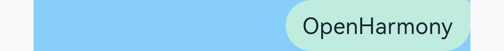 | 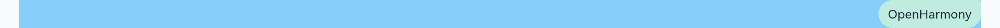 |


```ts
@Entry
@Component
struct MessageBubble {
  private content: string = "Introduction"
  
  build() {
    Column() {
      Flex({ alignItems: ItemAlign.Center, justifyContent: FlexAlign.End }) {
        Stack({ alignContent: Alignment.TopEnd }) {  // 在左上角堆叠一个小色块
          Column()
            .backgroundColor("#C0EBDF")
            .borderRadius(4)
            .width(24)
            .height(24)
          Text(this.content)
            .fontSize(16)
            .lineHeight(21)
            .padding({ left: 12, right: 12, top: 8, bottom: 8 })
            .backgroundColor("#C0EBDF")
            .borderRadius(24)
            .fontColor("#182431")
        }
      }.width('100%')
    }
    .margin({left: 24, right: 24 })
    .backgroundColor('#87CEFA')  // 消息背景色，仅用于开发和测试 
  }
}
```

接下来我们在消息气泡下方加上时间显示，如下图所示，一个消息气泡自定义组件就基本完成了。

| 默认设备                                     | 平板                                       |
| ---------------------------------------- | ---------------------------------------- |
| 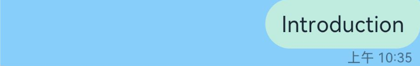 |  |


```ts
@Entry
@Component
struct MessageBubble {
  private content: string = "Introduction"
  private time: string = "上午 10:35"

  build() {
    Column() {
      Flex({ alignItems: ItemAlign.Center, justifyContent: FlexAlign.End }) {
        Stack({ alignContent: Alignment.TopEnd }) {
          Column()
            .backgroundColor("#C0EBDF")
            .borderRadius(4)
            .width(24)
            .height(24)
          Text(this.content)
            .fontSize(16)
            .lineHeight(21)
            .padding({ left: 12, right: 12, top: 8, bottom: 8 })
            .backgroundColor("#C0EBDF")
            .borderRadius(24)
            .fontColor("#182431")
        }
      }.width('100%')

      // 在消息气泡底部增加时间显示
      Flex({ alignItems: ItemAlign.Center, direction: FlexDirection.Row,
        justifyContent: FlexAlign.End}) {
        Text(this.time)
          .textAlign(TextAlign.Start)
          .fontSize(10)
          .lineHeight(13)
          .fontColor("#99182431")
      }.width('100%').margin({ left: 12, right: 24 })
    }
    .margin({left: 24, right: 24 })
    .backgroundColor('#87CEFA')  // 消息背景色，仅用于开发和测试 
  }
}
```

发送出的消息和接收到的消息的消息气泡结构基本一致，可以通过增加一个标志位，让两种消息共用MessageBubble这个自定义组件，代码如下所示。将这个标志位设置true，可以查看接收消息的效果。

| 默认设备                                     | 平板                                       |
| ---------------------------------------- | ---------------------------------------- |
|  | 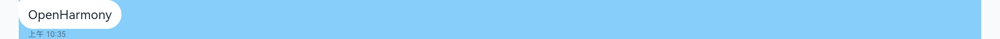 |


```ts
@Entry
@Component
 struct MessageBubble {
   private isReceived:boolean = true// 通过标志位，判断是发送or接收场景，进而使用不同的样式
   private content:string = "Introduction"
   private time:string = "今天 10:35"

   build() {
     Column() {
       Flex({ justifyContent:this.isReceived? FlexAlign.Start: FlexAlign.End,
         alignItems: ItemAlign.Center }) {
         Stack({ alignContent:this.isReceived? Alignment.TopStart: Alignment.TopEnd }) {
           Column()
             .backgroundColor(this.isReceived?"#FFFFFF":"#C0EBDF")
             .borderRadius(4)
             .width(24)
             .height(24)
           Text(this.content)
             .fontSize(16)
             .lineHeight(21)
             .padding({ left:12, right:12, top:8, bottom:8 })
             .backgroundColor(this.isReceived?"#FFFFFF":"#C0EBDF")
             .borderRadius(24)
             .fontColor("#182431")
         }
       }.width('100%')

       Flex({ alignItems: ItemAlign.Center, direction: FlexDirection.Row,
         justifyContent:this.isReceived? FlexAlign.Start: FlexAlign.End }) {
         Text(this.time)
           .textAlign(TextAlign.Start)
           .fontSize(10)
           .lineHeight(13)
           .fontColor("#99182431")
       }.width('100%')
       .margin({ left:this.isReceived?12:0, right:this.isReceived?0:12 })
     }
     .margin({left:24, right:24 })
     .backgroundColor('#87CEFA')  // 消息背景色，仅用于开发和测试
   }
 }
```

**栅格布局**

回顾方舟开发框架一多能力，消息气泡在默认设备和平板上布局不同，可以借助栅格布局来解决。为了方便测试，我们预定义一个全局数组。


```ts
 interface globalMessageItem {
    time:string,
    content:string,
    isReceived:boolean
 }

const globalMessageList:globalMessageItem[] = [
  {
    time:'上午 10:20',
    content:'项目介绍',
    isReceived:false
  },
  {
    time:'上午 10:28',
    content:'"一次开发，多端部署"支撑开发者快速高效的开发支持多种终端设备形态的应用，实现对不同设备兼容的同时，提供跨设备的流转、迁移和协同的分布式体验',
    isReceived:false
  },
  {
    time:'上午 10:32',
    content:'系统能力',
    isReceived:true
  },
  {
    time:'上午 10:35',
    content:'系统能力（即SystemCapability，缩写为SysCap）指操作系统中每一个相对独立的特性，如蓝牙，WIFI，NFC，摄像头等，都是系统能力之一。每个系统能力对应多个API，随着目标设备是否支持该系统能力共同存在或消失。',
    isReceived:true
  }
]
```

结合[栅格组件](../../reference/apis-arkui/arkui-ts/ts-container-gridcontainer.md)的定义，考虑我们当前的实际场景，GridRow的各参数设置如下。

- columns：栅格组件中的列数，当前场景默认12列即可。

- gutter：栅格布局列间距，当前场景未使用该参数，默认设置为0即可。

- margin： 栅格布局两侧间距，在开发消息气泡组件时，已经设置了左右间距，故该属性也默认配置为0。

栅格中仅包含我们自定义的消息气泡组件，该组件在各断点上的参数配置如下。

| 断点   | 窗口宽度(vp)        | 栅格总列数 | 消息气泡占用的列数 | 接收场景偏移的列数 | 发送场景偏移的列数 |
| ---- | --------------- | ----- | --------- | --------- | --------- |
| sm   | [320,&nbsp;600) | 12    | 12        | 0         | 0         |
| md   | [600,&nbsp;840) | 12    | 8         | 0         | 4         |
| lg   | [840,&nbsp;+∞)  | 12    | 8         | 0         | 4         |

| 默认设备                                     | 平板                                       |
| ---------------------------------------- | ---------------------------------------- |
| 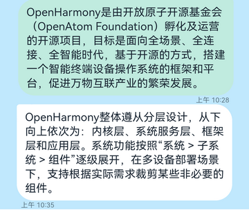 | 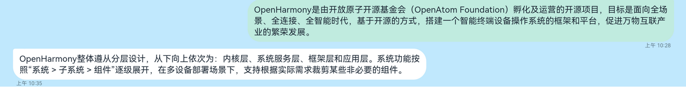 |


```ts
import  { globalMessageList } from "../data/globalMessageList";//将globalMessageList文件export后导入；
import  { MessageBubble } from "./MessageBubble";//将文件MessageBubble去除@entry作为组件export后导入；
@Component
export default struct MessageItem {
  private isReceived?: boolean
  private content?: string
  private time?: string

  build() {
    GridRow() {
      GridCol({span: {sm: 12, md: 8, lg: 8},
        offset: {sm: 0, md: this.isReceived? 0 : 4, lg: this.isReceived? 0 : 4}}) {
        Flex({ justifyContent: FlexAlign.End, alignItems: ItemAlign.End }) {
          MessageBubble({
            isReceived: this.isReceived,
            content: this.content,
            time: this.time
          })
        }
      }
    }
  }
}

@Entry
@Component
struct Conversation {
  build() {
    Column() {                      // 验证效果
       MessageItem({
        isReceived: globalMessageList[1].isReceived,
        content: globalMessageList[1].content,
        time: globalMessageList[1].time
      })
      MessageItem({
        isReceived: globalMessageList[3].isReceived,
        content: globalMessageList[3].content,
        time: globalMessageList[3].time
      })
    }.backgroundColor('#87CEFA')    // 消息背景色，仅用于开发和测试
  }
}
```


### 组合成型

现在会话详情页面的顶部标题栏、信息列表及底部输入栏都已经准备完毕，将这三部分组合起来即可得到完整的页面。

- 通过[Flex组件](../../reference/apis-arkui/arkui-ts/ts-container-flex.md)将三个部分组合起来，注意justifyContent: FlexAlign.SpaceBetween配置项是将Flex组件中的元素按照主轴方向均匀分配，其中第一个元素与顶部对齐，最后一个元素与底部对齐。

- 通过[List组件](../../reference/apis-arkui/arkui-ts/ts-container-list.md)和[ForEach语法](../../quick-start/arkts-rendering-control-foreach.md)，显示整个消息列表。

  | 默认设备                                     | 平板                                       |
  | ---------------------------------------- | ---------------------------------------- |
  |  |  |


```ts
import { globalMessageList,globalMessageItem} from "../data/globalMessageList";//将globalMessageList、globalMessageItem文件export后导入；
import { MessageItem } from "./MessageItem";//将文件MessageItem去除@entry作为组件export后导入；
import { BottomArea } from "./BottomArea";//将文件BottomArea去除@entry作为组件export后导入；
import {TopArea } from "./TopArea";//将文件TopArea去除@entry作为组件export后导入；
 @Entry
 @Component
 struct Conversation {
   build() {
     Flex({ direction: FlexDirection.Column, alignItems: ItemAlign.Start,
       justifyContent: FlexAlign.SpaceBetween }) {
       Column() {
         TopArea()   // 顶部标题栏
         List() {    // 消息列表
           ForEach(globalMessageList, (item:globalMessageItem, index) => {
             ListItem() {
               MessageItem({
                 isReceived: item.isReceived,
                 content: item.content,
                 time: item.time
               })
           }})
         }
         .listDirection(Axis.Vertical)
         .edgeEffect(EdgeEffect.Spring)
       }
       BottomArea()  // 底部输入栏
     }
     .backgroundColor("#F1F3F5")
     .width('100%')
     .height('100%')
   }
 }
```

短信应用在默认设备和平板上的功能完全相同，因此选择了部署模型A。借助方舟开发框架一多能力，短信应用实现了在默认设备和平板上共用同一份代码，同时自然也共用安装包。

在实际开发过程中，会话详情页面需要从底层做数据交互，同时还要支持信息选择、信息删除、信息发送状态、输入框与输入法联动等等功能，会比本小节中介绍的基础版本复杂很多。

## 相关实例

基于短信，可参考以下实例：

- [信息应用](https://gitee.com/openharmony/applications_mms/tree/master)


