# 桌面应用


[桌面](https://gitee.com/openharmony/applications_launcher)是OpenHarmony中预置的系统应用，它是系统人机交互的首要入口。


## 应用功能

桌面提供了如下功能：

- 万能卡片：包括卡片的呼出和关闭、卡片管理、卡片拖动、卡片移除等。

- 任务中心：展示后台运行任务的快照。

- 大文件夹：包括大文件基础展示、将应用拖入及移出大文件夹等。

- 应用中心：展示全量桌面应用列表。

- 图标管理：图标显示、长按图标显示菜单列表等。

- 布局管理：对不同的设备、横竖屏、分辨率等做布局自适应。

- 桌面设置：设置桌面布局方案。

- 手势导航：允许用户用手势导航替代传统的三键导航。

- 应用启动：启动应用、应用启动动效等。

- 键鼠适配：支持鼠标及键盘。

- 快捷栏（Smart Dock）：底部快捷栏，显示常用应用列表、支持添加应用快捷方式及删除等。

部分功能场景设计图如下所示。

  | 功能点 | 默认设备 | 平板 | 
| -------- | -------- | -------- |
| 万能卡片 | 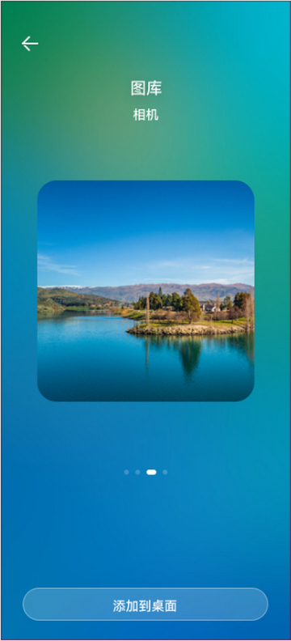 | 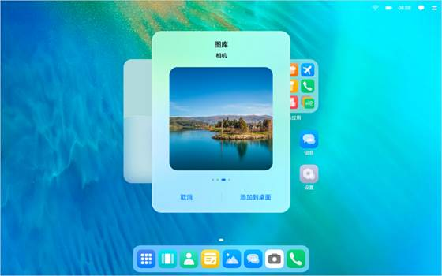 | 
| 任务中心 | 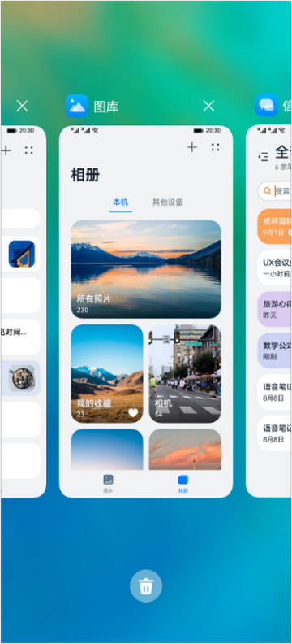 | 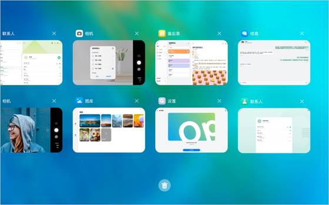 | 
| 快捷栏 | 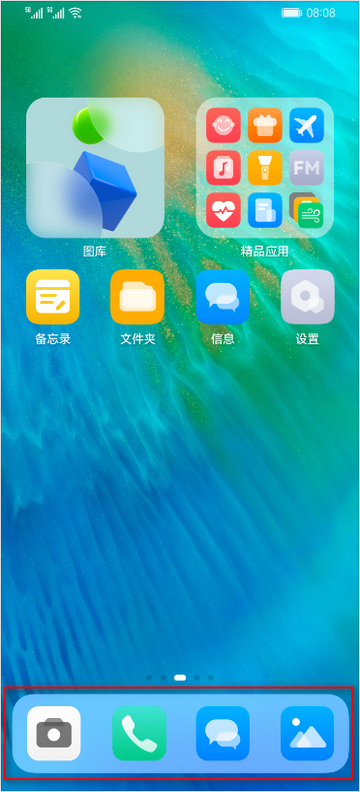 | 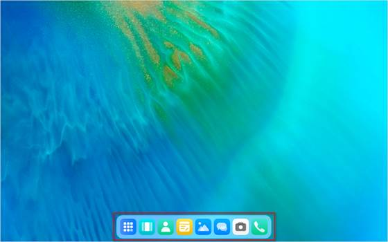 | 
| 大文件夹 | 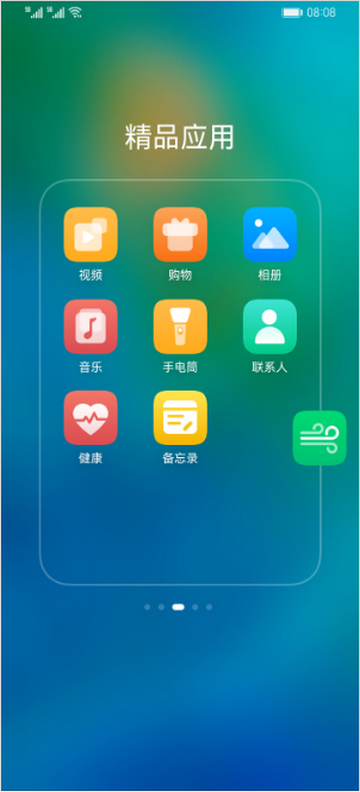 | 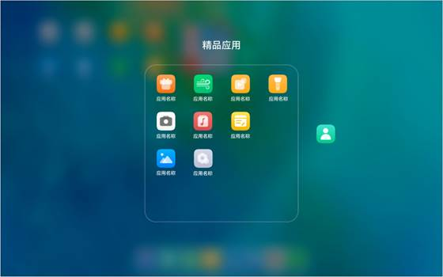 | 
| 应用中心 | NA | 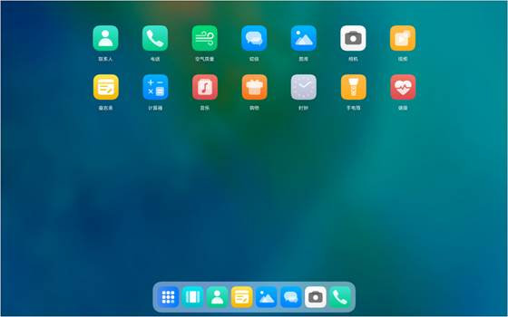 | 
| 键鼠适配 | NA | 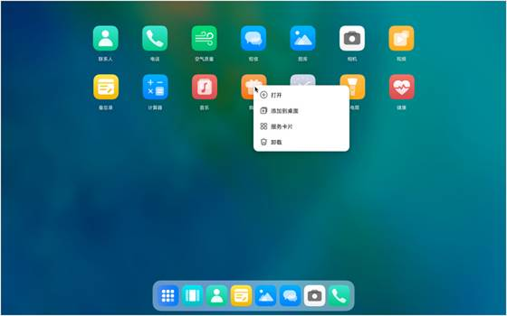 | 
| 桌面设置 |  | 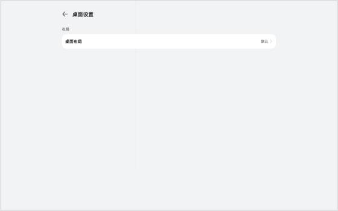 | 


## 部署模型

如前所述，为保证最佳的体验效果，桌面应用根据默认设备和平板的特性，做了深入定制。

- 不同设备桌面应用的特性规格有差异。
  - 平板有应用中心功能，平板通过快捷栏任务中心图标进入任务中心，才能看到全量应用。默认设备直接在桌面上显示全量应用，没有应用中心功能。
  - 默认设备不需要适配键鼠输入。

- 同一特性，在不同设备上页面跳转逻辑有差异。
  默认设备和平板的万能卡片管理页面完全不同，默认设备上是跳转到新的页面进行卡片管理操作，而平板上是直接在原有页面上弹出Dailog窗口进行卡片管理操作。

因此，桌面最终选择了[部署模型B](introduction.md#部署模型)，即默认设备和平板上部署不同的HAP包。


## 工程结构

  
```
/applications
├── common                             # 公共模块目录
│   └── src
│       └── main
│           └── ets
│               └── default
│                   ├── base           # 公共presenter层代码目录
│                   ├── bean           # 公共数据对象
│                   ├── cache          # 缓存目录
│                   ├── configs        # 应用配置对象目录
│                   ├── constants      # 应用常量对象目录
│                   ├── manager        # manager代码目录
│                   ├── model          # Model层代码目录
│                   ├── settings       # settings配置项
│                   ├── uicomponents   # 自定义组件目录
│                   └── utils          # 工具类代码目录
│
├── feature                            # feature层模块目录
│   ├── appcenter                      # 应用中心模块目录
│   ├── bigfolder                      # 大文件夹模块目录
│   ├── form                           # 卡片模块目录
│   ├── gesturenavigation              # 桌面设置模块目录
│   ├── launcherlayout                 # 桌面布局计算模块目录
│   ├── pagedesktop                    # 桌面设置模块目录
│   ├── recents                        # 最近任务模块目录
│   ├── settings                       # 桌面设置模块目录
│   └── smartdock                      # dock栏模块目录
│
└── product                            # 产品层模块目录
    ├── pad                            # 平板目录
    └── phone                          # 默认设备目录
```

桌面应用在开发阶段，采用了三层工程结构。默认设备和平板共用feature和common目录中的代码，仅在product目录中各自有部分独立代码。

- 业务形态层（product）
  包含不同产品形态的桌面。含桌面窗口、个性化业务、组件的配置以及个性化资源包。不同产品形态，编译出不同的Launcher的HAP包，各产品按需部署。

- 公共特性层（feature）
  抽象的公共特性组件集合，可以被product层不同形态的桌面所引用，并且在product层上做一些定制化的配置。

- 功能能力层（common）
  基础能力集，每个桌面形态都必须要依赖的模块。该层不可被分割，方便后续架构拓展和演进。


## 总结

本小节主要仅从工程结构角度介绍桌面应用，读者如果对其具体实现感兴趣，可以访问[桌面应用开源代码仓](https://gitee.com/openharmony/applications_launcher)了解详情。桌面应用在默认设备和平板上功能有较大差异，因此最终选择了部署模型B。虽然在默认设备和平板上是不同的安装包，但二者依然公用了非常多的代码。经统计，**共用代码占比在90%左右**。在后续拓展其它设备类型时，依然可以使用此部分公共代码。这既可以提高多设备场景开发效率，同时也可以降低后期的维护成本。
