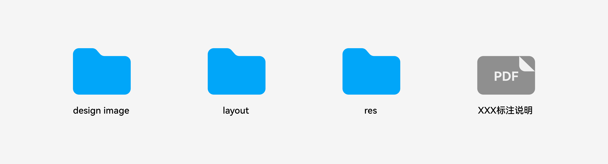
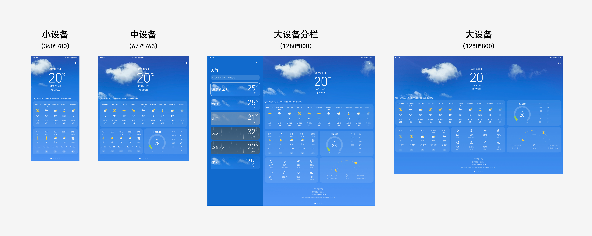
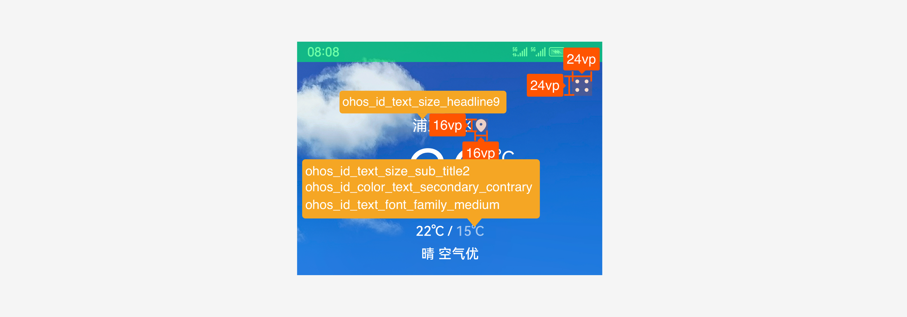
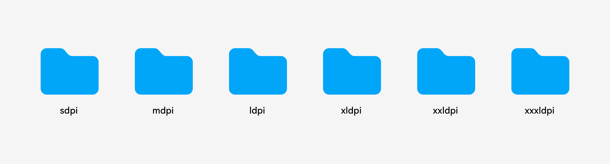
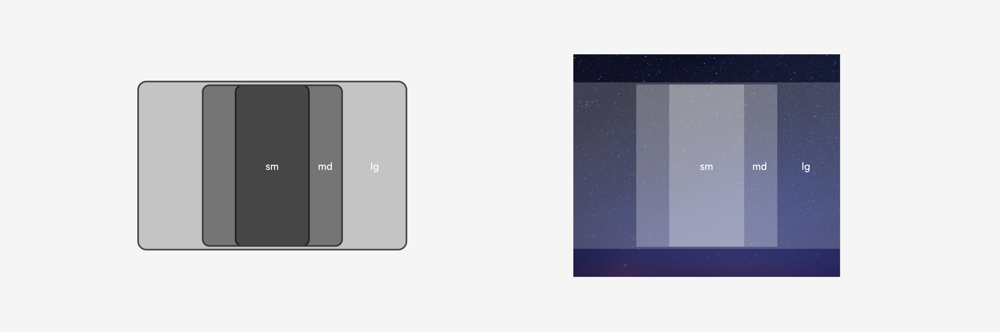
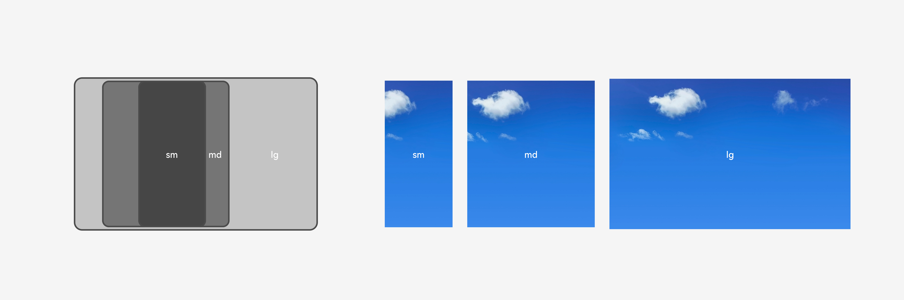

# 设计交付

## 概述

为了将UX设计详尽准确地实现并传递给开发者，设计师需向开发者提供必要的设计交付件，包括但不限于：应用规格说明、交互流程、视觉效果、视觉标注、视觉规格说明、切图资源、动效参数资源、音效资源等内容。

面向多设备多尺寸的应用UX设计交付件，以完整说明界面布局与视觉设计为主要目的，至少应包含：效果图、标注图、规格说明和切图资源。

下面将分别介绍不同交付内容的用途与规范。

## 效果图

效果图是表达UX设计的关键内容，用于直观呈现目标体验的静态效果，并作为开发者与测试工程师的实现与验收依据。效果图一般为jpg或png格式。

在优秀的设计交付件中，针对不同前置条件下，各交互流程所途经的每个界面都应匹配效果图。对于大量重复使用的组件元素，如弹窗和即时反馈，亦可配合规格统一说明，不做过多重复设计。

在多设备设计中，为了清晰表达设计效果，设计师仍需要针对不同尺寸的关键界面提供符合规范的效果图。关键界面包括且不限于：

- 应用的首页

- 可以从首页直接进入的各二级界面

- 核心使用流程途经的各界面

- 能体现多数界面的自适应与响应式规格的典型界面

不同尺寸的效果图，至少应包含小设备、中设备、大设备。根据业务涉及的设备特点，可补充超小尺寸效果，及不同设备的横竖屏效果，提前充分验证并优化UX设计体现的差异性、一致性、灵活性、兼容性。

对应不同设备效果图的设计画板尺寸推荐如下：

  | 设备类型 | 屏幕宽度 | 画板尺寸（vp） | 
| -------- | -------- | -------- |
| 超小设备 | [0,&nbsp;320) | 240\*320 | 
| 小设备 | [320,&nbsp;520) | 360\*780 | 
| 中设备 | [520,&nbsp;840) | 677\*763 | 
| 大设备 | [840,&nbsp;+) | 1280\*800 | 

多设备效果示意图

> **说明：**
> - 画板尺寸为不同宽度断点下的典型设备屏幕尺寸，可根据业务具体针对的设备选择其他画板尺寸。
> 
> - 画板尺寸以vp为单位提供，根据实际设计所需精度，可统一把设计文档中所有画板设置为1倍或多倍的px尺寸。
> 
> - 当效果图需要展示一屏以上的内容，如列表内容较长时，建议保持宽度不变并增加画板高度以容纳更多内容。

## 标注图

标注图是向开发者传递界面上每个元素详细属性，以指导代码完整实现UX设计的图像化文档。界面元素的属性包括：色彩、尺寸、字体、圆角、间距、阴影、模糊、缩放、所用的组件、自适应布局、响应式布局等。标注图一般为jpg或png格式。

在优秀的设计交付件中，不同类型属性的标注文本大小一致、色彩不一、互不重叠，并与效果图内容在视觉上良好区隔。标注图数量与关键界面效果图一一对应，如遇到较复杂的界面，为了更清晰说明规格，也有多张标注图对应一张效果图的情况。

随着设计与开发工具的演进，一些业界工具支持界面元素属性的自动识别并创建标注，也可导出支持动态展示标注的效果图文档，一般为html格式。OpenHarmony应用的设计交付同样可以借助这些工具作为标注图的补充内容，但必选的分层参数仍需设计师专门确认并手动完成标注。

除了尺寸、间距等强依赖于业务具体设计的参数，色彩、字体、圆角、阴影、模糊等属性应尽可能使用分层参数完成标注。

标注示意图

> **说明：**
> - 如遇到分层参数覆盖不到的属性值，可按照具体设计效果标注。此时必须详细考虑不同场景下该元素的效果。

## 规格说明

规格说明是一份专门编写的文档，用于更完整清晰地说明界面间的通用元素与变化规则，一般为pdf格式。规格说明不是UX设计交付件中的必选项，但它能帮助设计师节省很多重复性工作，帮助开发者快速理解UX设计规格，在面向多设备的应用设计交付中非常推荐。

在多设备设计中，规格说明常用于并排展示同一界面在不同尺寸下的效果，并说明栅格变化规则。

一多规范栅格图

## 切图资源

包含在设计效果中的素材，如图标、图片、序列帧等，应根据实际需要输出为合适的格式提供开发者置入界面内。

为了更好在多设备上根据设备dpi展示清晰的图像，一分优秀的应用应含有多套同名的切图资源，它们分别存放在mdpi、ldpi、xldpi、xxldpi的文件夹目录下，最终会存放到应用资源包的同名路径中。

多套同名切图文件夹示意图

图标资源可以是png、jpg、webp、svg等格式。推荐在多设备设计中使用svg图标资源，因为能充分利用矢量图片体积较小、可以自由缩放且不出现锯齿、可根据色彩参数实时赋色的特点，仅用一套资源即可满足复杂场景的UX规范。如使用其他位图格式如png、jpg、webp，则需分别交付各dpi下的切图资源，以达到边缘像素清晰的体验。

图片资源可以是png、jpg、webp等格式。与图标资源类似，一般应提供各dpi下的图片资源。在不同dpi下对边缘像素要求不高的图片如背景图，则推荐按照更高dpi提供一张资源复用到各dpi，以减少应用包大小。

在多设备设计中，图片也可根据设计效果，在不同宽度断点使用同一个资源，或分别交付：

- 当图片所在组件接口提供的缩放显示机制满足UX设计效果，可以用同一个资源

- 当图片所在组件接口提供的缩放显示机制不满足、且不可通过简单的自定义规则实现UX效果，则推荐使用不同资源

夜晚单张适配多设备宽度示意图

晴天多张适配多设备宽度示意图

