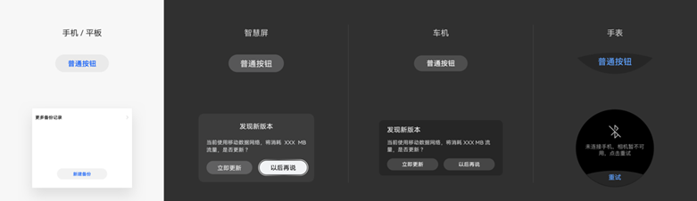
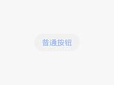

# 多态控件

为了支持多设备，应用需要能够在不同的设备上运行，控件作为应用的基础组成部分，需要支持不同的设备，且在视觉、交互、动效等表现形式上针对设备进行必要的调整，达到最佳体验。因此，同一控件在不同的设备上会呈现出不同的形态，称为多态控件。

多态控件应该具备以下特点：

- 覆盖默认设备、平板，兼顾智慧屏、车机、智能穿戴等终端。

- 场景一致性。在对应的使用场景下，其交互、视觉、动效要保持一致，在设计上属性参数保持一致或差异化。

- 针对设备做优化。多态控件在不同的设备上的呈现应该是该设备下的最佳效果，因此在保证一致性的同时，还需要针对设备的特点进行优化。

## 控件的状态

- 控件的状态是一种视觉呈现，用于展示控件当前处于何种交互阶段。不同控件的相同状态应该保持一致的视觉风格，且应该清晰可见。

- 应用可能部署在不同设备上供用户使用，有些设备会支持多种输入方式。例如平板可以连接蓝牙键盘和鼠标来做文字编辑工作，此时控件需要同时满足键盘和鼠标交互，需要支持获焦态和悬停态，如果控件没有支持这两种状态，在使用键盘走焦时或鼠标悬停时，控件就无法通过呈现出相应的状态为用户提供正确的视觉引导。OpenHarmony默认提供多种交互方式的控件实现，方便开发者支持多种输入方式和交互归一。

常见的状态类型：

| | | |
| -------- | -------- | -------- |
|  **正常态** 表明当前控件可交互。 |  **不可用态** 表明当前控件不可交互。一般使用灰显的方式呈现。 |  **点击态** 表明当前控件当前处于点击状态。 操作：手指或鼠标按下且未释放。 |
|  **获焦态** 表明当前控件处于焦点状态。操作： -&nbsp;键盘或遥控器通过方向键将焦点从一个控件移动到另外一个控件。 -&nbsp;通过语音操作，使得控件获得焦点。 |  **激活态** 表明当前控件处于激活的状态。用于有多个元素可获焦的控件 操作：焦点处在页签控件的某个页签上时，该页签获焦。点击此页签，该页签被激活。 |  **悬停态** 表明当前控件处于鼠标悬停的状态。 操作：将鼠标悬停在控件之上。 |

## 弹出框

弹出框是一种模态窗口，在弹出框消失之前，用户无法操作其他界面内容，干扰性比较强。通常用来展示用户当前需要的或用户必须关注的信息或操作，其他情况不建议使用弹出框，可考虑通知等其他非模态窗口。 弹出框的内容通常是不同控件进行组合布局。例如文本（可带格式，如缩进、链接、粗体等）、列表、输入框、网格、图标或图片等，常用于选择或确认信息。
