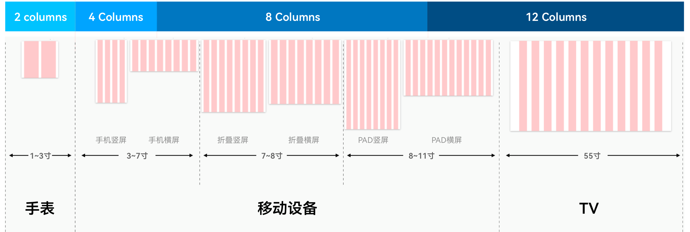
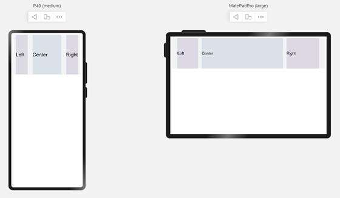

# 栅格断点系统


栅格断点系统定义了不同水平宽度设备对应的Column数量关系，形成了一套断点规则定义。其以水平值作为断点依据，不同的设备根据自身当前水平宽度值在不同断点范围内的情况，显示不同数量的栅格数。





| 水平宽度&nbsp;(vp) | SizeType类型 | Columns数量 | 默认Margin | 默认Gutter | 典型设备 |
| -------- | -------- | -------- | -------- | -------- | -------- |
| [0,&nbsp;320) | XS | 2 | 12vp | 12vp | 智能穿戴 |
| [320,&nbsp;600) | SM | 4 | 24vp | 24vp | 默认设备 |
| [600,&nbsp;840) | MD | 8 | 32vp | 24vp | 智慧屏、竖屏状态的平板等 |
| [840,&nbsp;+∞) | LG | 12 | 48vp | 24vp | 车机、横屏状态的平板等 |


>  **说明：**
> - 请访问[栅格布局](https://gitee.com/openharmony/docs/blob/master/zh-cn/application-dev/ui/ui-ts-layout-grid-container.md)，了解栅格布局更详细的介绍。
> 
> - 声明式开发范式，请访问[GridContainer组件](https://gitee.com/openharmony/docs/blob/master/zh-cn/application-dev/reference/arkui-ts/ts-container-gridcontainer.md)及[栅格设置](https://gitee.com/openharmony/docs/blob/master/zh-cn/application-dev/reference/arkui-ts/ts-universal-attributes-grid.md)，了解栅格布局的详细用法。
> 
> - 类Web开发范式，通过[grid-container](https://gitee.com/openharmony/docs/blob/master/zh-cn/application-dev/reference/arkui-js/js-components-grid-container.md)、 [grid-row](https://gitee.com/openharmony/docs/blob/master/zh-cn/application-dev/reference/arkui-js/js-components-grid-row.md)、[grid-col](https://gitee.com/openharmony/docs/blob/master/zh-cn/application-dev/reference/arkui-js/js-components-grid-col.md)组件来实现栅格布局，请访问相应的链接了解其详细用法。


## 示例：

- 默认设备屏幕宽度为360vp，属于SizeType.SM类型设备，Column数量为4。根据示例代码配置，在该设备上，Left占1列，Center占2列，Right占1列。

- 平板屏幕宽度为1024vp，属于SizeType.LG类型设备，Column数量为12。根据示例代码配置，在该设备上，Left占2列，Center占7列，Right占3列。




```ts
@Entry
 @Component
 struct GridContainerExample1 {
   build(){
     GridContainer() {
       Row({}) {
         Row() {
           Text('Left').fontSize(25)
         }
         .useSizeType({
           xs: { span:1, offset:0 }, sm: { span:1, offset:0 },
           md: { span:1, offset:0 }, lg: { span:2, offset:0 }
         })
         .height("100%")
         .backgroundColor(0x66bbb2cb)
         Row() {
           Text('Center').fontSize(25)
         }
         .useSizeType({
           xs: { span:1, offset:0 }, sm: { span:2, offset:1 },
           md: { span:5, offset:1 }, lg: { span:7, offset:2 }
         })
         .height("100%")
         .backgroundColor(0x66b6c5d1)
         Row() {
           Text('Right').fontSize(25)
         }
         .useSizeType({
           xs: { span:1, offset:0 }, sm: { span:1, offset:3 },
           md: { span:2, offset:6 }, lg: { span:3, offset:9 }
         })
         .height("100%")
         .backgroundColor(0x66bbb2cb)
       }
       .height(200)
     }
     .backgroundColor(0xf1f3f5)
     .margin({ top:10 })
   }
 }
```
