# 工程管理


<!--Del-->
DevEco Studio的基本使用，请参考[DevEco Studio使用指南](https://developer.huawei.com/consumer/cn/doc/harmonyos-guides/ide-tools-overview)。<!--DelEnd-->本章主要介绍如何使用DevEco Studio进行多设备应用开发。


> **说明：**
> 本章的内容基于DevEco Studio 3.1.1 Release版本进行介绍，如您使用DevEco Studio其它版本，可能存在文档与产品功能界面、操作不一致的情况，请以实际功能界面为准。


## 工程创建

<!--Del-->
参考[创建系统工程](https://developer.huawei.com/consumer/cn/doc/harmonyos-guides-V13/ide-create-new-project-V13)，先创建出最基本的项目工程。<!--DelEnd-->

可以看到DevEco Studio创建出的默认工程，仅包含一个的entry类型的模块。

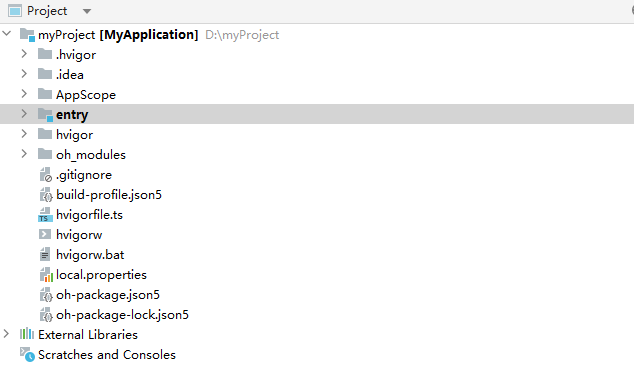

如果直接使用如下所示的平级目录进行模块管理，工程逻辑结构较混乱且模块间的依赖关系不够清晰，不利于开发及后期维护。


```
/application
├── common
├── feature1
├── feature2
├── featureN
├── wearable
├── default
└── productN
```

更推荐使用本文[部署模型](introduction.md#部署模型)小节中介绍的common、features、product三层工程结构。工程结构示例如下所示：


```
/application
 ├── common                  # 公共特性目录
 │
 ├── features                # 功能模块目录
 │   ├── feature1            # 子功能
 │   ├── feature2            # 子功能2
 │   └── ...                 # 子功能n
 │
 └── product                 # 产品层目录
     ├── wearable            # 智能穿戴泛类目录
     ├── default             # 默认设备泛类目录
     └── ...
```

接下来将依次介绍如何新建Module、修改配置文件以及调整目录，以实现“一多”推荐的“三层工程结构”。


## 新建Module

参考[开发ohpm包](https://developer.huawei.com/consumer/cn/doc/harmonyos-guides-V13/ide-har-V13)，新建三个ohpm模块，分别命名为common、feature1、feature2。参考[添加/删除Module](https://developer.huawei.com/consumer/cn/doc/harmonyos-guides-V13/ide-add-new-module-V13)，新建一个entry类型的模块，假设命名为“wearable”（仅仅为了说明某一类产品）。示例如下：

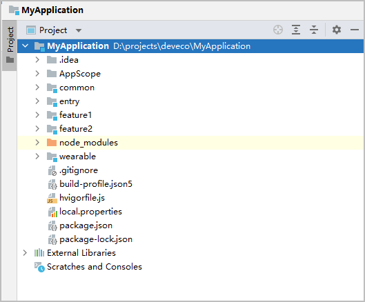

> **说明：**
> - 在一个工程中同一个设备类型只支持一个Entry类型的模块。
> 
> - 在下一个小节，我们将介绍如何修改Module的配置，包括Module的类型以及其支持的设备类型等。


## 修改Module配置


### 修改Module名称

修改创建工程时默认的entry模块名称。在该模块上点击鼠标右键，依次选择”Refactor -&gt; Rename”，将名称修改为default。

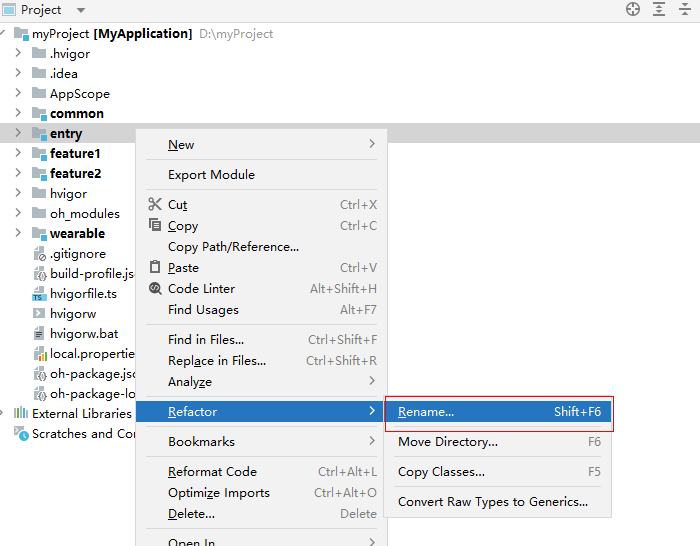


### 修改Module类型及其设备类型

通过修改每个模块中的配置文件（module.json5）对模块进行配置，配置文件中各字段含义详见[配置文件说明](../../quick-start/module-configuration-file.md)。

<!--RP1-->
- 将default模块的deviceTypes配置为["default", "tablet"]，同时将其type字段配置为entry。
  即default模块编译出的HAP在默认设备和平板上安装和运行。<!--RP1End-->

  <!--RP2-->
  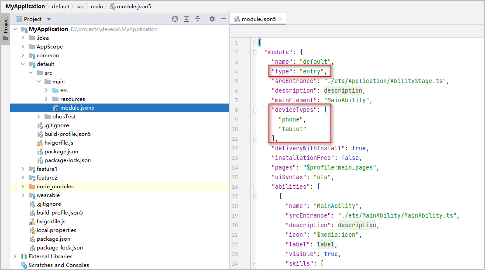<!--RP2End-->

- 将wearable模块的deviceTypes配置为["wearable"]，同时将其type字段配置为entry。
  即wearable模块编译出的HAP仅在智能穿戴设备上安装和运行。

  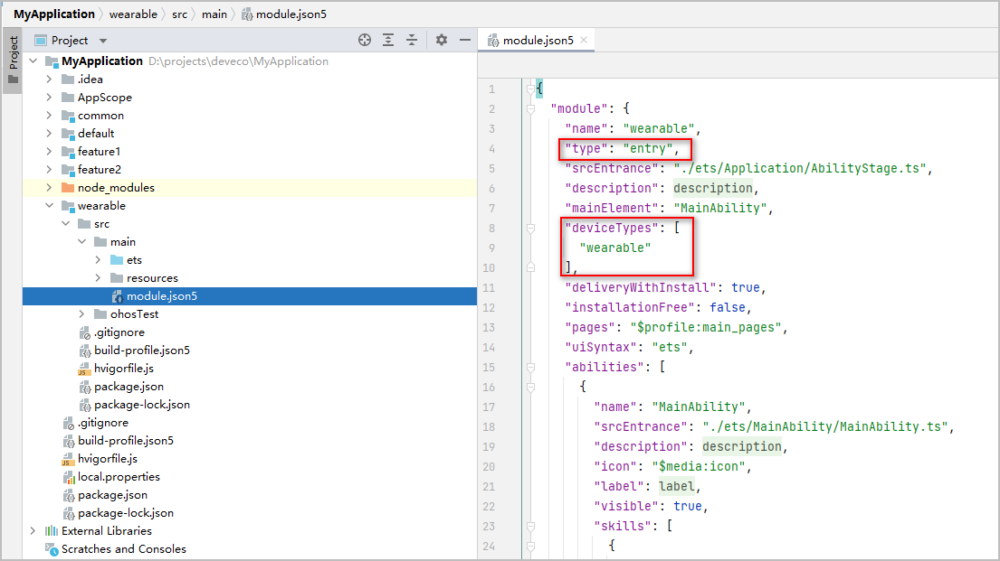


## 调整目录结构

调整目录结构

在工程根目录（MyApplication）上点击鼠标右键，依次选择“New -&gt; Directory”新建子目录。创建product和features两个子目录。

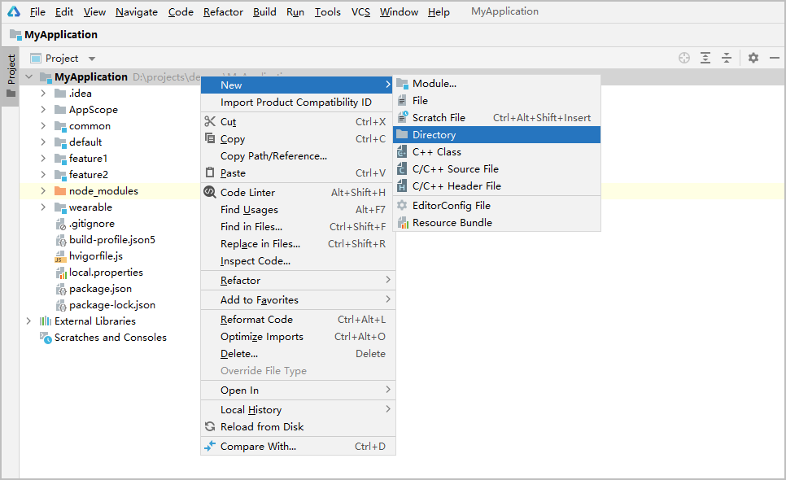

用鼠标左键将default目录拖拽到新建的product目录中，在DevEco Studio弹出的确认窗口中，点击“Refactor”即可。

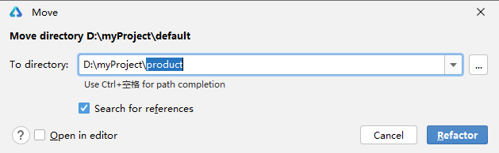

按照同样的步骤，将wearable目录放到product目录中，将feature1和feature2放到features目录中。

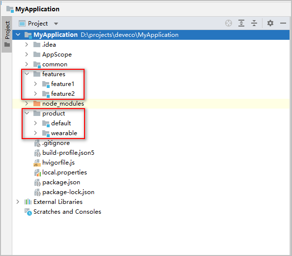


## 修改依赖关系

回顾之前小节中关于“工程结构”的介绍，我们推荐在common目录中存放基础公共代码，features目录中存放相对独立的功能模块代码，product目录中存放完全独立的产品代码。这样在product目录中依赖features和common中的公共代码来实现功能，可以最大程度实现代码复用。

配置依赖关系可以通过修改模块中的oh-package.json5文件。如下图所示，通过修改default模块中的oh-package.json5文件，使其可以使用common、feature1和feature2模块中的代码。更多详情参考[配置系统ohpm包依赖](https://developer.huawei.com/consumer/cn/doc/harmonyos-guides-V13/ide-har-import-V13)。

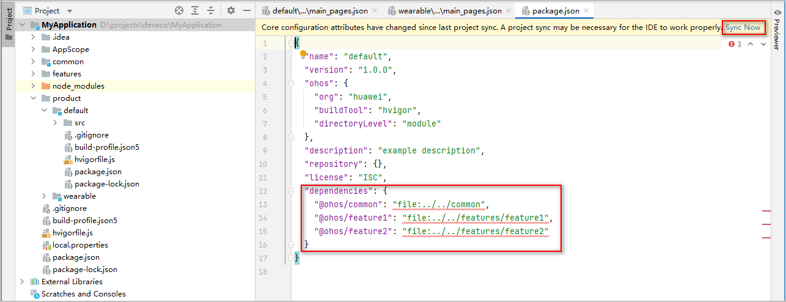

同样的，修改feature1和feature2模块中的oh-package.json5文件，使其可以使用common模块中的代码。

修改oh-package.json5文件后，请点击右上角的“Sync Now”，否则改动不会生效。


## 引用ohpm包中的代码

在[开发ohpm包](https://developer.huawei.com/consumer/cn/doc/harmonyos-guides-V13/ide-har-V13)中，仅介绍了如何使用ohpm包中的页面和资源，本小节以例子的形式补充介绍如何使用ohpm包中的类和函数。

示例如下：

- 在common模块中新增ComplexNumber类，用于表征复数（数学概念，由实部和虚部组成），该类包含toString()方法，将复数转换为字符形式。

- 在common模块中新增Add函数，用于计算并返回两个数字的和。

- 在default模块中，使用common模块新增的ComplexNumber类和Add函数。

1. 在”common/src/main/ets”目录中，按照需要新增文件和自定义类和函数。
   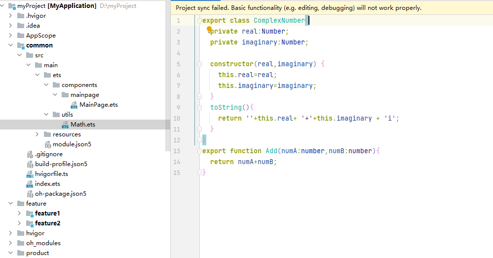

2. 在”common/index.ets”文件中，申明需要export的类、函数的名称及在当前模块中的位置，否则其它模块无法使用。
   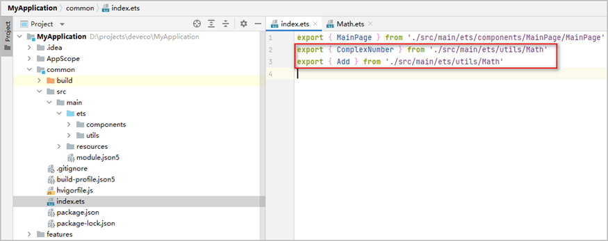

3. 在default模块中import和使用这些类和函数。注意提前在default模块的oh-package.json5文件中配置对common模块的依赖关系。
   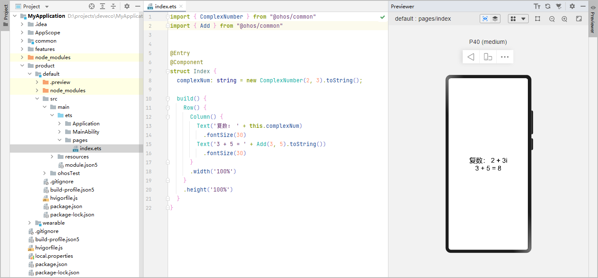

> **说明：**
>
> 如果需要将ohpm包发布供其他开发者使用，具体可参考[发布ohpm包](https://developer.huawei.com/consumer/cn/doc/harmonyos-guides-V13/ide-har-publish-V13)。


## 总结

本章主要介绍了如何实现推荐的工程结构，以便更好的进行多设备应用开发。

关于DevEco Studio的基本使用，比如如何进行编译构建、如何签名、如何使用预览器等，[DevEco Studio使用指南](https://developer.huawei.com/consumer/cn/doc/harmonyos-guides-V13/ide-tools-overview-V13)中已经有非常详尽的介绍，本文不再重复介绍。
